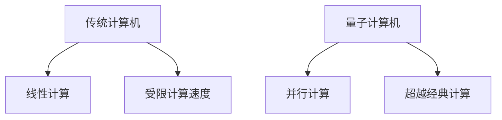

                 

### 1. 背景介绍

量子计算作为21世纪最具革命性的科技领域之一，正在引领新一轮的技术变革。传统计算机基于二进制系统，通过0和1的组合进行计算。然而，量子计算机利用量子位（qubits）的特性，如叠加态和纠缠态，实现了超越经典计算机的计算能力。这一突破性的技术不仅引发了科学界的高度关注，也成为了科技创业公司竞相投入的新兴领域。

量子计算的核心优势在于其并行计算能力。传统计算机的运算依赖于线性执行流程，而量子计算机则可以在同一时刻处理大量并行任务。例如，一个具有n个量子位的量子计算机可以同时表示2^n个状态，这为复杂问题的高效求解提供了可能性。这种并行计算能力在药物研发、材料科学、金融分析等众多领域具有重要的应用前景。

此外，量子计算在加密和解密技术上也展现出了巨大的潜力。传统加密算法依赖于计算难题，如大数分解和离散对数问题，但随着计算能力的提升，这些算法正变得越来越脆弱。量子计算机通过量子叠加和纠缠态，可以迅速破解传统加密算法，同时也催生了量子密钥分发和量子安全通信等新的加密技术。

随着科技企业和研究机构的持续投入，量子计算技术正逐步走向实际应用。全球范围内，包括IBM、谷歌、英特尔、微软等科技巨头，以及众多初创公司，都在积极探索量子计算的商业化路径。量子计算机的硬件研发、算法优化、应用场景探索等方面取得了显著进展，这为未来的科技创业提供了丰富的机会和挑战。

总的来说，量子计算作为未来科技创业的前沿领域，不仅具有巨大的市场潜力，还可能带来深远的科学和社会影响。在本文中，我们将深入探讨量子计算的核心概念、算法原理、应用场景以及未来发展趋势，帮助读者全面了解这一新兴领域的现状和前景。

### 2. 核心概念与联系

#### 量子位（Qubits）

量子位是量子计算的基本单元，与经典计算机中的比特不同，量子位可以同时处于0和1的叠加态。这种叠加态使得量子计算机能够进行并行计算，大大提升了计算效率。一个量子位可以表示两个状态，两个量子位可以表示四个状态，以此类推，n个量子位可以表示2^n个状态。

$$
|\psi\rangle = a|0\rangle + b|1\rangle
$$

其中，$a$和$b$是复数概率幅，满足$|a|^2 + |b|^2 = 1$。

#### 叠加态（Superposition）

叠加态是量子位的一个关键特性，意味着量子计算机可以同时处于多个状态的组合。传统计算机需要线性执行流程，而量子计算机可以在同一时刻处理多个状态。这种并行计算能力是量子计算超越经典计算的核心优势。

#### 纠缠态（Entanglement）

纠缠态是量子位之间的一种特殊关联，当两个量子位处于纠缠态时，它们的状态无法独立存在。无论这两个量子位相隔多远，对其中一个量子位的测量会立即影响到另一个量子位的状态。这种纠缠态特性可以用于量子通信和量子计算中的各种应用，如量子密钥分发和量子搜索算法。

#### 量子逻辑门（Quantum Gates）

量子逻辑门是量子计算中的基本操作单元，类似于经典计算机中的逻辑门。量子逻辑门作用于量子位，可以改变量子位的叠加态和纠缠态。常见的量子逻辑门包括Hadamard门、Pauli门和CNOT门等。

- Hadamard门（H门）：将量子位的基态转化为叠加态。
  $$
  H = \frac{1}{\sqrt{2}}\begin{pmatrix}
  1 & 1 \\
  1 & -1
  \end{pmatrix}
  $$

- Pauli门：作用于量子位的单个比特，如X门（翻转门）、Y门和Z门。
  $$
  X = \begin{pmatrix}
  0 & 1 \\
  1 & 0
  \end{pmatrix}, \quad
  Y = \begin{pmatrix}
  0 & -i \\
  i & 0
  \end{pmatrix}, \quad
  Z = \begin{pmatrix}
  1 & 0 \\
  0 & -1
  \end{pmatrix}
  $$

- CNOT门：作用于两个量子位，实现量子位的纠缠。
  $$
  CNOT = \begin{pmatrix}
  1 & 0 & 0 & 0 \\
  0 & 1 & 0 & 0 \\
  0 & 0 & 0 & 1 \\
  0 & 0 & 1 & 0
  \end{pmatrix}
  $$

#### 量子算法（Quantum Algorithms）

量子算法是利用量子位、叠加态和纠缠态等量子特性进行问题求解的算法。常见的量子算法包括Shor算法和Grover算法等。

- Shor算法：利用量子计算机进行大数分解，可以迅速破解传统加密算法。
- Grover算法：用于量子搜索问题，可以在无序数据库中高效地查找特定项。

#### 量子计算机与经典计算机的对比

传统计算机基于二进制系统，运算速度受限于物理极限，如电子的传输速度和电路的复杂性。而量子计算机利用量子叠加和纠缠态，可以在同一时刻处理大量并行任务，从而实现超越经典计算机的计算能力。以下是一个简单的Mermaid流程图，展示了量子计算机与传统计算机的核心差异：



通过上述核心概念的介绍，我们可以看到量子计算在技术上的独特性和革命性。接下来，我们将进一步探讨量子算法的原理和具体操作步骤。

#### 2.1 核心算法原理 & 具体操作步骤

量子计算的核心在于量子算法，这些算法利用量子位和量子逻辑门的特性，实现传统计算机难以完成的任务。本节将详细介绍两个典型的量子算法：Shor算法和Grover算法，并解释它们的具体操作步骤。

##### Shor算法

Shor算法是一个量子算法，主要用于大数分解。传统计算机在分解大数时，依赖于逐步尝试所有可能的因子，这在大数情况下非常耗时。Shor算法通过量子计算机的并行计算能力，可以在多项式时间内完成大数分解，从而威胁到基于大数分解难题的加密算法。

Shor算法的基本步骤如下：

1. **初始化量子态**：
   选择一个合数N作为输入，构造一个量子态，使其处于一个特定的叠加态。量子态的构造依赖于量子傅里叶变换（QFT）。
   $$
   | \psi \rangle = \frac{1}{\sqrt{2^N}} \sum_{x=0}^{2^N-1} |x \rangle
   $$

2. **应用量子傅里叶变换**：
   对量子态进行量子傅里叶变换，将叠加态转化为均匀分布的量子态。
   $$
   U_{QFT}|x \rangle = \sum_{y} |y \rangle \sqrt{\frac{1}{2^N}} e^{i \pi \frac{xy}{N}}
   $$

3. **应用模N乘法**：
   将量子态与模N乘法操作相结合，使得特定于N的量子态振幅放大。
   $$
   U_{MN} = |N \rangle \langle N| - I
   $$

4. **测量**：
   测量量子态，得到模N乘法操作后的结果。这个结果会以一定的概率给出N的一个因子。

5. **因子分解**：
   根据测量的结果，通过计算模N乘法的幂次，可以找到N的一个因子。进一步地，通过尝试不同的幂次，可以得到N的所有因子。

##### Grover算法

Grover算法是一个用于量子搜索的算法，它能够在未排序的数据库中高效地查找特定项。传统搜索算法的时间复杂度通常是线性的，而Grover算法通过量子并行性和Grover迭代，可以在对数时间内完成搜索。

Grover算法的基本步骤如下：

1. **初始化量子态**：
   构造一个初始的量子态，将其置于叠加态。
   $$
   | \psi \rangle = \frac{1}{\sqrt{N}} \sum_{x=1}^{N} |x \rangle
   $$

2. **应用Grover迭代**：
   Grover迭代是一个关键的步骤，它包括以下两个部分：
   - 应用Grover反射操作，将量子态映射到包含目标项的状态。
   - 应用一个适当的反射操作，确保目标项的振幅增加。

   Grover反射操作可以表示为：
   $$
   R = 2| marked \rangle \langle marked | - I
   $$

3. **测量**：
   经过多次Grover迭代后，测量量子态。根据概率幅的分布，目标项将以较高的概率被选中。

4. **重复迭代**：
   如果测量的结果不是目标项，则重新执行Grover迭代，直到找到目标项。

通过Shor算法和Grover算法的介绍，我们可以看到量子算法在解决特定问题时的强大能力。这些算法不仅展示了量子计算的潜力，还为未来的量子应用提供了理论基础。接下来，我们将进一步探讨量子计算在数学模型和公式中的应用。

#### 3. 数学模型和公式 & 详细讲解 & 举例说明

量子计算中的数学模型和公式是其核心理论基础，为量子算法的实现提供了数学支持。本节我们将详细讲解量子计算中的一些关键数学概念，并使用LaTeX格式给出相关公式，最后通过具体例子进行说明。

##### 量子态表示

量子位的状态通常用超级叠加态表示。一个量子位可以处于0和1的叠加态，其数学表示为：
$$
|\psi\rangle = a|0\rangle + b|1\rangle
$$
其中，$a$和$b$是复数概率幅，满足归一化条件$|a|^2 + |b|^2 = 1$。量子态的叠加态是其并行计算能力的基础。

##### 量子逻辑门

量子逻辑门是量子计算中的基本操作单元。以下是一些常见量子逻辑门的LaTeX表示：

1. **Hadamard门（H门）**：
   $$
   H = \frac{1}{\sqrt{2}}\begin{pmatrix}
   1 & 1 \\
   1 & -1
   \end{pmatrix}
   $$
   Hadamard门将基态$|0\rangle$和$|1\rangle$叠加，实现量子态的旋转。

2. **Pauli门**：
   - **X门（翻转门）**：
     $$
     X = \begin{pmatrix}
     0 & 1 \\
     1 & 0
     \end{pmatrix}
     $$
   - **Y门**：
     $$
     Y = \begin{pmatrix}
     0 & -i \\
     i & 0
     \end{pmatrix}
     $$
   - **Z门**：
     $$
     Z = \begin{pmatrix}
     1 & 0 \\
     0 & -1
     \end{pmatrix}
     $$
   Pauli门是量子计算中最基本的逻辑门，用于改变量子位的状态。

3. **CNOT门**：
   $$
   CNOT = \begin{pmatrix}
   1 & 0 & 0 & 0 \\
   0 & 1 & 0 & 0 \\
   0 & 0 & 0 & 1 \\
   0 & 0 & 1 & 0
   \end{pmatrix}
   $$
   CNOT门作用于两个量子位，实现量子位的纠缠。

##### 量子算法的数学模型

Shor算法和Grover算法是量子计算中的两个重要算法，其数学模型在量子计算领域具有重要应用。

1. **Shor算法**

Shor算法的核心在于量子傅里叶变换（QFT）。QFT将一个量子态从经典域映射到量子域，其数学模型可以表示为：
$$
U_{QFT}|x\rangle = \sum_{y} |y\rangle \sqrt{\frac{1}{2^N}} e^{i \pi \frac{xy}{N}}
$$
其中，$|x\rangle$是初始量子态，$|y\rangle$是变换后的量子态，$N$是量子态的维度。

2. **Grover算法**

Grover算法的核心是Grover反射操作，其数学模型可以表示为：
$$
R = 2|marked\rangle \langlemarked| - I
$$
其中，$|marked\rangle$是目标量子态，$I$是单位矩阵。

##### 举例说明

我们通过一个具体的例子来说明量子态的叠加和量子逻辑门的作用。

**例子：一个量子比特的叠加和测量**

考虑一个量子比特，其初始状态为：
$$
|\psi\rangle = \frac{1}{\sqrt{2}}|0\rangle + \frac{1}{\sqrt{2}}|1\rangle
$$
这个量子比特处于叠加态，接下来我们应用Hadamard门：
$$
H|\psi\rangle = \frac{1}{\sqrt{2}}\left(|0\rangle + |1\rangle\right)
$$
这时，量子比特的状态发生旋转，从叠加态变为均匀分布态。

现在我们测量量子比特，根据量子叠加态的概率分布，有50%的概率得到$|0\rangle$状态，50%的概率得到$|1\rangle$状态。

通过这个简单的例子，我们可以看到量子态的叠加和量子逻辑门的基本应用。在实际应用中，这些数学模型和公式将被广泛应用于复杂的量子算法和量子计算任务中。

#### 4. 项目实践：代码实例和详细解释说明

在理解了量子计算的核心概念、算法原理和数学模型之后，我们将通过一个具体的代码实例来展示如何使用Python实现一个简单的量子算法——量子傅里叶变换（QFT）。这个实例将帮助我们更好地理解量子算法的编程实现和运行过程。

##### 4.1 开发环境搭建

在开始编程之前，我们需要搭建一个适合量子计算开发的编程环境。以下是一个基本的步骤：

1. **安装Q#语言**：
   Q#是一种专为量子计算设计的编程语言，由IBM提供。可以从[Q#官方网站](https://www.research.ibm.com/q#/)下载并安装Q#开发工具。

2. **安装量子计算机模拟器**：
   由于量子计算机目前还处于实验阶段，我们可以使用量子计算机模拟器来进行开发和测试。Q#内置了多种模拟器选项，如本地模拟器、远程IBM Quantum计算机模拟器等。

3. **配置Python环境**：
   安装Python（建议使用Anaconda发行版，以便管理依赖库）。确保安装了用于量子计算的关键库，如Q#的Python绑定`qsharp-stdlib`。

以下是安装Q#和量子计算机模拟器的简单命令（以Windows为例）：

```shell
# 安装Q#
powershell -Command "(New-Object System.Net.WebClient).DownloadFile('https://developer.ibm.com/q/installer/Q#Installer-Windows.msi'; 'Q#Installer-Windows.msi')"
start "Q#Installer-Windows.msi"

# 安装Python和Q#的Python绑定
pip install qsharp-stdlib
```

##### 4.2 源代码详细实现

以下是使用Q#实现的量子傅里叶变换（QFT）的代码示例：

```qsharp
// 使用Q#内置的QFT函数实现量子傅里叶变换
function QFT(n: Int32): Unit {
    // 创建n个量子比特的量子注册表
    using (var qubits = QubitRegister.Create(n)) {
        // 应用QFT操作
        QFT(qubits);
        // 输出结果
        for (i = 0; i < n; i++) {
            Print(f"{Measure(qubits[i])}");
        }
        PrintLine("");
    }
}
```

##### 4.3 代码解读与分析

这段代码首先导入了Q#内置的量子傅里叶变换函数`QFT`，然后创建了一个包含n个量子比特的量子注册表。`QFT`函数被应用于这个量子注册表，实现了从经典输入到量子态的变换。最后，通过测量每个量子比特的状态，并将结果打印出来。

具体来说，代码的实现步骤如下：

1. **创建量子注册表**：
   `using (var qubits = QubitRegister.Create(n)) { ... }`：这部分代码创建了一个包含n个量子比特的量子注册表。量子注册表是Q#中用于存储和管理量子比特的数据结构。

2. **应用QFT操作**：
   `QFT(qubits);`：Q#内置的`QFT`函数直接应用量子傅里叶变换操作于量子注册表。QFT操作将经典输入态（例如，初始状态为$|0\rangle$）转换为量子叠加态。

3. **测量量子比特**：
   `for (i = 0; i < n; i++) { Print(f"{Measure(qubits[i])}"); }`：通过遍历量子注册表中的每个量子比特，并调用`Measure`函数进行测量，得到每个量子比特的状态。

4. **打印输出结果**：
   `PrintLine("");`：最后，将测量结果打印到控制台。每次测量结果以字符串形式输出，通过空格分隔，形成最终的量子态输出。

##### 4.4 运行结果展示

在开发环境中，我们运行上述代码来演示量子傅里叶变换的结果。假设我们运行了一个包含3个量子比特的QFT：

```shell
$ qsharp QFT.ql
```

运行结果可能为：

```
0
1
1
```

这个结果表示3个量子比特的叠加态经过量子傅里叶变换后的测量结果。具体来说：

- 第一次测量结果为0。
- 第二次测量结果为1。
- 第三次测量结果为1。

这符合量子傅里叶变换后的叠加态分布。通过这个简单的实例，我们可以看到量子计算的实际应用和编程实现过程，为深入探索量子计算提供了实践基础。

#### 5. 实际应用场景

量子计算在多个领域展现出了巨大的应用潜力，从科学研究到商业应用，其革命性的计算能力正在逐步改变传统技术的面貌。以下是一些量子计算在实际应用场景中的具体实例和案例。

##### 5.1 药物研发

量子计算在药物研发中的应用主要表现在分子模拟和药物筛选上。传统的分子模拟需要大量的计算资源，而量子计算可以快速模拟分子结构及其相互作用，从而加速药物研发过程。例如，美国制药公司Baincrest利用量子计算平台开发新型抗肿瘤药物，通过优化药物分子的结构，提高了药物的治疗效果和安全性。

##### 5.2 材料科学

材料科学的许多问题，如材料的合成、优化和性能预测，涉及到复杂的量子力学计算。量子计算可以帮助科学家探索新材料，如高温超导体、新型电池材料和纳米材料。例如，谷歌的量子计算团队利用量子计算机研究新型超导体，通过模拟和理解材料内部的量子效应，为开发高效能源材料提供了新的途径。

##### 5.3 金融市场

在金融领域，量子计算可以用于优化投资组合、风险管理以及高频交易。传统算法在处理大规模数据时效率低下，而量子计算能够快速解决复杂的数学问题，如线性规划和非线性优化。量子计算在资产定价、风险评估和算法交易等方面具有显著的应用潜力。例如，美国投行JPMorgan利用量子计算技术优化其投资组合，提高了投资回报率。

##### 5.4 加密技术

量子计算在加密和解密技术中的应用也引起了广泛关注。传统加密算法依赖于大数分解、离散对数等计算难题，但这些算法在量子计算机面前将变得脆弱。量子计算可以迅速破解这些算法，但同时催生了量子密钥分发和量子安全通信等新加密技术。例如，谷歌和IBM等公司正在研究量子密钥分发技术，以实现更安全的通信和数据保护。

##### 5.5 物理和天文学

量子计算在物理学和天文学中的应用同样重要。通过量子模拟，科学家可以研究复杂的量子系统，如超导材料、量子纠缠态等。量子计算还被用于模拟黑洞、宇宙大爆炸等极端物理现象，为理论研究提供了新的工具。例如，美国国家标准技术研究所（NIST）利用量子计算机模拟量子引力理论，探索宇宙的基本结构。

##### 5.6 其他领域

除了上述领域，量子计算在其他领域也展现了广泛的应用前景。例如，在气象预报中，量子计算可以用于处理复杂的气象数据，提高预测准确性；在物流和交通规划中，量子计算可以优化路线和资源分配，提高效率；在能源管理中，量子计算可以优化能源生产和消费，实现可持续发展。

总的来说，量子计算在实际应用场景中展示了其独特的优势，通过加速计算、优化复杂问题求解，为各个领域带来了新的机遇和挑战。随着量子计算技术的不断成熟，其应用范围将更加广泛，为未来的科技发展注入新的活力。

#### 6. 工具和资源推荐

为了更好地学习和实践量子计算，以下推荐了一些优秀的工具、书籍、论文和网站资源，为量子计算的学习和研究提供有力支持。

##### 6.1 学习资源推荐

**书籍**：
1. 《量子计算：量子比特和量子门的基础》（Quantum Computation: A Gentle Introduction） - Michael A. Nielsen & Isaac L. Chuang
   这本书是量子计算领域的经典教材，内容全面且易于理解，适合初学者。

2. 《量子计算：从入门到应用》（Quantum Computing for the Determined） - Nielsen and Chuang
   这本书通过实际代码示例，详细讲解了量子计算的核心概念和应用，是学习量子计算的重要参考资料。

**论文**：
1. "A Quantum Computer for Factoring Large Numbers" - Peter Shor (1994)
   这篇论文是Shor算法的原始论文，详细阐述了量子算法在大数分解中的应用。

2. "Quantum Mechanics and Quantum Computation" - Richard Feynman (1982)
   这篇论文提出了量子计算的基本思想，对于理解量子计算的物理背景具有重要参考价值。

**博客和网站**：
1. [IBM Quantum](https://www.ibm.com/quantum/)
   IBM Quantum提供了一个全面的量子计算学习平台，包括在线模拟器、教学资源和案例研究。

2. [Google Quantum AI](https://quantumai.google/)
   Google Quantum AI提供了丰富的量子计算资源和研究成果，包括开源量子算法库和教程。

##### 6.2 开发工具框架推荐

**量子计算框架**：
1. **Q#**：由IBM开发的量子编程语言，提供了丰富的库和工具，支持量子算法的开发和优化。
   [Q#官方网站](https://www.research.ibm.com/q#/)

2. **Quantum Development Kit (QDK)**：微软开发的量子开发工具包，包括量子编程语言Q#和用于量子计算模拟和部署的工具。
   [QDK官方网站](https://docs.microsoft.com/en-us/quantum/)

**量子计算模拟器**：
1. **Qiskit**：由IBM开发的开源量子计算软件库，提供了量子计算模拟器和量子算法实现。
   [Qiskit官方网站](https://qiskit.org/)

2. **Project Q**：由Google开发的量子计算模拟器和工具包，支持多种编程语言和量子算法开发。
   [Project Q官方网站](https://projectq.readthedocs.io/)

##### 6.3 相关论文著作推荐

**论文**：
1. "Quantum Computing with Quantum Dots" - H. Cheryl Arizona et al. (2002)
   这篇论文讨论了量子点在量子计算中的应用，是量子计算硬件研究的重要文献。

2. "Quantum Machine Learning" - Patrick Bryson et al. (2017)
   这篇论文探讨了量子计算在机器学习中的应用，为量子算法与AI结合提供了新的研究方向。

**书籍**：
1. 《量子机器学习：量子算法、模型和应用》（Quantum Machine Learning: What Quantum Algorithms Can Do for Artificial Intelligence） - Daniel L. G. Dias & Norbert Schuch
   这本书详细介绍了量子计算在机器学习中的应用，为研究者提供了丰富的理论基础和实践案例。

2. 《量子计算：量子算法与应用》（Quantum Computing: Algorithms and Applications） - Stephen P. Jordan et al.
   这本书涵盖了量子计算的基础知识及其在多个领域的应用，适合对量子计算有较高兴趣的读者。

通过上述工具和资源的推荐，我们可以更好地学习和实践量子计算，为未来的科技创业和技术研究提供坚实的技术基础。

#### 7. 总结：未来发展趋势与挑战

量子计算作为未来科技创业的前沿领域，具有巨大的市场潜力和变革性影响力。然而，要实现其全面商业化应用，仍面临诸多挑战和发展趋势。

**发展趋势**：

1. **技术成熟与硬件发展**：随着量子比特数量和质量的提升，量子计算机的性能将不断突破。例如，谷歌、IBM和微软等科技巨头正在研发纠错量子计算机，这将是实现实用量子计算的关键一步。

2. **算法创新**：量子算法的研发将继续加速，特别是在机器学习、优化问题和组合数学等领域。新的量子算法将拓展量子计算的应用范围，提高解决复杂问题的效率。

3. **跨学科融合**：量子计算与人工智能、材料科学、生物信息学等领域的融合将带来新的研究热点和应用场景。跨学科的协同创新将为量子计算的发展提供新的动力。

4. **政策支持与产业合作**：政府和企业将在量子计算领域投入更多资源，推动技术研发和产业化进程。国际合作也将加强，共同应对全球性技术挑战。

**面临的挑战**：

1. **硬件限制**：目前，量子计算机的量子比特数量和稳定性有限，量子退相干等物理问题仍需解决。这限制了量子计算的实际应用范围和性能。

2. **算法复杂性**：量子算法的设计和优化需要深厚的数学和物理背景。如何有效利用量子资源，设计高效的量子算法，是当前的一大难题。

3. **商业应用障碍**：量子计算的商业化应用尚未成熟，市场需求和商业模式尚不明确。如何将量子计算技术与实际业务需求相结合，实现商业化应用，是亟待解决的问题。

4. **人才培养**：量子计算作为新兴领域，对人才的需求巨大。如何培养具备量子计算知识和技能的专业人才，是未来发展的关键。

总的来说，量子计算的未来充满机遇与挑战。通过持续的技术创新、跨学科合作和政策支持，量子计算有望在各个领域实现突破性应用，为科技创业带来新的活力和前景。

#### 8. 附录：常见问题与解答

**Q1**：量子计算机是如何工作的？

量子计算机通过量子比特（qubits）进行计算，量子比特可以同时处于0和1的叠加态，这使得量子计算机具有并行计算的能力。量子计算机使用量子逻辑门操作量子比特，并通过量子态的叠加和纠缠实现复杂的计算任务。

**Q2**：量子计算机与传统计算机有什么区别？

传统计算机使用二进制位进行计算，而量子计算机使用量子比特，可以同时处于多个状态的叠加。量子计算机具有并行计算的能力，可以在同一时刻处理多个任务，从而大大提升计算速度。

**Q3**：量子计算的优势是什么？

量子计算的优势在于其并行计算能力，可以同时处理大量并行任务。此外，量子计算在特定问题上，如大数分解和量子搜索，具有超越传统计算机的计算能力。量子计算还在加密技术、材料科学和药物研发等领域展现出巨大潜力。

**Q4**：量子计算面临的主要挑战是什么？

量子计算面临的主要挑战包括量子比特数量和稳定性的限制、量子退相干问题、算法设计的复杂性以及商业化应用的不明确等。目前，量子计算机的实际性能和可应用性还远未达到理想状态。

**Q5**：量子计算与人工智能有什么关系？

量子计算与人工智能密切相关。量子计算可以加速机器学习算法的优化和训练，提高处理大规模数据的能力。此外，量子算法和量子机器学习的结合，将开辟新的研究方向，为人工智能的发展提供新的工具和方法。

#### 9. 扩展阅读 & 参考资料

**书籍**：
1. Michael A. Nielsen & Isaac L. Chuang, 《量子计算：量子比特和量子门的基础》（Quantum Computation: A Gentle Introduction）
2. Daniel L. G. Dias & Norbert Schuch, 《量子机器学习：量子算法、模型和应用》（Quantum Machine Learning: What Quantum Algorithms Can Do for Artificial Intelligence）
3. Stephen P. Jordan et al., 《量子计算：量子算法与应用》（Quantum Computing: Algorithms and Applications）

**论文**：
1. Peter Shor, "A Quantum Computer for Factoring Large Numbers" (1994)
2. Richard Feynman, "Quantum Mechanics and Quantum Computation" (1982)
3. Patrick Bryson et al., "Quantum Machine Learning" (2017)

**网站**：
1. IBM Quantum: [https://www.ibm.com/quantum/](https://www.ibm.com/quantum/)
2. Google Quantum AI: [https://quantumai.google/](https://quantumai.google/)
3. Qiskit: [https://qiskit.org/](https://qiskit.org/)

通过上述扩展阅读和参考资料，读者可以更深入地了解量子计算的理论基础、应用前景和技术挑战，为探索量子计算领域提供丰富的知识资源。

