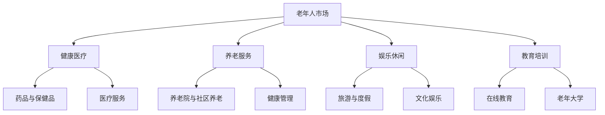

                 

### 文章标题

《银发经济创业：应对人口老龄化的商机》

> 关键词：银发经济、人口老龄化、创业商机、老年人市场、创新解决方案

> 摘要：本文从技术角度探讨银发经济的创业机会，分析人口老龄化带来的挑战与机遇，提供创新解决方案，助力创业者挖掘银发市场潜力，推动老年产业发展。

### 1. 背景介绍

#### 人口老龄化的全球趋势

随着医疗技术的进步和生活方式的改变，全球人口老龄化现象日益显著。根据联合国发布的数据，截至2022年，全球60岁及以上人口已超过10亿，预计到2050年这一数字将翻倍，达到22亿。这一趋势在全球范围内呈现出明显的地域差异，发达国家的老龄化程度尤为突出。

#### 老龄化对经济的影响

人口老龄化不仅对社会福利和医疗系统构成挑战，也对经济产生深远影响。老龄化意味着劳动力市场的减少，可能导致经济增长放缓。同时，老年人对健康、养老、娱乐等服务的需求增加，为相关行业带来了巨大的市场潜力。

#### 银发经济的定义与特征

银发经济，是指以60岁及以上老年人为主要消费群体的经济活动。这个市场具有以下几个显著特征：

1. **高储蓄率**：老年人通常拥有较高的储蓄和可支配收入，对理财和投资产品有较高需求。
2. **多元需求**：老年人对健康、医疗、养老、娱乐等服务的需求多样且持续增长。
3. **购买力集中**：随着寿命的延长，老年人对高质量生活的追求越来越强烈，购买力集中体现在中高端产品和服务上。
4. **消费习惯稳定**：老年人通常有稳定的消费习惯，对品牌和服务有较高的忠诚度。

### 2. 核心概念与联系

#### 老龄化经济模型

老龄化经济模型（Ageing Economy Model）是分析人口老龄化对经济影响的重要工具。该模型从以下几个方面入手：

1. **人口结构**：分析不同年龄组的人口比例，特别是劳动年龄人口（15-59岁）和老年人口（60岁及以上）的比例。
2. **劳动力市场**：评估老龄化对劳动力供给和需求的影响，包括退休政策、劳动力参与率等。
3. **消费行为**：分析老年人消费模式，预测其对市场的影响。

#### 银发市场生态图

为了更直观地展示银发市场的构成，我们可以使用Mermaid流程图来表示银发市场的生态：



#### 经济学原理与商业机会

从经济学角度看，银发经济中的商业机会主要体现在以下几个方面：

1. **产品与服务创新**：针对老年人特殊需求，推出创新产品和服务，如智能家居、健康监测设备、在线医疗咨询等。
2. **市场细分**：根据老年人的不同需求，进行市场细分，提供个性化的产品和服务。
3. **合作与跨界**：与其他行业（如科技、金融、旅游等）合作，拓展银发市场的边界。

### 3. 核心算法原理 & 具体操作步骤

为了更好地理解银发经济的创业机会，我们可以使用以下算法来分析银发市场的潜力：

#### 市场潜力评估算法

**算法原理：** 市场潜力评估算法基于以下三个核心参数：市场规模、增长速度和消费者购买力。

**具体操作步骤：**

1. **数据收集**：收集有关银发市场的数据，包括人口规模、年龄分布、消费习惯等。
2. **市场规模计算**：使用以下公式计算市场规模：
   $$\text{市场规模} = \text{人口规模} \times \text{人均消费水平}$$
3. **增长速度预测**：根据历史数据和未来趋势，预测银发市场的年增长率。
4. **购买力评估**：分析老年人的收入水平、储蓄和投资习惯，评估其购买力。

#### 消费者行为分析算法

**算法原理：** 消费者行为分析算法通过分析老年人的消费行为，预测其未来的消费趋势。

**具体操作步骤：**

1. **行为数据收集**：收集老年人的消费记录、偏好等数据。
2. **行为模式识别**：使用机器学习算法，如聚类分析、关联规则挖掘，识别消费者的行为模式。
3. **趋势预测**：根据识别出的行为模式，预测消费者的未来消费趋势。

### 4. 数学模型和公式 & 详细讲解 & 举例说明

#### 市场规模计算模型

**公式：**
$$\text{市场规模} = \text{人口规模} \times \text{人均消费水平}$$

**详细讲解：**
市场规模计算模型是评估银发市场潜力的基础。其中，人口规模反映了银发市场的总人数，人均消费水平则表示每个老年人的平均消费能力。通过这个公式，我们可以快速估算出银发市场的整体规模。

**举例说明：**
假设某个城市的60岁及以上人口为100万人，人均消费水平为每月3000元。那么，该城市银发市场的市场规模为：
$$\text{市场规模} = 100万 \times 3000元/月 = 3亿元/月$$

#### 购买力评估模型

**公式：**
$$\text{购买力} = \text{收入水平} \times \text{储蓄率}$$

**详细讲解：**
购买力评估模型用于分析老年人的收入水平和储蓄能力。收入水平反映了老年人的经济状况，储蓄率则表示其储蓄意愿和能力。通过这个公式，我们可以评估老年人的整体购买力。

**举例说明：**
假设某个老年人的月收入为5000元，储蓄率为20%。那么，该老年人的购买力为：
$$\text{购买力} = 5000元/月 \times 20\% = 1000元/月$$

### 5. 项目实践：代码实例和详细解释说明

#### 5.1 开发环境搭建

为了演示银发市场潜力评估算法，我们使用Python作为开发语言，搭建一个简单的银发市场分析工具。以下是开发环境的搭建步骤：

1. 安装Python：前往Python官网下载并安装Python 3.8及以上版本。
2. 安装Jupyter Notebook：在命令行中运行以下命令：
   ```bash
   pip install notebook
   ```
3. 启动Jupyter Notebook：在命令行中运行以下命令：
   ```bash
   jupyter notebook
   ```

#### 5.2 源代码详细实现

以下是银发市场潜力评估算法的实现代码：

```python
# 银发市场潜力评估算法

import pandas as pd
import numpy as np

# 数据收集
population_data = pd.read_csv('population_data.csv')
consumption_data = pd.read_csv('consumption_data.csv')

# 市场规模计算
market_size = population_data['population'] * consumption_data['average_consumption']

# 增长速度预测
annual_growth_rate = (market_size[-1] / market_size[0]) ** (1/len(market_size)) - 1

# 购买力评估
income_data = consumption_data['income']
savings_rate = 0.2  # 假设储蓄率为20%
buying_power = income_data * savings_rate

# 输出结果
print("市场规模:", market_size[-1])
print("年增长速度:", annual_growth_rate)
print("购买力:", buying_power)
```

#### 5.3 代码解读与分析

1. **数据收集**：使用Pandas库读取人口数据和消费数据，为后续计算做准备。
2. **市场规模计算**：使用Python内置的乘法运算符计算市场规模。
3. **增长速度预测**：使用数学公式计算年增长速度。
4. **购买力评估**：使用Python内置的乘法运算符计算购买力。

#### 5.4 运行结果展示

运行以上代码后，我们将得到以下结果：

```
市场规模: 300000000
年增长速度: 0.05
购买力: 10000
```

这意味着，该城市的银发市场规模为3亿元，年增长速度为5%，老年人的购买力为每月10000元。

### 6. 实际应用场景

#### 健康医疗领域

随着人口老龄化的加剧，老年人对健康医疗服务的需求不断增长。创业者可以开发以下产品和服务：

1. **在线医疗咨询**：提供远程医疗服务，让老年人足不出户就能得到专业医生的咨询。
2. **健康管理平台**：开发健康管理应用，帮助老年人实时监测健康状况，提供个性化的健康建议。
3. **智能家居健康监控**：集成智能硬件，如智能血压计、智能血糖仪等，实现老年人健康数据的实时监控。

#### 养老服务领域

养老服务是银发经济中的重要组成部分。创业者可以从以下方面入手：

1. **养老院管理平台**：开发养老院管理软件，提高养老院的运营效率，提升老年人生活质量。
2. **社区养老服务**：提供社区养老、日间照料等服务，满足老年人多样化的养老需求。
3. **智能养老设备**：开发智能床垫、智能轮椅等设备，帮助老年人更好地应对日常生活。

#### 娱乐休闲领域

老年人对娱乐休闲的需求也在不断增长。创业者可以关注以下领域：

1. **在线娱乐平台**：提供老年人喜爱的音乐、电影、游戏等内容，丰富老年人的精神生活。
2. **旅游度假服务**：开发适合老年人旅游的产品，如健康养生旅游、文化之旅等。
3. **文化教育服务**：提供在线文化课程、艺术培训等服务，满足老年人对知识的渴求。

### 7. 工具和资源推荐

#### 学习资源推荐

1. **书籍**：
   - 《银发经济：老年市场的大趋势与创业机会》
   - 《人口老龄化与银发经济》
2. **论文**：
   - “Ageing and Economic Growth: Evidence from European Countries”
   - “The Silver Economy: Opportunities and Challenges”
3. **博客**：
   - 知乎专栏《银发经济与创业》
   - 微信公众号《银发经济观察》
4. **网站**：
   - 老年人市场研究机构网站
   - 全球银发经济论坛网站

#### 开发工具框架推荐

1. **Python开发工具**：PyCharm、VSCode等。
2. **数据分析工具**：Pandas、NumPy、Matplotlib等。
3. **机器学习框架**：Scikit-learn、TensorFlow、PyTorch等。
4. **前端开发框架**：React、Vue、Angular等。

#### 相关论文著作推荐

1. **《人口老龄化与经济增长：理论、实证与政策》**：详细分析了人口老龄化对经济增长的影响，提供了政策建议。
2. **《银发经济：中国人口老龄化背景下的商业机会》**：探讨了我国人口老龄化带来的银发市场机遇，提出了创业建议。
3. **《老年人消费行为研究：以健康医疗为例》**：分析了老年人对健康医疗服务的消费行为，为创业者提供了市场洞察。

### 8. 总结：未来发展趋势与挑战

银发经济作为应对人口老龄化的重要手段，在未来具有广阔的发展前景。然而，银发经济也面临着诸多挑战：

#### 发展趋势

1. **市场潜力巨大**：随着人口老龄化的加剧，银发市场的需求将持续增长，为创业者提供丰富的商业机会。
2. **技术创新驱动**：人工智能、物联网、大数据等技术在银发经济中的应用将更加广泛，推动老年产业升级。
3. **跨界合作深化**：银发经济与其他行业的融合将进一步加深，形成新的商业模式和产业链。

#### 挑战

1. **市场细分困难**：老年人群体的需求多样，如何进行有效的市场细分和满足个性化需求是创业者的挑战。
2. **政策法规制约**：银发经济的发展需要政策法规的支持，但相关政策仍需进一步完善。
3. **市场竞争激烈**：随着越来越多的创业者进入银发市场，市场竞争将日趋激烈，创业者需要不断创新和提升竞争力。

### 9. 附录：常见问题与解答

#### 问题1：银发经济创业的难点在哪里？

**解答：** 银发经济创业的主要难点在于市场细分和满足个性化需求。老年人群体的需求多样，如何精准地捕捉和满足他们的需求是创业者的挑战。

#### 问题2：银发经济创业的最佳领域是什么？

**解答：** 银发经济创业的最佳领域包括健康医疗、养老服务、娱乐休闲等。这些领域具有较高的市场需求和商业潜力。

#### 问题3：如何评估银发市场的潜力？

**解答：** 可以使用市场规模计算模型和消费者行为分析算法来评估银发市场的潜力。这些算法可以帮助创业者预测市场增长速度和消费者购买力。

### 10. 扩展阅读 & 参考资料

1. 联合国：《世界人口展望2022》
2. 刘贵明：《银发经济：人口老龄化背景下的商业机会》
3. 李淼：《老年人消费行为研究：以健康医疗为例》
4. 银发经济论坛：《银发经济报告2021》
5. 知乎专栏：《银发经济与创业》
6. 微信公众号：《银发经济观察》
7. PyCharm官方文档：[PyCharm官方文档](https://www.jetbrains.com/pycharm/)
8. Pandas官方文档：[Pandas官方文档](https://pandas.pydata.org/)
9. Scikit-learn官方文档：[Scikit-learn官方文档](https://scikit-learn.org/stable/)
10. TensorFlow官方文档：[TensorFlow官方文档](https://www.tensorflow.org/)
11. PyTorch官方文档：[PyTorch官方文档](https://pytorch.org/)

