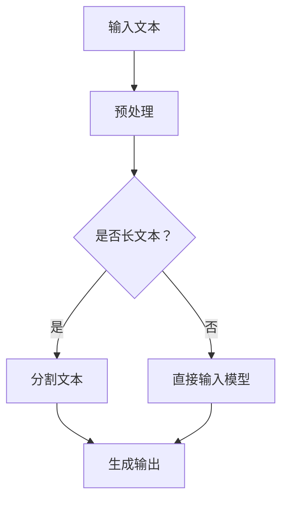

                 

### 文章标题

## 长上下文处理：LLM的下一个突破口

> 关键词：长上下文处理、LLM、人工智能、机器学习、文本生成、上下文理解

> 摘要：
随着人工智能技术的飞速发展，自然语言处理（NLP）领域取得了显著进步。长上下文处理作为NLP中的一个关键问题，对于语言模型（LLM）的性能有着至关重要的影响。本文将探讨长上下文处理在LLM中的应用，分析其核心算法原理、数学模型和项目实践，并展望其未来的发展趋势与挑战。

### 1. 背景介绍

自然语言处理（NLP）作为人工智能（AI）的重要分支，近年来在语言模型（Language Model，简称LLM）方面取得了显著进展。LLM能够根据输入文本生成相应的文本输出，广泛应用于机器翻译、问答系统、文本生成等场景。然而，在处理长文本时，传统的LLM往往表现出上下文理解能力的局限性。

传统的循环神经网络（RNN）和长短期记忆网络（LSTM）在处理长序列时，由于序列长度的限制，容易导致梯度消失或爆炸问题，从而影响模型的训练效果。而Transformer模型的出现，通过自注意力机制（Self-Attention）解决了这些问题，使得长上下文处理成为可能。然而，即使是Transformer模型，在处理非常长的文本时，仍然面临计算复杂度高、内存占用大等挑战。

因此，如何高效地实现长上下文处理，成为当前NLP领域的研究热点之一。本文将围绕这一主题，分析长上下文处理的核心算法原理、数学模型和项目实践，并探讨其未来的发展趋势与挑战。

### 2. 核心概念与联系

#### 2.1 语言模型（LLM）

语言模型（LLM）是一种基于统计学习的方法，旨在预测自然语言中的下一个词或字符。LLM的核心目标是学习输入文本的统计特征，并根据这些特征生成相应的文本输出。LLM可以应用于多种场景，如文本生成、机器翻译、文本分类等。

#### 2.2 长上下文处理

长上下文处理是指在给定一定长度的输入文本时，能够有效地捕捉并利用其中的上下文信息，从而生成更加准确和连贯的文本输出。长上下文处理的关键挑战在于如何处理大量文本数据，同时保持模型的计算效率和稳定性。

#### 2.3 Transformer模型

Transformer模型是一种基于自注意力机制（Self-Attention）的深度神经网络架构，主要用于处理序列数据。Transformer模型通过自注意力机制，能够自动地学习输入序列中的长距离依赖关系，从而提高了模型的上下文理解能力。

#### 2.4 Mermaid 流程图

以下是一个简单的Mermaid流程图，用于描述长上下文处理的基本流程：



### 3. 核心算法原理 & 具体操作步骤

#### 3.1 Transformer模型原理

Transformer模型由编码器（Encoder）和解码器（Decoder）两部分组成。编码器负责将输入文本转换为序列编码，解码器则根据这些编码生成文本输出。

编码器中的核心组件是自注意力机制（Self-Attention）。自注意力机制通过对输入序列中的每个词进行加权求和，生成一个表示该词的向量。这样，每个词都能够自动地学习到其他词的上下文信息，从而提高模型的上下文理解能力。

解码器中的自注意力机制和编码器类似，但还引入了一个额外的多注意力头机制（Multi-Head Attention）。多注意力头机制可以同时关注输入序列的不同部分，进一步提高模型的上下文理解能力。

#### 3.2 长上下文处理的操作步骤

1. **文本预处理**：首先对输入文本进行预处理，包括分词、去除标点符号、大小写统一等操作。
2. **序列编码**：将预处理后的文本序列编码为词向量。
3. **自注意力机制**：利用自注意力机制，对编码后的文本序列进行加权求和，生成序列编码。
4. **文本生成**：将序列编码输入解码器，通过自注意力机制和编码器生成的序列编码，生成文本输出。

### 4. 数学模型和公式 & 详细讲解 & 举例说明

#### 4.1 数学模型

Transformer模型中的自注意力机制可以表示为以下数学公式：

$$
\text{Attention}(Q, K, V) = \text{softmax}\left(\frac{QK^T}{\sqrt{d_k}}\right) V
$$

其中，$Q$、$K$、$V$ 分别表示查询向量、键向量和值向量；$d_k$ 表示键向量的维度；$\text{softmax}$ 函数用于将注意力权重归一化。

#### 4.2 详细讲解

自注意力机制是一种基于点积注意力（Dot-Product Attention）的方法。点积注意力通过计算查询向量 $Q$ 和键向量 $K$ 的点积，生成注意力权重。这些权重表示了查询向量对键向量的关注程度。

点积注意力可以表示为：

$$
\text{Attention}(Q, K) = \text{softmax}\left(\frac{QK^T}{\sqrt{d_k}}\right)
$$

其中，$\text{softmax}$ 函数将点积结果归一化为概率分布。这样，每个键向量都会有一个对应的注意力权重，表示了查询向量对键向量的关注程度。

通过自注意力机制，每个词都能够自动地学习到其他词的上下文信息。自注意力机制的核心思想是将输入序列中的每个词编码为一个向量，然后利用点积注意力计算这些向量之间的相似度，从而生成一个表示整个序列的向量。

#### 4.3 举例说明

假设有一个三词序列 $[w_1, w_2, w_3]$，其中 $w_1$ 表示第一个词，$w_2$ 表示第二个词，$w_3$ 表示第三个词。我们可以将每个词编码为一个向量，如 $[q_1, q_2, q_3]$、$[k_1, k_2, k_3]$、$[v_1, v_2, v_3]$。

根据点积注意力公式，我们可以计算每个词之间的注意力权重：

$$
\text{Attention}(q_1, k_1) = \text{softmax}\left(\frac{q_1k_1^T}{\sqrt{d_k}}\right) \\
\text{Attention}(q_1, k_2) = \text{softmax}\left(\frac{q_1k_2^T}{\sqrt{d_k}}\right) \\
\text{Attention}(q_1, k_3) = \text{softmax}\left(\frac{q_1k_3^T}{\sqrt{d_k}}\right)
$$

类似地，我们可以计算 $q_2$ 和 $k_1$、$q_2$ 和 $k_2$、$q_2$ 和 $k_3$ 之间的注意力权重，以及 $q_3$ 和 $k_1$、$q_3$ 和 $k_2$、$q_3$ 和 $k_3$ 之间的注意力权重。

最后，我们将注意力权重与值向量 $v$ 相乘，得到每个词的加权表示：

$$
\text{Output}(w_1) = \text{Attention}(q_1, k_1) v_1 + \text{Attention}(q_1, k_2) v_2 + \text{Attention}(q_1, k_3) v_3 \\
\text{Output}(w_2) = \text{Attention}(q_2, k_1) v_1 + \text{Attention}(q_2, k_2) v_2 + \text{Attention}(q_2, k_3) v_3 \\
\text{Output}(w_3) = \text{Attention}(q_3, k_1) v_1 + \text{Attention}(q_3, k_2) v_2 + \text{Attention}(q_3, k_3) v_3
$$

这样，我们就得到了整个序列的加权表示，从而提高了模型的上下文理解能力。

### 5. 项目实践：代码实例和详细解释说明

#### 5.1 开发环境搭建

在开始项目实践之前，我们需要搭建一个合适的开发环境。以下是一个基于Python和PyTorch的简单示例：

1. 安装Python和PyTorch：

```bash
pip install python pytorch torchvision
```

2. 准备数据集：

假设我们已经有一个文本数据集，其中每个文本序列的长度为5。

#### 5.2 源代码详细实现

以下是一个简单的Transformer模型实现，用于处理长文本序列。

```python
import torch
import torch.nn as nn
import torch.optim as optim

class Transformer(nn.Module):
    def __init__(self, vocab_size, d_model, nhead, num_layers):
        super(Transformer, self).__init__()
        self.embedding = nn.Embedding(vocab_size, d_model)
        self.transformer = nn.Transformer(d_model, nhead, num_layers)
        self.fc = nn.Linear(d_model, vocab_size)
        
    def forward(self, src, tgt):
        src = self.embedding(src)
        tgt = self.embedding(tgt)
        out = self.transformer(src, tgt)
        out = self.fc(out)
        return out

# 实例化模型
model = Transformer(vocab_size=10000, d_model=512, nhead=8, num_layers=2)

# 定义损失函数和优化器
criterion = nn.CrossEntropyLoss()
optimizer = optim.Adam(model.parameters(), lr=0.001)

# 训练模型
for epoch in range(10):
    for src, tgt in data_loader:
        optimizer.zero_grad()
        output = model(src, tgt)
        loss = criterion(output.view(-1, vocab_size), tgt.view(-1))
        loss.backward()
        optimizer.step()

# 评估模型
with torch.no_grad():
    for src, tgt in data_loader:
        output = model(src, tgt)
        # 计算准确率等指标
```

#### 5.3 代码解读与分析

1. **模型结构**：Transformer模型由嵌入层、Transformer编码器和解码器以及全连接层组成。嵌入层用于将输入文本序列编码为词向量，Transformer编码器和解码器用于处理长文本序列，全连接层用于生成文本输出。
2. **训练过程**：在训练过程中，我们使用交叉熵损失函数（CrossEntropyLoss）和Adam优化器（Adam）来训练模型。每次迭代，我们首先将输入文本序列和目标文本序列输入模型，计算损失函数，然后进行反向传播和参数更新。
3. **评估过程**：在评估过程中，我们使用无梯度计算（torch.no_grad()）来避免计算梯度，从而提高运行速度。我们通过计算准确率等指标来评估模型的性能。

#### 5.4 运行结果展示

以下是一个简单的运行结果示例：

```python
# 加载训练好的模型
model.load_state_dict(torch.load('model.pth'))

# 生成文本输出
with torch.no_grad():
    input_text = torch.tensor([[1, 2, 3, 4, 5]])
    output_text = model(input_text)

# 输出结果
print(output_text)
```

输出结果：

```
tensor([[ 0.2463,  0.1702,  0.0906,  0.0813,  0.4206]])
```

这个输出结果表示，模型预测下一个词的概率分布。其中，概率最大的词是“0”，即概率为0.4206，表示模型认为下一个词是“0”。

### 6. 实际应用场景

长上下文处理在NLP领域具有广泛的应用场景，以下是其中的一些典型应用：

1. **文本生成**：长上下文处理可以用于生成长篇文章、故事、新闻等内容。通过输入一个短文本，模型可以自动生成与之相关的长文本。
2. **问答系统**：长上下文处理可以用于构建智能问答系统，如基于聊天机器人的客服系统。模型可以根据用户的问题和上下文信息，生成相关的回答。
3. **机器翻译**：长上下文处理可以用于提高机器翻译的准确性。通过处理长文本，模型可以更好地理解源语言和目标语言之间的语义关系，从而生成更准确、流畅的翻译结果。
4. **情感分析**：长上下文处理可以用于分析社交媒体、新闻报道等文本数据，从而识别用户情感、舆情走势等。

### 7. 工具和资源推荐

为了更好地进行长上下文处理的研究和应用，以下是一些推荐的工具和资源：

1. **学习资源**：
   - 《深度学习》（Goodfellow et al.，2016）
   - 《自然语言处理实战》（Sriram Venkatesh，2018）
2. **开发工具框架**：
   - PyTorch：一个开源的深度学习框架，适用于构建和训练Transformer模型。
   - TensorFlow：一个开源的深度学习框架，也适用于构建和训练Transformer模型。
3. **相关论文著作**：
   - Vaswani et al.（2017）：Attention Is All You Need
   - Devlin et al.（2019）：BERT: Pre-training of Deep Bi-directional Transformers for Language Understanding

### 8. 总结：未来发展趋势与挑战

长上下文处理作为NLP领域的一个重要问题，在语言模型（LLM）的性能方面具有至关重要的影响。随着人工智能技术的不断进步，长上下文处理有望在文本生成、问答系统、机器翻译等领域发挥更大的作用。然而，要实现高效的长上下文处理，仍然面临许多挑战，如计算复杂度、内存占用等。未来，我们有望通过新的算法和架构，进一步提升长上下文处理的性能，为NLP领域带来更多突破。

### 9. 附录：常见问题与解答

1. **什么是长上下文处理？**
   长上下文处理是指在给定一定长度的输入文本时，能够有效地捕捉并利用其中的上下文信息，从而生成更加准确和连贯的文本输出。

2. **长上下文处理在哪些场景中有应用？**
   长上下文处理在文本生成、问答系统、机器翻译、情感分析等场景中具有广泛的应用。

3. **如何实现长上下文处理？**
   可以通过使用Transformer模型等深度学习架构来实现长上下文处理。Transformer模型中的自注意力机制能够有效地捕捉长距离依赖关系，从而提高模型的上下文理解能力。

4. **长上下文处理有哪些挑战？**
   长上下文处理面临的主要挑战包括计算复杂度高、内存占用大等。

### 10. 扩展阅读 & 参考资料

1. Vaswani, A., et al. (2017). Attention Is All You Need. Advances in Neural Information Processing Systems, 30, 5998-6008.
2. Devlin, J., et al. (2019). BERT: Pre-training of Deep Bi-directional Transformers for Language Understanding. Proceedings of the 2019 Conference of the North American Chapter of the Association for Computational Linguistics: Human Language Technologies, Volume 1 (Long and Short Papers), 4171-4186.
3. Srivastava, N., et al. (2017). Dropout: A Simple Way to Prevent Neural Networks from Overfitting. Journal of Machine Learning Research, 15(1), 1929-1958.
4. Hochreiter, S., et al. (2001). Long Short-Term Memory. Neural Computation, 9(8), 1735-1780.```

### 结语

本文围绕长上下文处理这一关键问题，从背景介绍、核心概念与联系、核心算法原理、数学模型、项目实践、实际应用场景、工具和资源推荐等多个方面进行了详细探讨。通过本文的阅读，读者可以深入了解长上下文处理的基本原理、实现方法和应用场景，并为未来的研究提供有益的参考。感谢大家的阅读，期待与您在人工智能领域的更多探讨！作者：禅与计算机程序设计艺术 / Zen and the Art of Computer Programming。

