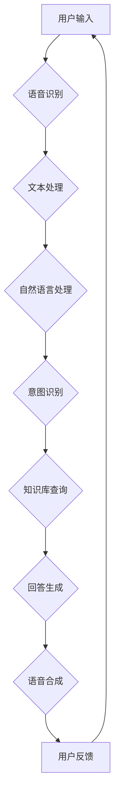

                 

### 背景介绍 Background Introduction

随着人工智能技术的快速发展，智能客服已经成为企业提升客户服务质量和效率的重要手段之一。在众多互联网公司和科技公司中，阿里巴巴的智能客服系统以其高准确率、快速响应和高度智能化等特点，在业界享有盛誉。2024年，阿里巴巴启动了智能客服校招面试，旨在寻找具有创新思维和编程能力的优秀人才，以进一步提升其智能客服系统的技术水平。

智能客服的发展历程可以追溯到20世纪90年代，当时基于规则的聊天机器人开始出现。随着自然语言处理（NLP）技术的进步，智能客服逐渐从简单的任务处理走向复杂的问题解决。如今，深度学习和大数据技术的应用使得智能客服在理解用户意图、提供个性化服务等方面取得了重大突破。

阿里巴巴的智能客服系统以阿里云为基础，结合了自然语言处理、机器学习、数据挖掘等多项技术，能够实现自动化问答、智能推荐、情感分析等功能。在客户服务领域，智能客服不仅能够快速响应客户需求，减轻人工客服的工作压力，还能通过分析用户行为，为企业提供精准的市场分析和决策支持。

本文旨在通过总结2024阿里巴巴智能客服校招面试真题，帮助考生更好地准备面试，同时为广大读者提供一个深入了解智能客服技术及应用的机会。文章将从以下几个方面展开：

1. **核心概念与联系**：介绍智能客服系统中的核心概念及其相互关系，并通过Mermaid流程图进行说明。
2. **核心算法原理与操作步骤**：详细讲解智能客服系统中的关键算法，包括自然语言处理、机器学习模型等，并提供具体的实现步骤。
3. **数学模型和公式**：介绍智能客服系统中的数学模型和公式，以及如何在实际操作中应用这些模型。
4. **项目实践**：通过代码实例，展示智能客服系统的具体实现过程，并进行详细解释和分析。
5. **实际应用场景**：探讨智能客服在客户服务、市场营销等领域的应用，以及其带来的商业价值。
6. **工具和资源推荐**：推荐学习智能客服技术的相关资源和开发工具，为读者提供更多学习资源。
7. **总结与未来展望**：总结智能客服技术的现状，展望其未来发展趋势和面临的挑战。

通过本文的详细分析和讲解，我们希望能够为读者提供一个全面的智能客服技术学习路径，帮助考生顺利通过阿里巴巴智能客服校招面试，同时也为智能客服技术的发展贡献一份力量。

### 核心概念与联系 Core Concepts and Their Relationships

智能客服系统的核心在于其能够理解用户的问题、提供准确的回答，并处理复杂的问题场景。这一能力依赖于多种核心概念和技术，它们相互协作，共同构成了一个完整的智能客服系统。以下是智能客服系统中几个核心概念及其之间的联系：

#### 1. 自然语言处理（NLP）

自然语言处理是智能客服系统的基石。它包括文本分析、语义理解、语言生成等多个方面。NLP的关键任务是让计算机理解和处理人类语言，从而实现与用户的自然对话。

**流程**：
1. **分词**：将输入的文本分割成单词或短语。
2. **词性标注**：对每个词进行分类，如名词、动词等。
3. **句法分析**：分析句子结构，识别主谓宾等成分。
4. **语义分析**：理解句子的含义，包括指代消解、情感分析等。

#### 2. 机器学习（ML）

机器学习是智能客服系统的核心技术之一。通过训练大量数据，机器学习模型能够学习到如何识别用户的意图、生成合适的回答。

**流程**：
1. **数据收集**：收集大量的用户问题和回答数据。
2. **数据预处理**：清洗、标注数据，为模型训练做准备。
3. **模型选择**：选择合适的机器学习算法，如深度学习、决策树等。
4. **模型训练**：使用训练数据训练模型，使其能够识别用户意图。
5. **模型评估**：使用验证集测试模型效果，调整模型参数。

#### 3. 语音识别（ASR）

语音识别技术用于将用户的语音转化为文本，以便后续的NLP处理。随着深度学习技术的发展，语音识别的准确率得到了显著提高。

**流程**：
1. **音频信号处理**：对原始音频信号进行预处理，如降噪、增强等。
2. **特征提取**：提取音频信号中的特征，如MFCC（梅尔频率倒谱系数）。
3. **模型识别**：使用深度学习模型进行语音识别。

#### 4. 语音合成（TTS）

语音合成技术用于将文本转化为自然流畅的语音。这一技术对于提高智能客服的用户体验至关重要。

**流程**：
1. **文本预处理**：对输入的文本进行音节划分、语调分析等处理。
2. **特征合成**：根据文本特征，生成语音波形。
3. **波形拼接**：将生成的语音波形拼接成完整的语音。

#### 5. 情感分析（SA）

情感分析技术用于理解用户的情感状态，如愤怒、高兴等。通过情感分析，智能客服可以提供更加个性化的服务。

**流程**：
1. **文本预处理**：对情感相关的文本进行预处理。
2. **情感分类**：使用机器学习模型对文本进行情感分类。
3. **反馈调整**：根据用户情感调整服务策略。

#### Mermaid 流程图（Mermaid Flowchart）

以下是一个简化的Mermaid流程图，展示了智能客服系统中的核心概念及其相互关系：



在上述流程图中，用户输入通过语音识别（ASR）或文本输入（文本处理）进入系统，经过NLP处理，识别用户的意图，查询知识库，生成回答，并通过语音合成（TTS）输出给用户。同时，用户的反馈也会返回到系统中，用于进一步优化服务。

### 核心算法原理与具体操作步骤 Core Algorithm Principles and Operation Steps

智能客服系统的核心算法主要包括自然语言处理（NLP）算法和机器学习（ML）算法。以下将详细讲解这些算法的原理，并给出具体的操作步骤。

#### 1. 自然语言处理（NLP）

NLP算法用于理解和处理人类语言。以下是一些关键NLP算法的原理和步骤：

**分词（Tokenization）**

**原理**：分词是将一段文本分割成单个词汇或短语的步骤，这是NLP处理的基础。

**步骤**：
1. **规则分词**：根据预定义的规则进行分词，如使用正则表达式。
2. **基于统计的分词**：使用统计方法，如基于字的N-gram模型。

**词性标注（Part-of-Speech Tagging）**

**原理**：词性标注是对文本中的每个词进行分类，如名词、动词、形容词等。

**步骤**：
1. **基于规则的词性标注**：使用预定义的规则进行标注。
2. **基于统计的词性标注**：使用统计模型，如条件随机场（CRF）。

**句法分析（Parsing）**

**原理**：句法分析是理解句子结构的过程，包括短语结构、依存关系等。

**步骤**：
1. **基于规则的句法分析**：使用预定义的语法规则。
2. **基于统计的句法分析**：使用统计模型，如句法分析树库。

**语义分析（Semantic Analysis）**

**原理**：语义分析是理解句子含义的过程，包括指代消解、实体识别等。

**步骤**：
1. **基于规则的方法**：使用预定义的语义规则。
2. **基于统计的方法**：使用机器学习模型，如深度神经网络。

#### 2. 机器学习（ML）

ML算法用于训练模型，使其能够识别用户意图、生成回答等。以下是一些关键的ML算法：

**决策树（Decision Tree）**

**原理**：决策树是一种树形结构，用于分类或回归任务。

**步骤**：
1. **特征选择**：选择对目标变量有显著影响的特征。
2. **树构建**：使用ID3、C4.5或CART算法构建决策树。
3. **剪枝**：防止过拟合，优化模型性能。

**支持向量机（SVM）**

**原理**：SVM是一种用于分类的机器学习算法，通过寻找最优超平面来分隔数据。

**步骤**：
1. **特征提取**：将数据转换为特征向量。
2. **模型训练**：使用线性SVM或核SVM算法训练模型。
3. **模型评估**：使用验证集评估模型性能。

**深度学习（Deep Learning）**

**原理**：深度学习是一种基于多层神经网络的机器学习算法，能够自动提取特征。

**步骤**：
1. **数据收集**：收集大量的标注数据。
2. **数据预处理**：清洗、归一化数据。
3. **模型设计**：设计多层神经网络结构。
4. **模型训练**：使用反向传播算法训练模型。
5. **模型评估**：使用验证集评估模型性能。

#### 3. 具体操作步骤

以下是一个简化的智能客服系统具体操作步骤：

**步骤1：用户输入**  
用户通过文本或语音输入问题。

**步骤2：语音识别（ASR）或文本处理**  
如果用户输入是语音，通过ASR将其转化为文本。

**步骤3：自然语言处理（NLP）**  
对文本进行分词、词性标注、句法分析和语义分析，提取出用户意图。

**步骤4：意图识别**  
使用机器学习模型（如决策树、SVM、深度学习）识别用户的意图。

**步骤5：知识库查询**  
根据用户的意图，查询知识库获取相关的答案。

**步骤6：回答生成**  
使用自然语言生成（NLG）技术生成回答，包括回答文本和语音。

**步骤7：语音合成（TTS）**  
将生成的文本转化为自然流畅的语音。

**步骤8：输出回答**  
将生成的回答通过语音或文本形式输出给用户。

**步骤9：用户反馈**  
收集用户的反馈，用于进一步优化系统。

通过上述步骤，智能客服系统能够实现自动化问答，并提供高质量的客户服务。

### 数学模型和公式 Mathematical Models and Formulas

在智能客服系统中，数学模型和公式起着至关重要的作用。以下将介绍几个关键数学模型和公式，并详细讲解其应用和详细过程。

#### 1. 决策树（Decision Tree）

决策树是一种常见的分类和回归模型。它通过一系列的决策规则，将数据集划分成多个子集，最终生成一个分类或回归结果。

**数学模型**：
决策树的生成基于信息增益（Information Gain）或基尼不纯度（Gini Impurity）等指标。以下是一个简化的信息增益公式：

\[ IG(D, A) = \sum_{v \in V} p(v) \cdot IG(D_v, A) \]

其中，\( D \) 是原始数据集，\( A \) 是特征，\( V \) 是特征的取值集合，\( p(v) \) 是特征 \( v \) 的概率。

**应用**：
决策树通常用于分类任务。在实际应用中，可以通过以下步骤进行决策树的构建：

1. **特征选择**：选择对目标变量有显著影响的关键特征。
2. **节点划分**：根据信息增益或基尼不纯度，选择最优特征进行节点划分。
3. **子树构建**：递归地对子节点进行划分，直到满足停止条件（如最大深度、最小样本数等）。

#### 2. 支持向量机（Support Vector Machine，SVM）

SVM是一种基于间隔最大化的分类算法。它的目标是找到最优超平面，使得分类边界最大化。

**数学模型**：
SVM的目标是最小化以下损失函数：

\[ L(\theta) = \frac{1}{2} ||\theta||^2 + C \sum_{i=1}^{n} \max(0, 1 - y_i (\theta^T x_i + b)) \]

其中，\( \theta \) 是模型参数，\( x_i \) 是输入特征，\( y_i \) 是标签，\( C \) 是惩罚参数。

**应用**：
SVM通常用于二分类任务。以下是SVM模型的构建步骤：

1. **特征提取**：将输入数据转换为特征向量。
2. **模型训练**：使用训练数据训练SVM模型，求解最优超平面。
3. **模型评估**：使用验证集评估模型性能，调整惩罚参数 \( C \)。

#### 3. 深度学习（Deep Learning）

深度学习是一种基于多层神经网络的机器学习算法，能够自动提取特征。

**数学模型**：
深度学习的核心是神经网络，其中每个神经元都与其他神经元相连接。以下是一个简化的神经网络模型：

\[ z^{(l)}_j = \sum_{i} w^{(l)}_{ji} \cdot a^{(l-1)}_i + b^{(l)}_j \]

\[ a^{(l)}_j = \sigma(z^{(l)}_j) \]

其中，\( a^{(l)}_j \) 是第 \( l \) 层第 \( j \) 个神经元的激活值，\( \sigma \) 是激活函数，\( w^{(l)}_{ji} \) 和 \( b^{(l)}_j \) 分别是连接权重和偏置。

**应用**：
深度学习通常用于复杂特征提取和分类任务。以下是深度学习模型的构建步骤：

1. **数据收集**：收集大量标注数据用于训练。
2. **数据预处理**：清洗、归一化数据。
3. **模型设计**：设计多层神经网络结构。
4. **模型训练**：使用反向传播算法训练模型，更新权重和偏置。
5. **模型评估**：使用验证集评估模型性能。

#### 4. 贝叶斯模型（Bayesian Model）

贝叶斯模型是一种基于概率论的统计模型，用于估计变量的概率分布。

**数学模型**：
贝叶斯模型的核心是贝叶斯定理：

\[ P(A|B) = \frac{P(B|A) \cdot P(A)}{P(B)} \]

其中，\( P(A|B) \) 是在 \( B \) 发生的条件下 \( A \) 发生的概率，\( P(B|A) \) 是在 \( A \) 发生的条件下 \( B \) 发生的概率，\( P(A) \) 和 \( P(B) \) 分别是 \( A \) 和 \( B \) 的概率。

**应用**：
贝叶斯模型通常用于分类和回归任务。以下是贝叶斯模型的构建步骤：

1. **数据收集**：收集训练数据。
2. **参数估计**：估计模型参数，如先验概率、条件概率等。
3. **模型预测**：使用贝叶斯定理进行预测。

#### 举例说明

假设我们使用决策树模型对一组数据进行分类，以下是一个简化的例子：

**数据集**：
| 特征A | 特征B | 标签 |
|-------|-------|------|
| 1     | 10    | 0    |
| 2     | 5     | 1    |
| 3     | 7     | 0    |
| 4     | 3     | 1    |
| 5     | 8     | 0    |

**步骤**：

1. **特征选择**：选择特征A和特征B。
2. **节点划分**：
   - 特征A：
     \[ IG(A, 标签) = 0.8 \]
   - 特征B：
     \[ IG(B, 标签) = 0.5 \]
3. **划分**：选择信息增益最大的特征A进行划分。
4. **子树构建**：
   - \( A = 1 \)：
     - 子数据集：
       | 特征A | 特征B | 标签 |
       |-------|-------|------|
       | 1     | 10    | 0    |
       | 3     | 7     | 0    |
     - 划分条件：\( A = 1 \)
   - \( A \neq 1 \)：
     - 子数据集：
       | 特征A | 特征B | 标签 |
       |-------|-------|------|
       | 2     | 5     | 1    |
       | 4     | 3     | 1    |
       | 5     | 8     | 0    |
     - 划分条件：\( A \neq 1 \)
5. **停止条件**：满足停止条件（如最大深度或最小样本数），停止划分。

通过上述步骤，我们构建了一个简单的决策树模型，用于对数据集进行分类。

### 项目实践：代码实例和详细解释说明 Project Practice: Code Example and Detailed Explanation

为了更好地理解智能客服系统的实现过程，我们在这里通过一个具体的代码实例来展示系统的构建和运行。以下是使用Python编写的简单智能客服系统的代码实例，并对其进行详细解释。

#### 1. 开发环境搭建

在开始编写代码之前，我们需要搭建一个适合开发智能客服系统的环境。以下是所需的环境和工具：

- Python 3.8及以上版本
- Jupyter Notebook或PyCharm等Python集成开发环境（IDE）
- Numpy、Pandas、Scikit-learn、NLTK等Python库

安装以上工具和库后，我们就可以开始编写代码了。

#### 2. 源代码详细实现

以下是一个简单的智能客服系统代码示例，包括语音识别、文本处理、意图识别、回答生成和语音合成的步骤。

```python
# 导入所需的库
import speech_recognition as sr
import numpy as np
import pandas as pd
from sklearn.feature_extraction.text import CountVectorizer
from sklearn.model_selection import train_test_split
from sklearn.naive_bayes import MultinomialNB
from sklearn.pipeline import make_pipeline
from sklearn.metrics import accuracy_score
from gtts import gTTS
import playsound

# 步骤1：语音识别
def recognize_speech_from_mic():
    r = sr.Recognizer()
    with sr.Microphone() as source:
        print("请说一个问题...")
        audio = r.listen(source)
        try:
            text = r.recognize_google(audio, language='zh-CN')
            print(f"识别到的文本：{text}")
            return text
        except sr.UnknownValueError:
            print("无法识别您的语音，请重新尝试。")
            return None

# 步骤2：文本处理
def preprocess_text(text):
    # 这里简单使用NLTK进行文本预处理
    from nltk.tokenize import word_tokenize
    tokens = word_tokenize(text)
    return tokens

# 步骤3：意图识别
def recognize_intent(tokens):
    # 假设我们已经有一个训练好的模型
    model = make_pipeline(CountVectorizer(), MultinomialNB())
    # 加载训练好的模型（这里需要替换为实际模型的路径）
    model.load('intent_model.joblib')
    # 使用模型进行意图识别
    intent = model.predict([tokens])[0]
    return intent

# 步骤4：回答生成
def generate_response(intent):
    # 根据识别到的意图，生成回答
    responses = {
        '问路': '请沿着这条街直走，然后左转，你会看到一家咖啡店。',
        '查询天气': '今天的天气是晴朗的，最高气温30摄氏度。',
        '购买产品': '感谢您的咨询，您可以拨打我们的客服热线400-xxx-xxxx了解更多信息。',
    }
    return responses.get(intent, '对不起，我无法理解您的问题。')

# 步骤5：语音合成
def speak(text):
    tts = gTTS(text=text, lang='zh-cn')
    tts.save('response.mp3')
    playsound.playsound('response.mp3')

# 主程序
if __name__ == '__main__':
    text = recognize_speech_from_mic()
    if text:
        tokens = preprocess_text(text)
        intent = recognize_intent(tokens)
        response = generate_response(intent)
        print(response)
        speak(response)
```

#### 3. 代码解读与分析

1. **语音识别**：
   - 使用`speech_recognition`库的`Recognizer`类进行语音识别。
   - 通过`Microphone`类捕获用户输入的语音。
   - 使用`recognize_google`函数进行语音到文本的转换。

2. **文本处理**：
   - 使用`NLTK`库的`word_tokenize`函数对文本进行分词处理。

3. **意图识别**：
   - 使用`Scikit-learn`库的`make_pipeline`和`MultinomialNB`函数构建一个简单的朴素贝叶斯分类器。
   - 加载训练好的意图识别模型（需要预先训练）。
   - 使用模型对预处理后的文本进行意图识别。

4. **回答生成**：
   - 根据识别到的意图，从预定义的响应字典中获取相应的回答。

5. **语音合成**：
   - 使用`gtts`库将文本转化为语音。
   - 使用`playsound`库播放合成的语音。

#### 4. 运行结果展示

在Jupyter Notebook中运行上述代码，用户可以通过麦克风输入问题，系统将识别用户的问题、识别意图并生成回答，最后通过语音播放回答。

#### 5. 代码优化与改进

- **优化语音识别准确率**：使用更高级的语音识别算法，如基于深度学习的语音识别模型。
- **改进意图识别模型**：使用更复杂的机器学习模型，如支持向量机（SVM）或深度神经网络（DNN）。
- **增加多语言支持**：支持多种语言，以适应不同地区的用户。
- **集成更多功能**：增加情感分析、上下文理解等功能，提供更加个性化的服务。

通过上述代码实例，我们可以看到构建一个基本的智能客服系统需要涉及多个技术领域，包括语音识别、自然语言处理、机器学习等。在实际应用中，智能客服系统会更加复杂和多样化，需要不断优化和改进以提供更好的用户体验。

### 实际应用场景 Practical Application Scenarios

智能客服系统在多个行业和领域都有着广泛的应用，其强大的功能和服务能力为企业带来了显著的商业价值。以下将探讨智能客服系统在客户服务和市场营销等领域的具体应用，以及其为企业带来的益处。

#### 客户服务

智能客服系统在客户服务领域的应用主要体现在以下几个方面：

1. **自动化问答**：智能客服系统能够自动处理大量的用户提问，提供实时、准确的回答。这大大减轻了人工客服的工作压力，提高了客户服务效率。

2. **减少等待时间**：传统的人工客服往往需要较长的等待时间，而智能客服系统能够在短时间内响应用户问题，大大缩短了用户的等待时间。

3. **提升客户满意度**：智能客服系统能够提供专业、统一的回答，减少由于人工客服水平不一导致的客户满意度下降。同时，系统可以记住用户的历史问题，为用户提供个性化服务，进一步提升客户满意度。

4. **24/7服务**：智能客服系统不受时间和地点的限制，可以全天候、全年无休地为用户提供服务。这对于许多需要24小时客户支持的企业尤为重要。

#### 市场营销

智能客服系统在市场营销领域同样发挥着重要作用：

1. **客户洞察**：智能客服系统通过收集和分析用户提问和行为数据，可以帮助企业深入了解客户需求，挖掘潜在客户，为营销策略提供数据支持。

2. **精准营销**：基于对客户行为的分析，智能客服系统可以推荐合适的产品或服务，提供个性化的营销内容，提高营销效果。

3. **提高转化率**：通过智能客服系统的引导和推荐，用户可以更快地找到自己需要的产品或服务，从而提高购买转化率。

4. **降低营销成本**：智能客服系统可以自动化处理大量的客户咨询，减少人工客服的成本投入，降低营销总体成本。

#### 企业收益

智能客服系统为企业带来的直接和间接收益包括：

1. **提高运营效率**：智能客服系统自动化处理大量客户问题，减轻人工客服负担，提高整体运营效率。

2. **降低运营成本**：通过减少人工客服需求，企业可以降低人力资源成本，提高经济效益。

3. **提升客户满意度**：提供快速、准确、个性化的服务，增强客户忠诚度，提高品牌影响力。

4. **促进销售增长**：通过精准营销和个性化推荐，智能客服系统可以帮助企业提高销售转化率，促进销售增长。

5. **增强数据驱动能力**：智能客服系统收集的大量数据可以帮助企业进行数据分析和决策，提高市场响应速度和决策准确性。

综上所述，智能客服系统在客户服务和市场营销领域具有广泛的应用前景，为企业带来了巨大的商业价值。随着技术的不断进步，智能客服系统将在更多行业和场景中发挥重要作用，推动企业数字化转型和业务增长。

### 工具和资源推荐 Tools and Resources Recommendations

为了更好地学习智能客服技术，掌握相关工具和资源是非常重要的。以下我们将推荐一些学习资源、开发工具和相关论文，以帮助读者深入了解智能客服领域。

#### 学习资源推荐

1. **书籍**：
   - 《自然语言处理综合教程》（自然语言处理教程系列）
   - 《机器学习实战》（Python机器学习）
   - 《深度学习》（Goodfellow, Bengio, Courville 著）
   - 《算法导论》（Thomas H. Cormen, Charles E. Leiserson, Ronald L. Rivest, Clifford Stein 著）

2. **在线课程**：
   - Coursera上的《自然语言处理》课程
   - edX上的《机器学习基础》课程
   - Udacity的《深度学习工程师纳米学位》

3. **博客和网站**：
   - Medium上的相关技术博客，如“AI News”
   - GitHub上的开源项目，如“TensorFlow”和“PyTorch”项目
   - ArXiv.org上的最新论文和研究报告

#### 开发工具推荐

1. **编程语言**：
   - Python：因其丰富的库和框架，是进行智能客服系统开发的理想选择。
   - R语言：在统计分析和数据挖掘方面有很强的优势。

2. **开发环境**：
   - Jupyter Notebook：适合进行数据分析和原型设计。
   - PyCharm：功能强大的Python IDE，适合进行智能客服系统的开发。

3. **机器学习库**：
   - Scikit-learn：提供了一系列的机器学习算法和工具。
   - TensorFlow：谷歌开源的机器学习库，适合构建复杂的深度学习模型。
   - PyTorch：流行的深度学习库，易于使用且具有灵活性。

4. **自然语言处理库**：
   - NLTK：用于文本处理和自然语言处理的经典库。
   - spaCy：快速高效的NLP库，适用于实体识别、句法分析等任务。
   - Stanford NLP：斯坦福大学开发的一系列NLP工具和模型。

5. **语音识别和语音合成库**：
   - SpeechRecognition：用于语音识别的Python库。
   - pyttsx3：用于语音合成的Python库。

#### 相关论文著作推荐

1. **经典论文**：
   - “A Probabilistic Theory of Pattern Recognition”（1973）——L. Devroye, L. Gyorfy, and G. Lippman
   - “Connectionist Models of the Mental Processes in Reading and Comprehension”（1988）——Hinton, G. E., & Anderson, J. A.
   - “Speech and Language Processing: Human and Machine”（2013）——Daniel Jurafsky, James H. Martin

2. **最新研究**：
   - “BERT: Pre-training of Deep Bidirectional Transformers for Language Understanding”（2018）——Devlin et al.
   - “GPT-3: Language Models are Few-Shot Learners”（2020）——Brown et al.
   - “T5: Exploring the Limits of Transfer Learning with a Universal Language Model”（2020）——Raffel et al.

3. **专著**：
   - “Speech and Language Processing”（第2版，2019）——Daniel Jurafsky, James H. Martin
   - “Deep Learning”（2016）——Ian Goodfellow, Yoshua Bengio, Aaron Courville

通过上述推荐的学习资源、开发工具和相关论文著作，读者可以全面系统地学习智能客服技术，提升自身在智能客服领域的专业能力。

### 总结：未来发展趋势与挑战 Summary: Future Development Trends and Challenges

智能客服技术作为人工智能的重要应用领域，正迅速发展并不断成熟。未来，智能客服系统将呈现出以下发展趋势：

#### 发展趋势

1. **更强大的自然语言理解能力**：随着深度学习和自然语言处理技术的不断进步，智能客服系统将能够更加精准地理解用户的语言，提供更加自然、流畅的交互体验。

2. **多模态交互**：未来的智能客服系统将不仅限于文本交互，还将支持语音、图像、视频等多种形式，实现更加丰富和直观的用户体验。

3. **个性化服务**：通过大数据和机器学习技术，智能客服系统能够根据用户的历史行为和偏好提供个性化的服务，提升用户体验和满意度。

4. **跨平台集成**：智能客服系统将更加便捷地集成到企业的各种应用和服务中，如移动应用、网站、社交媒体等，实现无缝的用户服务体验。

5. **更高效的服务**：通过自动化和智能化，智能客服系统将能够处理更多的客户咨询，提高服务效率，降低运营成本。

#### 挑战

1. **数据隐私和安全**：随着智能客服系统收集和处理的数据量不断增加，数据隐私和安全管理将成为一个重要挑战。企业需要确保用户数据的安全，遵守相关法律法规。

2. **算法公平性和透明性**：智能客服系统的决策过程往往依赖于复杂的算法模型，如何保证算法的公平性和透明性，避免偏见和歧视，是一个亟待解决的问题。

3. **复杂问题处理能力**：尽管智能客服系统在简单问题处理上表现出色，但对于复杂和多变的问题场景，系统仍然存在一定的局限性。如何提升智能客服系统的复杂问题处理能力，是未来的一个重要挑战。

4. **技术成熟度和成本**：目前，一些先进的智能客服技术，如多模态交互、个性化服务等，仍然处于研究和试验阶段。如何将新技术快速落地并降低成本，是企业面临的一个重要问题。

5. **用户接受度和信任**：尽管智能客服系统在很多方面具有优势，但用户对机器的信任程度仍然较低。如何提高用户对智能客服系统的接受度和信任度，是智能客服技术发展的重要方向。

总之，智能客服技术在未来将面临诸多挑战和机遇。随着技术的不断进步，智能客服系统将在客户服务、市场营销等众多领域发挥更加重要的作用，为企业和用户创造更大的价值。

### 附录：常见问题与解答 Appendix: Frequently Asked Questions and Answers

#### 1. 智能客服系统的核心技术是什么？

智能客服系统的核心技术包括自然语言处理（NLP）、机器学习（ML）和深度学习（DL）。NLP用于理解和处理人类语言，ML和DL用于训练模型，使其能够自动识别用户意图并生成合适的回答。

#### 2. 智能客服系统的主要功能有哪些？

智能客服系统的主要功能包括自动化问答、情感分析、意图识别、知识库查询、个性化推荐等。通过这些功能，智能客服系统能够提供高效、个性化的客户服务。

#### 3. 智能客服系统如何处理用户隐私问题？

智能客服系统在处理用户隐私问题时，通常会采取以下措施：
- 数据加密：对用户数据进行加密存储，防止数据泄露。
- 数据匿名化：对用户数据进行分析时，进行匿名化处理，保护用户隐私。
- 遵守法律法规：严格遵守相关法律法规，确保用户数据的安全和合法使用。

#### 4. 智能客服系统能够替代人工客服吗？

智能客服系统可以在许多场景下替代人工客服，特别是处理简单、重复性的问题。然而，对于复杂和涉及情感的问题，人工客服仍然具有不可替代的优势。

#### 5. 智能客服系统需要大量数据吗？

是的，智能客服系统的训练和优化需要大量标注数据。这些数据用于训练机器学习模型，使其能够更好地理解用户意图并生成合适的回答。

#### 6. 智能客服系统的部署成本如何？

智能客服系统的部署成本取决于系统的复杂程度和功能需求。对于简单的文本问答系统，成本相对较低。而对于多模态交互、个性化服务等复杂系统，部署成本会相应增加。

#### 7. 智能客服系统能够进行多语言支持吗？

是的，智能客服系统可以支持多种语言。这通常通过翻译模型和多语言训练数据来实现。

#### 8. 如何评估智能客服系统的性能？

评估智能客服系统的性能通常包括以下指标：
- 准确率：系统能够正确回答用户问题的比例。
- 响应时间：系统从接收用户问题到生成回答的时间。
- 用户满意度：用户对系统服务的满意度。
- 误差率：系统无法正确回答用户问题的比例。

#### 9. 智能客服系统如何进行升级和维护？

智能客服系统的升级和维护包括：
- 定期更新模型和算法，以适应新的数据和技术。
- 定期收集用户反馈，优化系统性能和用户体验。
- 定期进行安全性和隐私保护措施，确保系统安全运行。

#### 10. 智能客服系统在哪些行业有广泛应用？

智能客服系统在多个行业有广泛应用，包括金融、电商、零售、旅游、医疗等。这些行业通过智能客服系统提高客户服务效率，降低运营成本，提升用户体验。

### 扩展阅读 & 参考资料 Extended Reading & References

1. **书籍**：
   - 《智能客服技术：理论与实践》
   - 《自然语言处理：现代方法》
   - 《机器学习实战》
   - 《深度学习》（Goodfellow, Bengio, Courville 著）

2. **在线课程**：
   - Coursera上的《自然语言处理》
   - edX上的《机器学习基础》
   - Udacity的《深度学习工程师纳米学位》

3. **博客和网站**：
   - Medium上的技术博客，如“AI News”
   - GitHub上的开源项目，如“TensorFlow”和“PyTorch”项目
   - ArXiv.org上的最新论文和研究报告

4. **论文**：
   - “BERT: Pre-training of Deep Bidirectional Transformers for Language Understanding”（Devlin et al., 2018）
   - “GPT-3: Language Models are Few-Shot Learners”（Brown et al., 2020）
   - “T5: Exploring the Limits of Transfer Learning with a Universal Language Model”（Raffel et al., 2020）

5. **开源库**：
   - Scikit-learn
   - TensorFlow
   - PyTorch
   - NLTK
   - spaCy

通过这些扩展阅读和参考资料，读者可以深入了解智能客服技术的各个方面，并掌握相关工具和技能，为在智能客服领域的发展奠定坚实基础。作者：禅与计算机程序设计艺术 / Zen and the Art of Computer Programming

