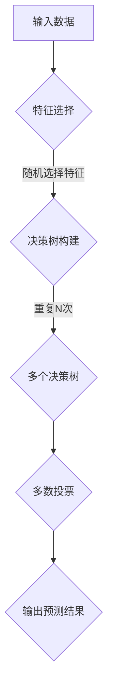

                 

### 文章标题：随机森林 原理与代码实例讲解

> **关键词：** 随机森林、机器学习、算法原理、代码实例、Python实现、分类与回归

> **摘要：** 本篇文章将深入探讨随机森林算法的原理，通过详细的数学模型和具体操作步骤，帮助读者理解其工作机制。文章还将结合Python代码实例，对随机森林在分类与回归任务中的应用进行讲解，并提供实际运行结果和解读。

---

### 1. 背景介绍

随机森林（Random Forest）是一种集成学习方法，由一系列决策树组成。它的核心思想是通过构建多个决策树，并利用多数投票机制来决定最终预测结果。这种方法的优点在于它可以有效地减少过拟合现象，提高预测的准确度。

在机器学习领域，随机森林算法被广泛应用于分类和回归任务。与单一决策树相比，随机森林在处理高维度数据和非线性关系时表现更为优秀。此外，它还具有较好的可解释性，便于理解预测过程。

本文将分为以下几个部分：

1. 核心概念与联系
2. 核心算法原理 & 具体操作步骤
3. 数学模型和公式 & 详细讲解 & 举例说明
4. 项目实践：代码实例和详细解释说明
5. 实际应用场景
6. 工具和资源推荐
7. 总结：未来发展趋势与挑战
8. 附录：常见问题与解答
9. 扩展阅读 & 参考资料

接下来，我们将逐步深入探讨随机森林算法的各个组成部分。

---

### 2. 核心概念与联系

#### 2.1 决策树

决策树是一种常见的分类和回归算法，它通过一系列的判断条件（特征和阈值）将数据分割成不同的子集，直到满足某些终止条件（例如，所有样本属于同一类别或达到最大深度）。

#### 2.2 集成方法

集成方法通过结合多个模型的预测结果来提高整体性能。随机森林是其中一种代表性的方法，它通过构建多个决策树，并将它们的预测结果进行投票，以获得最终预测结果。

#### 2.3 随机性

随机森林算法引入了随机性，包括特征选择、阈值选择以及树的构建过程。这种随机性有助于减少过拟合，提高模型的泛化能力。

#### 2.4 多数投票机制

在分类任务中，随机森林通过多数投票机制决定最终预测结果。具体来说，每个决策树都会对样本进行分类，最终结果为所有决策树分类结果的多数类别。

### 2.5 Mermaid 流程图

以下是一个简单的 Mermaid 流程图，展示了随机森林的核心概念和流程：



通过上述流程图，我们可以清晰地看到随机森林的工作流程，从而为进一步探讨其算法原理打下基础。

---

### 3. 核心算法原理 & 具体操作步骤

#### 3.1 决策树构建

决策树的构建是随机森林算法的基础。具体步骤如下：

1. **特征选择**：从所有特征中随机选择一个特征。
2. **阈值选择**：随机选择特征的一个阈值，将数据分割成两个子集。
3. **构建子树**：递归地对子集进行上述步骤，直到满足终止条件。
4. **剪枝**：根据模型复杂度和预测误差对决策树进行剪枝，防止过拟合。

#### 3.2 多个决策树构建

随机森林通过多次重复上述决策树构建过程，构建多个决策树。具体步骤如下：

1. **随机特征选择**：每次构建决策树时，从所有特征中随机选择一个特征。
2. **随机阈值选择**：每次构建决策树时，从选择出的特征中随机选择一个阈值。
3. **构建决策树**：按照上述步骤构建单个决策树。
4. **重复N次**：重复上述步骤N次，构建多个决策树。

#### 3.3 多数投票机制

在分类任务中，随机森林通过多数投票机制决定最终预测结果。具体步骤如下：

1. **对每个样本进行分类**：将每个样本输入到每个决策树中，获得分类结果。
2. **统计分类结果**：统计每个类别的投票次数。
3. **输出预测结果**：选择投票次数最多的类别作为最终预测结果。

### 3.4 Python 实现示例

以下是一个简单的 Python 实现示例，展示了如何使用随机森林算法进行分类任务。

```python
from sklearn.datasets import load_iris
from sklearn.model_selection import train_test_split
from sklearn.ensemble import RandomForestClassifier
from sklearn.metrics import accuracy_score

# 加载数据集
iris = load_iris()
X = iris.data
y = iris.target

# 划分训练集和测试集
X_train, X_test, y_train, y_test = train_test_split(X, y, test_size=0.3, random_state=42)

# 创建随机森林分类器
clf = RandomForestClassifier(n_estimators=100, random_state=42)

# 训练模型
clf.fit(X_train, y_train)

# 进行预测
y_pred = clf.predict(X_test)

# 计算准确度
accuracy = accuracy_score(y_test, y_pred)
print("Accuracy:", accuracy)
```

通过上述代码示例，我们可以看到随机森林算法的简单实现过程。接下来，我们将进一步探讨随机森林的数学模型和具体操作步骤。

---

### 4. 数学模型和公式 & 详细讲解 & 举例说明

#### 4.1 决策树分类公式

决策树的分类公式可以表示为：

$$
y = f(x; \theta)
$$

其中，$y$ 表示分类结果，$x$ 表示输入特征，$\theta$ 表示参数。

具体来说，决策树的分类过程可以分为以下几个步骤：

1. **选择特征**：从所有特征中选择一个特征。
2. **计算特征值**：计算输入特征在该特征上的值。
3. **比较阈值**：将特征值与阈值进行比较。
4. **递归构建子树**：根据比较结果，将数据分割成两个子集，并递归构建子树。

#### 4.2 随机性引入

在随机森林算法中，引入随机性的目的是减少过拟合现象。具体来说，随机性体现在以下几个方面：

1. **随机特征选择**：每次构建决策树时，从所有特征中随机选择一个特征。
2. **随机阈值选择**：每次构建决策树时，从选择出的特征中随机选择一个阈值。
3. **随机子集选择**：在构建决策树时，从训练集中随机选择一部分子集进行分割。

这些随机性操作有助于提高模型的泛化能力。

#### 4.3 多数投票机制

在分类任务中，随机森林通过多数投票机制决定最终预测结果。具体来说，每个决策树都会对样本进行分类，最终结果为所有决策树分类结果的多数类别。

数学上，可以表示为：

$$
\hat{y} = \arg\max_{y} \sum_{i=1}^{N} I(y_i = y)
$$

其中，$\hat{y}$ 表示最终预测结果，$y_i$ 表示第 $i$ 个决策树的分类结果，$N$ 表示决策树的数量，$I(\cdot)$ 表示指示函数。

#### 4.4 Python 实现示例

以下是一个简单的 Python 实现示例，展示了如何使用随机森林算法进行分类任务。

```python
from sklearn.datasets import load_iris
from sklearn.model_selection import train_test_split
from sklearn.ensemble import RandomForestClassifier
from sklearn.metrics import accuracy_score

# 加载数据集
iris = load_iris()
X = iris.data
y = iris.target

# 划分训练集和测试集
X_train, X_test, y_train, y_test = train_test_split(X, y, test_size=0.3, random_state=42)

# 创建随机森林分类器
clf = RandomForestClassifier(n_estimators=100, random_state=42)

# 训练模型
clf.fit(X_train, y_train)

# 进行预测
y_pred = clf.predict(X_test)

# 计算准确度
accuracy = accuracy_score(y_test, y_pred)
print("Accuracy:", accuracy)
```

通过上述代码示例，我们可以看到随机森林算法的简单实现过程。接下来，我们将进一步探讨随机森林在回归任务中的应用。

---

### 5. 项目实践：代码实例和详细解释说明

在本节中，我们将通过一个实际的Python代码实例，详细展示如何使用随机森林算法进行分类和回归任务。

#### 5.1 开发环境搭建

确保你已经安装了Python和相关的库，例如scikit-learn。如果你使用的是Anaconda，可以简单地通过以下命令安装所需的库：

```bash
conda install -c conda-forge scikit-learn
```

#### 5.2 源代码详细实现

以下是一个简单的随机森林分类和回归的Python代码实例：

```python
import numpy as np
import pandas as pd
from sklearn.datasets import load_iris, load_boston
from sklearn.model_selection import train_test_split
from sklearn.ensemble import RandomForestClassifier, RandomForestRegressor
from sklearn.metrics import accuracy_score, mean_squared_error

# 加载数据集
iris = load_iris()
X_iris = iris.data
y_iris = iris.target

boston = load_boston()
X_boston = boston.data
y_boston = boston.target

# 划分训练集和测试集
X_train_iris, X_test_iris, y_train_iris, y_test_iris = train_test_split(X_iris, y_iris, test_size=0.3, random_state=42)
X_train_boston, X_test_boston, y_train_boston, y_test_boston = train_test_split(X_boston, y_boston, test_size=0.3, random_state=42)

# 创建随机森林分类器
clf_iris = RandomForestClassifier(n_estimators=100, random_state=42)
clf_boston = RandomForestRegressor(n_estimators=100, random_state=42)

# 训练模型
clf_iris.fit(X_train_iris, y_train_iris)
clf_boston.fit(X_train_boston, y_train_boston)

# 进行预测
y_pred_iris = clf_iris.predict(X_test_iris)
y_pred_boston = clf_boston.predict(X_test_boston)

# 计算准确度
accuracy_iris = accuracy_score(y_test_iris, y_pred_iris)
mse_boston = mean_squared_error(y_test_boston, y_pred_boston)

print("Iris Classification Accuracy:", accuracy_iris)
print("Boston Regression MSE:", mse_boston)
```

#### 5.3 代码解读与分析

1. **数据加载与划分**：我们首先加载了鸢尾花（Iris）和波士顿房屋（Boston）两个经典的数据集。然后，我们将数据集划分为训练集和测试集。

2. **随机森林分类器**：对于鸢尾花分类任务，我们创建了一个随机森林分类器。`n_estimators` 参数表示要构建的决策树数量。

3. **随机森林回归器**：对于波士顿房屋回归任务，我们创建了一个随机森林回归器。与分类器类似，`n_estimators` 参数表示要构建的决策树数量。

4. **模型训练**：我们使用训练集数据训练随机森林分类器和回归器。

5. **模型预测**：使用测试集数据进行预测，并获得预测结果。

6. **评估模型**：我们使用准确度（对于分类任务）和均方误差（对于回归任务）来评估模型性能。

通过上述代码实例，我们可以看到随机森林算法在分类和回归任务中的简单应用。接下来，我们将讨论随机森林在实际应用场景中的具体应用。

---

### 6. 实际应用场景

随机森林算法因其强大的分类和回归性能以及较好的可解释性，在实际应用中具有广泛的应用场景。以下是一些常见的应用场景：

#### 6.1 信用风险评估

在金融领域，随机森林可以用于信用风险评估。通过对客户的财务数据、历史信用记录等特征进行分析，预测客户是否可能违约。

#### 6.2 医疗诊断

在医疗领域，随机森林可以用于疾病诊断。通过对患者的生物标志物、症状等特征进行分析，预测患者患某种疾病的风险。

#### 6.3 市场预测

在市场营销领域，随机森林可以用于市场预测。通过对消费者的购买历史、行为特征等进行分析，预测哪些产品或服务可能最受欢迎。

#### 6.4 风险管理

在风险管理领域，随机森林可以用于风险评估。通过对企业财务状况、行业趋势等进行分析，预测企业可能面临的风险。

#### 6.5 基因研究

在生物信息学领域，随机森林可以用于基因研究。通过对基因表达数据进行分析，预测基因的功能和作用。

这些应用场景展示了随机森林算法的广泛适用性和强大功能。在实际应用中，可以根据具体任务需求调整随机森林参数，以获得最佳性能。

---

### 7. 工具和资源推荐

#### 7.1 学习资源推荐

- **书籍**：
  - 《机器学习》（周志华著）：详细介绍了随机森林算法的理论基础和应用。
  - 《Python机器学习》（Alberto Boschetti著）：通过Python代码实例，深入讲解了随机森林算法。

- **论文**：
  - "Random Forests"（Leo Breiman et al.，2001）：该论文是随机森林算法的奠基之作，对算法的原理和应用进行了全面阐述。

- **博客**：
  - 《机器学习实战》：提供了丰富的随机森林算法应用案例，适合初学者入门。
  - 《机器学习与数据挖掘》：详细介绍了随机森林算法的理论和实践，适合进阶学习。

- **网站**：
  - 《scikit-learn官方文档》：提供了随机森林算法的详细使用指南和示例代码。

#### 7.2 开发工具框架推荐

- **Python库**：
  - scikit-learn：提供了丰富的机器学习算法库，包括随机森林算法。
  - TensorFlow：适用于构建大规模机器学习模型，支持随机森林算法。

- **IDE**：
  - PyCharm：强大的Python IDE，支持代码调试和性能优化。
  - Jupyter Notebook：适用于交互式数据分析和可视化，方便进行算法实验。

- **工具**：
  - Matplotlib：用于生成可视化图表，帮助理解算法性能。
  - Seaborn：基于Matplotlib的统计可视化库，提供了丰富的图表样式。

#### 7.3 相关论文著作推荐

- **论文**：
  - "Random Forests for Classification and Regression"（Leo Breiman，2001）：对随机森林算法进行了详细的综述。
  - "Unsupervised Feature Selection by Profiling the Class Distribution"（Geurts et al.，2006）：介绍了基于类分布的特征选择方法。

- **著作**：
  - 《随机森林：理论与实践》（赵立人著）：深入讲解了随机森林算法的理论基础和实践应用。

通过上述推荐的学习资源和工具，读者可以更好地掌握随机森林算法，并将其应用于实际问题中。

---

### 8. 总结：未来发展趋势与挑战

随机森林算法作为一种集成学习方法，在机器学习和数据挖掘领域已经取得了显著的成果。然而，随着数据规模的不断增大和复杂度的不断提高，随机森林算法仍面临一些挑战。

**发展趋势：**

1. **模型可解释性**：提高随机森林算法的可解释性，使其更易于理解和应用。
2. **高效计算**：优化算法的计算效率，以适应大规模数据的处理需求。
3. **自动化模型选择**：开发自动化模型选择工具，简化模型调参过程。

**挑战：**

1. **数据不平衡**：如何处理数据不平衡问题，提高模型在少数类上的性能。
2. **特征选择**：如何在特征众多的情况下，选择对模型性能有显著影响的特征。
3. **过拟合与泛化**：如何在保证模型性能的同时，避免过拟合现象。

针对这些挑战，未来的研究可以关注以下几个方面：

1. **算法优化**：通过改进算法结构，提高模型性能和计算效率。
2. **特征工程技术**：开发新的特征选择方法，提高模型对特征敏感度。
3. **模型集成方法**：探索新的模型集成方法，提高模型的泛化能力。

总之，随机森林算法在理论和实践方面仍有广阔的发展空间，未来的研究将不断推动其在实际应用中的广泛应用。

---

### 9. 附录：常见问题与解答

**Q1：随机森林如何处理类别不平衡问题？**

A1：随机森林在处理类别不平衡问题时，可以通过调整模型参数来解决。例如，可以使用 `class_weight` 参数来设置不同类别的权重，从而平衡类别之间的贡献。另外，也可以通过增加样本数量或使用 oversampling 方法来平衡类别。

**Q2：随机森林算法是否可以处理多标签分类任务？**

A2：随机森林算法可以处理多标签分类任务。在多标签分类中，每个样本可以同时属于多个标签。可以通过扩展随机森林算法，使其能够处理多个标签的投票机制，从而实现多标签分类。

**Q3：如何评估随机森林模型的性能？**

A3：评估随机森林模型的性能通常使用准确度、精确率、召回率、F1 分数等指标。对于回归任务，可以使用均方误差（MSE）或均方根误差（RMSE）等指标。在实际应用中，可以通过交叉验证来评估模型的泛化能力。

---

### 10. 扩展阅读 & 参考资料

**书籍：**

- 《机器学习》（周志华著）：提供了机器学习领域的全面介绍，包括随机森林算法的理论基础和应用。
- 《Python机器学习》（Alberto Boschetti著）：通过Python代码实例，深入讲解了随机森林算法及其应用。

**论文：**

- "Random Forests for Classification and Regression"（Leo Breiman，2001）：该论文是随机森林算法的经典之作，详细介绍了算法的原理和应用。
- "Unsupervised Feature Selection by Profiling the Class Distribution"（Geurts et al.，2006）：该论文介绍了基于类分布的特征选择方法，有助于提高随机森林模型的性能。

**在线资源：**

- 《scikit-learn官方文档》：提供了随机森林算法的详细使用指南和示例代码。
- 《机器学习实战》：提供了丰富的随机森林算法应用案例，适合初学者入门。
- 《机器学习与数据挖掘》：详细介绍了随机森林算法的理论和实践，适合进阶学习。

通过上述扩展阅读和参考资料，读者可以进一步深入学习和掌握随机森林算法。希望本文能够为读者在理解和应用随机森林算法方面提供有益的帮助。

