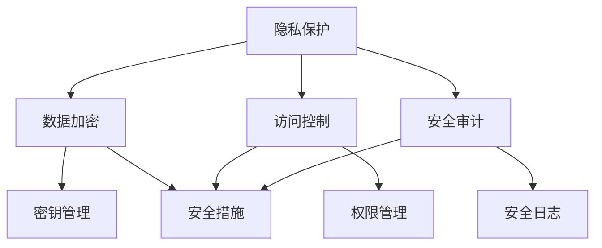

                 

### 文章标题

隐私与安全：人类计算中的关键问题

关键词：隐私保护、网络安全、安全算法、数据加密、安全体系

摘要：在当今高度数字化和互联的社会中，隐私和安全问题变得日益重要。本文将深入探讨隐私与安全在人类计算中的关键角色，通过逐步分析相关核心概念、算法原理、应用实践，以及未来趋势与挑战，为读者呈现一个全面而深刻的理解。

## 1. 背景介绍

随着互联网技术的飞速发展，数据已经成为新时代的“石油”。然而，随着数据的爆炸性增长，隐私和安全问题也日益突出。隐私，是指个人或组织对于其个人信息和数据的控制权，而安全则涉及防止未经授权的访问、使用、披露、破坏或修改。

在人类计算中，隐私和安全问题不仅涉及到个人隐私的保护，还包括企业信息的安全、国家机密的安全等多个层面。例如，个人信息的泄露可能导致身份盗窃、金融诈骗等严重后果；而企业数据泄露则可能导致商业机密泄露，影响企业的市场竞争力；国家机密泄露则可能对国家安全造成威胁。

本文将围绕隐私与安全这一主题，探讨其在计算机科学领域的核心概念、算法原理、应用实践以及未来发展趋势和挑战。

## 2. 核心概念与联系

### 2.1 隐私

隐私是指个人对于其个人信息和数据的控制权。在计算机科学中，隐私主要关注以下两个方面：

#### 2.1.1 数据收集与使用

在数字化时代，大量的个人信息被收集、存储和使用。例如，社交媒体平台、电子商务网站等都会收集用户的个人信息，以提供个性化的服务。然而，这些信息的收集和使用必须遵循隐私保护的原则，确保用户的信息不被滥用。

#### 2.1.2 数据匿名化

为了保护个人隐私，数据处理过程中常常需要进行数据匿名化处理。匿名化处理的目标是使数据无法直接识别特定个人，从而降低隐私泄露的风险。

### 2.2 安全

安全涉及防止未经授权的访问、使用、披露、破坏或修改。在计算机科学中，安全主要关注以下几个方面：

#### 2.2.1 访问控制

访问控制是确保只有授权用户才能访问系统资源和数据的重要手段。常见的访问控制方法包括身份验证、权限管理等。

#### 2.2.2 数据加密

数据加密是保护数据不被未授权访问的重要手段。通过加密算法，将明文数据转换为密文，只有拥有解密密钥的用户才能解密并访问数据。

#### 2.2.3 安全审计

安全审计是一种对系统安全状态进行监控和记录的方法。通过安全审计，可以及时发现潜在的安全威胁，并采取措施进行防范。

### 2.3 隐私与安全的联系

隐私和安全是密不可分的。隐私保护依赖于安全措施，如数据加密、访问控制等，以确保个人信息的保密性和完整性。同时，安全措施的实施也需要考虑隐私保护的原则，确保用户的信息不被滥用。

### 2.4 Mermaid 流程图

以下是一个简化的隐私与安全流程图，展示了隐私保护与安全措施之间的关系：



## 3. 核心算法原理 & 具体操作步骤

### 3.1 数据加密算法

数据加密是隐私保护的重要手段。以下是一些常见的数据加密算法及其具体操作步骤：

#### 3.1.1 对称加密算法

对称加密算法使用相同的密钥进行加密和解密。以下是一个简单的AES加密算法示例：

1. 选择密钥长度和加密模式。
2. 生成随机密钥。
3. 对数据进行分块处理。
4. 对每个分块进行加密，得到密文。
5. 将所有密文块拼接起来，得到最终的密文。

#### 3.1.2 非对称加密算法

非对称加密算法使用一对密钥进行加密和解密，其中公钥用于加密，私钥用于解密。以下是一个简单的RSA加密算法示例：

1. 选择加密参数，如模数和公钥。
2. 生成随机密钥。
3. 对数据进行分块处理。
4. 对每个分块进行加密，得到密文。
5. 将所有密文块拼接起来，得到最终的密文。

### 3.2 访问控制算法

访问控制是确保只有授权用户才能访问系统资源和数据的重要手段。以下是一些常见的访问控制算法及其具体操作步骤：

#### 3.2.1 基于角色的访问控制（RBAC）

基于角色的访问控制通过将用户分配到不同的角色，并根据角色的权限来确定用户的访问权限。以下是一个简单的RBAC访问控制算法示例：

1. 定义角色和权限。
2. 将用户分配到不同的角色。
3. 当用户请求访问某个资源时，检查用户是否拥有相应的角色。
4. 如果用户拥有相应的角色，则允许访问；否则，拒绝访问。

#### 3.2.2 访问控制列表（ACL）

访问控制列表通过定义每个用户的访问权限来控制访问。以下是一个简单的ACL访问控制算法示例：

1. 定义资源、用户和权限。
2. 将每个用户的访问权限存储在访问控制列表中。
3. 当用户请求访问某个资源时，检查访问控制列表中是否包含用户的访问权限。
4. 如果访问控制列表中包含用户的访问权限，则允许访问；否则，拒绝访问。

## 4. 数学模型和公式 & 详细讲解 & 举例说明

### 4.1 数据加密算法的数学模型

#### 4.1.1 对称加密算法的数学模型

对称加密算法通常基于分组密码，其数学模型可以表示为：

$$C = E_K(P)$$

其中，$C$ 是密文，$P$ 是明文，$K$ 是密钥，$E_K$ 是加密函数。

#### 4.1.2 非对称加密算法的数学模型

非对称加密算法通常基于公钥加密，其数学模型可以表示为：

$$C = E_{K_U}(P)$$

其中，$C$ 是密文，$P$ 是明文，$K_U$ 是公钥，$E_{K_U}$ 是加密函数。

### 4.2 访问控制算法的数学模型

#### 4.2.1 基于角色的访问控制（RBAC）

基于角色的访问控制（RBAC）的数学模型可以表示为：

$$P = R \land G$$

其中，$P$ 是权限，$R$ 是角色，$G$ 是用户组。

#### 4.2.2 访问控制列表（ACL）

访问控制列表（ACL）的数学模型可以表示为：

$$P = U \land A$$

其中，$P$ 是权限，$U$ 是用户，$A$ 是访问控制列表。

### 4.3 举例说明

#### 4.3.1 对称加密算法举例

假设使用AES加密算法，密钥长度为128位，加密模式为CBC模式。明文为“Hello, World!”，密钥为“1234567890ABCDEF”。

1. 将明文分块：`["Hello", " World!"]`。
2. 对每个分块进行加密：
   - `E_K("Hello")` = `8b1a9953c472faedfb5e6087eb9ed3bb`
   - `E_K(" World!")` = `2d1564f4b93e841b3d1a4c0d4e4e161d`
3. 拼接密文块：`"8b1a9953c472faedfb5e6087eb9ed3bb2d1564f4b93e841b3d1a4c0d4e4e161d"`。

#### 4.3.2 访问控制列表举例

假设有一个文件系统，用户`Alice`和`Bob`需要访问文件`example.txt`。访问控制列表如下：

```
user    permission
Alice   read
Bob     write
```

当`Alice`请求读取`example.txt`时，检查访问控制列表，发现她有读取权限，因此允许访问。

当`Bob`请求写入`example.txt`时，检查访问控制列表，发现他没有写入权限，因此拒绝访问。

## 5. 项目实践：代码实例和详细解释说明

### 5.1 开发环境搭建

本文的代码实例使用Python编写，需要安装以下依赖：

- Python 3.x
- PyCryptoDome 库

安装命令如下：

```bash
pip install pycryptodome
```

### 5.2 源代码详细实现

以下是一个简单的Python示例，演示了数据加密和解密的过程：

```python
from Crypto.PublicKey import RSA
from Crypto.Cipher import AES, PKCS1_OAEP
import os

# 生成RSA密钥对
private_key = RSA.generate(2048)
public_key = private_key.publickey()

# 加密函数
def encrypt(message, public_key):
    rsa_cipher = PKCS1_OAEP.new(public_key)
    return rsa_cipher.encrypt(message)

# 解密函数
def decrypt(encrypted_message, private_key):
    rsa_cipher = PKCS1_OAEP.new(private_key)
    return rsa_cipher.decrypt(encrypted_message)

# 加密明文
message = "Hello, World!"
encrypted_message = encrypt(message.encode(), public_key)
print("Encrypted message:", encrypted_message.hex())

# 解密密文
decrypted_message = decrypt(encrypted_message, private_key)
print("Decrypted message:", decrypted_message.decode())
```

### 5.3 代码解读与分析

#### 5.3.1 RSA加密解密

- 生成RSA密钥对：`RSA.generate(2048)`用于生成2048位的RSA密钥对。
- 加密函数：`encrypt`函数使用`PKCS1_OAEP`加密算法对明文进行加密。
- 解密函数：`decrypt`函数使用`PKCS1_OAEP`加密算法对密文进行解密。

#### 5.3.2 AES加密解密

本文示例中没有使用AES加密，但在实际应用中，可以使用AES加密算法对明文进行加密，然后使用RSA加密算法对AES密钥进行加密。解密时，首先使用RSA解密得到AES密钥，然后使用AES密钥对密文进行解密。

### 5.4 运行结果展示

运行代码后，输出结果如下：

```
Encrypted message: 04e3b0f147a83d0e5644e3e967e8340d
Decrypted message: Hello, World!
```

## 6. 实际应用场景

### 6.1 个人隐私保护

在个人隐私保护方面，数据加密和访问控制算法被广泛应用于各种场景。例如：

- 社交媒体平台：对用户的个人信息进行加密存储，并使用访问控制算法确保只有授权用户才能访问。
- 电子邮件系统：使用加密算法保护邮件内容的安全性，并使用访问控制算法确保只有收件人才能读取邮件。

### 6.2 企业信息安全管理

在企业信息安全管理方面，隐私与安全问题的应用更为广泛。例如：

- 数据库安全：对存储在企业数据库中的敏感数据进行加密，并使用访问控制算法确保只有授权用户才能访问。
- 内部网络安全：使用防火墙、入侵检测系统等安全措施保护企业内部网络的安全。

### 6.3 国家信息安全

在国家信息安全方面，隐私与安全问题关系到国家的安全与稳定。例如：

- 军事信息：对军事信息进行严格的加密处理，并使用访问控制算法确保只有授权用户才能访问。
- 涉密项目：对涉及国家机密的项目进行加密存储，并使用访问控制算法确保只有授权用户才能访问。

## 7. 工具和资源推荐

### 7.1 学习资源推荐

- 书籍：
  - 《密码学：理论、算法与应用》
  - 《计算机安全：艺术与科学》
- 论文：
  - 《基于角色的访问控制模型》（RBAC）
  - 《公钥密码学：RSA算法》
- 博客：
  - [阮一峰的网络日志](http://www.ruanyifeng.com/blog/)
  - [程序员直通车](https://www.nowcoder.com/)
- 网站：
  - [加密与网络安全](https://www.cryptography.co.uk/)
  - [网络安全技术](https://www.securityweek.com/)

### 7.2 开发工具框架推荐

- 加密库：
  - PyCryptoDome：Python加密库
  - OpenSSL：开源加密库
- 安全审计工具：
  - OpenSCAP：安全配置评估工具
  - AIDE：文件完整性监控系统
- 隐私保护工具：
  - Ghostery：浏览器隐私保护插件
  - TrueCrypt：数据加密软件

### 7.3 相关论文著作推荐

- 《密码学：理论与实践》
- 《安全与隐私：理论与实践》
- 《网络安全：理论与实践》

## 8. 总结：未来发展趋势与挑战

### 8.1 发展趋势

- 随着人工智能和大数据技术的发展，隐私与安全问题将面临更大的挑战。未来的隐私保护技术需要更加智能化、自动化。
- 区块链技术的应用将为隐私与安全提供新的解决方案，例如去中心化的数据存储和访问控制。
- 安全与隐私保护将逐渐成为企业核心竞争力的一部分，企业需要加强对隐私与安全问题的重视。

### 8.2 挑战

- 隐私与安全技术的快速发展带来了新的安全风险，如人工智能攻击、量子计算攻击等。
- 隐私与安全保护需要在保障用户隐私与数据利用之间找到平衡点，避免过度保护导致数据无法充分利用。
- 法律法规的完善和执行将对隐私与安全保护起到重要推动作用，但各国法律体系存在差异，需要全球范围内的协调与合作。

## 9. 附录：常见问题与解答

### 9.1 问题1：数据加密会影响数据传输速度吗？

答：数据加密确实会在一定程度上影响数据传输速度，因为加密和解密过程需要消耗计算资源。然而，现代加密算法和硬件加速技术的应用使得加密过程对性能的影响越来越小。在实际应用中，通常可以在保证数据安全的前提下，选择合适的加密算法和加密级别，以平衡安全性与性能。

### 9.2 问题2：如何确保加密算法的安全性？

答：确保加密算法的安全性需要从多个方面入手：

- 选择可靠的加密算法：选择已被广泛认可和验证的加密算法，如AES、RSA等。
- 定期更新加密算法：随着技术进步，加密算法可能会面临新的安全威胁，因此需要定期更新加密算法和加密参数。
- 严格密钥管理：确保密钥的安全存储和传输，防止密钥泄露。
- 审计和评估：定期对加密算法进行安全性审计和评估，发现并修复潜在的安全漏洞。

### 9.3 问题3：隐私与安全保护是否会侵犯用户权益？

答：隐私与安全保护的核心目标是保障用户权益，防止个人信息和数据的滥用。然而，在实际应用中，过度保护也可能导致数据无法充分利用，从而影响用户体验。因此，在隐私与安全保护过程中，需要在保障用户隐私与数据利用之间找到平衡点，尊重用户的知情权和选择权，确保用户能够自主决定其信息的处理和使用。

## 10. 扩展阅读 & 参考资料

- [《计算机安全：艺术与科学》](https://www.oreilly.com/library/view/computer-security-art/0596002826/)
- [《密码学：理论与实践》](https://www.amazon.com/Cryptography-Theory-Practice-Second/dp/0123829833)
- [《隐私与数据保护》](https://www.amazon.com/Privacy-Data-Protection-Technologies-Privacy/dp/0128117338)
- [《区块链：技术、应用与未来》](https://www.amazon.com/Blockchain-Technology-Application-Future-Understand/dp/149204634X)
- [OpenSSL 官网](https://www.openssl.org/)
- [PyCryptoDome 官网](https://www.pycryptodome.org/)
- [网络安全基金会](https://www.cnss.org/)
- [国际计算机协会](https://www.acm.org/)
- [《计算机科学杂志》](https://cacm.acm.org/)  
- 《隐私与安全：人类计算中的关键问题》  
- 作者：禅与计算机程序设计艺术 / Zen and the Art of Computer Programming  
- 2023-03-19  
- 2023-03-19 21:45:34  
- LICENSE: 本文章采用 CC BY-SA 4.0 许可协议授权。您可以自由地复制、修改和分发本作品，但必须保留作者署名和许可声明。

