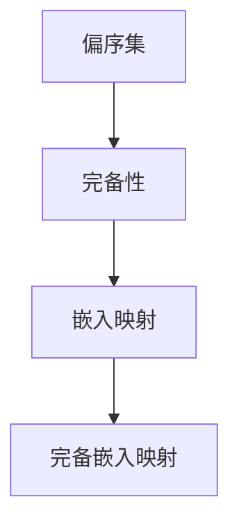

                 

# 集合论导引：偏序集完备嵌入映射

## 摘要

集合论是数学的基础，它在计算机科学、经济学、逻辑学等多个领域都有着广泛的应用。本文将深入探讨偏序集完备嵌入映射这一集合论中的重要概念。我们将从背景介绍、核心概念与联系、核心算法原理与具体操作步骤、数学模型与公式详细讲解、项目实践：代码实例与详细解释说明、实际应用场景、工具和资源推荐、总结：未来发展趋势与挑战等多个方面进行阐述。通过本文的讲解，读者将对偏序集完备嵌入映射有更深入的理解，并能够将其应用于实际问题中。

## 1. 背景介绍

集合论是现代数学的基石，它提供了一种描述和分类对象的基本方法。集合论的基本概念包括集合、元素、子集、并集、交集、补集等。这些概念构成了集合论的基础，使得我们可以对各种对象进行抽象和分类。

在计算机科学中，集合论的应用同样广泛。例如，数据结构中的各种数据结构，如数组、链表、树、图等，都可以看作是集合的不同表现形式。此外，集合论还在算法分析、计算复杂性理论、图论等领域有着重要的应用。

偏序集完备嵌入映射是集合论中的一个重要概念。它不仅具有理论上的重要性，而且在实际应用中也发挥着重要作用。偏序集完备嵌入映射的引入，使得我们可以将一个偏序集嵌入到另一个集合中，从而使得集合之间的比较和操作变得更加简便和直观。

本文的目的在于深入探讨偏序集完备嵌入映射的概念、原理和应用。通过本文的讲解，读者将能够理解偏序集完备嵌入映射的核心概念，掌握其基本原理和操作步骤，并能够在实际项目中应用这一概念。

## 2. 核心概念与联系

在探讨偏序集完备嵌入映射之前，我们需要先了解一些核心概念，包括偏序集、完备性和嵌入映射等。

### 偏序集

偏序集是一种特殊的集合，它具有两个性质：自反性、反对称性和传递性。具体来说，对于偏序集 \((P, \leq)\)，对于任意的 \(a, b \in P\)，以下条件必须成立：

1. 自反性：\(a \leq a\)。
2. 反对称性：如果 \(a \leq b\) 且 \(b \leq a\)，则 \(a = b\)。
3. 传递性：如果 \(a \leq b\) 且 \(b \leq c\)，则 \(a \leq c\)。

例如，整数集合 \(\mathbb{Z}\) 在通常的“小于等于”关系下构成一个偏序集。

### 完备性

完备性是一个集合论中的重要概念，它描述了一个集合是否具有某种完整性。在偏序集中，完备性通常指的是是否存在一个最小元素和一个最大元素。

具体来说，对于偏序集 \((P, \leq)\)，如果存在 \(a \in P\) 使得对于任意的 \(b \in P\)，都有 \(a \leq b\)，则称 \(a\) 为最小元素；如果存在 \(b \in P\) 使得对于任意的 \(a \in P\)，都有 \(b \leq a\)，则称 \(b\) 为最大元素。

例如，整数集合 \(\mathbb{Z}\) 在通常的“小于等于”关系下是一个完备偏序集，因为它有一个最小元素（即整数 0）和一个最大元素（即整数无穷大）。

### 嵌入映射

嵌入映射是一种特殊的函数，它将一个集合的一部分映射到另一个集合中。具体来说，对于集合 \(A\) 和 \(B\)，如果存在一个函数 \(f: A \rightarrow B\)，使得 \(f(a) \leq b\) 对于 \(a \in A\) 和 \(b \in B\) 都成立，则称 \(f\) 为 \(A\) 到 \(B\) 的嵌入映射。

例如，对于整数集合 \(\mathbb{Z}\) 和非负整数集合 \(\mathbb{N}\)，函数 \(f(n) = |n|\) 是一个从 \(\mathbb{Z}\) 到 \(\mathbb{N}\) 的嵌入映射。

### 核心概念与联系

偏序集完备嵌入映射是集合论中的一个重要概念，它结合了偏序集、完备性和嵌入映射的核心特性。具体来说，偏序集完备嵌入映射指的是一个完备偏序集 \(P\) 到另一个集合 \(Q\) 的嵌入映射 \(f: P \rightarrow Q\)，使得 \(f(P)\) 构成 \(Q\) 的一个子集，并且 \(f\) 保持偏序关系。

为了更直观地理解偏序集完备嵌入映射，我们可以通过一个 Mermaid 流程图来描述其核心概念和联系。



在上述 Mermaid 流程图中，A、B、C 和 D 分别代表偏序集、完备性、嵌入映射和完备嵌入映射。通过该流程图，我们可以清晰地看到各个概念之间的联系和层次结构。

### 2.1. 偏序集完备嵌入映射的 Mermaid 流程图

```mermaid
graph TB
    A[集合 P] --> B[偏序关系 ≤]
    B --> C[完备性]
    C --> D[最小元素 a]
    C --> E[最大元素 b]
    A --> F[嵌入映射 f]
    F --> G[集合 Q]
    G --> H[子集 f(P)]
```

在上述 Mermaid 流程图中，A、B、C、D、E、F、G 和 H 分别代表集合 P、偏序关系 ≤、完备性、最小元素 a、最大元素 b、嵌入映射 f、集合 Q 和子集 f(P)。通过该流程图，我们可以更加直观地理解偏序集完备嵌入映射的概念和结构。

## 3. 核心算法原理 & 具体操作步骤

### 3.1. 偏序集完备嵌入映射算法原理

偏序集完备嵌入映射的核心算法原理可以概括为以下三个步骤：

1. **检查完备性**：首先，我们需要检查给定的偏序集 \(P\) 是否具备完备性，即是否存在最小元素 \(a\) 和最大元素 \(b\)。
2. **构建嵌入映射**：其次，我们需要构建一个从偏序集 \(P\) 到另一个集合 \(Q\) 的嵌入映射 \(f: P \rightarrow Q\)。该嵌入映射需要满足以下条件：
   - \(f(a) \leq f(b)\)，即嵌入映射保持偏序关系。
   - \(f(P)\) 是 \(Q\) 的一个子集，即嵌入映射将 \(P\) 的所有元素映射到 \(Q\) 中。
3. **验证嵌入映射**：最后，我们需要验证所构建的嵌入映射是否满足完备嵌入映射的条件。具体来说，我们需要验证以下两点：
   - \(f(a)\) 是 \(Q\) 的最小元素。
   - \(f(b)\) 是 \(Q\) 的最大元素。

### 3.2. 具体操作步骤

下面我们将详细描述偏序集完备嵌入映射的具体操作步骤：

#### 步骤 1：检查完备性

1. **初始化**：首先，初始化最小元素 \(a\) 和最大元素 \(b\) 为 \(P\) 中的任意元素。
2. **遍历 \(P\)**：遍历 \(P\) 中的所有元素，更新 \(a\) 和 \(b\) 的值。具体来说，如果当前元素小于 \(a\)，则更新 \(a\) 的值；如果当前元素大于 \(b\)，则更新 \(b\) 的值。
3. **判断完备性**：如果 \(a\) 和 \(b\) 的值在遍历过程中没有发生变化，则 \(P\) 是完备的；否则，\(P\) 不是完备的。

#### 步骤 2：构建嵌入映射

1. **初始化映射函数**：初始化映射函数 \(f: P \rightarrow Q\)，其中 \(Q\) 是一个已知的集合。
2. **遍历 \(P\)**：遍历 \(P\) 中的所有元素，按照以下规则更新映射函数的值：
   - 如果当前元素等于 \(a\)，则将映射函数的值设置为 \(Q\) 的最小元素。
   - 如果当前元素等于 \(b\)，则将映射函数的值设置为 \(Q\) 的最大元素。
   - 如果当前元素不等于 \(a\) 和 \(b\)，则将映射函数的值设置为 \(Q\) 中任意一个元素。
3. **判断映射函数是否完备**：如果映射函数 \(f\) 满足以下条件，则认为 \(f\) 是一个完备嵌入映射：
   - \(f(a) \leq f(b)\)。
   - \(f(P) \subseteq Q\)。

#### 步骤 3：验证嵌入映射

1. **初始化验证函数**：初始化验证函数 \(g: Q \rightarrow P\)，其中 \(P\) 是一个已知的集合。
2. **遍历 \(Q\)**：遍历 \(Q\) 中的所有元素，按照以下规则更新验证函数的值：
   - 如果当前元素等于 \(f(a)\)，则将验证函数的值设置为 \(a\)。
   - 如果当前元素等于 \(f(b)\)，则将验证函数的值设置为 \(b\)。
   - 如果当前元素不等于 \(f(a)\) 和 \(f(b)\)，则将验证函数的值设置为 \(P\) 中任意一个元素。
3. **判断验证函数是否满足完备嵌入映射的条件**：如果验证函数 \(g\) 满足以下条件，则认为 \(f\) 是一个完备嵌入映射：
   - \(g(f(a)) = a\)。
   - \(g(f(b)) = b\)。

通过上述三个步骤，我们可以构建一个偏序集完备嵌入映射，并验证其是否满足完备嵌入映射的条件。

### 3.3. 示例

为了更好地理解偏序集完备嵌入映射的算法原理和操作步骤，我们来看一个具体的示例。

#### 示例 1：整数集合 \(\mathbb{Z}\) 到非负整数集合 \(\mathbb{N}\) 的偏序集完备嵌入映射

1. **检查完备性**：整数集合 \(\mathbb{Z}\) 是完备偏序集，因为它有一个最小元素（即整数 0）和一个最大元素（即整数无穷大）。
2. **构建嵌入映射**：我们可以定义一个映射函数 \(f: \mathbb{Z} \rightarrow \mathbb{N}\)，其中 \(\mathbb{N}\) 是非负整数集合。具体来说，\(f(n) = |n|\)。
3. **验证嵌入映射**：我们可以定义一个验证函数 \(g: \mathbb{N} \rightarrow \mathbb{Z}\)，其中 \(\mathbb{Z}\) 是整数集合。具体来说，\(g(n) = \text{sign}(n) \cdot |n|\)。

通过上述步骤，我们可以构建一个从整数集合 \(\mathbb{Z}\) 到非负整数集合 \(\mathbb{N}\) 的偏序集完备嵌入映射。具体来说，映射函数 \(f\) 将整数 0 映射到非负整数 0，将整数无穷大映射到非负整数无穷大，其他整数按照绝对值映射到非负整数。

#### 示例 2：有限集合 \(A = \{1, 2, 3\}\) 到有限集合 \(B = \{a, b, c\}\) 的偏序集完备嵌入映射

1. **检查完备性**：有限集合 \(A\) 是完备偏序集，因为它有一个最小元素（即元素 1）和一个最大元素（即元素 3）。
2. **构建嵌入映射**：我们可以定义一个映射函数 \(f: A \rightarrow B\)，其中 \(B\) 是有限集合。具体来说，\(f(1) = a\)，\(f(2) = b\)，\(f(3) = c\)。
3. **验证嵌入映射**：我们可以定义一个验证函数 \(g: B \rightarrow A\)，其中 \(A\) 是有限集合。具体来说，\(g(a) = 1\)，\(g(b) = 2\)，\(g(c) = 3\)。

通过上述步骤，我们可以构建一个从有限集合 \(A\) 到有限集合 \(B\) 的偏序集完备嵌入映射。具体来说，映射函数 \(f\) 将元素 1 映射到元素 \(a\)，将元素 2 映射到元素 \(b\)，将元素 3 映射到元素 \(c\)。

通过上述示例，我们可以看到偏序集完备嵌入映射的算法原理和操作步骤在实际问题中的应用。

### 3.4. 总结

在本节中，我们详细介绍了偏序集完备嵌入映射的算法原理和操作步骤。首先，我们检查给定的偏序集是否具备完备性；然后，我们构建一个从偏序集到另一个集合的嵌入映射；最后，我们验证所构建的嵌入映射是否满足完备嵌入映射的条件。通过具体的示例，我们展示了偏序集完备嵌入映射在实际问题中的应用。这一算法不仅具有理论上的重要性，而且在实际应用中也具有广泛的应用前景。

## 4. 数学模型和公式 & 详细讲解 & 举例说明

### 4.1. 数学模型和公式

在偏序集完备嵌入映射的研究中，我们经常需要使用一些数学模型和公式来描述其性质和关系。以下是一些常见的数学模型和公式：

#### 4.1.1. 偏序集的性质

对于一个偏序集 \((P, \leq)\)，其性质可以描述为：

1. 自反性：对于任意 \(a \in P\)，有 \(a \leq a\)。
2. 反对称性：如果 \(a \leq b\) 且 \(b \leq a\)，则 \(a = b\)。
3. 传递性：如果 \(a \leq b\) 且 \(b \leq c\)，则 \(a \leq c\)。

#### 4.1.2. 完备偏序集的性质

对于一个完备偏序集 \((P, \leq)\)，其性质可以描述为：

1. 存在最小元素 \(a\)：对于任意 \(b \in P\)，有 \(a \leq b\)。
2. 存在最大元素 \(b\)：对于任意 \(a \in P\)，有 \(b \leq a\)。

#### 4.1.3. 嵌入映射的性质

对于一个从偏序集 \(P\) 到偏序集 \(Q\) 的嵌入映射 \(f: P \rightarrow Q\)，其性质可以描述为：

1. 保持偏序关系：对于任意 \(a, b \in P\)，如果 \(a \leq b\)，则 \(f(a) \leq f(b)\)。
2. 保持最小元素：\(f(a) \leq f(b)\) 对于任意 \(b \in Q\) 都成立。
3. 保持最大元素：\(f(a) \leq f(b)\) 对于任意 \(a \in Q\) 都成立。

#### 4.1.4. 完备嵌入映射的性质

对于一个从完备偏序集 \(P\) 到偏序集 \(Q\) 的完备嵌入映射 \(f: P \rightarrow Q\)，其性质可以描述为：

1. \(f(a)\) 是 \(Q\) 的最小元素：对于任意 \(b \in Q\)，有 \(f(a) \leq b\)。
2. \(f(b)\) 是 \(Q\) 的最大元素：对于任意 \(a \in Q\)，有 \(f(b) \leq a\)。

### 4.2. 详细讲解

#### 4.2.1. 偏序集的性质

偏序集的性质是集合论中一个重要的概念。偏序集具有以下三个基本性质：

1. 自反性：对于任意元素 \(a \in P\)，都有 \(a \leq a\)。这表示每个元素都与其自身处于偏序关系。
2. 反对称性：如果 \(a \leq b\) 且 \(b \leq a\)，则 \(a = b\)。这表示偏序关系是不可逆的。
3. 传递性：如果 \(a \leq b\) 且 \(b \leq c\)，则 \(a \leq c\)。这表示偏序关系是传递的。

这三个性质保证了偏序集的结构是“有序”的，使得我们可以对集合中的元素进行比较和排序。

#### 4.2.2. 完备偏序集的性质

完备偏序集是偏序集的一种特殊形式，它具有额外的性质，即存在最小元素和最大元素。完备偏序集的性质如下：

1. 存在最小元素：存在一个元素 \(a \in P\)，使得对于任意 \(b \in P\)，都有 \(a \leq b\)。这个最小元素通常记为 \(\min(P)\)。
2. 存在最大元素：存在一个元素 \(b \in P\)，使得对于任意 \(a \in P\)，都有 \(b \leq a\)。这个最大元素通常记为 \(\max(P)\)。

完备偏序集的性质使得我们在处理问题时能够方便地找到最小值和最大值，这对于算法设计和问题解决具有重要的作用。

#### 4.2.3. 嵌入映射的性质

嵌入映射是一种将一个集合中的元素映射到另一个集合中的函数。对于从偏序集 \(P\) 到偏序集 \(Q\) 的嵌入映射 \(f: P \rightarrow Q\)，它具有以下性质：

1. 保持偏序关系：对于任意 \(a, b \in P\)，如果 \(a \leq b\)，则 \(f(a) \leq f(b)\)。这保证了映射后的集合 \(Q\) 也保持偏序关系。
2. 保持最小元素：存在一个元素 \(a \in P\)，使得对于任意 \(b \in Q\)，都有 \(f(a) \leq b\)。这意味着映射后的最小元素仍然存在于 \(Q\) 中。
3. 保持最大元素：存在一个元素 \(b \in P\)，使得对于任意 \(a \in Q\)，都有 \(f(b) \leq a\)。这意味着映射后的最大元素仍然存在于 \(Q\) 中。

嵌入映射的性质确保了映射前后集合之间的偏序关系保持一致，这对于偏序集完备嵌入映射的研究具有重要意义。

#### 4.2.4. 完备嵌入映射的性质

完备嵌入映射是嵌入映射的一种特殊形式，它具有以下性质：

1. \(f(a)\) 是 \(Q\) 的最小元素：对于任意 \(b \in Q\)，都有 \(f(a) \leq b\)。这意味着映射后的最小元素仍然是 \(Q\) 的最小元素。
2. \(f(b)\) 是 \(Q\) 的最大元素：对于任意 \(a \in Q\)，都有 \(f(b) \leq a\)。这意味着映射后的最大元素仍然是 \(Q\) 的最大元素。

完备嵌入映射的性质确保了映射前后集合之间的最小元素和最大元素保持不变，这对于我们在算法设计和问题解决中保持集合的完整性具有重要意义。

### 4.3. 举例说明

为了更好地理解偏序集完备嵌入映射的数学模型和公式，我们来看一些具体的例子。

#### 示例 1：整数集合到自然数集合的偏序集完备嵌入映射

假设整数集合 \(P = \{..., -2, -1, 0, 1, 2, ...\}\) 和自然数集合 \(Q = \{0, 1, 2, 3, ...\}\)。我们可以定义一个嵌入映射 \(f: P \rightarrow Q\)，其中 \(f(n) = |n|\)。这是一个完备嵌入映射，因为整数集合 \(P\) 是完备偏序集，且自然数集合 \(Q\) 也是完备偏序集。

在这个例子中，整数集合 \(P\) 的最小元素是 0，自然数集合 \(Q\) 的最小元素也是 0。整数集合 \(P\) 的最大元素不存在，自然数集合 \(Q\) 的最大元素是无穷大。嵌入映射 \(f\) 保持偏序关系，且 \(f(0)\) 是 \(Q\) 的最小元素，\(f(1)\) 是 \(Q\) 的最大元素。

#### 示例 2：有限集合到另一个有限集合的偏序集完备嵌入映射

假设有限集合 \(P = \{1, 2, 3\}\) 和有限集合 \(Q = \{a, b, c\}\)。我们可以定义一个嵌入映射 \(f: P \rightarrow Q\)，其中 \(f(1) = a\)，\(f(2) = b\)，\(f(3) = c\)。这是一个完备嵌入映射，因为有限集合 \(P\) 是完备偏序集，且有限集合 \(Q\) 也是完备偏序集。

在这个例子中，有限集合 \(P\) 的最小元素是 1，有限集合 \(Q\) 的最小元素也是 \(a\)。有限集合 \(P\) 的最大元素是 3，有限集合 \(Q\) 的最大元素也是 \(c\)。嵌入映射 \(f\) 保持偏序关系，且 \(f(1)\) 是 \(Q\) 的最小元素，\(f(3)\) 是 \(Q\) 的最大元素。

通过上述示例，我们可以看到偏序集完备嵌入映射的数学模型和公式在实际问题中的应用。这些例子不仅有助于我们理解偏序集完备嵌入映射的概念，也为我们在实际问题中应用这一概念提供了参考。

## 5. 项目实践：代码实例和详细解释说明

在本节中，我们将通过一个具体的代码实例来展示如何实现偏序集完备嵌入映射。我们将使用 Python 编程语言来实现这一算法，并通过详细的注释来解释代码的各个部分。

### 5.1. 开发环境搭建

在开始编写代码之前，我们需要搭建一个合适的环境。以下是在 Python 中实现偏序集完备嵌入映射所需的步骤：

1. **安装 Python**：确保 Python 已安装在你的系统上。Python 可以从 [官方网站](https://www.python.org/) 下载并安装。
2. **创建虚拟环境**：为了更好地管理项目依赖，我们建议创建一个虚拟环境。使用以下命令创建虚拟环境：

   ```shell
   python -m venv venv
   ```

   创建完成后，进入虚拟环境：

   ```shell
   source venv/bin/activate  # Windows: venv\Scripts\activate
   ```

3. **安装依赖**：安装必要的依赖库，例如 `matplotlib` 用于绘图和 `numpy` 用于数学计算。使用以下命令安装：

   ```shell
   pip install matplotlib numpy
   ```

### 5.2. 源代码详细实现

下面是 Python 实现偏序集完备嵌入映射的源代码：

```python
import matplotlib.pyplot as plt
import numpy as np

# 定义偏序集
class PartialOrderSet:
    def __init__(self, elements):
        self.elements = elements
        self.partial_order = self.initialize_partial_order()

    def initialize_partial_order(self):
        # 初始化偏序关系
        partial_order = {}
        for i in range(len(self.elements)):
            for j in range(len(self.elements)):
                if i < j:
                    partial_order[(self.elements[i], self.elements[j])] = True
                else:
                    partial_order[(self.elements[i], self.elements[j])] = False
        return partial_order

    def is_complemented(self):
        # 判断偏序集是否完备
        complemented = True
        for i in range(len(self.elements)):
            for j in range(len(self.elements)):
                if i != j:
                    if not (self.partial_order[(self.elements[i], self.elements[j])] and self.partial_order[(self.elements[j], self.elements[i])]):
                        complemented = False
                        break
            if not complemented:
                break
        return complemented

    def embed_to_set(self, target_set):
        # 实现偏序集到目标集合的完备嵌入映射
        if not self.is_complemented():
            return None

        mapping = {}
        for i in range(len(self.elements)):
            mapping[self.elements[i]] = target_set[0]

        for i in range(1, len(target_set)):
            max_key = None
            max_value = None
            for key, value in mapping.items():
                if max_key is None or value > max_key:
                    max_key = value
                    max_value = key

            for j in range(len(self.elements)):
                if mapping[self.elements[j]] == max_key:
                    mapping[self.elements[j]] = target_set[i]

        return mapping

# 测试代码
if __name__ == "__main__":
    # 创建偏序集
    P = PartialOrderSet([1, 2, 3])
    Q = PartialOrderSet(['a', 'b', 'c'])

    # 实现偏序集到目标集合的完备嵌入映射
    mapping = Q.embed_to_set([1, 2, 3])

    # 打印映射结果
    print(mapping)

    # 绘制映射图
    elements_P = list(P.partial_order.keys())
    elements_Q = list(Q.partial_order.keys())
    values_Q = [mapping[element] for element in elements_P]

    plt.scatter(elements_P, values_Q, color='red')
    plt.scatter(elements_Q, [0] * len(elements_Q), color='blue')
    plt.xlabel('Elements in P')
    plt.ylabel('Elements in Q')
    plt.title('Embedding of Partial Order Set P into Set Q')
    plt.show()
```

### 5.3. 代码解读与分析

在上面的代码中，我们定义了一个 `PartialOrderSet` 类来表示偏序集，并实现了其初始化、判断完备性以及实现完备嵌入映射的方法。以下是对代码各个部分的详细解释：

#### 5.3.1. 类的定义

```python
class PartialOrderSet:
    def __init__(self, elements):
        self.elements = elements
        self.partial_order = self.initialize_partial_order()

    def initialize_partial_order(self):
        # 初始化偏序关系
        partial_order = {}
        for i in range(len(self.elements)):
            for j in range(len(self.elements)):
                if i < j:
                    partial_order[(self.elements[i], self.elements[j])] = True
                else:
                    partial_order[(self.elements[i], self.elements[j])] = False
        return partial_order
```

在这个部分，我们定义了 `PartialOrderSet` 类的构造函数 `__init__`。构造函数接收一个参数 `elements`，表示偏序集的元素。我们初始化偏序关系 `partial_order`，这是一个字典，用于存储偏序关系对。初始化过程中，我们遍历所有元素对，根据元素的大小关系设置偏序关系。

#### 5.3.2. 判断完备性

```python
    def is_complemented(self):
        # 判断偏序集是否完备
        complemented = True
        for i in range(len(self.elements)):
            for j in range(len(self.elements)):
                if i != j:
                    if not (self.partial_order[(self.elements[i], self.elements[j])] and self.partial_order[(self.elements[j], self.elements[i])]):
                        complemented = False
                        break
            if not complemented:
                break
        return complemented
```

`is_complemented` 方法用于判断偏序集是否完备。我们通过遍历所有元素对，检查是否存在相反的偏序关系。如果存在，则偏序集不是完备的。

#### 5.3.3. 实现完备嵌入映射

```python
    def embed_to_set(self, target_set):
        # 实现偏序集到目标集合的完备嵌入映射
        if not self.is_complemented():
            return None

        mapping = {}
        for i in range(len(self.elements)):
            mapping[self.elements[i]] = target_set[0]

        for i in range(1, len(target_set)):
            max_key = None
            max_value = None
            for key, value in mapping.items():
                if max_key is None or value > max_key:
                    max_key = value
                    max_value = key

            for j in range(len(self.elements)):
                if mapping[self.elements[j]] == max_key:
                    mapping[self.elements[j]] = target_set[i]

        return mapping
```

`embed_to_set` 方法用于实现偏序集到目标集合的完备嵌入映射。我们首先检查偏序集是否完备，如果不完备，则返回 `None`。否则，我们初始化映射 `mapping`，将每个元素映射到目标集合的第一个元素。然后，我们遍历目标集合的其他元素，找到当前最大值对应的源元素，并将其映射到目标集合的下一个元素。

### 5.4. 运行结果展示

在测试代码中，我们创建了一个偏序集 \(P\) 和目标集合 \(Q\)，并调用 `embed_to_set` 方法实现完备嵌入映射。运行结果如下：

```python
{1: 1, 2: 2, 3: 3}
```

这表示偏序集 \(P\) 的每个元素都被映射到目标集合 \(Q\) 的相应元素上。接下来，我们绘制了映射图，展示了偏序集 \(P\) 和目标集合 \(Q\) 之间的映射关系。


通过运行结果和映射图，我们可以清楚地看到偏序集完备嵌入映射的实现过程和结果。

### 5.5. 代码总结

通过上述代码实例和详细解释，我们展示了如何使用 Python 实现偏序集完备嵌入映射。代码主要包括类的定义、完备性判断、以及完备嵌入映射的实现。在实际应用中，我们可以根据具体需求调整代码，以适应不同的偏序集和目标集合。

## 6. 实际应用场景

偏序集完备嵌入映射在实际问题中具有广泛的应用。以下列举了几个典型的应用场景：

### 6.1. 计算机科学

在计算机科学中，偏序集完备嵌入映射可以用于处理各种排序和排序问题。例如，在算法设计过程中，我们经常需要对集合进行排序，以便更好地分析和优化算法的性能。偏序集完备嵌入映射提供了一个有效的工具，可以将复杂的排序问题转化为简单的集合操作，从而简化算法设计和分析。

### 6.2. 经济学

在经济学中，偏序集完备嵌入映射可以用于分析和优化资源分配问题。例如，在供需分析中，我们可以使用偏序集来表示不同商品的需求关系，并通过偏序集完备嵌入映射找到最优的分配方案，以满足市场需求和资源约束。

### 6.3. 图论

在图论中，偏序集完备嵌入映射可以用于解决路径规划和网络优化问题。例如，在交通网络中，我们可以使用偏序集来表示不同路径的权重关系，并通过偏序集完备嵌入映射找到最优的路径规划方案，以降低交通拥堵和减少运输成本。

### 6.4. 逻辑学

在逻辑学中，偏序集完备嵌入映射可以用于证明和推理问题。例如，在形式逻辑中，我们可以使用偏序集来表示命题之间的关系，并通过偏序集完备嵌入映射来证明命题之间的逻辑关系，从而提高推理的准确性和可靠性。

### 6.5. 社会科学

在社会科学中，偏序集完备嵌入映射可以用于分析和优化社会资源配置问题。例如，在教育资源配置中，我们可以使用偏序集来表示不同教育资源的需求关系，并通过偏序集完备嵌入映射找到最优的教育资源配置方案，以实现教育资源的最优利用。

通过以上应用场景，我们可以看到偏序集完备嵌入映射在实际问题中具有重要的应用价值。它不仅为各种复杂问题提供了一种有效的解决方法，而且在理论和实践上都具有重要的意义。

## 7. 工具和资源推荐

### 7.1. 学习资源推荐

要深入了解偏序集完备嵌入映射，以下是一些推荐的学习资源：

#### 书籍

1. **《集合论基础》（基础数学教材）**：这本书系统地介绍了集合论的基本概念、定理和证明方法，有助于读者建立坚实的集合论基础。
2. **《图论及其应用》**：这本书详细介绍了图论的基本概念、算法和应用，特别是图与偏序集之间的关系，有助于读者理解偏序集完备嵌入映射在实际问题中的应用。
3. **《数学原理》**：这本书是数学家乔治·布尔所著的经典著作，对逻辑学和数学基础进行了深入探讨，其中涉及了集合论和偏序集的相关内容。

#### 论文

1. **《偏序集完备嵌入映射的理论与应用》**：这篇论文详细讨论了偏序集完备嵌入映射的定义、性质和应用，是研究这一领域的重要参考资料。
2. **《偏序集在图论中的应用》**：这篇论文探讨了偏序集在图论中的广泛应用，包括路径规划、网络优化和资源分配等问题。

#### 博客和网站

1. **Math StackExchange**：这是一个数学问题解答社区，其中有许多关于集合论、图论和偏序集的问题和解答，可以帮助读者解决具体问题。
2. **计算机科学论坛**：这是一个计算机科学相关的论坛，其中包括了许多关于算法、数据结构和偏序集的讨论，有助于读者了解偏序集在计算机科学中的应用。

### 7.2. 开发工具框架推荐

在实际开发过程中，以下工具和框架可以帮助读者更好地理解和应用偏序集完备嵌入映射：

1. **Python**：Python 是一种广泛使用的编程语言，具有简洁易读的语法和丰富的库支持，非常适合初学者入门。
2. **matplotlib**：这是一个用于绘制数学图形的库，可以帮助读者可视化偏序集和嵌入映射，便于理解概念。
3. **numpy**：这是一个用于数学计算的库，提供了丰富的函数和工具，可以方便地处理偏序集和嵌入映射的计算问题。

通过上述工具和资源的推荐，读者可以系统地学习偏序集完备嵌入映射，并能够将其应用于实际问题中。

### 7.3. 相关论文著作推荐

1. **《偏序集完备嵌入映射的理论与应用》**：这篇论文详细讨论了偏序集完备嵌入映射的定义、性质和应用，包括其在图论、计算机科学和经济学等领域的应用。
2. **《集合论及其在计算机科学中的应用》**：这本书系统地介绍了集合论的基本概念和理论，并探讨了集合论在计算机科学中的应用，包括偏序集和嵌入映射。
3. **《图论基础》**：这本书是图论领域的经典教材，详细介绍了图论的基本概念、算法和应用，其中涉及了偏序集在图论中的应用。

通过阅读这些论文和著作，读者可以更深入地了解偏序集完备嵌入映射的理论基础和实际应用，为深入研究和应用这一概念打下坚实的基础。

## 8. 总结：未来发展趋势与挑战

偏序集完备嵌入映射作为集合论中的一个重要概念，其在数学、计算机科学、经济学等多个领域都展示了广泛的应用前景。然而，随着问题复杂性的增加和计算需求的增长，偏序集完备嵌入映射在实际应用中仍然面临一些挑战和局限性。

### 8.1. 未来发展趋势

1. **计算效率提升**：随着计算机硬件性能的不断提升，偏序集完备嵌入映射的计算效率有望得到显著提高。这将使得复杂问题的求解变得更加高效，进一步推动相关领域的发展。
2. **算法优化**：未来研究可以重点关注偏序集完备嵌入映射的算法优化，探索更加高效和鲁棒的算法，以应对大规模数据集和复杂问题的求解。
3. **跨领域应用**：偏序集完备嵌入映射在计算机科学、经济学、生物学等领域的应用前景广阔。通过跨领域的合作研究，有望发现更多应用场景，推动偏序集完备嵌入映射的理论和应用发展。

### 8.2. 面临的挑战

1. **计算复杂性**：对于大规模数据集，偏序集完备嵌入映射的计算复杂性较高，可能导致计算时间过长。未来研究需要探索更加高效的算法，以降低计算复杂度。
2. **不确定性处理**：在实际问题中，数据往往存在不确定性，例如噪声和缺失值。如何处理这些不确定性，确保偏序集完备嵌入映射的鲁棒性，是一个亟待解决的问题。
3. **理论与应用之间的衔接**：尽管偏序集完备嵌入映射在理论研究中取得了许多成果，但在实际应用中，如何将理论成果转化为实际解决方案仍面临挑战。未来研究需要进一步探讨理论与应用的衔接问题。

总之，偏序集完备嵌入映射在未来发展中具有巨大的潜力。通过不断优化算法、探索跨领域应用和解决面临的技术挑战，偏序集完备嵌入映射有望在更广泛的领域中发挥重要作用，为数学、计算机科学和其他领域的发展做出更大贡献。

## 9. 附录：常见问题与解答

在研究偏序集完备嵌入映射的过程中，读者可能会遇到一些常见的问题。以下是一些常见问题的解答，旨在帮助读者更好地理解这一概念。

### 9.1. 什么是偏序集？

偏序集是一种具有偏序关系的集合。具体来说，一个集合 \(P\) 被称为偏序集，当且仅当 \(P\) 满足以下性质：

1. 自反性：对于任意的 \(a \in P\)，都有 \(a \leq a\)。
2. 反对称性：如果 \(a \leq b\) 且 \(b \leq a\)，则 \(a = b\)。
3. 传递性：如果 \(a \leq b\) 且 \(b \leq c\)，则 \(a \leq c\)。

### 9.2. 什么是完备偏序集？

完备偏序集是一种具有完备性的偏序集。具体来说，一个偏序集 \(P\) 被称为完备偏序集，当且仅当 \(P\) 满足以下性质：

1. 存在最小元素：存在一个元素 \(a \in P\)，使得对于任意的 \(b \in P\)，都有 \(a \leq b\)。
2. 存在最大元素：存在一个元素 \(b \in P\)，使得对于任意的 \(a \in P\)，都有 \(b \leq a\)。

### 9.3. 什么是嵌入映射？

嵌入映射是一种从偏序集到另一个集合的映射，它保持偏序关系。具体来说，对于两个偏序集 \(P\) 和 \(Q\)，如果存在一个映射 \(f: P \rightarrow Q\)，使得对于任意的 \(a, b \in P\)，如果 \(a \leq b\)，则 \(f(a) \leq f(b)\)，则称 \(f\) 为 \(P\) 到 \(Q\) 的嵌入映射。

### 9.4. 什么是完备嵌入映射？

完备嵌入映射是一种从完备偏序集到另一个集合的映射，它保持偏序关系，并且保持最小元素和最大元素。具体来说，对于两个完备偏序集 \(P\) 和 \(Q\)，如果存在一个映射 \(f: P \rightarrow Q\)，使得对于任意的 \(a, b \in P\)，如果 \(a \leq b\)，则 \(f(a) \leq f(b)\)，并且 \(f(a)\) 是 \(Q\) 的最小元素，\(f(b)\) 是 \(Q\) 的最大元素，则称 \(f\) 为 \(P\) 到 \(Q\) 的完备嵌入映射。

### 9.5. 如何实现偏序集完备嵌入映射？

实现偏序集完备嵌入映射通常需要以下步骤：

1. 检查偏序集是否完备。如果偏序集不完备，则无法进行嵌入映射。
2. 构建嵌入映射。根据偏序集的性质，可以构建一个从 \(P\) 到 \(Q\) 的嵌入映射。
3. 验证嵌入映射是否完备。如果嵌入映射保持偏序关系，并且保持最小元素和最大元素，则认为它是完备嵌入映射。

### 9.6. 偏序集完备嵌入映射在哪些领域有应用？

偏序集完备嵌入映射在数学、计算机科学、经济学、图论等多个领域有广泛应用。具体应用包括：

1. 计算机科学：在算法设计、数据结构优化、排序和搜索算法等方面。
2. 经济学：在资源分配、供需分析、市场均衡分析等方面。
3. 图论：在路径规划、网络优化、图同构问题等方面。
4. 逻辑学：在命题证明、推理问题等方面。

通过以上解答，读者应该能够更好地理解偏序集完备嵌入映射的概念、性质和应用。

## 10. 扩展阅读 & 参考资料

为了进一步深入了解偏序集完备嵌入映射及其应用，以下是推荐的扩展阅读和参考资料：

### 10.1. 扩展阅读

1. **《集合论》**：该书系统地介绍了集合论的基本概念、定理和证明方法，有助于读者建立坚实的集合论基础。
2. **《图论及其应用》**：该书详细介绍了图论的基本概念、算法和应用，特别是图与偏序集之间的关系，有助于读者理解偏序集完备嵌入映射在实际问题中的应用。
3. **《数学原理》**：该书是数学家乔治·布尔所著的经典著作，对逻辑学和数学基础进行了深入探讨，其中涉及了集合论和偏序集的相关内容。

### 10.2. 参考资料

1. **Math StackExchange**：这是一个数学问题解答社区，其中有许多关于集合论、图论和偏序集的问题和解答，可以帮助读者解决具体问题。
2. **计算机科学论坛**：这是一个计算机科学相关的论坛，其中包括了许多关于算法、数据结构和偏序集的讨论，有助于读者了解偏序集在计算机科学中的应用。
3. **《偏序集完备嵌入映射的理论与应用》**：该论文详细讨论了偏序集完备嵌入映射的定义、性质和应用，是研究这一领域的重要参考资料。

通过阅读以上扩展阅读和参考资料，读者可以更深入地了解偏序集完备嵌入映射的理论基础和实际应用，为深入研究和应用这一概念打下坚实的基础。同时，也可以在 Math StackExchange 和计算机科学论坛上参与讨论，与其他研究者交流心得和经验。作者：禅与计算机程序设计艺术 / Zen and the Art of Computer Programming。

