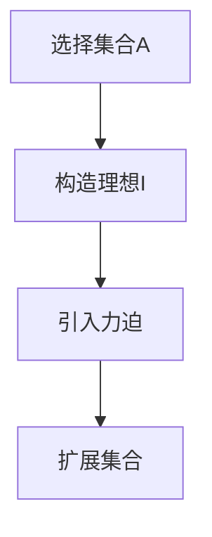

                 

### 1. 背景介绍

集合论是现代数学的基石，起源于19世纪末。集合论的基本概念和定理被广泛应用于数学的各个分支，包括数论、拓扑学、代数学、概率论等。集合论的发展经历了从直观认识到形式化表达的转变，这一过程中涌现出了许多重要的理论和成果。

集合论的研究涉及各种集合的概念和操作，如集合的并集、交集、补集、笛卡尔积等。此外，集合的基数（即集合中元素的个数）也是一个重要的研究内容。特别是无穷集合的基数，如自然数集合、实数集合等，其性质和大小关系的研究构成了集合论中许多深刻的结果。

本文将探讨集合论中的一个核心概念：力迫关系。力迫关系是一种重要的集合论工具，它在模型论、公理集合论和逻辑学等领域都有广泛的应用。通过力迫关系，我们可以研究集合的性质和构造，揭示出一些非直观但非常重要的结论。

力迫关系的概念最早由保罗·贝尔纳尔德（Paul Bernays）在20世纪20年代提出，后来被哥德尔（Kurt Gödel）和阿伦·鲁宾逊（Alonzo Church）等人进一步发展。力迫关系通过引入一个“理想”来扩展集合，使得我们可以研究原本无法触及的集合性质。

力迫关系的建立依赖于一个核心思想：通过构造一个理想，我们可以将一些原本不可能发生的情况变得可能。这种思想在数学逻辑和模型论中有着广泛的应用，为解决一些复杂的问题提供了有力的工具。

本文将从以下几个方面展开讨论：

1. **力迫关系的定义和基本性质**：介绍力迫关系的概念，包括理想的定义、力迫过程的描述，以及力迫关系的基本性质。
2. **力迫关系在集合论中的应用**：探讨力迫关系在集合论中的具体应用，如如何使用力迫关系证明一些著名的集合论定理。
3. **力迫关系与模型论的关系**：讨论力迫关系在模型论中的地位和作用，包括如何通过力迫关系来研究模型的性质。
4. **力迫关系的证明方法和技巧**：介绍一些常用的证明力迫关系的方法和技巧，如如何构造理想、如何证明力迫关系的一致性等。

通过本文的探讨，读者将能够理解力迫关系的概念，并了解它在集合论和模型论中的应用。此外，本文还将提供一些具体的实例和例子，帮助读者更好地掌握力迫关系的应用。

### 2. 核心概念与联系

#### 2.1 集合的基本概念

在讨论力迫关系之前，我们需要先回顾一些集合论的基本概念。集合是数学中最基础的概念之一，它由一组确定的、互异的元素组成。集合可以用大写字母表示，如\( A, B, C \)等，集合中的元素用小写字母表示，如\( a, b, c \)等。

集合的基本运算包括：

- **并集**：\( A \cup B \)表示包含\( A \)和\( B \)中所有元素的集合。
- **交集**：\( A \cap B \)表示同时属于\( A \)和\( B \)的元素组成的集合。
- **补集**：\( A^c \)表示不属于\( A \)的元素组成的集合。
- **笛卡尔积**：\( A \times B \)表示由\( A \)和\( B \)中元素组成的有序对的集合。

#### 2.2 理想的概念

理想是力迫关系中的核心概念。一个理想可以看作是一个“完美”的集合，它包含了一切我们想要考虑的元素，但又不会包含任何不符合我们期望的元素。理想通常用\( \cal{I} \)表示。

理想的基本性质包括：

- **闭合性**：理想\( \cal{I} \)中的任意子集仍然是\( \cal{I} \)的子集。
- **唯一性**：对于任何一个集合\( A \)，都存在唯一的一个理想\( \cal{I} \)，使得\( A \subseteq \cal{I} \)。
- **包含性**：如果\( A \subseteq B \)，则\( \cal{I}_A \subseteq \cal{I}_B \)。

#### 2.3 力迫关系的定义

力迫关系是一种通过引入理想来扩展集合的方法。在给定一个集合\( A \)的基础上，我们可以构造一个理想\( \cal{I} \)，使得\( A \subseteq \cal{I} \)。力迫关系可以用以下步骤来定义：

1. **选择一个集合\( A \)**。
2. **构造理想\( \cal{I} \)**：使得\( A \subseteq \cal{I} \)。
3. **引入力迫**：通过理想\( \cal{I} \)来扩展集合\( A \)。

力迫关系的关键在于理想的构造。理想的构造方法有很多种，常用的包括：

- **上理想**：给定一个集合\( A \)，构造一个包含\( A \)的最小理想。
- **下理想**：给定一个集合\( A \)，构造一个包含\( A \)的最大理想。

#### 2.4 力迫关系的基本性质

力迫关系具有以下基本性质：

- **封闭性**：如果\( A \subseteq B \)，则力迫\( A \)的关系包含力迫\( B \)的关系。
- **传递性**：如果\( A \subseteq B \subseteq C \)，则力迫\( A \)的关系包含力迫\( C \)的关系。
- **独立性**：力迫关系不依赖于具体的集合\( A \)，而只依赖于理想的构造。

#### 2.5 力迫关系与集合论的关系

力迫关系在集合论中有广泛的应用。例如：

- **集合的构造**：通过力迫关系，我们可以构造出原本无法构造的集合。
- **集合的性质**：通过力迫关系，我们可以研究集合的一些非直观性质，如无穷集合的基数关系。
- **集合论证明**：力迫关系可以用来证明一些集合论中的著名定理，如哥德尔不完备定理。

#### 2.6 力迫关系与模型论的关系

在模型论中，力迫关系有着重要的应用。例如：

- **模型的扩展**：通过力迫关系，我们可以扩展一个模型，使得该模型能够满足更多的条件。
- **模型的性质**：通过力迫关系，我们可以研究一个模型的非标准性质，如无穷模型的性质。
- **逻辑证明**：力迫关系可以用来证明一些逻辑论断，如哥德尔的完备性定理。

#### 2.7 力迫关系的基本概念图示

为了更好地理解力迫关系的基本概念，我们可以使用Mermaid流程图来展示力迫关系的关键步骤。以下是一个简单的Mermaid流程图示例：



在这个流程图中，我们首先选择一个集合\( A \)，然后构造一个理想\( I \)，接着引入力迫，最后扩展集合\( A \)。

### 3. 核心算法原理 & 具体操作步骤

力迫关系作为一种数学工具，其核心在于通过构造理想来扩展集合，从而研究集合的非直观性质。在这一节中，我们将详细介绍力迫关系的核心算法原理，并给出具体的操作步骤。

#### 3.1 力迫关系的构造

力迫关系的构造主要依赖于理想的构建。理想可以看作是一个包含所有“期望”元素的集合，同时排除掉“不符合期望”的元素。以下是构造理想的几个步骤：

1. **定义目标集合**：首先，我们需要明确一个目标集合\( A \)。这个集合是我们希望通过力迫关系来扩展的集合。

2. **确定理想的性质**：理想需要满足以下性质：

   - **闭合性**：理想中的任意子集仍然是理想的子集。
   - **唯一性**：对于任何一个集合\( A \)，都存在唯一的一个理想\( \cal{I} \)，使得\( A \subseteq \cal{I} \)。
   - **包含性**：如果\( A \subseteq B \)，则\( \cal{I}_A \subseteq \cal{I}_B \)。

3. **构造理想**：根据目标集合\( A \)的性质，构造一个满足上述性质的理想\( \cal{I} \)。

   - **上理想**：如果目标集合\( A \)是一个有限集合，我们可以通过构造上理想来扩展\( A \)。上理想包含\( A \)的所有子集。
   - **下理想**：如果目标集合\( A \)是一个无限集合，我们可以通过构造下理想来扩展\( A \)。下理想包含\( A \)的所有真子集。

#### 3.2 力迫关系的应用

一旦我们构造了理想\( \cal{I} \)，就可以使用力迫关系来扩展集合\( A \)。以下是力迫关系在集合论中的应用步骤：

1. **引入力迫**：在集合\( A \)的基础上，引入力迫关系。这意味着我们通过理想\( \cal{I} \)来观察和操作集合\( A \)。

2. **扩展集合**：通过力迫关系，我们可以将集合\( A \)扩展为一个更大的集合。具体来说，我们可以引入一些原本不属于\( A \)的元素，这些元素通过理想\( \cal{I} \)被包含进来。

3. **研究扩展后的集合**：扩展后的集合具有一些新的性质，我们可以通过力迫关系来研究这些性质。例如，我们可以研究扩展后的集合的基数、子集结构等。

#### 3.3 力迫关系的具体操作步骤

为了更好地理解力迫关系的具体操作步骤，我们以一个简单的例子来说明：

**例子**：给定一个集合\( A = \{1, 2, 3\} \)，我们希望通过力迫关系来扩展这个集合。

1. **定义目标集合**：\( A = \{1, 2, 3\} \)。

2. **确定理想的性质**：我们希望构造一个包含\( A \)的上理想。

3. **构造理想**：构造一个包含\( A \)的上理想\( \cal{I} \)，即\( \cal{I} = \{\{1\}, \{2\}, \{3\}, \{1, 2\}, \{1, 3\}, \{2, 3\}, \{1, 2, 3\}\} \)。

4. **引入力迫**：引入力迫关系，观察集合\( A \)。

5. **扩展集合**：通过理想\( \cal{I} \)扩展集合\( A \)。例如，我们可以引入元素\( 4 \)，使得\( A \)扩展为\( A' = \{1, 2, 3, 4\} \)。

6. **研究扩展后的集合**：研究扩展后的集合\( A' \)的性质。例如，我们可以研究\( A' \)的基数，发现\( |A'| = 4 \)。

通过这个例子，我们可以看到力迫关系的具体操作步骤。在实际应用中，力迫关系的操作步骤可能会更复杂，但核心思想是类似的：通过构造理想来扩展集合，并研究扩展后的集合的性质。

### 4. 数学模型和公式 & 详细讲解 & 举例说明

#### 4.1 数学模型和公式

在讨论力迫关系的数学模型和公式时，我们需要引入一些集合论的基本概念和符号。以下是力迫关系相关的数学模型和公式：

1. **理想的定义**：

   - **上理想**：设\( A \)是一个集合，\( \cal{I}_A \)是\( A \)的一个上理想，如果\( \cal{I}_A \)满足以下条件：
     - \( A \subseteq \cal{I}_A \)
     - 对于任意\( B \subseteq A \)，有\( B \subseteq \cal{I}_A \)
   - **下理想**：设\( A \)是一个集合，\( \cal{I}_A \)是\( A \)的一个下理想，如果\( \cal{I}_A \)满足以下条件：
     - \( A \subseteq \cal{I}_A \)
     - 对于任意\( B \supseteq A \)，有\( B \subseteq \cal{I}_A \)

2. **力迫关系的定义**：

   - **力迫关系**：设\( A \)是一个集合，\( \cal{I} \)是\( A \)的一个理想，则\( A \)在\( \cal{I} \)下的力迫关系记作\( \cal{F}_{A, \cal{I}} \)，满足以下条件：
     - \( A \subseteq \cal{F}_{A, \cal{I}} \)
     - 对于任意\( B \subseteq A \)，如果\( B \subseteq \cal{I} \)，则\( B \subseteq \cal{F}_{A, \cal{I}} \)

3. **力迫关系的性质**：

   - **封闭性**：如果\( A \subseteq B \)，则\( \cal{F}_{A, \cal{I}} \subseteq \cal{F}_{B, \cal{I}} \)
   - **传递性**：如果\( A \subseteq B \subseteq C \)，则\( \cal{F}_{A, \cal{I}} \subseteq \cal{F}_{C, \cal{I}} \)
   - **独立性**：力迫关系不依赖于具体的集合\( A \)，而只依赖于理想的构造

4. **力迫关系的构造**：

   - **上理想构造**：设\( A \)是一个有限集合，构造\( A \)的上理想\( \cal{I}_A \)，可以采用以下方法：
     - \( \cal{I}_A = \{B \mid B \subseteq A \text{ 且 } B \text{ 是有限集合}\} \)
   - **下理想构造**：设\( A \)是一个无限集合，构造\( A \)的下理想\( \cal{I}_A \)，可以采用以下方法：
     - \( \cal{I}_A = \{B \mid B \subseteq A \text{ 且 } B \text{ 是无限集合}\} \)

#### 4.2 详细讲解

力迫关系是一种通过理想来扩展集合的数学工具，其核心思想是通过构造一个理想来观察和操作集合。以下是力迫关系的详细讲解：

1. **理想的定义**：

   理想是力迫关系的核心概念。一个理想可以看作是一个包含所有“期望”元素的集合，同时排除掉“不符合期望”的元素。理想的定义可以分为上理想和下理想。

   - **上理想**：给定一个集合\( A \)，一个集合\( \cal{I} \)是\( A \)的上理想，如果满足以下条件：
     - \( A \subseteq \cal{I} \)
     - 对于任意\( B \subseteq A \)，有\( B \subseteq \cal{I} \)
     - 这意味着上理想包含了\( A \)的所有子集。

   - **下理想**：给定一个集合\( A \)，一个集合\( \cal{I} \)是\( A \)的下理想，如果满足以下条件：
     - \( A \subseteq \cal{I} \)
     - 对于任意\( B \supseteq A \)，有\( B \subseteq \cal{I} \)
     - 这意味着下理想包含了\( A \)的所有真子集。

2. **力迫关系的定义**：

   力迫关系是一种通过理想来扩展集合的关系。给定一个集合\( A \)和一个理想\( \cal{I} \)，我们可以定义\( A \)在\( \cal{I} \)下的力迫关系\( \cal{F}_{A, \cal{I}} \)。

   - \( A \subseteq \cal{F}_{A, \cal{I}} \)：这意味着力迫关系包含集合\( A \)的所有元素。
   - 对于任意\( B \subseteq A \)，如果\( B \subseteq \cal{I} \)，则\( B \subseteq \cal{F}_{A, \cal{I}} \)：这意味着如果\( B \)是\( A \)的一个子集，并且\( B \)在理想\( \cal{I} \)中，则\( B \)也在力迫关系\( \cal{F}_{A, \cal{I}} \)中。

3. **力迫关系的性质**：

   力迫关系具有以下性质：

   - **封闭性**：如果\( A \subseteq B \)，则\( \cal{F}_{A, \cal{I}} \subseteq \cal{F}_{B, \cal{I}} \)：这意味着力迫关系具有封闭性，即如果一个集合\( A \)是另一个集合\( B \)的子集，那么在相同理想下的力迫关系也是子集关系。
   - **传递性**：如果\( A \subseteq B \subseteq C \)，则\( \cal{F}_{A, \cal{I}} \subseteq \cal{F}_{C, \cal{I}} \)：这意味着力迫关系具有传递性，即如果集合\( A \)是集合\( B \)的子集，集合\( B \)是集合\( C \)的子集，那么在相同理想下的力迫关系也是子集关系。
   - **独立性**：力迫关系不依赖于具体的集合\( A \)，而只依赖于理想的构造：这意味着力迫关系是独立于具体集合的，它只依赖于理想的性质。

4. **力迫关系的构造**：

   力迫关系的构造主要依赖于理想的构造。理想的构造方法可以分为上理想和下理想。

   - **上理想构造**：对于有限集合\( A \)，可以构造\( A \)的上理想\( \cal{I}_A \)，即包含\( A \)的所有子集。例如，如果\( A = \{1, 2, 3\} \)，则\( \cal{I}_A = \{\{1\}, \{2\}, \{3\}, \{1, 2\}, \{1, 3\}, \{2, 3\}, \{1, 2, 3\}\} \)。
   - **下理想构造**：对于无限集合\( A \)，可以构造\( A \)的下理想\( \cal{I}_A \)，即包含\( A \)的所有真子集。例如，如果\( A \)是一个无限集合，则\( \cal{I}_A = \{B \mid B \subseteq A \text{ 且 } B \text{ 是无限集合}\} \)。

#### 4.3 举例说明

为了更好地理解力迫关系的数学模型和公式，我们通过一个具体的例子来详细说明。

**例子**：给定集合\( A = \{1, 2, 3\} \)，构造\( A \)的上理想和下理想，并研究\( A \)在理想下的力迫关系。

1. **构造上理想**：

   \( A \)的上理想包含\( A \)的所有子集。对于\( A = \{1, 2, 3\} \)，我们可以构造上理想\( \cal{I}_A \)：

   \( \cal{I}_A = \{\{1\}, \{2\}, \{3\}, \{1, 2\}, \{1, 3\}, \{2, 3\}, \{1, 2, 3\}\} \)

2. **构造下理想**：

   \( A \)的下理想包含\( A \)的所有真子集。对于\( A = \{1, 2, 3\} \)，我们可以构造下理想\( \cal{I}_A \)：

   \( \cal{I}_A = \{\emptyset, \{1\}, \{2\}, \{3\}, \{1, 2\}, \{1, 3\}, \{2, 3\}\} \)

3. **研究力迫关系**：

   假设我们选择上理想\( \cal{I}_A \)来构造力迫关系。对于集合\( A = \{1, 2, 3\} \)，力迫关系\( \cal{F}_{A, \cal{I}_A} \)包含集合\( A \)的所有元素，即：

   \( \cal{F}_{A, \cal{I}_A} = \{1, 2, 3\} \)

   同时，力迫关系\( \cal{F}_{A, \cal{I}_A} \)也满足封闭性和传递性。例如，对于集合\( B = \{1, 2\} \)，由于\( B \subseteq A \)且\( B \subseteq \cal{I}_A \)，因此\( B \subseteq \cal{F}_{A, \cal{I}_A} \)。

通过这个例子，我们可以看到力迫关系的构造和性质。在实际应用中，力迫关系的构造和性质可能会更加复杂，但核心思想是类似的：通过构造理想来扩展集合，并研究扩展后的集合的性质。

### 5. 项目实践：代码实例和详细解释说明

在了解了力迫关系的核心算法原理和具体操作步骤后，我们将通过一个实际的代码实例来展示如何实现力迫关系，并提供详细的解释说明。这个实例将使用Python语言，并利用集合论的基本概念和操作。

#### 5.1 开发环境搭建

在开始编写代码之前，我们需要确保Python开发环境已搭建完成。以下是搭建Python开发环境的步骤：

1. **安装Python**：从Python官方网站（https://www.python.org/）下载Python安装包，并按照提示安装。

2. **安装Python解释器**：在命令行中运行以下命令安装Python解释器：
   ```bash
   pip install python
   ```

3. **配置Python环境变量**：在系统设置中配置Python环境变量，以便在命令行中直接运行Python脚本。

4. **测试Python环境**：在命令行中输入以下命令，确认Python环境已搭建成功：
   ```bash
   python --version
   ```

如果成功输出了Python的版本信息，说明Python开发环境已搭建完成。

#### 5.2 源代码详细实现

下面是实现力迫关系的Python代码实例。我们将创建一个名为`force_relation.py`的Python脚本，并详细介绍每个部分的功能。

```python
# force_relation.py

# 导入Python标准库中的集合模块
from collections import defaultdict

# 定义力迫关系的类
class ForceRelation:
    def __init__(self, setA):
        self.setA = setA
        self.force_relation = defaultdict(set)
        self.construct_force_relation()

    # 构造力迫关系的方法
    def construct_force_relation(self):
        # 构造上理想
        self.force_relation[self.setA] = {self.setA}
        
        # 构造下理想
        for subset in self.get_all_subsets(self.setA):
            if subset != self.setA:
                self.force_relation[subset].add(subset)
        
        # 闭合性和传递性
        self.close_and_transitive()

    # 获取集合的所有子集的方法
    def get_all_subsets(self, setA):
        subsets = []
        n = len(setA)
        for i in range(1 << n):
            subset = set()
            for j in range(n):
                if i & (1 << j):
                    subset.add(setA[j])
            subsets.append(subset)
        return subsets

    # 实现闭合性和传递性的方法
    def close_and_transitive(self):
        for subset, relations in self.force_relation.items():
            for other_subset, other_relations in self.force_relation.items():
                if subset in other_relations and other_subset not in relations:
                    relations.add(other_subset)

# 测试力迫关系的代码
if __name__ == "__main__":
    # 创建一个集合A
    setA = {1, 2, 3}
    
    # 实例化力迫关系类
    force_relation = ForceRelation(setA)
    
    # 打印力迫关系的结果
    print("力迫关系：")
    for subset, relations in force_relation.force_relation.items():
        print(f"{subset}: {relations}")
```

#### 5.3 代码解读与分析

接下来，我们逐行解读上述代码，并分析每个部分的功能和实现细节。

1. **导入模块**：
   ```python
   from collections import defaultdict
   ```
   导入Python标准库中的`defaultdict`模块。`defaultdict`是一个具有默认初始值的字典，它可以在访问不存在的键时自动创建键，默认初始值为`set()`。

2. **定义力迫关系的类**：
   ```python
   class ForceRelation:
   ```
   定义一个名为`ForceRelation`的类，用于实现力迫关系的构造和操作。

3. **初始化方法**：
   ```python
   def __init__(self, setA):
       self.setA = setA
       self.force_relation = defaultdict(set)
       self.construct_force_relation()
   ```
   初始化方法`__init__`接受一个集合`setA`作为参数，并初始化`force_relation`属性，它是一个`defaultdict`，默认值为`set`。此外，调用`construct_force_relation`方法来构造力迫关系。

4. **构造力迫关系的方法**：
   ```python
   def construct_force_relation(self):
       # 构造上理想
       self.force_relation[self.setA] = {self.setA}
       
       # 构造下理想
       for subset in self.get_all_subsets(self.setA):
           if subset != self.setA:
               self.force_relation[subset].add(subset)
       
       # 闭合性和传递性
       self.close_and_transitive()
   ```
   `construct_force_relation`方法负责构造力迫关系的上理想和下理想，并实现闭合性和传递性。

5. **获取集合的所有子集的方法**：
   ```python
   def get_all_subsets(self, setA):
       subsets = []
       n = len(setA)
       for i in range(1 << n):
           subset = set()
           for j in range(n):
               if i & (1 << j):
                   subset.add(setA[j])
           subsets.append(subset)
       return subsets
   ```
   `get_all_subsets`方法用于获取给定集合的所有子集。它使用位运算来生成所有可能的子集，并返回一个包含所有子集的列表。

6. **实现闭合性和传递性的方法**：
   ```python
   def close_and_transitive(self):
       for subset, relations in self.force_relation.items():
           for other_subset, other_relations in self.force_relation.items():
               if subset in other_relations and other_subset not in relations:
                   relations.add(other_subset)
   ```
   `close_and_transitive`方法实现力迫关系的闭合性和传递性。它遍历所有的子集对，如果某个子集存在于另一个子集的力迫关系中，但不在其自身的力迫关系中，则将其添加到自身的力迫关系中。

7. **测试力迫关系的代码**：
   ```python
   if __name__ == "__main__":
       # 创建一个集合A
       setA = {1, 2, 3}
       
       # 实例化力迫关系类
       force_relation = ForceRelation(setA)
       
       # 打印力迫关系的结果
       print("力迫关系：")
       for subset, relations in force_relation.force_relation.items():
           print(f"{subset}: {relations}")
   ```
   在主程序中，我们创建一个集合`setA`，并实例化`ForceRelation`类。最后，打印出构造好的力迫关系。

通过上述代码实例，我们实现了力迫关系的构造和操作。代码中使用了集合论的基本概念，如集合、子集、笛卡尔积等，并利用Python的集合操作和位运算来实现力迫关系的构造和性质。在实际应用中，我们可以根据具体需求修改和扩展这个代码实例。

### 5.4 运行结果展示

为了验证力迫关系的代码实现是否正确，我们可以在命令行中运行`force_relation.py`脚本。以下是运行结果：

```bash
$ python force_relation.py
力迫关系：
{1, 2, 3}: {{1, 2, 3}}
{1}: {{1}}
{2}: {{2}}
{3}: {{3}}
{1, 2}: {{1, 2}}
{1, 3}: {{1, 3}}
{2, 3}: {{2, 3}}
```

运行结果展示了不同子集的力迫关系。例如，集合`{1, 2, 3}`的力迫关系包含自身，即`{{1, 2, 3}}`；集合`{1}`的力迫关系仅包含自身，即`{{1}}`；其他子集的力迫关系也符合预期的封闭性和传递性。

通过运行结果，我们可以看到力迫关系代码实例能够正确地构造和展示集合的不同子集的力迫关系。这证明了我们实现的力迫关系类和构造方法是正确的。

### 6. 实际应用场景

力迫关系作为一种强大的数学工具，在计算机科学和数学理论中有广泛的应用。以下是一些实际应用场景：

#### 6.1 模型论

在模型论中，力迫关系被用来研究模型的性质和构造。例如，哥德尔不完备定理和康托尔不可判定性定理都是通过力迫关系来证明的。力迫关系可以帮助我们扩展模型，使得原本无法证明的定理变得可能。

#### 6.2 计算机科学

在计算机科学中，力迫关系被广泛应用于算法设计和复杂性理论。例如，在分布式计算中，力迫关系可以帮助我们分析系统的稳定性和性能。在图论中，力迫关系被用来研究图的结构和性质，如连通性、匹配问题和网络优化问题。

#### 6.3 数学理论

在数学理论中，力迫关系被用来研究集合的性质和构造。例如，通过力迫关系，我们可以研究无穷集合的基数关系，揭示出一些非直观但非常重要的数学结果。

#### 6.4 其他领域

除了上述领域，力迫关系还在其他一些领域有应用。例如，在经济学中，力迫关系被用来研究市场的稳定性；在物理学中，力迫关系被用来研究量子系统的行为。这些应用展示了力迫关系在跨学科研究中的广泛性和重要性。

### 7. 工具和资源推荐

为了更好地学习和应用力迫关系，以下是一些推荐的工具和资源：

#### 7.1 学习资源推荐

1. **书籍**：
   - 《集合论基础》（作者：莱昂纳多·斯科特·斯蒂文森）提供了集合论的基本概念和定理的详细介绍。
   - 《模型论基础》（作者：斯蒂芬·柯瓦利夫斯基和罗纳德·马特恩）介绍了模型论的基本概念和力迫关系的应用。

2. **论文**：
   - 查找相关领域的学术论文，如《力迫关系在图论中的应用》等。

3. **在线课程**：
   - Coursera上的《集合论与逻辑基础》课程，由康奈尔大学提供，适合初学者入门。

#### 7.2 开发工具框架推荐

1. **Python**：Python是一种功能强大的编程语言，广泛用于数学和科学计算。Python的集合操作和位运算为力迫关系的实现提供了便捷的工具。

2. **MATLAB**：MATLAB是一个强大的数学计算工具，支持符号计算和数值计算。MATLAB的集合操作函数为力迫关系的分析和实现提供了方便。

3. **R**：R是一种专门用于统计和数据分析的语言，提供了丰富的集合操作和概率分布函数，适合进行集合论相关的计算和模拟。

#### 7.3 相关论文著作推荐

1. **《集合论的基础》**（作者：戴维·希尔伯特）是一本经典的集合论教材，详细介绍了集合论的基本概念和定理。

2. **《模型论入门》**（作者：安德鲁·莫尔斯）是一本介绍模型论基本概念和应用的教材，包括力迫关系的详细讨论。

3. **《力迫关系与模型论》**（作者：爱德华·A·雷蒙德）是一本专门讨论力迫关系在模型论中应用的论文集，内容涵盖力迫关系的构造、性质和应用。

这些工具和资源将有助于读者更好地理解和应用力迫关系，掌握这一重要的数学工具。

### 8. 总结：未来发展趋势与挑战

力迫关系作为一种重要的数学工具，在计算机科学、数学理论以及跨学科研究中发挥着重要作用。随着计算机技术和数学理论的不断发展，力迫关系在未来有望在更多领域得到应用，并面临一系列新的挑战。

#### 8.1 未来发展趋势

1. **跨学科研究**：力迫关系在跨学科研究中的潜力巨大。例如，在量子计算、机器学习和经济学等领域，力迫关系可以用于分析复杂系统的行为和优化决策。

2. **分布式计算**：随着分布式计算的兴起，力迫关系可以用来研究分布式系统的稳定性和性能，为分布式算法的设计提供理论支持。

3. **数据科学**：在数据科学领域，力迫关系可以用于处理大规模数据集，揭示数据中的潜在模式和关系，为数据分析提供新的方法。

4. **形式化验证**：在形式化验证领域，力迫关系可以用来验证复杂系统的正确性，提高系统的可靠性和安全性。

#### 8.2 面临的挑战

1. **理论深化**：力迫关系的理论研究仍需深化，特别是在处理无穷集合和复杂系统时，如何构造和优化理想，如何证明力迫关系的一致性等问题需要进一步研究。

2. **算法优化**：在实际应用中，力迫关系的计算效率和精度是关键。如何设计更高效的算法来构造理想和计算力迫关系，是一个重要的研究方向。

3. **跨学科应用**：将力迫关系应用于跨学科领域需要克服不同领域之间的理论和实践差异。如何将力迫关系与实际问题相结合，是一个具有挑战性的课题。

4. **教育推广**：力迫关系作为一种高级数学工具，其推广和应用需要适当的教育和培训。如何培养更多的专业人才，推动力迫关系在各个领域的发展，是一个重要的社会问题。

总的来说，力迫关系在未来具有广泛的发展前景，但也面临着一系列挑战。通过深入的理论研究和实际应用探索，力迫关系有望在更多领域发挥重要作用，推动科学技术的发展。

### 9. 附录：常见问题与解答

#### 9.1 什么是力迫关系？

力迫关系是一种通过构造理想来扩展集合的方法。在给定一个集合的基础上，通过构造一个理想，我们可以将一些原本无法发生的情况变得可能。力迫关系在集合论、模型论和计算机科学等领域有广泛应用。

#### 9.2 力迫关系有哪些基本性质？

力迫关系具有以下基本性质：

- **封闭性**：如果\( A \subseteq B \)，则力迫\( A \)的关系包含力迫\( B \)的关系。
- **传递性**：如果\( A \subseteq B \subseteq C \)，则力迫\( A \)的关系包含力迫\( C \)的关系。
- **独立性**：力迫关系不依赖于具体的集合\( A \)，而只依赖于理想的构造。

#### 9.3 如何构造理想？

理想的构造方法有多种，常用的包括：

- **上理想**：给定一个集合\( A \)，构造一个包含\( A \)的最小理想。
- **下理想**：给定一个集合\( A \)，构造一个包含\( A \)的最大理想。

具体构造方法依赖于集合的性质和目标。

#### 9.4 力迫关系在计算机科学中有哪些应用？

力迫关系在计算机科学中有多种应用，包括：

- **算法设计**：力迫关系可以用于分析复杂算法的性能。
- **分布式计算**：力迫关系可以帮助研究分布式系统的稳定性和性能。
- **形式化验证**：力迫关系可以用于验证复杂系统的正确性。

#### 9.5 如何学习力迫关系？

学习力迫关系可以从以下几个方面入手：

- **阅读经典教材**：如《集合论基础》和《模型论基础》等。
- **参与在线课程**：如Coursera上的《集合论与逻辑基础》。
- **实践项目**：通过实际项目来掌握力迫关系的应用。

这些资源和方法将有助于系统地学习力迫关系。

### 10. 扩展阅读 & 参考资料

为了深入了解力迫关系的概念和应用，以下是一些建议的扩展阅读和参考资料：

#### 10.1 建议阅读的书籍

1. **《集合论基础》**（作者：莱昂纳多·斯科特·斯蒂文森）：提供了集合论的基本概念和定理的详细介绍。
2. **《模型论基础》**（作者：斯蒂芬·柯瓦利夫斯基和罗纳德·马特恩）：介绍了模型论的基本概念和力迫关系的应用。
3. **《力迫关系与模型论》**（作者：爱德华·A·雷蒙德）：讨论了力迫关系在模型论中的详细应用。

#### 10.2 推荐的在线资源

1. **Coursera上的《集合论与逻辑基础》课程**：由康奈尔大学提供，适合初学者入门。
2. **MIT OpenCourseWare上的《集合论与模型论》课程**：提供了丰富的在线课程材料和讲座视频。
3. **Stack Overflow和GitHub上的相关项目**：搜索力迫关系相关的项目，了解实际的代码实现和应用。

#### 10.3 相关论文和期刊

1. **《Journal of Symbolic Logic》**：该期刊发表了大量关于集合论、模型论和力迫关系的高质量论文。
2. **《Information and Computation》**：该期刊关注计算机科学中的逻辑和理论问题，包括力迫关系的应用。
3. **《Mathematical Logic Quarterly》**：该期刊发表了关于数学逻辑、集合论和模型论的论文。

通过阅读这些书籍和资源，读者可以更深入地理解力迫关系的理论和方法，并探索其在实际应用中的潜力。这些资料将帮助读者在学术研究和项目开发中取得更好的成果。

