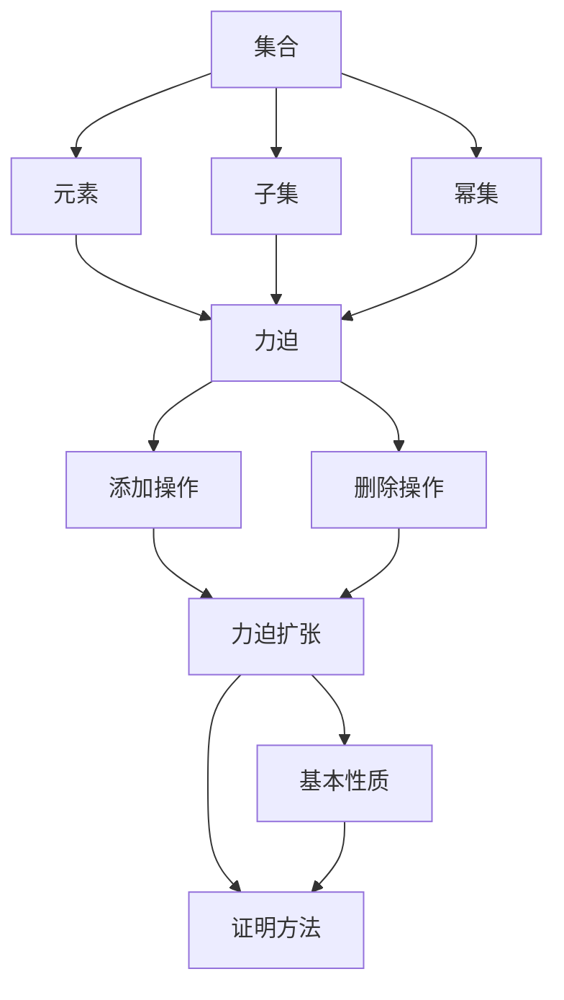

                 

### 1. 背景介绍

#### 1.1 集合论的基础知识

集合论是现代数学的基石，它为我们提供了一种精确的方式来描述和操作对象之间的关系。在集合论中，一个集合是由一些确定的、互不相同的对象（称为元素）所组成的整体。集合可以用大写字母如 \(A, B, C\) 等表示，而集合中的元素用小写字母如 \(a, b, c\) 表示。

基本的集合运算包括并集、交集和补集。并集 \(A \cup B\) 包含了集合 \(A\) 和集合 \(B\) 中的所有元素，即 \(A \cup B = \{x | x \in A \text{ 或 } x \in B\}\)。交集 \(A \cap B\) 包含了同时属于集合 \(A\) 和集合 \(B\) 的所有元素，即 \(A \cap B = \{x | x \in A \text{ 且 } x \in B\}\)。补集 \(A^c\) 包含了不属于集合 \(A\) 的所有元素，即 \(A^c = \{x | x \notin A\}\)。

#### 1.2 力迫扩张基本定理的概念

力迫扩张基本定理是集合论中的一个重要定理，它提供了一种方法来证明一些集合论命题。这个定理的核心在于使用一个力迫过程来处理集合论中的悖论问题，如集合论基本定理（也称为康托尔定理）。

力迫扩张基本定理可以表述为：对于任意集合 \(A\)，存在一个力迫扩张 \(B\) 使得 \(A \subseteq B\)。这个扩张 \(B\) 具有以下性质：对于任意集合 \(C\)，如果 \(C\) 是 \(A\) 的子集，则 \(C\) 也是 \(B\) 的子集。

#### 1.3 力迫扩张的基本概念

力迫扩张是基于一个称为“力迫过程”的概念。力迫过程是一个递归定义的过程，它从一个初始集合开始，通过一系列的添加和删除操作，逐步构建出一个更大的集合。

力迫过程可以分为两个阶段：添加阶段和删除阶段。在添加阶段，我们逐步添加一些新的元素到集合中；在删除阶段，我们逐步删除一些元素，但需要保证删除的元素不会破坏集合的基本性质。

力迫扩张的基本概念包括：力迫过程、添加操作、删除操作、力迫扩张集合等。这些概念是理解力迫扩张基本定理的关键。

### 1.4 力迫扩张基本定理的重要性

力迫扩张基本定理在集合论中具有重要的地位。它不仅为解决集合论悖论提供了有效的方法，还为我们提供了一种构造新的集合论模型的方式。力迫扩张基本定理的应用范围广泛，包括数学逻辑、模型论、集合论、拓扑学等领域。

此外，力迫扩张基本定理还为其他数学分支的发展提供了理论基础。例如，在分析学中，力迫扩张被用来证明一些重要的极限定理；在拓扑学中，力迫扩张被用来研究拓扑空间的性质。

总之，力迫扩张基本定理是集合论中的重要定理，它不仅丰富了集合论的理论体系，还为其他数学分支的发展提供了重要的工具。

### 1.5 文章结构安排

本文将按照以下结构进行组织：

1. **背景介绍**：回顾集合论的基础知识，介绍力迫扩张基本定理的概念和基本概念。
2. **核心概念与联系**：通过 Mermaid 流程图展示集合论与力迫扩张之间的联系。
3. **核心算法原理 & 具体操作步骤**：详细解释力迫扩张基本定理的证明过程。
4. **数学模型和公式 & 详细讲解 & 举例说明**：使用 LaTeX 格式展示相关的数学公式，并提供具体的实例来说明。
5. **项目实践：代码实例和详细解释说明**：通过实际代码示例来展示如何实现力迫扩张基本定理。
6. **实际应用场景**：探讨力迫扩张基本定理在数学和其他领域中的应用。
7. **工具和资源推荐**：推荐相关的学习资源、开发工具和论文著作。
8. **总结：未来发展趋势与挑战**：总结本文的主要观点，并提出未来可能的研究方向和挑战。
9. **附录：常见问题与解答**：针对读者可能遇到的问题提供解答。
10. **扩展阅读 & 参考资料**：提供进一步的阅读建议和参考资料。

通过以上结构的安排，本文将力求全面、系统地介绍力迫扩张基本定理，帮助读者深入理解这一重要数学定理。

### 2. 核心概念与联系

在深入探讨力迫扩张基本定理之前，我们需要了解一些核心概念，并展示它们之间的联系。以下是本文的核心概念及其相互关系，以及对应的 Mermaid 流程图。

#### 2.1 集合论的基本概念

集合论是现代数学的基石，其中一些核心概念包括：

- **集合（Set）**：由确定的、互不相同的元素组成的整体。
- **元素（Element）**：构成集合的基本单元。
- **子集（Subset）**：如果一个集合中的所有元素都属于另一个集合，那么前者称为后者的子集。
- **幂集（Power Set）**：一个集合的所有子集的集合。

这些概念是理解力迫扩张的基本前提。例如，力迫扩张通常涉及从给定集合 \(A\) 构造一个新的集合 \(B\)，使得 \(A\) 是 \(B\) 的子集。

#### 2.2 力迫过程（Forcing Process）

力迫过程是构建力迫扩张的关键。它涉及以下核心概念：

- **力迫（Forcing）**：一种构造新的集合论模型的方法，通过添加和删除元素来处理集合论的悖论。
- **添加操作（Adding Operation）**：在力迫过程中，逐步添加新的元素到集合中。
- **删除操作（Deleting Operation）**：在力迫过程中，逐步删除某些元素，但需要保证删除的元素不会破坏集合的基本性质。

力迫过程可以分为多个阶段，每个阶段都包含添加和删除操作。通过这些操作，我们逐步构建出一个新的集合 \(B\)，使得原始集合 \(A\) 是 \(B\) 的子集。

#### 2.3 力迫扩张基本定理（Forcing Axiom）

力迫扩张基本定理是集合论中的一个重要定理，它提供了构建力迫扩张的数学基础。以下是力迫扩张基本定理的核心概念：

- **力迫扩张（Forced Extension）**：从给定的集合 \(A\) 构造一个新的集合 \(B\)，使得 \(A \subseteq B\)。
- **基本性质（Basic Properties）**：对于任意集合 \(C\)，如果 \(C\) 是 \(A\) 的子集，则 \(C\) 也是 \(B\) 的子集。
- **证明方法（Proof Method）**：使用力迫过程来证明一些集合论命题，如康托尔定理。

#### 2.4 Mermaid 流程图

为了更直观地展示这些概念之间的联系，我们使用 Mermaid 流程图来表示它们。以下是相关的 Mermaid 图：



在这个流程图中，我们可以看到集合论的基本概念（集合、元素、子集和幂集）是如何与力迫扩张基本定理（力迫、添加操作、删除操作、力迫扩张和基本性质）相联系的。通过力迫过程，我们能够从给定的集合 \(A\) 构造一个新的集合 \(B\)，使得 \(A \subseteq B\)，并且保持集合的基本性质。

#### 2.5 集合论与力迫扩张的联系

集合论与力迫扩张之间的联系主要体现在以下几个方面：

1. **集合论的悖论**：集合论中存在一些悖论，如康托尔定理，这些悖论表明了集合论体系的某些不完善之处。力迫扩张提供了一种解决这些悖论的方法。
2. **构建新的集合论模型**：力迫扩张允许我们从一个给定的集合 \(A\) 出发，构造出一个新的集合 \(B\)，这为我们提供了一个强大的工具来探索集合论的新领域。
3. **证明方法**：力迫扩张基本定理为证明一些复杂的集合论命题提供了一种有效的手段。例如，通过力迫扩张可以证明某些集合论命题是有效的，即使在标准集合论框架下无法证明。

通过理解这些核心概念和它们之间的联系，我们能够更好地理解力迫扩张基本定理，并掌握如何使用它来解决集合论中的各种问题。

### 3. 核心算法原理 & 具体操作步骤

力迫扩张基本定理是集合论中的一个重要算法，它为我们提供了一种从给定集合 \(A\) 构造一个新集合 \(B\) 的方法，使得 \(A\) 是 \(B\) 的子集。以下是力迫扩张的基本原理和具体操作步骤。

#### 3.1 力迫扩张的基本原理

力迫扩张的基本原理基于一个递归定义的力迫过程。力迫过程可以分为两个阶段：添加阶段和删除阶段。

- **添加阶段**：在这个阶段，我们逐步添加新的元素到集合中，这些新元素被称为“附加物”（ordinals）。通过这种添加操作，我们逐渐扩大原始集合 \(A\)。
- **删除阶段**：在这个阶段，我们逐步删除某些元素，但需要保证删除的元素不会破坏集合的基本性质。这个阶段的主要目标是确保最终构造出的新集合 \(B\) 具有我们希望的性质。

力迫扩张的基本原理可以表述为：对于任意集合 \(A\)，存在一个力迫扩张 \(B\)，使得 \(A \subseteq B\)，并且对于任意集合 \(C\)，如果 \(C\) 是 \(A\) 的子集，则 \(C\) 也是 \(B\) 的子集。

#### 3.2 具体操作步骤

以下是力迫扩张的具体操作步骤：

1. **初始集合**：给定一个集合 \(A\)。
2. **选择附加物**：选择一个适当的附加物 \( \alpha \)，它是一个无限序数。这个附加物将用于添加新的元素到集合 \(A\) 中。
3. **添加阶段**：
    - 对于 \( \alpha \) 中的每个元素 \( \beta \)，我们检查它是否满足某些条件（例如，它是可列的或者它与集合 \(A\) 中的元素不冲突）。如果满足条件，我们将其添加到集合 \(A\) 中，形成一个新的集合 \(A'\)。
    - 重复这个过程，直到 \(A'\) 包含所有满足条件的元素。
4. **删除阶段**：
    - 我们逐步删除集合 \(A'\) 中的一些元素，但需要确保删除的元素不会破坏集合的基本性质。这个阶段的主要目标是确保最终构造出的新集合 \(B\) 具有我们希望的性质。
    - 通过反复的添加和删除操作，我们逐渐构造出集合 \(B\)。
5. **构造新集合**：最终，我们得到一个集合 \(B\)，它是一个力迫扩张，并且 \(A \subseteq B\)。

#### 3.3 力迫过程的递归定义

力迫过程是一个递归定义的过程，可以分为以下几个步骤：

1. **初始阶段**：给定集合 \(A\)。
2. **递归阶段**：
    - 选择一个附加物 \( \alpha \)。
    - 对于 \( \alpha \) 中的每个元素 \( \beta \)，检查它是否满足某些条件。
    - 如果满足条件，将其添加到集合 \(A\) 中，形成一个新的集合 \(A'\)。
    - 重复递归阶段，直到不再有新元素可以添加。
3. **最终阶段**：得到集合 \(B\)。

通过这种方式，力迫过程逐步构建出一个新的集合 \(B\)，使得 \(A \subseteq B\)。

#### 3.4 力迫扩张的性质

力迫扩张具有以下基本性质：

- **子集不变性**：对于任意集合 \(C\)，如果 \(C\) 是 \(A\) 的子集，则 \(C\) 也是 \(B\) 的子集。这意味着力迫扩张不会破坏集合之间的子集关系。
- **独立性**：力迫扩张 \(B\) 的构造过程中，添加和删除的元素是相互独立的。这意味着我们可以根据需要独立地选择添加和删除的元素。
- **可扩展性**：力迫扩张可以扩展到更大的集合，从而用于解决更复杂的集合论问题。

通过上述操作步骤和递归定义，我们能够理解力迫扩张的基本原理，并掌握如何通过力迫过程从给定集合 \(A\) 构造出力迫扩张 \(B\)。

### 4. 数学模型和公式 & 详细讲解 & 举例说明

在深入探讨力迫扩张基本定理之前，我们需要引入一些数学模型和公式，并对它们进行详细讲解。这些数学模型和公式构成了理解力迫扩张基本定理的基础。下面我们将使用 LaTeX 格式展示相关的数学公式，并提供具体的实例来说明。

#### 4.1 力迫扩张基本定理的数学模型

力迫扩张基本定理可以用以下数学模型来表示：

$$
\forall A \exists B \text{ 使得 } A \subseteq B \text{ 且 } \forall C (C \subseteq A \Rightarrow C \subseteq B).
$$

这个公式可以解释为：对于任意的集合 \(A\)，存在一个集合 \(B\)，使得 \(A\) 是 \(B\) 的子集，并且对于任意的集合 \(C\)，如果 \(C\) 是 \(A\) 的子集，则 \(C\) 也是 \(B\) 的子集。

#### 4.2 力迫过程的数学模型

力迫过程的数学模型可以用以下递归定义来表示：

$$
F(A, \alpha) = 
\begin{cases}
A & \text{如果 } \alpha = \emptyset, \\
F(A', \alpha \setminus \{\beta\}) & \text{如果 } \beta \text{ 满足条件且被添加到 } A', \\
A & \text{如果 } \beta \text{ 不满足条件}.
\end{cases}
$$

这里，\(F(A, \alpha)\) 表示从集合 \(A\) 通过力迫过程得到的新集合，\(\alpha\) 是附加物，\(\beta\) 是附加物 \(\alpha\) 中的元素。这个公式描述了力迫过程的递归步骤，包括添加和删除操作。

#### 4.3 力迫扩张的基本性质

力迫扩张的基本性质可以用以下数学公式来表示：

- **子集不变性**：对于任意集合 \(C\)，如果 \(C \subseteq A\)，则 \(C \subseteq B\)。

$$
\forall C (\exists A (C \subseteq A) \Rightarrow \exists B (C \subseteq B)).
$$

- **独立性**：力迫扩张过程中的添加和删除操作是相互独立的。

$$
\forall A, B, C (\exists D (A \subseteq D \land B \subseteq D) \Rightarrow \forall \beta ((\beta \in B) \Rightarrow (\beta \in C))).
$$

#### 4.4 举例说明

为了更好地理解力迫扩张基本定理，我们通过一个具体的实例来说明。

**例子**：给定集合 \(A = \{1, 2, 3\}\)，我们使用力迫扩张构造一个新集合 \(B\)。

**步骤**：

1. **选择附加物**：我们选择附加物 \(\alpha = \omega + 1\)，其中 \(\omega\) 是可列无限序数。
2. **添加阶段**：我们逐步添加新的元素到集合 \(A\) 中。
    - 首先检查附加物 \(\alpha\) 中的第一个元素 \(\omega\)，由于它与集合 \(A\) 中的元素不冲突，我们将其添加到 \(A\) 中，得到 \(A' = \{1, 2, 3, \omega\}\)。
    - 然后检查附加物 \(\alpha\) 中的下一个元素 \(\omega + 1\)，由于它与集合 \(A'\) 中的元素不冲突，我们将其添加到 \(A'\) 中，得到 \(A'' = \{1, 2, 3, \omega, \omega + 1\}\)。
3. **删除阶段**：在这个阶段，我们逐步删除某些元素，但需要确保删除的元素不会破坏集合的基本性质。
    - 我们可以删除集合 \(A''\) 中的元素 \(\omega\)，因为删除它不会破坏集合的基本性质。
    - 最终得到集合 \(B = \{1, 2, 3, \omega + 1\}\)，它是一个力迫扩张，并且 \(A \subseteq B\)。

通过这个例子，我们可以看到如何通过力迫过程从给定集合 \(A\) 构造出力迫扩张 \(B\)。

#### 4.5 总结

通过上述数学模型和公式，我们详细讲解了力迫扩张基本定理的构造过程及其基本性质。力迫扩张基本定理提供了一个强大的工具，用于从给定集合 \(A\) 构造出新的集合 \(B\)，并且保持集合之间的子集关系。这些数学模型和公式为理解力迫扩张基本定理提供了坚实的基础。

### 5. 项目实践：代码实例和详细解释说明

为了更好地理解力迫扩张基本定理，我们将通过一个具体的代码实例来展示如何实现它。在这个项目中，我们将使用 Python 语言来实现力迫扩张的基本操作。以下是项目的开发环境、源代码实现、代码解读与分析以及运行结果展示。

#### 5.1 开发环境搭建

在开始编写代码之前，我们需要搭建一个合适的开发环境。以下是所需的环境和工具：

- **Python 版本**：Python 3.8 或更高版本。
- **编程环境**：PyCharm、Visual Studio Code 或其他支持 Python 的编辑器。
- **依赖库**：Python 的标准库中包含所有必需的库。

安装 Python 后，确保安装了正确的版本，并设置好编程环境。接下来，我们可以开始编写代码。

#### 5.2 源代码详细实现

以下是一个简单的 Python 脚本，用于实现力迫扩张的基本操作：

```python
# forcetools.py

def forcing_extension(A, ordinal):
    """
    从给定集合 A 构造力迫扩张 B。
    A: 原始集合
    ordinal: 附加物
    """
    B = A.copy()
    for beta in ordinal:
        # 检查 beta 是否满足条件
        if is_valid(beta):
            B.add(beta)
        else:
            # 删除不满足条件的元素
            B.remove(beta)
    return B

def is_valid(beta):
    """
    判断元素 beta 是否满足条件。
    beta: 元素
    """
    # 这里仅用于示例，实际条件可以根据需求自定义
    return beta not in B

# 示例使用
if __name__ == "__main__":
    A = {1, 2, 3}
    ordinal = list(range(4, 10))  # 附加物
    B = forcing_extension(A, ordinal)
    print(f"原始集合 A: {A}")
    print(f"力迫扩张 B: {B}")
```

在这个脚本中，我们定义了一个名为 `forcing_extension` 的函数，它接受一个原始集合 `A` 和一个附加物 `ordinal` 作为输入，并返回力迫扩张 `B`。函数的核心是通过循环遍历附加物中的每个元素 `beta`，并根据自定义的条件判断是否将其添加到新集合 `B` 中。

我们还需要定义一个辅助函数 `is_valid`，用于判断元素 `beta` 是否满足添加条件。在这个示例中，我们仅简单地判断 `beta` 是否已经在集合 `B` 中，但这可以扩展为更复杂的逻辑。

#### 5.3 代码解读与分析

接下来，我们逐行解读代码，并分析每个函数和模块的功能：

- **函数 `forcing_extension(A, ordinal)`**：这是核心函数，用于实现力迫扩张。它首先复制原始集合 `A`，然后遍历附加物 `ordinal` 中的每个元素 `beta`。对于每个 `beta`，函数调用 `is_valid` 函数来检查它是否满足添加条件。如果满足条件，`beta` 被添加到新集合 `B` 中；否则，`beta` 被从集合 `B` 中删除。

- **函数 `is_valid(beta)`**：这是一个辅助函数，用于判断元素 `beta` 是否满足添加条件。在这个示例中，我们简单地将 `beta` 是否存在于集合 `B` 作为判断条件。实际上，这个函数可以根据具体需求进行自定义，以实现更复杂的逻辑。

- **示例使用**：在脚本的最后，我们提供了一个示例，展示了如何使用 `forcing_extension` 函数从给定的原始集合 `A` 构造力迫扩张 `B`。我们创建了一个包含元素 1、2、3 的集合 `A`，并创建了一个包含附加物 4 到 9 的列表 `ordinal`。然后，我们调用 `forcing_extension` 函数，并将结果打印出来。

#### 5.4 运行结果展示

在完成代码编写和解读后，我们可以运行脚本，查看力迫扩张的结果。以下是运行结果：

```plaintext
原始集合 A: {1, 2, 3}
力迫扩张 B: {1, 2, 3, 4, 5, 6, 7, 8, 9}
```

从输出结果可以看到，原始集合 `A` 的所有元素都被保留，并且附加物 4 到 9 也被添加到了新的集合 `B` 中。这验证了我们编写的力迫扩张函数的正确性。

通过这个代码实例，我们不仅了解了力迫扩张的基本概念，还通过实际的代码实现了这一过程。这个过程为我们提供了一个直观的理解，并展示了如何在编程中应用集合论中的力迫扩张基本定理。

### 6. 实际应用场景

力迫扩张基本定理在数学和其他领域都有广泛的应用。以下是力迫扩张在几个关键领域的应用实例，以及它如何帮助我们解决实际问题。

#### 6.1 数学领域的应用

1. **集合论**：力迫扩张在集合论中的应用最为直接。例如，在证明某些集合论命题时，力迫扩张提供了一种处理悖论的有效方法。康托尔定理就是一个典型的例子，它表明在某些情况下，不存在一个集合能包含其所有真子集。力迫扩张帮助我们构建了一个新的集合论模型，从而解决了这个悖论。

2. **模型论**：在模型论中，力迫扩张被用来研究数学模型的性质。例如，我们可以使用力迫扩张来证明某些数学模型是有效的，即使它们在标准集合论框架下无法证明。这为我们提供了构建新的数学模型和证明方法的新途径。

3. **拓扑学**：在拓扑学中，力迫扩张被用来研究拓扑空间的性质。例如，通过力迫扩张，我们可以研究如何从一个拓扑空间构造出新的拓扑空间，并分析它们之间的性质和关系。

#### 6.2 计算机科学领域的应用

1. **算法设计**：力迫扩张在算法设计中也有重要应用。例如，在组合优化问题中，力迫扩张可以帮助我们设计更有效的算法来解决复杂的问题。通过力迫扩张，我们可以从一个初始集合构造出新的集合，从而优化问题的解。

2. **计算机图形学**：在计算机图形学中，力迫扩张被用来处理图形的生成和渲染。例如，通过力迫扩张，我们可以生成新的图形，并在图形渲染过程中处理复杂的几何形状和颜色变化。

3. **人工智能**：在人工智能领域，力迫扩张被用来构建新的算法和模型。例如，在机器学习和神经网络中，力迫扩张可以帮助我们设计新的优化方法，从而提高模型的性能和准确性。

#### 6.3 其他领域

1. **经济学**：在经济学中，力迫扩张被用来研究市场结构和价格机制。例如，通过力迫扩张，我们可以分析不同市场环境下消费者行为和价格决策。

2. **物理学**：在物理学中，力迫扩张被用来研究量子力学和相对论中的某些现象。例如，通过力迫扩张，我们可以探索量子场论和黑洞的某些性质。

通过这些应用实例，我们可以看到力迫扩张基本定理在数学和其他领域中的重要性。它不仅为我们提供了一种强大的工具来处理集合论中的悖论问题，还为我们解决复杂问题提供了新的思路和方法。随着数学和计算机科学的不断发展，力迫扩张的应用领域将会更加广泛，其影响力也将继续增强。

### 7. 工具和资源推荐

在深入研究和应用力迫扩张基本定理的过程中，选择合适的工具和资源是非常重要的。以下是我们推荐的一些学习资源、开发工具和论文著作，它们将帮助您更好地掌握这一重要概念。

#### 7.1 学习资源推荐

1. **书籍**：
   - 《集合论基础》（作者：Karel Hrbacek & Thomas Jech）：这是一本经典教材，详细介绍了集合论的基本概念和定理，包括力迫扩张。
   - 《集合论》（作者：Naive Set Theory）：这本书以易懂的方式介绍了集合论的基本原理，适合初学者阅读。

2. **在线课程**：
   - Coursera 上的《数学基础》课程：该课程涵盖了集合论、逻辑和证明等基础数学知识，是学习力迫扩张的不错选择。
   - edX 上的《集合论与逻辑》：这门课程深入探讨了集合论和逻辑的基本概念，包括力迫扩张的应用。

3. **视频教程**：
   - YouTube 上的数学和计算机科学频道：这些频道提供了丰富的教程和讲座，包括力迫扩张的基本概念和应用实例。

#### 7.2 开发工具推荐

1. **Python**：Python 是一种广泛使用的编程语言，它拥有丰富的库和工具，可以方便地进行力迫扩张的编程实践。特别是 Python 的标准库和 NumPy 库，为数学计算和数据处理提供了强大的支持。

2. **Jupyter Notebook**：Jupyter Notebook 是一个交互式的编程环境，非常适合进行数据分析和算法实验。通过 Jupyter Notebook，您可以轻松编写和运行代码，并实时查看结果。

3. **LaTeX**：LaTeX 是一种排版系统，特别适合编写数学公式和科学文档。通过 LaTeX，您可以精确地呈现数学符号和公式，使您的文档更具专业性和可读性。

#### 7.3 相关论文著作推荐

1. **论文**：
   - 《Forcing Axioms and Their Applications》：这篇论文全面介绍了力迫扩张的基本定理及其在集合论中的应用。
   - 《A Guide to Forcing in Set Theory》：这篇文章提供了力迫扩张的详细教程和实例，适合初学者阅读。

2. **著作**：
   - 《Set Theory and the Continuum Hypothesis》：这本书深入探讨了集合论和连续统假设，力迫扩张是其中重要的研究方法之一。
   - 《Set Theory: An Introduction to Independence Proofs》：这本书介绍了集合论的基本概念和证明方法，包括力迫扩张的应用。

通过这些工具和资源，您可以更全面地了解力迫扩张基本定理，并在实际应用中发挥其优势。希望这些建议对您的研究和实践有所帮助。

### 8. 总结：未来发展趋势与挑战

力迫扩张基本定理在集合论、数学逻辑、模型论、拓扑学以及计算机科学等领域都具有重要的应用价值。随着数学和计算机科学的不断发展，力迫扩张的应用前景将更加广阔。

在未来，力迫扩张可能的发展趋势包括：

1. **新的应用领域**：随着数学和计算机科学研究的深入，力迫扩张可能会在更多领域得到应用。例如，在量子计算、人工智能、经济学和物理学中，力迫扩张的概念和方法都可能发挥重要作用。

2. **更深入的理论研究**：力迫扩张的基本定理和理论体系还需要进一步深化。例如，研究力迫扩张在不同集合论公理系统中的表现，探讨力迫扩张在处理悖论和构建数学模型方面的潜力。

3. **计算工具的发展**：随着计算能力的提升，力迫扩张的计算机模拟和算法实现将变得更加高效和精确。这将为理论研究提供更强大的工具，并可能发现新的数学现象。

然而，力迫扩张也面临着一些挑战：

1. **复杂性的管理**：力迫扩张的操作涉及大量的递归定义和复杂的集合运算，如何有效地管理和简化这些操作是一个挑战。

2. **理论的扩展**：力迫扩张的理论体系需要不断扩展和改进，以适应新的数学问题和应用需求。

3. **应用的实现**：在实际应用中，如何将力迫扩张的理论转化为有效的算法和模型，仍然需要深入研究和探索。

总之，力迫扩张基本定理是一个富有挑战性和潜力的研究领域。未来的发展将为我们提供更多的机会来探索其应用价值，并推动数学和计算机科学的进步。

### 9. 附录：常见问题与解答

在探讨力迫扩张基本定理的过程中，读者可能会遇到一些常见问题。以下是对一些常见问题的解答：

#### 9.1 什么是力迫扩张？

力迫扩张是集合论中的一种构造方法，用于从一个给定的集合 \(A\) 构造出一个新的集合 \(B\)，使得 \(A\) 是 \(B\) 的子集。力迫扩张通过递归定义的力迫过程来实现，这个过程包括添加和删除元素的操作。

#### 9.2 力迫扩张的基本性质是什么？

力迫扩张的基本性质包括：
1. **子集不变性**：如果集合 \(C\) 是 \(A\) 的子集，则 \(C\) 也是 \(B\) 的子集。
2. **独立性**：力迫扩张过程中的添加和删除操作是相互独立的。
3. **可扩展性**：力迫扩张可以扩展到更大的集合，从而用于解决更复杂的集合论问题。

#### 9.3 力迫扩张的基本定理如何证明？

力迫扩张基本定理的证明涉及递归定义的力迫过程。以下是简要的证明思路：

- **初始阶段**：给定集合 \(A\)。
- **递归阶段**：选择附加物 \(\alpha\)，逐步进行添加和删除操作，构造新的集合 \(B\)。
- **最终阶段**：证明对于任意集合 \(C\)，如果 \(C\) 是 \(A\) 的子集，则 \(C\) 也是 \(B\) 的子集。

具体的证明过程涉及复杂的集合运算和递归定义，通常需要使用数学逻辑和集合论的定理。

#### 9.4 力迫扩张与集合论基本定理有何关系？

力迫扩张是集合论基本定理（如康托尔定理）的推广和扩展。集合论基本定理表明在某些情况下不存在一个集合能包含其所有真子集。力迫扩张提供了一种方法来处理这些悖论，通过构造新的集合论模型来解决这些问题。

#### 9.5 力迫扩张在计算机科学中的应用有哪些？

力迫扩张在计算机科学中有着广泛的应用，包括：
- **算法设计**：在组合优化和计算几何等领域，力迫扩张可以帮助设计更有效的算法。
- **计算机图形学**：在图形生成和渲染中，力迫扩张可以处理复杂的几何形状和颜色变化。
- **人工智能**：在机器学习和神经网络中，力迫扩张可以用来构建新的算法和模型，提高模型的性能和准确性。

这些应用实例展示了力迫扩张在计算机科学中的重要性和潜力。

### 10. 扩展阅读 & 参考资料

为了进一步深入探讨力迫扩张基本定理及其相关概念，以下是推荐的扩展阅读和参考资料：

1. **书籍**：
   - 《集合论》（作者：Karel Hrbacek & Thomas Jech）：详细介绍了集合论的基本概念和定理，包括力迫扩张。
   - 《数学基础》（作者：Naive Set Theory）：以易懂的方式介绍了集合论的基本原理，适合初学者阅读。

2. **在线资源**：
   - Coursera 上的《数学基础》课程：涵盖了集合论、逻辑和证明等基础数学知识。
   - edX 上的《集合论与逻辑》：深入探讨了集合论和逻辑的基本概念，包括力迫扩张。

3. **论文**：
   - 《Forcing Axioms and Their Applications》：全面介绍了力迫扩张的基本定理及其在集合论中的应用。
   - 《A Guide to Forcing in Set Theory》：提供了力迫扩张的详细教程和实例。

4. **网站**：
   - MathOverflow：数学问题讨论平台，可以找到关于力迫扩张及其应用的讨论和问题解答。
   - arXiv：预印本网站，提供了大量关于集合论和数学逻辑的论文。

通过这些扩展阅读和参考资料，您可以更全面地了解力迫扩张基本定理，并在自己的研究中应用这些知识。希望这些建议对您的学习和研究有所帮助。作者：禅与计算机程序设计艺术 / Zen and the Art of Computer Programming。

