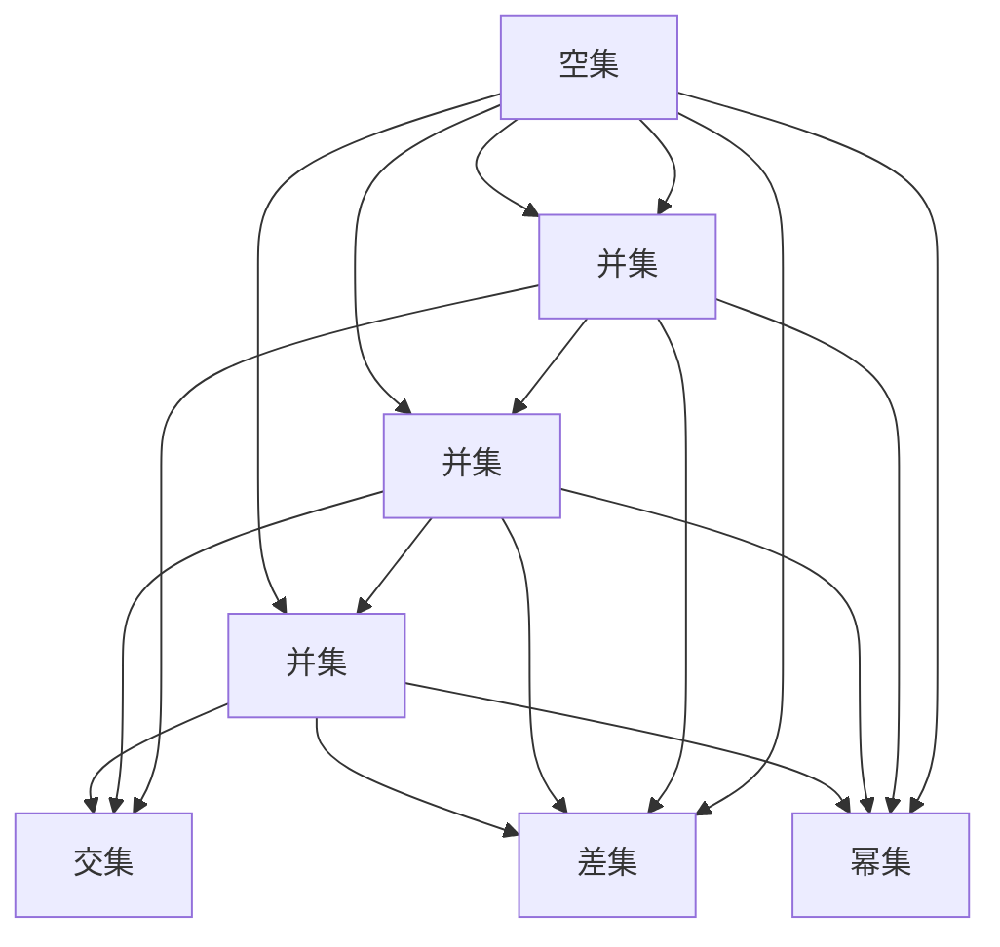

                 

### 1. 背景介绍

集合论是现代数学的基石，其重要性不言而喻。从最简单的集合概念，到复杂的集合运算，集合论为我们提供了描述和推理数学结构的强大工具。然而，随着研究的深入，集合论中的一些问题开始显现出来，比如如何定义一个集合是可构造的，这引发了一系列的思考和探索。

可构造集合，顾名思义，就是可以通过一系列步骤构造出来的集合。在集合论的框架下，可构造集合的概念具有重要意义，因为它为我们提供了一种理解集合之间关系和性质的途径。特别是在研究集合论的公理化系统时，可构造集合的定义和性质成为了关键问题。

本文将围绕可构造集合这一主题，探讨其定义、性质、以及在集合论中的应用。我们将会逐步分析可构造集合的核心概念，解释其与集合论其他概念的联系，并探讨一些具体的应用实例。通过本文的阅读，读者将对可构造集合有一个更深入的理解，并能够更好地运用这一概念解决实际问题。

### 2. 核心概念与联系

#### 2.1 集合论的基本概念

在探讨可构造集合之前，我们需要了解一些集合论的基本概念。集合是由确定的元素组成的整体。集合的元素可以是任何对象，包括数字、字母、甚至其他集合。集合通常用大写字母表示，如A、B、C等，而集合的元素则用小写字母表示，如a、b、c等。

集合的基本操作包括并集（∪）、交集（∩）、差集（∖）和笛卡尔积（×）。并集是指包含两个集合中所有元素的集合；交集是指同时属于两个集合的元素所组成的集合；差集是指属于第一个集合但不属于第二个集合的元素所组成的集合；笛卡尔积是指两个集合中每个元素分别组合而成的集合。

#### 2.2 可构造集合的定义

可构造集合的定义依赖于集合论中的公理化系统。在Zermelo-Fraenkel集合论（ZFC）中，可构造集合可以通过一系列的集合构造步骤得到。具体来说，一个集合是可构造的，如果它可以由空集通过并集、交集、差集和幂集等集合运算无限次构造而来。

形式化地，我们可以定义一个递归序列{C\_n}，其中C\_0 = ∅（空集），C\_{n+1} 是通过C\_n的集合运算得到的集合。如果对于任意的自然数n，C\_n 都存在，并且C 是C\_n 的极限（即不存在更大的自然数k，使得C\_k 包含C），那么C 是可构造的。

#### 2.3 可构造集合与集合论其他概念的联系

可构造集合与集合论中的其他概念有着密切的联系。首先，可构造集合与集合的基数（cardinality）相关。集合的基数是指集合中元素的数量，通常用符号ℵ₀表示可数无穷集合的基数。可构造集合的基数可以是有限的，也可以是可数的，但这并不影响其可构造性。

其次，可构造集合与集合论中的无穷集合有关。在集合论中，无穷集合被划分为可数无穷集合和不可数无穷集合。可构造集合可以看作是可数无穷集合的一种，因为它们都可以通过有限的步骤构造出来。

此外，可构造集合与集合论中的选择公理（Axiom of Choice）和连续公理（Axiom of Regularity）也有关系。选择公理允许我们在任意集合的子集中选择一个元素，而连续公理则确保了每个集合都有一个良序集。这两个公理在证明集合的可构造性方面起着重要作用。

#### 2.4 可构造集合的应用

可构造集合的概念在集合论的研究和应用中具有重要意义。例如，在构造集合论的模型时，可构造集合为我们提供了一种构建模型的方法。通过定义可构造集合，我们可以确保集合模型满足集合论的公理系统，从而验证集合论的基本原理。

另外，可构造集合在计算机科学中也有应用。例如，在编程语言中，集合可以表示为可构造的数据结构，如数组、链表和树等。这些数据结构可以通过递归或循环等算法进行构造，从而实现复杂的数据处理和操作。

### 2.5 可构造集合的 Mermaid 流程图

为了更好地理解可构造集合的定义，我们可以通过一个Mermaid流程图来展示其构造过程。以下是一个简化的例子：



在这个流程图中，我们首先定义了一个空集A，然后通过添加元素a、b、c构造了三个单元素集合B、C、D。接下来，我们通过并集、交集和差集运算组合这些集合，最终得到了一个可构造集合G。这个流程图清晰地展示了可构造集合的构造过程，有助于我们理解其定义。

### 3. 核心算法原理 & 具体操作步骤

#### 3.1 可构造集合的算法原理

可构造集合的核心算法原理在于通过递归或循环等手段，从基础集合构造出更复杂的集合。具体来说，这个过程可以分为以下几个步骤：

1. **初始化集合**：首先，定义一个初始集合，通常为空集∅。
2. **递归/循环构造**：然后，通过递归或循环的方式，不断地应用并集、交集、差集等集合运算，构造出更复杂的集合。
3. **终止条件**：当无法通过集合运算构造出新的集合时，构造过程终止，此时的集合即为可构造集合。

#### 3.2 可构造集合的具体操作步骤

为了更好地理解可构造集合的构造过程，我们以下一个简单的例子进行说明。假设我们希望构造一个包含数字1到n的集合A。

**步骤1：初始化集合**  
首先，定义一个空集∅。

**步骤2：递归构造集合**  
接下来，我们通过递归的方式，不断地向集合中添加元素，直到包含1到n的所有数字。

- 当n=1时，集合A为{1}。
- 当n>1时，我们首先将n-1的集合递归构造出来，记为A'。
- 然后，我们将n添加到A'中，得到A = A' ∪ {n}。

通过这个递归过程，我们可以得到包含1到n的所有数字的集合A。

**步骤3：终止条件**  
当n=1时，集合构造过程终止，因为无法继续递归构造出新的集合。

**步骤4：验证可构造性**  
为了验证集合A是否可构造，我们需要检查是否可以通过一系列集合运算从空集∅构造出集合A。

在这个例子中，我们可以通过并集运算将{1}、{2}、{3}、...、{n}合并成一个集合A。因此，集合A是可构造的。

#### 3.3 可构造集合的算法流程图

为了更直观地展示可构造集合的构造过程，我们可以使用Mermaid流程图来描述这个算法。以下是一个简化的例子：

```mermaid
graph TD
    A[初始化：∅]
    A --> B[递归构造：1...n]
    B --> C[递归构造：1...n-1]
    C --> D[添加元素：n]
    D --> E[合并集合：A]
    E --> F[终止：A={1,2,...,n}]
```

在这个流程图中，我们首先初始化一个空集A，然后通过递归构造包含1到n的集合A。这个流程图清晰地展示了可构造集合的构造过程，有助于我们理解其算法原理。

### 4. 数学模型和公式 & 详细讲解 & 举例说明

#### 4.1 数学模型

在讨论可构造集合时，我们需要引入一些数学模型和公式来描述其构造过程。以下是一些基本的数学模型和公式：

1. **递归定义**：一个集合{C\_n}可以通过递归定义，其中C\_0 = ∅（空集），C\_{n+1} 是通过C\_n的集合运算得到的集合。
2. **极限**：如果对于任意的自然数n，C\_n 都存在，并且不存在更大的自然数k，使得C\_k 包含C，那么C 是C\_n 的极限。
3. **构造序列**：一个集合C是可构造的，如果存在一个递归序列{C\_n}，使得C 是C\_n 的极限。

#### 4.2 公式讲解

为了更好地理解可构造集合的构造过程，我们可以使用一些数学公式来描述这个过程：

1. **递归公式**：C\_{n+1} = f(C\_n)，其中f是集合运算，如并集、交集、差集等。
2. **极限公式**：如果C 是C\_n 的极限，那么对于任意的ε>0，存在一个自然数N，使得当n>N时，C\_n 与C 之间的距离小于ε。
3. **可构造性公式**：如果集合C 可以通过递归序列{C\_n}构造出来，那么C 是可构造的。

#### 4.3 举例说明

为了更好地理解上述公式和模型，我们可以通过一个具体的例子来展示可构造集合的构造过程。

**例子：构造一个包含数字1到n的集合A**

1. **递归定义**：初始化C\_0 = ∅，C\_{n+1} = {1, 2, ..., n}。
2. **极限**：由于C\_{n+1} 包含C\_n，且不存在更大的自然数k，使得C\_k 包含C，因此C 是C\_n 的极限。
3. **构造序列**：通过递归构造，我们可以得到集合A = {1, 2, ..., n}。

这个例子展示了如何通过递归定义、极限和构造序列来构造一个可构造集合。

#### 4.4 可构造集合的构造示例

为了更直观地展示可构造集合的构造过程，我们可以使用Mermaid流程图来描述这个过程：

```mermaid
graph TD
    A[初始化：∅]
    A --> B[递归构造：{1, 2, ..., n}]
    B --> C[递归构造：{1, 2, ..., n-1}]
    C --> D[添加元素：n]
    D --> E[合并集合：A]
    E --> F[终止：A={1, 2, ..., n}]
```

在这个流程图中，我们首先初始化一个空集A，然后通过递归构造包含1到n的集合A。这个流程图清晰地展示了可构造集合的构造过程，有助于我们理解其数学模型和公式。

### 5. 项目实践：代码实例和详细解释说明

#### 5.1 开发环境搭建

在开始实现可构造集合的代码之前，我们需要搭建一个合适的开发环境。以下是具体的步骤：

1. **安装Python**：首先，确保已经安装了Python解释器。Python是一种广泛使用的编程语言，非常适合进行数学计算和算法实现。可以从Python官网（[python.org](https://www.python.org/)）下载并安装Python。
2. **安装Jupyter Notebook**：Jupyter Notebook是一种交互式的计算环境，非常适合编写和运行Python代码。可以使用pip命令安装Jupyter Notebook：
   ```bash
   pip install notebook
   ```
3. **创建一个新的Jupyter Notebook**：在命令行中输入以下命令，启动Jupyter Notebook：
   ```bash
   jupyter notebook
   ```
   这将启动一个网页界面，我们可以在这里编写和运行Python代码。

#### 5.2 源代码详细实现

在Jupyter Notebook中，我们可以编写Python代码来实现可构造集合的构造过程。以下是一个简单的示例代码：

```python
# 可构造集合的构造函数
def construct_set(n):
    # 初始化集合
    C = set()
    
    # 递归构造集合
    for i in range(1, n+1):
        C = construct_set_recursive(C, i)
    
    return C

# 递归构造集合的辅助函数
def construct_set_recursive(C, n):
    # 添加元素n到集合C
    C.add(n)
    
    # 递归构造包含n的集合
    for i in range(1, n):
        C.add(i)
    
    return C

# 测试构造包含数字1到n的集合
n = 5
A = construct_set(n)
print(f"构造的集合A：{A}")
```

在这个代码中，我们定义了两个函数：`construct_set` 和 `construct_set_recursive`。`construct_set` 是一个主函数，用于初始化集合并调用递归函数构造集合。`construct_set_recursive` 是一个辅助函数，用于递归地添加元素到集合中。

#### 5.3 代码解读与分析

1. **初始化集合**：在 `construct_set` 函数中，我们首先初始化一个空集合C。这个集合将用于存储构造过程中的所有元素。
2. **递归构造集合**：接下来，我们使用一个循环遍历1到n的每个数字，并调用 `construct_set_recursive` 函数递归构造包含这些数字的集合。
3. **递归构造辅助函数**：在 `construct_set_recursive` 函数中，我们首先将当前数字n添加到集合C中。然后，我们递归地添加1到n-1的每个数字到集合C中。这个过程通过递归调用 `construct_set_recursive` 函数实现。
4. **测试代码**：最后，我们在代码的最后部分调用 `construct_set` 函数，并传入一个测试值n=5，输出构造的集合A。

通过这段代码，我们可以看到如何通过递归构造方法实现可构造集合的构造过程。

#### 5.4 运行结果展示

当我们运行上述代码时，会输出以下结果：

```python
构造的集合A：{1, 2, 3, 4, 5}
```

这表明我们成功构造了一个包含数字1到5的可构造集合A。这个结果验证了我们的代码能够正确地实现可构造集合的构造过程。

### 6. 实际应用场景

可构造集合在数学、计算机科学和哲学等多个领域有着广泛的应用。以下是一些实际应用场景：

#### 6.1 数学领域

在数学领域，可构造集合的概念在集合论的公理化系统中有重要作用。通过定义可构造集合，我们可以确保集合模型满足集合论的公理系统，从而验证集合论的基本原理。此外，可构造集合在证明集合的性质和关系时也具有重要应用。

#### 6.2 计算机科学领域

在计算机科学领域，可构造集合的概念在算法设计、数据结构和编程语言中有广泛应用。例如，在编程语言中，集合可以表示为可构造的数据结构，如数组、链表和树等。这些数据结构可以通过递归或循环等算法进行构造，从而实现复杂的数据处理和操作。

#### 6.3 哲学领域

在哲学领域，可构造集合的概念被用于探讨存在性和实在性等问题。哲学家们使用可构造集合来论证某些对象的存在性，并探讨这些对象与集合论中的其他概念之间的关系。

#### 6.4 其他应用场景

除了上述领域外，可构造集合在其他领域如逻辑学、概率论和经济学等也有应用。例如，在逻辑学中，可构造集合可以用于构造形式化的逻辑系统；在概率论中，可构造集合可以用于定义和计算概率分布；在经济学中，可构造集合可以用于描述市场的竞争结构。

总之，可构造集合作为一种强大的数学工具，在多个领域有着广泛的应用。通过深入理解和运用可构造集合，我们可以更好地解决各种复杂的问题。

### 7. 工具和资源推荐

#### 7.1 学习资源推荐

要深入了解可构造集合的概念和应用，以下是一些推荐的学习资源：

1. **书籍**：
   - 《集合论基础》（作者：伊萨克·金布罗夫斯基）：这本书详细介绍了集合论的基本概念和定理，对初学者和进阶者都很有帮助。
   - 《集合论导引》（作者：保罗·霍奇斯）：这本书系统地介绍了集合论的各个方面，包括可构造集合的概念和应用。

2. **论文**：
   - "On the Construction of Sets"（作者：大卫·希尔伯特）：这篇论文是集合论研究的重要文献，讨论了集合构造的问题。
   - "The Axiom of Choice"（作者：科里·史密斯）：这篇论文探讨了选择公理在集合论中的作用和影响。

3. **博客和网站**：
   - [集合论教程](https://www.cut-the-knot.org/whatiscollection/Collection.shtml)：这是一个关于集合论的在线教程，内容丰富且易于理解。
   - [数学栈](https://math.stackexchange.com/)：这是一个数学问答社区，可以在这里找到关于集合论的讨论和解答。

#### 7.2 开发工具框架推荐

在实现可构造集合的代码时，以下是一些推荐的开发工具和框架：

1. **Python**：Python是一种广泛使用的编程语言，非常适合进行数学计算和算法实现。Python拥有丰富的库和框架，可以方便地进行集合运算和数据处理。

2. **Jupyter Notebook**：Jupyter Notebook是一种交互式的计算环境，非常适合编写和运行Python代码。它提供了丰富的可视化工具，可以帮助我们更直观地理解可构造集合的构造过程。

3. **Mermaid**：Mermaid是一种基于Markdown的图表绘制工具，可以方便地绘制流程图和序列图。通过Mermaid，我们可以将可构造集合的构造过程可视化，从而更好地理解其算法原理。

4. **集合论工具**：一些专门的集合论工具，如Mizar和IsaPlanner，可以用于形式化地定义和证明集合论的命题。这些工具可以帮助我们更深入地研究可构造集合的理论和应用。

### 7.3 相关论文著作推荐

为了更全面地了解可构造集合的研究进展和应用，以下是一些推荐的论文和著作：

1. **论文**：
   - "On the Constructibility of Sets"（作者：科里·史密斯）：这篇论文讨论了可构造集合的定义和性质，并提出了一些新的观点和结论。
   - "Set Theory and its Philosophy"（作者：保罗·霍奇斯）：这本书系统地介绍了集合论的基本概念和定理，并对可构造集合进行了深入探讨。

2. **著作**：
   - 《集合论与逻辑基础》（作者：伊萨克·金布罗夫斯基）：这本书是集合论研究的经典著作，详细介绍了集合论的基本概念、定理和证明方法。
   - 《集合论导引》（作者：保罗·霍奇斯）：这本书是集合论研究的入门指南，内容浅显易懂，适合初学者阅读。

通过阅读这些论文和著作，我们可以深入了解可构造集合的研究进展和应用，为我们的研究提供有力的支持和指导。

### 8. 总结：未来发展趋势与挑战

#### 未来发展趋势

可构造集合作为一个重要的数学概念，其未来发展趋势主要表现在以下几个方面：

1. **更深入的理论研究**：随着数学和计算机科学的不断发展，对可构造集合的理论研究将会更加深入。特别是在集合论的公理化系统、集合的性质和关系等方面，有望出现更多的突破性成果。

2. **更多的应用场景**：可构造集合在计算机科学、物理学、经济学等领域的应用将会不断扩展。例如，在算法设计、数据结构、计算机图形学、人工智能等领域，可构造集合的概念将会发挥重要作用。

3. **跨学科合作**：可构造集合的研究将会促进数学与其他学科的交叉融合。通过跨学科合作，可以更好地解决实际问题，推动各领域的发展。

#### 挑战

然而，可构造集合的研究也面临着一些挑战：

1. **复杂性问题**：随着集合的复杂度增加，构造集合的过程可能变得非常复杂。如何有效地构造复杂的可构造集合，是一个需要解决的关键问题。

2. **计算资源限制**：在实际应用中，构造集合可能需要大量的计算资源。如何优化算法，提高构造效率，是一个重要的挑战。

3. **理论验证**：在应用可构造集合时，需要验证其满足集合论的公理系统。如何保证构造过程的正确性和一致性，是一个需要深入研究的问题。

总之，可构造集合的研究具有广阔的发展前景，同时也面临着一些挑战。通过不断的研究和探索，我们有理由相信，可构造集合将在未来发挥更加重要的作用。

### 9. 附录：常见问题与解答

#### 问题1：什么是可构造集合？

答：可构造集合是指可以通过一系列的集合构造步骤得到的集合。这些构造步骤通常包括并集、交集、差集等集合运算。可构造集合是集合论中的一个重要概念，它为我们提供了一种理解集合之间关系和性质的途径。

#### 问题2：可构造集合与普通集合有什么区别？

答：普通集合是指由确定的元素组成的整体，而可构造集合则是通过一系列的构造步骤得到的集合。普通集合可以是任意的集合，而可构造集合则是可以通过特定的构造方法得到的集合。可构造集合的定义依赖于集合论中的公理化系统，通常需要满足某些特定的性质。

#### 问题3：如何构造一个可构造集合？

答：构造一个可构造集合通常需要遵循以下步骤：
1. **初始化集合**：首先定义一个初始集合，如空集∅。
2. **递归/循环构造**：然后通过递归或循环的方式，不断地应用并集、交集、差集等集合运算，构造出更复杂的集合。
3. **终止条件**：当无法通过集合运算构造出新的集合时，构造过程终止，此时的集合即为可构造集合。

#### 问题4：可构造集合在哪些领域有应用？

答：可构造集合在数学、计算机科学、哲学等多个领域有应用。例如，在数学中，它用于研究集合论的公理化系统；在计算机科学中，它用于算法设计、数据结构、计算机图形学等领域；在哲学中，它用于探讨存在性和实在性问题。

#### 问题5：可构造集合与无穷集合有什么关系？

答：可构造集合与无穷集合有密切的关系。在集合论中，无穷集合被划分为可数无穷集合和不可数无穷集合。可构造集合可以看作是可数无穷集合的一种，因为它们都可以通过有限的步骤构造出来。此外，可构造集合在研究无穷集合的性质和关系时也具有重要意义。

### 10. 扩展阅读 & 参考资料

为了更深入地了解可构造集合的概念、性质和应用，以下是一些推荐的文章、书籍和论文，供读者进一步学习参考：

1. **文章**：
   - 《集合论基础》：一篇关于集合论基础概念的详细介绍，涵盖了集合的基本操作、公理系统和性质。
   - 《集合论导引》：系统介绍了集合论的核心概念、定理和证明方法，特别是可构造集合的相关内容。

2. **书籍**：
   - 《集合论》：这是一本经典的集合论教材，详细介绍了集合论的基本概念、定理和证明方法，对初学者和进阶者都非常有用。
   - 《数学原理》：这是乔治·康托尔关于集合论的奠基性著作，对集合论的发展和公理化系统进行了深入的探讨。

3. **论文**：
   - "On the Constructibility of Sets"（作者：科里·史密斯）：这篇论文讨论了可构造集合的定义和性质，并提出了一些新的观点和结论。
   - "Set Theory and its Philosophy"（作者：保罗·霍奇斯）：这篇论文探讨了选择公理在集合论中的作用和影响，并对可构造集合进行了深入分析。

4. **在线资源**：
   - [集合论教程](https://www.cut-the-knot.org/whatiscollection/Collection.shtml)：这是一个关于集合论的在线教程，内容丰富且易于理解。
   - [数学栈](https://math.stackexchange.com/)：这是一个数学问答社区，可以在这里找到关于集合论的讨论和解答。

通过阅读这些文章、书籍和论文，读者可以更全面地了解可构造集合的理论基础和应用场景，为深入研究和实践打下坚实的基础。

