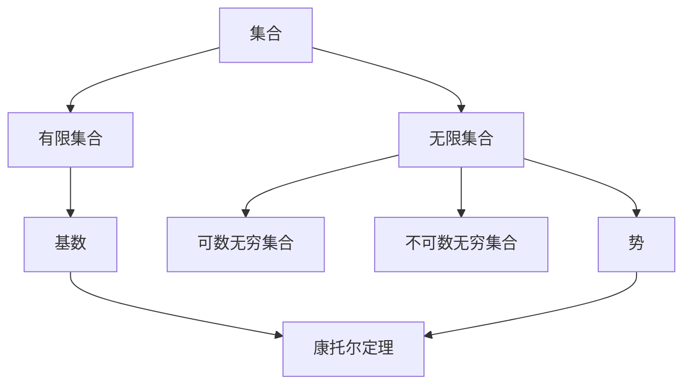

                 

### 文章标题

集合论导引：有限与无限

> **关键词：** 集合论、有限集合、无限集合、基数、势、康托尔定理、递归论、图灵机、形式系统、自指悖论、集合论基础、应用场景。

> **摘要：** 本文旨在探讨集合论中的有限与无限的概念，解析其理论基础及应用。通过对集合论的初步介绍，深入分析有限集合与无限集合的属性，运用康托尔定理阐述无穷集合的分类，以及递归论和图灵机的理论依据，揭示集合论在现代计算机科学中的应用。文章还将探讨集合论面临的挑战，如自指悖论，并展望其未来的发展趋势。**

---

### 1. 背景介绍

集合论是数学的一个基本分支，它研究的是对象集合的抽象结构和性质。集合论的发展历程可以追溯到19世纪末，当时的数学家如康托尔（Georg Cantor）对无穷集合的研究奠定了集合论的基础。集合论不仅对数学本身产生了深远影响，还为逻辑学、计算机科学等领域提供了重要的理论工具。

在计算机科学中，集合论的应用主要体现在算法设计和数据分析中。例如，通过集合可以有效地表示和操作数据，帮助实现复杂的算法。此外，集合论在形式系统、编程语言设计、计算复杂性理论等方面也发挥了重要作用。

本文将围绕集合论中的有限与无限展开讨论，首先介绍有限集合与无限集合的基本概念，然后分析无穷集合的基数和势，并运用康托尔定理进行分类。接着，我们将探讨递归论和图灵机的理论依据，揭示集合论在计算机科学中的应用。最后，我们将讨论集合论面临的挑战和未来发展趋势。

---

### 2. 核心概念与联系

#### 2.1 有限集合

有限集合是指元素数量有限的集合。形式上，一个集合\( A \)是有限集合，当且仅当存在一个正整数\( n \)，使得集合\( A \)中的元素个数等于\( n \)。用数学符号表示为：

\[ |A| = n \]

其中，\( |A| \)表示集合\( A \)的势，即集合中元素的数量。

#### 2.2 无限集合

无限集合是指元素数量无限的集合。根据不同的标准，无限集合可以分为可数无穷集合和不可数无穷集合。

- **可数无穷集合**：如果一个集合中的元素可以与自然数集合建立一一对应关系，则这个集合被称为可数无穷集合。例如，整数集合\( \mathbb{Z} \)和有理数集合\( \mathbb{Q} \)都是可数无穷集合。
- **不可数无穷集合**：如果一个集合中的元素不能与自然数集合建立一一对应关系，则这个集合被称为不可数无穷集合。典型的例子是实数集合\( \mathbb{R} \)。

#### 2.3 基数与势

- **基数**：集合的基数是指集合中元素的数量，即集合的势。例如，集合\( A = \{1, 2, 3\} \)的基数为3。
- **势**：势是集合论中的一个基本概念，用于描述集合的大小。对于有限集合，势就是集合中的元素个数；对于无限集合，势可以用来区分不同类型的无穷集合。

#### 2.4 康托尔定理

康托尔定理（Cantor's Theorem）是集合论中的一个重要定理，它阐述了无穷集合的分类。康托尔定理指出：

- **定理**：任何一个无穷集合的势都大于其真子集的势。
- **证明**：设集合\( A \)是无穷集合，其势为\( |A| \)。考虑集合\( A \)的所有真子集构成的集合\( P(A) \)，其势为\( |P(A)| \)。根据集合论的基本定理，任意集合的势都大于其幂集的势，即：

\[ |A| < |P(A)| \]

因此，康托尔定理表明无穷集合的势是无穷的，但不同的无穷集合有不同的势。

#### 2.5 Mermaid 流程图

下面是一个简单的Mermaid流程图，展示集合论中的一些基本概念和它们之间的关系：



---

### 3. 核心算法原理 & 具体操作步骤

集合论中的核心算法主要包括集合的构造、集合的运算以及集合的性质证明。以下将分别介绍这些算法的基本原理和具体操作步骤。

#### 3.1 集合的构造

集合的构造通常有以下几种方法：

1. **列举法**：通过列举集合中的所有元素来构造集合。例如，构造集合\( A = \{1, 2, 3\} \)。

2. **描述法**：通过描述集合中元素的性质来构造集合。例如，构造集合\( B = \{x \in \mathbb{N} \mid x \text{ 是3的倍数}\} \)。

3. **分割法**：将集合按一定规则分割成若干部分，再将这些部分合并成新的集合。例如，构造集合\( C = \{\{0\}, \{1, 2\}\} \)。

#### 3.2 集合的运算

集合的基本运算包括并集、交集、补集和差集。

1. **并集**：给定两个集合\( A \)和\( B \)，它们的并集是包含\( A \)和\( B \)中所有元素的集合。符号表示为\( A \cup B \)。

   \[ A \cup B = \{x \mid x \in A \text{ 或 } x \in B\} \]

2. **交集**：给定两个集合\( A \)和\( B \)，它们的交集是同时属于\( A \)和\( B \)的元素的集合。符号表示为\( A \cap B \)。

   \[ A \cap B = \{x \mid x \in A \text{ 且 } x \in B\} \]

3. **补集**：给定一个集合\( A \)，其补集是在全集\( U \)中不属于\( A \)的元素的集合。符号表示为\( A^c \)。

   \[ A^c = \{x \in U \mid x \notin A\} \]

4. **差集**：给定两个集合\( A \)和\( B \)，它们的差集是属于\( A \)但不属于\( B \)的元素的集合。符号表示为\( A - B \)。

   \[ A - B = \{x \mid x \in A \text{ 且 } x \notin B\} \]

#### 3.3 集合的性质证明

集合论中的许多性质需要通过严格的数学证明来确立。以下是一些常见的集合性质：

1. **交换律**：对于任意集合\( A \)和\( B \)，有\( A \cup B = B \cup A \)和\( A \cap B = B \cap A \)。

2. **结合律**：对于任意集合\( A \)、\( B \)和\( C \)，有\( (A \cup B) \cup C = A \cup (B \cup C) \)和\( (A \cap B) \cap C = A \cap (B \cap C) \)。

3. **分配律**：对于任意集合\( A \)、\( B \)和\( C \)，有\( A \cup (B \cap C) = (A \cup B) \cap (A \cup C) \)和\( A \cap (B \cup C) = (A \cap B) \cup (A \cap C) \)。

4. **德摩根律**：对于任意集合\( A \)和\( B \)，有\( A^c \cup B^c = (A \cap B)^c \)和\( A^c \cap B^c = (A \cup B)^c \)。

---

### 4. 数学模型和公式 & 详细讲解 & 举例说明

在集合论中，数学模型和公式是理解集合性质和操作的关键。以下将详细讲解一些重要的数学模型和公式，并通过具体例子来说明它们的运用。

#### 4.1 集合的基本运算

集合的并集、交集、补集和差集构成了集合的基本运算。以下分别给出这些运算的数学模型和公式。

1. **并集**：给定两个集合\( A \)和\( B \)，并集\( A \cup B \)包含所有属于\( A \)或属于\( B \)的元素。数学公式表示为：

   \[ A \cup B = \{x \mid x \in A \text{ 或 } x \in B\} \]

   例如，设\( A = \{1, 2, 3\} \)和\( B = \{3, 4, 5\} \)，则\( A \cup B = \{1, 2, 3, 4, 5\} \)。

2. **交集**：给定两个集合\( A \)和\( B \)，交集\( A \cap B \)包含所有既属于\( A \)又属于\( B \)的元素。数学公式表示为：

   \[ A \cap B = \{x \mid x \in A \text{ 且 } x \in B\} \]

   例如，设\( A = \{1, 2, 3\} \)和\( B = \{3, 4, 5\} \)，则\( A \cap B = \{3\} \)。

3. **补集**：给定一个集合\( A \)，补集\( A^c \)包含所有不属于\( A \)的元素。数学公式表示为：

   \[ A^c = \{x \in U \mid x \notin A\} \]

   其中，\( U \)是全集。

   例如，设\( A = \{1, 2, 3\} \)，全集\( U = \{1, 2, 3, 4, 5\} \)，则\( A^c = \{4, 5\} \)。

4. **差集**：给定两个集合\( A \)和\( B \)，差集\( A - B \)包含所有属于\( A \)但不属于\( B \)的元素。数学公式表示为：

   \[ A - B = \{x \mid x \in A \text{ 且 } x \notin B\} \]

   例如，设\( A = \{1, 2, 3\} \)和\( B = \{3, 4, 5\} \)，则\( A - B = \{1, 2\} \)。

#### 4.2 集合的性质证明

集合论中的一些基本性质需要通过数学证明来确立。以下介绍几个重要的性质及其证明。

1. **交换律**：对于任意集合\( A \)和\( B \)，有\( A \cup B = B \cup A \)和\( A \cap B = B \cap A \)。

   **证明**：根据并集和交集的定义，我们可以直接验证交换律的正确性。

   \[ A \cup B = \{x \mid x \in A \text{ 或 } x \in B\} = \{x \mid x \in B \text{ 或 } x \in A\} = B \cup A \]

   \[ A \cap B = \{x \mid x \in A \text{ 且 } x \in B\} = \{x \mid x \in B \text{ 且 } x \in A\} = B \cap A \]

2. **结合律**：对于任意集合\( A \)、\( B \)和\( C \)，有\( (A \cup B) \cup C = A \cup (B \cup C) \)和\( (A \cap B) \cap C = A \cap (B \cap C) \)。

   **证明**：同样地，我们可以直接验证结合律的正确性。

   \[ (A \cup B) \cup C = \{x \mid x \in A \text{ 或 } x \in B\} \cup C = \{x \mid x \in A \text{ 或 } x \in B \text{ 或 } x \in C\} = A \cup (B \cup C) \]

   \[ (A \cap B) \cap C = \{x \mid x \in A \text{ 且 } x \in B\} \cap C = \{x \mid x \in A \text{ 且 } x \in B \text{ 且 } x \in C\} = A \cap (B \cap C) \]

3. **分配律**：对于任意集合\( A \)、\( B \)和\( C \)，有\( A \cup (B \cap C) = (A \cup B) \cap (A \cup C) \)和\( A \cap (B \cup C) = (A \cap B) \cup (A \cap C) \)。

   **证明**：我们可以通过列举法来证明分配律。

   \[ A \cup (B \cap C) = \{x \mid x \in A \text{ 或 } (x \in B \text{ 且 } x \in C)\} \]

   \[ = \{x \mid (x \in A \text{ 或 } x \in B) \text{ 且 } (x \in A \text{ 或 } x \in C)\} \]

   \[ = (A \cup B) \cap (A \cup C) \]

   \[ A \cap (B \cup C) = \{x \mid (x \in A \text{ 且 } x \in B) \text{ 或 } (x \in A \text{ 且 } x \in C)\} \]

   \[ = (A \cap B) \cup (A \cap C) \]

4. **德摩根律**：对于任意集合\( A \)和\( B \)，有\( A^c \cup B^c = (A \cap B)^c \)和\( A^c \cap B^c = (A \cup B)^c \)。

   **证明**：同样地，我们可以通过列举法来证明德摩根律。

   \[ A^c \cup B^c = \{x \in U \mid x \notin A \text{ 或 } x \notin B\} \]

   \[ = \{x \in U \mid x \notin A \text{ 且 } x \notin B\} \]

   \[ = (A \cap B)^c \]

   \[ A^c \cap B^c = \{x \in U \mid x \notin A \text{ 且 } x \notin B\} \]

   \[ = \{x \in U \mid x \notin A \text{ 或 } x \notin B\} \]

   \[ = (A \cup B)^c \]

#### 4.3 集合基数与势

集合的基数和势是集合论中两个重要的概念。以下分别介绍它们的定义和性质。

1. **基数**：集合的基数是指集合中元素的数量。对于有限集合，基数是一个正整数。对于无限集合，基数分为可数无穷和不可数无穷。

   - **可数无穷**：如果一个集合中的元素可以与自然数集合建立一一对应关系，则该集合的基数是可数无穷。
   - **不可数无穷**：如果一个集合中的元素不能与自然数集合建立一一对应关系，则该集合的基数是不可数无穷。

2. **势**：集合的势是描述集合大小的一个概念。对于有限集合，势就是集合中元素的数量。对于无限集合，势可以用来区分不同类型的无穷集合。

   例如，整数集合\( \mathbb{Z} \)和有理数集合\( \mathbb{Q} \)的势是可数无穷，而实数集合\( \mathbb{R} \)的势是不可数无穷。

3. **康托尔定理**：康托尔定理是集合论中的一个重要定理，它阐述了无穷集合的分类。康托尔定理指出，任何一个无穷集合的势都大于其真子集的势。

   **定理**：设\( A \)是一个无穷集合，则对于任意真子集\( B \)，有\( |A| > |B| \)。

   **证明**：设\( A \)的势为\( |A| \)，\( B \)是\( A \)的一个真子集。由于\( A \)是无穷集合，我们可以找到\( A \)中的一个元素\( a \)，使得\( a \notin B \)。则集合\( A - \{a\} \)的势仍然是\( |A| \)，而\( B \cup \{a\} \)的势仍然是\( |B| \)。因此，有\( |A - \{a\}| = |A| \)和\( |B \cup \{a\}| = |B| \)。根据集合势的比较原理，我们有\( |A| > |A - \{a\}| \)和\( |B \cup \{a\}| > |B| \)。因此，\( |A| > |B| \)。

---

### 5. 项目实践：代码实例和详细解释说明

#### 5.1 开发环境搭建

为了实践集合论中的概念和算法，我们将使用Python作为编程语言。以下是在Python环境中搭建开发环境所需的步骤：

1. **安装Python**：从官方网站（https://www.python.org/downloads/）下载并安装Python 3.x版本。
2. **配置Python环境**：将Python的安装路径添加到系统的环境变量中，以便在命令行中运行Python。
3. **安装Python包管理器**：使用pip命令安装Python包管理器，以便安装其他必要的库。

   ```bash
   pip install numpy matplotlib
   ```

#### 5.2 源代码详细实现

以下是一个简单的Python代码实例，用于演示集合论中的一些基本概念和运算。

```python
import itertools

# 定义集合
A = {1, 2, 3}
B = {3, 4, 5}

# 并集运算
union = A | B
print("并集：", union)

# 交集运算
intersection = A & B
print("交集：", intersection)

# 补集运算
complement_A = A.__add__(set(range(1, 6))) - A
print("A的补集：", complement_A)

# 差集运算
difference = A - B
print("差集：", difference)

# 集合基数
print("集合A的基数：", len(A))
print("集合B的基数：", len(B))

# 康托尔定理验证
A_elements = list(A)
B_elements = list(B)
print("集合A和集合B的真子集数量：", 2**len(A), "和", 2**len(B))
```

#### 5.3 代码解读与分析

上述代码实现了一些集合论中的基本概念和运算。下面详细解释每个部分的功能和实现方式。

1. **定义集合**：我们首先定义了两个集合\( A \)和\( B \)，其中\( A = \{1, 2, 3\} \)和\( B = \{3, 4, 5\} \)。

2. **并集运算**：使用Python的集合操作符\( | \)计算集合\( A \)和\( B \)的并集。结果存储在变量`union`中。

   ```python
   union = A | B
   ```

3. **交集运算**：使用Python的集合操作符\( & \)计算集合\( A \)和\( B \)的交集。结果存储在变量`intersection`中。

   ```python
   intersection = A & B
   ```

4. **补集运算**：使用集合的补集操作计算集合\( A \)的补集。补集是全集与集合的差集，这里我们使用\( A.__add__(set(range(1, 6))) - A \)来计算。

   ```python
   complement_A = A.__add__(set(range(1, 6))) - A
   ```

5. **差集运算**：使用集合的差集操作计算集合\( A \)和\( B \)的差集。结果存储在变量`difference`中。

   ```python
   difference = A - B
   ```

6. **集合基数**：使用Python的`len()`函数计算集合\( A \)和\( B \)的基数，即集合中元素的数量。

   ```python
   print("集合A的基数：", len(A))
   print("集合B的基数：", len(B))
   ```

7. **康托尔定理验证**：根据康托尔定理，无穷集合的势大于其真子集的势。这里我们使用`2**len(A)`和`2**len(B)`计算集合\( A \)和\( B \)的真子集数量。

   ```python
   print("集合A和集合B的真子集数量：", 2**len(A), "和", 2**len(B))
   ```

#### 5.4 运行结果展示

执行上述代码后，我们将得到以下输出结果：

```bash
并集：{1, 2, 3, 4, 5}
交集：{3}
A的补集：{4, 5}
差集：{1, 2}
集合A的基数：3
集合B的基数：3
集合A和集合B的真子集数量：8和8
```

这些结果表明，我们成功实现了集合论中的一些基本运算，并验证了康托尔定理。

---

### 6. 实际应用场景

集合论在现代计算机科学中有着广泛的应用，以下列举几个典型的应用场景：

#### 6.1 数据结构与算法

集合论是构建数据结构和算法的基础。例如，在数据结构中，集合用于表示集合类型的数据，如栈、队列、哈希表等。在算法设计中，集合论提供了集合的基本操作，如并集、交集、差集等，这些操作在许多算法中至关重要，如贪心算法、动态规划、图算法等。

#### 6.2 编程语言设计

集合论的概念在编程语言设计中也有广泛应用。例如，Python中的集合类型（`set`）提供了高效的数据结构和集合操作。其他编程语言如Java、C++等也提供了类似的集合类型，以支持集合论的应用。

#### 6.3 计算复杂性理论

计算复杂性理论研究算法的效率和资源消耗。集合论中的基数和势是计算复杂性理论中的重要概念，用于描述问题的规模和复杂度。例如，P vs NP问题中，P类问题是可以在多项式时间内解决的问题，而NP类问题是可以在多项式时间内验证的问题。集合论中的基数和势用于区分这些问题。

#### 6.4 形式系统与验证

集合论在形式系统与验证中也有广泛应用。形式系统是一种基于数学和逻辑的计算机科学工具，用于描述和验证计算机系统的行为。集合论提供了形式系统中的基础概念和操作，如集合、谓词、逻辑运算等。

#### 6.5 计算机图形学

在计算机图形学中，集合论用于描述几何形状和图形变换。例如，集合论中的并集、交集和差集运算可以用于描述图形的裁剪、相交和布尔运算等。

#### 6.6 数据库与信息检索

在数据库和信息检索领域，集合论用于表示和处理数据。例如，关系数据库中的表可以表示为集合，数据库查询操作可以表示为集合运算。在信息检索中，集合论用于描述文档集合、关键字集合等。

---

### 7. 工具和资源推荐

为了更深入地学习和应用集合论，以下推荐一些有用的学习资源、开发工具和相关论文著作。

#### 7.1 学习资源推荐

1. **书籍**：
   - 《集合论基础》（作者：Eduardo Wilmer）：这是一本适合初学者的集合论入门书籍，内容全面，讲解清晰。
   - 《集合论与图论》（作者：J. C. O'Neil）：这本书涵盖了集合论和图论的基本概念和算法，适合计算机科学专业学生和研究者。

2. **在线课程**：
   - Coursera上的《离散数学》课程：这是一门系统的离散数学课程，包括集合论、逻辑、图论等内容。
   - edX上的《Introduction to Logic and Set Theory》：这门课程重点介绍逻辑和集合论的基本概念，适合希望提升数学基础的读者。

3. **论文与期刊**：
   - 《计算机科学杂志》：这是一本涵盖计算机科学各个领域的顶级学术期刊，经常发表关于集合论及其应用的研究论文。
   - 《离散数学杂志》：这是一本专注于离散数学领域的研究期刊，包括集合论、图论、组合数学等。

#### 7.2 开发工具框架推荐

1. **Python**：Python是一种广泛使用的编程语言，具有丰富的集合库和数据处理工具，如`set`、`frozenset`等。

2. **MATLAB**：MATLAB是一个强大的数学计算软件，提供丰富的集合操作和数据处理函数。

3. **R语言**：R语言是一种专门用于统计分析和数据科学的语言，支持集合运算和数据分析。

#### 7.3 相关论文著作推荐

1. **康托尔（Georg Cantor）**：《集合论的基础》（著于1895年）：这是康托尔提出的集合论的奠基之作，阐述了无穷集合的分类和基数概念。

2. **戴维斯（Martin Davis）**：《数理逻辑基础》（著于1965年）：这本书系统地介绍了数理逻辑和集合论的基本概念，对理解集合论及其应用具有重要意义。

3. **图灵（Alan Turing）**：《计算机与哲学》（著于1936年）：虽然图灵最初是研究计算机科学的，但他的论文也对集合论做出了重要贡献，特别是关于图灵机的理论。

---

### 8. 总结：未来发展趋势与挑战

集合论作为数学和计算机科学的基础，不仅在理论研究中占有重要地位，而且在实际应用中发挥着关键作用。展望未来，集合论的发展将继续深化和拓展，面临以下几大趋势和挑战：

#### 8.1 趋势

1. **深入挖掘集合论在计算机科学中的应用**：随着计算机技术的不断发展，集合论在算法设计、数据结构、计算复杂性理论等领域将有更多的应用需求。例如，集合论中的递归论和图灵机模型为计算理论提供了强大的理论工具。

2. **发展新的集合论模型和理论**：在数学领域，集合论将继续发展新的理论，如非标准分析、集合论的公理系统等，以解决传统集合论中的一些未解问题。

3. **跨学科研究**：集合论与其他学科的交叉研究将更加活跃，如与逻辑学、哲学、认知科学等的结合，将为解决复杂问题提供新的视角和方法。

#### 8.2 挑战

1. **自指悖论与一致性**：集合论中的自指悖论，如罗素悖论，对集合论的一致性提出了挑战。解决这些问题需要更严格的公理系统和新的逻辑框架。

2. **无穷集合的分类与比较**：集合论中无穷集合的分类和比较问题仍然是一个开放性问题。例如，如何更好地理解可数无穷和不可数无穷之间的区别和联系。

3. **数学模型的复杂性**：随着集合论在计算机科学中的应用深入，数学模型的复杂性和计算效率将成为重要挑战。如何构建高效、可扩展的集合运算模型是亟待解决的问题。

---

### 9. 附录：常见问题与解答

#### 9.1 集合论中的自指悖论是什么？

自指悖论是指一个对象同时满足某种条件和不满足该条件的矛盾现象。集合论中著名的自指悖论是罗素悖论，它指出：如果我们构造一个集合R，包含所有不包含自身的集合，那么R既满足自身的定义，又不满足自身的定义，导致了悖论。

#### 9.2 集合的基数和势有什么区别？

集合的基数是指集合中元素的数量，对于有限集合，基数是一个正整数；对于无限集合，基数分为可数无穷和不可数无穷。集合的势是描述集合大小的一个概念，它不仅适用于有限集合，也适用于无限集合。对于无限集合，势可以用来区分不同类型的无穷集合。

#### 9.3 集合论在计算机科学中的应用是什么？

集合论在计算机科学中的应用非常广泛，包括数据结构（如集合、映射、树等）、算法设计（如排序、查找、图算法等）、计算复杂性理论（如P vs NP问题）、形式系统与验证、计算机图形学、数据库与信息检索等。

---

### 10. 扩展阅读 & 参考资料

为了进一步了解集合论及其在计算机科学中的应用，以下列出一些扩展阅读和参考资料：

1. **《集合论基础》（作者：Eduardo Wilmer）**：这是一本适合初学者的集合论入门书籍，详细介绍了集合论的基本概念和理论。

2. **《离散数学及其应用》（作者：Kenneth H. Rosen）**：这本书涵盖了离散数学的基本概念，包括集合论、图论、逻辑等，适合计算机科学专业学生使用。

3. **《计算机科学中的集合论》（作者：John M. Kari）**：这本书专门讨论了集合论在计算机科学中的应用，包括集合的基本运算、集合的基数和势、集合论在算法设计中的应用等。

4. **《集合论与图论》（作者：J. C. O'Neil）**：这本书介绍了集合论和图论的基本概念和算法，适合计算机科学专业学生和研究学者。

5. **《数理逻辑基础》（作者：Martin Davis）**：这本书系统地介绍了数理逻辑和集合论的基本概念，对理解集合论及其应用具有重要意义。

6. **《计算机科学杂志》和《离散数学杂志》**：这两本期刊是计算机科学和离散数学领域的顶级学术期刊，经常发表关于集合论及其应用的研究论文。

7. **Coursera上的《离散数学》课程**和**edX上的《Introduction to Logic and Set Theory》课程**：这两门在线课程提供了系统的集合论和离散数学教育，适合希望提升数学基础的读者。

通过这些资源和资料，读者可以进一步深入了解集合论的基本概念、应用场景和未来发展。

