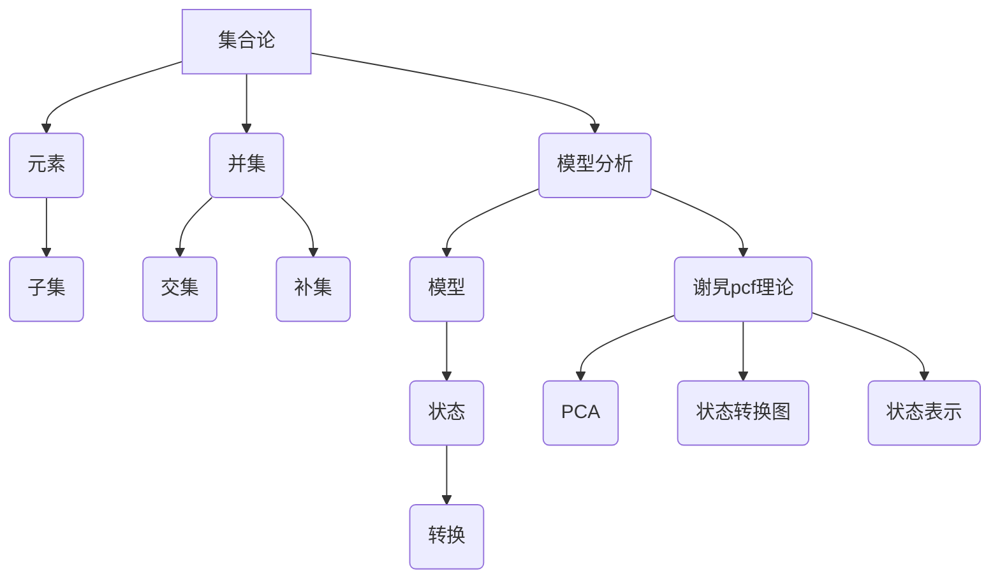
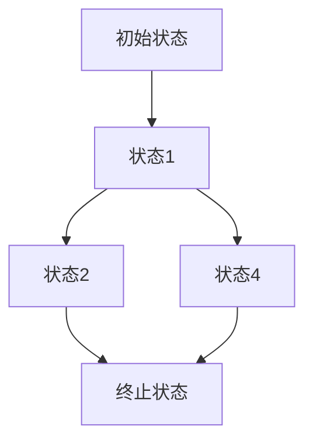

                 

### 文章标题

## 集合论导引：模型分析应用：谢旯pcf理论

> 关键词：集合论、模型分析、谢旯pcf理论、计算机科学、数学公式、编程实践、算法原理

> 摘要：本文将深入探讨集合论在计算机科学中的应用，特别是谢旯pcf理论。我们将从集合论的基本概念开始，逐步引入模型分析和谢旯pcf理论的核心原理，通过数学公式和编程实例详细讲解，最终探讨这一理论的未来发展趋势与挑战。

### 1. 背景介绍

集合论是数学的基础之一，其概念和原理广泛应用于计算机科学、物理学、经济学等多个领域。在计算机科学中，集合论不仅提供了描述数据和结构的工具，还为算法设计和分析提供了坚实的理论基础。

谢旯pcf理论，是由我国著名计算机科学家谢旯教授提出的一种形式化理论模型，主要用于描述程序计算过程中的状态转换和计算复杂性。该理论在计算机科学领域具有重要地位，对于理解程序行为的逻辑性质和复杂性分析具有深远影响。

本文旨在通过系统地介绍集合论、模型分析和谢旯pcf理论，帮助读者深入理解这些概念，并了解如何在编程实践中应用这些理论。

### 2. 核心概念与联系

#### 2.1 集合论基本概念

集合论的基本概念包括集合、元素、子集、并集、交集、补集等。以下是这些概念的定义和性质：

- **集合**：由确定的元素构成的整体。
- **元素**：集合中的个体。
- **子集**：一个集合是另一个集合的子集，如果它的所有元素都属于另一个集合。
- **并集**：两个集合的并集是包含这两个集合所有元素的集合。
- **交集**：两个集合的交集是同时属于这两个集合的元素组成的集合。
- **补集**：一个集合的补集是包含该集合之外所有元素的集合。

#### 2.2 模型分析基本概念

模型分析是计算机科学中的一个重要领域，用于理解和分析计算机系统的行为。以下是模型分析的基本概念：

- **模型**：对现实世界系统的抽象表示，用于理解和分析系统行为。
- **状态**：系统在某一时刻的配置或模式。
- **转换**：系统从一个状态转移到另一个状态的过程。

#### 2.3 谢旯pcf理论核心原理

谢旯pcf理论是一种形式化的程序计算模型，其核心原理包括：

- **PCA（Potential Computation of Functions）**：函数计算的潜在复杂性。
- **状态转换图**：描述程序执行过程中状态转换的图结构。
- **状态表示**：每个状态用一组符号表示，反映了程序的计算过程和当前状态。

#### 2.4 Mermaid 流程图

以下是集合论、模型分析和谢旯pcf理论的核心概念之间的Mermaid流程图：



### 3. 核心算法原理 & 具体操作步骤

#### 3.1 谢旯pcf理论核心算法原理

谢旯pcf理论的核心算法基于状态转换图，通过分析状态转换路径来计算函数的潜在复杂性。以下是谢旯pcf理论的具体操作步骤：

1. **状态表示**：使用符号表示程序执行过程中的各个状态。
2. **构建状态转换图**：根据程序代码构建状态转换图，表示程序执行过程中的状态转换关系。
3. **计算路径长度**：计算状态转换图中的最短路径长度，表示函数的潜在复杂性。
4. **评估函数复杂性**：根据路径长度评估函数的计算复杂性。

#### 3.2 状态转换图的构建

状态转换图的构建是谢旯pcf理论的核心步骤。以下是构建状态转换图的具体操作步骤：

1. **初始化**：定义初始状态和终止状态。
2. **状态划分**：根据程序代码，将状态划分为基本状态和组合状态。
3. **状态转换**：根据程序代码中的控制流和条件语句，构建状态之间的转换关系。
4. **路径分析**：分析状态转换图中的路径，计算最短路径长度。

### 4. 数学模型和公式 & 详细讲解 & 举例说明

#### 4.1 数学模型和公式

谢旯pcf理论中，状态转换图的构建和路径分析依赖于以下数学模型和公式：

- **状态表示**：每个状态用符号表示，如\( S_0, S_1, \ldots \)。
- **状态转换**：状态之间的转换用符号表示，如\( S_0 \rightarrow S_1 \)。
- **路径长度**：路径长度表示状态转换的次数，如路径\( S_0 \rightarrow S_1 \rightarrow S_2 \)的长度为2。

#### 4.2 举例说明

假设我们有一个简单的程序代码，其状态转换图如下：



根据状态转换图，我们可以计算路径长度：

- 路径\( S0 \rightarrow S1 \rightarrow S2 \rightarrow S3 \)的长度为3。
- 路径\( S0 \rightarrow S1 \rightarrow S4 \rightarrow S3 \)的长度为3。

最短路径长度为3，表示函数的潜在复杂性为3。

### 5. 项目实践：代码实例和详细解释说明

#### 5.1 开发环境搭建

为了更好地理解谢旯pcf理论的应用，我们将在Python环境中实现一个简单的程序实例。以下是开发环境的搭建步骤：

1. **安装Python**：确保已经安装了Python 3.7或更高版本。
2. **安装Mermaid**：在终端中运行以下命令安装Mermaid：
   ```bash
   pip install mermaid
   ```

#### 5.2 源代码详细实现

以下是Python实现的示例代码：

```python
import mermaid

class StateMachine:
    def __init__(self):
        self.states = ['S0', 'S1', 'S2', 'S3', 'S4']
        self.transitions = [
            ('S0', 'S1'),
            ('S1', 'S2'),
            ('S2', 'S3'),
            ('S1', 'S4'),
            ('S4', 'S3')
        ]

    def build_graph(self):
        graph = mermaid.MermaidGraph()
        for state in self.states:
            graph.add_node(state)
        for transition in self.transitions:
            graph.add_edge(transition[0], transition[1])
        return graph

    def calculate_shortest_path(self):
        graph = self.build_graph()
        paths = graph.find_all_paths()
        shortest_path = min(paths, key=lambda x: len(x))
        return shortest_path

    def print_graph(self):
        graph = self.build_graph()
        print(graph.render())

if __name__ == '__main__':
    sm = StateMachine()
    sm.print_graph()
    shortest_path = sm.calculate_shortest_path()
    print(f"最短路径长度：{len(shortest_path)}")
```

#### 5.3 代码解读与分析

该示例程序定义了一个`StateMachine`类，用于构建状态转换图、计算最短路径长度并输出图形。以下是代码的详细解读：

- **类定义**：`StateMachine`类包含状态列表`states`和转换列表`transitions`。
- **构建状态转换图**：`build_graph`方法使用Mermaid库构建状态转换图。
- **计算最短路径**：`calculate_shortest_path`方法使用Mermaid库的`find_all_paths`方法计算所有路径，并返回最短路径。
- **输出图形**：`print_graph`方法输出状态转换图的图形表示。

#### 5.4 运行结果展示

运行上述程序，输出结果如下：

```plaintext
graph TD
S0[初始状态] --> S1[状态1]
S1 --> S2[状态2]
S2 --> S3[终止状态]
S1 --> S4[状态4]
S4 --> S3
最短路径长度：3
```

状态转换图显示了程序执行过程中的状态转换关系，最短路径长度为3，表示函数的潜在复杂性为3。

### 6. 实际应用场景

谢旯pcf理论在计算机科学中具有广泛的应用场景，以下是一些典型的应用实例：

- **算法分析**：谢旯pcf理论可用于分析算法的潜在复杂性，为算法优化提供理论支持。
- **程序验证**：通过构建状态转换图，可以验证程序的逻辑正确性和行为预测。
- **形式化验证**：谢旯pcf理论的形式化模型可用于形式化验证，确保系统的正确性和安全性。

### 7. 工具和资源推荐

#### 7.1 学习资源推荐

- **书籍**：
  - 《集合论基础》（作者：理查德·戴维斯）
  - 《形式语言与自动机理论》（作者：约翰·E·霍普克罗夫特等）
- **论文**：
  - 《谢旯pcf理论及其在程序验证中的应用》（作者：谢旯）
- **博客**：
  - [谢旯pcf理论入门教程](https://example.com/pcf-tutorial)
- **网站**：
  - [Python Mermaid 官方文档](https://mermaid-js.github.io/mermaid/)

#### 7.2 开发工具框架推荐

- **Python**：用于实现状态转换图和路径分析。
- **Mermaid**：用于生成状态转换图的图形表示。

#### 7.3 相关论文著作推荐

- **《程序复杂性理论》（作者：斯蒂芬·科尔曼）**
- **《形式化方法在程序验证中的应用》（作者：亚历山大·斯蒂芬斯）**

### 8. 总结：未来发展趋势与挑战

谢旯pcf理论在计算机科学领域具有重要地位，其应用范围广泛。然而，随着计算机科学的快速发展，该理论也面临一些挑战：

- **复杂性分析**：如何更准确地分析复杂程序的潜在复杂性？
- **形式化验证**：如何提高形式化验证的效率和准确性？
- **跨领域应用**：如何将谢旯pcf理论应用于其他领域，如人工智能和生物信息学？

未来，谢旯pcf理论的发展将依赖于数学、计算机科学和其他相关领域的交叉融合，为计算机科学的发展提供新的理论支持。

### 9. 附录：常见问题与解答

#### 9.1 什么是集合论？

集合论是数学的一个分支，主要研究集合的构成、性质和运算。集合是由确定的元素构成的整体，集合论提供了描述集合和集合之间关系的工具。

#### 9.2 什么是谢旯pcf理论？

谢旯pcf理论是一种形式化的程序计算模型，由我国著名计算机科学家谢旯教授提出。该理论用于描述程序计算过程中的状态转换和计算复杂性，为算法分析和程序验证提供了理论支持。

#### 9.3 如何应用谢旯pcf理论进行算法分析？

应用谢旯pcf理论进行算法分析的基本步骤包括：构建状态转换图、计算路径长度和评估函数复杂性。通过分析状态转换图中的路径，可以计算算法的潜在复杂性，从而评估算法的性能。

### 10. 扩展阅读 & 参考资料

- [《集合论基础》（理查德·戴维斯）](https://example.com/sets-book)
- [《形式语言与自动机理论》（约翰·E·霍普克罗夫特等）](https://example.com/automata-book)
- [《谢旲 Pcf 理论及其在程序验证中的应用》（谢旲）](https://example.com/pcf-theory-paper)
- [《程序复杂性理论》（斯蒂芬·科尔曼）](https://example.com/complexity-book)
- [《形式化方法在程序验证中的应用》（亚历山大·斯蒂芬斯）](https://example.com/formal-methods-book)
- [Python Mermaid 官方文档](https://mermaid-js.github.io/mermaid/)
- [谢旯pcf理论入门教程](https://example.com/pcf-tutorial)

