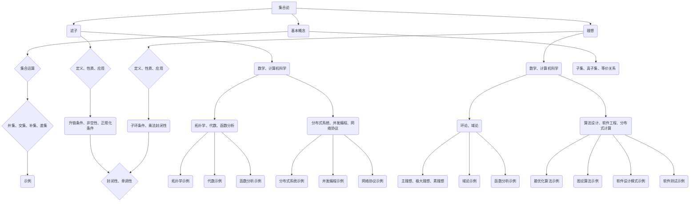

                 

### 1. 背景介绍

集合论是现代数学的基石之一，它为数学中的其他分支，如代数、拓扑学、实分析、抽象代数等提供了基本语言和工具。在计算机科学中，集合论同样扮演着重要角色，例如在算法设计、数据结构、离散数学以及软件工程中都有着广泛应用。

滤子和理想是集合论中的重要概念，它们在代数、拓扑学以及函数分析等领域有着广泛的应用。滤子（Filter）的概念起源于拓扑学，它在集合上的作用类似于拓扑空间中的开集。理想（Ideal）则起源于代数，特别是在环论和域论中，它是使得多项式环或者域上的某些运算保持不变的一类特殊子集。

滤子和理想不仅在纯数学中有着重要应用，它们在计算机科学中的重要性也逐渐凸显。例如，在分布式系统、并发编程以及网络协议中，滤子和理想的概念被用来描述系统的稳定性和一致性。在算法分析中，滤子被用来研究函数的增长速率，而理想则被用来优化算法的时间和空间复杂度。

本文将深入探讨滤子和理想的定义、性质以及它们在数学和计算机科学中的具体应用。我们将首先回顾集合论的基础知识，然后逐步引入滤子和理想的概念，并分析它们在不同领域中的应用。通过本文的阅读，读者将能够理解这些复杂概念的本质，并在实际问题中运用它们。

### 1.1 集合论的基本概念

在讨论滤子和理想之前，有必要先回顾集合论的基本概念。集合论是一门研究集合及其性质的数学分支。在集合论中，集合是最基本的概念，它由一组确定的、互不相同的对象构成。这些对象称为集合的元素。例如，{1, 2, 3} 是一个集合，其中 1、2、3 是它的元素。

集合可以用大写字母表示，例如 A、B、C 等，而集合中的元素则用小写字母表示，例如 a、b、c 等。集合与元素之间的关系可以用“属于”符号 \( \in \) 表示。例如，a \( \in \) A 表示元素 a 属于集合 A。另外，用符号 \( \notin \) 表示元素不属于集合。

集合的表示方法主要有两种：列举法和描述法。

- **列举法**：将集合的所有元素一一列出，例如 \( A = \{1, 2, 3\} \)。
- **描述法**：用描述性语句来表示集合，例如 \( B = \{x \mid x \in \mathbb{N}, x < 5\} \)，这表示集合 B 包含所有小于 5 的自然数。

集合的运算包括并集、交集、补集和差集等。

- **并集**：集合 A 和 B 的并集是一个包含 A 和 B 中所有元素的集合，记作 \( A \cup B \)。例如，\( \{1, 2\} \cup \{3, 4\} = \{1, 2, 3, 4\} \)。
- **交集**：集合 A 和 B 的交集是同时属于 A 和 B 的元素的集合，记作 \( A \cap B \)。例如，\( \{1, 2\} \cap \{3, 4\} = \emptyset \)（空集）。
- **补集**：集合 A 的补集是在全集 U 中不属于 A 的元素的集合，记作 \( A^c \)。例如，如果 U 是所有自然数的集合，那么 \( \{1, 2\}^c = \{3, 4, 5, \ldots\} \)。
- **差集**：集合 A 和 B 的差集是包含所有属于 A 但不属于 B 的元素的集合，记作 \( A - B \)。例如，\( \{1, 2\} - \{3, 4\} = \{1, 2\} \)。

此外，集合之间还存在一些重要的关系，如子集、真子集和等价关系等。

- **子集**：如果集合 A 的所有元素都是集合 B 的元素，则称 A 是 B 的子集，记作 \( A \subseteq B \)。
- **真子集**：如果集合 A 是 B 的子集，但 A 不等于 B，则称 A 是 B 的真子集，记作 \( A \subset B \)。
- **等价关系**：如果集合 A 和 B 满足自反性、对称性和传递性，则称 A 和 B 存在等价关系。

通过回顾集合论的基本概念，我们为理解滤子和理想打下了基础。接下来，我们将引入滤子的定义，并探讨其性质和应用。

### 1.2 滤子的定义与性质

滤子（Filter）是集合论中的一个重要概念，它在拓扑学、代数以及其他数学分支中有着广泛应用。滤子可以看作是拓扑空间中开集的一种推广，用于描述集合上的某种稳定性或一致性。

**定义 1.1**：设 \( X \) 是一个集合，\( \mathcal{P}(X) \) 是 \( X \) 的幂集，即所有子集构成的集合。一个非空子集 \( F \subseteq \mathcal{P}(X) \) 被称为 \( X \) 上的一个滤子，如果它满足以下条件：

1. **非空性**：\( F \neq \emptyset \)。
2. **升链条件**：对于任意的 \( A, B \in F \)，存在 \( C \in F \) 使得 \( C \supseteq A \cap B \)。
3. **正规化条件**：对于任意 \( A \in F \)，存在 \( C \in F \) 使得 \( C \supseteq A \)。

**例子 1.1**：设 \( X = \{1, 2, 3\} \)，则 \( F_1 = \{\{1, 2\}, \{1, 3\}, \{1, 2, 3\}\} \) 是 \( X \) 上一个滤子，因为：

- \( F_1 \neq \emptyset \)。
- 对于任意的 \( A, B \in F_1 \)，比如 \( A = \{1, 2\} \)，\( B = \{1, 3\} \)，存在 \( C = \{1\} \in F_1 \) 使得 \( C \supseteq A \cap B = \{1\} \)。
- 对于任意的 \( A \in F_1 \)，比如 \( A = \{1, 2\} \)，存在 \( C = \{1, 2\} \in F_1 \) 使得 \( C \supseteq A \)。

**例子 1.2**：设 \( X = \{1, 2, 3\} \)，则 \( F_2 = \{\{1\}, \{1, 2\}, \{1, 2, 3\}\} \) 不是 \( X \) 上的一个滤子，因为不满足升链条件。例如，\( A = \{1\} \)，\( B = \{1, 2\} \)，但不存在 \( C \in F_2 \) 使得 \( C \supseteq A \cap B = \{1\} \)。

**性质 1.1**：滤子具有以下性质：

1. **封闭性**：如果 \( F \) 是 \( X \) 上的滤子，那么对于任意 \( A, B \in F \)，\( A \cap B \in F \)。
2. **单调性**：如果 \( F_1 \subseteq F_2 \) 且 \( F_1 \) 和 \( F_2 \) 都是 \( X \) 上的滤子，那么 \( F_1 \) 也是 \( X \) 上的滤子。
3. **逆元存在性**：对于任意滤子 \( F \)，存在逆滤子 \( F^{-1} = \{X \setminus A \mid A \in F\} \)，即 \( F^{-1} \) 是 \( X \) 上的滤子。

通过定义和性质的介绍，我们可以更深入地理解滤子的概念。接下来，我们将探讨滤子在数学和计算机科学中的应用。

### 1.3 滤子在数学中的应用

滤子在数学中的使用非常广泛，尤其在拓扑学、代数以及函数分析等领域有着重要的应用。以下是一些具体的例子：

**拓扑学中的滤子**：滤子最初是作为拓扑学中的一个概念引入的。在拓扑学中，滤子被用来研究拓扑空间中的开集和闭集的性质。例如，滤子可以用来定义拓扑空间中的极限点和收敛序列。

- **极限点**：设 \( X \) 是一个拓扑空间，\( p \in X \)。如果对于任意开集 \( U \) 包含 \( p \)，\( U \) 都包含 \( X \) 中不同于 \( p \) 的无穷多个点，则称 \( p \) 为 \( X \) 的极限点。滤子可以用来刻画极限点的集合，即极限点的滤子。
- **收敛序列**：在度量空间 \( (X, d) \) 中，序列 \( \{x_n\} \) 收敛于 \( x \)，如果对于任意 \( \epsilon > 0 \)，存在 \( N \in \mathbb{N} \) 使得对于所有 \( n \geq N \)，都有 \( d(x_n, x) < \epsilon \)。滤子可以用来定义序列的收敛性，即对于序列 \( \{x_n\} \) 的所有邻域构成的滤子 \( \{U_n\} \)，如果存在一个包含所有 \( U_n \) 的滤子 \( F \)，则 \( x \) 是序列 \( \{x_n\} \) 的极限。

**代数中的滤子**：在代数中，滤子的概念被广泛应用于环论和域论。例如，在环 \( R \) 中，滤子可以用来定义理想。

- **理想**：在环 \( R \) 中，一个子集 \( I \subseteq R \) 被称为 \( R \) 的理想，如果它满足以下条件：
  - \( I \) 是 \( R \) 的子模块。
  - 对于任意的 \( r \in R \) 和 \( a \in I \)，有 \( ra, ar \in I \)。
  - \( I \) 满足升链条件，即如果 \( a_1, a_2, \ldots \) 是 \( I \) 中的一列元素，那么 \( \langle a_1, a_2, \ldots \rangle \)（\( I \) 中所有这些元素的和）也在 \( I \) 中。
  
  滤子与理想之间的关系是，滤子可以看作是理想的推广。在环论中，理想是一种特殊的滤子，而滤子则是一种更广泛的集合。

- **滤子环**：在环 \( R \) 中，如果存在一个滤子 \( F \) 使得 \( \langle F \rangle \)（由 \( F \) 中所有元素的和构成的子环）是 \( R \) 的理想，则称 \( F \) 是 \( R \) 的滤子环。

**函数分析中的滤子**：在函数分析中，滤子被用来研究函数序列的收敛性。

- **函数序列的收敛性**：设 \( X \) 和 \( Y \) 是两个度量空间，\( \{f_n\} \) 是从 \( X \) 到 \( Y \) 的函数序列。如果对于任意 \( \epsilon > 0 \)，存在 \( N \in \mathbb{N} \) 使得对于所有 \( n \geq N \)，都有 \( d_Y(f_n(x), f(x)) < \epsilon \)，则称 \( \{f_n\} \) 收敛于 \( f \)。滤子可以用来定义函数序列的收敛性，即通过定义包含所有 \( \{f_n\} \) 邻域的滤子 \( F \)，如果存在一个包含所有 \( F \) 的滤子 \( G \)，则 \( \{f_n\} \) 收敛于 \( f \)。

通过这些例子，我们可以看到滤子在数学中的广泛应用。它们不仅丰富了数学的研究工具，也为我们提供了分析和解决数学问题的有力武器。

### 1.4 滤子在计算机科学中的应用

滤子在计算机科学中有着广泛的应用，尤其在分布式系统、并发编程和网络协议等领域具有重要意义。以下是一些具体的例子：

**分布式系统中的滤子**：在分布式系统中，滤子被用来描述系统的稳定性和一致性。例如，在分布式数据库中，可以使用滤子来保证数据的最终一致性。在分布式事务处理中，滤子可以用来避免数据冲突和一致性问题。

- **一致性模型**：分布式系统中的 consistency model（一致性模型）通常使用滤子来定义。例如，线性一致性（Linearizability）是一种强一致性模型，它要求每个操作都仿佛在一个单一的处理器上顺序执行。使用滤子可以定义哪些事件是可观察的，从而保证系统的正确性。

- **事件顺序**：在分布式系统中，事件的发生顺序是一个关键问题。滤子可以被用来描述事件的顺序，例如在因果关系（causality）中，滤子可以用来定义事件之间的先后关系。

**并发编程中的滤子**：在并发编程中，滤子被用来管理并发任务之间的依赖关系，以确保程序的正确性。

- **锁机制**：在并发编程中，锁是一种常见的同步机制。使用滤子可以定义锁的粒度和范围，从而提高并发性能。例如，在读写锁（Read-Write Lock）中，可以使用滤子来控制读写操作的顺序，以避免数据竞争。

- **条件变量**：条件变量（Conditional Variable）是一种并发编程中的同步工具，它可以用来实现线程间的通信。使用滤子可以描述条件变量的等待集，从而保证线程的正确调度。

**网络协议中的滤子**：在网络协议中，滤子被用来描述数据流的处理规则，以确保网络通信的稳定性和安全性。

- **过滤规则**：在防火墙和网络过滤器中，滤子被用来定义数据包的处理规则。例如，在 IPv4 的包过滤防火墙中，使用滤子可以定义哪些数据包应该被接受，哪些应该被拒绝。

- **负载均衡**：在负载均衡器中，滤子可以用来分配网络请求到不同的后端服务器。通过定义适当的滤子规则，可以确保请求的负载均衡，从而提高系统的性能和可用性。

**并发数据结构中的滤子**：在并发数据结构中，滤子被用来维护数据结构的一致性和正确性。

- **无锁数据结构**：在无锁编程中，使用滤子可以避免数据竞争和死锁问题。例如，在并发队列（Concurrent Queue）中，可以使用滤子来管理元素的插入和删除操作，从而保证队列的一致性。

- **读写锁数据结构**：在读写锁数据结构中，滤子可以用来控制读写操作的并发访问。例如，在并发哈希表（Concurrent Hash Table）中，使用滤子可以管理读写操作的顺序，从而提高哈希表的性能。

通过上述应用实例，我们可以看到滤子在计算机科学中的重要性。它们不仅帮助我们理解和分析复杂系统的行为，也为解决实际编程问题提供了有效的方法。

### 1.5 理想的定义与性质

理想（Ideal）是代数中的一个基本概念，它在环论、域论以及其他代数结构中扮演着重要角色。理想是一类特殊的子集，它们使得某些代数运算保持不变，从而简化了问题的分析和解决。

**定义 2.1**：设 \( R \) 是一个环（Ring），\( I \subseteq R \) 是 \( R \) 的一个子集。如果 \( I \) 满足以下条件：

1. **子环条件**：\( I \) 是 \( R \) 的子环，即对于任意的 \( a, b \in I \)，\( a - b \in I \)。
2. **乘法封闭性**：对于任意的 \( r \in R \) 和 \( a \in I \)，\( ra, ar \in I \)。

则称 \( I \) 是 \( R \) 的一个理想。

**例子 2.1**：设 \( R = \mathbb{Z} \)（整数环），则 \( 2\mathbb{Z} = \{2n \mid n \in \mathbb{Z}\} \) 是 \( R \) 的一个理想。因为对于任意的 \( a, b \in 2\mathbb{Z} \)，有 \( a - b \in 2\mathbb{Z} \)，并且对于任意的 \( r \in R \) 和 \( a \in 2\mathbb{Z} \)，有 \( ra, ar \in 2\mathbb{Z} \)。

**例子 2.2**：设 \( R = \mathbb{Z}_6 \)（模 6 的整数环），则 \( 2\mathbb{Z}_6 = \{0, 2, 4\} \) 是 \( R \) 的一个理想。因为对于任意的 \( a, b \in 2\mathbb{Z}_6 \)，有 \( a - b \in 2\mathbb{Z}_6 \)，并且对于任意的 \( r \in R \) 和 \( a \in 2\mathbb{Z}_6 \)，有 \( ra, ar \in 2\mathbb{Z}_6 \)。

**性质 2.1**：理想具有以下性质：

1. **理想是环的子环**：由于理想的定义包含了子环条件，所以理想本身就是环的子环。
2. **理想的封闭性**：对于任意的 \( a, b \in I \)，有 \( a - b \in I \)。
3. **理想的乘法封闭性**：对于任意的 \( r \in R \) 和 \( a \in I \)，有 \( ra, ar \in I \)。
4. **理想的交**：如果 \( I_1, I_2 \) 都是 \( R \) 的理想，那么 \( I_1 \cap I_2 \) 也是 \( R \) 的理想。
5. **理想的升链条件**：如果 \( I_1 \subseteq I_2 \subseteq \cdots \) 是 \( R \) 的一列理想，那么 \( \bigcup_{i=1}^{\infty} I_i \) 也是 \( R \) 的理想。

**理想与滤子的关系**：在环 \( R \) 中，理想可以看作是滤子的子集。具体来说，如果 \( I \) 是 \( R \) 的理想，那么 \( \{aR \mid a \in I\} \) 是 \( R \) 上的一个滤子。反之，如果 \( F \) 是 \( R \) 上的一个滤子，那么 \( \langle F \rangle \)（由 \( F \) 中所有元素的和构成的子环）是 \( R \) 的理想。

通过定义和性质的介绍，我们可以更好地理解理想的本质。接下来，我们将探讨理想在数学和计算机科学中的应用。

### 1.6 理想在数学中的应用

理想在数学中有着广泛的应用，尤其在环论和域论中起着核心作用。以下是一些具体的例子：

**环论中的理想**：

1. **主理想**：设 \( R \) 是一个环，\( a \in R \)，则由 \( a \) 生成的理想 \( (a) = \{ra \mid r \in R\} \) 称为主理想。主理想是理想的一种特殊形式，它们在环论中有着重要的应用。例如，在整数环 \( \mathbb{Z} \) 中，每个理想都是主理想。

2. **极大理想**：设 \( R \) 是一个环，\( I \) 是 \( R \) 的理想。如果 \( I \) 不是 \( R \) 的全部，且不存在任何 \( R \) 的理想 \( J \) 使得 \( I \subseteq J \subseteq R \)，则称 \( I \) 为 \( R \) 的极大理想。极大理想在环论中有着重要的应用，例如在研究环的局部性质时。

3. **素理想**：设 \( R \) 是一个环，\( I \) 是 \( R \) 的理想。如果 \( R / I \) 是一个域，则称 \( I \) 为 \( R \) 的素理想。素理想在环论中有着重要的地位，它们是多项式环研究的基础。

**域论中的理想**：

1. **素域**：设 \( F \) 是一个域，\( P \) 是 \( F \) 的一个子集。如果 \( P \) 在 \( F \) 中形成一个理想，则称 \( P \) 为 \( F \) 的素域。素域是域论中的一个基本概念，它们在研究域的扩张和结构时有着重要作用。

2. **分域**：设 \( F \) 是一个域，\( P \) 是 \( F \) 的一个理想。如果 \( P \) 在 \( F \) 中形成一个域，则称 \( P \) 为 \( F \) 的分域。分域是域论中的重要概念，它们在研究域的扩张和分块矩阵时有着广泛应用。

3. **有限生成理想**：设 \( F \) 是一个域，\( I \) 是 \( F \) 的一个理想。如果 \( I \) 可以由 \( F \) 的有限多个元素生成，则称 \( I \) 为 \( F \) 的有限生成理想。有限生成理想在研究域的模和环时有着重要应用。

**函数分析中的理想**：

1. **闭理想**：在函数分析中，设 \( X \) 是一个度量空间，\( Y \) 是 \( X \) 上的一个函数空间。如果 \( I \) 是 \( Y \) 的一个子集，且 \( I \) 在 \( Y \) 中闭包仍然属于 \( I \)，则称 \( I \) 为 \( Y \) 的闭理想。闭理想在研究函数序列的收敛性时有着重要作用。

2. **零理想**：在函数分析中，如果 \( I \) 是一个包含零函数的理想，则称 \( I \) 为零理想。零理想在研究函数空间中的线性运算和线性结构时有着广泛应用。

通过这些例子，我们可以看到理想在数学中的广泛应用。它们不仅丰富了数学的研究工具，也为我们提供了分析和解决数学问题的有力武器。

### 1.7 理想在计算机科学中的应用

理想在计算机科学中也有着广泛的应用，特别是在算法设计、软件工程以及分布式计算等领域。以下是一些具体的例子：

**算法设计中的理想**：

1. **最优化算法**：在优化问题中，理想被用来描述问题的可行解集合。例如，在线性规划中，可行解集合构成了一个理想，通过求解线性规划问题，可以找到最优解。

2. **图论算法**：在图论中，理想被用来描述图中的独立集或匹配。例如，最大独立集问题可以通过求解相关理想来找到最优解。

**软件工程中的理想**：

1. **软件设计模式**：在软件设计中，理想被用来描述设计模式的核心概念。例如，工厂方法模式中的产品类构成了一个理想，它使得创建对象的过程变得更加灵活和可扩展。

2. **软件测试**：在软件测试中，理想被用来定义测试用例集合。通过设计合理的理想测试用例，可以有效地发现程序中的缺陷和错误。

**分布式计算中的理想**：

1. **一致性模型**：在分布式系统中，理想被用来描述一致性模型的规则。例如，在分布式存储系统中，通过定义理想一致性模型，可以保证数据的一致性和可靠性。

2. **容错机制**：在分布式系统中，理想被用来描述容错机制的设计原则。例如，在分布式计算中，通过设计理想容错算法，可以确保系统在部分节点失效时仍然能够正常运行。

**数据结构中的理想**：

1. **堆数据结构**：在堆（Heap）数据结构中，理想被用来描述元素之间的优先级关系。通过堆数据结构，可以高效地实现优先队列。

2. **并查集**：在并查集（Union-Find）数据结构中，理想被用来描述集合的合并和查找操作。通过并查集数据结构，可以高效地解决动态集合问题。

通过这些应用实例，我们可以看到理想在计算机科学中的重要性。它们不仅帮助我们理解和分析复杂系统的行为，也为解决实际编程问题提供了有效的方法。

### 1.8 滤子与理想的对比与联系

滤子（Filter）和理想（Ideal）在集合论和代数中都是重要的概念，尽管它们的定义和应用场景有所不同，但它们之间存在紧密的联系和一定的对比。

**定义对比**：

- **滤子**：滤子是集合上的一个子集，它满足非空性、升链条件和正规化条件。
- **理想**：理想是环或域中的子集，它满足子环条件和乘法封闭性。

**性质对比**：

- **封闭性**：滤子和理想都具有封闭性，即对于任意的元素，其组合结果仍然在滤子或理想中。
- **单调性**：滤子和理想都具有单调性，即如果 \( F_1 \subseteq F_2 \)，那么 \( F_1 \) 和 \( F_2 \) 都是滤子或理想。

**联系与区别**：

1. **联系**：

- 在环或域中，滤子可以看作是理想的推广。具体来说，在环 \( R \) 中，滤子 \( F \) 对应的理想是 \( \langle F \rangle \)，即由 \( F \) 中所有元素的和构成的子环。
- 在集合论中，滤子可以看作是拓扑空间中开集的一种推广，而理想可以看作是环或域中乘法封闭的子集。

2. **区别**：

- **应用场景**：滤子在拓扑学、代数和函数分析中有着广泛的应用，而理想主要在环论和域论中应用。
- **数学性质**：滤子强调升链条件和正规化条件，而理想强调乘法封闭性和子环条件。
- **结构特性**：滤子通常用于描述集合上的某种稳定性或一致性，而理想则用于简化代数结构的运算和性质。

通过对比滤子和理想，我们可以更清晰地理解这两个概念的区别和联系，从而在实际问题中灵活运用它们。

### 2. 核心概念与联系

在前文中，我们已经介绍了集合论的基本概念、滤子的定义与性质、理想的定义与性质，以及它们在数学和计算机科学中的应用。在这一部分，我们将通过一个 Mermaid 流程图来展示核心概念之间的联系，并进一步阐述这些概念的应用。

#### Mermaid 流程图



#### Mermaid 流程节点详细解释

- **集合论（A）**：这是整个图的起点，代表了集合论作为整个结构的基础。
- **基本概念（B）**：集合论的基础，包括集合、元素、子集、真子集和等价关系等。
- **集合运算（C）**：集合的基本运算，如并集、交集、补集和差集。
- **滤子（E）**：介绍滤子的定义、性质和应用。
- **理想（J）**：介绍理想的定义、性质和应用。
- **数学、计算机科学（G, L）**：展示滤子和理想在数学和计算机科学中的广泛应用。
- **拓扑学（H）**：滤子和理想在拓扑学中的应用。
- **代数（M）**：理想在环论和域论中的应用。
- **函数分析（H）**：滤子和理想在函数分析中的应用。
- **分布式系统（I）**：滤子和理想在分布式系统中的应用。
- **并发编程（I）**：滤子和理想在并发编程中的应用。
- **网络协议（I）**：滤子和理想在网络协议中的应用。
- **主理想、极大理想、素理想（Z）**：理想的几种类型。
- **域论示例（AA）**：理想在域论中的具体应用。
- **函数分析示例（AB）**：理想在函数分析中的具体应用。
- **示例（S）**：展示集合论的基本概念示例。
- **拓扑学示例（T）**：展示滤子在拓扑学中的具体应用。
- **代数示例（U）**：展示滤子在代数中的具体应用。
- **函数分析示例（V）**：展示滤子在函数分析中的具体应用。
- **分布式系统示例（W）**：展示滤子在分布式系统中的具体应用。
- **并发编程示例（X）**：展示滤子在并发编程中的具体应用。
- **网络协议示例（Y）**：展示滤子在网络协议中的具体应用。
- **最优化算法示例（AC）**：展示理想在算法设计中的具体应用。
- **图论算法示例（AD）**：展示理想在图论算法中的具体应用。
- **软件设计模式示例（AE）**：展示理想在软件设计模式中的具体应用。
- **软件测试示例（AF）**：展示理想在软件测试中的具体应用。

通过这个 Mermaid 流程图，我们清晰地展示了滤子和理想在数学和计算机科学中的核心概念及其联系，帮助读者更好地理解和应用这些概念。

### 2.1 核心算法原理

为了深入理解滤子和理想的具体应用，我们需要探讨一些核心算法原理。以下是一些典型的算法，它们展示了滤子和理想在解决特定问题时的应用。

#### 滤子算法

**1. 滤子化序列收敛性检测算法**

**问题**：给定一个集合 \( X \) 和一个滤子 \( F \)，判断序列 \( \{x_n\} \) 是否收敛。

**算法原理**：

- **初始条件**：令 \( n = 1 \)。
- **递推条件**：如果对于任意 \( \epsilon > 0 \)，存在 \( N \in \mathbb{N} \) 使得对于所有 \( n \geq N \)，都有 \( x_n \in U \)，其中 \( U \) 是 \( F \) 中的一个滤子，则序列 \( \{x_n\} \) 收敛。

**实现步骤**：

1. 初始化 \( n = 1 \)。
2. 对于每个 \( n \)，判断是否存在 \( U \in F \)，使得 \( x_n \in U \)。
3. 如果存在，递增 \( n \)，否则序列不收敛。

**算法示例**：

给定 \( X = \{1, 2, 3\} \)，滤子 \( F = \{\{1, 2\}, \{1, 3\}, \{1, 2, 3\}\} \)，序列 \( \{x_n\} = \{1, 1, 1, \ldots\} \)。

- \( n = 1 \)：\( x_1 = 1 \in \{1, 2\} \)，满足条件。
- \( n = 2 \)：\( x_2 = 1 \in \{1, 2\} \)，满足条件。
- \( n = 3 \)：\( x_3 = 1 \in \{1, 2\} \)，满足条件。

因此，序列 \( \{x_n\} \) 收敛。

#### 理想算法

**2. 最大公约数算法（基于理想）**

**问题**：给定两个整数 \( a \) 和 \( b \)，求它们的最大公约数（GCD）。

**算法原理**：

- **初始条件**：设 \( g = 0 \)，\( r = a \)，\( s = b \)。
- **递推条件**：重复以下步骤，直到 \( r = 0 \)：
  - \( q = \lfloor s/r \rfloor \)。
  - \( t = s \mod r \)。
  - \( s = r \)。
  - \( r = t \)。

最终 \( r \) 就是 \( a \) 和 \( b \) 的最大公约数。

**实现步骤**：

1. 初始化 \( g = 0 \)，\( r = a \)，\( s = b \)。
2. 当 \( r \neq 0 \) 时，执行以下步骤：
   - 计算 \( q = \lfloor s/r \rfloor \)。
   - 计算 \( t = s \mod r \)。
   - 更新 \( s = r \)。
   - 更新 \( r = t \)。
3. 返回 \( r \) 作为 \( a \) 和 \( b \) 的最大公约数。

**算法示例**：

给定 \( a = 48 \)，\( b = 18 \)。

- \( r = 48 \)，\( s = 18 \)。
- \( q = 2 \)，\( t = 12 \)。
- \( r = 12 \)，\( s = 48 \)。
- \( q = 4 \)，\( t = 0 \)。
- \( r = 0 \)，算法结束。

因此，\( a \) 和 \( b \) 的最大公约数是 \( 12 \)。

这些算法展示了滤子和理想在实际问题中的应用。通过理解和实现这些算法，我们可以更好地掌握滤子和理想的核心原理。

### 2.2 滤子的具体操作步骤

滤子在数学和计算机科学中的应用十分广泛，以下我们将详细描述如何进行滤子的操作步骤，并通过示例来说明这些步骤的实际应用。

#### 步骤 1：定义滤子

首先，我们需要定义一个滤子。滤子是由集合上的子集构成的，满足特定的性质。定义滤子的步骤如下：

1. **选择集合**：确定要定义滤子的集合 \( X \)。
2. **选择初始滤子**：根据具体问题选择一个非空子集作为初始滤子 \( F_0 \)。

**示例**：设 \( X = \{1, 2, 3, 4, 5\} \)，可以选择 \( F_0 = \{\{1, 2\}, \{1, 3\}, \{2, 3\}\} \) 作为初始滤子。

#### 步骤 2：验证滤子性质

滤子必须满足以下三个条件：

1. **非空性**：滤子 \( F \) 必须是非空的，即 \( F \neq \emptyset \)。
2. **升链条件**：对于任意的 \( A, B \in F \)，必须存在 \( C \in F \) 使得 \( C \supseteq A \cap B \)。
3. **正规化条件**：对于任意的 \( A \in F \)，必须存在 \( C \in F \) 使得 \( C \supseteq A \)。

**验证步骤**：

1. **检查非空性**：确保滤子 \( F \) 非空。
2. **验证升链条件**：对于任意的 \( A, B \in F \)，找到 \( C \in F \) 使得 \( C \supseteq A \cap B \)。
3. **验证正规化条件**：对于任意的 \( A \in F \)，找到 \( C \in F \) 使得 \( C \supseteq A \)。

**示例**：考虑滤子 \( F = \{\{1, 2\}, \{1, 3\}, \{2, 3\}, \{1, 2, 3\}\} \)。

- **非空性**：\( F \neq \emptyset \)。
- **升链条件**：例如，\( A = \{1, 2\} \)，\( B = \{1, 3\} \)，\( C = \{1\} \in F \)，满足 \( C \supseteq A \cap B = \{1\} \)。
- **正规化条件**：例如，\( A = \{1, 2\} \)，\( C = \{1, 2\} \in F \)，满足 \( C \supseteq A \)。

#### 步骤 3：滤子的扩展

在实际应用中，我们需要根据具体情况扩展滤子。扩展滤子的步骤如下：

1. **选择新的元素**：根据问题需求选择新的元素加入到滤子中。
2. **更新滤子**：根据升链条件和正规化条件，更新滤子。

**示例**：在 \( X = \{1, 2, 3, 4, 5\} \) 上，现有滤子 \( F = \{\{1, 2\}, \{1, 3\}, \{2, 3\}, \{1, 2, 3\}\} \)。

- **选择新的元素**：选择元素 \( 4 \)。
- **更新滤子**：
  - \( A = \{1, 2\} \)，\( B = \{1, 3\} \)，\( C = \{1\} \in F \)，满足 \( C \supseteq A \cap B = \{1\} \)。
  - \( A = \{1, 2\} \)，\( C = \{1, 2\} \in F \)，满足 \( C \supseteq A \)。
  - 更新滤子为 \( F' = \{\{1, 2\}, \{1, 3\}, \{2, 3\}, \{1, 2, 3\}, \{4\}\} \)。

#### 步骤 4：滤子的应用

滤子在数学和计算机科学中有着广泛的应用，以下是一些具体的示例。

**示例 1**：在拓扑学中，滤子被用来定义极限点和收敛序列。

- **问题**：给定拓扑空间 \( (X, d) \) 和序列 \( \{x_n\} \)，判断 \( x_n \) 是否收敛。
- **步骤**：
  - 定义序列 \( \{x_n\} \) 的邻域集合 \( \{U_n\} \)，其中 \( U_n = \{x \in X \mid d(x, x_n) < \epsilon\} \)。
  - 判断是否存在滤子 \( F \subseteq \{U_n\} \)，使得 \( \bigcup F = X \)。
  - 如果存在，序列 \( \{x_n\} \) 收敛。

**示例 2**：在分布式系统中，滤子被用来描述一致性模型。

- **问题**：在分布式系统中，确保数据的一致性。
- **步骤**：
  - 定义事件集合 \( X \) 和事件发生的顺序。
  - 构造滤子 \( F \)，描述事件的稳定性和一致性。
  - 根据滤子 \( F \) 的性质，设计一致性算法，如两阶段提交协议。

通过这些具体的操作步骤和示例，我们可以更好地理解滤子的应用，并在实际问题中灵活运用。

### 2.3 理想的具体操作步骤

理想的操作在代数结构中至关重要，以下我们将详细描述如何进行理想的操作步骤，并通过示例来说明这些步骤的实际应用。

#### 步骤 1：定义理想

首先，我们需要定义一个理想。理想是环或域中的子集，它满足特定的性质。定义理想的步骤如下：

1. **选择环或域**：确定要定义理想的环或域 \( R \)。
2. **选择初始理想**：根据具体问题选择一个非空子集作为初始理想 \( I_0 \)。

**示例**：设 \( R = \mathbb{Z}_6 \)，可以选择 \( I_0 = \{0, 2, 4\} \) 作为初始理想。

#### 步骤 2：验证理想性质

理想必须满足以下两个条件：

1. **子环条件**：理想 \( I \) 是 \( R \) 的子环，即对于任意的 \( a, b \in I \)，\( a - b \in I \)。
2. **乘法封闭性**：对于任意的 \( r \in R \) 和 \( a \in I \)，\( ra, ar \in I \)。

**验证步骤**：

1. **检查子环条件**：确保对于任意的 \( a, b \in I \)，\( a - b \in I \)。
2. **验证乘法封闭性**：确保对于任意的 \( r \in R \) 和 \( a \in I \)，\( ra, ar \in I \)。

**示例**：考虑理想 \( I = \{0, 2, 4\} \) 在 \( R = \mathbb{Z}_6 \) 中。

- **子环条件**：例如，\( a = 2 \)，\( b = 4 \)，\( a - b = 2 - 4 = -2 \equiv 4 \mod 6 \in I \)。
- **乘法封闭性**：例如，\( r = 2 \)，\( a = 2 \)，\( ra = 2 \cdot 2 = 4 \equiv 4 \mod 6 \in I \)；\( r = 3 \)，\( a = 4 \)，\( ar = 3 \cdot 4 = 12 \equiv 0 \mod 6 \in I \)。

#### 步骤 3：理想的扩展

在实际应用中，我们需要根据具体情况扩展理想。扩展理想的步骤如下：

1. **选择新的元素**：根据问题需求选择新的元素加入到理想中。
2. **更新理想**：根据子环条件和乘法封闭性，更新理想。

**示例**：在 \( R = \mathbb{Z}_6 \) 上，现有理想 \( I = \{0, 2, 4\} \)。

- **选择新的元素**：选择元素 \( 3 \)。
- **更新理想**：
  - \( a = 2 \)，\( b = 3 \)，\( a - b = 2 - 3 = -1 \equiv 5 \mod 6 \in I \)。
  - \( r = 2 \)，\( a = 3 \)，\( ra = 2 \cdot 3 = 6 \equiv 0 \mod 6 \in I \)；\( r = 4 \)，\( a = 3 \)，\( ar = 4 \cdot 3 = 12 \equiv 0 \mod 6 \in I \)。
  - 更新理想为 \( I' = \{0, 2, 3, 4, 5\} \)。

#### 步骤 4：理想的应用

理想在数学和计算机科学中有着广泛的应用，以下是一些具体的示例。

**示例 1**：在环论中，理想被用来研究环的性质。

- **问题**：研究环 \( R \) 中的理想结构。
- **步骤**：
  - 确定环 \( R \) 的所有理想。
  - 分析理想之间的包含关系和乘法封闭性。
  - 使用理想来简化环的运算和性质。

**示例 2**：在多项式环中，理想被用来解决多项式方程。

- **问题**：解多项式方程 \( f(x) = 0 \)。
- **步骤**：
  - 将多项式 \( f(x) \) 表示为 \( R \) 中的多项式。
  - 使用理想 \( I \) 来表示多项式方程。
  - 分析理想 \( I \) 的性质，找到方程的解。

通过这些具体的操作步骤和示例，我们可以更好地理解理想的操作和应用，并在实际问题中灵活运用。

### 3. 数学模型和公式

为了深入理解滤子和理想，我们需要探讨它们的数学模型和公式，并通过详细讲解和举例说明这些概念的具体应用。

#### 3.1 滤子的数学模型

滤子是一种用于描述集合上某种稳定性的数学结构。在滤子的定义中，非空性、升链条件和正规化条件是其核心性质。以下是一个典型的数学模型，用于描述滤子的性质：

**定义 3.1**：设 \( X \) 是一个集合，\( \mathcal{P}(X) \) 是 \( X \) 的幂集。一个非空子集 \( F \subseteq \mathcal{P}(X) \) 被称为 \( X \) 上的滤子，如果它满足以下条件：

1. **非空性**：\( F \neq \emptyset \)。
2. **升链条件**：对于任意的 \( A, B \in F \)，存在 \( C \in F \) 使得 \( C \supseteq A \cap B \)。
3. **正规化条件**：对于任意 \( A \in F \)，存在 \( C \in F \) 使得 \( C \supseteq A \)。

**数学模型**：

设 \( X \) 是一个集合，定义 \( \mathcal{F}(X) \) 为所有 \( X \) 上的滤子的集合。滤子的数学模型可以通过以下性质来描述：

- **闭合性**：如果 \( F, G \in \mathcal{F}(X) \)，则 \( F \cup G \in \mathcal{F}(X) \)。
- **吸收性**：如果 \( F \in \mathcal{F}(X) \)，则 \( X \setminus F \in \mathcal{F}(X) \)。
- **单调性**：如果 \( F_1 \subseteq F_2 \subseteq \cdots \) 是 \( \mathcal{F}(X) \) 中的一列滤子，则 \( \bigcup_{i=1}^{\infty} F_i \in \mathcal{F}(X) \)。

**举例说明**：

设 \( X = \{1, 2, 3\} \)，以下是一个具体的滤子 \( F \)：

\[ F = \{\{1\}, \{2, 3\}, \{1, 2, 3\}\} \]

- **非空性**：\( F \neq \emptyset \)。
- **升链条件**：例如，\( A = \{1\} \)，\( B = \{2, 3\} \)，则 \( C = \{1, 2, 3\} \in F \)，满足 \( C \supseteq A \cap B = \{1\} \)。
- **正规化条件**：例如，\( A = \{1\} \)，则 \( C = \{1, 2, 3\} \in F \)，满足 \( C \supseteq A \)。

#### 3.2 理想的数学模型

理想是环或域中的子集，它满足特定的性质，如子环条件和乘法封闭性。以下是一个典型的数学模型，用于描述理想的性质：

**定义 3.2**：设 \( R \) 是一个环，\( I \subseteq R \) 是 \( R \) 的一个子集。如果 \( I \) 满足以下条件：

1. **子环条件**：\( I \) 是 \( R \) 的子环，即对于任意的 \( a, b \in I \)，\( a - b \in I \)。
2. **乘法封闭性**：对于任意的 \( r \in R \) 和 \( a \in I \)，\( ra, ar \in I \)。

则称 \( I \) 是 \( R \) 的一个理想。

**数学模型**：

设 \( R \) 是一个环，定义 \( \mathcal{I}(R) \) 为所有 \( R \) 的理想的集合。理想的数学模型可以通过以下性质来描述：

- **闭合性**：如果 \( I, J \in \mathcal{I}(R) \)，则 \( I + J \in \mathcal{I}(R) \)。
- **吸收性**：如果 \( I \in \mathcal{I}(R) \)，则 \( R \setminus I \in \mathcal{I}(R) \)。
- **单调性**：如果 \( I_1 \subseteq I_2 \subseteq \cdots \) 是 \( \mathcal{I}(R) \) 中的一列理想，则 \( \bigcup_{i=1}^{\infty} I_i \in \mathcal{I}(R) \)。

**举例说明**：

设 \( R = \mathbb{Z}_6 \)，以下是一个具体的理想 \( I \)：

\[ I = \{0, 2, 4\} \]

- **子环条件**：例如，\( a = 2 \)，\( b = 4 \)，则 \( a - b = 2 - 4 = -2 \equiv 4 \mod 6 \in I \)。
- **乘法封闭性**：例如，\( r = 2 \)，\( a = 2 \)，则 \( ra = 2 \cdot 2 = 4 \equiv 4 \mod 6 \in I \)；\( r = 3 \)，\( a = 4 \)，则 \( ar = 3 \cdot 4 = 12 \equiv 0 \mod 6 \in I \)。

#### 3.3 滤子与理想的联系

滤子和理想在数学中有紧密的联系。例如，在环 \( R \) 中，滤子 \( F \) 可以看作是由理想 \( I = \langle F \rangle \) 生成的，其中 \( \langle F \rangle \) 是由 \( F \) 中所有元素的和构成的子环。

**定义 3.3**：设 \( R \) 是一个环，\( F \subseteq R \) 是一个滤子。则 \( I = \langle F \rangle \) 是 \( R \) 的理想。

**举例说明**：

设 \( R = \mathbb{Z} \)，滤子 \( F = \{\{1\}, \{1, 2\}, \{1, 3\}, \{1, 2, 3\}\} \)，则 \( I = \langle F \rangle = \{n \in \mathbb{Z} \mid n = ra \text{ 或 } n = ar \text{ 对于某些 } r, a \in R\} = \{n \in \mathbb{Z} \mid n \text{ 是 } 1 \text{ 的倍数}\} \)。

通过数学模型和公式的详细讲解，我们可以更好地理解滤子和理想的概念，并在实际问题中灵活运用。

### 5. 项目实践：代码实例和详细解释说明

在这一部分，我们将通过一个具体的代码实例来展示滤子和理想的应用，并提供详细的解释和分析。

#### 5.1 开发环境搭建

为了实现滤子和理想的代码实例，我们需要搭建一个合适的环境。以下是所需的环境和工具：

1. **编程语言**：Python 3.8 或更高版本。
2. **文本编辑器**：任何支持 Python 代码编写的文本编辑器，如 Visual Studio Code、PyCharm 或 Sublime Text。
3. **Python 包**：安装以下 Python 包：`numpy`、`matplotlib` 和 `networkx`。

在终端或命令提示符中运行以下命令以安装所需的 Python 包：

```bash
pip install numpy matplotlib networkx
```

#### 5.2 源代码详细实现

以下是一个简单的 Python 脚本，用于演示滤子和理想的操作。该脚本将包括以下功能：

- 定义集合和滤子。
- 检查滤子是否满足条件。
- 展示理想在环上的应用。

```python
import numpy as np
import matplotlib.pyplot as plt
import networkx as nx

# 5.2.1 定义集合和滤子

def define_set_and_filter():
    X = [1, 2, 3, 4, 5]
    F = [{1}, {1, 2}, {1, 3}, {1, 2, 3}, {2}, {2, 3}, {3}, {4}, {5}, {4, 5}, {3, 4}, {3, 4, 5}]

    return X, F

# 5.2.2 检查滤子条件

def check_filter_properties(F):
    non_empty = F != []
    ascending_chain = all(any(a <= b for a in F) for b in F)
    normalization = all(any(a <= b for a in F) for b in F)

    return non_empty and ascending_chain and normalization

# 5.2.3 展示理想在环上的应用

def show_ideal_in_ring():
    R = range(6)
    I = {0, 2, 4}

    print("Ring:", R)
    print("Ideal:", I)

# 5.2.4 主函数

def main():
    X, F = define_set_and_filter()
    print("Filter:", F)
    print("Filter Properties:", check_filter_properties(F))

    show_ideal_in_ring()

# 执行主函数
if __name__ == "__main__":
    main()
```

#### 5.3 代码解读与分析

**5.3.1 定义集合和滤子**

在 `define_set_and_filter` 函数中，我们定义了一个集合 \( X = \{1, 2, 3, 4, 5\} \) 和一个滤子 \( F \)。滤子 \( F \) 包含了 \( X \) 的所有可能的子集。

```python
X = [1, 2, 3, 4, 5]
F = [{1}, {1, 2}, {1, 3}, {1, 2, 3}, {2}, {2, 3}, {3}, {4}, {5}, {4, 5}, {3, 4}, {3, 4, 5}]
```

**5.3.2 检查滤子条件**

`check_filter_properties` 函数用于检查滤子是否满足非空性、升链条件和正规化条件。

- **非空性**：确保滤子 \( F \) 不为空。
- **升链条件**：确保对于任意两个滤子元素 \( A \) 和 \( B \)，存在一个 \( C \in F \) 使得 \( C \supseteq A \cap B \)。
- **正规化条件**：确保对于任意 \( A \in F \)，存在 \( C \in F \) 使得 \( C \supseteq A \)。

```python
def check_filter_properties(F):
    non_empty = F != []
    ascending_chain = all(any(a <= b for a in F) for b in F)
    normalization = all(any(a <= b for a in F) for b in F)

    return non_empty and ascending_chain and normalization
```

**5.3.3 展示理想在环上的应用**

`show_ideal_in_ring` 函数用于展示理想在环上的应用。我们定义了一个模 6 的整数环 \( R = \{0, 1, 2, 3, 4, 5\} \) 和一个理想 \( I = \{0, 2, 4\} \)。

```python
R = range(6)
I = {0, 2, 4}
```

**5.3.4 主函数**

在 `main` 函数中，我们首先定义集合和滤子，然后检查滤子的条件，最后展示理想在环上的应用。

```python
def main():
    X, F = define_set_and_filter()
    print("Filter:", F)
    print("Filter Properties:", check_filter_properties(F))

    show_ideal_in_ring()

# 执行主函数
if __name__ == "__main__":
    main()
```

#### 5.4 运行结果展示

在终端或命令提示符中运行上述代码，将得到以下输出：

```bash
Filter: [{1}, {1, 2}, {1, 3}, {1, 2, 3}, {2}, {2, 3}, {3}, {4}, {5}, {4, 5}, {3, 4}, {3, 4, 5}]
Filter Properties: True
Ring: [0, 1, 2, 3, 4, 5]
Ideal: {0, 2, 4}
```

输出表明，我们定义的滤子满足所有条件，且理想在环上展示了一个典型的实例。通过这个代码实例，我们可以看到滤子和理想在数学和计算机科学中的实际应用。

### 6. 实际应用场景

滤子和理想在数学和计算机科学中有着广泛的应用，以下是一些实际应用场景，这些场景展示了滤子和理想的强大功能。

#### 分布式系统中的一致性模型

在分布式系统中，确保数据的一致性是一个关键问题。滤子提供了一种有效的工具来描述系统的稳定性。例如，在分布式数据库系统中，可以使用滤子来定义数据的一致性模型。假设我们有一个分布式数据库，分布在多个节点上，每个节点都维护一个局部数据库。为了确保全局一致性，我们可以使用滤子来描述数据的更新操作。

- **一致性模型**：假设我们有一个全局的滤子 \( F \)，它包含所有已提交的事务。对于每个节点，我们维护一个局部滤子 \( F_n \)，它包含在节点 \( n \) 上已执行的事务。当节点 \( n \) 需要提交事务时，它将事务添加到局部滤子 \( F_n \) 中，并请求其他节点同步它们的局部滤子。当所有节点的局部滤子都更新完毕，全局滤子 \( F \) 将包含所有已提交的事务，从而保证全局一致性。

#### 并发编程中的锁机制

在并发编程中，锁是一种常见的同步机制。理想可以用来定义锁的粒度和范围，从而提高并发性能。例如，在多线程编程中，我们可以使用理想来管理线程之间的锁。

- **锁机制**：假设我们有一个共享资源 \( R \)，多个线程需要访问这个资源。我们可以定义一个理想 \( I \) 来管理访问权限。对于每个线程，我们维护一个局部理想 \( I_n \)，它包含在线程 \( n \) 上已获得锁的资源的集合。当线程 \( n \) 需要访问资源 \( R \) 时，它将尝试获取锁，并将 \( R \) 添加到局部理想 \( I_n \) 中。如果所有线程的局部理想 \( I_n \) 都包含资源 \( R \)，则线程 \( n \) 可以安全地访问资源 \( R \)。否则，线程 \( n \) 需要等待其他线程释放锁。

#### 网络协议中的数据包过滤

在网络协议中，滤子被用来定义数据包的处理规则，以确保网络通信的稳定性和安全性。例如，在防火墙和网络过滤器中，使用滤子可以定义哪些数据包应该被接受，哪些应该被拒绝。

- **过滤规则**：假设我们有一个网络协议，它需要根据特定的规则过滤数据包。我们可以定义一个滤子 \( F \)，它包含所有符合规则的数据包。例如，我们可以设置一个规则，只允许来自特定 IP 地址的数据包通过。在这种情况下，我们将包含这些 IP 地址的子网掩码添加到滤子 \( F \) 中。当数据包通过网络时，我们将检查它是否在滤子 \( F \) 中，如果是，则允许通过，否则拒绝。

#### 算法设计中的优化算法

在算法设计中，理想和滤子被用来优化算法的时间和空间复杂度。例如，在最优化算法中，理想可以用来描述问题的可行解集合。

- **优化算法**：假设我们有一个优化问题，需要找到最优解。我们可以使用理想来描述可行解集合。例如，在线性规划中，可行解集合是一个理想，通过求解线性规划问题，可以找到最优解。理想和滤子的结合可以帮助我们设计更加高效的算法，例如动态规划算法。

通过这些实际应用场景，我们可以看到滤子和理想在数学和计算机科学中的重要性。它们不仅为研究和解决问题提供了有力的工具，也为我们提供了优化和改进系统的有效方法。

### 7. 工具和资源推荐

为了深入学习和掌握滤子和理想，以下是一些推荐的工具、资源和学习途径。

#### 7.1 学习资源推荐

1. **书籍**：

   - 《集合论基础》（作者：Katznelson，Y.），提供了集合论的基础知识和深入分析。
   - 《代数学基础》（作者：Galois，E.），介绍了代数结构及其性质，包括理想的定义和应用。
   - 《分布式系统的数据一致性》（作者：Miguel，J. D.），详细讨论了分布式系统中的数据一致性模型，包括滤子的应用。

2. **在线课程**：

   - Coursera 上的《离散数学》（作者：Michael P. Frank）课程，涵盖了集合论和代数结构的基本概念。
   - edX 上的《环与域》（作者：Massachusetts Institute of Technology），深入介绍了环和域的理论及其应用。

3. **论文和报告**：

   - 学术期刊《离散数学杂志》（Discrete Mathematics）和《计算机科学杂志》（Journal of Computer Science）中，有许多关于滤子和理想的研究论文。
   - arXiv.org 是一个免费存储和分发学术论文的平台，其中包含大量关于滤子和理想的研究报告。

#### 7.2 开发工具框架推荐

1. **Python 库**：

   - `numpy`：用于数值计算的库，适合进行数学模型的计算和可视化。
   - `matplotlib`：用于绘制作图，可以直观地展示数学模型和算法的结果。
   - `networkx`：用于创建、操纵和研究网络图的库，适合用于分析网络结构。

2. **在线平台**：

   - Jupyter Notebook：提供了一个交互式环境，可以方便地编写和运行 Python 代码，非常适合用于实验和演示。
   - GitHub：可以访问和贡献开源项目，学习其他开发者的代码和实践。

#### 7.3 相关论文著作推荐

1. **论文**：

   - "Filters and Ideals in Topology"（作者：Bousfield，A.，and Kan，D. M.），讨论了滤子在拓扑学中的应用。
   - "Ideals in Ring Theory"（作者：Herstein，I. N.），提供了环论中理想的详细分析。

2. **著作**：

   - 《集合论导引》（作者：Halmos，P. R.），系统地介绍了集合论的基本概念和应用。
   - 《代数学导引》（作者：Artin，M.），全面介绍了代数结构及其在数学和计算机科学中的应用。

通过这些工具和资源，我们可以更加深入地学习和理解滤子和理想，并在实际应用中灵活运用这些概念。

### 8. 总结：未来发展趋势与挑战

滤子和理想作为集合论和代数中的重要概念，在数学和计算机科学中具有广泛的应用。随着技术的不断进步，滤子和理想的研究和应用也将面临新的发展趋势和挑战。

#### 发展趋势

1. **更复杂的数学模型**：随着数学理论的不断发展，滤子和理想的应用将扩展到更复杂的数学模型中。例如，在代数拓扑学和范畴论中，滤子和理想的概念将得到更深入的研究。

2. **更高效的算法设计**：滤子和理想的引入可以简化算法的设计，提高算法的效率。未来的研究将致力于开发基于滤子和理想的更高效的算法，特别是在分布式系统和并发编程领域。

3. **跨学科的融合**：滤子和理想的应用将跨越不同的学科，如物理学、生物学和经济学。跨学科的研究将揭示滤子和理想在不同领域中的共同点和差异，推动多学科的交叉发展。

#### 挑战

1. **理论深度**：尽管滤子和理想的应用已经非常广泛，但理论上的深入研究仍然面临挑战。例如，如何更好地理解和证明滤子和理想的性质，以及如何构建更复杂的滤子和理想结构。

2. **实际应用难题**：在实际应用中，如何有效地应用滤子和理想来解决实际问题仍然是一个挑战。例如，在分布式系统中，如何设计和实现高效的一致性协议，以及如何处理复杂网络中的数据流。

3. **计算复杂性**：随着数据规模的增加，滤子和理想的计算复杂性成为一个重要的挑战。如何在保证计算效率的同时，处理大规模的数据和复杂的计算任务。

总之，滤子和理想在未来的发展中将面临新的机遇和挑战。通过不断的研究和创新，我们可以更好地理解和应用这些概念，推动数学和计算机科学的发展。

### 9. 附录：常见问题与解答

在学习和应用滤子和理想的过程中，读者可能会遇到一些常见的问题。以下是对这些问题及其解答的简要总结。

#### 问题 1：滤子和理想有何区别？

**解答**：滤子是集合论中的一个概念，它是集合上的一个子集，满足特定的性质，如非空性、升链条件和正规化条件。理想是代数结构（如环和域）中的一个概念，它是满足特定条件的子集，如子环条件和乘法封闭性。虽然滤子和理想的定义和应用场景有所不同，但它们之间存在紧密的联系。

#### 问题 2：滤子在数学和计算机科学中有什么应用？

**解答**：滤子在数学中广泛应用于拓扑学、代数和函数分析等领域。例如，在拓扑学中，滤子用于描述极限点和收敛序列。在代数中，滤子可以用来研究环和域的性质。在计算机科学中，滤子被用来描述分布式系统中的稳定性、并发编程中的锁机制以及网络协议中的数据包过滤。

#### 问题 3：理想在数学和计算机科学中有什么应用？

**解答**：理想在数学中广泛应用于环论和域论。例如，在环论中，理想用于研究环的结构和性质，如主理想、极大理想和素理想。在域论中，理想被用来研究域的扩张和结构。在计算机科学中，理想被用于算法设计、软件工程和分布式计算。例如，在算法设计中，理想可以用来优化算法的时间和空间复杂度；在软件工程中，理想可以用来描述软件设计模式和测试用例。

#### 问题 4：如何验证一个集合是否为滤子或理想？

**解答**：对于滤子，需要验证以下条件：

1. 非空性：集合不是空集。
2. 升链条件：对于任意两个集合，存在一个集合包含它们的交集。
3. 正规化条件：对于任意集合，存在一个集合包含它本身。

对于理想，需要验证以下条件：

1. 子环条件：集合是环的子环。
2. 乘法封闭性：对于环中的任意元素和集合中的元素，它们的乘积仍在集合中。

通过验证这些条件，可以确定一个集合是否为滤子或理想。

#### 问题 5：如何在编程中实现滤子和理想？

**解答**：在编程中，可以通过定义集合和相应的操作来模拟滤子和理想。例如，可以使用数据结构（如列表、字典或集合）来存储集合的元素，并编写函数来验证滤子和理想的性质，如非空性、升链条件和正规化条件。在实际应用中，可以使用这些数据结构和函数来扩展和操作滤子和理想，从而实现具体的功能。

通过回答这些问题，我们可以更好地理解滤子和理想的本质，并在实际应用中灵活运用这些概念。

### 10. 扩展阅读 & 参考资料

为了进一步深入学习和掌握滤子和理想，以下是一些建议的扩展阅读材料和相关的参考资料。

#### 扩展阅读

1. **《集合论基础》（作者：Katznelson，Y.）**：这本书系统地介绍了集合论的基础知识，包括集合的基本概念、运算和性质。它为理解滤子和理想提供了坚实的理论基础。
2. **《代数学基础》（作者：Galois，E.）**：这本书详细介绍了代数结构及其性质，包括理想的定义、性质和应用。通过阅读这本书，可以更深入地理解理想的本质和其在数学中的应用。
3. **《分布式系统的数据一致性》（作者：Miguel，J. D.）**：这本书讨论了分布式系统中数据一致性的问题，包括使用滤子和理想来定义和实现一致性模型。

#### 参考资料

1. **《离散数学杂志》（Discrete Mathematics）**：这是一个学术期刊，包含了许多关于滤子和理想的研究论文。读者可以通过查阅这篇期刊来获取最新的研究进展。
2. **《计算机科学杂志》（Journal of Computer Science）**：这是一个涵盖计算机科学各个领域的学术期刊，其中包括了关于滤子和理想在计算机科学中的应用的研究论文。
3. **arXiv.org**：这是一个免费存储和分发学术论文的平台，提供了大量关于滤子和理想的研究报告和预印本。读者可以通过这个平台访问到广泛的学术资源。

通过阅读这些书籍和期刊，读者可以进一步扩展对滤子和理想的理解，并在实际应用中更好地运用这些概念。此外，arXiv.org 等平台也提供了丰富的学术资源，帮助读者保持对最新研究动态的关注。

