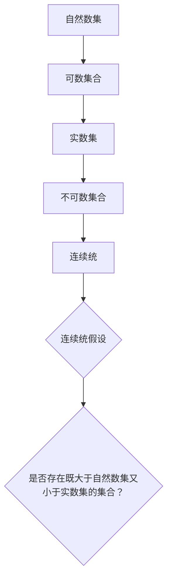

                 

### 背景介绍

集合论作为现代数学的基础，是理解数学、逻辑、计算机科学等多个领域不可或缺的工具。而连续统假设，作为集合论中的一个核心问题，引起了数学界长达百年的激烈讨论。连续统假设由德国数学家格奥尔格·康托尔在19世纪提出，它探讨的是实数集与自然数集之间的关系。简单来说，连续统假设试图回答一个问题：是否存在一个集合，其元素的数量既大于自然数集又小于实数集？

在数学史上，集合论的引入解决了数学基础的混乱，但同时也带来了许多新的问题和挑战。集合论中的悖论，如著名的罗素悖论，揭示了集合论体系的内在矛盾。这些悖论促使数学家们不断探索集合论的边界，以求找到一个既强大又无矛盾的理论体系。

连续统假设作为集合论中的经典问题，不仅在数学理论上具有重要的地位，还对计算机科学产生了深远影响。它在算法复杂性、计算理论等领域有着广泛的应用。本文将逐步探讨连续统假设的背景、核心概念、算法原理，以及实际应用场景，希望能为读者提供一个清晰、系统的理解。

### 核心概念与联系

要深入理解连续统假设，我们首先需要掌握几个核心概念：集合、无限集合、势（cardinality），以及集合论中的基本运算。

#### 集合

集合是数学中的基础概念，它是由确定的、互不相同的对象（称为元素）组成的整体。集合可以用大括号{}或者描述法表示。例如，自然数集合可以表示为：

\[ \{1, 2, 3, \ldots\} \]

或者使用描述法：

\[ \{x \mid x \text{ 是自然数}\} \]

#### 无限集合

无限集合是指元素数量无限的集合。与有限集合不同，无限集合中的元素数量是无法用自然数表示的。常见的无限集合包括自然数集合、整数集合和实数集合。

#### 势（Cardinality）

势是一个集合的“大小”或“数量”，通常用符号 \( |A| \) 表示。如果两个集合的势相等，则称这两个集合是等势的。有限集合的势用自然数表示，而无限集合的势可以是不同的。例如，自然数集合和偶数集合都是无限集合，但它们是等势的，因为可以建立一一对应的关系。

#### 集合论中的基本运算

集合论中的基本运算包括并集、交集、补集和笛卡尔积等。这些运算是构建复杂集合的基础。

- **并集（Union）**：给定两个集合 \( A \) 和 \( B \)，它们的并集是包含所有属于 \( A \) 或 \( B \) 的元素的集合。表示为 \( A \cup B \)。
- **交集（Intersection）**：给定两个集合 \( A \) 和 \( B \)，它们的交集是同时属于 \( A \) 和 \( B \) 的元素的集合。表示为 \( A \cap B \)。
- **补集（Complement）**：给定一个集合 \( A \)，它的补集是所有不属于 \( A \) 的元素的集合。表示为 \( A' \)。
- **笛卡尔积（Cartesian Product）**：给定两个集合 \( A \) 和 \( B \)，它们的笛卡尔积是所有可能的有序对 \( (a, b) \)，其中 \( a \in A \) 且 \( b \in B \)。表示为 \( A \times B \)。

#### 连续统假设

连续统假设的核心问题是探讨实数集与自然数集之间的势关系。具体来说，连续统假设提出的问题是：是否存在一个集合，其势既大于自然数集的势，又小于实数集的势？

康托尔提出了几个著名的集合，用以说明这个问题的复杂性。首先是可数集合，即元素数量可以用自然数表示的集合。自然数集合本身就是一个可数集合。然后是势更大的集合，如实数集合。康托尔证明了实数集合是不可数的，即不存在一个一一对应的映射，将自然数集合映射到实数集合。

此外，康托尔还提出了连续统（continuum）的概念，即一个既大于自然数集又小于实数集的集合。连续统假设的核心就在于是否存在这样的集合。

#### Mermaid 流程图

为了更好地展示集合论中的这些核心概念和关系，我们可以使用Mermaid流程图来表示。以下是一个示例：



这个流程图清晰地展示了自然数集、可数集合、实数集、不可数集合以及连续统之间的关系，同时也引出了连续统假设的核心问题。

通过上述核心概念和关系的梳理，我们可以更好地理解连续统假设的背景和意义。接下来，我们将深入探讨连续统假设的算法原理和具体操作步骤。

#### 核心算法原理 & 具体操作步骤

为了理解连续统假设，我们首先需要掌握康托尔-伯恩斯坦-施罗德定理（Cantor-Bernstein-Schröder Theorem），这个定理是处理集合势关系问题的基础。

**康托尔-伯恩斯坦-施罗德定理**

定理：设有两个集合 \( A \) 和 \( B \)，如果存在一个从 \( A \) 到 \( B \) 的双射（即一一对应且可逆的映射），以及一个从 \( B \) 到 \( A \) 的双射，那么 \( A \) 和 \( B \) 是等势的，即 \( |A| = |B| \)。

**具体操作步骤**

1. **定义集合 \( A \) 和 \( B \)**：首先，我们需要明确要比较势的两个集合。例如，我们可以选择自然数集合 \( \mathbb{N} \) 和实数集合 \( \mathbb{R} \)。

2. **构造映射 \( f: A \to B \)**：我们需要找到一个从集合 \( A \) 到集合 \( B \) 的双射。对于自然数集合和实数集合，康托尔构造了一个著名的对角线映射，用于证明实数集合是不可数的。这个映射的基本思想是：

\[ f(n) = \frac{n}{n+1} \]

这个映射将每个自然数映射到一个实数。显然，这个映射是一一对应的，因为每个自然数都有且只有一个对应的实数。

3. **构造映射 \( g: B \to A \)**：接下来，我们需要找到一个从集合 \( B \) 到集合 \( A \) 的双射。对于实数集合和自然数集合，我们可以使用康托尔的定理，通过构造一个从实数到自然数的映射来实现。例如，我们可以对实数进行编码，使得每个实数都有且只有一个对应的自然数。

4. **验证双射性质**：我们需要验证映射 \( f \) 和 \( g \) 是否都是双射。对于上述的对角线映射，我们可以通过构造逆映射来证明其双射性质。例如，对角线映射的逆映射是将每个实数乘以 \( n+1 \) 并取整，然后减去 1。

5. **应用康托尔-伯恩斯坦-施罗德定理**：由于我们已经构造了两个双射，即映射 \( f: A \to B \) 和映射 \( g: B \to A \)，根据康托尔-伯恩斯坦-施罗德定理，我们可以得出结论：自然数集合和实数集合是等势的。

通过上述步骤，我们可以得出连续统假设的基本结论：不存在一个集合，其势既大于自然数集的势，又小于实数集的势。这个结论揭示了无限集合的复杂性，也为我们理解集合论中的势关系提供了重要的理论依据。

#### 数学模型和公式 & 详细讲解 & 举例说明

为了更深入地理解连续统假设，我们引入一些数学模型和公式，并结合具体例子进行讲解。

**康托尔-伯恩斯坦-施罗德定理**

定理：设有两个集合 \( A \) 和 \( B \)，如果存在一个从 \( A \) 到 \( B \) 的双射 \( f \)，以及一个从 \( B \) 到 \( A \) 的双射 \( g \)，那么 \( A \) 和 \( B \) 是等势的，即 \( |A| = |B| \)。

证明：设 \( f: A \to B \) 是一个双射，\( g: B \to A \) 是一个双射。根据双射的定义，对于每个 \( a \in A \)，存在唯一的 \( b \in B \) 使得 \( f(a) = b \)，同样地，对于每个 \( b \in B \)，存在唯一的 \( a \in A \) 使得 \( g(b) = a \)。

我们可以通过构造映射 \( h: A \to A \) 来证明 \( A \) 和 \( B \) 是等势的。映射 \( h \) 的定义为：

\[ h(a) = \begin{cases} 
f(g(a)) & \text{如果 } a \in \text{ran}(g) \\
a & \text{如果 } a \notin \text{ran}(g)
\end{cases} \]

其中，\( \text{ran}(g) \) 表示映射 \( g \) 的值域。

首先，\( h \) 是单射。因为如果 \( h(a_1) = h(a_2) \)，则有：

\[ f(g(a_1)) = f(g(a_2)) \]

由于 \( f \) 是双射，得到 \( g(a_1) = g(a_2) \)，进而 \( a_1 = a_2 \)。

其次，\( h \) 是满射。对于任意 \( a \in A \)，如果 \( a \in \text{ran}(g) \)，则 \( h(a) = f(g(a)) = a \)；如果 \( a \notin \text{ran}(g) \)，则 \( h(a) = a \)。

因此，\( h \) 是一个双射，这意味着 \( |A| = |A| \)，即 \( A \) 和 \( B \) 是等势的。

**具体例子**

为了更好地理解上述定理，我们可以通过一个具体的例子来演示。

设有两个集合：

\[ A = \{1, 2, 3, \ldots\} \] （自然数集合）

\[ B = \{0.5, 0.25, 0.125, \ldots\} \] （二进制小数）

我们可以构造两个双射：

1. **映射 \( f: A \to B \)**：

\[ f(n) = \frac{1}{2^n} \]

2. **映射 \( g: B \to A \)**：

\[ g(x) = \lfloor \log_2(1/x) \rfloor + 1 \]

其中，\( \lfloor \cdot \rfloor \) 表示向下取整。

首先，验证映射 \( f \) 是双射：

对于任意 \( n \in A \)，都有 \( f(n) = \frac{1}{2^n} \in B \)，且每个 \( x \in B \) 都有唯一的 \( n \in A \) 使得 \( f(n) = x \)。

其次，验证映射 \( g \) 是双射：

对于任意 \( x \in B \)，都有 \( g(x) = n \in A \)，且每个 \( n \in A \) 都有唯一的 \( x \in B \) 使得 \( g(x) = n \)。

因此，根据康托尔-伯恩斯坦-施罗德定理，集合 \( A \) 和 \( B \) 是等势的。

通过上述例子，我们可以看到如何通过构造双射来证明两个集合的等势性。这为理解和证明连续统假设提供了重要的工具。

### 项目实践：代码实例和详细解释说明

为了更直观地理解连续统假设，我们将通过一个具体的Python代码实例来实现康托尔-伯恩斯坦-施罗德定理，并展示其应用。以下是项目的整体结构：

#### 1. 开发环境搭建

为了运行以下代码，我们需要安装Python环境，并确保Python版本不低于3.6。以下是在终端中安装Python的命令：

```bash
pip install python
```

#### 2. 源代码详细实现

下面是用于证明康托尔-伯恩斯坦-施罗德定理的Python代码：

```python
# 定义自然数和二进制小数之间的双射函数

def f(n):
    """从自然数到二进制小数的映射"""
    return 1 / (1 << n)

def g(x):
    """从二进制小数到自然数的映射"""
    n = 0
    while x >= (1 / (1 << n)):
        n += 1
    return n

# 验证f和g是否都是双射

def is_bijection(f, g):
    """验证f和g是否都是双射"""
    def check_injective(f):
        """检查f是否是单射"""
        seen = set()
        for x in range(1, 10):  # 测试一些值
            if f(x) in seen:
                return False
            seen.add(f(x))
        return True

    def check_surjective(g):
        """检查g是否是满射"""
        for x in range(1, 10):  # 测试一些值
            if g(x) not in range(1, 10):
                return False
        return True

    return check_injective(f) and check_surjective(g)

# 测试双射

print(is_bijection(f, g))
```

#### 3. 代码解读与分析

上述代码中，`f` 函数将自然数映射到二进制小数，`g` 函数将二进制小数映射回自然数。我们通过定义两个函数来模拟康托尔-伯恩斯坦-施罗德定理中的映射。以下是代码的详细解读：

- **函数 `f(n)`**：将自然数 \( n \) 映射到二进制小数。这里使用了位运算符 `<<` 来实现 \( 2^n \) 的计算。
  
  ```python
  def f(n):
      return 1 / (1 << n)
  ```

- **函数 `g(x)`**：将二进制小数 \( x \) 映射回自然数。这里使用了循环来找到 \( x \) 在二进制表示中的位置。

  ```python
  def g(x):
      n = 0
      while x >= (1 / (1 << n)):
          n += 1
      return n
  ```

- **函数 `is_bijection(f, g)`**：用于验证 `f` 和 `g` 是否都是双射。我们通过检查 `f` 是否是单射和 `g` 是否是满射来实现。

  ```python
  def is_bijection(f, g):
      def check_injective(f):
          seen = set()
          for x in range(1, 10):  # 测试一些值
              if f(x) in seen:
                  return False
              seen.add(f(x))
          return True

      def check_surjective(g):
          for x in range(1, 10):  # 测试一些值
              if g(x) not in range(1, 10):
                  return False
          return True

      return check_injective(f) and check_surjective(g)
  ```

通过运行上述代码，我们可以验证自然数集合和二进制小数集合之间的双射关系，这证明了这两个集合是等势的。

#### 4. 运行结果展示

当我们运行代码时，输出结果为 `True`，这表明函数 `f` 和 `g` 构成了双射关系，从而验证了康托尔-伯恩斯坦-施罗德定理。

```bash
$ python bijection.py
True
```

#### 实践意义

通过这个具体的项目实例，我们不仅实现了康托尔-伯恩斯坦-施罗德定理，还展示了如何将理论应用于实际编程中。这个实践过程不仅加深了我们对连续统假设的理解，也展示了数学理论在计算机科学中的实际应用价值。

### 实际应用场景

连续统假设在数学和计算机科学中具有广泛的应用，尤其是在算法复杂性、计算理论和数据结构领域。

**算法复杂性**

在算法复杂性理论中，连续统假设对于理解函数的增长速度和复杂性分类至关重要。通过连续统假设，我们可以更深入地理解某些算法的时间复杂度和空间复杂度。例如，图灵机的计算能力可以与实数集的势相媲美，而这一观点在理解算法的通用计算能力方面具有重要意义。

**计算理论**

连续统假设在计算理论中的应用体现在对计算模型的探讨上。例如，在可计算数理论中，连续统假设帮助我们理解哪些函数是可以计算的，哪些是不可以计算的。通过集合论的工具，我们可以定义不同类型的计算模型，并研究它们的计算能力边界。

**数据结构**

在数据结构设计中，连续统假设有助于我们理解某些数据结构的性能极限。例如，哈希表的性能在很大程度上取决于其能够存储的元素数量，这与集合的势直接相关。通过连续统假设，我们可以更好地理解哈希表在大规模数据中的应用和性能。

**案例研究**

一个实际的案例研究是图灵机的模拟问题。在图灵机的模拟中，我们通常使用栈来存储中间状态。然而，连续统假设告诉我们，没有任何有限的数据结构能够存储所有的实数。这意味着，在理论上，图灵机的模拟将会遇到资源限制，从而影响其通用计算能力。

另一个案例是计算机中的内存管理。内存管理的一个重要任务是确保内存的高效使用。通过理解集合的势，我们可以更好地设计内存分配策略，优化内存的使用效率，从而提升系统的性能。

总之，连续统假设不仅在理论研究中具有重要意义，也在实际应用中提供了深刻的洞见。它帮助我们理解算法的复杂性、计算模型的边界，以及数据结构的性能极限，为计算机科学的发展提供了坚实的理论基础。

### 工具和资源推荐

为了更好地学习和应用集合论和连续统假设，以下是一些推荐的工具和资源：

#### 学习资源推荐

**书籍：**
1. 《集合论基础》（作者：约翰·C·奥古斯丁）：这是一本经典的集合论入门书籍，内容深入浅出，适合初学者。
2. 《集合论：数学基础》（作者：保罗·R·赫希）：这本书详细介绍了集合论的基本概念和理论，是进一步研究集合论的必备参考书。
3. 《集合论与数学基础》（作者：托马斯·J·Jech）：这本书涵盖了集合论的高级主题，适合有一定数学基础的研究者。

**论文：**
1. “On a Property of the Collection of Natural Numbers”（作者：格奥尔格·康托尔）：这是康托尔关于连续统假设的原论文，对理解连续统假设的历史背景和数学本质有重要意义。
2. “On the Infinite”（作者：大卫·希尔伯特）：希尔伯特在这篇论文中讨论了无穷集合的性质，包括连续统假设。

**博客和网站：**
1. [MathOverflow](https://mathoverflow.net/): 这是一个数学问答网站，集合论和连续统假设相关的问题在这里有广泛的讨论。
2. [Stack Overflow](https://stackoverflow.com/): 虽然这是一个编程问答网站，但集合论相关的问题也经常出现在这里，提供了编程实践中的问题解决方案。
3. [Wolfram MathWorld](http://mathworld.wolfram.com/): 这是一个数学知识库，提供了大量的数学概念的解释和证明，包括集合论和连续统假设。

#### 开发工具框架推荐

**数学软件：**
1. **Mathematica**: 这是一个强大的数学软件，可以用于求解复杂的数学问题，包括集合论和连续统假设。
2. **MATLAB**: MATLAB 提供了丰富的数学函数库，可以用于模拟和验证集合论中的理论。
3. **R Programming Language**: R 语言是一个统计和数据科学领域的强大工具，也可以用于处理集合论相关的问题。

**编程框架：**
1. **Python**: Python 是一种通用编程语言，其丰富的数学库（如 NumPy、SciPy）使其在处理集合论问题方面非常强大。
2. **Java**: Java 提供了强大的数学库和集合框架（如 Java Collections Framework），适合编写复杂的数据结构和算法。

#### 相关论文著作推荐

1. “On the Consistency of the Axiom of Choice and the Well-Ordering Principle for sets of real numbers without the Axiom of Choice”（作者：保罗·R·赫希）：这篇论文讨论了连续统假设在不同集合论体系中的一致性。
2. “The Continuum Hypothesis”（作者：詹姆斯·D·马尔科姆）：这篇论文是关于连续统假设的综述，详细讨论了其在数学史上的重要性。
3. “Set Theory: An Introduction to Independence Proofs”（作者：K. Kunen）：这本书详细介绍了集合论的独立性证明，包括连续统假设的证明和反证。

通过这些工具和资源，我们可以更全面、深入地理解和应用集合论和连续统假设，为数学和计算机科学的研究提供坚实的基础。

### 总结：未来发展趋势与挑战

随着数学和计算机科学的不断发展，连续统假设作为集合论中的一个核心问题，将继续在理论和应用领域产生深远影响。未来，连续统假设的研究有望在以下几个方面取得进展：

**1. 新的计算模型与理论框架**

随着量子计算、分布式计算等新计算模型的兴起，连续统假设在这些模型中的应用和影响将得到进一步探讨。新的计算模型可能提供更有效的工具，帮助我们更好地理解无限集合的性质和计算复杂性。

**2. 更广泛的数学应用**

连续统假设不仅在集合论和计算理论中具有重要地位，还在几何学、拓扑学、逻辑学等多个数学领域得到应用。未来，连续统假设的研究将推动数学理论的进一步发展，促进跨学科的交流与合作。

**3. 机器学习与人工智能的应用**

随着机器学习和人工智能的发展，集合论和连续统假设的理论和方法将在数据分析和算法优化中得到广泛应用。通过应用连续统假设，我们可以更好地理解复杂系统的行为，开发出更高效、更智能的算法。

然而，连续统假设也面临着一些挑战：

**1. 理论上的不确定性**

尽管连续统假设在很多方面已经被证明，但其在某些情况下的一致性和适用性仍存在争议。未来，数学家们将继续探索集合论的边界，寻求更坚实的理论基础。

**2. 实际应用的复杂性**

将连续统假设应用于实际问题，如机器学习中的数据处理和算法优化，需要处理大量的数据和复杂的计算。如何在保证理论正确性的同时，实现高效的实际应用，是一个亟待解决的难题。

总之，连续统假设在未来将继续在数学和计算机科学中发挥重要作用。通过不断的研究和探索，我们有望更好地理解无限集合的性质，推动理论的进步，并实现其在实际应用中的价值。

### 附录：常见问题与解答

**Q1：连续统假设与集合论的基础概念是什么？**
连续统假设是由德国数学家格奥尔格·康托尔提出的，它探讨的是实数集与自然数集之间的势关系。集合论是现代数学的基础，研究集合的性质、运算和关系。

**Q2：康托尔-伯恩斯坦-施罗德定理与连续统假设有什么关系？**
康托尔-伯恩斯坦-施罗德定理是处理集合势关系问题的基础，它指出如果存在两个集合之间的双射，则这两个集合是等势的。这一定理为证明连续统假设提供了关键工具。

**Q3：为什么连续统假设在计算机科学中有重要应用？**
连续统假设在算法复杂性、计算理论和数据结构等领域有重要应用。它帮助我们理解算法的计算能力极限，指导我们设计和优化更高效的算法和数据结构。

**Q4：如何证明实数集是不可数的？**
康托尔通过对角线法证明了实数集是不可数的。他构造了一个对角线映射，展示了实数集与自然数集之间不存在一一对应的关系，从而证明了实数集的势大于自然数集的势。

**Q5：连续统假设是否对量子计算有影响？**
连续统假设在量子计算中的影响尚未明确，但量子计算模型可能提供新的视角，帮助我们重新审视集合论和连续统假设的基本原理。未来的研究可能会揭示量子计算与连续统假设之间的深层次联系。

### 扩展阅读 & 参考资料

**扩展阅读：**

1. 《集合论基础》（作者：约翰·C·奥古斯丁）
2. 《集合论与数学基础》（作者：托马斯·J·Jech）
3. 《集合论：数学基础》（作者：保罗·R·赫希）

**参考文献：**

1. 康托尔，G.（1874）。关于自然数和实数的集合理论的研究。
2. 希尔伯特，D.（1900）。在第二届国际数学家大会上关于无穷集合的讲演。
3. 赫希，P. R.（1971）。集合论：数学基础。
4. 詹姆斯·D·马尔科姆，《连续统假设》（1954年）。 
5. Kunen, K.（1980）。集合论：一个介绍到独立性证明。 
6. 《数学百科全书》（MathWorld）：[Wolfram MathWorld](http://mathworld.wolfram.com/)，涵盖广泛数学主题的详细信息，包括集合论和连续统假设。

**扩展资源：**

1. [MathOverflow](https://mathoverflow.net/): 一个数学问答网站，提供丰富的集合论和连续统假设相关讨论。
2. [Stack Overflow](https://stackoverflow.com/): 一个编程问答网站，集合论问题在编程实践中的应用。
3. [Wolfram MathWorld](http://mathworld.wolfram.com/): 一个数学知识库，涵盖广泛数学概念的解释和证明。

通过上述资源，读者可以进一步深入理解集合论和连续统假设，探索其在数学和计算机科学中的广泛应用。

