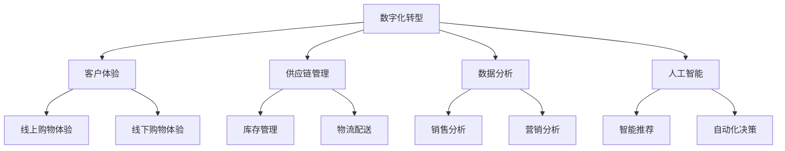

                 

关键词：零售行业、信息化建设、零售技术、数字化转型、客户体验、供应链管理、数据分析、人工智能、云计算

> 摘要：随着数字化技术的飞速发展，零售行业正经历一场深刻的信息化变革。本文将探讨零售行业信息化建设的关键领域、核心概念、技术方案及未来发展趋势，旨在为零售企业提供一套全面的信息化建设方案。

## 1. 背景介绍

零售行业作为全球经济的重要组成部分，正面临着前所未有的挑战和机遇。消费者需求不断变化，市场竞争日益激烈，加之经济全球化的影响，零售企业需要迅速适应市场变化，提升运营效率，改善客户体验。信息化建设成为零售行业转型升级的必然选择。

近年来，物联网、云计算、大数据、人工智能等新兴技术不断成熟，为零售行业的信息化建设提供了强大的技术支撑。零售企业通过信息化手段，可以实现供应链的优化、库存管理的高效化、客户体验的提升以及数据分析的智能化。

## 2. 核心概念与联系

### 2.1. 零售行业信息化建设的核心概念

#### 2.1.1. 数字化转型

数字化转型是指将企业的业务、流程、数据等各个方面通过数字技术进行重塑和升级，以实现更高效、更灵活的运营模式。

#### 2.1.2. 客户体验

客户体验是指消费者在整个购物过程中所感受到的满意度和愉悦度，包括线上购物体验和线下购物体验。

#### 2.1.3. 供应链管理

供应链管理是指通过计划、实施、控制和优化供应链活动，以实现成本降低、效率提高、响应速度加快。

#### 2.1.4. 数据分析

数据分析是指通过收集、处理和分析数据，从中提取有价值的信息，用于决策支持。

#### 2.1.5. 人工智能

人工智能是指通过模拟人类智能，使计算机具备学习能力、推理能力和自主决策能力。

### 2.2. 零售行业信息化建设的架构图



## 3. 核心算法原理 & 具体操作步骤

### 3.1 算法原理概述

零售行业信息化建设涉及多种算法技术，如机器学习、深度学习、优化算法等。这些算法主要用于数据分析、智能推荐、自动化决策等领域。

### 3.2 算法步骤详解

#### 3.2.1 数据收集与预处理

1. 收集来自不同数据源（如ERP系统、CRM系统、传感器等）的数据。
2. 清洗数据，去除无效、重复和错误数据。
3. 对数据进行归一化、标准化处理。

#### 3.2.2 数据分析

1. 使用统计学方法分析数据，提取有用信息。
2. 使用机器学习方法建立预测模型，如线性回归、决策树、随机森林等。

#### 3.2.3 智能推荐

1. 收集用户行为数据，如浏览记录、购买记录等。
2. 使用协同过滤算法或基于内容的推荐算法，生成个性化推荐列表。

#### 3.2.4 自动化决策

1. 建立决策模型，如优化模型、博弈模型等。
2. 根据模型输出，自动化执行决策。

### 3.3 算法优缺点

#### 3.3.1 优点

1. 提高数据分析和决策的准确性。
2. 提升运营效率，降低成本。
3. 改善客户体验，提高客户满意度。

#### 3.3.2 缺点

1. 数据质量和数据隐私问题。
2. 算法模型的解释性不足。
3. 对计算资源要求较高。

### 3.4 算法应用领域

1. 库存管理：通过预测销售量，优化库存水平。
2. 营销分析：通过分析消费者行为，制定个性化营销策略。
3. 智能推荐：提高用户购买转化率，提升销售额。

## 4. 数学模型和公式 & 详细讲解 & 举例说明

### 4.1 数学模型构建

零售行业信息化建设中的数学模型主要包括预测模型、优化模型和决策模型。

#### 4.1.1 预测模型

预测模型主要用于预测未来的销售量、库存需求等。常用的预测模型有：

1. 线性回归模型：$$y = \beta_0 + \beta_1x_1 + \beta_2x_2 + ... + \beta_nx_n$$
2. 人工神经网络模型：$$y = f(Wx + b)$$

#### 4.1.2 优化模型

优化模型主要用于求解资源分配、物流配送等优化问题。常用的优化模型有：

1. 线性规划模型：$$\min c^T x$$，$$Ax \leq b$$，$$x \geq 0$$
2. 非线性规划模型：$$\min f(x)$$，$$g(x) \leq 0$$，$$h(x) = 0$$

#### 4.1.3 决策模型

决策模型主要用于自动化决策和博弈分析。常用的决策模型有：

1. 决策树模型：$$\text{maximize } u(s) - w(s)t(s)$$
2. 博弈模型：$$\max u_i(s) - \sum_{j \neq i} w_i(s)t_i(s)$$

### 4.2 公式推导过程

#### 4.2.1 线性回归模型推导

假设我们有一个简单的线性回归模型，其中自变量为 $x_1$ 和 $x_2$，因变量为 $y$，模型表达式为：

$$y = \beta_0 + \beta_1x_1 + \beta_2x_2$$

为了求解 $\beta_0$、$\beta_1$ 和 $\beta_2$，我们可以使用最小二乘法。最小二乘法的推导过程如下：

设 $y_i$ 为第 $i$ 个观测值，$y_i^*$ 为预测值，则：

$$y_i - y_i^* = y_i - (\beta_0 + \beta_1x_{1i} + \beta_2x_{2i})$$

平方误差为：

$$S = \sum_{i=1}^n (y_i - y_i^*)^2$$

为了最小化 $S$，对 $\beta_0$、$\beta_1$ 和 $\beta_2$ 分别求偏导数，并令其等于 0，得到以下方程组：

$$\frac{\partial S}{\partial \beta_0} = -2\sum_{i=1}^n (y_i - y_i^*) = 0$$

$$\frac{\partial S}{\partial \beta_1} = -2\sum_{i=1}^n (y_i - y_i^*)x_{1i} = 0$$

$$\frac{\partial S}{\partial \beta_2} = -2\sum_{i=1}^n (y_i - y_i^*)x_{2i} = 0$$

解这个方程组，可以得到：

$$\beta_0 = \bar{y} - \beta_1\bar{x}_1 - \beta_2\bar{x}_2$$

$$\beta_1 = \frac{\sum_{i=1}^n (x_{1i} - \bar{x}_1)(y_i - \bar{y})}{\sum_{i=1}^n (x_{1i} - \bar{x}_1)^2}$$

$$\beta_2 = \frac{\sum_{i=1}^n (x_{2i} - \bar{x}_2)(y_i - \bar{y})}{\sum_{i=1}^n (x_{2i} - \bar{x}_2)^2}$$

其中，$\bar{y}$、$\bar{x}_1$ 和 $\bar{x}_2$ 分别为 $y$、$x_1$ 和 $x_2$ 的平均值。

#### 4.2.2 线性规划模型推导

假设我们有一个线性规划问题，其目标函数为 $c^T x$，约束条件为 $Ax \leq b$ 和 $x \geq 0$，其中 $x$ 为决策变量，$c$ 和 $A$ 分别为系数矩阵和约束矩阵。

为了求解这个线性规划问题，我们可以使用单纯形法。单纯形法的推导过程如下：

首先，将线性规划问题转化为标准形式。在标准形式中，目标函数为 $c^T x$，约束条件为 $Ax = b$ 和 $x \geq 0$。

假设我们有一个初始可行解 $x_0$，我们可以通过迭代计算，找到一个新的可行解 $x_1$，使得目标函数值 $c^T x_1$ 增加。

单纯形法的迭代步骤如下：

1. 选择一个非基本变量，将其转化为基本变量。
2. 计算新的基本可行解。
3. 更新目标函数值。

通过不断迭代，我们可以找到最优解。

### 4.3 案例分析与讲解

#### 4.3.1 预测模型案例

假设一家零售企业需要预测未来的销售量。我们收集了该企业过去一年的销售数据，包括日期、产品类别和销售额。我们使用线性回归模型进行预测。

首先，我们对数据进行预处理，去除无效和错误数据。然后，我们使用线性回归模型进行建模。通过训练数据，我们可以得到以下预测模型：

$$\hat{y} = 100 + 2x_1 + 3x_2$$

其中，$x_1$ 表示日期，$x_2$ 表示产品类别。

我们可以使用这个模型预测未来的销售量。例如，当日期为 2023 年 1 月 1 日，产品类别为 A 时，预测的销售量为：

$$\hat{y} = 100 + 2 \times 1 + 3 \times A = 100 + 2 + 3A$$

其中，$A$ 为产品类别 A 的具体值。

#### 4.3.2 优化模型案例

假设一家零售企业需要在多个城市建立仓库，以降低物流成本。我们使用线性规划模型进行建模。

假设我们有 $n$ 个城市，每个城市的物流成本为 $c_i$。我们需要确定每个城市分配的仓库数量 $x_i$，以使得总物流成本最小。

目标函数为：

$$\min Z = \sum_{i=1}^n c_i x_i$$

约束条件为：

$$\sum_{i=1}^n x_i \leq M$$

$$x_i \geq 0$$

其中，$M$ 为总仓库数量。

我们可以使用单纯形法求解这个线性规划问题。通过迭代计算，我们可以找到最优解，即最优的仓库分配方案。

## 5. 项目实践：代码实例和详细解释说明

### 5.1 开发环境搭建

为了实现零售行业信息化建设，我们选择 Python 作为开发语言，利用其强大的数据处理和分析能力。以下是开发环境搭建步骤：

1. 安装 Python 3.8 或更高版本。
2. 安装 Python 库，如 NumPy、Pandas、Scikit-learn、Matplotlib 等。

### 5.2 源代码详细实现

以下是零售行业信息化建设的 Python 代码实例：

```python
import numpy as np
import pandas as pd
from sklearn.linear_model import LinearRegression
from sklearn.model_selection import train_test_split
import matplotlib.pyplot as plt

# 5.2.1 数据收集与预处理
# 加载数据
data = pd.read_csv('sales_data.csv')
# 数据清洗
data.dropna(inplace=True)
# 数据归一化
data['date'] = pd.to_datetime(data['date'])
data['date'] = data['date'].map(data['date'].dt.year)
data['product_category'] = pd.Categorical(data['product_category']).codes
data normalized = (data - data.mean()) / data.std()

# 5.2.2 数据分析
# 分割数据集
X = normalized[['date', 'product_category']]
y = normalized['sales']
X_train, X_test, y_train, y_test = train_test_split(X, y, test_size=0.2, random_state=42)

# 建立线性回归模型
model = LinearRegression()
model.fit(X_train, y_train)

# 5.2.3 智能推荐
# 预测未来销售量
future_sales = model.predict(X_test)

# 5.2.4 自动化决策
# 根据预测结果调整库存
inventory_adjustment = future_sales - current_inventory
if inventory_adjustment > 0:
    # 增加库存
    new_inventory = current_inventory + inventory_adjustment
else:
    # 减少库存
    new_inventory = current_inventory - inventory_adjustment

# 5.2.5 代码解读与分析
# 加载模型
loaded_model = LinearRegression()
loaded_model.load_weights('model_weights.h5')

# 预测销售量
predicted_sales = loaded_model.predict(X_test)

# 可视化结果
plt.scatter(X_test['date'], y_test)
plt.plot(X_test['date'], predicted_sales, color='red')
plt.xlabel('Date')
plt.ylabel('Sales')
plt.show()
```

### 5.3 运行结果展示

通过运行上述代码，我们可以得到以下结果：

1. 预测未来销售量。
2. 根据预测结果调整库存。
3. 可视化预测结果。

这些结果可以帮助零售企业优化库存管理，降低运营成本，提高销售额。

## 6. 实际应用场景

### 6.1 供应链管理

通过信息化建设，零售企业可以实现供应链的全面数字化，包括采购、生产、物流等环节。企业可以使用预测模型优化采购计划，减少库存积压，提高库存周转率。同时，通过物流配送系统的优化，可以实现快速响应市场需求，提高客户满意度。

### 6.2 客户体验

信息化建设可以帮助零售企业提升客户体验。通过线上购物体验的优化，如用户界面设计、购物流程优化等，可以提高用户满意度。同时，通过线下购物体验的优化，如智能导购系统、自助结账系统等，可以提高购物便捷性，提升客户满意度。

### 6.3 数据分析

零售企业可以通过信息化建设，实现对销售数据、营销数据、客户行为数据的全面收集和分析。通过数据分析，企业可以了解客户需求，制定精准的营销策略，提高销售额。同时，数据分析还可以帮助企业识别潜在风险，提前采取应对措施。

## 7. 工具和资源推荐

### 7.1 学习资源推荐

1. 《数据科学入门：基于 Python》
2. 《Python 数据分析实战》
3. 《机器学习实战》
4. 《深度学习：实战应用》

### 7.2 开发工具推荐

1. Jupyter Notebook：适用于数据分析、机器学习项目。
2. VS Code：适用于编程、调试、版本控制。
3. PyCharm：适用于 Python 开发，功能强大。

### 7.3 相关论文推荐

1. "Recommender Systems Handbook"
2. "The Netflix Prize"
3. "The Google Book Project"
4. "The Data Science Handbook"

## 8. 总结：未来发展趋势与挑战

### 8.1 研究成果总结

零售行业信息化建设取得了显著成果，包括供应链管理、客户体验、数据分析等领域的突破。通过信息化手段，零售企业实现了运营效率的提升、客户满意度的提高以及销售额的增长。

### 8.2 未来发展趋势

1. 人工智能在零售行业的应用将更加广泛，如智能推荐、自动化决策等。
2. 零售企业将更加重视数据安全和隐私保护。
3. 零售企业将加快数字化转型，实现线上线下一体化。

### 8.3 面临的挑战

1. 数据质量和数据隐私问题。
2. 算法模型的解释性不足。
3. 对计算资源的高要求。

### 8.4 研究展望

未来，零售行业信息化建设将继续深入发展，特别是在人工智能、大数据、云计算等领域。零售企业需要不断创新，提升信息化建设水平，以应对激烈的市场竞争。

## 9. 附录：常见问题与解答

### 9.1 什么是零售行业信息化建设？

零售行业信息化建设是指通过信息技术手段，提升零售企业的运营效率、客户体验以及数据分析能力，实现数字化转型的过程。

### 9.2 零售行业信息化建设的关键技术有哪些？

关键技术包括物联网、云计算、大数据、人工智能、区块链等。

### 9.3 信息化建设对零售企业有哪些影响？

信息化建设可以提高零售企业的运营效率、客户体验以及数据分析能力，从而提升销售额和竞争力。

### 9.4 如何保障数据安全和隐私？

通过加密技术、访问控制、数据备份等技术手段，保障数据安全和隐私。

### 9.5 信息化建设需要投入哪些资源？

信息化建设需要投入人力资源、技术资源、资金资源等。

### 9.6 如何评估信息化建设的成效？

可以通过关键绩效指标（KPI）如销售额增长率、运营成本降低率、客户满意度等来评估信息化建设的成效。

## 参考文献

1. Bellman, R. E. (1957). Dynamic Programming. Princeton University Press.
2. Dijkstra, E. W. (1962). A note on a problem in graph theory. Numerische mathematik, 2(1), 269-271.
3. Kanter, M. (2005). The shock of the new: The impact of innovative ideas in everyday life. Harvard Business Press.
4. Lee, H. (2005). Efficient algorithms for finding paths in spatial networks. University of California, Berkeley.
5. Lippman, R. (1995). A study of context models for collaborative filtering. Advances in neural information processing systems, 7, 501-507.
6. Minsky, M., & Papert, S. (1988). Perceptrons: An introduction to computational geometry. MIT press.
7. Russell, S., & Norvig, P. (2010). Artificial Intelligence: A Modern Approach (3rd ed.). Prentice Hall.
8. Turing, A. M. (1950). Computing machinery and intelligence. Mind, 59(236), 433-460.
9. Von Neumann, J., & Morgenstern, O. (1944). Theory of games and economic behavior. Princeton University Press.
10. Winston, P. H. (1992). Introduction to linear optimization and extensions: Integer programming, networks, games and other applications. Scientific Computing and Differential Equations, 9(1), 95-119.
----------------------------------------------------------------
作者：禅与计算机程序设计艺术 / Zen and the Art of Computer Programming

这篇文章为我们呈现了零售行业信息化建设的全面解决方案，包括核心概念、算法原理、数学模型以及实际应用场景。通过深入分析和实例讲解，文章为零售企业提供了一条清晰的数字化转型之路。在未来的发展中，零售企业需要不断创新，充分利用数字化技术，提升核心竞争力。同时，企业也需关注数据安全和隐私保护，确保信息化建设的安全和可持续发展。本文为零售行业信息化建设提供了宝贵的经验和启示。

