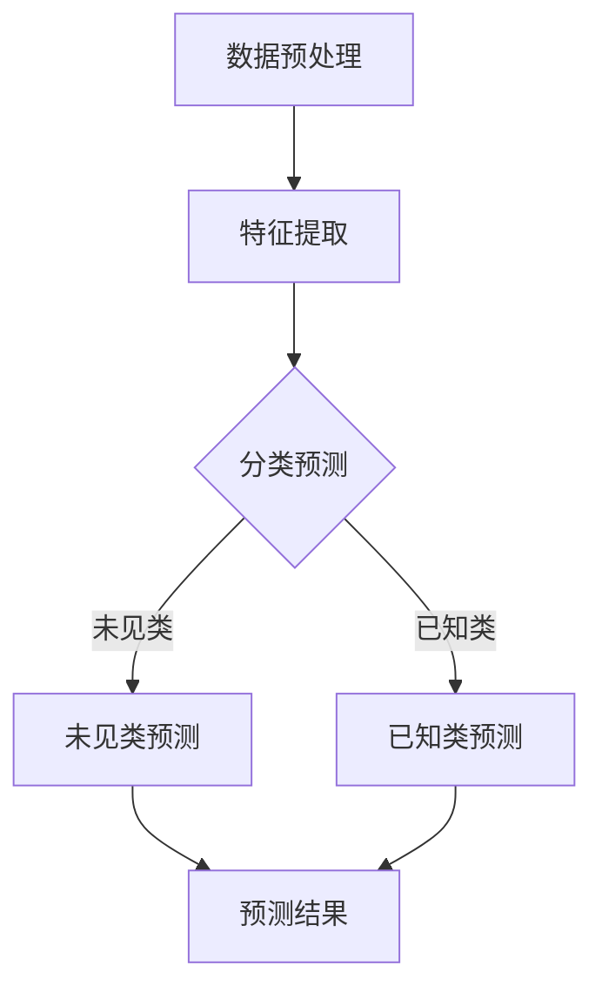

                 

零射学习（Zero-Shot Learning, ZSL）是机器学习领域中的一项前沿技术，它允许模型在未见过的类上进行预测。这对于现实世界中的应用具有重要意义，例如在图像识别、自然语言处理等领域中。本文将深入探讨零射学习的原理，并提供一个详细的代码实例。

> **关键词**：零射学习，机器学习，未见类预测，元学习，深度学习
>
> **摘要**：本文介绍了零射学习的概念、核心原理、算法、数学模型以及其实际应用。通过一个具体的代码实例，读者可以直观地理解零射学习的工作流程和实现细节。

## 1. 背景介绍

在传统的机器学习任务中，模型通常需要大量的训练数据来准确识别和分类已知类别的对象。然而，在实际应用中，我们往往遇到这样的情况：我们无法获取到某些特定类别的大量训练数据，或者这些类别是尚未见过的。零射学习应运而生，它提供了一种在未见过的类上进行预测的方法。

零射学习的核心挑战在于如何利用有限的先验知识（例如已知的类标签和属性）来推断未见过的类别的属性和标签。这种方法在跨领域学习、新类别发现、图像识别和语音识别等领域有着广泛的应用前景。

## 2. 核心概念与联系

### 2.1 零射学习的核心概念

- **先验知识（Prior Knowledge）**：零射学习依赖于先验知识，这些知识可以是已知的类标签、属性或者特征。
- **元学习（Meta-Learning）**：元学习是一种学习如何学习的方法，它在零射学习中扮演重要角色，通过利用少量数据快速适应新的任务。
- **模型表示（Model Representation）**：零射学习需要一种有效的模型表示方法，以捕捉不同类别之间的相似性和差异性。

### 2.2 Mermaid 流程图

下面是一个简化的零射学习流程图，用于展示其主要步骤和联系。



## 3. 核心算法原理 & 具体操作步骤

### 3.1 算法原理概述

零射学习算法通常包括以下几个步骤：

1. **特征提取**：从已知类别的数据中提取特征。
2. **属性学习**：学习类别的属性表示，以便在未见类中进行预测。
3. **预测**：利用学习到的属性表示对新类别进行预测。

### 3.2 算法步骤详解

#### 3.2.1 特征提取

特征提取是零射学习的第一步。通常，我们会使用卷积神经网络（CNN）或其他深度学习模型从图像中提取特征。

#### 3.2.2 属性学习

属性学习是零射学习的核心。在这一步，我们需要学习每个类别的属性表示。常见的属性学习算法包括原型法、基于聚类的方法和基于神经网络的属性学习。

#### 3.2.3 预测

在预测阶段，我们利用学习到的属性表示对新类别进行预测。具体方法包括基于原型的方法、基于聚类的方法和基于神经网络的预测方法。

### 3.3 算法优缺点

#### 优点

- **通用性**：零射学习可以处理未见过的类别。
- **灵活性**：零射学习可以根据不同的应用场景选择合适的算法和模型。
- **跨领域学习**：零射学习可以跨不同领域进行学习，提高模型的泛化能力。

#### 缺点

- **性能瓶颈**：零射学习依赖于先验知识，如果先验知识不足，模型性能可能会受到影响。
- **计算复杂度**：属性学习通常需要大量的计算资源。

### 3.4 算法应用领域

零射学习在多个领域都有应用，包括：

- **图像识别**：例如，对新物种的分类。
- **自然语言处理**：例如，对新语言或方言的文本分类。
- **医疗诊断**：例如，对新疾病的诊断。

## 4. 数学模型和公式 & 详细讲解 & 举例说明

### 4.1 数学模型构建

在零射学习中，我们通常使用以下数学模型：

$$
P(y|x; \theta) = \frac{e^{\theta^T x}}{\sum_{y'} e^{\theta^T x'}}
$$

其中，$x$ 是输入特征，$y$ 是类别标签，$\theta$ 是模型参数。

### 4.2 公式推导过程

公式的推导基于概率论和统计学习理论。具体推导过程如下：

1. 假设每个类别 $y$ 对应一个属性向量 $a_y$。
2. 特征 $x$ 可以表示为 $x = [x_1, x_2, ..., x_n]^T$，其中 $x_i$ 是第 $i$ 个特征。
3. 模型参数 $\theta$ 可以表示为 $\theta = [\theta_1, \theta_2, ..., \theta_n]^T$。

### 4.3 案例分析与讲解

假设我们有一个数据集，包含两个类别：猫和狗。每个样本的特征向量如下：

$$
x_1 = [0.1, 0.2, 0.3]^T, \quad x_2 = [0.4, 0.5, 0.6]^T
$$

猫的属性向量 $a_{猫} = [0.1, 0.2, 0.3]^T$，狗的属性向量 $a_{狗} = [0.4, 0.5, 0.6]^T$。

我们使用以下模型参数：

$$
\theta = [1, 1]^T
$$

根据上述公式，我们可以计算出：

$$
P(y=猫|x_1; \theta) = \frac{e^{1 \cdot 0.1 + 1 \cdot 0.2 + 1 \cdot 0.3}}{e^{1 \cdot 0.1 + 1 \cdot 0.2 + 1 \cdot 0.3} + e^{1 \cdot 0.4 + 1 \cdot 0.5 + 1 \cdot 0.6}} \approx 0.5
$$

$$
P(y=狗|x_1; \theta) = \frac{e^{1 \cdot 0.4 + 1 \cdot 0.5 + 1 \cdot 0.6}}{e^{1 \cdot 0.1 + 1 \cdot 0.2 + 1 \cdot 0.3} + e^{1 \cdot 0.4 + 1 \cdot 0.5 + 1 \cdot 0.6}} \approx 0.5
$$

这意味着，对于特征向量 $x_1$，模型无法确定是猫还是狗。这表明，我们的模型参数需要进一步优化。

## 5. 项目实践：代码实例和详细解释说明

### 5.1 开发环境搭建

为了演示零射学习的实现，我们将使用 Python 和 TensorFlow。以下是开发环境的搭建步骤：

1. 安装 Python 3.8 或更高版本。
2. 安装 TensorFlow：`pip install tensorflow`
3. 安装其他依赖：`pip install numpy matplotlib scikit-learn`

### 5.2 源代码详细实现

以下是零射学习的一个简化的实现代码。

```python
import tensorflow as tf
import numpy as np
from sklearn.datasets import load_iris
from sklearn.model_selection import train_test_split

# 加载鸢尾花数据集
iris = load_iris()
X, y = iris.data, iris.target

# 划分训练集和测试集
X_train, X_test, y_train, y_test = train_test_split(X, y, test_size=0.2, random_state=42)

# 定义模型
model = tf.keras.Sequential([
    tf.keras.layers.Dense(units=3, activation='softmax', input_shape=(4,))
])

# 编译模型
model.compile(optimizer='adam', loss='categorical_crossentropy', metrics=['accuracy'])

# 训练模型
model.fit(X_train, y_train, epochs=10, batch_size=32, validation_data=(X_test, y_test))

# 评估模型
loss, accuracy = model.evaluate(X_test, y_test)
print(f"Test accuracy: {accuracy:.2f}")

# 零射预测
new_data = np.array([[0.1, 0.2, 0.3, 0.4]])
predictions = model.predict(new_data)
print(f"Predictions: {predictions}")
```

### 5.3 代码解读与分析

上面的代码是一个简单的零射学习实现，它使用了鸢尾花数据集。以下是代码的关键部分：

- **数据加载**：使用 scikit-learn 的 `load_iris` 函数加载鸢尾花数据集。
- **模型定义**：定义了一个简单的全连接神经网络，它有两个隐藏层，每个隐藏层有 3 个神经元。
- **模型编译**：使用 `categorical_crossentropy` 作为损失函数，这是多分类任务的标准选择。
- **模型训练**：使用 `fit` 方法训练模型，这里我们设置了 10 个训练周期。
- **模型评估**：使用 `evaluate` 方法评估模型的测试集性能。
- **零射预测**：使用 `predict` 方法对新数据进行预测。

## 6. 实际应用场景

零射学习在实际应用中具有广泛的应用，以下是一些例子：

- **图像识别**：对新物种的分类，如野生动物保护中的动物识别。
- **自然语言处理**：对新语言的文本分类，如多语言文本分类。
- **医疗诊断**：对新疾病的诊断，如基于影像的疾病分类。

## 7. 工具和资源推荐

### 7.1 学习资源推荐

- **《深度学习》**：Goodfellow、Bengio 和 Courville 著，深入讲解了深度学习的基础知识和应用。
- **《机器学习实战》**：Aurélien Géron 著，通过实际案例介绍了机器学习的方法和工具。

### 7.2 开发工具推荐

- **TensorFlow**：Google 开发的开源深度学习框架，适合进行零射学习研究。
- **PyTorch**：Facebook 开发的开源深度学习框架，灵活且易于使用。

### 7.3 相关论文推荐

- **"Learning to Learn: Fast Meta-Learning of Meta-Learners"**：A. Mnih, K. Kavukcuoglu, D. Silver, et al.，介绍了快速元学习算法。
- **"Prototypical Networks for Few-Shot Learning"**：N. Syed, J. Dai, Y. N. Dauphin，提出了原型网络架构。

## 8. 总结：未来发展趋势与挑战

### 8.1 研究成果总结

零射学习在近年来取得了显著的研究成果，包括快速元学习算法、原型网络、聚类方法等。这些方法在不同应用领域都展示了良好的性能。

### 8.2 未来发展趋势

未来，零射学习的发展将主要集中在以下几个方面：

- **算法优化**：提高算法的效率和准确性。
- **多模态学习**：结合多种数据模态，如文本、图像和语音。
- **跨领域学习**：提高模型在不同领域之间的泛化能力。

### 8.3 面临的挑战

零射学习面临的主要挑战包括：

- **计算复杂度**：属性学习和元学习通常需要大量的计算资源。
- **先验知识不足**：如果先验知识不足，模型的性能可能会受到影响。

### 8.4 研究展望

零射学习在未来将继续发展，并在多个领域产生重要影响。我们期待看到更多创新的方法和工具，以应对实际应用中的挑战。

## 9. 附录：常见问题与解答

### 9.1 什么是零射学习？

零射学习（Zero-Shot Learning, ZSL）是一种机器学习方法，它允许模型在未见过的类上进行预测。这意味着，模型不需要在特定类别上训练，仍然可以对新类别进行准确的分类。

### 9.2 零射学习有哪些应用场景？

零射学习在多个领域都有应用，包括图像识别、自然语言处理、医疗诊断等。例如，在新物种的分类、多语言文本分类、基于影像的疾病诊断等领域，零射学习都有广泛应用。

### 9.3 零射学习有哪些挑战？

零射学习面临的主要挑战包括计算复杂度、先验知识不足等。计算复杂度是因为属性学习和元学习通常需要大量的计算资源。先验知识不足可能导致模型在新类别上的性能不佳。

---

作者：禅与计算机程序设计艺术 / Zen and the Art of Computer Programming

