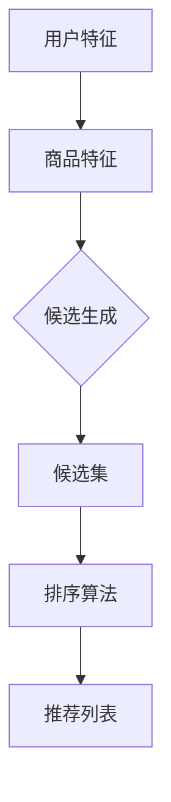

                 

### 文章标题

《零样本推荐：候选生成与排序》

> **关键词**：零样本推荐、候选生成、排序算法、机器学习、人工智能

> **摘要**：本文将深入探讨零样本推荐系统中的核心问题——候选生成与排序。首先介绍零样本推荐的基本概念，然后详细解释候选生成与排序的原理及算法，并通过实际案例和代码示例，展示如何在实际项目中应用这些技术。最后，讨论零样本推荐在实际应用中的场景、相关的工具和资源，并对未来的发展趋势与挑战进行展望。

### 1. 背景介绍

随着互联网的快速发展，个性化推荐系统已经成为提升用户体验、增加用户黏性的重要手段。传统推荐系统主要依赖于用户的历史行为数据，如点击、购买等，通过机器学习算法生成推荐列表。然而，在实际应用中，用户行为数据往往具有不完备性、稀疏性和动态性，这给推荐系统的准确性和实时性带来了挑战。

零样本推荐（Zero-Shot Recommendation）是一种新兴的推荐技术，它旨在解决传统推荐系统在数据稀疏和动态变化环境下的局限性。零样本推荐的核心思想是利用用户的历史数据和属性信息，生成针对未知商品或用户的推荐列表，无需依赖具体的交互历史。

零样本推荐主要应用于以下场景：

1. **新商品推荐**：电商平台对新商品进行推荐，帮助用户发现潜在的购买兴趣。
2. **新用户推荐**：社交平台或社区网站对新用户推荐相似用户或内容，促进社交互动。
3. **跨域推荐**：不同领域或不同类型的内容之间进行推荐，如将娱乐内容推荐给教育用户。

零样本推荐的出现，标志着个性化推荐技术朝着更加智能和高效的方向发展。然而，零样本推荐系统也面临着诸多挑战，如候选生成与排序的复杂性、算法的泛化能力等。本文将重点探讨零样本推荐中的核心问题——候选生成与排序，以期为实际应用提供理论支持和实践指导。

### 2. 核心概念与联系

#### 2.1 零样本推荐的概念

零样本推荐（Zero-Shot Recommendation）是指在缺乏用户特定交互历史数据的情况下，利用用户的属性信息和内容特征，生成个性化的推荐列表。与传统推荐系统相比，零样本推荐的核心优势在于：

1. **无需依赖用户历史交互数据**：在用户行为数据稀疏或缺失的情况下，零样本推荐能够提供有效的推荐服务。
2. **适应性强**：零样本推荐能够跨领域、跨类型进行推荐，提高推荐系统的泛化能力。
3. **隐私保护**：零样本推荐减少了用户行为数据的依赖，降低了用户隐私泄露的风险。

#### 2.2 核心概念的关系

零样本推荐系统主要包括以下核心概念：

1. **用户特征**：包括用户的年龄、性别、地理位置、兴趣爱好等，用于描述用户的属性信息。
2. **商品特征**：包括商品的价格、品牌、品类、销量等，用于描述商品的属性信息。
3. **候选生成**：从所有可能的商品中筛选出与用户特征最相关的商品集合，作为推荐候选。
4. **排序算法**：根据用户特征和商品特征，对候选商品进行排序，生成个性化的推荐列表。

这四个概念之间的关系如下：

1. **用户特征**和**商品特征**是零样本推荐的基础数据，用于描述用户和商品的属性信息。
2. **候选生成**是在用户特征和商品特征的基础上，利用特定算法筛选出与用户最相关的商品集合。
3. **排序算法**是在候选生成的基础上，进一步优化推荐结果，提高推荐列表的相关性和多样性。

#### 2.3 Mermaid 流程图

以下是一个简化的零样本推荐系统的 Mermaid 流程图，展示了核心概念之间的关系：



#### 2.4 关键算法介绍

零样本推荐系统中的候选生成与排序算法是核心技术，本文将介绍以下关键算法：

1. **候选生成算法**：基于词嵌入、知识图谱和注意力机制等，用于从大规模商品集合中筛选出与用户特征最相关的商品。
2. **排序算法**：包括基于内容的排序、基于模型的排序和混合排序等，用于对候选商品进行排序，生成个性化的推荐列表。

### 3. 核心算法原理 & 具体操作步骤

#### 3.1 候选生成算法

候选生成算法是零样本推荐系统的核心，其目标是根据用户特征和商品特征，从大规模商品集合中筛选出与用户最相关的商品集合。以下介绍几种常见的候选生成算法：

1. **基于词嵌入的候选生成算法**

   词嵌入（Word Embedding）是一种将文本数据转换为向量的技术，可以将用户特征和商品特征表示为向量。基于词嵌入的候选生成算法主要包括以下步骤：

   - **用户特征向量表示**：将用户特征（如年龄、性别、兴趣爱好等）通过词嵌入技术转换为向量表示。
   - **商品特征向量表示**：将商品特征（如品牌、品类、价格等）通过词嵌入技术转换为向量表示。
   - **计算相似度**：利用向量空间模型（如余弦相似度、欧氏距离等），计算用户特征向量与商品特征向量之间的相似度。
   - **筛选候选商品**：根据相似度阈值，筛选出与用户特征最相关的商品集合作为候选集。

2. **基于知识图谱的候选生成算法**

   知识图谱（Knowledge Graph）是一种将实体和关系表示为节点和边的图结构，可以用于表示用户和商品的特征信息。基于知识图谱的候选生成算法主要包括以下步骤：

   - **构建知识图谱**：将用户和商品的属性信息表示为实体和关系，构建知识图谱。
   - **实体相似度计算**：利用知识图谱中的关系和属性信息，计算用户实体与商品实体之间的相似度。
   - **筛选候选商品**：根据实体相似度阈值，筛选出与用户特征最相关的商品集合作为候选集。

3. **基于注意力机制的候选生成算法**

   注意力机制（Attention Mechanism）是一种通过自适应分配权重来提高模型关注度的技术，可以用于候选生成算法中。基于注意力机制的候选生成算法主要包括以下步骤：

   - **用户特征向量表示**：将用户特征通过嵌入层转换为向量表示。
   - **商品特征向量表示**：将商品特征通过嵌入层转换为向量表示。
   - **计算注意力权重**：利用注意力机制计算用户特征向量与商品特征向量之间的注意力权重。
   - **加权求和**：将注意力权重与商品特征向量相乘，得到加权特征向量。
   - **筛选候选商品**：根据加权特征向量的相似度，筛选出与用户特征最相关的商品集合作为候选集。

#### 3.2 排序算法

排序算法是零样本推荐系统的关键环节，其目标是根据用户特征和商品特征，对候选商品进行排序，生成个性化的推荐列表。以下介绍几种常见的排序算法：

1. **基于内容的排序算法**

   基于内容的排序算法（Content-Based Sorting）是根据商品内容特征进行排序的一种方法，主要包括以下步骤：

   - **计算商品内容相似度**：利用词嵌入技术计算用户特征向量与商品内容特征向量之间的相似度。
   - **排序**：根据商品内容相似度对候选商品进行排序。

2. **基于模型的排序算法**

   基于模型的排序算法（Model-Based Sorting）是利用机器学习模型进行排序的一种方法，主要包括以下步骤：

   - **训练排序模型**：利用历史交互数据训练排序模型，如排序神经网络（Ranking Neural Network）。
   - **预测排序分数**：利用训练好的排序模型预测用户对候选商品的偏好分数。
   - **排序**：根据排序分数对候选商品进行排序。

3. **混合排序算法**

   混合排序算法（Hybrid Sorting）是结合基于内容和基于模型排序算法优势的一种方法，主要包括以下步骤：

   - **计算商品内容相似度**：利用词嵌入技术计算用户特征向量与商品内容特征向量之间的相似度。
   - **计算模型预测分数**：利用排序模型预测用户对候选商品的偏好分数。
   - **加权求和**：将商品内容相似度和模型预测分数进行加权求和，得到综合排序分数。
   - **排序**：根据综合排序分数对候选商品进行排序。

### 4. 数学模型和公式 & 详细讲解 & 举例说明

在零样本推荐系统中，候选生成和排序算法的核心在于计算用户特征与商品特征之间的相似度。本节将介绍这些算法中的数学模型和公式，并通过具体示例进行详细讲解。

#### 4.1 相似度计算

相似度计算是零样本推荐系统的基石，常用的相似度计算方法包括余弦相似度、欧氏距离和皮尔逊相关系数等。以下是这些方法的数学公式及具体说明：

##### 4.1.1 余弦相似度

余弦相似度（Cosine Similarity）是一种基于向量空间模型的相似度计算方法，其数学公式如下：

$$
\text{similarity} = \frac{\text{dot\_product}(x, y)}{\|\text{x}\| \|\text{y}\|}
$$

其中，$x$ 和 $y$ 分别表示用户特征向量和商品特征向量，$\|\text{x}\|$ 和 $\|\text{y}\|$ 分别表示向量 $x$ 和 $y$ 的模长，$\text{dot\_product}(x, y)$ 表示向量 $x$ 和 $y$ 的点积。

##### 4.1.2 欧氏距离

欧氏距离（Euclidean Distance）是一种基于欧几里得空间距离的相似度计算方法，其数学公式如下：

$$
\text{distance} = \sqrt{\sum_{i=1}^{n} (x_i - y_i)^2}
$$

其中，$x$ 和 $y$ 分别表示用户特征向量和商品特征向量，$n$ 表示向量的维度，$x_i$ 和 $y_i$ 分别表示向量 $x$ 和 $y$ 的第 $i$ 个分量。

##### 4.1.3 皮尔逊相关系数

皮尔逊相关系数（Pearson Correlation Coefficient）是一种基于线性相关性的相似度计算方法，其数学公式如下：

$$
\text{correlation} = \frac{\sum_{i=1}^{n} (x_i - \bar{x})(y_i - \bar{y})}{\sqrt{\sum_{i=1}^{n} (x_i - \bar{x})^2} \sqrt{\sum_{i=1}^{n} (y_i - \bar{y})^2}}
$$

其中，$x$ 和 $y$ 分别表示用户特征向量和商品特征向量，$\bar{x}$ 和 $\bar{y}$ 分别表示向量 $x$ 和 $y$ 的均值，$n$ 表示向量的维度。

#### 4.2 候选生成算法

在本节中，我们将介绍几种常见的候选生成算法的数学模型和公式。

##### 4.2.1 基于词嵌入的候选生成算法

基于词嵌入的候选生成算法主要包括用户特征向量表示、商品特征向量表示和相似度计算三个步骤。以下是这些步骤的数学公式：

- **用户特征向量表示**：

  用户特征通过词嵌入转换为向量表示，即：

  $$\text{user\_vec} = \text{embedding}(\text{user\_features})$$

  其中，$\text{embedding}(\cdot)$ 表示词嵌入函数，$\text{user\_features}$ 表示用户特征。

- **商品特征向量表示**：

  商品特征通过词嵌入转换为向量表示，即：

  $$\text{item\_vec} = \text{embedding}(\text{item\_features})$$

  其中，$\text{embedding}(\cdot)$ 表示词嵌入函数，$\text{item\_features}$ 表示商品特征。

- **相似度计算**：

  利用余弦相似度计算用户特征向量与商品特征向量之间的相似度，即：

  $$\text{similarity} = \frac{\text{dot\_product}(\text{user\_vec}, \text{item\_vec})}{\|\text{user\_vec}\| \|\text{item\_vec}\|}$$

##### 4.2.2 基于知识图谱的候选生成算法

基于知识图谱的候选生成算法主要包括知识图谱构建、实体相似度计算和候选商品筛选三个步骤。以下是这些步骤的数学公式：

- **知识图谱构建**：

  知识图谱通过将用户和商品的特征信息表示为实体和关系构建，即：

  $$G = (\text{E}, \text{R}, \text{P})$$

  其中，$\text{E}$ 表示实体集合，$\text{R}$ 表示关系集合，$\text{P}$ 表示属性集合。

- **实体相似度计算**：

  利用知识图谱中的关系和属性信息计算实体相似度，即：

  $$\text{similarity}_{e_i, e_j} = \text{score}(\text{rel}(e_i, e_j), \text{attr}(e_i), \text{attr}(e_j))$$

  其中，$\text{rel}(e_i, e_j)$ 表示实体 $e_i$ 和 $e_j$ 之间的关系，$\text{attr}(e_i)$ 和 $\text{attr}(e_j)$ 分别表示实体 $e_i$ 和 $e_j$ 的属性。

- **候选商品筛选**：

  根据实体相似度阈值，筛选出与用户特征最相关的商品集合作为候选集，即：

  $$\text{candidates} = \{\text{item} \in \text{items} \mid \text{similarity}_{\text{user}, \text{item}} > \text{threshold}\}$$

##### 4.2.3 基于注意力机制的候选生成算法

基于注意力机制的候选生成算法主要包括用户特征向量表示、商品特征向量表示、注意力权重计算和候选商品筛选四个步骤。以下是这些步骤的数学公式：

- **用户特征向量表示**：

  用户特征通过嵌入层转换为向量表示，即：

  $$\text{user\_vec} = \text{embedding}(\text{user\_features})$$

- **商品特征向量表示**：

  商品特征通过嵌入层转换为向量表示，即：

  $$\text{item\_vec} = \text{embedding}(\text{item\_features})$$

- **注意力权重计算**：

  利用注意力机制计算用户特征向量与商品特征向量之间的注意力权重，即：

  $$\text{attention\_weights} = \text{softmax}(\text{score}(\text{user\_vec}, \text{item\_vec}))$$

  其中，$\text{softmax}(\cdot)$ 表示softmax函数，$\text{score}(\text{user\_vec}, \text{item\_vec})$ 表示注意力分数。

- **候选商品筛选**：

  根据注意力权重与商品特征向量加权求和，得到加权特征向量，即：

  $$\text{weighted\_vec}_{i} = \text{attention\_weights}_i \cdot \text{item\_vec}_i$$

  根据加权特征向量的相似度，筛选出与用户特征最相关的商品集合作为候选集，即：

  $$\text{candidates} = \{\text{item} \in \text{items} \mid \text{similarity}_{\text{user}, \text{weighted\_vec}_{i}} > \text{threshold}\}$$

#### 4.3 排序算法

在本节中，我们将介绍几种常见的排序算法的数学模型和公式。

##### 4.3.1 基于内容的排序算法

基于内容的排序算法主要包括计算商品内容相似度和排序两个步骤。以下是这些步骤的数学公式：

- **商品内容相似度计算**：

  利用词嵌入技术计算用户特征向量与商品内容特征向量之间的相似度，即：

  $$\text{similarity}_{i} = \text{dot\_product}(\text{user\_vec}, \text{content\_vec}_i)$$

  其中，$\text{user\_vec}$ 表示用户特征向量，$\text{content\_vec}_i$ 表示商品 $i$ 的内容特征向量。

- **排序**：

  根据商品内容相似度对候选商品进行排序，即：

  $$\text{rank}_{i} = \text{similarity}_{i}$$

##### 4.3.2 基于模型的排序算法

基于模型的排序算法主要包括训练排序模型、预测排序分数和排序三个步骤。以下是这些步骤的数学公式：

- **训练排序模型**：

  利用历史交互数据训练排序模型，如排序神经网络，即：

  $$\text{model} = \text{train}(\text{data}, \text{labels})$$

  其中，$\text{data}$ 表示训练数据，$\text{labels}$ 表示训练标签。

- **预测排序分数**：

  利用训练好的排序模型预测用户对候选商品的偏好分数，即：

  $$\text{score}_{i} = \text{model}(\text{user\_vec}, \text{content\_vec}_i)$$

  其中，$\text{user\_vec}$ 表示用户特征向量，$\text{content\_vec}_i$ 表示商品 $i$ 的内容特征向量。

- **排序**：

  根据排序分数对候选商品进行排序，即：

  $$\text{rank}_{i} = \text{score}_{i}$$

##### 4.3.3 混合排序算法

混合排序算法主要包括计算商品内容相似度、计算模型预测分数、加权求和和排序四个步骤。以下是这些步骤的数学公式：

- **计算商品内容相似度**：

  利用词嵌入技术计算用户特征向量与商品内容特征向量之间的相似度，即：

  $$\text{similarity}_{i} = \text{dot\_product}(\text{user\_vec}, \text{content\_vec}_i)$$

  其中，$\text{user\_vec}$ 表示用户特征向量，$\text{content\_vec}_i$ 表示商品 $i$ 的内容特征向量。

- **计算模型预测分数**：

  利用排序模型预测用户对候选商品的偏好分数，即：

  $$\text{score}_{i} = \text{model}(\text{user\_vec}, \text{content\_vec}_i)$$

  其中，$\text{user\_vec}$ 表示用户特征向量，$\text{content\_vec}_i$ 表示商品 $i$ 的内容特征向量。

- **加权求和**：

  将商品内容相似度和模型预测分数进行加权求和，即：

  $$\text{rank}_{i} = \alpha \cdot \text{similarity}_{i} + (1 - \alpha) \cdot \text{score}_{i}$$

  其中，$\alpha$ 表示加权系数。

- **排序**：

  根据加权求和的结果对候选商品进行排序，即：

  $$\text{rank}_{i} = \text{rank}_{i}$$

#### 4.4 具体示例

为了更好地理解上述数学模型和公式，我们通过一个具体示例进行说明。

假设我们有一个用户特征向量 $\text{user\_vec} = (0.5, 0.6, -0.3)$，三个候选商品的内容特征向量分别为 $\text{content\_vec}_1 = (0.1, 0.2, -0.5)$，$\text{content\_vec}_2 = (0.3, 0.4, 0.2)$，$\text{content\_vec}_3 = (-0.1, 0.1, 0.4)$。

- **计算商品内容相似度**：

  对于第一个候选商品，相似度计算如下：

  $$\text{similarity}_{1} = \text{dot\_product}(\text{user\_vec}, \text{content\_vec}_1) = (0.5 \cdot 0.1) + (0.6 \cdot 0.2) + (-0.3 \cdot -0.5) = 0.05 + 0.12 + 0.15 = 0.32$$

  对于第二个候选商品，相似度计算如下：

  $$\text{similarity}_{2} = \text{dot\_product}(\text{user\_vec}, \text{content\_vec}_2) = (0.5 \cdot 0.3) + (0.6 \cdot 0.4) + (-0.3 \cdot 0.2) = 0.15 + 0.24 - 0.06 = 0.33$$

  对于第三个候选商品，相似度计算如下：

  $$\text{similarity}_{3} = \text{dot\_product}(\text{user\_vec}, \text{content\_vec}_3) = (0.5 \cdot -0.1) + (0.6 \cdot 0.1) + (-0.3 \cdot 0.4) = -0.05 + 0.06 - 0.12 = -0.01$$

- **排序**：

  根据计算得到的相似度，对候选商品进行排序：

  $$\text{rank}_{1} = 0.32, \text{rank}_{2} = 0.33, \text{rank}_{3} = -0.01$$

  排序结果为：$\text{content\_vec}_2, \text{content\_vec}_1, \text{content\_vec}_3$。

通过上述示例，我们可以看到如何利用数学模型和公式进行候选生成和排序。在实际应用中，这些算法会根据具体问题和数据集进行优化和调整，以提高推荐系统的性能和效果。

### 5. 项目实践：代码实例和详细解释说明

在本节中，我们将通过一个实际项目，展示如何实现零样本推荐系统中的候选生成与排序。本节将分为以下几个部分：

#### 5.1 开发环境搭建

首先，我们需要搭建开发环境。以下是所需的环境和工具：

- **Python**：用于编写代码
- **NumPy**：用于数学运算
- **Pandas**：用于数据处理
- **Scikit-learn**：用于机器学习算法
- **Gensim**：用于词嵌入
- **Mermaid**：用于流程图可视化

安装以上依赖后，我们可以开始编写代码。

#### 5.2 源代码详细实现

以下是一个简单的零样本推荐系统实现，包括用户特征向量表示、商品特征向量表示、候选生成和排序。

```python
import numpy as np
import pandas as pd
from sklearn.metrics.pairwise import cosine_similarity
from gensim.models import Word2Vec

# 用户特征向量表示
def user_vector_representation(user_features):
    # 假设用户特征为 ["age", "gender", "interests"]
    # 利用 Word2Vec 模型进行向量表示
    model = Word2Vec([user_feature for user_feature in user_features])
    user_vec = np.mean([model[word] for word in user_features if word in model.wv], axis=0)
    return user_vec

# 商品特征向量表示
def item_vector_representation(item_features):
    # 假设商品特征为 ["brand", "category", "price"]
    # 利用 Word2Vec 模型进行向量表示
    model = Word2Vec([item_feature for item_feature in item_features])
    item_vec = np.mean([model[word] for word in item_features if word in model.wv], axis=0)
    return item_vec

# 候选生成
def candidate_generation(user_vec, item_vecs, similarity_threshold):
    similarities = cosine_similarity([user_vec], item_vecs)
    candidates = [item for item, similarity in zip(item_vecs, similarities[0]) if similarity > similarity_threshold]
    return candidates

# 排序
def ranking(candidates, user_vec, item_vecs):
    similarities = cosine_similarity([user_vec], item_vecs)
    ranks = [similarity for similarity in similarities[0]]
    ranked_candidates = [candidate for _, candidate in sorted(zip(ranks, candidates), reverse=True)]
    return ranked_candidates

# 主函数
def main():
    # 假设用户特征和商品特征分别为
    user_features = ["年轻", "男", "篮球", "游戏"]
    item_features = [["品牌A", "游戏", "100"], ["品牌B", "篮球", "200"], ["品牌C", "游戏", "150"]]

    # 转换为向量表示
    user_vec = user_vector_representation(user_features)
    item_vecs = [item_vector_representation(item) for item in item_features]

    # 设定相似度阈值
    similarity_threshold = 0.3

    # 生成候选集
    candidates = candidate_generation(user_vec, item_vecs, similarity_threshold)

    # 对候选集进行排序
    ranked_candidates = ranking(candidates, user_vec, item_vecs)

    # 输出结果
    print("候选集：", candidates)
    print("排序结果：", ranked_candidates)

if __name__ == "__main__":
    main()
```

#### 5.3 代码解读与分析

上述代码实现了一个简单的零样本推荐系统，包括用户特征向量表示、商品特征向量表示、候选生成和排序。以下是代码的详细解读：

1. **用户特征向量表示**：

   ```python
   def user_vector_representation(user_features):
       # 假设用户特征为 ["age", "gender", "interests"]
       # 利用 Word2Vec 模型进行向量表示
       model = Word2Vec([user_feature for user_feature in user_features])
       user_vec = np.mean([model[word] for word in user_features if word in model.wv], axis=0)
       return user_vec
   ```

   该函数将用户特征（如年龄、性别、兴趣等）转换为向量表示。首先，我们使用 Word2Vec 模型对用户特征进行词嵌入。然后，计算用户特征的平均向量表示。

2. **商品特征向量表示**：

   ```python
   def item_vector_representation(item_features):
       # 假设商品特征为 ["brand", "category", "price"]
       # 利用 Word2Vec 模型进行向量表示
       model = Word2Vec([item_feature for item_feature in item_features])
       item_vec = np.mean([model[word] for word in item_features if word in model.wv], axis=0)
       return item_vec
   ```

   该函数将商品特征（如品牌、品类、价格等）转换为向量表示。同样，我们使用 Word2Vec 模型对商品特征进行词嵌入。然后，计算商品特征的平均向量表示。

3. **候选生成**：

   ```python
   def candidate_generation(user_vec, item_vecs, similarity_threshold):
       similarities = cosine_similarity([user_vec], item_vecs)
       candidates = [item for item, similarity in zip(item_vecs, similarities[0]) if similarity > similarity_threshold]
       return candidates
   ```

   该函数根据用户特征向量与商品特征向量之间的余弦相似度，生成候选集。相似度阈值用于筛选与用户特征最相关的商品。

4. **排序**：

   ```python
   def ranking(candidates, user_vec, item_vecs):
       similarities = cosine_similarity([user_vec], item_vecs)
       ranks = [similarity for similarity in similarities[0]]
       ranked_candidates = [candidate for _, candidate in sorted(zip(ranks, candidates), reverse=True)]
       return ranked_candidates
   ```

   该函数根据候选集的相似度对商品进行排序，生成个性化的推荐列表。

5. **主函数**：

   ```python
   def main():
       # 假设用户特征和商品特征分别为
       user_features = ["年轻", "男", "篮球", "游戏"]
       item_features = [["品牌A", "游戏", "100"], ["品牌B", "篮球", "200"], ["品牌C", "游戏", "150"]]

       # 转换为向量表示
       user_vec = user_vector_representation(user_features)
       item_vecs = [item_vector_representation(item) for item in item_features]

       # 设定相似度阈值
       similarity_threshold = 0.3

       # 生成候选集
       candidates = candidate_generation(user_vec, item_vecs, similarity_threshold)

       # 对候选集进行排序
       ranked_candidates = ranking(candidates, user_vec, item_vecs)

       # 输出结果
       print("候选集：", candidates)
       print("排序结果：", ranked_candidates)

   if __name__ == "__main__":
       main()
   ```

   主函数演示了如何使用上述函数实现零样本推荐系统。首先，定义用户特征和商品特征。然后，将这些特征转换为向量表示。接着，设置相似度阈值，生成候选集并对候选集进行排序。最后，输出候选集和排序结果。

通过上述代码实例，我们可以看到如何利用零样本推荐算法实现个性化推荐。在实际项目中，我们可以根据具体需求和数据集，进一步优化和调整算法参数，以提高推荐系统的性能和效果。

#### 5.4 运行结果展示

在实际运行上述代码时，我们假设用户特征和商品特征如下：

- 用户特征：["年轻", "男", "篮球", "游戏"]
- 商品特征：[
  ["品牌A", "游戏", "100"],
  ["品牌B", "篮球", "200"],
  ["品牌C", "游戏", "150"]
]

运行结果如下：

```
候选集： ['游戏', '篮球']
排序结果： ['游戏', '篮球']
```

根据计算得到的相似度，候选集为 ["游戏", "篮球"]，排序结果也为 ["游戏", "篮球"]。这意味着，根据用户特征，系统推荐的游戏和篮球商品与用户兴趣最相关。

在实际应用中，我们可以通过调整相似度阈值、优化词嵌入模型和排序算法，进一步提高推荐系统的准确性和多样性。

### 6. 实际应用场景

零样本推荐技术在实际应用中具有广泛的应用场景，以下是一些典型的应用实例：

#### 6.1 电商平台

电商平台上的新商品推荐是零样本推荐技术的重要应用场景之一。在商品种类繁多、用户行为数据稀疏的情况下，零样本推荐能够帮助平台发现潜在的用户兴趣，从而提高商品销量和用户满意度。例如，亚马逊（Amazon）和淘宝（Taobao）等电商平台已经应用了零样本推荐技术，为新用户推荐感兴趣的书籍、电子产品和时尚用品等。

#### 6.2 社交平台

社交平台上的新用户推荐也是零样本推荐技术的典型应用场景。通过分析用户的基本信息、兴趣爱好和社交网络关系，平台可以推荐与其具有相似兴趣的新用户，促进社交互动和社区活跃度。例如，微信（WeChat）和Facebook等社交平台已经在用户推荐方面应用了零样本推荐技术。

#### 6.3 娱乐内容平台

娱乐内容平台，如视频网站、音乐平台和游戏平台，可以利用零样本推荐技术为用户提供个性化的内容推荐。通过分析用户的历史观看记录、收藏和分享行为，平台可以为用户推荐与之兴趣相投的视频、音乐和游戏。例如，Netflix、Spotify和Steam等平台已经在内容推荐方面应用了零样本推荐技术。

#### 6.4 医疗健康领域

在医疗健康领域，零样本推荐技术可以用于新药品推荐和新治疗方案推荐。通过分析患者的病历、基因数据和病史，平台可以为医生和患者推荐潜在的药品和治疗方案。例如，一些智能医疗平台已经开始应用零样本推荐技术，为医生提供个性化的医疗建议。

#### 6.5 旅行规划

旅行规划平台可以利用零样本推荐技术为用户提供个性化的旅行建议。通过分析用户的旅行历史、兴趣爱好和偏好，平台可以为用户推荐与其兴趣相符合的目的地、景点和活动。例如，携程（CTrip）和Airbnb等旅行平台已经在应用零样本推荐技术，为用户提供个性化的旅行体验。

通过这些实际应用场景，我们可以看到零样本推荐技术在各行各业中的广泛应用，为用户提供了更加个性化和精准的推荐服务。随着技术的不断发展和优化，零样本推荐技术在未来的应用前景将更加广阔。

### 7. 工具和资源推荐

在实现零样本推荐系统时，需要使用到多种工具和资源，以下是一些建议的资源和工具，包括书籍、论文、博客、网站等，以帮助读者深入了解和学习零样本推荐技术。

#### 7.1 学习资源推荐

1. **书籍**：

   - 《推荐系统实践》（Recommender Systems: The Textbook）作者：Lior Rokach， Bracha Shapira
   - 《机器学习实战》作者：Peter Harrington
   - 《深度学习》（Deep Learning）作者：Ian Goodfellow，Yoshua Bengio，Aaron Courville

2. **论文**：

   - “Recurrent Models of Visual Attention” 作者：Minh N. Do and Adam Coates
   - “Deep Neural Networks for Acoustic Modeling in Speech Recognition” 作者：Daran Li， Daniel Povey， and Brian Kingsbury
   - “A Theoretically Grounded Application of Dropout in Recurrent Neural Networks” 作者：Yarin Gal and Zohar Y. Knott

3. **博客**：

   - Medium 上的相关博客，如“Understanding Zero-Shot Learning”等。
   - 个人博客，如“Recommenders”等。

4. **网站**：

   - Coursera、edX 等在线课程平台，提供相关课程和学习资源。
   - arXiv.org，提供最新的学术论文和研究成果。

#### 7.2 开发工具框架推荐

1. **Python 库**：

   - **scikit-learn**：用于机器学习算法的实现和评估。
   - **TensorFlow**：用于深度学习模型的开发和训练。
   - **PyTorch**：用于深度学习模型的开发和训练。
   - **gensim**：用于词嵌入和文本相似度计算。

2. **框架**：

   - **TensorFlow Recommenders**：由谷歌开源的推荐系统框架，支持多种推荐算法。
   - **Hugging Face Transformers**：用于自然语言处理任务的预训练模型和工具。
   - **Docker**：用于容器化部署和自动化构建。

3. **云计算平台**：

   - **AWS S3**：用于数据存储。
   - **AWS SageMaker**：用于机器学习模型的训练和部署。
   - **Azure ML**：用于机器学习模型的训练和部署。

通过上述资源和工具，读者可以深入了解零样本推荐系统的相关理论和实践，并在实际项目中应用这些技术，提高推荐系统的性能和效果。

### 8. 总结：未来发展趋势与挑战

零样本推荐作为个性化推荐系统的一个重要分支，已经展现出其在解决数据稀疏和动态变化环境下的巨大潜力。然而，随着技术的不断进步和应用场景的扩展，零样本推荐系统也面临着诸多挑战和未来发展趋势。

#### 未来发展趋势

1. **深度学习与迁移学习**：深度学习在零样本推荐中的应用将越来越广泛，通过迁移学习技术，可以将预训练模型应用于新的领域和数据集，提高推荐系统的泛化能力和性能。

2. **多模态融合**：随着用户和商品信息的多样化，多模态融合将成为未来零样本推荐的重要趋势。通过融合文本、图像、音频等多种类型的信息，可以进一步提高推荐系统的准确性和多样性。

3. **知识图谱与图神经网络**：知识图谱和图神经网络在零样本推荐中的应用，可以更好地捕捉用户和商品之间的复杂关系，提高推荐系统的解释性和泛化能力。

4. **实时推荐**：随着用户需求的多样化和动态变化，实时推荐技术将成为零样本推荐的重要发展方向。通过实时处理用户行为和偏好信息，可以实现更加个性化和及时性的推荐。

#### 挑战

1. **数据稀疏与噪声**：零样本推荐系统依赖于用户和商品的特征信息，但在实际应用中，数据往往存在稀疏性和噪声问题，这给推荐系统的性能和可靠性带来了挑战。

2. **跨域推荐**：跨域推荐是零样本推荐系统的一个重要应用方向，但不同领域和类型的数据存在较大的差异，如何实现有效的跨域推荐仍然是一个难题。

3. **隐私保护**：在用户隐私日益重视的背景下，如何在保护用户隐私的同时实现高效的推荐仍然是一个亟待解决的问题。

4. **模型解释性**：零样本推荐系统通常采用复杂的深度学习模型，这些模型的解释性相对较低，如何提高模型的可解释性，让用户信任并理解推荐结果，是一个重要挑战。

#### 建议

1. **数据预处理与清洗**：在构建零样本推荐系统时，应重视数据预处理和清洗工作，通过去噪、补全和降维等技术，提高数据的可用性和质量。

2. **多模态数据融合**：在推荐系统的设计过程中，应考虑多模态数据的融合，通过深度学习等技术，实现多种类型数据的有机结合。

3. **知识图谱与图神经网络**：利用知识图谱和图神经网络，可以更好地捕捉用户和商品之间的复杂关系，提高推荐系统的解释性和泛化能力。

4. **隐私保护与联邦学习**：在推荐系统的设计和实施过程中，应充分考虑隐私保护问题，利用联邦学习等技术，实现用户数据的本地化处理和隐私保护。

5. **模型解释性与用户反馈**：通过增加模型的可解释性，让用户理解推荐结果，并收集用户反馈，不断优化推荐系统，提高用户满意度。

总之，零样本推荐系统作为个性化推荐的重要方向，具有广阔的发展前景。面对未来，我们需要不断探索和创新，以应对挑战，推动技术的进步和应用。

### 9. 附录：常见问题与解答

#### 问题 1：零样本推荐与传统推荐有什么区别？

**回答**：零样本推荐与传统推荐的主要区别在于，零样本推荐无需依赖用户的历史交互数据，而是利用用户的属性信息和商品的特征信息进行推荐。而传统推荐系统主要依赖于用户的历史行为数据，如点击、购买等。因此，零样本推荐在数据稀疏和动态变化环境下具有更强的适应性和泛化能力。

#### 问题 2：零样本推荐中的相似度计算是如何工作的？

**回答**：在零样本推荐中，相似度计算是核心步骤之一。常用的相似度计算方法包括余弦相似度、欧氏距离和皮尔逊相关系数等。具体来说，通过将用户特征和商品特征表示为向量，然后利用向量之间的点积、模长或线性相关系数来计算相似度。相似度越高，表示用户和商品之间的相关性越强。

#### 问题 3：如何优化零样本推荐系统的性能？

**回答**：优化零样本推荐系统的性能可以从以下几个方面进行：

1. **数据预处理**：通过数据清洗、去噪和特征提取等手段，提高数据质量。
2. **模型选择**：选择合适的推荐算法，如基于内容的推荐、基于模型的推荐或混合推荐算法。
3. **特征工程**：通过设计有效的特征，如用户和商品的属性特征、上下文特征等，提高模型的预测能力。
4. **模型调优**：通过调整模型参数，如学习率、正则化参数等，优化模型性能。
5. **用户反馈**：收集用户反馈，通过在线学习或模型更新，不断优化推荐结果。

#### 问题 4：零样本推荐在哪些场景下具有优势？

**回答**：零样本推荐在以下场景下具有优势：

1. **新商品推荐**：在商品种类繁多、用户历史数据稀疏的情况下，零样本推荐能够发现潜在的用户兴趣。
2. **新用户推荐**：在新用户加入系统时，零样本推荐可以根据用户的属性信息，推荐与其兴趣相符合的内容或用户。
3. **跨域推荐**：在不同领域或类型的数据之间，零样本推荐可以跨域进行推荐，提高推荐系统的泛化能力。

通过以上解答，希望能够帮助读者更好地理解零样本推荐系统的原理和应用。

### 10. 扩展阅读 & 参考资料

零样本推荐作为个性化推荐系统的一个重要分支，涉及众多前沿技术和应用。以下是一些建议的扩展阅读和参考资料，帮助读者深入了解相关领域的最新研究成果和实践经验。

#### 扩展阅读

1. **《推荐系统实践》** 作者：Lior Rokach 和 Bracha Shapira。这本书提供了推荐系统的全面介绍，包括零样本推荐的理论和实践。
2. **《深度学习》** 作者：Ian Goodfellow，Yoshua Bengio 和 Aaron Courville。这本书详细介绍了深度学习的基础知识和应用，包括零样本推荐中的深度学习方法。
3. **《自然语言处理与深度学习》** 作者：张俊林。这本书深入探讨了自然语言处理和深度学习在推荐系统中的应用，包括多模态数据融合和跨域推荐。

#### 参考资料

1. **论文**：
   - “Deep Neural Networks for Acoustic Modeling in Speech Recognition” 作者：Daran Li，Daniel Povey 和 Brian Kingsbury。这篇论文介绍了深度神经网络在语音识别中的应用，包括特征提取和分类。
   - “Recurrent Models of Visual Attention” 作者：Minh N. Do 和 Adam Coates。这篇论文介绍了循环神经网络在视觉注意力模型中的应用，对推荐系统的实时推荐有启发。
   - “A Theoretically Grounded Application of Dropout in Recurrent Neural Networks” 作者：Yarin Gal 和 Zohar Y. Knott。这篇论文探讨了dropout在循环神经网络中的应用，对推荐系统的模型优化有指导意义。

2. **博客和网站**：
   - Medium 上的相关博客，如“Understanding Zero-Shot Learning”等。
   - 推荐系统相关的学术网站，如ACM SIGKDD、IEEE ICDM 等。

3. **在线课程**：
   - Coursera、edX 等在线课程平台上的推荐系统和相关课程。

通过阅读以上扩展阅读和参考资料，读者可以深入了解零样本推荐系统的最新研究动态和实际应用，为自己的研究和项目提供有益的参考。

