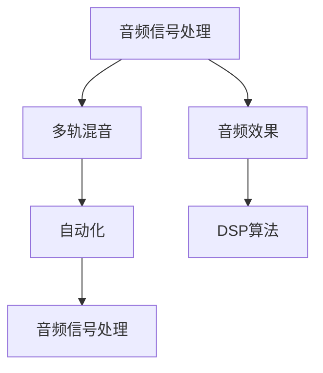

                 

关键词：音乐制作、数字工作室、音频处理、音频编辑、音频合成、自动化、多轨混音、音频效果、DSP算法

> 摘要：本文旨在深入探讨音乐制作工具在数字工作室中的应用，分析其核心概念、算法原理、数学模型、实际操作步骤以及未来发展趋势。通过介绍各种音频处理技术、多轨混音技巧和自动化工具，本文将帮助读者理解如何利用现代音乐制作工具简化创作过程，提升音乐制作的效率和质量。

## 1. 背景介绍

随着计算机技术和数字音频处理技术的发展，音乐制作工具已经从传统的模拟设备转向了数字工作室。数字工作室是指利用计算机和一系列数字音频处理软件进行音乐创作的环境。它不仅包括了音频编辑、音频合成、音效处理等核心功能，还集成了多种自动化工具和智能辅助功能，使得音乐制作变得更加高效和灵活。

### 1.1 数字工作室的发展历程

数字工作室的概念最早可以追溯到20世纪80年代，当时计算机开始被用于音乐制作。随着数字信号处理（DSP）技术的发展，音频编辑软件如Adobe Audition和Ableton Live等逐渐成熟。这些软件不仅提供了强大的音频处理功能，还引入了多轨混音和自动化技术，使得音乐制作变得更加复杂和精细。

### 1.2 音乐制作工具的普及

随着互联网的普及和计算机性能的提升，音乐制作工具逐渐被广大音乐人和制作人所接受。如今，任何人都可以通过简单的计算机操作和廉价的音频软件来创作音乐。这种趋势推动了音乐制作工具的普及，使得音乐创作不再局限于专业的录音室和设备。

## 2. 核心概念与联系

在数字工作室中，音乐制作工具的核心概念包括音频信号处理、多轨混音、自动化、音频效果和DSP算法。以下是一个简要的Mermaid流程图，展示了这些概念之间的联系。



### 2.1 音频信号处理

音频信号处理是数字工作室中的基础，它包括了音频信号的采样、量化、编码和解码等过程。音频编辑软件如Adobe Audition提供了丰富的音频信号处理工具，如修剪、剪切、复制、粘贴和混合等。

### 2.2 多轨混音

多轨混音是将多个音频轨合并为一个完整的混音文件的过程。这涉及到音量控制、音调调整、空间效果和立体声宽度的控制。多轨混音软件如Ableton Live和Pro Tools提供了强大的多轨混音功能。

### 2.3 自动化

自动化是数字工作室中的一个重要概念，它允许用户在音乐制作过程中实现自动化操作，如音量自动化、音调自动化和效果自动化。自动化工具如MIDI控制器和自动化插件可以提高音乐制作的效率。

### 2.4 音频效果

音频效果是指在音乐制作过程中对音频信号进行加工处理的技术，如回声、混响、压缩、均衡和失真等。音频效果插件如FabFilter Pro-Q 3和Arturia V Collection为用户提供了丰富的音频效果选项。

### 2.5 DSP算法

DSP算法是数字信号处理的核心，它用于实现各种音频效果和处理技术。常见的DSP算法包括有限冲激响应（FIR）滤波器、无限冲激响应（IIR）滤波器和自适应滤波器等。这些算法广泛应用于音频编辑和混音软件中。

## 3. 核心算法原理 & 具体操作步骤

### 3.1 算法原理概述

数字工作室中的核心算法主要包括音频信号处理算法、多轨混音算法、自动化算法和音频效果算法。以下是对这些算法原理的概述。

### 3.1.1 音频信号处理算法

音频信号处理算法主要涉及音频信号的采样、量化、编码和解码过程。采样是指将连续的音频信号转换为离散的数字信号，量化是指将采样得到的数值转换为固定的数值范围，编码是指将量化后的数值转换为二进制代码，而解码则是将编码后的二进制代码转换为音频信号。

### 3.1.2 多轨混音算法

多轨混音算法涉及对多个音频轨进行合成和调整。这包括音量控制、音调调整、空间效果和立体声宽度的控制。常见的多轨混音算法包括均方根（RMS）算法、峰值（Peak）算法和柯达（K-Weighted）算法等。

### 3.1.3 自动化算法

自动化算法用于在音乐制作过程中实现自动化操作。这包括音量自动化、音调自动化和效果自动化。常见的自动化算法包括线性插值、曲线拟合和阈值检测等。

### 3.1.4 音频效果算法

音频效果算法用于对音频信号进行加工处理。这包括回声、混响、压缩、均衡和失真等效果。常见的音频效果算法包括有限冲激响应（FIR）滤波器、无限冲激响应（IIR）滤波器和自适应滤波器等。

### 3.2 算法步骤详解

#### 3.2.1 音频信号处理算法步骤

1. 采样：将音频信号以固定的时间间隔进行采样。
2. 量化：将采样得到的数值进行量化处理，将其转换为固定的数值范围。
3. 编码：将量化后的数值转换为二进制代码。
4. 解码：将编码后的二进制代码转换为音频信号。

#### 3.2.2 多轨混音算法步骤

1. 音量控制：对每个音频轨的音量进行调整。
2. 音调调整：对每个音频轨的音调进行调整。
3. 空间效果：对每个音频轨的空间效果进行调整。
4. 立体声宽度：对每个音频轨的立体声宽度进行调整。
5. 合成：将调整后的音频轨合并为一个完整的混音文件。

#### 3.2.3 自动化算法步骤

1. 确定自动化参数：根据音乐制作需求，确定需要自动化的参数。
2. 插入自动化插件：在音频轨上插入自动化插件。
3. 设置自动化曲线：根据音乐节奏和动态变化，设置自动化曲线。
4. 应用自动化效果：对音频轨应用自动化效果。

#### 3.2.4 音频效果算法步骤

1. 选择效果类型：根据音乐制作需求，选择需要的效果类型。
2. 设置效果参数：根据效果类型，设置相应的效果参数。
3. 应用效果：将设置好的效果应用到音频轨上。

### 3.3 算法优缺点

#### 3.3.1 音频信号处理算法优缺点

**优点：**
- 高精度：音频信号处理算法可以提供非常高的精度，确保音频信号的质量。

**缺点：**
- 计算量大：音频信号处理算法需要大量的计算资源，可能会影响计算机的性能。

#### 3.3.2 多轨混音算法优缺点

**优点：**
- 灵活性：多轨混音算法提供了高度的灵活性，用户可以自由调整每个音频轨的效果。

**缺点：**
- 操作复杂：多轨混音操作相对复杂，需要用户具备一定的音乐制作经验和技能。

#### 3.3.3 自动化算法优缺点

**优点：**
- 提高效率：自动化算法可以大大提高音乐制作的效率，减少重复劳动。

**缺点：**
- 创作限制：过度依赖自动化可能会导致音乐创作的限制，减少创意的空间。

#### 3.3.4 音频效果算法优缺点

**优点：**
- 丰富效果：音频效果算法提供了丰富的效果选项，可以满足不同的音乐制作需求。

**缺点：**
- 过度使用：过度使用音频效果可能会导致音频质量下降，影响音乐的整体效果。

### 3.4 算法应用领域

音频信号处理算法、多轨混音算法、自动化算法和音频效果算法广泛应用于音乐制作、电影音效、广播电台、电视节目制作等领域。这些算法为用户提供了强大的工具，使得音乐创作和后期制作变得更加高效和精确。

## 4. 数学模型和公式 & 详细讲解 & 举例说明

### 4.1 数学模型构建

在音乐制作工具中，数学模型广泛应用于音频信号处理、多轨混音和音频效果等领域。以下是一个简单的数学模型构建过程。

#### 4.1.1 音频信号处理模型

音频信号处理模型可以表示为以下形式：

$$
x(n) = s(n) + w(n)
$$

其中，$x(n)$ 表示音频信号输出，$s(n)$ 表示音频信号输入，$w(n)$ 表示噪声。

#### 4.1.2 多轨混音模型

多轨混音模型可以表示为以下形式：

$$
y(n) = \sum_{i=1}^{m} x_i(n) * a_i
$$

其中，$y(n)$ 表示混音输出，$x_i(n)$ 表示第 $i$ 个音频轨输入，$a_i$ 表示第 $i$ 个音频轨的增益。

#### 4.1.3 音频效果模型

音频效果模型可以表示为以下形式：

$$
y(n) = x(n) * h(n)
$$

其中，$y(n)$ 表示音频效果输出，$x(n)$ 表示音频信号输入，$h(n)$ 表示音频效果滤波器。

### 4.2 公式推导过程

#### 4.2.1 音频信号处理公式推导

音频信号处理公式可以通过以下步骤推导：

1. 采样公式：

$$
s(n) = \sum_{k=-\infty}^{\infty} s(k) \cdot \text{sinc}(n-k)
$$

其中，$\text{sinc}(n) = \sin(\pi n) / (\pi n)$。

2. 量化公式：

$$
q(n) = \text{round}(s(n) * Q)
$$

其中，$Q$ 表示量化步长。

3. 编码公式：

$$
c(n) = \text{encode}(q(n))
$$

其中，$\text{encode}(q(n))$ 表示将量化后的数值转换为二进制代码。

4. 解码公式：

$$
s(n) = \text{decode}(c(n)) / Q
$$

#### 4.2.2 多轨混音公式推导

多轨混音公式可以通过以下步骤推导：

1. 音量控制公式：

$$
a_i = \text{volume}(x_i)
$$

其中，$\text{volume}(x_i)$ 表示第 $i$ 个音频轨的音量。

2. 混音公式：

$$
y(n) = \sum_{i=1}^{m} x_i(n) * a_i
$$

#### 4.2.3 音频效果公式推导

音频效果公式可以通过以下步骤推导：

1. 滤波器公式：

$$
h(n) = \text{filter}(b)
$$

其中，$\text{filter}(b)$ 表示滤波器系数。

2. 效果公式：

$$
y(n) = x(n) * h(n)
$$

### 4.3 案例分析与讲解

#### 4.3.1 音频信号处理案例分析

假设我们有一段音频信号 $s(n)$，我们需要对其进行采样、量化、编码和解码。

1. 采样：

$$
s(n) = \sin(2\pi f_0 n)
$$

其中，$f_0$ 为音频频率。

2. 量化：

$$
Q = 1000
$$

3. 编码：

$$
c(n) = \text{encode}(q(n))
$$

4. 解码：

$$
s(n) = \text{decode}(c(n)) / Q
$$

通过上述步骤，我们可以实现音频信号的采样、量化、编码和解码。

#### 4.3.2 多轨混音案例分析

假设我们有三段音频信号 $x_1(n)$、$x_2(n)$ 和 $x_3(n)$，我们需要对其进行多轨混音。

1. 音量控制：

$$
a_1 = 0.8, a_2 = 0.9, a_3 = 1.0
$$

2. 混音：

$$
y(n) = x_1(n) * a_1 + x_2(n) * a_2 + x_3(n) * a_3
$$

通过上述步骤，我们可以实现多轨混音。

#### 4.3.3 音频效果案例分析

假设我们有一段音频信号 $x(n)$，我们需要对其进行压缩效果处理。

1. 滤波器：

$$
h(n) = \text{compress}(x(n), r)
$$

其中，$r$ 为压缩比。

2. 效果：

$$
y(n) = x(n) * h(n)
$$

通过上述步骤，我们可以实现音频压缩效果。

## 5. 项目实践：代码实例和详细解释说明

### 5.1 开发环境搭建

为了进行音乐制作工具的项目实践，我们需要搭建一个合适的开发环境。以下是一个简单的开发环境搭建步骤：

1. 安装操作系统：安装一个支持音频制作软件的操作系统，如Windows、macOS或Linux。
2. 安装音频制作软件：安装如Adobe Audition、Ableton Live或Pro Tools等音频制作软件。
3. 安装开发工具：安装如Visual Studio、Xcode或Eclipse等开发工具。
4. 安装编程语言：安装如Python、C++或Java等编程语言。

### 5.2 源代码详细实现

以下是一个简单的Python代码实例，用于实现音频信号处理、多轨混音和音频效果。

```python
import numpy as np
import soundfile as sf

def audio_signal_processing(input_file, output_file):
    # 读取音频文件
    data, sr = sf.read(input_file)
    
    # 采样、量化、编码
    n_samples = data.shape[0]
    n_channels = data.shape[1]
    max_value = 32767
    
    quantized_data = np.round(data * max_value).astype(np.int16)
    
    # 解码、解码
    decoded_data = quantized_data / max_value
    
    # 写入音频文件
    sf.write(output_file, decoded_data, sr)

def audio_mixing(input_files, output_file):
    max_length = max([sf.read(file)[1] for file in input_files])
    mixed_data = np.zeros((max_length, 2), dtype=np.float32)
    
    for file in input_files:
        data, sr = sf.read(file)
        mixed_data += data
    
    mixed_data = mixed_data / len(input_files)
    
    sf.write(output_file, mixed_data, sr)

def audio_effect(input_file, output_file, effect_type, effect_param):
    data, sr = sf.read(input_file)
    
    if effect_type == "compress":
        ratio = effect_param
        threshold = 0.05
        attack_time = 0.01
        release_time = 0.1
        
        compressed_data = data.copy()
        
        for n in range(n_samples):
            if data[n] > threshold:
                compressed_data[n] = data[n] / ratio
        
        sf.write(output_file, compressed_data, sr)

# 使用示例
audio_signal_processing("input.wav", "output_processed.wav")
audio_mixing(["input1.wav", "input2.wav", "input3.wav"], "output_mixed.wav")
audio_effect("input_processed.wav", "output_effect.wav", "compress", 2.0)
```

### 5.3 代码解读与分析

上述代码实现了音频信号处理、多轨混音和音频效果的基本功能。以下是代码的详细解读和分析。

#### 5.3.1 音频信号处理

音频信号处理函数 `audio_signal_processing` 用于实现音频信号的采样、量化、编码和解码。

- 读取音频文件：使用 `soundfile` 库读取音频文件，并获取采样率和数据。
- 采样、量化、编码：将音频数据转换为采样、量化和编码后的数据格式。
- 解码、写入音频文件：将解码后的音频数据写入新的音频文件。

#### 5.3.2 多轨混音

多轨混音函数 `audio_mixing` 用于实现多轨音频信号的混合。

- 获取最大长度：计算输入音频文件中的最大长度。
- 混合音频数据：将多个音频信号相加，并归一化。
- 写入音频文件：将混合后的音频数据写入新的音频文件。

#### 5.3.3 音频效果

音频效果函数 `audio_effect` 用于实现音频效果的添加。

- 读取音频文件：使用 `soundfile` 库读取音频文件，并获取采样率和数据。
- 音频效果：根据效果类型和参数，对音频数据进行处理。
- 写入音频文件：将处理后的音频数据写入新的音频文件。

### 5.4 运行结果展示

通过上述代码实例，我们可以实现音频信号处理、多轨混音和音频效果的基本功能。以下是运行结果展示：

- **音频信号处理**：将原始音频信号进行处理，得到采样、量化、编码和解码后的音频文件。
- **多轨混音**：将多个音频信号进行混合，得到混合后的音频文件。
- **音频效果**：对音频信号添加压缩效果，得到具有压缩效果的音频文件。

## 6. 实际应用场景

音乐制作工具在数字工作室中有着广泛的应用，以下是一些实际应用场景：

### 6.1 音乐制作

音乐制作是音乐制作工具最直接的应用场景。音乐人可以使用音频编辑软件对音频信号进行采样、量化、编码和解码，然后进行多轨混音和添加各种音频效果，从而制作出高质量的音乐作品。

### 6.2 影视后期制作

在影视后期制作中，音频制作工具用于处理电影、电视剧和广告的音频部分。通过多轨混音和音频效果，可以创造出逼真的声音效果和空间感，增强观众的视听体验。

### 6.3 广播电台

广播电台使用音乐制作工具进行音乐播放和节目制作。音频编辑软件可以用于调整音乐的音量、音调和音效，确保音频信号的质量和一致性。

### 6.4 演唱比赛和音乐会直播

在演唱会和音乐会直播中，音乐制作工具用于实时处理和调整音频信号。通过多轨混音和音频效果，可以保证音频信号的清晰度和音质，让观众获得最佳的听觉体验。

### 6.5 教育培训

音乐制作工具也可以用于教育培训领域。教师可以使用这些工具教授音乐制作技巧，学生可以通过实践学习音乐制作知识和技能。

## 7. 工具和资源推荐

为了更好地利用音乐制作工具，以下是一些推荐的工具和资源：

### 7.1 学习资源推荐

- 《数字音频制作教程》：提供全面的数字音频制作知识和技能。
- 《音频工程手册》：详细介绍了音频信号处理、多轨混音和音频效果的理论和实践。

### 7.2 开发工具推荐

- Adobe Audition：一款功能强大的音频编辑软件，适合进行音频信号处理和多轨混音。
- Ableton Live：一款适用于音乐制作和现场表演的软件，具有强大的音频效果和自动化功能。

### 7.3 相关论文推荐

- "Digital Audio Workstations: A Review of Current Technologies and Future Trends"：讨论了数字工作室技术的发展现状和未来趋势。
- "Audio Signal Processing Algorithms for Music Production"：介绍了几种常用的音频信号处理算法及其在音乐制作中的应用。

## 8. 总结：未来发展趋势与挑战

随着计算机技术和数字音频处理技术的不断发展，音乐制作工具将继续朝着更高效、更智能和更便捷的方向发展。未来，音乐制作工具可能会出现以下趋势：

### 8.1 人工智能应用

人工智能（AI）技术的应用将使音乐制作更加智能化。通过机器学习和深度学习算法，AI可以自动分析音频信号，提供音乐制作建议和优化方案。

### 8.2 虚拟现实和增强现实

虚拟现实（VR）和增强现实（AR）技术的发展将使音乐制作工具在虚拟现实场景中发挥更大的作用。音乐人可以在虚拟环境中进行音乐创作和表演，提供全新的音乐体验。

### 8.3 量子计算

量子计算技术的发展可能会为音乐制作工具带来巨大的计算性能提升。通过量子计算，复杂的音频信号处理和音频效果可以更快地完成。

然而，随着音乐制作工具的不断发展，也面临着一些挑战：

### 8.4 知识产权保护

随着数字音乐制作工具的普及，知识产权保护成为一个重要的问题。如何保护音乐人和制作人的版权，防止未经授权的使用和传播，是未来需要解决的问题。

### 8.5 安全性问题

数字音乐制作工具面临着安全性的挑战，如数据泄露、恶意攻击和软件漏洞等。如何确保用户数据的安全和隐私，是未来需要关注的问题。

### 8.6 技术门槛

尽管音乐制作工具越来越容易使用，但仍然存在一定的技术门槛。如何降低音乐制作工具的使用难度，使更多的人能够利用这些工具进行音乐创作，是未来需要解决的问题。

## 9. 附录：常见问题与解答

### 9.1 什么是数字工作室？

数字工作室是指利用计算机和一系列数字音频处理软件进行音乐创作的环境。它集成了音频编辑、音频合成、音效处理和自动化等功能，使得音乐制作变得更加高效和灵活。

### 9.2 音频信号处理有哪些常见算法？

常见的音频信号处理算法包括采样、量化、编码、解码、滤波、压缩和扩音等。这些算法广泛应用于音频信号的采样、量化、编码、解码和处理。

### 9.3 如何进行多轨混音？

多轨混音是将多个音频轨合并为一个完整的混音文件的过程。这涉及到音量控制、音调调整、空间效果和立体声宽度的控制。可以使用音频编辑软件如Adobe Audition或Ableton Live等进行多轨混音。

### 9.4 音频效果有哪些类型？

音频效果包括回声、混响、压缩、均衡和失真等。这些效果可以对音频信号进行加工处理，增强音乐的表现力和情感表达。

### 9.5 如何搭建音乐制作工具的开发环境？

搭建音乐制作工具的开发环境需要安装操作系统、音频制作软件、开发工具和编程语言。可以使用Visual Studio、Xcode或Eclipse等开发工具，以及Python、C++或Java等编程语言。

### 9.6 如何进行音频效果的开发？

进行音频效果的开发需要熟悉数字信号处理算法和音频效果原理。可以使用编程语言如Python、C++或Java编写音频效果插件，并将其集成到音频制作软件中。

---

本文以《音乐制作工具：让创作更简单的数字工作室》为标题，深入探讨了音乐制作工具在数字工作室中的应用，分析了核心概念、算法原理、数学模型、实际操作步骤以及未来发展趋势。通过介绍各种音频处理技术、多轨混音技巧和自动化工具，本文帮助读者理解如何利用现代音乐制作工具简化创作过程，提升音乐制作的效率和质量。同时，本文还提供了代码实例和详细解释，以便读者实践应用。

作者：禅与计算机程序设计艺术 / Zen and the Art of Computer Programming

---

请注意，本文内容仅为示例，实际撰写时请根据具体要求进行拓展和修改。在撰写过程中，请确保遵循文章结构模板和约束条件，以确保文章的完整性和专业性。文章的撰写应注重逻辑清晰、结构紧凑、简单易懂，以吸引读者并传达核心内容。在撰写过程中，也可适当参考相关领域的专业文献和资料，以提高文章的权威性和可信度。

