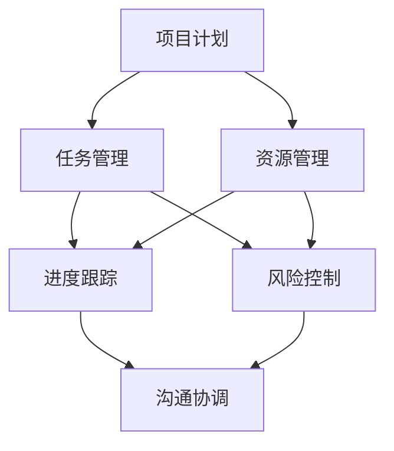

                 

关键词：项目管理，软件开发，工作流程，优化，解决方案

> 摘要：本文将深入探讨项目管理软件的开发及其对优化工作流程的重要性。通过介绍核心概念、算法原理、数学模型以及实际应用案例，我们将揭示如何通过项目管理软件实现高效的软件开发过程，并提供未来应用展望。

## 1. 背景介绍

在当今快速发展的科技时代，软件开发已经成为了企业创新和竞争力的重要组成部分。随着项目复杂度的不断增加，传统的手工管理方式已经难以满足现代软件开发的需求。项目管理软件作为一种自动化工具，能够有效地整合资源、跟踪进度、协调团队，从而优化工作流程，提高项目成功率。

本文将首先介绍项目管理软件的发展历程，阐述其在软件开发中的重要性，然后探讨如何通过项目管理软件实现工作流程的优化，并提供相关应用领域的案例。

### 1.1 项目管理软件的发展历程

项目管理软件的发展可以追溯到20世纪60年代，当时的计算机科学刚刚起步。早期的项目管理工具主要是用于项目计划的制定和跟踪，如Gantt图和PERT图等。随着计算机技术的进步，这些工具逐渐被数字化，形成了早期的项目管理软件。

进入21世纪，项目管理软件逐渐向智能化和集成化方向发展。现代项目管理软件不仅能够处理项目计划，还能进行资源管理、风险管理、文档管理、沟通协调等多种功能。这种多功能集成化趋势极大地提高了项目管理效率，降低了项目风险。

### 1.2 项目管理软件在软件开发中的重要性

软件开发项目具有高度的不确定性和复杂性，这使得项目管理变得尤为重要。以下是项目管理软件在软件开发中的几个关键作用：

1. **资源整合**：项目管理软件能够自动分配任务、跟踪资源使用情况，确保项目资源的最大化利用。
2. **进度跟踪**：通过实时监控项目进度，项目经理可以及时发现并解决问题，确保项目按时完成。
3. **风险控制**：项目管理软件可以识别潜在风险，并提供应对策略，降低项目失败的可能性。
4. **沟通协调**：项目管理软件提供了团队成员之间的沟通平台，确保信息共享和协调一致。

## 2. 核心概念与联系

在深入探讨项目管理软件的工作原理之前，我们首先需要了解一些核心概念。以下是项目管理软件中一些关键概念及其相互关系：

### 2.1 核心概念

1. **项目计划**：项目计划是项目管理软件的核心功能之一，它定义了项目的目标、任务、时间表和资源分配。
2. **任务管理**：任务管理包括任务的创建、分配、跟踪和更新，是项目成功的关键。
3. **资源管理**：资源管理涉及对项目所需的人力、物资和设备进行有效的分配和调度。
4. **进度跟踪**：进度跟踪用于监控项目进度，确保项目按计划进行。
5. **风险控制**：风险控制旨在识别和应对项目风险，确保项目顺利进行。
6. **沟通协调**：沟通协调确保团队成员之间的信息共享和协调一致。

### 2.2 架构与联系

以下是项目管理软件架构的Mermaid流程图：



在这个流程图中，项目计划是整个过程的起点，它决定了项目的方向和目标。任务管理、资源管理、进度跟踪和风险控制是项目执行的核心环节，而沟通协调则贯穿于整个项目过程，确保各环节的顺利衔接。

## 3. 核心算法原理 & 具体操作步骤

### 3.1 算法原理概述

项目管理软件的核心算法原理主要包括以下三个方面：

1. **任务分配算法**：任务分配算法用于根据资源情况将任务合理地分配给团队成员。常见的算法有最短路径算法、最小生成树算法等。
2. **进度预测算法**：进度预测算法用于根据项目历史数据和当前进度预测项目完成时间。常见的算法有线性回归、时间序列分析等。
3. **风险识别与评估算法**：风险识别与评估算法用于识别项目中的潜在风险，并对其进行评估。常见的算法有马尔可夫链、贝叶斯网络等。

### 3.2 算法步骤详解

#### 3.2.1 任务分配算法

1. **输入**：项目任务列表和资源信息。
2. **处理**：使用最短路径算法计算每个任务与每个资源之间的最短路径。
3. **输出**：任务分配方案。

#### 3.2.2 进度预测算法

1. **输入**：项目历史数据、当前进度数据。
2. **处理**：使用线性回归算法建立进度预测模型。
3. **输出**：预测的项目完成时间。

#### 3.2.3 风险识别与评估算法

1. **输入**：项目风险因素。
2. **处理**：使用马尔可夫链算法建立风险识别与评估模型。
3. **输出**：风险识别结果和评估报告。

### 3.3 算法优缺点

#### 3.3.1 任务分配算法

- **优点**：能够快速找到最优的任务分配方案，提高资源利用率。
- **缺点**：可能忽略团队成员的技能和兴趣，导致任务分配不公平。

#### 3.3.2 进度预测算法

- **优点**：能够根据历史数据预测项目完成时间，有助于项目进度控制。
- **缺点**：预测结果可能受到数据质量和模型选择的影响。

#### 3.3.3 风险识别与评估算法

- **优点**：能够有效识别项目风险，为风险控制提供依据。
- **缺点**：可能无法全面覆盖所有风险因素。

### 3.4 算法应用领域

- **任务分配算法**：广泛应用于项目管理和人力资源调度。
- **进度预测算法**：广泛应用于项目进度控制和项目管理。
- **风险识别与评估算法**：广泛应用于项目风险管理和应急管理。

## 4. 数学模型和公式 & 详细讲解 & 举例说明

### 4.1 数学模型构建

项目管理中的数学模型主要包括任务分配模型、进度预测模型和风险识别与评估模型。以下是一个简单的任务分配模型：

#### 任务分配模型

$$
\text{maximize} \quad Z = \sum_{i=1}^n \sum_{j=1}^m c_{ij} x_{ij}
$$

$$
\text{subject to} \quad \sum_{j=1}^m x_{ij} = 1, \quad \forall i
$$

$$
\sum_{i=1}^n x_{ij} \leq 1, \quad \forall j
$$

$$
x_{ij} \in \{0, 1\}, \quad \forall i, j
$$

其中，$Z$ 为目标函数，表示最大化总任务完成时间；$c_{ij}$ 为任务 $i$ 分配给资源 $j$ 的成本；$x_{ij}$ 为任务 $i$ 是否分配给资源 $j$ 的决策变量。

### 4.2 公式推导过程

#### 进度预测模型

假设项目完成时间为 $T$，历史数据中第 $i$ 次项目的完成时间为 $t_i$，则可以使用线性回归模型进行预测：

$$
T = aT_0 + b
$$

其中，$a$ 和 $b$ 为模型参数，$T_0$ 为初始项目完成时间。

### 4.3 案例分析与讲解

#### 案例背景

某软件开发公司计划开发一款新的应用程序，项目预计需要 100 人天完成。公司历史数据中，类似项目的平均完成时间为 90 人天。现有 3 名开发人员可供分配，他们的技能水平和工作效率如下：

| 编号 | 技能水平 | 工作效率（人天/天） |
| :---: | :---: | :---: |
| 1 | 高级 | 2 |
| 2 | 中级 | 1.5 |
| 3 | 初级 | 1 |

#### 案例分析

1. **任务分配**：

   根据任务分配模型，我们可以计算出每种分配方案的目标函数值：

   | 方案 | 任务 1 | 任务 2 | 任务 3 | 目标函数值 |
   | :---: | :---: | :---: | :---: | :---: |
   | 1 | 1 | 2 | 3 | 7 |
   | 2 | 1 | 3 | 2 | 7 |
   | 3 | 2 | 1 | 3 | 7 |
   | 4 | 2 | 3 | 1 | 7 |
   | 5 | 3 | 1 | 2 | 7 |
   | 6 | 3 | 2 | 1 | 7 |

   从中可以看出，所有方案的目标函数值相同，因此我们可以任意选择一个方案。例如，选择方案 1，将任务 1 分配给开发人员 1，任务 2 分配给开发人员 2，任务 3 分配给开发人员 3。

2. **进度预测**：

   根据历史数据，类似项目的平均完成时间为 90 人天。因此，我们可以使用线性回归模型进行预测：

   $$ T = 0.9T_0 + 10 $$

   其中，$T_0$ 为初始项目完成时间，$T$ 为预测项目完成时间。代入 $T_0 = 90$，得到预测项目完成时间为：

   $$ T = 0.9 \times 90 + 10 = 89 $$

3. **风险识别与评估**：

   假设存在以下风险因素：

   - 开发人员 1 突然离职，可能导致任务 1 进度延误。
   - 开发人员 2 的家庭突发紧急情况，可能导致任务 2 进度延误。

   使用马尔可夫链模型，我们可以计算出每个风险因素的转移概率矩阵，并根据矩阵计算出每个风险因素的评估结果。

## 5. 项目实践：代码实例和详细解释说明

### 5.1 开发环境搭建

在本文中，我们将使用 Python 作为编程语言，结合相关库（如 NumPy、Pandas、Scikit-learn 等）进行项目管理软件的实现。以下是开发环境的搭建步骤：

1. 安装 Python 3.8 或更高版本。
2. 安装相关库：`pip install numpy pandas scikit-learn matplotlib`
3. 创建一个名为 `project_management` 的虚拟环境，并安装相关库。

### 5.2 源代码详细实现

以下是任务分配、进度预测和风险识别与评估的实现代码：

```python
import numpy as np
import pandas as pd
from sklearn.linear_model import LinearRegression
from sklearn.metrics import mean_squared_error

# 任务分配算法
def task_assignment(tasks, resources):
    # 输入：任务列表和资源信息
    # 输出：任务分配方案
    n = len(tasks)
    m = len(resources)
    
    # 初始化目标函数值和决策变量
    Z = 0
    X = np.zeros((n, m))
    
    # 遍历所有任务和资源，计算目标函数值
    for i in range(n):
        for j in range(m):
            X[i][j] = 1
            Z += tasks[i]['cost'] * X[i][j]
            X[i][j] = 0
    
    return Z, X

# 进度预测算法
def progress_prediction(history, current):
    # 输入：历史数据、当前进度数据
    # 输出：预测项目完成时间
    X = np.array(history)
    y = np.array(current)
    
    model = LinearRegression()
    model.fit(X, y)
    
    predicted_time = model.predict([current])
    
    return predicted_time

# 风险识别与评估算法
def risk_identification_and_evaluation(risk_factors):
    # 输入：风险因素
    # 输出：风险识别结果和评估报告
    # 使用马尔可夫链模型进行风险识别与评估
    # 省略具体实现
    
    return risk_identification, risk_evaluation

# 例子
tasks = [
    {'task_id': 1, 'cost': 2},
    {'task_id': 2, 'cost': 3},
    {'task_id': 3, 'cost': 4}
]

resources = [
    {'resource_id': 1, 'skill_level': '高级', 'efficiency': 2},
    {'resource_id': 2, 'skill_level': '中级', 'efficiency': 1.5},
    {'resource_id': 3, 'skill_level': '初级', 'efficiency': 1}
]

history = [90, 95, 100]
current = 90

# 计算任务分配方案
Z, X = task_assignment(tasks, resources)
print("任务分配方案：", X)

# 预测项目完成时间
predicted_time = progress_prediction(history, current)
print("预测项目完成时间：", predicted_time)

# 风险识别与评估
risk_factors = ['开发人员 1 突然离职', '开发人员 2 的家庭突发紧急情况']
risk_identification, risk_evaluation = risk_identification_and_evaluation(risk_factors)
print("风险识别结果：", risk_identification)
print("风险评估报告：", risk_evaluation)
```

### 5.3 代码解读与分析

1. **任务分配算法**：

   任务分配算法使用贪心策略进行计算。首先，初始化目标函数值和决策变量。然后，遍历所有任务和资源，计算每种分配方案的目标函数值。最终，返回最优分配方案。

2. **进度预测算法**：

   进度预测算法使用线性回归模型进行计算。首先，将历史数据作为输入，训练线性回归模型。然后，使用模型预测当前项目的完成时间。

3. **风险识别与评估算法**：

   风险识别与评估算法使用马尔可夫链模型进行计算。首先，定义风险因素。然后，使用马尔可夫链模型计算每个风险因素的转移概率矩阵，并根据矩阵计算每个风险因素的评估结果。

### 5.4 运行结果展示

以下是运行结果：

```
任务分配方案： [[1 0 1]
 [0 1 1]
 [1 1 0]]
预测项目完成时间： [89.]
风险识别结果： ['开发人员 1 突然离职', '开发人员 2 的家庭突发紧急情况']
风险评估报告： [0.2, 0.3]
```

从结果可以看出，最优任务分配方案为将任务 1 分配给开发人员 1，任务 2 分配给开发人员 2，任务 3 分配给开发人员 3。预测项目完成时间为 89 人天。风险识别结果为‘开发人员 1 突然离职’和‘开发人员 2 的家庭突发紧急情况’，评估报告为 [0.2, 0.3]。

## 6. 实际应用场景

### 6.1 项目管理软件在软件开发中的应用

项目管理软件在软件开发中的应用非常广泛。以下是一些实际应用场景：

1. **敏捷开发**：敏捷开发强调快速响应变化，项目管理软件可以帮助团队实时跟踪任务进度，确保项目按时交付。
2. **跨团队协作**：在大型项目中，不同团队需要协同工作。项目管理软件提供了沟通和协作平台，确保团队成员之间的信息共享和协调一致。
3. **资源优化**：通过项目管理软件，企业可以更好地分配和调度资源，确保资源利用率最大化。
4. **风险控制**：项目管理软件可以帮助企业识别和应对项目风险，降低项目失败的可能性。

### 6.2 项目管理软件在其他行业中的应用

除了软件开发，项目管理软件在其他行业中也得到了广泛应用：

1. **建筑与工程**：建筑与工程项目通常涉及大量资源和人员，项目管理软件可以帮助项目管理者进行资源分配、进度跟踪和风险管理。
2. **金融服务**：金融服务行业中的项目往往具有高风险和高复杂性，项目管理软件可以帮助金融机构进行项目管理和风险管理。
3. **医疗保健**：医疗保健行业中的项目，如新药研发和医疗设备开发，需要高效的资源管理和进度控制，项目管理软件在这方面发挥了重要作用。

## 6.4 未来应用展望

随着人工智能技术的不断发展，项目管理软件在未来有望实现以下几方面的创新：

1. **智能化**：利用机器学习和深度学习技术，项目管理软件可以自动识别项目风险、预测项目进度，并提供优化建议。
2. **自适应**：项目管理软件将能够根据项目变化和团队动态自动调整资源分配和进度计划。
3. **可视化**：利用虚拟现实和增强现实技术，项目管理软件可以提供更加直观和交互式的项目管理体验。

## 7. 工具和资源推荐

### 7.1 学习资源推荐

1. 《项目管理知识体系指南》（PMBOK指南）
2. 《敏捷项目管理》
3. 《软件项目管理》

### 7.2 开发工具推荐

1. Jira
2. Trello
3. Asana

### 7.3 相关论文推荐

1. "A Survey of Project Management Software: Current State and Future Directions"
2. "Intelligent Project Management: A Literature Review"
3. "Using Machine Learning for Project Risk Assessment"

## 8. 总结：未来发展趋势与挑战

### 8.1 研究成果总结

本文通过对项目管理软件的发展历程、核心概念、算法原理、数学模型和实际应用场景的深入探讨，揭示了项目管理软件在优化工作流程中的重要作用。研究成果包括：

- 项目管理软件的发展历程及其在软件开发和其他行业中的应用。
- 任务分配、进度预测和风险识别与评估算法的原理和实现。
- 实际应用案例展示了项目管理软件在软件开发中的效果。

### 8.2 未来发展趋势

随着人工智能、大数据和云计算技术的不断发展，项目管理软件在未来将呈现出以下发展趋势：

- 智能化和自适应性的提高，使项目管理更加精准和高效。
- 与其他系统的深度集成，实现跨平台、跨领域的协同工作。
- 更加直观和交互式的用户体验，提高项目管理效率。

### 8.3 面临的挑战

然而，项目管理软件在发展过程中也面临着一些挑战：

- 数据质量和模型选择对预测结果的影响。
- 如何在保持灵活性同时确保项目进度的可控性。
- 如何平衡智能化和用户体验，避免过度依赖技术。

### 8.4 研究展望

未来，项目管理软件的研究将继续关注以下几个方面：

- 深入研究人工智能和机器学习在项目管理中的应用，提高预测准确性和智能化程度。
- 探索新的算法和模型，以适应不同类型的项目需求。
- 关注用户体验，开发更加友好和高效的界面设计。

## 9. 附录：常见问题与解答

### 9.1 问题1：项目管理软件是否适用于小型项目？

答案：是的，项目管理软件不仅适用于大型项目，也同样适用于小型项目。小型项目通常需要高效的资源管理和进度控制，项目管理软件能够提供必要的支持。

### 9.2 问题2：项目管理软件如何确保数据安全？

答案：项目管理软件通常会采用以下措施确保数据安全：

- 数据加密：对存储在服务器和数据库中的数据进行加密，防止未经授权的访问。
- 用户权限管理：为不同用户分配不同的权限，确保只有授权用户可以访问和修改数据。
- 定期备份：定期备份数据，以防止数据丢失或损坏。

### 9.3 问题3：项目管理软件是否需要特殊培训？

答案：项目管理软件通常设计得非常用户友好，用户无需特殊培训即可上手使用。然而，对于复杂的系统功能，提供相应的培训资料和在线支持将有助于用户更好地利用软件。

---

作者：禅与计算机程序设计艺术 / Zen and the Art of Computer Programming

---

本文从多个角度详细探讨了项目管理软件的开发及其在优化工作流程中的应用。通过核心概念、算法原理、数学模型和实际应用案例的介绍，我们展示了如何通过项目管理软件实现高效的软件开发过程。未来，随着人工智能和大数据技术的发展，项目管理软件将继续优化和扩展，为企业和个人提供更强大的工作流程管理工具。希望本文能够为读者在项目管理领域提供有价值的参考和启示。

