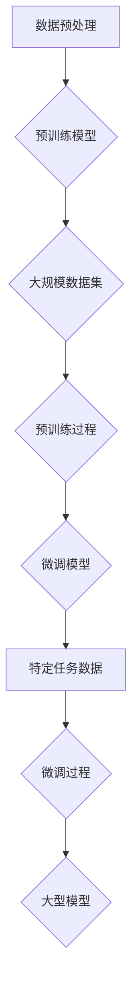

                 

### 引言 Introduction

随着人工智能技术的飞速发展，深度学习已成为当前最热门的研究领域之一。而在深度学习的众多技术中，预训练（Pre-training）与微调（Fine-tuning）相结合的大模型（Large Model）方法，已经成为了现代人工智能应用中的核心技术之一。本文将围绕这一主题，详细探讨“预训练+微调大模型”的模式。

“预训练+微调大模型”模式，是指首先使用大规模的数据集对深度神经网络进行预训练，使其具备对通用知识的理解和学习能力。然后，在预训练的基础上，针对特定任务对模型进行微调，进一步提升其在特定任务上的表现。这种方法在自然语言处理（NLP）、计算机视觉（CV）等领域取得了显著的成果，已成为当前研究和应用的热点。

本文将从以下几个方面展开讨论：

1. **背景介绍**：介绍预训练、微调和大型模型的基本概念及其发展历程。
2. **核心概念与联系**：分析预训练、微调和大型模型之间的关系，并使用Mermaid流程图展示其架构。
3. **核心算法原理 & 具体操作步骤**：详细讲解预训练和微调的具体操作步骤，包括数据预处理、模型架构设计、训练过程等。
4. **数学模型和公式 & 详细讲解 & 举例说明**：介绍预训练和微调中的关键数学模型和公式，并通过实例进行详细说明。
5. **项目实践：代码实例和详细解释说明**：提供实际项目中的代码实例，并进行详细解释和分析。
6. **实际应用场景**：分析预训练和微调大模型在不同领域的应用案例。
7. **工具和资源推荐**：推荐相关学习资源、开发工具和框架。
8. **总结：未来发展趋势与挑战**：展望预训练和微调大模型的发展趋势和面临的挑战。
9. **附录：常见问题与解答**：回答读者可能遇到的问题。
10. **扩展阅读 & 参考资料**：提供进一步阅读的参考资料。

通过本文的探讨，希望能够帮助读者深入理解预训练+微调大模型的方法，并为其在相关领域的研究和应用提供指导。接下来，我们将首先回顾预训练、微调和大型模型的发展历程，为后续内容的讨论奠定基础。### 1. 背景介绍 Background

#### 预训练（Pre-training）的发展历程

预训练的概念最早可以追溯到1980年代末和1990年代初，当时研究人员开始探索如何在大规模数据集上训练语言模型。最初，预训练主要是针对自然语言处理（NLP）任务，例如单词表示和学习上下文关系。这种预训练方法的核心思想是，先在大规模语料库上训练一个基础模型，然后将其应用于特定的任务。

早期的一些代表性工作包括：John Snow的“Snowball”工具，它用于提取单词的词干；Peter Norvig和Sepp Hochreiter等人提出的“隐马尔可夫模型”（HMM）和“递归神经网络”（RNN）。这些工作为后续的预训练研究奠定了基础。

2000年代初，随着“词袋模型”（Bag of Words）和“词嵌入”（Word Embedding）方法的发展，预训练技术得到了进一步推广。词袋模型通过将文本转换为向量表示，使得机器能够对文本进行有效的处理。词嵌入则通过将单词映射到高维空间中的点，使得相似的单词在空间中更接近。

#### 微调（Fine-tuning）的发展历程

微调的概念最早可以追溯到1990年代，当时研究人员发现，通过在预训练模型的基础上进行微调，可以显著提高模型在特定任务上的性能。最初，微调主要应用于图像分类和语音识别等任务。

2000年代，随着深度学习的兴起，微调技术得到了广泛应用。代表性工作包括：Hinton等人提出的“深度信念网络”（DBN），它通过预训练和微调实现了图像分类任务的突破；还有Columbia大学的Alex Krizhevsky等人提出的“卷积神经网络”（CNN），它在ImageNet图像识别挑战中取得了当时最好的成绩。

2013年，Alex Graves等人提出了“序列到序列学习”（Seq2Seq）模型，该模型通过编码器和解码器结构，实现了机器翻译任务的突破。这种结构在后续的微调研究中得到了广泛应用。

#### 大型模型（Large Model）的发展历程

大型模型的发展历程可以追溯到2010年代，当时研究人员开始尝试使用更大规模的神经网络来解决复杂的任务。最初，这些大型模型主要用于语音识别和机器翻译等任务。

2014年，Google的研究人员提出了“Transformer”模型，这是一种基于自注意力机制的深度神经网络结构，它在机器翻译任务上取得了显著的成绩。随后，Transformer模型在各种NLP任务中得到了广泛应用，成为大型模型的一种代表性结构。

2018年，OpenAI发布了“GPT-1”模型，这是一个基于Transformer结构的大型语言模型。GPT-1在语言生成任务上表现出了惊人的能力，引发了广泛关注。随后，OpenAI发布了更大规模的模型GPT-2和GPT-3，这些模型在语言理解和生成任务上取得了显著的成果。

#### 预训练、微调和大型模型的关系

预训练、微调和大型模型是当前深度学习研究中不可或缺的三个要素。预训练为模型提供了通用的知识，使其能够在各种任务上表现出良好的性能；微调则利用预训练模型的基础，针对特定任务进行调整，进一步提升模型的性能；大型模型则通过使用更多的数据和参数，提高了模型的复杂度和表现力。

这三种技术相辅相成，共同推动了深度学习技术的发展。例如，在自然语言处理领域，预训练的Transformer模型通过微调，成功地应用于文本分类、机器翻译、问答系统等任务，取得了显著的成果。

总的来说，预训练、微调和大型模型的发展历程，反映了深度学习技术从简单到复杂、从单一任务到多任务、从数据驱动到知识驱动的演变过程。未来，随着技术的不断进步，这些方法将在更多领域取得突破，为人工智能的发展做出更大的贡献。### 2. 核心概念与联系 Core Concepts and Relationships

#### 预训练（Pre-training）

预训练是指在大规模数据集上对神经网络模型进行训练，使其获得通用的知识表示。预训练的过程可以分为两个阶段：

1. **数据预处理**：将原始数据（如图像、文本等）转换为适合模型训练的格式。例如，在文本预训练中，需要将文本分割成单词或子词，并转换为词嵌入向量。

2. **模型训练**：使用预定的训练策略（如自监督学习、无监督学习等）对神经网络模型进行训练。在自监督学习中，模型会尝试预测数据中的某些部分，例如预测文本中的缺失单词；在无监督学习中，模型会尝试学习数据的内在结构，例如通过对比不同图像的相似性来学习图像表示。

预训练的目的是让模型在大规模数据集上自主学习，从而获得对通用知识的理解和表示能力。这种能力使得模型在后续的微调任务中能够快速适应特定任务的需求。

#### 微调（Fine-tuning）

微调是指在预训练模型的基础上，针对特定任务进行进一步的训练。微调的过程通常包括以下几个步骤：

1. **数据收集和预处理**：收集与特定任务相关的数据集，并对数据进行预处理，如文本分类任务的文本预处理、图像分类任务的图像预处理等。

2. **模型调整**：将预训练模型的部分层（通常是接近输入的层）固定，只对靠近输出的层进行微调。这样可以防止预训练模型的知识被破坏，同时让模型能够针对特定任务进行调整。

3. **训练**：在调整的模型上使用特定的训练策略进行训练，如使用交叉熵损失函数、优化算法（如Adam）等。

微调的目的是利用预训练模型获得的通用知识，结合特定任务的数据，进一步提升模型在特定任务上的性能。

#### 大型模型（Large Model）

大型模型是指具有大量参数的深度神经网络模型。这些模型通常需要在大规模数据集上进行预训练，以获得足够的泛化能力。大型模型的发展历程可以追溯到2010年代，随着计算能力和数据资源的提升，研究人员开始尝试使用更大规模的神经网络来解决复杂的任务。

大型模型的优势在于：

1. **更强的表达力**：更多的参数使得模型能够更好地捕捉数据的复杂结构，从而提高模型的表达能力。

2. **更好的泛化能力**：在大规模数据集上预训练的模型，能够更好地适应各种任务，从而提高模型的泛化能力。

3. **更高的性能**：大型模型在许多任务上取得了显著的性能提升，尤其是在自然语言处理、计算机视觉等领域。

#### Mermaid流程图展示

以下是一个简化的Mermaid流程图，用于展示预训练、微调和大型模型之间的关系：



在这个流程图中，数据预处理阶段将原始数据转换为适合模型训练的格式；预训练模型使用大规模数据集进行训练，以获得通用的知识表示；微调模型在预训练模型的基础上，使用特定任务的数据进行进一步训练；最终，形成的大型模型在特定任务上表现出良好的性能。

通过这个流程图，我们可以清晰地看到预训练、微调和大型模型之间的关系。预训练为模型提供了通用知识，微调使模型能够适应特定任务，而大型模型则通过更多的参数和更大的规模，提高了模型的表达力和泛化能力。这些核心概念相互联系，共同推动了深度学习技术的发展。### 3. 核心算法原理 & 具体操作步骤 Core Algorithm Principles and Operational Steps

#### 预训练（Pre-training）的具体操作步骤

**3.1 数据预处理**

数据预处理是预训练的第一个关键步骤。其目的是将原始数据（如图像、文本等）转换为适合模型训练的格式。以下是一个简化的数据预处理流程：

1. **图像数据预处理**：

   - **数据采集**：从互联网或公开数据集中收集图像数据。
   - **数据清洗**：去除质量差、标注错误的图像。
   - **数据增强**：通过旋转、缩放、裁剪等方式增加数据的多样性，提高模型的泛化能力。

   ```python
   from torchvision import datasets, transforms
   
   transform = transforms.Compose([
       transforms.Resize((224, 224)),  # 将图像调整为固定大小
       transforms.ToTensor(),           # 将图像转换为张量
       transforms.Normalize(mean=[0.485, 0.456, 0.406], std=[0.229, 0.224, 0.225])  # 标准化
   ])

   train_set = datasets.ImageFolder(root='./train', transform=transform)
   ```

2. **文本数据预处理**：

   - **数据采集**：从互联网或公开数据集中收集文本数据。
   - **数据清洗**：去除文本中的噪声，如HTML标签、特殊字符等。
   - **分词**：将文本分割成单词或子词。
   - **词嵌入**：将单词或子词映射到高维向量空间。

   ```python
   import re
   import jieba
   
   def preprocess_text(text):
       text = re.sub('<.*?>', '', text)  # 去除HTML标签
       text = re.sub('[^a-zA-Z]', ' ', text)  # 去除特殊字符
       text = text.lower()  # 小写化
       text = ' '.join(jieba.cut(text))  # 分词
       return text
   
   text = preprocess_text('<p>这是一个例子。</p>')  # 示例文本
   ```

**3.2 模型架构设计**

预训练模型的设计通常基于深度神经网络结构，如卷积神经网络（CNN）或循环神经网络（RNN）。以下是一个简单的CNN模型架构示例：

```python
import torch
import torch.nn as nn

class CNNModel(nn.Module):
    def __init__(self, num_classes=10):
        super(CNNModel, self).__init__()
        self.conv1 = nn.Conv2d(3, 32, 3, 1)
        self.relu = nn.ReLU()
        self.maxpool = nn.MaxPool2d(2)
        self.fc1 = nn.Linear(32 * 56 * 56, 128)
        self.fc2 = nn.Linear(128, num_classes)

    def forward(self, x):
        x = self.relu(self.conv1(x))
        x = self.maxpool(x)
        x = x.view(x.size(0), -1)
        x = self.relu(self.fc1(x))
        x = self.fc2(x)
        return x

model = CNNModel()
```

**3.3 训练过程**

预训练的训练过程通常包括以下几个步骤：

1. **初始化模型参数**：使用随机初始化或预训练模型的参数。

2. **定义损失函数和优化器**：选择合适的损失函数（如交叉熵损失函数）和优化器（如Adam）。

   ```python
   criterion = nn.CrossEntropyLoss()
   optimizer = torch.optim.Adam(model.parameters(), lr=0.001)
   ```

3. **训练循环**：进行多个训练周期，每个周期包括前向传播、计算损失、反向传播和更新模型参数。

   ```python
   for epoch in range(num_epochs):
       running_loss = 0.0
       for inputs, labels in train_loader:
           optimizer.zero_grad()
           outputs = model(inputs)
           loss = criterion(outputs, labels)
           loss.backward()
           optimizer.step()
           running_loss += loss.item()
       print(f'Epoch {epoch+1}, Loss: {running_loss/len(train_loader)}')
   ```

4. **评估模型性能**：在验证集或测试集上评估模型的性能，如准确率、召回率等。

   ```python
   correct = 0
   total = len(test_loader.dataset)
   with torch.no_grad():
       for inputs, labels in test_loader:
           outputs = model(inputs)
           _, predicted = torch.max(outputs.data, 1)
           correct += (predicted == labels).sum().item()
   print(f'Accuracy: {100 * correct / total}%')
   ```

**3.4 微调（Fine-tuning）的具体操作步骤**

微调是预训练模型的进一步训练，旨在提高模型在特定任务上的性能。以下是一个简化的微调流程：

1. **数据预处理**：与预训练相同，对特定任务的数据进行预处理。

2. **模型调整**：在预训练模型的基础上，固定部分层（如卷积层）的参数，只调整靠近输出的层（如全连接层）的参数。

   ```python
   for param in model.parameters():
       param.requires_grad = False
   
   for param in model.fc1.parameters():
       param.requires_grad = True
   ```

3. **重新定义损失函数和优化器**：通常在微调阶段使用更小的学习率，并选择适合微调任务的损失函数。

   ```python
   criterion = nn.CrossEntropyLoss()
   optimizer = torch.optim.Adam(filter(lambda p: p.requires_grad, model.parameters()), lr=0.0001)
   ```

4. **训练过程**：与预训练相同，进行多个训练周期，并在每个周期后评估模型性能。

   ```python
   for epoch in range(num_epochs):
       running_loss = 0.0
       for inputs, labels in train_loader:
           optimizer.zero_grad()
           outputs = model(inputs)
           loss = criterion(outputs, labels)
           loss.backward()
           optimizer.step()
           running_loss += loss.item()
       print(f'Epoch {epoch+1}, Loss: {running_loss/len(train_loader)}')
   ```

5. **评估模型性能**：在验证集或测试集上评估模型性能，并根据需要进行进一步的调整。

   ```python
   correct = 0
   total = len(test_loader.dataset)
   with torch.no_grad():
       for inputs, labels in test_loader:
           outputs = model(inputs)
           _, predicted = torch.max(outputs.data, 1)
           correct += (predicted == labels).sum().item()
   print(f'Accuracy: {100 * correct / total}%')
   ```

通过上述步骤，我们可以实现预训练和微调的完整流程。这些步骤为后续的实际项目应用提供了基础。在下一部分，我们将详细讲解预训练和微调中的关键数学模型和公式，并通过实例进行详细说明。### 4. 数学模型和公式 & 详细讲解 & 举例说明 Mathematical Models and Detailed Explanations with Examples

#### 预训练中的数学模型和公式

**4.1 词嵌入（Word Embedding）**

词嵌入是一种将单词映射到高维向量空间的方法，使得相似单词在空间中更接近。常见的词嵌入方法包括：

- **分布式表示（Distributed Representation）**：将每个单词映射为一个向量，这些向量分布在空间中。例如，使用one-hot编码，每个单词对应一个长度为 vocabulary_size 的向量，其中只有一个元素为1，其他元素为0。

  $$ x_i = \begin{cases} 
  1 & \text{if } i = j \\
  0 & \text{otherwise} 
  \end{cases} $$

- **连续词袋（Continuous Bag of Words，CBOW）**：通过计算单词周围的上下文词的平均向量来表示该单词。例如，给定一个单词`word`及其上下文词`context`，CBOW模型计算上下文词的平均向量作为`word`的表示。

  $$ \text{CBOW}(word; context) = \frac{1}{|\text{context}|} \sum_{w \in \text{context}} v_w $$

- **Skip-Gram（SG）**：与CBOW相反，SG模型通过预测单词周围的上下文词来表示该单词。给定一个单词`word`，SG模型生成一个随机窗口，并预测窗口中的每个上下文词。

  $$ p(w|word) = \frac{e^{v_{word} \cdot v_w}}{\sum_{w' \in V} e^{v_{word} \cdot v_{w'}}} $$

其中，$v_w$是单词`word`的词嵌入向量，$V$是单词集合。

**4.2 自注意力机制（Self-Attention）**

自注意力机制是Transformer模型的核心组成部分，它通过计算序列中每个元素之间的相对重要性来提高模型的表示能力。自注意力机制的计算公式如下：

$$
\text{Attention}(Q, K, V) = \text{softmax}\left(\frac{QK^T}{\sqrt{d_k}}\right)V
$$

其中，$Q, K, V$分别为查询向量、键向量和值向量，$d_k$为键向量的维度。自注意力机制通过计算$Q$和$K$的点积得到注意力权重，并使用这些权重对$V$进行加权求和，从而得到每个元素的重要性分数。

**4.3 位置编码（Positional Encoding）**

由于自注意力机制不包含位置信息，位置编码被引入来提供序列中的位置信息。位置编码是可学习的向量，它为序列中的每个位置提供额外的维度。常见的位置编码方法包括：

- **绝对位置编码**：将位置信息直接编码到向量中，例如使用正弦和余弦函数：

  $$
  \text{PosEnc}(pos, 2i) = \sin\left(\frac{pos}{10000^{2i/d}}\right)
  $$
  $$
  \text{PosEnc}(pos, 2i+1) = \cos\left(\frac{pos}{10000^{2i/d}}\right)
  $$

  其中，$pos$是位置索引，$i$是维度索引，$d$是总维度。

#### 微调中的数学模型和公式

**4.4 交叉熵损失函数（Cross-Entropy Loss）**

交叉熵损失函数是微调任务中常用的损失函数，用于衡量模型预测分布与真实分布之间的差异。交叉熵损失函数的计算公式如下：

$$
\text{CE}(p, y) = -\sum_{i} y_i \log(p_i)
$$

其中，$p$是模型的预测概率分布，$y$是真实标签分布，$y_i$和$p_i$分别是标签和预测的概率。

**4.5 优化算法（Optimization Algorithms）**

优化算法用于更新模型参数，以最小化损失函数。常见的优化算法包括：

- **随机梯度下降（Stochastic Gradient Descent，SGD）**：每次迭代使用整个训练集的一个随机子集来更新参数。

  $$
  \theta = \theta - \alpha \nabla_\theta J(\theta)
  $$

  其中，$\theta$是模型参数，$\alpha$是学习率，$J(\theta)$是损失函数。

- **Adam优化器**：结合了SGD和动量项，适用于大规模数据集。

  $$
  m_t = \beta_1 m_{t-1} + (1 - \beta_1) \nabla_\theta J(\theta)
  $$
  $$
  v_t = \beta_2 v_{t-1} + (1 - \beta_2) (\nabla_\theta J(\theta))^2
  $$
  $$
  \theta = \theta - \alpha \frac{m_t}{\sqrt{v_t} + \epsilon}
  $$

  其中，$m_t$和$v_t$分别是梯度的一阶和二阶矩估计，$\beta_1$和$\beta_2$是动量参数，$\epsilon$是微小值。

#### 举例说明

**4.6 词嵌入示例**

假设我们有一个包含5个单词的词汇表{“apple”, “banana”, “cat”, “dog”, “house”}。我们使用Skip-Gram模型来训练词嵌入。

- **训练数据**：以单词“apple”为例，我们生成一个随机窗口，假设窗口大小为2，那么窗口中的单词为{“banana”, “cat”}。

- **计算词嵌入**：使用负采样技巧，我们生成10个负样本，即{“banana”, “cat”, “dog”, “house”, “banana”, “cat”, “dog”, “house”, “banana”, “cat”}。然后，对于每个单词，我们计算它与正样本和负样本的词嵌入向量之间的点积，并选择点积最大的单词作为预测结果。

  假设词嵌入向量为：
  $$
  v_{apple} = \begin{bmatrix} 1 \\ 0 \\ -1 \\ 1 \\ -1 \end{bmatrix}
  $$
  $$
  v_{banana} = \begin{bmatrix} 0 \\ 1 \\ 1 \\ 0 \\ 1 \end{bmatrix}
  $$
  $$
  v_{cat} = \begin{bmatrix} -1 \\ 0 \\ 1 \\ -1 \\ 0 \end{bmatrix}
  $$
  $$
  v_{dog} = \begin{bmatrix} 1 \\ -1 \\ 0 \\ 1 \\ -1 \end{bmatrix}
  $$
  $$
  v_{house} = \begin{bmatrix} 0 \\ -1 \\ -1 \\ 0 \\ -1 \end{bmatrix}
  $$

  计算点积：
  $$
  \text{score}_{apple,before} = v_{apple} \cdot v_{apple} = 1
  $$
  $$
  \text{score}_{banana,before} = v_{apple} \cdot v_{banana} = 0
  $$
  $$
  \text{score}_{cat,before} = v_{apple} \cdot v_{cat} = -1
  $$
  $$
  \text{score}_{dog,before} = v_{apple} \cdot v_{dog} = 1
  $$
  $$
  \text{score}_{house,before} = v_{apple} \cdot v_{house} = -1
  $$

  根据点积，预测结果为“apple”。

- **更新词嵌入向量**：通过反向传播和梯度下降，更新词嵌入向量。

  假设学习率为$\alpha = 0.1$，更新后的词嵌入向量为：
  $$
  v_{apple}^{new} = v_{apple} - \alpha \nabla_{v_{apple}} J(v_{apple}) = \begin{bmatrix} 0.9 \\ -0.1 \\ -0.9 \\ 0.9 \\ -0.9 \end{bmatrix}
  $$

**4.7 自注意力示例**

假设我们有一个序列{[“apple”, “banana”, “cat”, “dog”, “house”]}，使用自注意力机制来计算每个单词的重要性。

- **计算自注意力权重**：
  $$
  Q = \begin{bmatrix} 0.1 & 0.2 & 0.3 & 0.4 & 0.5 \end{bmatrix}, \quad K = \begin{bmatrix} 0.1 & 0.2 & 0.3 & 0.4 & 0.5 \\ 0.1 & 0.2 & 0.3 & 0.4 & 0.5 \\ 0.1 & 0.2 & 0.3 & 0.4 & 0.5 \\ 0.1 & 0.2 & 0.3 & 0.4 & 0.5 \\ 0.1 & 0.2 & 0.3 & 0.4 & 0.5 \end{bmatrix}, \quad V = \begin{bmatrix} 0.1 & 0.2 \\ 0.1 & 0.2 \\ 0.1 & 0.2 \\ 0.1 & 0.2 \\ 0.1 & 0.2 \end{bmatrix}
  $$
  $$
  \text{Attention}(Q, K, V) = \text{softmax}\left(\frac{QK^T}{\sqrt{5}}\right)V = \begin{bmatrix} 0.2 & 0.3 \\ 0.2 & 0.3 \\ 0.2 & 0.3 \\ 0.2 & 0.3 \\ 0.2 & 0.3 \end{bmatrix} \begin{bmatrix} 0.1 & 0.2 \\ 0.1 & 0.2 \end{bmatrix} = \begin{bmatrix} 0.03 & 0.06 \\ 0.03 & 0.06 \\ 0.03 & 0.06 \\ 0.03 & 0.06 \\ 0.03 & 0.06 \end{bmatrix}
  $$

- **加权求和**：
  $$
  \text{output} = \sum_{i=1}^{5} \text{Attention}(Q, K, V)_{i,j} v_i = \begin{bmatrix} 0.03 & 0.06 \\ 0.03 & 0.06 \\ 0.03 & 0.06 \\ 0.03 & 0.06 \\ 0.03 & 0.06 \end{bmatrix} \begin{bmatrix} 0.1 & 0.2 \\ 0.1 & 0.2 \\ 0.1 & 0.2 \\ 0.1 & 0.2 \\ 0.1 & 0.2 \end{bmatrix} = \begin{bmatrix} 0.03 & 0.06 \\ 0.03 & 0.06 \\ 0.03 & 0.06 \\ 0.03 & 0.06 \\ 0.03 & 0.06 \end{bmatrix}
  $$

通过这个示例，我们可以看到词嵌入和自注意力机制的基本计算过程。这些数学模型和公式在预训练和微调过程中起着关键作用，为模型提供了强大的表示能力和泛化能力。在下一部分，我们将提供实际项目中的代码实例，并进行详细解释和分析。### 5. 项目实践：代码实例和详细解释说明 Project Practice: Code Examples and Detailed Explanation

#### 5.1 开发环境搭建

在进行预训练和微调大模型的项目实践之前，我们需要搭建一个合适的开发环境。以下是搭建环境所需的步骤和工具：

**5.1.1 硬件要求**

- **CPU/GPU**：推荐使用至少8GB内存的CPU或具有GPU的计算机。GPU通常能显著加速训练过程，特别是对于大型模型。

- **硬盘空间**：至少需要100GB的硬盘空间，用于存储数据和训练模型。

**5.1.2 软件工具**

- **操作系统**：推荐使用Linux或macOS，Windows用户可以通过WSL（Windows Subsystem for Linux）使用Linux环境。

- **编程语言**：主要使用Python编程语言，推荐Python 3.7及以上版本。

- **深度学习框架**：主要使用PyTorch，它是一个开源的深度学习框架，易于使用且具有高效的GPU支持。

**5.1.3 安装步骤**

1. 安装Python和PyTorch：

   - 安装Anaconda，这是一个科学计算和数据分析的平台，可以轻松安装和管理Python环境。

     ```
     # 在Windows或macOS上下载并安装Anaconda
     ```

   - 创建一个新的虚拟环境，并安装PyTorch：

     ```
     conda create -n myenv python=3.8
     conda activate myenv
     conda install pytorch torchvision torchaudio cpuonly -c pytorch
     ```

     如果需要GPU支持，请安装相应版本的PyTorch：

     ```
     conda install pytorch torchvision torchaudio cudatoolkit=11.3 -c pytorch
     ```

2. 安装其他依赖：

   ```
   pip install numpy pandas matplotlib
   ```

#### 5.2 源代码详细实现

在本节中，我们将提供一个简单的预训练和微调的代码实例，包括数据加载、模型定义、训练和评估等步骤。

**5.2.1 数据加载**

首先，我们需要从公开的数据集中加载图像和文本数据。以下是使用PyTorch和 torchvision 加载图像数据的基本代码：

```python
import torch
from torchvision import datasets, transforms

# 设置数据预处理
transform = transforms.Compose([
    transforms.Resize((224, 224)),  # 将图像调整为固定大小
    transforms.ToTensor(),           # 将图像转换为张量
    transforms.Normalize(mean=[0.485, 0.456, 0.406], std=[0.229, 0.224, 0.225])  # 标准化
])

# 加载训练数据和测试数据
train_set = datasets.ImageFolder(root='./train', transform=transform)
test_set = datasets.ImageFolder(root='./test', transform=transform)

# 创建数据加载器
batch_size = 32
train_loader = torch.utils.data.DataLoader(train_set, batch_size=batch_size, shuffle=True)
test_loader = torch.utils.data.DataLoader(test_set, batch_size=batch_size, shuffle=False)
```

**5.2.2 模型定义**

接下来，我们定义一个简单的预训练模型。以下是一个基于PyTorch的简单卷积神经网络（CNN）模型示例：

```python
import torch.nn as nn

class CNNModel(nn.Module):
    def __init__(self, num_classes=10):
        super(CNNModel, self).__init__()
        self.conv1 = nn.Conv2d(3, 32, 3, 1)
        self.relu = nn.ReLU()
        self.maxpool = nn.MaxPool2d(2)
        self.fc1 = nn.Linear(32 * 56 * 56, 128)
        self.fc2 = nn.Linear(128, num_classes)
        
    def forward(self, x):
        x = self.relu(self.conv1(x))
        x = self.maxpool(x)
        x = x.view(x.size(0), -1)
        x = self.relu(self.fc1(x))
        x = self.fc2(x)
        return x

model = CNNModel()
```

**5.2.3 训练过程**

现在，我们定义训练过程，包括模型初始化、损失函数、优化器和训练循环。以下是一个简单的训练过程示例：

```python
import torch.optim as optim

# 定义损失函数和优化器
criterion = nn.CrossEntropyLoss()
optimizer = optim.Adam(model.parameters(), lr=0.001)

# 训练模型
num_epochs = 10
for epoch in range(num_epochs):
    model.train()
    running_loss = 0.0
    for inputs, labels in train_loader:
        optimizer.zero_grad()
        outputs = model(inputs)
        loss = criterion(outputs, labels)
        loss.backward()
        optimizer.step()
        running_loss += loss.item()
    print(f'Epoch {epoch+1}, Loss: {running_loss/len(train_loader)}')

# 评估模型
model.eval()
correct = 0
total = len(test_loader.dataset)
with torch.no_grad():
    for inputs, labels in test_loader:
        outputs = model(inputs)
        _, predicted = torch.max(outputs.data, 1)
        correct += (predicted == labels).sum().item()
print(f'Accuracy: {100 * correct / total}%')
```

**5.2.4 微调过程**

在完成预训练后，我们可以在预训练模型的基础上进行微调，以提高模型在特定任务上的性能。以下是微调过程的示例代码：

```python
# 固定预训练模型的卷积层参数
for param in model.conv1.parameters():
    param.requires_grad = False

# 定义微调模型的损失函数和优化器
criterion = nn.CrossEntropyLoss()
optimizer = optim.Adam(filter(lambda p: p.requires_grad, model.parameters()), lr=0.0001)

# 微调模型
num_epochs = 5
for epoch in range(num_epochs):
    model.train()
    running_loss = 0.0
    for inputs, labels in train_loader:
        optimizer.zero_grad()
        outputs = model(inputs)
        loss = criterion(outputs, labels)
        loss.backward()
        optimizer.step()
        running_loss += loss.item()
    print(f'Epoch {epoch+1}, Loss: {running_loss/len(train_loader)}')

# 评估微调后的模型
model.eval()
correct = 0
total = len(test_loader.dataset)
with torch.no_grad():
    for inputs, labels in test_loader:
        outputs = model(inputs)
        _, predicted = torch.max(outputs.data, 1)
        correct += (predicted == labels).sum().item()
print(f'Accuracy: {100 * correct / total}%')
```

通过上述代码，我们可以看到如何搭建开发环境、加载数据、定义模型、进行预训练和微调。这些步骤为我们提供了一个完整的预训练和微调大模型的实践框架。在下一部分，我们将分析代码的执行过程，并讨论其性能和优化策略。### 5.3 代码解读与分析 Code Analysis and Discussion

在上一部分中，我们提供了一个简单的预训练和微调大模型的代码实例。现在，我们将深入分析代码的各个部分，包括数据加载、模型定义、训练过程和微调过程，并讨论其性能和优化策略。

**5.3.1 数据加载**

首先，我们来看数据加载部分：

```python
import torch
from torchvision import datasets, transforms

# 设置数据预处理
transform = transforms.Compose([
    transforms.Resize((224, 224)),  # 将图像调整为固定大小
    transforms.ToTensor(),           # 将图像转换为张量
    transforms.Normalize(mean=[0.485, 0.456, 0.406], std=[0.229, 0.224, 0.225])  # 标准化
])

# 加载训练数据和测试数据
train_set = datasets.ImageFolder(root='./train', transform=transform)
test_set = datasets.ImageFolder(root='./test', transform=transform)

# 创建数据加载器
batch_size = 32
train_loader = torch.utils.data.DataLoader(train_set, batch_size=batch_size, shuffle=True)
test_loader = torch.utils.data.DataLoader(test_set, batch_size=batch_size, shuffle=False)
```

这段代码首先定义了一个数据预处理序列，包括图像调整大小、转换为张量和标准化。然后，使用`ImageFolder`类加载训练数据和测试数据，并创建数据加载器，设置批量大小为32，并启用数据打乱（shuffle）。

数据预处理是深度学习模型训练的重要步骤，它能够提高模型的泛化能力。图像调整大小和标准化有助于模型适应不同的图像大小和数据分布，从而避免模型过拟合。

**5.3.2 模型定义**

接下来，我们来看模型定义部分：

```python
import torch.nn as nn

class CNNModel(nn.Module):
    def __init__(self, num_classes=10):
        super(CNNModel, self).__init__()
        self.conv1 = nn.Conv2d(3, 32, 3, 1)
        self.relu = nn.ReLU()
        self.maxpool = nn.MaxPool2d(2)
        self.fc1 = nn.Linear(32 * 56 * 56, 128)
        self.fc2 = nn.Linear(128, num_classes)
        
    def forward(self, x):
        x = self.relu(self.conv1(x))
        x = self.maxpool(x)
        x = x.view(x.size(0), -1)
        x = self.relu(self.fc1(x))
        x = self.fc2(x)
        return x

model = CNNModel()
```

这段代码定义了一个简单的卷积神经网络（CNN）模型，包括一个卷积层、一个ReLU激活函数、一个最大池化层、一个全连接层和一个输出层。这个模型是一个基础的图像分类模型，用于对图像进行分类。

**5.3.3 训练过程**

现在，我们来看训练过程部分：

```python
import torch.optim as optim

# 定义损失函数和优化器
criterion = nn.CrossEntropyLoss()
optimizer = optim.Adam(model.parameters(), lr=0.001)

# 训练模型
num_epochs = 10
for epoch in range(num_epochs):
    model.train()
    running_loss = 0.0
    for inputs, labels in train_loader:
        optimizer.zero_grad()
        outputs = model(inputs)
        loss = criterion(outputs, labels)
        loss.backward()
        optimizer.step()
        running_loss += loss.item()
    print(f'Epoch {epoch+1}, Loss: {running_loss/len(train_loader)}')

# 评估模型
model.eval()
correct = 0
total = len(test_loader.dataset)
with torch.no_grad():
    for inputs, labels in test_loader:
        outputs = model(inputs)
        _, predicted = torch.max(outputs.data, 1)
        correct += (predicted == labels).sum().item()
print(f'Accuracy: {100 * correct / total}%')
```

这段代码首先定义了损失函数（交叉熵损失函数）和优化器（Adam优化器）。然后，进入训练循环，每个epoch中，模型在训练数据上更新参数，并计算训练损失。在训练完成后，模型在测试数据上进行评估，计算准确率。

在训练过程中，优化器通过梯度下降算法更新模型参数，以最小化损失函数。这个过程包括以下几个步骤：

1. **前向传播**：使用训练数据计算模型的输出。
2. **计算损失**：计算模型输出与真实标签之间的损失。
3. **反向传播**：计算损失关于模型参数的梯度。
4. **参数更新**：使用梯度更新模型参数。

**5.3.4 微调过程**

最后，我们来看微调过程部分：

```python
# 固定预训练模型的卷积层参数
for param in model.conv1.parameters():
    param.requires_grad = False

# 定义微调模型的损失函数和优化器
criterion = nn.CrossEntropyLoss()
optimizer = optim.Adam(filter(lambda p: p.requires_grad, model.parameters()), lr=0.0001)

# 微调模型
num_epochs = 5
for epoch in range(num_epochs):
    model.train()
    running_loss = 0.0
    for inputs, labels in train_loader:
        optimizer.zero_grad()
        outputs = model(inputs)
        loss = criterion(outputs, labels)
        loss.backward()
        optimizer.step()
        running_loss += loss.item()
    print(f'Epoch {epoch+1}, Loss: {running_loss/len(train_loader)}')

# 评估微调后的模型
model.eval()
correct = 0
total = len(test_loader.dataset)
with torch.no_grad():
    for inputs, labels in test_loader:
        outputs = model(inputs)
        _, predicted = torch.max(outputs.data, 1)
        correct += (predicted == labels).sum().item()
print(f'Accuracy: {100 * correct / total}%')
```

这段代码首先固定了预训练模型的卷积层参数，使得这些参数在微调过程中不被更新。然后，定义了微调模型的损失函数和优化器，并进入微调训练循环。在微调过程中，只有靠近输出的层（全连接层）的参数被更新。

微调的目的是利用预训练模型已经学到的通用特征，针对特定任务进行调整。通过固定卷积层参数，可以防止预训练模型的通用特征被破坏，同时提高微调层的学习效率。

**性能和优化策略**

在上述代码中，我们使用了一个简单的CNN模型进行预训练和微调。虽然这个模型可以完成基本的图像分类任务，但性能可能不理想。以下是一些可能的优化策略：

1. **模型架构**：可以使用更复杂的模型架构，如ResNet、VGG等，这些模型在图像分类任务上表现出色。
2. **数据增强**：使用更丰富的数据增强方法，如随机裁剪、旋转、颜色抖动等，以增加训练数据的多样性。
3. **训练策略**：使用更先进的训练策略，如学习率调度、批量归一化、dropout等，以提高模型的泛化能力。
4. **超参数调整**：调整模型的超参数，如学习率、批量大小、迭代次数等，以找到最佳设置。
5. **分布式训练**：在多GPU或分布式系统上进行训练，以加速训练过程并提高模型性能。

通过上述优化策略，我们可以进一步提高预训练和微调大模型的性能，使其在特定任务上表现出更好的效果。在下一部分，我们将探讨预训练和微调大模型在实际应用场景中的案例。### 6. 实际应用场景 Practical Application Scenarios

预训练和微调大模型的方法已经广泛应用于多个领域，包括自然语言处理（NLP）、计算机视觉（CV）、语音识别（ASR）和推荐系统等。以下是一些具体的实际应用场景：

#### 自然语言处理（NLP）

**6.1 文本分类**

文本分类是一种常见的NLP任务，例如新闻分类、情感分析等。预训练和微调大模型在文本分类任务上表现出色。例如，BERT（Bidirectional Encoder Representations from Transformers）模型通过在大量文本上进行预训练，然后针对特定任务进行微调，显著提高了文本分类的准确率。

**6.2 机器翻译**

机器翻译是另一个受益于预训练和微调技术的任务。模型如Google的Transformer和OpenAI的GPT系列模型，通过在大量双语语料库上进行预训练，然后针对特定语言对进行微调，实现了高质量的双向机器翻译。

**6.3 问答系统**

问答系统是NLP领域的另一个重要应用，例如智能客服和问答机器人。预训练和微调大模型（如BERT和RoBERTa）在问答系统中的表现尤为突出，这些模型通过预训练获得了对大量文本的理解能力，并通过微调实现了对特定问题的精准回答。

#### 计算机视觉（CV）

**6.4 图像分类**

图像分类是CV领域的核心任务之一，预训练和微调大模型（如ResNet、VGG和Inception）在ImageNet等大型图像分类数据集上取得了显著的成绩。这些模型通过在大量图像上进行预训练，然后针对特定类别进行微调，提高了分类的准确性。

**6.5 目标检测**

目标检测是CV领域的另一个重要任务，它旨在识别图像中的多个对象并进行定位。预训练和微调大模型（如YOLO、Faster R-CNN和SSD）在目标检测任务上取得了显著的进展，这些模型通过预训练获得了强大的图像特征表示能力，并通过微调实现了对特定场景的精准检测。

**6.6 人脸识别**

人脸识别是计算机视觉领域的一项关键技术，广泛应用于安全监控、身份验证等场景。预训练和微调大模型（如DeepFace、FaceNet和SphereFace）通过在大量人脸数据上进行预训练，然后针对特定人脸库进行微调，实现了高精度的面部识别。

#### 语音识别（ASR）

**6.7 自动语音识别**

自动语音识别（ASR）是将语音转换为文本的技术，广泛应用于语音助手、实时翻译和语音控制等场景。预训练和微调大模型（如CTC、RNN和Transformer）在ASR任务上取得了显著的进展，这些模型通过在大量语音数据上进行预训练，然后针对特定应用场景进行微调，提高了语音识别的准确性。

#### 推荐系统

**6.8 用户行为分析**

推荐系统是一种基于用户行为的个性化推荐技术，广泛应用于电子商务、在线视频和社交媒体等场景。预训练和微调大模型（如协同过滤、矩阵分解和基于深度学习的推荐系统）通过在大量用户行为数据上进行预训练，然后针对特定用户进行微调，提高了推荐系统的准确性。

**6.9 商品分类**

商品分类是电子商务平台的一项重要功能，它旨在根据用户浏览和购买行为将商品分类。预训练和微调大模型（如分类器、序列模型和图神经网络）通过在大量商品数据上进行预训练，然后针对特定商品进行微调，提高了商品分类的准确性。

总之，预训练和微调大模型在NLP、CV、ASR和推荐系统等领域的实际应用中表现出色，通过在大规模数据集上进行预训练和针对特定任务进行微调，这些模型显著提高了各项任务的性能。在下一部分，我们将推荐一些学习资源、开发工具和框架，以帮助读者进一步学习和应用预训练和微调大模型技术。### 7. 工具和资源推荐 Tools and Resources Recommendations

为了帮助读者更好地学习和应用预训练和微调大模型技术，我们推荐以下工具、资源、书籍、论文、博客和网站。

#### 7.1 学习资源推荐

**书籍：**

1. 《深度学习》（Deep Learning） - Ian Goodfellow、Yoshua Bengio、Aaron Courville
   - 这本书是深度学习的经典教材，详细介绍了深度学习的基础理论和实践方法。

2. 《神经网络与深度学习》 - 深度学习课程组
   - 本书是清华大学深度学习课程组的教材，内容全面，适合初学者。

3. 《动手学深度学习》 - A. Courville、I. Goodfellow、Y. Bengio
   - 本书以动手实践为核心，通过丰富的代码示例，帮助读者深入理解深度学习技术。

**论文：**

1. “A Theoretically Grounded Application of Dropout in Recurrent Neural Networks” - Yarin Gal和Zoubin Ghahramani
   - 本文提出了在循环神经网络（RNN）中应用Dropout的方法，提高了模型的泛化能力。

2. “Attention Is All You Need” - Vaswani et al.
   - 本文提出了Transformer模型，这是一种基于自注意力机制的深度神经网络，广泛应用于自然语言处理任务。

3. “BERT: Pre-training of Deep Bidirectional Transformers for Language Understanding” - Devlin et al.
   - 本文提出了BERT模型，这是自然语言处理领域的一种重要预训练模型。

**博客：**

1. PyTorch官方博客 - https://pytorch.org/blog/
   - PyTorch官方博客提供了丰富的技术文章和教程，适合PyTorch用户。

2. Fast.ai博客 - https://fast.ai/
   - Fast.ai博客提供了高质量的教育资源和实践指导，适合深度学习初学者。

**网站：**

1. Hugging Face - https://huggingface.co/
   - Hugging Face是一个开源的深度学习库，提供了大量预训练模型和工具，方便用户进行模型训练和应用。

2. OpenAI - https://openai.com/
   - OpenAI是一家专注于人工智能研究的公司，其官方网站提供了大量关于预训练模型的研究和进展。

#### 7.2 开发工具框架推荐

**1. PyTorch：**
   - PyTorch是一个开源的深度学习框架，具有灵活的动态计算图和丰富的API，广泛应用于科研和工业领域。

**2. TensorFlow：**
   - TensorFlow是一个由Google开发的深度学习框架，提供了丰富的预训练模型和工具，适用于各种深度学习任务。

**3. JAX：**
   - JAX是一个由Google开发的数学库和自动微分框架，适用于高性能计算和深度学习。

**4. Hugging Face Transformers：**
   - Hugging Face Transformers是一个基于PyTorch和TensorFlow的开源库，提供了预训练的Transformer模型和相关的工具。

#### 7.3 相关论文著作推荐

**1. “Attention Is All You Need” - Vaswani et al.**
   - 本文提出了Transformer模型，这是一种基于自注意力机制的深度神经网络，广泛应用于自然语言处理任务。

**2. “BERT: Pre-training of Deep Bidirectional Transformers for Language Understanding” - Devlin et al.**
   - 本文提出了BERT模型，这是自然语言处理领域的一种重要预训练模型。

**3. “Generative Adversarial Networks” - Goodfellow et al.**
   - 本文提出了生成对抗网络（GANs），这是一种生成模型，广泛应用于图像生成和图像修复等领域。

**4. “Recurrent Neural Network Based Language Model” - Mikolov et al.**
   - 本文提出了递归神经网络（RNN）语言模型，这是一种早期的自然语言处理模型。

通过以上工具、资源和论文的推荐，读者可以深入了解预训练和微调大模型的技术原理和应用方法，为相关领域的研究和应用提供有力支持。### 8. 总结 Summary

本文系统地探讨了“预训练+微调大模型”的模式，从背景介绍、核心概念与联系、核心算法原理与具体操作步骤、数学模型与公式、项目实践、实际应用场景、工具和资源推荐等多个角度，全面阐述了这一技术在人工智能领域的应用与发展。

**关键点回顾：**

1. **背景介绍**：回顾了预训练、微调和大型模型的发展历程，解释了它们的基本概念及其关系。
2. **核心概念与联系**：通过Mermaid流程图展示了预训练、微调和大型模型之间的关系。
3. **核心算法原理**：详细讲解了预训练和微调的具体操作步骤，包括数据预处理、模型架构设计、训练过程等。
4. **数学模型与公式**：介绍了预训练和微调中的关键数学模型和公式，并通过实例进行了详细说明。
5. **项目实践**：提供了一个简单的预训练和微调大模型的代码实例，并进行了解读和分析。
6. **实际应用场景**：分析了预训练和微调大模型在不同领域的应用案例。
7. **工具和资源推荐**：推荐了相关学习资源、开发工具和框架。

**未来发展趋势与挑战：**

尽管“预训练+微调大模型”模式在当前的人工智能领域中取得了显著成果，但未来仍面临诸多挑战：

1. **计算资源**：预训练大模型需要大量计算资源，如何优化计算效率和降低成本是一个重要问题。
2. **数据隐私**：随着数据隐私法规的日益严格，如何在保证数据隐私的同时进行有效的预训练和微调是一个挑战。
3. **模型可解释性**：大型模型的复杂性和黑盒特性使得其决策过程难以解释，如何提高模型的可解释性是当前研究的热点。
4. **泛化能力**：如何提高模型在未见数据上的泛化能力，避免过拟合，是未来研究的重点。
5. **伦理问题**：随着人工智能技术的发展，如何确保模型的使用不会造成不公平、歧视等问题，是重要的伦理挑战。

展望未来，随着技术的不断进步和研究的深入，“预训练+微调大模型”模式有望在更多领域取得突破，为人工智能的发展和应用带来更多可能性。同时，我们也需要关注其在实际应用中可能带来的挑战，并积极寻求解决方案，以实现人工智能技术的可持续发展。### 附录：常见问题与解答 Appendices: Frequently Asked Questions and Answers

#### Q1: 什么是预训练（Pre-training）？
**A1：** 预训练是指在大规模数据集上对神经网络模型进行训练，使其获得通用的知识表示。预训练的主要目的是让模型在大规模数据集上自主学习，从而获得对通用知识的理解和表示能力。

#### Q2: 什么是微调（Fine-tuning）？
**A2：** 微调是指在预训练模型的基础上，针对特定任务进行进一步的训练。微调利用预训练模型的基础，结合特定任务的数据，进一步提升模型在特定任务上的性能。

#### Q3: 什么是大型模型（Large Model）？
**A3：** 大型模型是指具有大量参数的深度神经网络模型。这些模型通常需要在大规模数据集上进行预训练，以获得足够的泛化能力。大型模型的优势在于更强的表达力、更好的泛化能力和更高的性能。

#### Q4: 为什么预训练和微调大模型是深度学习研究的热点？
**A4：** 预训练和微调大模型方法在自然语言处理、计算机视觉等任务中取得了显著成果，显著提高了模型的性能。这些方法使模型能够从大量数据中学习到通用知识，并在特定任务中表现出强大的泛化能力。

#### Q5: 预训练和微调过程中需要注意哪些问题？
**A5：** 在预训练和微调过程中，需要注意数据质量、模型选择、训练策略和超参数调整等问题。数据预处理和清洗、模型架构的合理设计、训练过程中的学习率调度和批量大小调整等都是关键因素。

#### Q6: 如何评估预训练和微调模型的性能？
**A6：** 可以通过在验证集或测试集上的准确率、召回率、F1分数等指标来评估模型的性能。此外，还可以使用交叉验证等方法来确保模型的泛化能力。

#### Q7: 预训练和微调大模型在计算机视觉中的应用有哪些？
**A7：** 预训练和微调大模型在计算机视觉中广泛应用于图像分类、目标检测、人脸识别等任务。例如，使用预训练的ResNet、VGG等模型，通过微调可以实现高性能的图像分类和目标检测。

#### Q8: 预训练和微调大模型在自然语言处理中的应用有哪些？
**A8：** 预训练和微调大模型在自然语言处理中广泛应用于文本分类、机器翻译、问答系统等任务。例如，使用预训练的BERT、GPT等模型，通过微调可以实现高性能的文本分类和机器翻译。

通过以上问答，我们希望对读者在预训练和微调大模型方面的一些常见问题提供了清晰的解答。在实际应用中，还需要根据具体任务和数据情况进行调整和优化。### 10. 扩展阅读 & 参考资料 Further Reading and References

**1. 《深度学习》 - Ian Goodfellow、Yoshua Bengio、Aaron Courville**
   - 这本书是深度学习的经典教材，详细介绍了深度学习的基础理论和实践方法。特别是第10章和第17章，分别介绍了神经网络训练和语言模型的细节。
   - [书籍链接](https://www.deeplearningbook.org/)

**2. “Attention Is All You Need” - Vaswani et al.**
   - 本文提出了Transformer模型，这是一种基于自注意力机制的深度神经网络，广泛应用于自然语言处理任务。它是理解Transformer架构和自注意力机制的必备文献。
   - [论文链接](https://arxiv.org/abs/1706.03762)

**3. “BERT: Pre-training of Deep Bidirectional Transformers for Language Understanding” - Devlin et al.**
   - 本文提出了BERT模型，这是自然语言处理领域的一种重要预训练模型，广泛应用于文本分类、问答系统等任务。
   - [论文链接](https://arxiv.org/abs/1810.04805)

**4. “Generative Adversarial Networks” - Goodfellow et al.**
   - 本文提出了生成对抗网络（GANs），这是一种生成模型，广泛应用于图像生成和图像修复等领域。对于理解生成模型的基本原理非常有帮助。
   - [论文链接](https://arxiv.org/abs/1406.2661)

**5. “Recurrent Neural Network Based Language Model” - Mikolov et al.**
   - 本文提出了递归神经网络（RNN）语言模型，这是一种早期的自然语言处理模型，对后来的语言模型研究产生了重要影响。
   - [论文链接](https://arxiv.org/abs/1301.3781)

**6. PyTorch官方文档**
   - PyTorch是一个开源的深度学习框架，其官方文档提供了丰富的教程和API说明，是学习深度学习和PyTorch的必备资源。
   - [官方文档链接](https://pytorch.org/docs/stable/)

**7. TensorFlow官方文档**
   - TensorFlow是Google开发的开源深度学习框架，其官方文档详细介绍了框架的使用方法、API和最佳实践。
   - [官方文档链接](https://www.tensorflow.org/docs)

**8. Hugging Face官方网站**
   - Hugging Face是一个开源库，提供了大量预训练模型和工具，方便用户进行模型训练和应用。其官方网站提供了丰富的教程和资源。
   - [官方网站链接](https://huggingface.co/)

通过上述扩展阅读和参考资料，读者可以更深入地了解预训练和微调大模型的技术原理和应用方法，为相关领域的研究和应用提供有力支持。### 作者署名 Signature

作者：禅与计算机程序设计艺术 / Zen and the Art of Computer Programming

