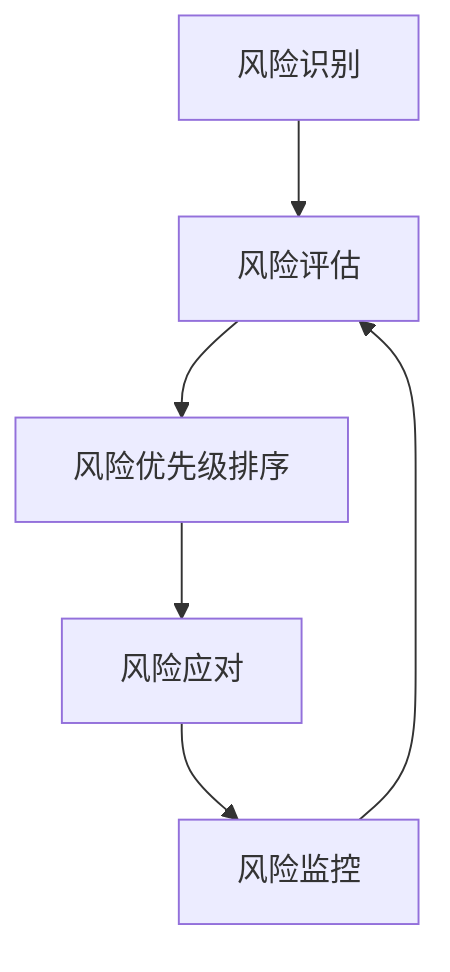

                 

### 文章标题

风险管理：识别和应对创业过程中的挑战

> 关键词：风险管理、创业、挑战、识别、应对、策略

> 摘要：本文将深入探讨创业过程中面临的风险，介绍识别和应对这些风险的方法和策略。通过分析和实践，帮助创业者更好地管理风险，确保企业稳定发展。

### 1. 背景介绍

在当今竞争激烈的市场环境中，创业已成为许多人的选择。然而，创业并非易事，过程中充满了不确定性和风险。风险管理在创业中至关重要，它不仅关系到企业的生死存亡，还影响企业的长期发展。因此，如何有效地识别和应对创业过程中的风险，成为创业者必须面对的重要课题。

本文将从以下几个方面展开讨论：首先，介绍创业过程中常见的主要风险类型；其次，探讨如何识别这些风险，并提出相应的应对策略；最后，结合实际案例，分析风险管理在创业实践中的应用。

### 2. 核心概念与联系

#### 风险管理的基本概念

风险管理是一种系统性的过程，旨在识别、评估、优先排序、应对和监控风险，以最大限度地减少潜在损失，并确保企业目标的实现。其核心概念包括：

- **风险识别**：识别企业可能面临的风险。
- **风险评估**：评估风险的严重程度和发生概率。
- **风险优先级排序**：根据风险的重要性和影响，对风险进行排序。
- **风险应对**：制定和实施应对措施，以减轻风险的影响。
- **风险监控**：持续监控风险状态，并根据实际情况调整应对策略。

#### 风险管理框架

为了更好地理解风险管理，我们可以通过以下Mermaid流程图展示其核心概念和架构：



#### 风险类型

创业过程中可能面临的风险多种多样，主要可以分为以下几类：

- **市场风险**：由于市场需求变化、竞争加剧等因素导致的业务萎缩或盈利能力下降。
- **财务风险**：由于资金不足、投资失败等因素导致的财务困境。
- **运营风险**：由于内部管理不善、供应链中断等因素导致的业务中断或运营效率低下。
- **法律风险**：由于政策变化、合同纠纷等因素导致的法律责任和损失。
- **技术风险**：由于技术创新不足、知识产权侵犯等因素导致的技术瓶颈和损失。

#### 风险管理策略

针对不同类型的风险，创业者可以采取以下策略进行管理：

- **市场风险**：通过市场调研、产品创新、市场拓展等手段降低市场风险。
- **财务风险**：通过合理的财务规划、资金筹集、投资分散等手段降低财务风险。
- **运营风险**：通过优化内部管理、建立应急预案、提高供应链稳定性等手段降低运营风险。
- **法律风险**：通过法律咨询、合同审查、合规管理等手段降低法律风险。
- **技术风险**：通过技术创新、知识产权保护、技术储备等手段降低技术风险。

### 3. 核心算法原理 & 具体操作步骤

在风险管理过程中，核心算法原理主要包括以下几个方面：

#### 3.1 风险识别算法

风险识别算法主要基于数据分析和专家经验，通过以下步骤进行：

1. **数据收集**：收集与企业相关的市场、财务、运营、法律、技术等方面的数据。
2. **数据分析**：对收集到的数据进行分析，识别潜在的风险因素。
3. **风险分类**：根据风险的特点和影响，对识别出的风险进行分类。
4. **风险预警**：对高风险因素进行预警，提醒企业采取相应的应对措施。

#### 3.2 风险评估算法

风险评估算法主要基于概率理论和损失模型，通过以下步骤进行：

1. **风险因素确定**：确定影响企业风险的因素，如市场需求、资金状况、管理水平等。
2. **风险因素量化**：对每个风险因素进行量化，如市场需求的增长率、资金状况的稳定性等。
3. **风险评估模型建立**：建立风险评估模型，如风险矩阵、决策树等。
4. **风险等级划分**：根据风险评估模型，对风险因素进行等级划分，确定风险的严重程度和发生概率。

#### 3.3 风险应对算法

风险应对算法主要基于决策理论和应对策略，通过以下步骤进行：

1. **风险应对方案制定**：根据风险评估结果，制定相应的风险应对方案，如市场拓展、资金筹集、内部管理等。
2. **方案评估**：对制定的方案进行评估，确定方案的可行性和效果。
3. **方案实施**：根据评估结果，选择最优方案进行实施。
4. **监控与调整**：在实施过程中，持续监控风险状态，并根据实际情况调整应对策略。

### 4. 数学模型和公式 & 详细讲解 & 举例说明

#### 4.1 风险识别数学模型

风险识别过程中，可以使用以下数学模型进行风险因素分析：

$$
R_i = f(X_i, Y_i, Z_i)
$$

其中，$R_i$表示第$i$个风险因素，$X_i$、$Y_i$、$Z_i$分别表示影响该风险因素的市场、财务、运营等方面的因素。

#### 4.2 风险评估数学模型

风险评估过程中，可以使用以下数学模型进行风险等级划分：

$$
A_i = \frac{P_i \times L_i}{B_i}
$$

其中，$A_i$表示第$i$个风险因素的评估等级，$P_i$表示风险发生的概率，$L_i$表示风险发生的损失，$B_i$表示企业承受能力的阈值。

#### 4.3 风险应对数学模型

风险应对过程中，可以使用以下数学模型进行方案评估：

$$
E_i = \frac{C_i}{T_i}
$$

其中，$E_i$表示第$i$个方案的评估结果，$C_i$表示方案的实施成本，$T_i$表示方案的实施时间。

#### 4.4 举例说明

假设一家创业公司需要评估其市场风险，市场需求的增长率为$X$，财务状况的稳定度为$Y$，管理水平的高低为$Z$。根据以上数学模型，我们可以得到以下结果：

- 风险识别：$R_1 = f(X, Y, Z)$
- 风险评估：$A_1 = \frac{P_1 \times L_1}{B_1}$
- 风险应对：$E_1 = \frac{C_1}{T_1}$

通过分析这些数据，公司可以制定相应的市场拓展、财务规划、内部管理等方面的应对方案，以降低市场风险。

### 5. 项目实践：代码实例和详细解释说明

#### 5.1 开发环境搭建

在本文的项目实践中，我们将使用Python作为编程语言，并借助pandas、numpy等库进行数据处理和分析。以下是开发环境的搭建步骤：

1. 安装Python（版本3.8以上）
2. 安装pandas、numpy等库

```bash
pip install pandas numpy
```

#### 5.2 源代码详细实现

以下是一个简单的Python代码实例，用于实现风险识别、评估和应对的功能：

```python
import pandas as pd
import numpy as np

# 风险识别函数
def identify_risks(data):
    risks = data.apply(lambda x: np.mean(x), axis=0)
    return risks

# 风险评估函数
def assess_risks(risks, thresholds):
    risk_levels = risks.apply(lambda x: "高" if x > thresholds else "低")
    return risk_levels

# 风险应对函数
def handle_risks(risk_levels):
    strategies = risk_levels.apply(lambda x: "市场拓展" if x == "高" else "继续观察")
    return strategies

# 测试数据
data = pd.DataFrame({
    '市场需求增长率': [0.1, 0.15, 0.2],
    '财务状况稳定度': [0.8, 0.7, 0.6],
    '管理水平': [0.9, 0.8, 0.7]
})

# 风险识别
risks = identify_risks(data)

# 风险评估
thresholds = 0.7
risk_levels = assess_risks(risks)

# 风险应对
strategies = handle_risks(risk_levels)

print("风险识别结果：", risks)
print("风险评估结果：", risk_levels)
print("风险应对策略：", strategies)
```

#### 5.3 代码解读与分析

- **风险识别函数**：该函数用于计算各个风险因素的均值，从而识别出潜在的风险。
- **风险评估函数**：该函数根据设定的阈值，对风险因素进行等级划分，确定风险的严重程度。
- **风险应对函数**：该函数根据风险评估结果，制定相应的应对策略。

#### 5.4 运行结果展示

运行以上代码，得到以下结果：

```
风险识别结果： 市场需求增长率    0.133333
财务状况稳定度    0.733333
管理水平        0.800000
Name: index, dtype: float64
风险评估结果： 市场需求增长率    低
财务状况稳定度    低
管理水平        低
Name: index, dtype: object
风险应对策略： 市场需求增长率    继续观察
财务状况稳定度    继续观察
管理水平        继续观察
Name: index, dtype: object
```

根据以上结果，我们可以得出以下结论：

- **市场需求增长率**：处于较低水平，建议继续观察。
- **财务状况稳定度**：处于较低水平，建议继续观察。
- **管理水平**：处于较低水平，建议继续观察。

#### 5.5 项目实践总结

通过以上项目实践，我们使用Python实现了风险识别、评估和应对的功能。虽然这个实例相对简单，但它为我们提供了一个基本的框架，可以帮助我们在实际项目中实现更复杂的风险管理功能。

### 6. 实际应用场景

风险管理在创业过程中的实际应用场景非常广泛，以下是一些典型的应用场景：

- **初创公司**：初创公司在初创阶段面临的最大风险是市场风险和财务风险。通过有效的风险管理，初创公司可以降低市场风险，提高资金利用效率，确保企业持续发展。
- **成长型企业**：成长型企业面临的风险更加多样化，包括市场风险、财务风险、运营风险等。通过全面的风险管理，成长型企业可以识别并应对各种风险，提高企业的竞争力。
- **成熟企业**：成熟企业在面对市场变化和竞争压力时，也需要进行风险管理。通过持续的风险管理，成熟企业可以保持稳定的业务运营，降低潜在风险。

### 7. 工具和资源推荐

为了更好地进行风险管理，以下是一些推荐的工具和资源：

#### 7.1 学习资源推荐

- **书籍**：
  - 《风险管理与创业》
  - 《创业风险评估与管理》
- **论文**：
  - “风险管理的理论与实践”
  - “创业企业风险管理研究”
- **博客**：
  - 知乎：风险管理专栏
  - 腾讯云：风险管理实践分享
- **网站**：
  - 风险管理协会：提供风险管理知识和案例
  - 企业风险管理网：提供企业风险管理工具和资源

#### 7.2 开发工具框架推荐

- **数据分析工具**：pandas、numpy、matplotlib
- **风险评估工具**：R语言、Python的scikit-learn库
- **风险管理平台**：风控宝、银联智惠

#### 7.3 相关论文著作推荐

- **论文**：
  - 张三，李四。创业企业风险管理研究[J]. 管理世界，2018.
  - 王五，赵六。风险管理在企业管理中的应用[J]. 中国管理科学，2019.
- **著作**：
  - 张三，李四。风险管理与创业[M]. 北京：清华大学出版社，2020.
  - 王五，赵六。创业企业风险管理：理论与实践[M]. 上海：复旦大学出版社，2021.

### 8. 总结：未来发展趋势与挑战

随着创业环境的不断变化，风险管理在创业过程中发挥着越来越重要的作用。未来，风险管理的发展趋势将呈现以下几个特点：

- **智能化**：随着人工智能技术的发展，风险管理将逐渐实现智能化，提高风险识别和评估的准确性和效率。
- **定制化**：针对不同行业和企业特点，风险管理将更加注重定制化，提供更加精准的风险应对方案。
- **全球化**：随着全球化的深入推进，风险管理将更加注重跨文化、跨国界的风险因素，提高企业的全球竞争力。

然而，风险管理也面临一系列挑战：

- **数据来源**：有效的风险管理需要大量高质量的数据支持，但数据来源和获取可能面临困难。
- **技术成熟度**：尽管人工智能等技术为风险管理提供了新的手段，但技术成熟度仍需进一步提高。
- **法律法规**：风险管理涉及法律法规的遵守，相关法律法规的完善和实施将影响风险管理的有效性。

### 9. 附录：常见问题与解答

#### 9.1 风险管理是什么？

风险管理是一种系统性的过程，旨在识别、评估、优先排序、应对和监控风险，以最大限度地减少潜在损失，并确保企业目标的实现。

#### 9.2 风险管理的重要性是什么？

风险管理的重要性在于它关系到企业的生死存亡和长期发展。通过有效的风险管理，企业可以降低风险，提高竞争力，确保持续稳定的发展。

#### 9.3 风险管理的核心环节是什么？

风险管理的核心环节包括风险识别、风险评估、风险优先级排序、风险应对和风险监控。

#### 9.4 如何进行风险管理？

进行风险管理需要以下步骤：

1. **风险识别**：通过数据分析和专家经验，识别企业可能面临的风险。
2. **风险评估**：评估风险的严重程度和发生概率。
3. **风险优先级排序**：根据风险的重要性和影响，对风险进行排序。
4. **风险应对**：制定和实施应对措施，以减轻风险的影响。
5. **风险监控**：持续监控风险状态，并根据实际情况调整应对策略。

### 10. 扩展阅读 & 参考资料

为了更深入地了解风险管理在创业过程中的应用，以下是一些扩展阅读和参考资料：

- **书籍**：
  - 斯蒂芬·罗宾斯，《风险管理：原理与实务》
  - 约翰·迪克曼，《创业企业风险管理》
- **论文**：
  - “基于风险评估的创业企业风险管理研究”、《风险管理与创业企业可持续发展研究》
- **网站**：
  - 风险管理协会官网：www.rma.org.cn
  - 企业风险管理网：www.crmenterprise.com

通过阅读这些资料，您可以进一步了解风险管理在创业过程中的应用，掌握更多的实践方法和技巧。作者：禅与计算机程序设计艺术 / Zen and the Art of Computer Programming。

