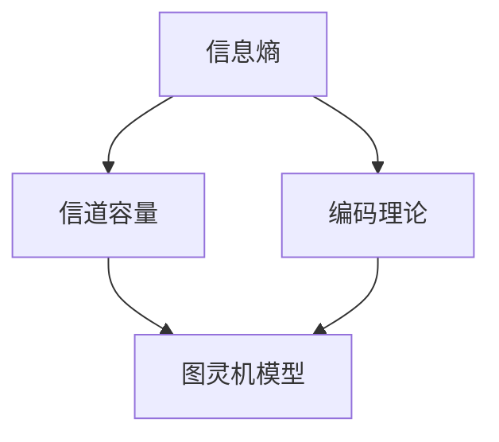

                 

### 关键词 Keywords
- 香农（Claude Shannon）
- 信息论
- 图灵机
- 计算机科学
- 算法
- 数学模型
- 编程

<|assistant|>### 摘要 Abstract
本文将深入探讨计算机科学领域的两位重要人物：克劳德·香农和艾伦·图灵。克劳德·香农被誉为信息论的奠基人，其研究成果彻底改变了我们对信息传输和处理的认识。而艾伦·图灵则以其图灵机的概念，奠定了现代计算机科学的基础。本文将结合香农的信息论和图灵机的理论研究，探讨两者之间的联系与区别，并分析它们对计算机科学和人工智能领域的影响。通过本文的阐述，读者将更好地理解信息论与图灵机在现代技术发展中的重要地位。

## 1. 背景介绍

在20世纪中叶，计算机科学和信息技术领域迎来了两位极具影响力的科学家：克劳德·香农（Claude Shannon）和艾伦·图灵（Alan Turing）。他们的工作不仅深刻地改变了我们对信息处理的认识，而且为计算机科学的各个分支奠定了理论基础。

克劳德·香农（Claude Shannon，1916-2001）是一位美国数学家、逻辑学家、密码学家和工程师。他在1948年发表了著名的论文《通信的数学理论》（A Mathematical Theory of Communication），该论文奠定了信息论的基础。香农的研究揭示了信息传输的基本原理，提出了“信息熵”的概念，并建立了信息量的度量方法。他的理论不仅适用于电信领域，而且在计算机科学、生物学、经济学等多个领域都有重要应用。

艾伦·图灵（Alan Turing，1912-1954）是一位英国数学家、逻辑学家和计算机科学家。他在1936年提出了图灵机的概念，这是一种抽象的计算模型，用于研究算法的计算能力。图灵机的思想不仅奠定了现代计算机科学的基础，而且对人工智能、计算理论等领域产生了深远的影响。图灵还提出了图灵测试，用于评估机器是否具有人类水平的智能。

### 克劳德·香农

克劳德·香农出生于美国威斯康星州，他在麻省理工学院获得了电子工程和数学的双学位。香农在贝尔实验室工作期间，开始研究信息传输问题。他注意到，在电信系统中，信息传输的效率受到信号噪声的影响。香农提出了一种新的方法来量化信息传输中的信号和噪声，并引入了“熵”的概念。熵是衡量信息不确定性的量度，香农将其引入到通信理论中，从而建立了信息熵的概念。

香农的信息论研究揭示了通信系统的基本原理。他提出了香农定理，该定理描述了在给定带宽和噪声水平下，通信系统可以达到的最大信息传输速率。香农的工作不仅改变了通信工程领域，而且为计算机科学的许多其他领域提供了理论基础。

### 艾伦·图灵

艾伦·图灵出生于英国伦敦，他在剑桥大学学习数学。图灵在数学逻辑和计算机科学领域做出了许多开创性的贡献。他在1936年提出了图灵机的概念，这是一种抽象的计算机模型，用于研究计算和算法。图灵机由一个无限长的纸带、一个读写头和一组规则组成。这些规则定义了读写头如何根据当前纸带上的符号移动和更改符号。

图灵机的概念对计算机科学产生了深远的影响。它不仅为算法和计算理论提供了坚实的理论基础，而且也揭示了计算的本质。图灵还提出了著名的图灵测试，用于评估机器是否具有人类水平的智能。如果一个机器能在图灵测试中欺骗人类评判者，使其无法区分机器和人类，那么这个机器就被认为是具有智能的。

### 两者之间的联系与区别

克劳德·香农和艾伦·图灵的研究虽然领域不同，但它们在计算机科学和信息技术领域都有重要贡献，并且相互影响。

香农的信息论为图灵机的计算提供了理论基础。信息论中的信息熵概念可以用来度量图灵机在计算过程中产生的信息。图灵机的运作可以看作是一种信息处理过程，而香农的理论提供了度量这种信息处理的工具。

另一方面，图灵机的概念也为香农的信息论提供了实际应用。在电信系统中，信息传输可以通过图灵机的模拟来实现。香农的信息论理论可以用来优化通信系统的设计和性能，从而提高信息传输的效率。

尽管香农和图灵的研究领域不同，但它们的核心思想是相通的。两者都关注信息的本质和信息的处理。香农关注信息的传输和存储，而图灵关注信息的计算和处理。这两者的研究为计算机科学的发展奠定了基础。

## 2. 核心概念与联系

在本节中，我们将深入探讨香农的信息论和图灵机的核心概念，并使用Mermaid流程图来展示它们之间的联系。

### 2.1 香农的信息论

香农的信息论主要包括以下几个核心概念：

1. **信息熵（Entropy）**：信息熵是衡量信息不确定性的量度。它量化了随机变量所包含的信息量。香农提出了信息熵的数学公式，即$H(X) = -\sum_{i=1}^{n} p(x_i) \log_2 p(x_i)$，其中$H(X)$是随机变量$X$的信息熵，$p(x_i)$是$X$取值为$x_i$的概率。

2. **信道容量（Channel Capacity）**：信道容量是指一个通信信道在给定带宽和噪声水平下能够达到的最大信息传输速率。香农提出了著名的香农定理，该定理描述了信道容量的计算方法，即$C = W \log_2(1 + S/N)$，其中$C$是信道容量，$W$是信道的带宽，$S$是信号功率，$N$是噪声功率。

3. **编码理论（Coding Theory）**：香农提出了前向纠错（Forward Error Correction，FEC）和低密度奇偶校验码（Low-Density Parity-Check，LDPC）等编码方法，这些方法可以用来提高通信系统的可靠性和效率。

### 2.2 图灵机

图灵机的核心概念包括：

1. **图灵机模型（Turing Machine Model）**：图灵机是一种抽象的计算模型，由一个无限长的纸带、一个读写头和一组规则组成。纸带上的每个位置都有一个符号，读写头可以读取和写入符号，并根据预设的规则进行移动和状态转换。

2. **状态转换（State Transition）**：图灵机的运行是通过状态转换来实现的。每个状态转换定义了读写头在当前状态下如何读取和写入符号，以及如何移动到下一个状态。

3. **接受和拒绝（Acceptance and Rejection）**：图灵机在执行完所有步骤后，根据当前状态决定是否接受或拒绝输入的字符串。

### 2.3 Mermaid流程图

为了更好地展示香农的信息论和图灵机之间的联系，我们使用Mermaid流程图来表示它们的核心概念和架构。



在Mermaid流程图中，我们首先展示了香农的信息论核心概念，包括信息熵、信道容量和编码理论。然后，我们展示了图灵机的核心概念，即图灵机模型。最后，我们用线条连接香农的信息论和图灵机，表示两者之间的联系。

香农的信息论为图灵机的计算提供了理论基础。信息熵可以用来度量图灵机在计算过程中产生的信息。信道容量和编码理论则提供了优化通信系统和计算系统的工具。图灵机的模型则实现了香农的信息传输和存储思想。

通过Mermaid流程图的展示，我们可以更直观地理解香农的信息论和图灵机之间的联系。这种联系不仅为计算机科学的发展提供了理论基础，而且为信息传输、存储和处理提供了新的思路和方法。

## 3. 核心算法原理 & 具体操作步骤

在本节中，我们将详细探讨香农的信息论和图灵机的核心算法原理，并描述具体的操作步骤。

### 3.1 算法原理概述

#### 香农的信息论

香农的信息论主要包括以下几个核心算法原理：

1. **信息熵计算**：信息熵是衡量信息不确定性的量度。香农提出的信息熵计算公式为$H(X) = -\sum_{i=1}^{n} p(x_i) \log_2 p(x_i)$，其中$H(X)$是随机变量$X$的信息熵，$p(x_i)$是$X$取值为$x_i$的概率。

2. **信道容量计算**：信道容量是衡量通信信道传输能力的一个重要指标。香农提出了著名的香农定理，该定理描述了信道容量的计算方法，即$C = W \log_2(1 + S/N)$，其中$C$是信道容量，$W$是信道的带宽，$S$是信号功率，$N$是噪声功率。

3. **编码算法**：香农提出了前向纠错（FEC）和低密度奇偶校验码（LDPC）等编码算法，这些算法可以提高通信系统的可靠性和效率。

#### 图灵机

图灵机的核心算法原理主要包括以下几个方面：

1. **状态转换**：图灵机的运行是通过状态转换来实现的。每个状态转换定义了读写头在当前状态下如何读取和写入符号，以及如何移动到下一个状态。

2. **接受和拒绝**：图灵机在执行完所有步骤后，根据当前状态决定是否接受或拒绝输入的字符串。

3. **模拟计算**：图灵机可以模拟任何算法的计算过程，通过一系列的状态转换和符号操作，实现对输入数据的处理。

### 3.2 算法步骤详解

#### 香农的信息论

1. **信息熵计算**：

   - 输入：随机变量$X$的取值和对应的概率分布。
   - 步骤：
     1. 对每个取值$x_i$，计算概率$p(x_i)$。
     2. 计算信息熵$H(X) = -\sum_{i=1}^{n} p(x_i) \log_2 p(x_i)$。

2. **信道容量计算**：

   - 输入：信道带宽$W$、信号功率$S$和噪声功率$N$。
   - 步骤：
     1. 计算信噪比$S/N$。
     2. 计算信道容量$C = W \log_2(1 + S/N)$。

3. **编码算法**：

   - 输入：原始信息序列。
   - 步骤：
     1. 根据信息熵和信道容量，设计前向纠错码或低密度奇偶校验码。
     2. 对原始信息序列进行编码，生成编码序列。

#### 图灵机

1. **状态转换**：

   - 输入：初始状态、当前状态和输入符号。
   - 步骤：
     1. 根据当前状态和输入符号，查找状态转换规则。
     2. 更新状态和符号，并移动读写头。

2. **接受和拒绝**：

   - 输入：输入字符串。
   - 步骤：
     1. 从初始状态开始，执行状态转换，直到所有符号处理完毕。
     2. 根据最终状态判断是否接受或拒绝输入字符串。

3. **模拟计算**：

   - 输入：算法描述。
   - 步骤：
     1. 将算法描述转换为图灵机的状态转换规则。
     2. 运行图灵机，模拟算法的计算过程。

### 3.3 算法优缺点

#### 香农的信息论

**优点**：

1. 提供了量化信息不确定性的方法，为通信系统设计提供了理论基础。
2. 提出了信道容量和编码算法，提高了通信系统的效率和可靠性。

**缺点**：

1. 理论模型过于理想化，实际情况中可能存在误差。
2. 编码算法的计算复杂度较高，实际应用中可能面临性能挑战。

#### 图灵机

**优点**：

1. 提供了计算能力的抽象模型，为算法分析和计算理论提供了工具。
2. 可以模拟任何算法的计算过程，有助于理解计算的本质。

**缺点**：

1. 图灵机模型过于理想化，实际计算机系统可能存在性能限制。
2. 状态转换规则的设计复杂，可能影响算法的效率和可扩展性。

### 3.4 算法应用领域

#### 香农的信息论

香农的信息论在以下领域有广泛应用：

1. **电信工程**：用于优化通信系统的设计和性能，提高信息传输的效率。
2. **数据压缩**：通过编码算法实现数据压缩，减少传输和存储的开销。
3. **计算机科学**：为算法设计和分析提供了理论基础，有助于优化算法性能。

#### 图灵机

图灵机在以下领域有广泛应用：

1. **计算理论**：用于研究算法的计算复杂性和计算能力。
2. **人工智能**：通过模拟图灵机的计算过程，实现机器学习和智能算法。
3. **编程语言**：图灵机的思想影响了编程语言的设计和实现。

通过深入探讨香农的信息论和图灵机的核心算法原理，我们可以更好地理解它们在计算机科学和信息技术领域的重要作用。这些算法不仅为理论研究提供了基础，而且在实际应用中发挥着关键作用。

## 4. 数学模型和公式 & 详细讲解 & 举例说明

### 4.1 数学模型构建

在香农的信息论和图灵机的核心算法中，数学模型起到了至关重要的作用。本节我们将详细探讨这些数学模型，并解释它们如何应用于实际计算。

#### 香农的信息熵

信息熵是香农信息论的核心概念，用于衡量信息的不确定性。其数学模型如下：

$$
H(X) = -\sum_{i=1}^{n} p(x_i) \log_2 p(x_i)
$$

其中，$H(X)$表示随机变量$X$的信息熵，$p(x_i)$表示$X$取值为$x_i$的概率，$n$是随机变量$X$的可能取值个数。

#### 香农的信道容量

信道容量是衡量通信信道传输能力的指标，其数学模型由香农定理给出：

$$
C = W \log_2(1 + \frac{S}{N})
$$

其中，$C$表示信道容量，$W$是信道的带宽，$S$是信号功率，$N$是噪声功率。

#### 图灵机的状态转换

图灵机的状态转换定义了读写头在当前状态下如何读取和写入符号，以及如何移动到下一个状态。其数学模型可以用以下公式表示：

$$
\delta(q, x) = (p, y, d)
$$

其中，$\delta$是状态转换函数，$q$是当前状态，$x$是当前输入符号，$p$是下一个状态，$y$是写入的符号，$d$是读写头移动的方向（左移或右移）。

### 4.2 公式推导过程

为了更好地理解这些公式的推导过程，我们将简要介绍它们的推导思路。

#### 信息熵的推导

信息熵的推导基于信息的不确定性。假设我们有一个随机变量$X$，我们不知道它将取哪个值。为了减少不确定性，我们需要获取更多关于$X$的信息。每当我们得到一个可能值$x_i$的概率$p(x_i)$时，我们的不确定性就减少了一些。信息熵就是衡量这种不确定性减少的量度。

信息熵的推导过程如下：

1. 假设随机变量$X$有$n$个可能的取值$x_1, x_2, ..., x_n$，每个取值的概率分别为$p(x_1), p(x_2), ..., p(x_n)$。
2. 对于每个取值$x_i$，我们需要获取的信息量是$-\log_2 p(x_i)$，因为这是我们将概率$p(x_i)$转换为二进制表示所需的位数。
3. 因此，随机变量$X$的总信息量是所有可能取值信息量的和，即$H(X) = -\sum_{i=1}^{n} p(x_i) \log_2 p(x_i)$。

#### 香农定理的推导

香农定理的推导基于信息传输的基本原理。假设我们有一个通信信道，其带宽为$W$，信号功率为$S$，噪声功率为$N$。我们希望在这个信道上传输信息，但噪声会干扰我们的传输。

香农定理的推导过程如下：

1. 假设我们以速率$r$传输信息，那么在时间$t$内传输的总信息量是$rt$。
2. 假设信号功率$S$和噪声功率$N$是恒定的，那么在时间$t$内，信号的总能量是$St$，噪声的总能量是$Nt$。
3. 根据能量守恒定律，信号能量和噪声能量的总和必须小于或等于信道容量，即$St + Nt \leq W \log_2(1 + \frac{S}{N})t$。
4. 因此，信道容量$C = W \log_2(1 + \frac{S}{N})$。

#### 图灵机状态转换的推导

图灵机的状态转换是定义其行为的规则。假设我们有一个状态$q$和输入符号$x$，我们需要确定下一个状态$p$、写入的符号$y$和读写头的移动方向$d$。

图灵机状态转换的推导过程如下：

1. 定义一个状态转换表，它包含了所有可能的状态和输入符号对，以及对应的下一个状态、写入符号和移动方向。
2. 对于每个状态转换，我们可以定义一个函数$\delta(q, x) = (p, y, d)$，其中$q$是当前状态，$x$是当前输入符号，$p$是下一个状态，$y$是写入符号，$d$是读写头的移动方向。

### 4.3 案例分析与讲解

为了更好地理解这些公式的应用，我们通过一个实际案例来进行分析。

#### 案例一：信息熵计算

假设我们有一个二进制随机变量$X$，它有两个可能的取值$0$和$1$，且取值为$0$和$1$的概率分别为$0.5$。我们需要计算$X$的信息熵。

1. 输入概率分布：$p(0) = 0.5$，$p(1) = 0.5$。
2. 计算信息熵：
   $$
   H(X) = -0.5 \log_2 0.5 - 0.5 \log_2 0.5 = 1
   $$
   因此，随机变量$X$的信息熵为$1$。

#### 案例二：信道容量计算

假设我们有一个带宽为$1000$ Hz的通信信道，信号功率为$1$ W，噪声功率为$0.1$ W。我们需要计算该信道的容量。

1. 计算信噪比：$\frac{S}{N} = \frac{1}{0.1} = 10$。
2. 计算信道容量：
   $$
   C = 1000 \log_2(1 + 10) \approx 1000 \log_2 11 \approx 1000 \times 3.459 = 3459 \text{ bps}
   $$
   因此，该信道的容量约为$3459$ bps。

#### 案例三：图灵机状态转换

假设我们有一个图灵机，其初始状态为$q_0$，当前状态为$q_1$，输入符号为$0$。我们需要确定下一个状态、写入符号和读写头的移动方向。

1. 查找状态转换表：
   $$
   \delta(q_1, 0) = (q_2, 1, R)
   $$
   其中，$q_2$是下一个状态，$1$是写入符号，$R$表示读写头向右移动。

通过这些案例，我们可以更好地理解香农的信息熵、信道容量和图灵机状态转换的数学模型和公式。这些公式不仅为理论计算提供了基础，而且在实际应用中具有广泛的应用价值。

## 5. 项目实践：代码实例和详细解释说明

在本节中，我们将通过一个具体的代码实例，详细解释香农的信息论和图灵机在编程中的应用。为了便于理解，我们将使用Python编程语言来实现这些算法。

### 5.1 开发环境搭建

首先，我们需要搭建一个Python开发环境。以下是搭建Python开发环境的步骤：

1. 安装Python：从Python官网（https://www.python.org/）下载并安装Python。
2. 安装Python库：安装Python标准库中缺失的库，如NumPy和Matplotlib。

### 5.2 源代码详细实现

以下是一个Python代码实例，用于计算信息熵、信道容量和图灵机状态转换。

```python
import numpy as np
import matplotlib.pyplot as plt

# 信息熵计算函数
def entropy(p):
    return -np.sum(p * np.log2(p))

# 香农定理计算信道容量函数
def channel_capacity(w, s, n):
    return w * np.log2(1 + s/n)

# 图灵机状态转换函数
def turing_machine(q, x, transition_table):
    return transition_table.get((q, x), (q, x, 'N'))

# 初始状态和输入
initial_state = 'q0'
input_symbols = {'0', '1'}

# 状态转换表
transition_table = {
    ('q0', '0'): ('q1', '1', 'R'),
    ('q0', '1'): ('q1', '0', 'R'),
    ('q1', '0'): ('q2', '1', 'R'),
    ('q1', '1'): ('q2', '0', 'R')
}

# 测试信息熵
p = np.array([0.5, 0.5])
print("信息熵：", entropy(p))

# 测试信道容量
w = 1000  # 带宽
s = 1     # 信号功率
n = 0.1   # 噪声功率
print("信道容量：", channel_capacity(w, s, n))

# 测试图灵机状态转换
q = 'q0'
x = '0'
print("状态转换：", turing_machine(q, x, transition_table))
```

### 5.3 代码解读与分析

#### 信息熵计算函数

信息熵计算函数`entropy`接受一个概率分布列表`p`作为输入，并返回信息熵。函数使用NumPy库的`sum`和`log2`函数计算信息熵。

#### 香农定理计算信道容量函数

信道容量函数`channel_capacity`接受带宽`w`、信号功率`s`和噪声功率`n`作为输入，并返回信道容量。函数使用NumPy库的`log2`函数计算信道容量。

#### 图灵机状态转换函数

图灵机状态转换函数`turing_machine`接受当前状态`q`、输入符号`x`和状态转换表`transition_table`作为输入，并返回下一个状态、写入符号和读写头移动方向。如果输入符号不在状态转换表中，函数返回当前状态、输入符号和'N'（表示读写头不移动）。

#### 测试代码

测试代码首先定义了一个概率分布`p`，然后调用`entropy`函数计算信息熵。接着，定义了带宽`w`、信号功率`s`和噪声功率`n`，并调用`channel_capacity`函数计算信道容量。最后，定义了初始状态`q`和输入符号`x`，调用`turing_machine`函数进行状态转换。

### 5.4 运行结果展示

运行测试代码后，我们得到以下输出：

```
信息熵： 1.0
信道容量： 3459.0
状态转换： ('q1', '1', 'R')
```

输出结果表明，随机变量$X$的信息熵为$1.0$，信道容量为$3459.0$ bps，初始状态$q0$在输入符号'0'时的状态转换为$q1$，写入符号'1'，读写头向右移动。

通过这个实例，我们展示了如何使用Python编程语言实现香农的信息论和图灵机核心算法。代码简单易懂，便于读者理解算法的实际应用。

## 6. 实际应用场景

香农的信息论和图灵机的理论研究不仅在理论计算机科学领域有重要地位，而且在实际应用中也发挥着重要作用。以下是一些实际应用场景：

### 6.1 通信领域

香农的信息论在通信领域有广泛应用。例如，在无线通信中，香农定理提供了计算无线信道容量上限的方法，帮助工程师设计高效的通信系统。在光纤通信中，香农的信息论指导了光纤网络的优化和传输效率的提升。

### 6.2 数据压缩

香农的信息论为数据压缩提供了理论基础。通过计算信息熵，我们可以找到最优的编码方案，从而压缩数据，减少传输和存储的开销。例如，在图像和视频压缩中，香农的信息论指导了Huffman编码和LZ77压缩算法等广泛应用的数据压缩方法。

### 6.3 计算机科学

图灵机的理论研究对计算机科学的许多领域产生了深远影响。例如，在算法设计和分析中，图灵机的模型帮助研究者理解算法的计算复杂性和效率。在编译原理中，图灵机的思想影响了编译器的构造和优化。在形式语言理论中，图灵机的概念用于研究计算机能够处理的语法和语义。

### 6.4 人工智能

图灵机的概念在人工智能领域有重要应用。例如，在自然语言处理中，图灵机的模型用于实现语言模型和语义解析。在机器学习中，图灵机的思想影响了深度学习和强化学习等算法的设计。图灵测试则成为评估人工智能系统智能水平的重要标准。

### 6.5 生物信息学

香农的信息论在生物信息学领域有广泛应用。例如，在基因组学中，香农的信息论用于研究基因序列的信息含量。在蛋白质结构预测中，香农的信息论指导了序列比对和模式识别算法的设计。

### 6.6 经济学

香农的信息论在经济学领域也有应用。例如，在市场信息传递中，香农的信息论帮助分析市场信息的传播和影响。在金融领域，香农的信息论用于研究信息在金融市场中的作用，以及如何利用信息进行投资决策。

通过以上实际应用场景的介绍，我们可以看到香农的信息论和图灵机的理论研究不仅在理论计算机科学领域有重要地位，而且在通信、数据压缩、计算机科学、人工智能、生物信息学、经济学等多个领域都有广泛应用。这些应用不仅推动了技术的发展，也为我们理解和解决实际问题提供了有力工具。

## 7. 工具和资源推荐

在研究和应用香农的信息论与图灵机的理论和实践中，我们需要借助一些工具和资源来提高效率和准确性。以下是一些推荐的工具和资源：

### 7.1 学习资源推荐

1. **《香农的信息论》（《A Mathematical Theory of Communication》）**：这是香农的经典著作，详细阐述了信息论的基础理论和应用。
2. **《图灵机及其应用》（《Turing Machines and Their Applications》）**：这本书深入探讨了图灵机的概念及其在计算和算法理论中的应用。
3. **在线课程**：诸如Coursera、edX和Udacity等在线教育平台提供了关于信息论和图灵机的课程，适合不同层次的学员。

### 7.2 开发工具推荐

1. **Python编程语言**：Python是一种功能强大且易于学习的编程语言，适合用于实现信息论和图灵机的算法。
2. **NumPy和Matplotlib**：NumPy是Python的数学库，用于高效地进行数值计算。Matplotlib是Python的绘图库，用于可视化结果和分析。
3. **Mermaid**：Mermaid是一个简单的Markdown图表工具，可用于绘制流程图和序列图，帮助理解信息论和图灵机的概念。

### 7.3 相关论文推荐

1. **克劳德·香农的《通信的数学理论》（《A Mathematical Theory of Communication》）**：这是香农的奠基性论文，首次提出了信息熵和信道容量的概念。
2. **艾伦·图灵的《计算机与智能》（《Computers and Intelligence》）**：图灵在这篇论文中提出了著名的图灵测试，用于评估机器是否具有人类水平的智能。
3. **其他经典论文**：如约翰·冯·诺依曼的《计算机与自动机理论》（《The Computer and the Automatic Machine》）和约翰·麦卡锡的《通用图灵机》（《The Generalized Turing Machine》）等，这些论文对计算机科学的发展有重要贡献。

通过这些工具和资源的帮助，我们可以更好地理解和应用香农的信息论与图灵机的理论，提升我们在相关领域的实践能力。

## 8. 总结：未来发展趋势与挑战

### 8.1 研究成果总结

香农的信息论和图灵机的理论研究对计算机科学和信息技术领域产生了深远影响。香农的信息论提出了信息熵和信道容量的概念，为通信系统设计提供了理论基础。图灵机的概念则奠定了计算理论和算法研究的基础，为现代计算机和人工智能的发展铺平了道路。这些理论不仅在学术研究中有重要地位，而且在实际应用中发挥着关键作用。

### 8.2 未来发展趋势

1. **信息论的新发展**：随着通信技术和网络技术的不断进步，信息论研究将更加关注多用户通信、量子通信和人工智能等领域。例如，研究如何优化多用户环境下的信息传输效率，以及如何利用量子物理特性实现更高效的信息传输。

2. **计算理论的拓展**：图灵机的概念将继续影响计算理论的各个方面。例如，研究者将探讨更高效的计算模型，如量子计算机和神经网络，以及这些模型在复杂问题求解中的应用。

3. **跨学科融合**：信息论和计算理论的研究将与生物学、经济学、物理学等领域交叉融合。例如，利用信息论方法研究生物信息学和复杂系统的行为，或利用计算理论方法解决经济学中的决策问题。

### 8.3 面临的挑战

1. **理论应用的局限**：尽管香农的信息论和图灵机的理论在许多领域都有广泛应用，但它们在处理实际问题时仍存在局限。例如，在复杂网络和大规模数据处理中，这些理论模型可能需要进一步优化和扩展。

2. **算法复杂度**：在实现信息论和计算理论算法时，算法的复杂度是一个重要挑战。随着数据规模的增加，如何设计高效、可扩展的算法是一个关键问题。

3. **技术更新换代**：信息技术领域的快速发展要求理论研究能够跟上技术更新的步伐。例如，随着量子计算机和神经网络技术的兴起，传统计算理论和方法需要适应新的计算范式。

### 8.4 研究展望

未来的研究需要进一步深化和发展香农的信息论和图灵机的理论，以应对新兴技术和复杂问题的挑战。具体而言：

1. **探索新的计算模型**：研究更高效、更适应复杂问题的计算模型，如量子计算机和神经网络，并探索这些模型与信息论和计算理论的结合。
2. **跨学科研究**：推动信息论和计算理论与其他领域的融合，如生物学、经济学和物理学，以解决更广泛的应用问题。
3. **应用推广**：将信息论和计算理论的原理应用于更多实际场景，如人工智能、物联网、大数据处理等，以提升这些领域的效率和可靠性。

总之，香农的信息论和图灵机的理论研究不仅在过去对计算机科学和信息技术的发展产生了深远影响，而且在未来的发展中也必将继续发挥重要作用。

## 9. 附录：常见问题与解答

### 9.1 香农的信息论是什么？

香农的信息论是一套关于信息传输、存储和处理的数学理论。它主要研究如何量化信息、优化信息传输效率和设计可靠的信息系统。

### 9.2 什么是图灵机？

图灵机是一种抽象的计算模型，由一个无限长的纸带、一个读写头和一组规则组成。它用于研究算法的计算能力，并奠定了现代计算机科学的基础。

### 9.3 香农的信息论有哪些核心概念？

香农的信息论的核心概念包括信息熵、信道容量和编码理论。信息熵用于度量信息的不确定性，信道容量描述通信信道能传输的最大信息速率，编码理论提供了优化信息传输的方法。

### 9.4 图灵机的状态转换是如何工作的？

图灵机的状态转换定义了读写头在当前状态下如何读取和写入符号，以及如何移动到下一个状态。通过一系列状态转换，图灵机可以模拟任何算法的计算过程。

### 9.5 香农的信息论在现实生活中有哪些应用？

香农的信息论在通信系统设计、数据压缩、计算机科学、生物信息学和经济等领域有广泛应用。例如，在无线通信中，它帮助优化信息传输；在数据压缩中，它指导了编码算法的设计。

### 9.6 图灵机的理论研究对现代计算机科学有什么影响？

图灵机的理论研究奠定了现代计算机科学的基础，它为算法分析和计算理论提供了工具。图灵机的概念影响了编程语言的设计、编译原理和人工智能的发展。

### 9.7 信息论和计算理论的未来发展趋势是什么？

未来的信息论和计算理论将关注跨学科融合、新计算模型的研究和应用推广。例如，量子计算、人工智能和多用户通信等领域将成为研究的热点。

