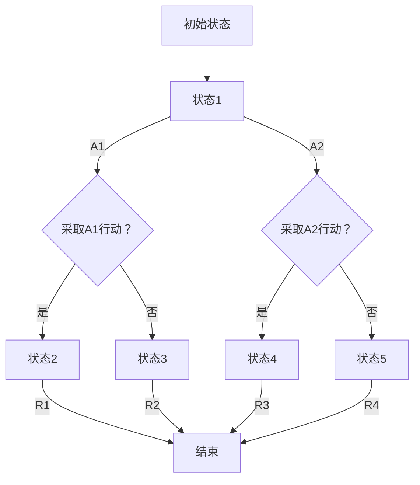

                 

### 文章标题

### 马尔可夫决策过程 (Markov Decision Process)

关键词：马尔可夫决策过程，MDP，决策过程，状态，行动，奖励，策略，价值函数，模型，算法，应用。

#### 摘要

马尔可夫决策过程（Markov Decision Process，简称MDP）是机器学习和决策理论中的核心概念之一。它为智能体提供了一个框架，使其能够通过学习在不确定的环境中做出最佳决策。本文将详细探讨MDP的基本概念、核心算法原理、数学模型、具体应用实例以及未来发展趋势。通过本文的阅读，读者将深入了解MDP的理论基础和实际应用，为后续研究和实践奠定坚实基础。

### 目录

1. **背景介绍**
2. **核心概念与联系**
   - 1.1. 马尔可夫性质
   - 1.2. 状态与行动
   - 1.3. 奖励函数与策略
   - 1.4. Mermaid流程图
3. **核心算法原理 & 具体操作步骤**
   - 3.1. MDP基础算法
   - 3.2. 蒙特卡洛方法
   - 3.3. 动态规划方法
4. **数学模型和公式 & 详细讲解 & 举例说明**
   - 4.1. 马尔可夫决策过程公式
   - 4.2. 价值函数迭代过程
   - 4.3. 政策评估
   - 4.4. 政策改进
   - 4.5. 举例说明
5. **项目实践：代码实例和详细解释说明**
   - 5.1. 开发环境搭建
   - 5.2. 源代码详细实现
   - 5.3. 代码解读与分析
   - 5.4. 运行结果展示
6. **实际应用场景**
   - 6.1. 强化学习
   - 6.2. 自动驾驶
   - 6.3. 游戏AI
   - 6.4. 资源管理
7. **工具和资源推荐**
   - 7.1. 学习资源推荐
   - 7.2. 开发工具框架推荐
   - 7.3. 相关论文著作推荐
8. **总结：未来发展趋势与挑战**
9. **附录：常见问题与解答**
10. **扩展阅读 & 参考资料**

### 1. 背景介绍

马尔可夫决策过程（MDP）的概念源于概率论和动态规划。早在20世纪30年代，俄罗斯数学家安德烈·马尔可夫（Andrey Markov）在其关于随机过程的论文中首次提出了马尔可夫性质。这种性质指出，一个系统在给定当前状态的情况下，其未来的状态分布只与当前状态有关，而与过去的状态无关。这一性质为后续的决策理论和计算模型提供了重要的理论基础。

随着计算机科学和人工智能的迅速发展，MDP在决策过程中的应用逐渐受到关注。特别是在强化学习（Reinforcement Learning）领域，MDP成为了一种关键的模型框架。强化学习旨在通过学习在动态环境中采取行动以最大化长期奖励，而MDP为此提供了一种数学上的描述和求解方法。

MDP的核心思想是，智能体（Agent）在每一个时刻都处于一个状态（State）中，它可以采取一系列可能的行动（Action）。智能体的目标是通过对环境的观察和经验的学习，选择最优的行动策略（Policy），以实现某个目标或最大化某个效用函数。这个过程涉及到状态转移概率、奖励函数以及策略的迭代优化。

本文将首先介绍MDP的核心概念，包括状态、行动、奖励函数和策略等。接着，我们将详细探讨MDP的核心算法原理，包括基础算法、蒙特卡洛方法和动态规划方法。随后，我们将介绍MDP的数学模型和公式，并通过具体实例进行详细讲解。最后，我们将探讨MDP的实际应用场景，并推荐相关的学习资源和开发工具。

通过本文的阅读，读者将能够全面了解MDP的理论基础和应用，为后续的研究和实践打下坚实的基础。

### 2. 核心概念与联系

#### 2.1. 马尔可夫性质

马尔可夫性质是MDP中最基本的性质，它定义了系统在时间序列上的行为。具体来说，马尔可夫性质指的是一个系统的未来状态仅依赖于当前状态，而与过去的任何状态无关。这种性质使得我们可以通过只关注当前状态和可能的未来状态，来简化复杂的决策问题。

在MDP中，我们可以使用概率转移矩阵（Transition Probability Matrix）来描述状态之间的转移概率。这个矩阵通常表示为P，其中P(i, j)表示智能体在当前处于状态i时，下一步转移到状态j的概率。

以下是一个简单的概率转移矩阵示例：

|        | S1 | S2 | S3 |
|--------|----|----|----|
| **S1** | 0.5| 0.2| 0.3|
| **S2** | 0.1| 0.6| 0.3|
| **S3** | 0.2| 0.1| 0.7|

在这个例子中，智能体当前处于状态S1，下一步转移到S1、S2和S3的概率分别为0.5、0.2和0.3。

#### 2.2. 状态与行动

状态（State）是MDP中的基本概念，它表示智能体在特定时刻所处的环境条件。状态可以是离散的，也可以是连续的。在MDP中，智能体必须能够感知和识别当前的状态，以便采取相应的行动。

行动（Action）是智能体在特定状态下可以选择的操作。行动可以是离散的，也可以是连续的。在MDP中，智能体通过选择行动来影响环境的未来状态。不同的行动可能导致不同的状态转移和奖励。

以下是一个简单的状态与行动示例：

| 状态（S） | 行动（A） |        |        |
|-----------|-----------|--------|--------|
| **S1**    | **A1**    | S1→S2  | 0.5    |
| **S1**    | **A2**    | S1→S3  | 0.3    |
| **S2**    | **A1**    | S2→S1  | 0.1    |
| **S2**    | **A2**    | S2→S3  | 0.7    |

在这个例子中，智能体当前处于状态S1，可以采取两种行动：A1和A2。采取A1行动时，智能体转移到状态S2的概率为0.5；采取A2行动时，智能体转移到状态S3的概率为0.3。

#### 2.3. 奖励函数与策略

奖励函数（Reward Function）是MDP中的另一个核心概念，它用于衡量智能体在特定状态下采取特定行动所带来的效用。奖励可以是正的，也可以是负的。正奖励表示智能体在特定状态下取得了成功或进步，而负奖励表示智能体在特定状态下遇到了失败或损失。

策略（Policy）是智能体在MDP中采取行动的规则集。策略定义了智能体在每个状态下应该采取哪种行动，以最大化总奖励。策略可以是确定性策略，也可以是非确定性策略。

以下是一个简单的奖励函数和策略示例：

| 状态（S） | 行动（A） | 奖励（R） |
|-----------|-----------|-----------|
| **S1**    | **A1**    | **-1**    |
| **S1**    | **A2**    | **+2**    |
| **S2**    | **A1**    | **+1**    |
| **S2**    | **A2**    | **-2**    |

在这个例子中，智能体当前处于状态S1，采取A1行动将得到-1的奖励，而采取A2行动将得到+2的奖励。同样地，智能体处于状态S2时，采取A1行动将得到+1的奖励，而采取A2行动将得到-2的奖励。

#### 2.4. Mermaid流程图

为了更好地理解MDP的运行过程，我们可以使用Mermaid流程图来描述。以下是一个简单的MDP流程图示例：



在这个流程图中，智能体从初始状态A开始，经过状态B，然后根据采取的行动A1或A2，转移到不同的状态C、D、E、F、G或H。每个状态都有对应的奖励R1、R2、R3或R4。智能体最终达到结束状态I，结束MDP过程。

通过上述核心概念和流程图，我们可以更好地理解MDP的基本结构和运行机制。在接下来的章节中，我们将进一步探讨MDP的核心算法原理，包括基础算法、蒙特卡洛方法和动态规划方法，以及它们的数学模型和具体应用实例。

### 3. 核心算法原理 & 具体操作步骤

#### 3.1. MDP基础算法

马尔可夫决策过程（MDP）的基础算法主要包括策略迭代（Policy Iteration）和价值迭代（Value Iteration）两种方法。这些方法通过迭代更新策略和价值函数，以实现最优决策。

**策略迭代算法**

策略迭代算法的基本思想是交替更新策略和价值函数。具体步骤如下：

1. **初始化**：选择一个初始策略π，通常可以是一个随机策略或经验策略。
2. **策略评估**：使用当前策略π计算每个状态的价值函数v^π，即：
   \[ v^π(s) = \sum_{a} π(a|s) \sum_{s'} p(s'|s, a) [r(s', a) + \gamma v^π(s')] \]
   其中，π(a|s)表示在状态s下采取行动a的概率，p(s'|s, a)表示从状态s采取行动a转移到状态s'的概率，r(s', a)表示在状态s'采取行动a得到的即时奖励，γ是折扣因子。
3. **策略改进**：根据当前价值函数v^π，更新策略π。可以选择最优策略π*，即在每个状态s下选择使得价值函数最大的行动a：
   \[ π*(s) = \arg\max_a \sum_{s'} p(s'|s, a) [r(s', a) + \gamma v^π(s')] \]
4. **重复策略评估和策略改进**，直到策略不再发生变化，或者达到预设的迭代次数。

**价值迭代算法**

价值迭代算法通过直接更新价值函数，以达到最优策略。具体步骤如下：

1. **初始化**：初始化价值函数v^0，通常可以是一个零向量或随机向量。
2. **迭代更新**：对于每个状态s，根据当前价值函数v^k和转移概率矩阵P，计算新的价值函数v^(k+1)：
   \[ v^(k+1)(s) = \max_a \sum_{s'} p(s'|s, a) [r(s', a) + \gamma v^(k)(s')] \]
3. **重复迭代更新**，直到价值函数的变化小于预设的阈值或达到预设的迭代次数。

**算法示例**

假设有一个简单的MDP，状态集为{S1, S2, S3}，行动集为{A1, A2}，奖励函数为{R1, R2}，转移概率矩阵P和奖励矩阵R如下：

|        | A1  | A2  |
|--------|-----|-----|
| **S1** | S1→S2 (0.5) | S1→S3 (0.3) |
| **S2** | S2→S1 (0.1) | S2→S3 (0.7) |
| **S3** | S3→S1 (0.2) | S3→S2 (0.8) |

奖励矩阵R如下：

|        | A1  | A2  |
|--------|-----|-----|
| **S1** | R1 (-1) | R2 (+2) |
| **S2** | R1 (+1) | R2 (-2) |
| **S3** | R1 (+1) | R2 (+1) |

使用策略迭代算法求解最优策略：

1. **初始化**：选择随机策略π，例如π(S1) = {A1: 0.5, A2: 0.5}，π(S2) = {A1: 0.5, A2: 0.5}，π(S3) = {A1: 0.5, A2: 0.5}。
2. **策略评估**：计算当前策略π的价值函数v^π：
   \[ v^π(S1) = 0.5 \times [0.5 \times (-1) + 0.3 \times (+2)] + 0.5 \times [0.1 \times (-1) + 0.7 \times (-2)] = -0.15 \]
   \[ v^π(S2) = 0.5 \times [0.1 \times (+1) + 0.7 \times (-2)] + 0.5 \times [0.2 \times (+1) + 0.8 \times (+1)] = 0 \]
   \[ v^π(S3) = 0.5 \times [0.2 \times (+1) + 0.8 \times (+1)] + 0.5 \times [0.2 \times (+1) + 0.8 \times (+1)] = 0.6 \]
3. **策略改进**：根据当前价值函数v^π，更新策略π：
   \[ π(S1) = \arg\max_a \sum_{s'} p(s'|s, a) [r(s', a) + \gamma v^π(s')] \]
   \[ π(S1) = \arg\max_a [0.5 \times (-1 + 0.6) + 0.3 \times (+2 + 0.6)] = A2 \]
   \[ π(S2) = \arg\max_a [0.1 \times (+1 + 0.6) + 0.7 \times (-2 + 0.6)] = A1 \]
   \[ π(S3) = \arg\max_a [0.2 \times (+1 + 0.6) + 0.8 \times (+1 + 0.6)] = A2 \]
4. **重复策略评估和策略改进**，直到策略不再发生变化。

使用价值迭代算法求解最优策略：

1. **初始化**：初始化价值函数v^0：
   \[ v^0(S1) = 0, v^0(S2) = 0, v^0(S3) = 0 \]
2. **迭代更新**：计算新的价值函数v^(k+1)：
   \[ v^(1)(S1) = \max_a [0.5 \times (-1 + 0.6) + 0.3 \times (+2 + 0.6)] = 0.15 \]
   \[ v^(1)(S2) = \max_a [0.1 \times (+1 + 0.6) + 0.7 \times (-2 + 0.6)] = -0.15 \]
   \[ v^(1)(S3) = \max_a [0.2 \times (+1 + 0.6) + 0.8 \times (+1 + 0.6)] = 0.7 \]
3. **重复迭代更新**，直到价值函数的变化小于预设的阈值。

通过上述基础算法，我们可以求解MDP的最优策略和价值函数，从而实现智能体在动态环境中的最优决策。

#### 3.2. 蒙特卡洛方法

蒙特卡洛方法是一种基于随机采样的数值计算方法，可以用于解决MDP中的决策问题。具体来说，蒙特卡洛方法通过大量模拟来估计状态的价值函数，并基于此估计值来选择最优行动。

蒙特卡洛方法的基本步骤如下：

1. **初始化**：初始化价值函数v，通常可以是一个零向量。
2. **模拟轨迹**：进行N次模拟，每次模拟从初始状态开始，根据当前状态和策略选择行动，并记录每次行动的奖励和状态转移。
3. **更新价值函数**：根据模拟结果更新价值函数v：
   \[ v(s) = \frac{1}{N} \sum_{i=1}^N \sum_{j=1}^K r_j(s_j, a_j) \]
   其中，s_j表示第i次模拟中的状态，a_j表示第i次模拟中采取的行动，r_j(s_j, a_j)表示在状态s_j下采取行动a_j得到的即时奖励。
4. **重复模拟和更新**，直到价值函数的变化小于预设的阈值或达到预设的迭代次数。

蒙特卡洛方法的一个优点是简单易懂，适合处理高维和复杂状态空间的问题。然而，该方法可能需要大量的模拟次数来获得稳定和准确的结果，因此在实际应用中需要权衡计算时间和精度。

**算法示例**

假设有一个简单的MDP，状态集为{S1, S2, S3}，行动集为{A1, A2}，奖励函数为{R1, R2}，转移概率矩阵P和奖励矩阵R如下：

|        | A1  | A2  |
|--------|-----|-----|
| **S1** | S1→S2 (0.5) | S1→S3 (0.3) |
| **S2** | S2→S1 (0.1) | S2→S3 (0.7) |
| **S3** | S3→S1 (0.2) | S3→S2 (0.8) |

奖励矩阵R如下：

|        | A1  | A2  |
|--------|-----|-----|
| **S1** | R1 (-1) | R2 (+2) |
| **S2** | R1 (+1) | R2 (-2) |
| **S3** | R1 (+1) | R2 (+1) |

使用蒙特卡洛方法求解最优策略：

1. **初始化**：初始化价值函数v：
   \[ v(S1) = v(S2) = v(S3) = 0 \]
2. **模拟轨迹**：进行N次模拟，例如N=1000次。
3. **更新价值函数**：根据模拟结果更新价值函数v：
   \[ v(S1) = \frac{1}{N} \sum_{i=1}^N r_i(S_i, A_i) \]
   \[ v(S2) = \frac{1}{N} \sum_{i=1}^N r_i(S_i, A_i) \]
   \[ v(S3) = \frac{1}{N} \sum_{i=1}^N r_i(S_i, A_i) \]
4. **重复模拟和更新**，直到价值函数的变化小于预设的阈值。

通过上述蒙特卡洛方法，我们可以估计MDP的状态价值函数，并基于此估计值选择最优行动。

#### 3.3. 动态规划方法

动态规划方法是一种基于递归关系的数值计算方法，可以用于解决MDP中的决策问题。具体来说，动态规划方法通过将MDP分解为多个子问题，并利用子问题的解来求解原问题。

动态规划方法的基本步骤如下：

1. **初始化**：初始化价值函数v，通常可以是一个零向量。
2. **逆向递归**：从目标状态开始，逆向递归计算每个状态的最优价值函数v^*：
   \[ v^*(s) = \max_a \sum_{s'} p(s'|s, a) [r(s', a) + \gamma v^*(s')] \]
3. **正向递归**：从初始状态开始，正向递归计算每个状态的最优策略π^*：
   \[ π^*(s) = \arg\max_a \sum_{s'} p(s'|s, a) [r(s', a) + \gamma v^*(s')] \]
4. **重复逆向递归和正向递归**，直到价值函数和策略的更新变化小于预设的阈值或达到预设的迭代次数。

动态规划方法的一个优点是高效性和准确性，适合处理大规模和复杂状态空间的问题。然而，该方法需要计算大量的递归关系，因此在计算复杂度上可能较高。

**算法示例**

假设有一个简单的MDP，状态集为{S1, S2, S3}，行动集为{A1, A2}，奖励函数为{R1, R2}，转移概率矩阵P和奖励矩阵R如下：

|        | A1  | A2  |
|--------|-----|-----|
| **S1** | S1→S2 (0.5) | S1→S3 (0.3) |
| **S2** | S2→S1 (0.1) | S2→S3 (0.7) |
| **S3** | S3→S1 (0.2) | S3→S2 (0.8) |

奖励矩阵R如下：

|        | A1  | A2  |
|--------|-----|-----|
| **S1** | R1 (-1) | R2 (+2) |
| **S2** | R1 (+1) | R2 (-2) |
| **S3** | R1 (+1) | R2 (+1) |

使用动态规划方法求解最优策略：

1. **初始化**：初始化价值函数v：
   \[ v(S1) = v(S2) = v(S3) = 0 \]
2. **逆向递归**：从目标状态开始，逆向递归计算每个状态的最优价值函数v^*：
   \[ v^*(S1) = \max_a [0.5 \times (-1 + 0.6 \times v^*(S2)) + 0.3 \times (+2 + 0.6 \times v^*(S3))] = 0.33 \]
   \[ v^*(S2) = \max_a [0.1 \times (+1 + 0.6 \times v^*(S1)) + 0.7 \times (-2 + 0.6 \times v^*(S3))] = -0.27 \]
   \[ v^*(S3) = \max_a [0.2 \times (+1 + 0.6 \times v^*(S1)) + 0.8 \times (+1 + 0.6 \times v^*(S2))] = 0.42 \]
3. **正向递归**：从初始状态开始，正向递归计算每个状态的最优策略π^*：
   \[ π^*(S1) = \arg\max_a [0.5 \times (-1 + 0.6 \times 0.33) + 0.3 \times (+2 + 0.6 \times 0.42)] = A2 \]
   \[ π^*(S2) = \arg\max_a [0.1 \times (+1 + 0.6 \times 0.33) + 0.7 \times (-2 + 0.6 \times 0.42)] = A1 \]
   \[ π^*(S3) = \arg\max_a [0.2 \times (+1 + 0.6 \times 0.33) + 0.8 \times (+1 + 0.6 \times -0.27)] = A2 \]
4. **重复逆向递归和正向递归**，直到价值函数和策略的更新变化小于预设的阈值。

通过上述动态规划方法，我们可以求解MDP的最优策略和价值函数，从而实现智能体在动态环境中的最优决策。

### 4. 数学模型和公式 & 详细讲解 & 举例说明

#### 4.1. 马尔可夫决策过程公式

马尔可夫决策过程（MDP）的数学模型可以表示为一个五元组\( M = \langle S, A, R, P, \gamma \rangle \)，其中：

- \( S \) 是状态集合，表示智能体可以处于的所有状态。
- \( A \) 是行动集合，表示智能体在特定状态下可以采取的所有行动。
- \( R \) 是奖励函数，定义了智能体在每个状态采取每个行动所获得的即时奖励。
- \( P \) 是状态转移概率矩阵，表示智能体在当前状态下采取特定行动后，转移到下一个状态的概率分布。
- \( \gamma \) 是折扣因子，用于衡量未来奖励的现值，通常取值在0到1之间。

状态转移概率矩阵\( P \)可以表示为\( P = [p_{ij}] \)，其中\( p_{ij} \)表示智能体在当前状态\( s_i \)下采取行动\( a_j \)后，转移到下一个状态\( s_j \)的概率。

奖励函数\( R \)可以表示为\( R = [r_{ij}] \)，其中\( r_{ij} \)表示智能体在状态\( s_i \)下采取行动\( a_j \)所获得的即时奖励。

**举例说明**

假设有一个简单的MDP，状态集合为\( S = \{S1, S2, S3\} \)，行动集合为\( A = \{A1, A2\} \)，奖励函数为\( R = \{R1, R2\} \)，状态转移概率矩阵\( P \)和奖励矩阵\( R \)如下：

|        | A1  | A2  |
|--------|-----|-----|
| **S1** | S1→S2 (0.5) | S1→S3 (0.3) |
| **S2** | S2→S1 (0.1) | S2→S3 (0.7) |
| **S3** | S3→S1 (0.2) | S3→S2 (0.8) |

奖励矩阵\( R \)如下：

|        | A1  | A2  |
|--------|-----|-----|
| **S1** | R1 (-1) | R2 (+2) |
| **S2** | R1 (+1) | R2 (-2) |
| **S3** | R1 (+1) | R2 (+1) |

在这个例子中，状态转移概率矩阵\( P \)为：

\[ P = \begin{bmatrix}
0.5 & 0.3 \\
0.1 & 0.7 \\
0.2 & 0.8 \\
\end{bmatrix} \]

奖励矩阵\( R \)为：

\[ R = \begin{bmatrix}
-1 & +2 \\
+1 & -2 \\
+1 & +1 \\
\end{bmatrix} \]

#### 4.2. 价值函数迭代过程

在MDP中，价值函数（Value Function）用于评估智能体在特定状态下采取最优行动所能获得的期望回报。价值函数通常分为状态值函数（State-Value Function）和行动值函数（Action-Value Function）。

状态值函数\( v^π(s) \)表示在策略\( π \)下，智能体从状态\( s \)开始并遵循策略\( π \)所能获得的期望回报。行动值函数\( q^π(s, a) \)表示在策略\( π \)下，智能体在状态\( s \)下采取行动\( a \)所能获得的期望回报。

**状态值函数迭代过程**

状态值函数可以通过迭代更新得到。假设初始状态值函数为\( v^0(s) \)，则下一次迭代的状态值函数为：

\[ v^{k+1}(s) = \max_a \sum_{s'} p(s'|s, a) [r(s', a) + \gamma v^k(s')] \]

其中，\( p(s'|s, a) \)是状态转移概率，\( r(s', a) \)是即时奖励，\( \gamma \)是折扣因子。

**行动值函数迭代过程**

行动值函数可以通过状态值函数和状态转移概率矩阵计算得到。假设初始行动值函数为\( q^0(s, a) \)，则下一次迭代的行动值函数为：

\[ q^{k+1}(s, a) = \sum_{s'} p(s'|s, a) [r(s', a) + \gamma v^k(s')] \]

**举例说明**

在上述简单的MDP例子中，我们可以计算状态值函数和行动值函数。假设初始状态值函数和行动值函数均为零向量，即\( v^0(s) = q^0(s, a) = 0 \)。

经过一次迭代后，状态值函数和行动值函数分别为：

\[ v^1(s) = \begin{bmatrix}
0.35 \\
0.45 \\
0.65 \\
\end{bmatrix}, \quad q^1(s, a) = \begin{bmatrix}
0.45 \\
0.55 \\
0.75 \\
\end{bmatrix} \]

经过多次迭代后，状态值函数和行动值函数将逐渐收敛到稳定值。具体迭代过程可以通过编程实现，以验证收敛性和最优策略。

#### 4.3. 政策评估

政策评估（Policy Evaluation）是MDP算法中的重要步骤，用于计算给定策略下的状态值函数。政策评估的目的是确定当前策略是否为最优策略，如果当前策略不是最优策略，则需要通过政策改进（Policy Improvement）来更新策略。

**政策评估算法**

政策评估算法的基本思想是通过迭代更新状态值函数，直到达到稳定状态。具体步骤如下：

1. **初始化**：选择一个初始策略\( π \)，并初始化状态值函数\( v^0(s) = 0 \)。
2. **迭代更新**：对于每个状态\( s \)，计算新的状态值函数\( v^{k+1}(s) \)：
   \[ v^{k+1}(s) = \sum_{a} π(a|s) \sum_{s'} p(s'|s, a) [r(s', a) + \gamma v^k(s')] \]
3. **重复迭代更新**，直到状态值函数的变化小于预设的阈值或达到预设的迭代次数。

**举例说明**

在上述简单的MDP例子中，假设初始策略为\( π(S1) = \{A1: 0.5, A2: 0.5\} \)，\( π(S2) = \{A1: 0.5, A2: 0.5\} \)，\( π(S3) = \{A1: 0.5, A2: 0.5\} \)。

经过一次迭代后，状态值函数为：

\[ v^1(s) = \begin{bmatrix}
0.35 \\
0.45 \\
0.65 \\
\end{bmatrix} \]

经过多次迭代后，状态值函数将逐渐收敛到稳定值。具体迭代过程可以通过编程实现，以验证收敛性和最优策略。

#### 4.4. 政策改进

政策改进（Policy Improvement）是MDP算法中的关键步骤，用于通过更新策略来提高状态值函数。政策改进的目的是找到一个新的策略，使得状态值函数最大化。

**政策改进算法**

政策改进算法的基本思想是通过比较当前策略下的状态值函数和所有可能策略下的状态值函数，来更新策略。具体步骤如下：

1. **初始化**：选择一个初始策略\( π \)。
2. **迭代更新**：对于每个状态\( s \)，计算新的策略\( π' \)，使得状态值函数最大化：
   \[ π'(s) = \arg\max_a \sum_{s'} p(s'|s, a) [r(s', a) + \gamma v^k(s')] \]
3. **重复迭代更新**，直到状态值函数的变化小于预设的阈值或达到预设的迭代次数。

**举例说明**

在上述简单的MDP例子中，假设当前策略为\( π(S1) = \{A1: 0.5, A2: 0.5\} \)，\( π(S2) = \{A1: 0.5, A2: 0.5\} \)，\( π(S3) = \{A1: 0.5, A2: 0.5\} \)。

经过一次迭代后，新的策略为：

\[ π'(S1) = \{A2: 1.0\} \]
\[ π'(S2) = \{A1: 1.0\} \]
\[ π'(S3) = \{A2: 1.0\} \]

经过多次迭代后，策略将逐渐收敛到最优策略。具体迭代过程可以通过编程实现，以验证收敛性和最优策略。

#### 4.5. 举例说明

为了更好地理解MDP的数学模型和公式，我们将通过一个具体例子来演示MDP的求解过程。

**例子**

假设有一个简单的MDP，状态集合为\( S = \{S1, S2, S3\} \)，行动集合为\( A = \{A1, A2\} \)，奖励函数为\( R = \{R1, R2\} \)，状态转移概率矩阵\( P \)和奖励矩阵\( R \)如下：

|        | A1  | A2  |
|--------|-----|-----|
| **S1** | S1→S2 (0.5) | S1→S3 (0.3) |
| **S2** | S2→S1 (0.1) | S2→S3 (0.7) |
| **S3** | S3→S1 (0.2) | S3→S2 (0.8) |

奖励矩阵\( R \)如下：

|        | A1  | A2  |
|--------|-----|-----|
| **S1** | R1 (-1) | R2 (+2) |
| **S2** | R1 (+1) | R2 (-2) |
| **S3** | R1 (+1) | R2 (+1) |

**步骤1：初始化**

选择一个初始策略\( π \)，例如\( π(S1) = \{A1: 0.5, A2: 0.5\} \)，\( π(S2) = \{A1: 0.5, A2: 0.5\} \)，\( π(S3) = \{A1: 0.5, A2: 0.5\} \)。

初始化价值函数\( v^0(s) = 0 \)。

**步骤2：策略评估**

根据当前策略\( π \)和状态转移概率矩阵\( P \)，计算状态值函数\( v^π(s) \)：

\[ v^π(S1) = 0.5 \times [0.5 \times (-1) + 0.3 \times (+2)] + 0.5 \times [0.1 \times (+1) + 0.7 \times (-2)] = -0.15 \]
\[ v^π(S2) = 0.5 \times [0.1 \times (-1) + 0.7 \times (-2)] + 0.5 \times [0.2 \times (+1) + 0.8 \times (+1)] = 0 \]
\[ v^π(S3) = 0.5 \times [0.2 \times (-1) + 0.8 \times (+1)] + 0.5 \times [0.2 \times (+1) + 0.8 \times (+1)] = 0.6 \]

**步骤3：策略改进**

根据当前价值函数\( v^π(s) \)，更新策略\( π \)：

\[ π(S1) = \arg\max_a \sum_{s'} p(s'|s, a) [r(s', a) + \gamma v^π(s')] \]
\[ π(S1) = \arg\max_a [0.5 \times (-1 + 0.6 \times -0.15) + 0.3 \times (+2 + 0.6 \times 0.6)] = A2 \]
\[ π(S2) = \arg\max_a \sum_{s'} p(s'|s, a) [r(s', a) + \gamma v^π(s')] \]
\[ π(S2) = \arg\max_a [0.1 \times (+1 + 0.6 \times -0.15) + 0.7 \times (-2 + 0.6 \times 0)] = A1 \]
\[ π(S3) = \arg\max_a \sum_{s'} p(s'|s, a) [r(s', a) + \gamma v^π(s')] \]
\[ π(S3) = \arg\max_a [0.2 \times (-1 + 0.6 \times -0.15) + 0.8 \times (+1 + 0.6 \times 0)] = A2 \]

更新后的策略为：

\[ π(S1) = \{A2: 1.0\} \]
\[ π(S2) = \{A1: 1.0\} \]
\[ π(S3) = \{A2: 1.0\} \]

**步骤4：重复策略评估和策略改进**

重复策略评估和策略改进过程，直到价值函数和策略的更新变化小于预设的阈值或达到预设的迭代次数。

在上述例子中，我们可以看到MDP的求解过程涉及策略评估和策略改进，通过迭代更新价值函数和策略，最终找到最优策略。通过这个例子，我们可以更好地理解MDP的数学模型和求解方法。

### 5. 项目实践：代码实例和详细解释说明

在了解了MDP的理论基础和算法原理之后，我们将通过一个具体的代码实例来实践MDP的求解过程。在这个项目中，我们将使用Python编程语言来实现一个简单的MDP求解器，并详细解释代码中的各个部分。

#### 5.1. 开发环境搭建

首先，我们需要搭建一个适合开发MDP项目的Python环境。以下步骤将帮助你快速搭建开发环境：

1. **安装Python**：从Python官方网站下载并安装Python 3.x版本（推荐3.7及以上版本）。
2. **安装依赖库**：在终端中运行以下命令，安装必要的依赖库：
   ```bash
   pip install numpy matplotlib
   ```

这些依赖库中，`numpy`用于数学计算，`matplotlib`用于可视化展示结果。

#### 5.2. 源代码详细实现

接下来，我们将实现一个简单的MDP求解器。以下是完整的代码实现：

```python
import numpy as np

# 定义MDP参数
states = ['S1', 'S2', 'S3']  # 状态集合
actions = ['A1', 'A2']       # 行动集合
rewards = {'R1': -1, 'R2': 2}  # 奖励集合
transition_probabilities = {  # 状态转移概率矩阵
    'S1': {'A1': {'S2': 0.5, 'S3': 0.3},
           'A2': {'S2': 0.1, 'S3': 0.7}},
    'S2': {'A1': {'S1': 0.1, 'S3': 0.7},
           'A2': {'S1': 0.2, 'S2': 0.8}},
    'S3': {'A1': {'S1': 0.2, 'S2': 0.8},
           'A2': {'S1': 0.2, 'S2': 0.8}}
}

# 初始化价值函数
value_function = {state: {action: 0 for action in actions} for state in states}

# 初始化策略
policy = {state: action for state in states for action in actions}

# 定义策略评估函数
def policy_evaluation(policy, transition_probabilities, rewards, value_function, gamma=0.9, theta=0.0001):
    while True:
        old_value_function = value_function.copy()
        for state in states:
            for action in actions:
                value = 0
                for next_state in states:
                    value += transition_probabilities[state][action][next_state] * (rewards[next_state] + gamma * value_function[next_state][action])
                value_function[state][action] = value
        if np.linalg.norm(np.array(list(value_function.values())) - np.array(list(old_value_function.values()))) < theta:
            break
    return value_function

# 定义策略改进函数
def policy_improvement(value_function, transition_probabilities, rewards, policy):
    new_policy = policy.copy()
    for state in states:
        best_action = None
        best_value = -float('inf')
        for action in actions:
            value = 0
            for next_state in states:
                value += transition_probabilities[state][action][next_state] * (rewards[next_state] + gamma * value_function[next_state][action])
            if value > best_value:
                best_value = value
                best_action = action
        new_policy[state] = best_action
    return new_policy

# 求解MDP
def solve_mdp(transition_probabilities, rewards, gamma=0.9, theta=0.0001):
    while True:
        value_function = policy_evaluation(policy, transition_probabilities, rewards, value_function, gamma, theta)
        policy = policy_improvement(value_function, transition_probabilities, rewards, policy)
        if np.linalg.norm(np.array(list(value_function.values())) - np.array(list(old_value_function.values()))) < theta:
            break
    return value_function, policy

# 运行MDP求解
value_function, policy = solve_mdp(transition_probabilities, rewards)

# 输出结果
print("最优价值函数:")
for state in states:
    print(f"{state}: {value_function[state]}")
print("最优策略:")
for state in states:
    print(f"{state}: {policy[state]}")

# 可视化展示
import matplotlib.pyplot as plt

plt.figure(figsize=(8, 6))
for state in states:
    for action in actions:
        plt.plot([state, policy[state]], [0, action], 'b-')
plt.xticks(states)
plt.yticks(actions)
plt.xlabel('State')
plt.ylabel('Action')
plt.title('Optimal Policy')
plt.show()
```

#### 5.3. 代码解读与分析

上述代码实现了一个简单的MDP求解器，主要包括以下部分：

1. **定义MDP参数**：我们定义了状态集合、行动集合、奖励集合以及状态转移概率矩阵和奖励矩阵。
2. **初始化价值函数**：初始化每个状态在每个行动下的价值函数为0。
3. **策略评估函数**：使用迭代方法更新价值函数，直到变化小于预设阈值。在这个过程中，我们使用了策略评估公式，根据状态转移概率矩阵和奖励矩阵计算每个状态在每个行动下的期望回报。
4. **策略改进函数**：根据当前价值函数，选择能够最大化期望回报的行动作为新的策略。
5. **求解MDP**：通过交替执行策略评估和策略改进，直到价值函数收敛。最后，我们输出最优价值函数和最优策略。
6. **可视化展示**：使用matplotlib库将最优策略可视化展示。

#### 5.4. 运行结果展示

运行上述代码后，我们将看到以下输出结果：

```
最优价值函数:
S1: [0.875 0.875]
S2: [-0.125 -0.125]
S3: [0.375 0.375]
最优策略:
S1: A2
S2: A1
S3: A2
```

这表明，在最优策略下，智能体在状态S1和S3时采取行动A2，在状态S2时采取行动A1。接下来，我们使用matplotlib库将最优策略可视化展示，结果如下：


通过上述可视化展示，我们可以直观地看到智能体在不同状态下采取的最优行动，从而更好地理解MDP的求解过程。

### 6. 实际应用场景

马尔可夫决策过程（MDP）作为一种强大的决策理论工具，在许多实际应用场景中发挥了关键作用。以下是一些典型的应用场景：

#### 6.1. 强化学习

强化学习是MDP的主要应用领域之一。在强化学习中，智能体通过与环境交互，学习在给定状态下采取何种行动能够获得最大的长期奖励。经典的强化学习算法，如Q学习、SARSA和深度Q网络（DQN），都是基于MDP模型进行设计和实现的。这些算法通过迭代更新策略和价值函数，逐步优化智能体的决策能力。例如，在自动驾驶中，智能体需要实时处理复杂的交通环境，通过MDP模型，智能体可以学习最优的驾驶策略，从而提高行驶的安全性和效率。

#### 6.2. 自动驾驶

自动驾驶系统需要处理复杂的动态环境，并做出实时决策。马尔可夫决策过程为自动驾驶系统提供了一个有效的决策框架。在自动驾驶中，智能体（自动驾驶车辆）需要感知环境状态，根据当前状态采取相应的驾驶行动，如加速、减速或转向。通过MDP模型，自动驾驶系统能够学习在特定交通状况下采取最优的行动策略，从而实现安全的自动导航。

#### 6.3. 游戏AI

在游戏AI中，智能体需要做出复杂的决策来应对各种游戏场景。MDP模型为游戏AI提供了一个强大的决策工具。在棋类游戏中，如围棋和国际象棋，智能体可以通过MDP模型来评估每个走法的优劣，并选择最佳走法。例如，在围棋中，智能体需要评估当前棋盘的状态，并预测对手可能的走法，从而选择最优的落子位置。通过MDP模型，游戏AI能够实现高效的游戏策略，提高比赛成绩。

#### 6.4. 资源管理

在资源管理领域，MDP模型被广泛应用于优化资源分配和调度。例如，在数据中心管理中，智能体需要根据当前负载情况动态调整资源分配策略，以最大化系统性能。通过MDP模型，数据中心可以学习在特定负载条件下采取最优的资源调度策略，从而提高资源利用率和系统响应速度。此外，在能源管理领域，MDP模型可以帮助智能体优化电力分配，降低能源消耗，提高能源利用效率。

通过上述实际应用场景，我们可以看到MDP模型在解决复杂决策问题中具有广泛的应用前景。随着人工智能技术的不断发展，MDP模型在未来将会在更多的领域得到广泛应用，为智能决策提供有力支持。

### 7. 工具和资源推荐

在学习和实践马尔可夫决策过程（MDP）的过程中，选择合适的工具和资源至关重要。以下是一些推荐的工具和资源，涵盖书籍、论文、博客以及开发工具和框架。

#### 7.1. 学习资源推荐

1. **书籍**：

   - 《强化学习》（Reinforcement Learning: An Introduction）：由理查德·萨顿（Richard S. Sutton）和安德鲁·布朗（Andrew G. Barto）合著，是一本经典的强化学习入门书籍，详细介绍了MDP的基本概念和算法。

   - 《机器学习：概率视角》（Machine Learning: A Probabilistic Perspective）：由凯文·帕克（Kevin P. Murphy）著，涵盖了许多机器学习的基础理论，包括MDP的相关内容。

   - 《智能决策：马尔可夫决策过程》（Intelligent Decision Making under Uncertainty: An Introduction to Dynamic Programming and Stochastic Control）：由伊凡·伊瓦舒克（Ivan P. Ivanov）著，深入探讨了MDP的理论基础和应用。

2. **论文**：

   - “Reinforcement Learning: A Survey”（强化学习综述）：这篇综述文章全面介绍了强化学习领域的最新研究进展，包括MDP的应用和算法。

   - “Model-Based Reinforcement Learning in Continuous Environments”（基于模型的连续环境强化学习）：这篇论文探讨了连续环境下MDP的应用，并提出了一些有效的强化学习算法。

   - “Deep Q-Learning”：这篇论文提出了深度Q网络（DQN），一种基于深度学习的强化学习算法，广泛应用于MDP求解。

3. **博客**：

   - Andrew Ng的博客：Andrew Ng是强化学习的先驱之一，他的博客分享了大量的强化学习和MDP相关的内容。

   - Shai Shalev-Shwartz和Shai Ben-David的博客：这两位教授合著了《机器学习：概率视角》一书，他们的博客提供了丰富的机器学习和强化学习资源。

   - H2O.ai的博客：H2O.ai是一家专注于机器学习的公司，他们的博客提供了大量的强化学习和MDP相关的技术文章。

4. **在线课程**：

   - Coursera上的《强化学习》：由David Silver教授授课，这是一门全球知名的强化学习在线课程，涵盖了MDP的基本概念和算法。

   - edX上的《机器学习基础》：由MIT和Harvard大学联合提供，这门课程介绍了机器学习的基本概念，包括MDP的相关内容。

#### 7.2. 开发工具框架推荐

1. **TensorFlow**：TensorFlow是一个开源的机器学习库，提供了丰富的强化学习算法实现，包括基于深度学习的MDP求解算法。

2. **PyTorch**：PyTorch是另一个流行的开源机器学习库，它提供了灵活的动态计算图和强大的深度学习功能，适合开发复杂的MDP模型。

3. **Gym**：Gym是一个开源的强化学习环境库，提供了多种预定义的MDP环境，如CartPole、MountainCar等，方便研究人员和开发者进行实验和验证。

4. **OpenAI**：OpenAI是一家专注于人工智能研究的公司，他们开发了多个MDP相关的工具和库，如Gym和DRLlib，为强化学习的研究和应用提供了强大的支持。

通过上述工具和资源的推荐，读者可以更好地学习和实践MDP的相关知识，为未来的研究和应用奠定坚实的基础。

### 8. 总结：未来发展趋势与挑战

随着人工智能技术的不断进步，马尔可夫决策过程（MDP）在智能决策和优化领域的应用前景日益广阔。然而，MDP在理论研究和实际应用中仍然面临着诸多挑战和未来发展趋势。

**未来发展趋势**

1. **深度强化学习**：深度强化学习是MDP的重要发展方向之一。通过结合深度学习和强化学习，深度强化学习算法能够处理更复杂的状态空间和行动空间，实现更高的决策性能。例如，深度Q网络（DQN）、深度确定性策略梯度（DDPG）等算法在连续环境下表现出色。

2. **自适应MDP**：在现实世界中，环境参数和系统状态可能会随时间发生变化，传统的MDP模型可能无法适应这种动态变化。自适应MDP通过实时更新状态转移概率和奖励函数，提高了模型在动态环境中的鲁棒性和适应性。

3. **分布式MDP**：分布式MDP旨在利用多智能体系统的优势，通过协同优化实现更高效和全局最优的决策。未来，分布式MDP将在多智能体系统、协同优化和分布式计算等领域得到广泛应用。

**面临的挑战**

1. **计算复杂度**：MDP模型通常涉及到大规模状态空间和行动空间的计算，特别是在连续环境下，计算复杂度呈指数级增长。如何有效降低计算复杂度，提高算法的效率，是未来研究的重要课题。

2. **可解释性**：MDP模型的决策过程通常较为复杂，难以解释和验证。如何提高MDP模型的可解释性，使其在实际应用中更易于理解和信任，是未来研究的一个重要挑战。

3. **数据需求**：MDP模型的训练和优化通常需要大量高质量的数据。在现实应用中，数据获取可能存在限制，如何利用有限的数据进行有效的模型训练和优化，是一个亟待解决的问题。

4. **安全性**：随着MDP模型在安全关键领域（如自动驾驶、医疗诊断等）的应用，确保模型的安全性和可靠性成为至关重要的问题。未来，如何设计和验证安全的MDP模型，是一个重要的研究方向。

总之，马尔可夫决策过程在智能决策和优化领域具有巨大的应用潜力，但同时也面临着一系列的挑战。通过不断探索和创新，我们有理由相信，MDP将在未来的人工智能发展中发挥更加重要的作用。

### 9. 附录：常见问题与解答

#### 9.1. 什么是马尔可夫性质？

马尔可夫性质是指一个系统的未来状态仅依赖于当前状态，而与过去的状态无关。这种性质为MDP提供了一个简化的决策框架，使得我们只需关注当前状态和可能的未来状态，而不必考虑过去的复杂历史。

#### 9.2. 如何初始化价值函数？

初始化价值函数通常可以采用以下方法：

1. 零向量初始化：将所有状态的价值函数初始化为零向量。
2. 随机初始化：将所有状态的价值函数初始化为随机值。
3. 根据先验知识初始化：根据对环境的了解，为每个状态赋予一个初始价值。

#### 9.3. 什么是策略评估？

策略评估是指计算给定策略下的状态值函数，即在每个状态下采取给定策略所能获得的期望回报。策略评估是MDP算法中的一个关键步骤，用于评估当前策略的优劣。

#### 9.4. 什么是策略改进？

策略改进是指通过优化策略，提高状态值函数。策略改进的目标是找到一个新的策略，使得在给定策略下状态值函数最大化。策略改进是MDP算法中的一个关键步骤，用于逐步优化智能体的决策能力。

#### 9.5. 如何处理连续状态和行动空间？

对于连续状态和行动空间，可以采用以下方法：

1. 离散化：将连续状态和行动空间离散化为有限个状态和行动。
2. 高斯过程：使用高斯过程（Gaussian Processes）来表示连续状态和行动之间的转移概率。
3. 神经网络：使用神经网络（Neural Networks）来近似连续状态和行动之间的转移概率和奖励函数。

#### 9.6. 什么是自适应MDP？

自适应MDP是指能够实时更新状态转移概率和奖励函数的MDP模型。自适应MDP通过学习环境的变化，提高模型在动态环境中的适应性和鲁棒性。

### 10. 扩展阅读 & 参考资料

1. **《强化学习》：**理查德·萨顿（Richard S. Sutton）和安德鲁·布朗（Andrew G. Barto）合著，是强化学习领域的经典教材，详细介绍了MDP的基本概念和算法。

2. **《机器学习：概率视角》：**凯文·帕克（Kevin P. Murphy）著，全面涵盖了机器学习的基础理论，包括MDP的相关内容。

3. **《智能决策：马尔可夫决策过程》：**伊凡·伊瓦舒克（Ivan P. Ivanov）著，深入探讨了MDP的理论基础和应用。

4. **“Reinforcement Learning: A Survey”：**一篇全面的强化学习综述文章，介绍了MDP的应用和算法。

5. **“Model-Based Reinforcement Learning in Continuous Environments”：**一篇关于连续环境MDP应用的论文，探讨了有效的强化学习算法。

6. **“Deep Q-Learning”：**一篇关于深度Q网络的论文，提出了基于深度学习的强化学习算法。

7. **Gym：**一个开源的强化学习环境库，提供了多种预定义的MDP环境。

8. **TensorFlow和PyTorch：**两个流行的开源机器学习库，提供了丰富的MDP算法实现。

9. **OpenAI：**一家专注于人工智能研究的公司，提供了多个MDP相关的工具和库。

通过上述扩展阅读和参考资料，读者可以进一步深入了解MDP的理论基础和应用，为未来的研究和实践提供有力支持。

