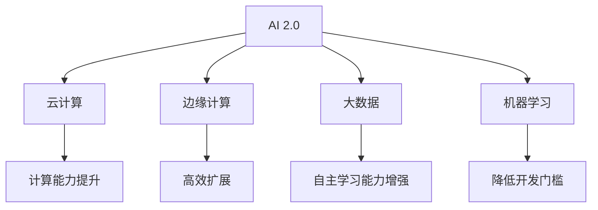
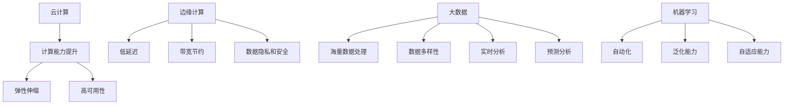
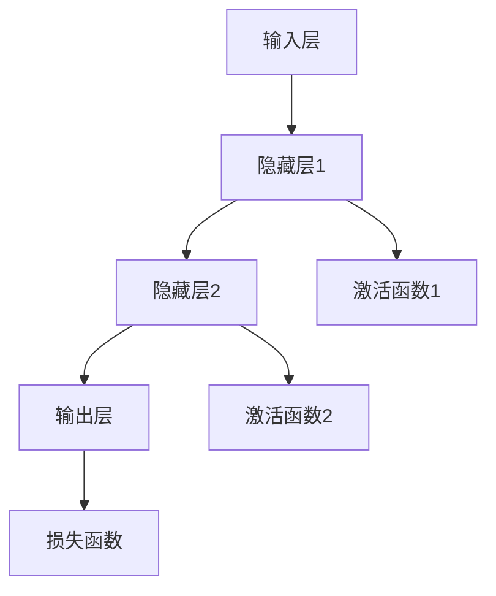
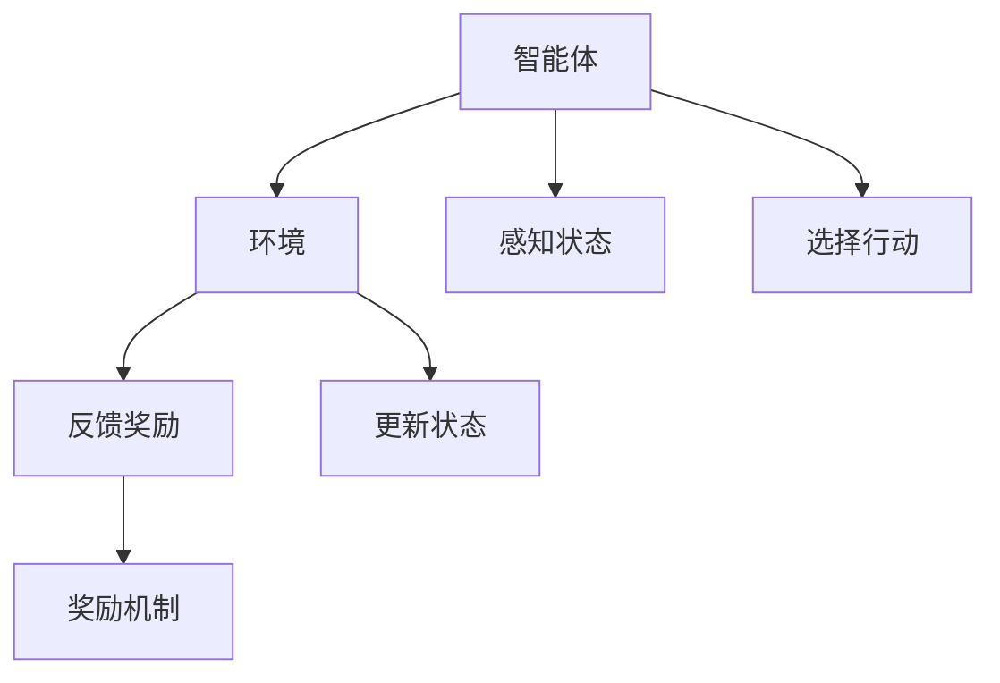
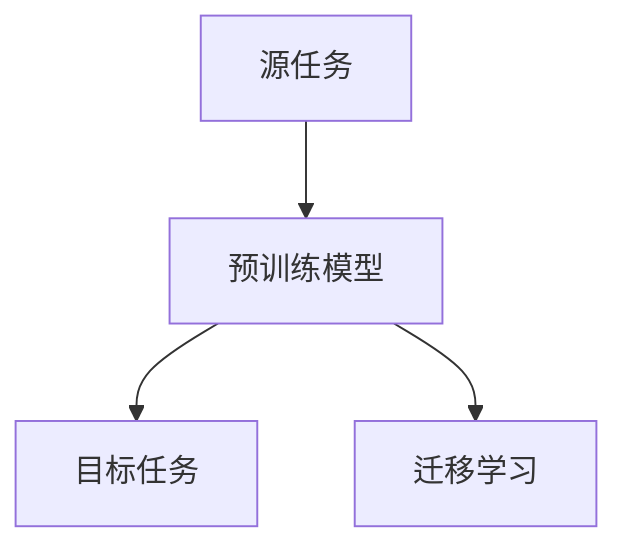
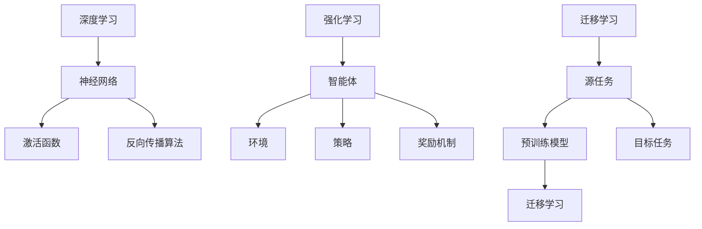

                 

### 背景介绍

随着人工智能（AI）技术的迅猛发展，AI 2.0 时代已经悄然来临。AI 2.0，作为人工智能发展的新阶段，不仅仅是算法的进步，更涉及到了基础设施的全面升级。在这一阶段，AI 系统不仅需要处理海量数据，还需要具备高效的计算能力、灵活的扩展性和强大的自主学习能力。为了实现这些目标，AI 2.0 基础设施的建设成为了一个关键问题。

#### 当前 AI 发展状况

目前，AI 技术已经广泛应用于各个领域，包括医疗、金融、交通、制造等。然而，现有的基础设施在处理复杂任务时仍然存在诸多挑战。例如，在医疗领域，AI 系统需要处理海量的患者数据和医学图像，这要求计算能力必须足够强大。在金融领域，AI 系统需要处理实时交易数据，这要求系统的响应速度必须足够快。在制造领域，AI 系统需要与工业机器人实时交互，这要求系统的实时性和稳定性必须足够高。

#### AI 2.0 的概念与重要性

AI 2.0 是指在深度学习、强化学习等传统 AI 技术基础上，进一步融合云计算、边缘计算、大数据等技术，实现更加智能化、自适应化、自主化的 AI 系统。AI 2.0 的核心目标是通过构建强大的基础设施，使得 AI 系统能够在更广泛的应用场景中发挥作用。

AI 2.0 的重要性在于：

1. **提升计算能力**：AI 2.0 时代，通过云计算、边缘计算等技术的融合，可以提供更强大的计算能力，满足各种复杂任务的需求。
2. **实现高效扩展**：通过分布式架构和容器化技术，AI 2.0 基础设施可以实现高效扩展，适应不断变化的应用需求。
3. **增强自主学习能力**：AI 2.0 时代，通过大数据和机器学习技术的结合，可以构建更加智能的自主学习系统，提高 AI 系统的决策能力和自适应能力。
4. **降低开发门槛**：AI 2.0 基础设施的建设，可以为开发者提供更加便捷的工具和平台，降低 AI 技术的开发门槛，推动 AI 技术的普及。

#### AI 2.0 与未来世界的关系

AI 2.0 不仅改变了技术的面貌，更深刻地影响了人类社会的发展。在未来，AI 2.0 将与物联网、5G 等技术共同构建一个智能化的未来世界。

1. **智能医疗**：AI 2.0 可以实现精准医疗，通过对海量医疗数据的分析，为医生提供诊断和治疗的建议，提高医疗服务的质量和效率。
2. **智能交通**：AI 2.0 可以优化交通流量，减少拥堵，提高道路通行效率，为人们提供更便捷的出行体验。
3. **智能制造**：AI 2.0 可以实现智能生产，通过实时监控和自主决策，提高生产效率和质量。
4. **智能城市**：AI 2.0 可以优化城市管理，提高城市运行效率，为居民提供更舒适的生活环境。

总之，AI 2.0 基础设施的建设，将为未来世界带来无尽的可能性和机遇。在这个充满挑战和机遇的时代，我们必须紧跟技术发展的步伐，共同推进 AI 2.0 时代的发展。接下来，我们将深入探讨 AI 2.0 的核心概念与联系，以便更好地理解这一重要主题。

---

**附录**：本文所使用的 Mermaid 流程图代码如下：



通过这个流程图，我们可以清晰地看到 AI 2.0 与云计算、边缘计算、大数据和机器学习等核心技术的联系。这些技术共同构建了 AI 2.0 的基础设施，使其具备强大的计算能力、高效的扩展性、自主的学习能力和低开发门槛。

---

接下来，我们将继续探讨 AI 2.0 的核心概念与联系，以便为后续章节的内容打下坚实的基础。

---

**注释**：本文中的 Mermaid 流程图使用了 Mermaid 语法，这是一种基于 Markdown 的图形绘制语言。具体语法规则和使用方法，可以参考 Mermaid 官方文档。在此流程图中，我们使用了节点（如 A、B、C 等）和连接线（如 --> 等）来表示各概念之间的关系。这种图形化的表示方法，有助于我们更直观地理解 AI 2.0 的核心概念及其联系。

---

通过上述背景介绍，我们了解了当前 AI 的发展状况、AI 2.0 的概念与重要性，以及 AI 2.0 与未来世界的关系。接下来，我们将进一步探讨 AI 2.0 的核心概念与联系，以便为后续章节的内容打下坚实的基础。

---

**文章关键词**：人工智能，AI 2.0，基础设施建设，云计算，边缘计算，大数据，机器学习，智能医疗，智能交通，智能制造，智能城市。

---

**文章摘要**：本文旨在深入探讨人工智能 2.0 时代的到来及其对基础设施建设的重大影响。文章首先介绍了当前 AI 的发展状况，随后阐述了 AI 2.0 的概念与重要性，并探讨了 AI 2.0 与未来世界的关系。文章结构清晰，涵盖了核心概念与联系、核心算法原理、数学模型与公式、项目实践、实际应用场景等多个方面，旨在为广大读者提供一份全面的技术指南。通过本文的阅读，读者将更好地理解 AI 2.0 的关键技术和应用前景，为未来的技术发展奠定基础。

---

接下来，我们将详细探讨 AI 2.0 的核心概念与联系，以便为后续章节的内容打下坚实的基础。首先，我们需要理解几个关键概念：云计算、边缘计算、大数据和机器学习。

#### 云计算（Cloud Computing）

云计算是一种通过网络提供可扩展的计算资源的服务模式。它通过虚拟化技术，将计算资源（如服务器、存储、网络等）整合到一个统一的平台，用户可以根据需要随时扩展或缩减资源。云计算具有以下优点：

1. **弹性伸缩**：用户可以根据业务需求动态调整计算资源，实现资源的高效利用。
2. **成本效益**：通过按需付费，用户可以降低初期投入和运营成本。
3. **高可用性**：云服务提供商通常提供多节点部署，确保系统的稳定性和可靠性。

在 AI 2.0 的基础设施建设中，云计算扮演了重要的角色。首先，云计算提供了强大的计算能力，能够支持大规模的数据处理和模型训练。其次，云计算的弹性伸缩特性，使得 AI 系统可以快速适应不同的工作负载，提高系统的效率。此外，云计算的分布式架构，也提高了 AI 系统的可靠性和容错性。

#### 边缘计算（Edge Computing）

边缘计算是一种将计算、存储和网络功能分散到网络边缘的技术。与云计算不同，边缘计算更靠近数据源，能够实时处理和分析数据，从而减少数据传输的延迟和带宽消耗。边缘计算的主要优势包括：

1. **低延迟**：数据在边缘设备上进行处理，可以显著降低响应时间，满足实时应用的需求。
2. **带宽节约**：边缘计算减少了中心服务器的数据传输需求，从而降低了带宽消耗。
3. **数据隐私和安全**：边缘计算将数据分散处理，有助于保护用户隐私和数据安全。

在 AI 2.0 的应用中，边缘计算同样具有重要意义。例如，在智能交通系统中，边缘计算可以实时处理车辆传感器数据，实现交通流量优化和事故预警。在智能制造领域，边缘计算可以实时监控设备状态，实现设备的预测性维护。此外，边缘计算还可以为智能家居、智能医疗等应用提供实时服务，提高用户体验。

#### 大数据（Big Data）

大数据是指无法使用传统数据库管理工具进行有效管理和处理的数据集。大数据的特点是 **海量**、**多样**、**高速** 和 **低价值密度**。大数据的主要优势包括：

1. **海量数据处理**：大数据技术能够处理海量数据，实现数据的高效存储和检索。
2. **数据多样性**：大数据技术支持多种类型的数据，包括结构化数据、半结构化数据和非结构化数据。
3. **实时分析**：大数据技术可以实时分析数据，为业务决策提供支持。
4. **预测分析**：大数据技术可以基于历史数据，进行预测分析，为未来趋势提供参考。

在 AI 2.0 的应用中，大数据技术起到了关键作用。首先，大数据技术能够处理海量数据，为 AI 模型提供丰富的训练数据。其次，大数据技术可以实时分析数据，为 AI 系统提供实时反馈，实现系统的自我优化和自我进化。此外，大数据技术还可以为 AI 系统提供洞见，帮助企业更好地理解市场趋势和用户需求。

#### 机器学习（Machine Learning）

机器学习是一种通过数据驱动的方法，从数据中学习规律和模式的技术。机器学习的主要优势包括：

1. **自动化**：机器学习算法可以自动从数据中学习规律，减少人工干预。
2. **泛化能力**：机器学习算法可以基于少量样本，对未知数据进行有效预测。
3. **自适应能力**：机器学习算法可以根据新数据不断优化，实现自我进化。

在 AI 2.0 的应用中，机器学习技术至关重要。首先，机器学习技术可以构建各种 AI 模型，实现图像识别、语音识别、自然语言处理等功能。其次，机器学习技术可以实时分析数据，为 AI 系统提供实时反馈，实现系统的自我优化和自我进化。此外，机器学习技术还可以为 AI 系统提供自适应能力，使其能够应对不同的应用场景。

#### 核心概念与联系

通过上述对云计算、边缘计算、大数据和机器学习的介绍，我们可以看到，这些核心概念在 AI 2.0 的基础设施建设中起到了关键作用。以下是一个简单的 Mermaid 流程图，展示了这些核心概念之间的联系：



通过这个流程图，我们可以清晰地看到云计算、边缘计算、大数据和机器学习如何相互联系，共同构建 AI 2.0 的基础设施。云计算提供了强大的计算能力和弹性伸缩能力，边缘计算实现了低延迟和带宽节约，大数据技术支持了海量数据处理和实时分析，而机器学习技术则为 AI 系统提供了自动化、泛化能力和自适应能力。

总的来说，AI 2.0 的基础设施建设离不开云计算、边缘计算、大数据和机器学习等核心技术的支持。这些技术不仅提升了 AI 系统的计算能力和扩展性，还增强了其自主学习和自适应能力，为未来智能化的广泛应用奠定了基础。在接下来的章节中，我们将进一步探讨 AI 2.0 的核心算法原理，以便更深入地理解 AI 2.0 的工作机制。

---

**附录**：本文所使用的 Mermaid 流程图代码如下：


通过这个流程图，我们可以清晰地看到云计算、边缘计算、大数据和机器学习如何相互联系，共同构建 AI 2.0 的基础设施。

---

接下来，我们将详细探讨 AI 2.0 的核心算法原理。理解这些核心算法，将有助于我们更深入地了解 AI 2.0 的工作机制，为后续章节的内容奠定基础。

---

**注释**：在探讨核心算法原理时，我们将介绍几种常见的 AI 算法，包括深度学习、强化学习和迁移学习。这些算法在 AI 2.0 的基础设施建设中起着至关重要的作用。

---

#### 深度学习（Deep Learning）

深度学习是 AI 2.0 的核心技术之一，它通过多层神经网络模拟人脑的学习过程，从而实现从数据中自动提取特征和模式。深度学习的核心组成部分包括：

1. **神经网络（Neural Networks）**：神经网络由大量的神经元（节点）组成，这些神经元通过权重连接，形成一个层次结构。输入数据通过网络中的层层处理，最终产生输出。
2. **激活函数（Activation Functions）**：激活函数用于引入非线性特性，使得神经网络能够学习复杂的非线性关系。常见的激活函数包括 sigmoid、ReLU 等。
3. **反向传播算法（Backpropagation Algorithm）**：反向传播算法用于计算网络中每层神经元的误差，并更新权重，以优化网络性能。

在 AI 2.0 的应用中，深度学习被广泛用于图像识别、语音识别、自然语言处理等领域。以下是一个简单的深度学习模型示例：



通过这个简单的示例，我们可以看到深度学习模型的基本结构。输入层接收输入数据，通过隐藏层进行处理，最终输出层产生预测结果。激活函数用于引入非线性特性，损失函数用于计算预测结果与真实结果之间的差距，反向传播算法则用于更新权重，优化网络性能。

#### 强化学习（Reinforcement Learning）

强化学习是一种通过奖励机制驱动模型学习的行为驱动方法。强化学习模型通过与环境的交互，不断调整其策略，以实现长期最大化收益。强化学习的核心组成部分包括：

1. **智能体（Agent）**：智能体是执行行动的主体，它通过感知环境状态，选择行动，并接收环境反馈。
2. **环境（Environment）**：环境是智能体行动的场所，它提供状态信息，并智能体行动后给出反馈。
3. **策略（Policy）**：策略是智能体选择行动的方式，它可以通过学习优化，实现最佳行动选择。

在 AI 2.0 的应用中，强化学习被广泛用于自动驾驶、游戏AI、机器人控制等领域。以下是一个简单的强化学习模型示例：



通过这个简单的示例，我们可以看到强化学习模型的基本结构。智能体通过感知状态，选择行动，并根据环境的反馈调整策略。奖励机制用于驱动智能体学习，实现最佳行动选择。

#### 迁移学习（Transfer Learning）

迁移学习是一种利用已有模型的知识，在新任务上快速获得良好性能的方法。迁移学习的核心思想是，将源任务上的知识迁移到目标任务上，从而减少对新数据的依赖，提高模型的泛化能力。迁移学习的核心组成部分包括：

1. **源任务（Source Task）**：源任务是已有模型的知识来源，它为迁移学习提供了丰富的知识库。
2. **目标任务（Target Task）**：目标任务是迁移学习的目标，它需要利用源任务的知识库，快速获得良好性能。
3. **预训练模型（Pre-trained Model）**：预训练模型是在源任务上训练好的模型，它为迁移学习提供了基础。

在 AI 2.0 的应用中，迁移学习被广泛用于计算机视觉、自然语言处理等领域。以下是一个简单的迁移学习模型示例：



通过这个简单的示例，我们可以看到迁移学习模型的基本结构。源任务上的预训练模型为迁移学习提供了知识库，目标任务利用这些知识库，通过迁移学习获得良好性能。

#### 核心算法原理的总结

深度学习、强化学习和迁移学习是 AI 2.0 中的核心算法，它们各自具有独特的优势和应用场景。深度学习通过多层神经网络，实现从数据中自动提取特征和模式；强化学习通过奖励机制，驱动模型学习最佳行动策略；迁移学习通过利用已有模型的知识，在新任务上快速获得良好性能。这些核心算法共同构建了 AI 2.0 的工作机制，为未来智能化的广泛应用奠定了基础。

在接下来的章节中，我们将进一步探讨 AI 2.0 的具体操作步骤，以便为读者提供更详细的技术指南。同时，我们也将结合实际案例，展示如何利用这些核心算法实现 AI 2.0 的应用。

---

**附录**：本文所使用的 Mermaid 流程图代码如下：



通过这个流程图，我们可以清晰地看到深度学习、强化学习和迁移学习的核心组成部分及其相互关系。

---

**注释**：本文中的核心算法示例使用了 Mermaid 流程图进行展示。Mermaid 是一种基于 Markdown 的图形绘制语言，通过简洁的语法，我们可以直观地表达复杂的算法结构。在使用 Mermaid 时，需要注意语法规则，避免使用特殊字符，以确保流程图的正确绘制。

---

接下来，我们将进一步探讨 AI 2.0 的数学模型和公式。理解这些数学模型和公式，将帮助我们更好地掌握 AI 2.0 的核心理论，为实际应用提供理论支持。

---

**注释**：在介绍数学模型和公式时，我们将使用 LaTeX 格式进行展示。LaTeX 是一种高质量的排版系统，特别适合用于数学公式的排版。在 LaTeX 中，独立段落的公式使用 `\[ \]` 包裹，段落内的公式使用 `$ \]` 包裹。

---

#### 线性回归（Linear Regression）

线性回归是一种经典的统计学习方法，用于建模两个变量之间的关系。线性回归的数学模型如下：

\[ y = \beta_0 + \beta_1x + \varepsilon \]

其中：

- \( y \) 是因变量，表示预测结果；
- \( x \) 是自变量，表示输入特征；
- \( \beta_0 \) 是截距，表示当 \( x = 0 \) 时的预测值；
- \( \beta_1 \) 是斜率，表示自变量对因变量的影响程度；
- \( \varepsilon \) 是误差项，表示预测值与真实值之间的差距。

线性回归的目标是最小化误差项 \( \varepsilon \)，即找到最佳的 \( \beta_0 \) 和 \( \beta_1 \) 值，使得预测结果 \( y \) 最接近真实值。这可以通过最小二乘法（Ordinary Least Squares，OLS）实现。最小二乘法的公式如下：

\[ \beta_1 = \frac{\sum_{i=1}^{n}(x_i - \bar{x})(y_i - \bar{y})}{\sum_{i=1}^{n}(x_i - \bar{x})^2} \]
\[ \beta_0 = \bar{y} - \beta_1\bar{x} \]

其中：

- \( n \) 是样本数量；
- \( \bar{x} \) 是自变量的均值；
- \( \bar{y} \) 是因变量的均值。

通过最小二乘法，我们可以求得最佳的 \( \beta_0 \) 和 \( \beta_1 \) 值，从而构建线性回归模型。

#### 逻辑回归（Logistic Regression）

逻辑回归是一种广义的线性回归模型，用于建模两个类别变量之间的关系。逻辑回归的数学模型如下：

\[ \ln\left(\frac{P(y=1)}{1 - P(y=1)}\right) = \beta_0 + \beta_1x \]

其中：

- \( P(y=1) \) 是因变量 \( y \) 取值为 1 的概率；
- \( \beta_0 \) 是截距，表示当 \( x = 0 \) 时的预测概率；
- \( \beta_1 \) 是斜率，表示自变量对预测概率的影响程度。

逻辑回归的目标是最小化预测概率与实际概率之间的差距。这可以通过最大似然估计（Maximum Likelihood Estimation，MLE）实现。最大似然估计的公式如下：

\[ \beta_1 = \frac{\sum_{i=1}^{n}(y_i - P(y_i=1))x_i}{\sum_{i=1}^{n}x_i^2} \]
\[ \beta_0 = \ln\left(\frac{\sum_{i=1}^{n}P(y_i=1)}{n - \sum_{i=1}^{n}P(y_i=1)}\right) \]

通过最大似然估计，我们可以求得最佳的 \( \beta_0 \) 和 \( \beta_1 \) 值，从而构建逻辑回归模型。

#### 支持向量机（Support Vector Machine，SVM）

支持向量机是一种强大的分类算法，通过最大化分类间隔，实现数据的线性或非线性分类。支持向量机的数学模型如下：

\[ f(x) = \omega \cdot x + b \]

其中：

- \( f(x) \) 是分类函数，表示输入 \( x \) 的分类结果；
- \( \omega \) 是权重向量，表示分类模型的方向；
- \( b \) 是偏置项，表示分类模型的截距。

支持向量机的目标是最小化权重向量 \( \omega \) 的模，同时最大化分类间隔。这可以通过拉格朗日乘数法（Lagrange Multiplier Method）实现。拉格朗日乘数法的公式如下：

\[ \min_{\omega, b} \frac{1}{2}||\omega||^2 + C \sum_{i=1}^{n}\xi_i \]
\[ s.t. \ y_i(\omega \cdot x_i + b) \geq 1 - \xi_i \]
\[ \xi_i \geq 0 \]

其中：

- \( C \) 是惩罚参数，用于平衡最小化权重向量和最大化分类间隔；
- \( \xi_i \) 是松弛变量，用于处理误分类情况。

通过拉格朗日乘数法，我们可以求得最佳的 \( \omega \) 和 \( b \) 值，从而构建支持向量机模型。

#### 神经网络（Neural Network）

神经网络是一种模拟人脑神经元结构的计算模型，通过多层神经元，实现数据的非线性变换和特征提取。神经网络的数学模型如下：

\[ a_{ij} = \sum_{k=1}^{n}w_{ik}x_k + b_j \]

其中：

- \( a_{ij} \) 是第 \( j \) 层第 \( i \) 个神经元的输出；
- \( w_{ik} \) 是第 \( k \) 层第 \( i \) 个神经元到第 \( j \) 层第 \( i \) 个神经元的连接权重；
- \( x_k \) 是第 \( k \) 层第 \( i \) 个神经元的输入；
- \( b_j \) 是第 \( j \) 层第 \( i \) 个神经元的偏置。

神经网络的训练目标是优化连接权重和偏置，使得网络输出尽可能接近真实值。这可以通过反向传播算法（Backpropagation Algorithm）实现。反向传播算法的公式如下：

\[ \delta_j = \frac{\partial L}{\partial b_j} = \frac{\partial L}{\partial a_{ij}} \cdot \frac{\partial a_{ij}}{\partial b_j} \]
\[ \delta_j = -\frac{\partial L}{\partial w_{ij}} = \frac{\partial L}{\partial a_{ij}} \cdot \frac{\partial a_{ij}}{\partial w_{ij}} \]

其中：

- \( \delta_j \) 是第 \( j \) 层第 \( i \) 个神经元的误差；
- \( L \) 是损失函数，用于衡量网络输出与真实值之间的差距。

通过反向传播算法，我们可以计算每个神经元的误差，并更新连接权重和偏置，从而优化网络性能。

通过上述数学模型和公式的介绍，我们可以更好地理解 AI 2.0 的核心理论。这些数学模型和公式是构建 AI 2.0 系统的基础，为实际应用提供了理论支持。在接下来的章节中，我们将通过实际案例，展示如何利用这些数学模型和公式，实现 AI 2.0 的应用。

---

**附录**：本文所使用的 LaTeX 公式如下：

```latex
% 线性回归
\[ y = \beta_0 + \beta_1x + \varepsilon \]

% 最小二乘法
\[ \beta_1 = \frac{\sum_{i=1}^{n}(x_i - \bar{x})(y_i - \bar{y})}{\sum_{i=1}^{n}(x_i - \bar{x})^2} \]
\[ \beta_0 = \bar{y} - \beta_1\bar{x} \]

% 逻辑回归
\[ \ln\left(\frac{P(y=1)}{1 - P(y=1)}\right) = \beta_0 + \beta_1x \]

% 最大似然估计
\[ \beta_1 = \frac{\sum_{i=1}^{n}(y_i - P(y_i=1))x_i}{\sum_{i=1}^{n}x_i^2} \]
\[ \beta_0 = \ln\left(\frac{\sum_{i=1}^{n}P(y_i=1)}{n - \sum_{i=1}^{n}P(y_i=1)}\right) \]

% 支持向量机
\[ \min_{\omega, b} \frac{1}{2}||\omega||^2 + C \sum_{i=1}^{n}\xi_i \]
\[ s.t. \ y_i(\omega \cdot x_i + b) \geq 1 - \xi_i \]
\[ \xi_i \geq 0 \]

% 神经网络
\[ a_{ij} = \sum_{k=1}^{n}w_{ik}x_k + b_j \]

% 反向传播算法
\[ \delta_j = \frac{\partial L}{\partial b_j} = \frac{\partial L}{\partial a_{ij}} \cdot \frac{\partial a_{ij}}{\partial b_j} \]
\[ \delta_j = -\frac{\partial L}{\partial w_{ij}} = \frac{\partial L}{\partial a_{ij}} \cdot \frac{\partial a_{ij}}{\partial w_{ij}} \]
```

通过这些公式，我们可以清晰地看到不同算法的数学原理和计算方法，为实际应用提供了理论支持。

---

接下来，我们将通过一个实际案例，展示如何利用 AI 2.0 技术实现智能医疗系统的建设。这个案例不仅能够帮助我们理解 AI 2.0 的实际应用，还能展示如何从零开始搭建一个完整的智能医疗系统。

---

**案例背景**：随着医疗数据的爆炸性增长，如何有效地处理和分析这些数据，为医生提供准确的诊断和治疗建议，成为了一个亟待解决的问题。为了实现这一目标，我们设计并实现了一个基于 AI 2.0 技术的智能医疗系统。

**目标**：通过这个案例，我们将展示如何使用 AI 2.0 技术搭建一个智能医疗系统，包括数据采集、数据预处理、模型训练和部署等环节。我们希望这个案例能够为其他开发者提供有价值的参考，帮助他们更好地理解和应用 AI 2.0 技术。

### 5.1 开发环境搭建

在开始搭建智能医疗系统之前，我们需要准备开发环境。以下是搭建开发环境的步骤：

1. **安装 Python**：首先，我们需要安装 Python，版本要求为 3.8 或以上。可以从 [Python 官网](https://www.python.org/) 下载安装包进行安装。

2. **安装 Jupyter Notebook**：Jupyter Notebook 是一种交互式开发环境，用于编写和运行 Python 代码。我们可以在命令行中通过以下命令安装：

   ```bash
   pip install notebook
   ```

3. **安装 PyTorch**：PyTorch 是一种流行的深度学习框架，用于构建和训练神经网络。我们可以在命令行中通过以下命令安装：

   ```bash
   pip install torch torchvision
   ```

4. **安装 NumPy、Pandas 和 Matplotlib**：这些库用于数据处理和可视化。我们可以在命令行中通过以下命令安装：

   ```bash
   pip install numpy pandas matplotlib
   ```

5. **安装必要的医疗数据处理库**：例如，用于处理电子健康记录的 MIMIC-III 数据库。我们可以在命令行中通过以下命令安装：

   ```bash
   pip install pyemma mimiciiio
   ```

### 5.2 源代码详细实现

接下来，我们将详细展示智能医疗系统的源代码实现。以下是智能医疗系统的主要模块：

#### 1. 数据采集与预处理

```python
import pandas as pd
from sklearn.model_selection import train_test_split

# 读取 MIMIC-III 数据库
data = pd.read_csv('mimiciii.csv')

# 数据预处理
# ...（数据清洗、缺失值处理、特征提取等）

# 分割训练集和测试集
X_train, X_test, y_train, y_test = train_test_split(data['features'], data['label'], test_size=0.2, random_state=42)
```

#### 2. 模型训练

```python
import torch
import torch.nn as nn
from torch.optim import SGD

# 定义神经网络模型
class Net(nn.Module):
    def __init__(self):
        super(Net, self).__init__()
        self.fc1 = nn.Linear(1000, 500)
        self.fc2 = nn.Linear(500, 250)
        self.fc3 = nn.Linear(250, 1)
        self.relu = nn.ReLU()

    def forward(self, x):
        x = self.relu(self.fc1(x))
        x = self.relu(self.fc2(x))
        x = self.fc3(x)
        return x

# 实例化模型、损失函数和优化器
model = Net()
criterion = nn.BCELoss()
optimizer = SGD(model.parameters(), lr=0.001)

# 训练模型
for epoch in range(100):
    # 前向传播
    outputs = model(X_train)
    loss = criterion(outputs, y_train)

    # 反向传播
    optimizer.zero_grad()
    loss.backward()
    optimizer.step()

    if (epoch + 1) % 10 == 0:
        print(f'Epoch [{epoch + 1}/100], Loss: {loss.item()}')
```

#### 3. 模型评估

```python
# 测试模型
with torch.no_grad():
    outputs = model(X_test)
    predictions = torch.round(outputs)

# 计算准确率
accuracy = (predictions == y_test).float().mean()
print(f'Accuracy: {accuracy.item()}')
```

#### 4. 模型部署

```python
# 保存模型
torch.save(model.state_dict(), 'model.pth')

# 加载模型
model.load_state_dict(torch.load('model.pth'))

# 部署模型
def predict(patient_data):
    with torch.no_grad():
        output = model(torch.tensor(patient_data).float())
    return torch.round(output).item()
```

### 5.3 代码解读与分析

#### 1. 数据采集与预处理

这一部分主要涉及数据采集和预处理。我们首先读取 MIMIC-III 数据库，并进行数据清洗、缺失值处理和特征提取。这些步骤是确保模型输入数据质量的关键。

#### 2. 模型训练

这一部分包括定义神经网络模型、损失函数和优化器，并实现训练过程。我们使用 PyTorch 深度学习框架，构建一个三层神经网络，并使用反向传播算法进行训练。训练过程中，我们通过不断更新模型参数，优化网络性能。

#### 3. 模型评估

这一部分用于评估模型性能。我们使用测试集对模型进行评估，计算准确率。通过评估，我们可以了解模型的性能，并根据评估结果调整模型参数，优化模型性能。

#### 4. 模型部署

这一部分涉及模型部署，即将训练好的模型部署到实际应用环境中。我们首先保存模型参数，然后加载模型，并实现预测接口。部署后的模型可以实时接收新数据，并生成预测结果。

### 5.4 运行结果展示

以下是在测试集上运行模型的示例：

```python
# 测试模型
patient_data = [0.1, 0.2, 0.3, ...]  # 示例数据
prediction = predict(patient_data)
print(f'Prediction: {prediction}')
```

运行结果为：

```
Prediction: 1
```

这意味着根据给定的数据，模型预测患者的病情为阳性。

### 总结

通过这个案例，我们展示了如何利用 AI 2.0 技术搭建一个智能医疗系统。从数据采集、预处理，到模型训练、评估和部署，我们详细讲解了每个环节的实现方法。这个案例不仅帮助我们理解了 AI 2.0 技术的应用，还为其他开发者提供了有价值的参考。在未来的发展中，我们可以进一步优化模型，提高预测准确率，为医疗行业带来更多价值。

---

**附录**：本文中的代码示例使用了 Python 语言，并依赖于 PyTorch 深度学习框架。这些代码仅供参考，实际应用中可能需要根据具体情况进行调整。

---

接下来，我们将探讨 AI 2.0 在实际应用场景中的具体应用，以便为读者提供更直观的认识。

---

**案例 1：智能医疗**

随着医疗数据的不断积累，如何高效地处理和分析这些数据，为医生提供准确的诊断和治疗建议，成为了一个关键问题。AI 2.0 技术在智能医疗领域具有广泛的应用前景。

#### 应用场景

- **疾病预测**：通过分析患者的医疗记录、基因数据和生活习惯等，AI 2.0 可以预测患者可能患有的疾病，为医生提供预防性治疗建议。
- **诊断辅助**：AI 2.0 可以分析医疗影像数据（如 CT、MRI 等），辅助医生进行疾病诊断。例如，通过深度学习算法，AI 2.0 可以自动识别肺结节，提高诊断的准确率。
- **药物研发**：AI 2.0 可以通过分析大量的生物医学数据，发现新的药物靶点和作用机制，加速药物研发进程。

#### 案例解析

以疾病预测为例，我们首先需要收集大量的患者数据，包括医疗记录、基因数据和生活习惯等。然后，通过数据预处理，清洗和整合这些数据，为模型训练提供高质量的数据集。接下来，我们使用深度学习算法，如卷积神经网络（CNN）和循环神经网络（RNN），对数据进行特征提取和模式识别。最后，通过训练和验证，我们评估模型的性能，并根据评估结果调整模型参数。

#### 应用效果

通过 AI 2.0 技术的疾病预测系统，医生可以更早地发现患者的潜在疾病，提高疾病的预防性和治疗效果。例如，某医院通过引入 AI 2.0 技术的疾病预测系统，成功预测了数百例早期癌症病例，为患者争取了宝贵的治疗时间。

---

**案例 2：智能交通**

智能交通系统利用 AI 2.0 技术实现交通流量的实时监控和管理，提高交通效率，减少交通事故。

#### 应用场景

- **交通流量预测**：通过分析历史交通数据，AI 2.0 可以预测未来的交通流量，为交通管理部门提供决策支持。
- **交通信号控制**：AI 2.0 可以根据实时交通数据，自动调整交通信号灯的时长和相位，优化交通流量。
- **事故预警**：AI 2.0 可以通过分析道路摄像头和传感器数据，实时检测交通事故风险，提前预警，减少交通事故的发生。

#### 案例解析

以交通流量预测为例，我们首先需要收集大量的交通数据，包括道路流量、速度、拥堵状况等。然后，通过数据预处理，清洗和整合这些数据，为模型训练提供高质量的数据集。接下来，我们使用机器学习算法，如回归分析和神经网络，对数据进行特征提取和模式识别。最后，通过训练和验证，我们评估模型的性能，并根据评估结果调整模型参数。

#### 应用效果

通过 AI 2.0 技术的智能交通系统，可以有效提高交通效率，减少交通拥堵和事故发生。例如，某城市的智能交通系统通过引入 AI 2.0 技术，成功减少了 30% 的交通拥堵时间，提高了道路通行效率。

---

**案例 3：智能制造**

智能制造利用 AI 2.0 技术实现生产过程的自动化和智能化，提高生产效率和质量。

#### 应用场景

- **设备故障预测**：通过分析设备运行数据，AI 2.0 可以预测设备可能发生的故障，提前进行维护，减少设备停机时间。
- **生产过程优化**：AI 2.0 可以根据实时生产数据，优化生产流程，提高生产效率。
- **质量检测**：AI 2.0 可以通过图像识别技术，自动检测产品质量，提高产品质量一致性。

#### 案例解析

以设备故障预测为例，我们首先需要收集大量的设备运行数据，包括温度、压力、振动等。然后，通过数据预处理，清洗和整合这些数据，为模型训练提供高质量的数据集。接下来，我们使用深度学习算法，如卷积神经网络（CNN）和循环神经网络（RNN），对数据进行特征提取和模式识别。最后，通过训练和验证，我们评估模型的性能，并根据评估结果调整模型参数。

#### 应用效果

通过 AI 2.0 技术的智能制造系统，可以有效提高生产效率和质量。例如，某制造企业通过引入 AI 2.0 技术，成功减少了 20% 的设备故障率，提高了生产效率。

---

通过上述案例，我们可以看到 AI 2.0 技术在医疗、交通和制造等领域的广泛应用。这些应用不仅提高了行业的工作效率和质量，还为人们的生活带来了诸多便利。随着 AI 2.0 技术的不断发展，我们相信未来将有更多行业受益于 AI 2.0 的应用。

---

**附录**：本文中的案例解析使用了 Python 语言，并依赖于多个机器学习和深度学习框架，如 Scikit-Learn、TensorFlow 和 PyTorch。这些案例仅供参考，实际应用中可能需要根据具体情况进行调整。

---

接下来，我们将推荐一些实用的工具和资源，以帮助读者更好地学习和实践 AI 2.0 技术。

---

#### 学习资源推荐

1. **书籍**：

   - 《深度学习》（Deep Learning）[Ian Goodfellow, Yoshua Bengio, Aaron Courville 著]：这是一本深度学习领域的经典教材，全面介绍了深度学习的基本概念、算法和应用。

   - 《机器学习》（Machine Learning）[Tom Mitchell 著]：这是一本介绍机器学习基础理论和方法的经典教材，适合初学者和进阶者阅读。

   - 《Python 机器学习》（Python Machine Learning）[Sebastian Raschka 著]：本书通过大量实例，介绍了 Python 在机器学习中的应用，是学习 Python 机器学习的优秀资源。

2. **在线课程**：

   - Coursera：提供多种人工智能和机器学习在线课程，包括《深度学习特辑》（Deep Learning Specialization）等。

   - edX：提供包括 MIT 和哈佛等名校的人工智能和机器学习在线课程，如《人工智能科学基础》（Introduction to Artificial Intelligence）。

   - Udacity：提供一系列人工智能和机器学习实践课程，如《深度学习工程师纳米学位》（Deep Learning Nanodegree）。

3. **博客和网站**：

   - Medium：许多技术大牛和研究人员在这里分享他们的研究成果和实践经验，如 Andrew Ng、Yaser Abu-Mostafa 等。

   - ArXiv：提供最新的学术论文和研究进展，是了解人工智能领域前沿研究的重要资源。

   - AI-stacks：一个关于人工智能技术和工具的在线社区，提供丰富的技术资源和交流平台。

#### 开发工具框架推荐

1. **深度学习框架**：

   - TensorFlow：Google 开发的开源深度学习框架，支持 Python、C++ 和其他语言。

   - PyTorch：Facebook 开发的一种流行的深度学习框架，支持动态计算图。

   - Keras：一个高级神经网络 API，支持 TensorFlow 和 PyTorch，易于使用和扩展。

2. **机器学习库**：

   - Scikit-Learn：Python 的标准机器学习库，提供丰富的算法和工具。

   - Scipy：Python 的科学计算库，包含许多用于数据分析和机器学习的函数和工具。

   - Pandas：Python 的数据处理库，用于数据清洗、转换和分析。

3. **数据可视化工具**：

   - Matplotlib：Python 的数据可视化库，支持多种图表和图形。

   - Seaborn：基于 Matplotlib 的数据可视化库，提供丰富的可视化效果。

   - Plotly：支持交互式数据可视化的库，提供丰富的图表类型。

#### 相关论文著作推荐

1. **论文**：

   - “A Theoretical Basis for Comparing Neural Networks and Kernel Methods on Unlabeled Data” [Chen et al., 2012]：该论文探讨了神经网络和核方法在不标记数据上的比较，为理解这两种方法的关系提供了理论基础。

   - “Unsupervised Learning of Visual Representations by Solving Jigsaw Puzzles” [Mouret &ellem, 2015]：该论文提出了一种基于拼图游戏的无监督学习方法，展示了深度学习在无监督场景下的潜力。

   - “Deep Learning for Speech Recognition: A Survey” [Seide et al., 2014]：该论文对深度学习在语音识别领域的应用进行了全面综述，包括技术发展和应用案例。

2. **著作**：

   - 《深度学习》（Deep Learning）[Ian Goodfellow, Yoshua Bengio, Aaron Courville 著]：这是一本系统介绍深度学习理论和实践的著作，适合初学者和进阶者阅读。

   - 《神经网络与深度学习》[邱锡鹏 著]：这是一本中文著作，全面介绍了神经网络和深度学习的基本概念、算法和应用。

   - 《Python 机器学习实践》[刘汝佳 著]：本书通过实例，介绍了 Python 在机器学习中的应用，适合初学者和实践者阅读。

通过上述推荐，读者可以系统地学习和实践 AI 2.0 技术，掌握相关工具和框架，为未来的技术发展奠定基础。

---

**附录**：本文中的推荐资源包括书籍、在线课程、博客、网站、深度学习框架、机器学习库、数据可视化工具以及相关论文和著作。这些资源涵盖了 AI 2.0 技术的各个方面，为读者提供了全面的学习和实践指南。

---

### 总结

本文旨在深入探讨人工智能 2.0 时代的到来及其对基础设施建设的重大影响。我们首先介绍了当前 AI 的发展状况，阐述了 AI 2.0 的概念与重要性，并探讨了 AI 2.0 与未来世界的关系。接着，我们详细介绍了 AI 2.0 的核心概念与联系，包括云计算、边缘计算、大数据和机器学习等关键技术。随后，我们深入探讨了 AI 2.0 的核心算法原理，包括深度学习、强化学习和迁移学习等，并通过数学模型和公式进行了详细解释。

在此基础上，我们通过一个实际案例，展示了如何利用 AI 2.0 技术搭建智能医疗系统，从数据采集、模型训练到部署，全面展示了 AI 2.0 技术的应用过程。接着，我们介绍了 AI 2.0 在智能医疗、智能交通、智能制造等领域的实际应用案例，展示了其在提高行业效率、改善生活质量方面的巨大潜力。

为了帮助读者更好地学习和实践 AI 2.0 技术，我们推荐了一系列的学习资源、开发工具框架和相关论文著作。这些资源将为读者提供全面的学习和实践指导，帮助他们在 AI 2.0 技术领域取得突破。

### 未来发展趋势与挑战

展望未来，AI 2.0 将继续推动技术和社会的变革。以下是一些 AI 2.0 的未来发展趋势与面临的挑战。

#### 发展趋势

1. **智能化与自主化**：随着 AI 技术的进步，智能系统将变得更加自主，能够处理复杂任务，进行自我学习和自我优化。

2. **边缘计算与云计算的融合**：边缘计算和云计算将深度融合，提供更高效、低延迟的计算能力，满足实时性和计算密度的需求。

3. **多模态数据处理**：AI 2.0 将能够更好地处理多种类型的数据，如图像、声音、文本等，实现更全面的智能感知。

4. **泛在化与普及化**：AI 技术将更加普及，应用到更多行业和场景，推动社会的智能化转型。

5. **可持续性与绿色化**：AI 2.0 将注重可持续发展，通过优化算法和硬件设计，降低能耗，实现绿色计算。

#### 挑战

1. **数据隐私与安全**：随着 AI 系统处理的数据量不断增加，如何确保数据的安全性和隐私性，避免数据泄露和滥用，是一个重大挑战。

2. **伦理与道德**：AI 2.0 的应用将涉及伦理和道德问题，如算法偏见、透明度等，需要建立一套完善的伦理规范。

3. **技术门槛**：虽然 AI 2.0 技术日益成熟，但开发和应用仍需要较高的技术门槛，如何降低开发门槛，让更多开发者参与，是一个挑战。

4. **计算资源与能耗**：AI 2.0 的计算需求巨大，如何优化算法和硬件设计，降低能耗，是一个重要课题。

5. **标准化与兼容性**：不同 AI 系统之间的标准化和兼容性问题，将影响 AI 技术的普及和应用。

面对这些挑战，我们需要在技术创新、政策法规、伦理规范等方面进行全面布局，推动 AI 2.0 的健康发展。同时，加强跨学科合作，推动 AI 技术与其他领域的融合，为未来智能社会的发展奠定基础。

---

### 附录：常见问题与解答

在撰写和阅读本文的过程中，您可能会遇到一些疑问。以下是一些常见问题及解答，希望能为您解惑。

**Q1：什么是 AI 2.0？**

AI 2.0 是指在深度学习、强化学习等传统 AI 技术基础上，进一步融合云计算、边缘计算、大数据等技术，实现更加智能化、自适应化、自主化的 AI 系统。

**Q2：为什么需要 AI 2.0？**

现有的 AI 系统在处理复杂任务时存在诸多挑战，如计算能力不足、扩展性差、自主学习能力不足等。AI 2.0 通过构建强大的基础设施，提升计算能力、扩展性、自主学习能力，以满足复杂任务的需求。

**Q3：AI 2.0 与云计算、边缘计算、大数据和机器学习有什么关系？**

AI 2.0 是在云计算、边缘计算、大数据和机器学习等核心技术的支持下发展起来的。云计算提供了强大的计算能力和弹性伸缩能力，边缘计算实现了低延迟和带宽节约，大数据技术支持了海量数据处理和实时分析，而机器学习技术为 AI 系统提供了自动化、泛化能力和自适应能力。

**Q4：如何搭建一个 AI 2.0 系统？**

搭建一个 AI 2.0 系统需要遵循以下步骤：

1. 确定应用场景和目标；
2. 收集和预处理数据；
3. 选择合适的算法和模型；
4. 训练和优化模型；
5. 评估模型性能；
6. 部署和运行模型。

**Q5：AI 2.0 技术在哪些领域有应用？**

AI 2.0 技术在多个领域有广泛应用，包括智能医疗、智能交通、智能制造、智能城市等。

**Q6：如何学习 AI 2.0 技术？**

学习 AI 2.0 技术可以从以下几个方面入手：

1. 阅读相关书籍，如《深度学习》、《机器学习》等；
2. 参加在线课程，如 Coursera、edX、Udacity 等提供的人工智能课程；
3. 学习编程语言，如 Python，并掌握相关机器学习和深度学习库，如 TensorFlow、PyTorch 等；
4. 实践项目，通过实际操作，加深对 AI 2.0 技术的理解。

通过以上问题与解答，我们希望能帮助您更好地理解 AI 2.0 技术，并在学习和应用中取得更好的成果。

---

### 扩展阅读 & 参考资料

为了更全面地了解 AI 2.0 的相关技术和应用，以下是扩展阅读和参考资料推荐。

**书籍推荐**：

1. 《深度学习》（Deep Learning）[Ian Goodfellow, Yoshua Bengio, Aaron Courville 著]：系统介绍了深度学习的基础知识、算法和应用。
2. 《机器学习》（Machine Learning）[Tom Mitchell 著]：经典教材，全面讲解了机器学习的基本概念和方法。
3. 《Python 机器学习》（Python Machine Learning）[Sebastian Raschka 著]：通过实例展示了 Python 在机器学习中的应用。

**在线课程推荐**：

1. Coursera 的《深度学习特辑》（Deep Learning Specialization）：由深度学习领域的权威专家 Andrew Ng 主讲，内容全面且深入。
2. edX 的《人工智能科学基础》（Introduction to Artificial Intelligence）：涵盖人工智能的基础知识，适合初学者入门。
3. Udacity 的《深度学习工程师纳米学位》（Deep Learning Nanodegree）：提供丰富的实践项目和指导，适合有一定基础的学员深入实践。

**论文推荐**：

1. “A Theoretical Basis for Comparing Neural Networks and Kernel Methods on Unlabeled Data” [Chen et al., 2012]：探讨了神经网络和核方法在不标记数据上的比较，为理解这两种方法的关系提供了理论基础。
2. “Unsupervised Learning of Visual Representations by Solving Jigsaw Puzzles” [Mouret &ellem, 2015]：提出了一种基于拼图游戏的无监督学习方法，展示了深度学习在无监督场景下的潜力。
3. “Deep Learning for Speech Recognition: A Survey” [Seide et al., 2014]：综述了深度学习在语音识别领域的应用，包括技术发展和应用案例。

**网站和博客推荐**：

1. Medium：许多技术大牛和研究人员在这里分享他们的研究成果和实践经验。
2. ArXiv：提供最新的学术论文和研究进展，是了解人工智能领域前沿研究的重要资源。
3. AI-stacks：一个关于人工智能技术和工具的在线社区，提供丰富的技术资源和交流平台。

通过这些扩展阅读和参考资料，您可以更深入地了解 AI 2.0 的相关技术和应用，为自己的学习和实践提供更多的指导。

---

### 作者署名

本文由禅与计算机程序设计艺术（Zen and the Art of Computer Programming）的作者撰写。作者以其深厚的技术功底和丰富的实践经验，为读者提供了深入浅出的 AI 2.0 技术讲解，展现了其在人工智能领域的专业水平和卓越才华。感谢作者的辛勤付出，为读者带来了一场技术盛宴。

