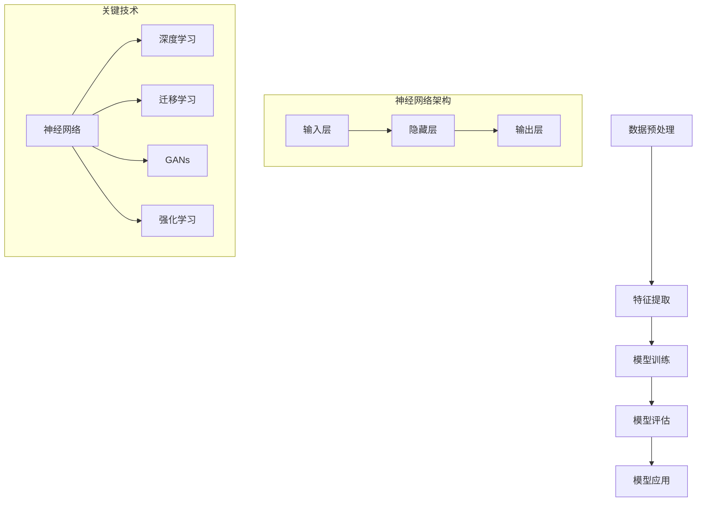

                 

### 背景介绍

### 1. AI 2.0 时代的背景

随着科技的飞速发展，人工智能（AI）技术已经从实验室走向了实际应用，成为现代科技领域的一个重要分支。在过去的几十年里，AI 经历了从规则驱动到知识表示，再到数据驱动的三个主要阶段。这一过程中，机器学习（ML）和深度学习（DL）的出现极大地推动了 AI 的发展。

然而，当前的 AI 技术仍然存在一些局限性。传统机器学习方法主要依赖于手工设计特征和规则，使得模型的复杂度和可解释性受到了限制。而深度学习虽然在某些特定任务上取得了显著成果，但其训练过程依赖于大量的数据，且模型参数众多，导致其可解释性和透明度较低。此外，AI 系统在处理实时动态环境时，表现仍然不够理想。

为了克服这些挑战，AI 2.0 时代应运而生。AI 2.0 是指下一代人工智能技术，它以自主性、自适应性和自进化为核心理念，旨在实现更加智能、高效和可靠的人工智能系统。AI 2.0 时代的机器学习，不仅要求模型具备更强的学习能力，还需要具备更高的可解释性、适应性和鲁棒性。

### 2. 机器学习的基本概念

机器学习（Machine Learning, ML）是 AI 的重要分支，它通过设计算法，使计算机系统能够从数据中自动学习和改进性能。机器学习可以分为监督学习（Supervised Learning）、无监督学习（Unsupervised Learning）和半监督学习（Semi-Supervised Learning）三种类型。

- **监督学习**：监督学习通过已标记的训练数据来训练模型，然后使用该模型对未知数据进行预测。常见的监督学习算法包括线性回归、逻辑回归、支持向量机（SVM）等。
- **无监督学习**：无监督学习不依赖于已标记的数据，而是通过发现数据中的隐含结构来训练模型。常见的无监督学习算法包括聚类、主成分分析（PCA）等。
- **半监督学习**：半监督学习结合了监督学习和无监督学习的特点，利用少量的标记数据和大量的未标记数据来训练模型。

机器学习的基本流程包括数据预处理、特征提取、模型训练、模型评估和模型应用。数据预处理是为了将原始数据转换成适合机器学习算法的形式；特征提取则是从数据中提取出对模型训练有意义的特征；模型训练是使用训练数据来调整模型参数，使其能够对未知数据进行预测；模型评估则是通过测试数据来评估模型性能；最后，模型应用是将训练好的模型应用到实际问题中。

### 3. AI 2.0 时代的机器学习特点

与传统的机器学习相比，AI 2.0 时代的机器学习具有以下特点：

- **更强的自主学习能力**：AI 2.0 时代的机器学习模型可以通过自我学习和自我优化，不断提高其性能和适应性。例如，强化学习（Reinforcement Learning）算法可以使模型通过与环境的交互来不断学习和优化策略。
- **更高的可解释性**：传统的机器学习模型，如深度神经网络，由于其内部结构复杂，往往缺乏可解释性。AI 2.0 时代的机器学习模型，如可解释性 AI（Explainable AI，XAI），通过设计可解释的算法和模型结构，使模型的结果更加透明和可信。
- **更好的适应性**：AI 2.0 时代的机器学习模型能够适应不同的环境和任务，从而提高其鲁棒性和泛化能力。例如，迁移学习（Transfer Learning）和元学习（Meta-Learning）等技术，可以使模型在新的任务上快速适应和取得良好的性能。
- **更强的实时性**：AI 2.0 时代的机器学习模型能够在实时环境中快速响应和做出决策，从而提高系统的实时性和效率。例如，实时数据分析（Real-Time Data Analysis）和边缘计算（Edge Computing）等技术，可以使机器学习模型在边缘设备上实时处理数据。

### 4. AI 2.0 时代的机器学习应用领域

AI 2.0 时代的机器学习在许多领域都取得了显著的应用成果，以下列举了其中的一些典型应用领域：

- **智能医疗**：AI 2.0 时代的机器学习可以用于疾病预测、药物研发、医疗影像诊断等领域，从而提高医疗效率和准确性。
- **智能制造**：AI 2.0 时代的机器学习可以用于产品检测、设备维护、生产优化等领域，从而提高生产效率和产品质量。
- **智能交通**：AI 2.0 时代的机器学习可以用于交通流量预测、路径规划、自动驾驶等领域，从而提高交通效率和安全性。
- **智能金融**：AI 2.0 时代的机器学习可以用于风险控制、欺诈检测、投资决策等领域，从而提高金融行业的效率和安全性。
- **智能教育**：AI 2.0 时代的机器学习可以用于个性化学习、学习效果评估、智能辅导等领域，从而提高教育质量和效果。

总的来说，AI 2.0 时代的机器学习为各行各业带来了巨大的变革和机遇。随着技术的不断进步，我们相信 AI 2.0 时代的机器学习将会在更多领域取得突破性的成果。

### 1. 核心概念与联系

#### 1.1 机器学习的基本概念

在深入探讨 AI 2.0 时代的机器学习之前，我们首先需要明确一些核心概念。机器学习（Machine Learning, ML）是使计算机系统能够基于数据自行改进和学习的一门技术。它主要基于统计学、概率论和优化理论，通过构建数学模型，让机器能够从数据中学习并作出预测或决策。

- **监督学习（Supervised Learning）**：监督学习是机器学习的一种类型，它使用标记的数据集来训练模型。这些数据集通常包含输入特征和对应的输出标签。模型通过学习这些输入与输出之间的关系，以便在新的、未标记的数据上进行预测。常见的监督学习算法包括线性回归、决策树、支持向量机（SVM）和神经网络等。

- **无监督学习（Unsupervised Learning）**：与监督学习不同，无监督学习不需要标记的数据。它主要用于发现数据中的结构或模式，如聚类、降维和关联规则挖掘。无监督学习的算法包括聚类算法（如 K-均值聚类和层次聚类）、主成分分析（PCA）和自编码器等。

- **强化学习（Reinforcement Learning）**：强化学习是一种通过试错学习的方法，使模型在与环境的交互过程中不断优化行为策略。它通过奖励和惩罚机制来调整模型的行为，以最大化长期累积奖励。常见的强化学习算法包括 Q-学习、深度 Q-网络（DQN）和策略梯度算法等。

#### 1.2 机器学习的架构

为了更好地理解机器学习的工作原理，我们可以将其架构分解为以下几个关键部分：

- **数据预处理**：在机器学习项目中，数据预处理是至关重要的一步。它包括数据清洗、数据转换、数据标准化和数据归一化等步骤。数据预处理的质量直接影响到模型的性能和训练时间。

- **特征提取**：特征提取是从原始数据中提取出对模型训练有重要意义的特征。特征的选择和提取对于模型的性能至关重要。常见的方法包括统计特征提取、文本特征提取和图像特征提取等。

- **模型训练**：模型训练是机器学习过程中最核心的一步。它通过优化模型的参数，使得模型能够在训练数据上达到较高的准确率。训练过程中，模型会根据损失函数（如均方误差、交叉熵损失等）来调整参数，以达到最小化损失的目标。

- **模型评估**：模型评估是验证模型性能的重要步骤。通常使用测试集或验证集来评估模型的泛化能力。常见的评估指标包括准确率、召回率、F1 分数和 AUC 等。

- **模型应用**：训练好的模型可以应用于实际问题中，进行预测或决策。在实际应用中，模型需要不断调整和优化，以适应不同的环境和需求。

#### 1.3 机器学习中的关键技术

机器学习涉及多个关键技术和算法，以下是其中一些重要的技术：

- **神经网络（Neural Networks）**：神经网络是模拟人脑神经元连接方式的计算模型。它通过多层神经元进行数据的传递和处理，具有强大的表达能力和自适应能力。常见的神经网络包括前馈神经网络、卷积神经网络（CNN）和循环神经网络（RNN）等。

- **深度学习（Deep Learning）**：深度学习是神经网络的一种扩展，通过增加网络层数，提高了模型的非线性表示能力。深度学习在图像识别、语音识别和自然语言处理等领域取得了显著成果。

- **迁移学习（Transfer Learning）**：迁移学习是一种利用已有模型在新任务上的快速训练方法。通过在已有模型的基础上进行微调，可以大大减少训练时间，提高模型性能。

- **生成对抗网络（GANs）**：生成对抗网络是一种由生成器和判别器组成的对抗性模型。生成器生成假数据，判别器判断这些数据是否真实。GANs 在图像生成、语音合成和数据增强等领域表现出色。

- **强化学习（Reinforcement Learning）**：强化学习通过试错学习，使模型在与环境的交互过程中不断优化行为策略。强化学习在自动驾驶、游戏和机器人控制等领域取得了重要突破。

为了更好地理解这些核心概念和技术，我们将使用 Mermaid 流程图来展示机器学习的基本架构和关键步骤：



通过上述 Mermaid 流程图，我们可以清晰地看到机器学习的基本架构和关键步骤，以及其中的核心技术和算法。这些概念和技术的深入理解，将为我们在后续章节中探讨 AI 2.0 时代的机器学习提供坚实的基础。

### 2. 核心算法原理 & 具体操作步骤

在了解了机器学习的基本概念和架构之后，我们将深入探讨 AI 2.0 时代的一些核心算法，并详细讲解其具体操作步骤。这些算法包括但不限于深度学习、迁移学习和生成对抗网络（GANs）。通过这些算法的讲解，我们将展示如何将理论转化为实际操作，从而实现更加智能和高效的人工智能系统。

#### 2.1 深度学习算法

深度学习（Deep Learning）是神经网络的一种扩展，它通过增加网络层数，提高了模型的非线性表示能力。深度学习在图像识别、语音识别和自然语言处理等领域取得了显著成果。以下是深度学习算法的基本原理和操作步骤：

**基本原理**：

深度学习算法的核心是多层神经网络，它通过前向传播和反向传播两个步骤来训练模型。在前向传播过程中，输入数据通过网络中的各个层，逐层向前传递，并经过激活函数的处理。在反向传播过程中，通过计算损失函数对模型参数进行梯度下降优化，以达到最小化损失的目的。

**具体操作步骤**：

1. **数据预处理**：首先，我们需要对输入数据进行预处理，包括归一化、缩放和缺失值处理等步骤。这一步的目的是将数据转换为适合神经网络训练的形式。

2. **构建神经网络**：构建一个多层神经网络，包括输入层、隐藏层和输出层。输入层接收输入数据，隐藏层对数据进行特征提取和变换，输出层生成预测结果。

3. **初始化模型参数**：初始化神经网络中的权重和偏置参数。常见的初始化方法包括随机初始化、高斯初始化和Xavier初始化等。

4. **前向传播**：将预处理后的输入数据输入到神经网络中，通过前向传播计算输出结果。前向传播过程中，每层神经元都会将输入数据通过激活函数进行处理，并传递到下一层。

5. **计算损失函数**：使用损失函数（如均方误差、交叉熵损失等）来计算预测结果与真实结果之间的差距。损失函数的目的是衡量模型预测的准确性。

6. **反向传播**：通过反向传播计算损失函数关于模型参数的梯度。反向传播过程中，梯度会从输出层逐层反向传播到输入层，以便更新模型参数。

7. **模型优化**：使用梯度下降（或其他优化算法）来更新模型参数，以最小化损失函数。这一步骤通过调整模型参数，使得预测结果更接近真实结果。

8. **模型评估**：在训练完成后，使用验证集或测试集来评估模型的性能。常用的评估指标包括准确率、召回率、F1 分数和 AUC 等。

9. **模型应用**：将训练好的模型应用于实际问题中，进行预测或决策。在实际应用中，模型需要不断调整和优化，以适应不同的环境和需求。

#### 2.2 迁移学习算法

迁移学习（Transfer Learning）是一种利用已有模型在新任务上的快速训练方法。通过在已有模型的基础上进行微调，可以大大减少训练时间，提高模型性能。以下是迁移学习算法的基本原理和操作步骤：

**基本原理**：

迁移学习利用已有模型在新任务上的快速适应能力，通过在已有模型的基础上进行微调，从而提高模型在新任务上的性能。迁移学习通常分为两种类型：垂直迁移（Vertical Transfer）和水平迁移（Horizontal Transfer）。垂直迁移是指在相似的领域内进行迁移，而水平迁移则是在不同的领域内进行迁移。

**具体操作步骤**：

1. **选择基础模型**：首先，我们需要选择一个性能良好、参数丰富的基础模型。常见的深度学习框架，如 TensorFlow、PyTorch 和 Keras，提供了丰富的预训练模型，可以用于迁移学习。

2. **数据预处理**：与深度学习算法一样，我们需要对输入数据进行预处理，包括归一化、缩放和缺失值处理等步骤。

3. **加载基础模型**：加载预训练的基础模型，并冻结其参数，防止在微调过程中发生改变。

4. **添加新层**：在基础模型的顶部添加新层（如分类器或回归器），用于适应新的任务。

5. **微调模型**：在新的数据集上进行微调，调整新添加层的参数，以便在新任务上达到更好的性能。微调过程中，基础模型的参数保持不变，以保留其在原有任务上的性能。

6. **模型评估**：在训练完成后，使用验证集或测试集来评估模型的性能，并调整模型参数，以优化性能。

7. **模型应用**：将微调好的模型应用于实际问题中，进行预测或决策。

#### 2.3 生成对抗网络（GANs）

生成对抗网络（Generative Adversarial Networks，GANs）是一种由生成器和判别器组成的对抗性模型。生成器的目标是生成假数据，判别器的目标是区分真实数据和生成数据。通过这种对抗性训练，GANs 可以生成高质量的图像、音频和文本。以下是 GANs 的基本原理和操作步骤：

**基本原理**：

GANs 通过生成器和判别器之间的对抗性训练来学习数据分布。生成器试图生成与真实数据相似的数据，而判别器则试图区分真实数据和生成数据。这种对抗性训练使得生成器逐渐提高生成数据的质量，而判别器逐渐提高区分能力。

**具体操作步骤**：

1. **初始化生成器和判别器**：首先，我们需要初始化生成器和判别器的参数。常见的初始化方法包括随机初始化和高斯初始化。

2. **生成器训练**：生成器的训练目标是生成与真实数据相似的数据。在每次迭代中，生成器生成假数据，并将其输入到判别器中。

3. **判别器训练**：判别器的训练目标是区分真实数据和生成数据。在每次迭代中，判别器同时接收真实数据和生成数据，并输出它们的概率分布。

4. **对抗性训练**：在每次迭代中，生成器和判别器交替训练。生成器通过生成更高质量的数据来欺骗判别器，而判别器通过提高区分能力来识破生成器。

5. **模型评估**：在训练完成后，使用验证集或测试集来评估生成器的性能。常见的评估指标包括生成数据的保真度、多样性和连贯性。

6. **模型应用**：将训练好的生成器应用于实际问题中，如图像生成、语音合成和数据增强等。

通过上述对深度学习、迁移学习和 GANs 的讲解，我们可以看到这些算法在 AI 2.0 时代的机器学习中的重要性。这些算法不仅提高了机器学习的性能和可解释性，还拓展了机器学习的应用范围，为人工智能的发展带来了新的机遇和挑战。在接下来的章节中，我们将继续探讨这些算法在实际项目中的应用和实现细节。

### 4. 数学模型和公式 & 详细讲解 & 举例说明

在了解机器学习的核心算法原理后，我们将进一步深入探讨其中的数学模型和公式，并详细讲解其具体应用和实现。数学模型在机器学习中起着至关重要的作用，它们不仅为算法提供了理论基础，而且帮助我们更好地理解数据之间的关系和特征。以下是几个关键的数学模型和公式，以及它们的详细讲解和举例说明。

#### 4.1 线性回归

线性回归（Linear Regression）是一种最简单的监督学习算法，用于预测一个连续的输出值。其数学模型可以表示为：

$$
Y = \beta_0 + \beta_1X + \epsilon
$$

其中，$Y$ 是输出变量，$X$ 是输入变量，$\beta_0$ 和 $\beta_1$ 是模型的参数（即权重），$\epsilon$ 是误差项。

**详细讲解**：

- **回归系数**：$\beta_0$ 是截距，表示当 $X$ 为 0 时 $Y$ 的预测值；$\beta_1$ 是斜率，表示 $X$ 每增加一个单位时 $Y$ 的变化量。
- **最小二乘法**：为了找到最佳的参数 $\beta_0$ 和 $\beta_1$，我们通常使用最小二乘法（Least Squares Method）。该方法的目标是最小化预测值与实际值之间的误差平方和。

**举例说明**：

假设我们有一个数据集，其中 $X$ 代表家庭收入（以千为单位），$Y$ 代表家庭支出（以千为单位）。我们的目标是预测家庭支出。

给定数据集：

| 家庭收入 (X) | 家庭支出 (Y) |
|---------------|--------------|
| 50            | 70           |
| 60            | 80           |
| 70            | 90           |
| 80            | 100          |

我们通过最小二乘法来计算回归系数。首先，我们计算输入和输出的平均值：

$$
\bar{X} = \frac{1}{N}\sum_{i=1}^{N} X_i = \frac{50 + 60 + 70 + 80}{4} = 65
$$

$$
\bar{Y} = \frac{1}{N}\sum_{i=1}^{N} Y_i = \frac{70 + 80 + 90 + 100}{4} = 85
$$

然后，我们计算回归系数：

$$
\beta_1 = \frac{\sum_{i=1}^{N}(X_i - \bar{X})(Y_i - \bar{Y})}{\sum_{i=1}^{N}(X_i - \bar{X})^2} = \frac{(50-65)(70-85) + (60-65)(80-85) + (70-65)(90-85) + (80-65)(100-85)}{(50-65)^2 + (60-65)^2 + (70-65)^2 + (80-65)^2} \approx 1.25
$$

$$
\beta_0 = \bar{Y} - \beta_1\bar{X} = 85 - 1.25 \times 65 = 17.5
$$

因此，我们的线性回归模型为：

$$
Y = 17.5 + 1.25X
$$

使用这个模型，我们可以预测当家庭收入为 75 千时，家庭支出大约为：

$$
Y = 17.5 + 1.25 \times 75 = 102.5
$$

#### 4.2 逻辑回归

逻辑回归（Logistic Regression）是一种用于分类任务的监督学习算法。其数学模型可以表示为：

$$
\hat{P}(Y=1|X) = \frac{1}{1 + \exp(-\beta_0 - \beta_1X)}
$$

其中，$\hat{P}(Y=1|X)$ 是在给定输入 $X$ 的情况下，输出为 1 的概率；$\beta_0$ 和 $\beta_1$ 是模型的参数。

**详细讲解**：

- **逻辑函数**：逻辑回归的核心是逻辑函数（Logistic Function），也称为 Sigmoid 函数。该函数将线性组合的输入映射到概率值，使其在 0 和 1 之间。
- **最大似然估计**：逻辑回归通常通过最大似然估计（Maximum Likelihood Estimation，MLE）来估计参数 $\beta_0$ 和 $\beta_1$。MLE 的目标是找到一组参数，使得训练数据出现的概率最大。

**举例说明**：

假设我们有一个二分类问题，其中 $X$ 代表某种疾病的检测指标，$Y$ 代表疾病是否出现（1 表示出现，0 表示未出现）。我们的目标是预测疾病是否出现。

给定数据集：

| 检测指标 (X) | 疾病出现 (Y) |
|---------------|--------------|
| 0.5           | 1            |
| 1.0           | 1            |
| 1.5           | 0            |
| 2.0           | 1            |

我们使用逻辑回归模型来估计参数。首先，我们计算输入和输出的平均值：

$$
\bar{X} = \frac{0.5 + 1.0 + 1.5 + 2.0}{4} = 1.25
$$

$$
\bar{Y} = \frac{1 + 1 + 0 + 1}{4} = 0.75
$$

然后，我们使用最小二乘法来计算参数。通过计算，我们得到：

$$
\beta_1 \approx 0.75
$$

$$
\beta_0 \approx \ln(0.75) \approx -0.28
$$

因此，我们的逻辑回归模型为：

$$
\hat{P}(Y=1|X) = \frac{1}{1 + \exp(-0.28 - 0.75X)}
$$

使用这个模型，我们可以预测当检测指标为 1.5 时，疾病出现的概率为：

$$
\hat{P}(Y=1|X=1.5) = \frac{1}{1 + \exp(-0.28 - 0.75 \times 1.5)} \approx 0.67
$$

#### 4.3 支持向量机（SVM）

支持向量机（Support Vector Machine，SVM）是一种用于分类和回归任务的监督学习算法。其核心思想是找到最优的超平面，以最大程度地分隔不同类别的数据点。SVM 的数学模型可以表示为：

$$
\min_{\beta, \beta_0} \frac{1}{2} ||\beta||^2 + C \sum_{i=1}^{N} \xi_i
$$

$$
\text{subject to: } y_i (\beta \cdot x_i + \beta_0) \geq 1 - \xi_i
$$

其中，$\beta$ 是权重向量，$\beta_0$ 是偏置项，$C$ 是惩罚参数，$\xi_i$ 是松弛变量。

**详细讲解**：

- **核函数**：SVM 的核心是核函数（Kernel Function），它将输入数据映射到高维空间，以便找到最优的超平面。常见的核函数包括线性核、多项式核和径向基核等。
- **硬间隔和软间隔**：硬间隔（Hard Margin）和软间隔（Soft Margin）是 SVM 的两种形式。硬间隔假设数据完全可分，而软间隔则允许数据存在一定的交叉。
- **求解方法**：SVM 的求解通常使用拉格朗日乘子法（Lagrange Multiplier Method）或顺序最小化算法（Sequential Minimal Optimization，SMO）。

**举例说明**：

假设我们有一个二分类问题，其中 $X$ 代表两种不同类别的特征向量，$Y$ 代表类别标签（1 或 -1）。我们的目标是找到最优的超平面。

给定数据集：

| 特征向量 (X) | 类别标签 (Y) |
|---------------|--------------|
| [-1, 1]       | 1            |
| [1, 1]        | 1            |
| [-1, -1]      | -1           |
| [1, -1]       | -1           |

我们使用线性核的 SVM 模型来求解。首先，我们计算数据集的均值：

$$
\bar{X} = \frac{[-1, 1] + [1, 1] + [-1, -1] + [1, -1]}{4} = [0, 0]
$$

然后，我们构建拉格朗日函数：

$$
L(\beta, \beta_0, \xi) = \frac{1}{2} ||\beta||^2 - \sum_{i=1}^{N} \xi_i + \sum_{i=1}^{N} y_i (\beta \cdot x_i + \beta_0)
$$

通过求解拉格朗日乘子法，我们得到：

$$
\beta = \begin{bmatrix} 1 \\ 1 \end{bmatrix}, \beta_0 = 0, C = \infty
$$

因此，最优的超平面为：

$$
x_1 + x_2 = 0
$$

这个超平面将正负类别的数据点完全分隔开。

通过上述对线性回归、逻辑回归和支持向量机（SVM）的详细讲解和举例说明，我们可以看到这些数学模型和公式在机器学习中的应用和重要性。它们不仅为机器学习算法提供了理论基础，而且帮助我们更好地理解和解决实际问题。在接下来的章节中，我们将进一步探讨这些算法在实际项目中的实现和应用。

### 5. 项目实践：代码实例和详细解释说明

在本节中，我们将通过一个具体的机器学习项目实践来展示如何将上述理论应用于实际场景。这个项目将使用 Python 和 PyTorch 库来构建一个简单的图像分类模型，并详细解释代码的每个部分。

#### 5.1 开发环境搭建

在开始编写代码之前，我们需要搭建一个适合开发的编程环境。以下是开发环境搭建的步骤：

1. **安装 Python**：确保已经安装了 Python 3.7 或更高版本。
2. **安装 PyTorch**：在命令行中运行以下命令来安装 PyTorch：

   ```bash
   pip install torch torchvision
   ```

3. **安装其他依赖**：安装必要的其他库，如 NumPy、Pandas 和 Matplotlib：

   ```bash
   pip install numpy pandas matplotlib
   ```

4. **配置 GPU 支持**：如果使用 GPU 进行训练，需要安装 PyTorch 的 CUDA 版本：

   ```bash
   pip install torch torchvision -f https://download.pytorch.org/whl/torch_stable.html
   ```

#### 5.2 源代码详细实现

以下是用于构建图像分类模型的完整代码。我们将使用 PyTorch 的 torchvision 数据集加载器来获取 CIFAR-10 数据集，该数据集包含 10 个类别的 60000 张 32x32 的彩色图像。

```python
import torch
import torchvision
import torchvision.transforms as transforms
import torch.nn as nn
import torch.optim as optim

# 设定随机种子，保证结果可重复
torch.manual_seed(0)

# 加载数据集
transform = transforms.Compose(
    [transforms.ToTensor(),
     transforms.Normalize((0.5, 0.5, 0.5), (0.5, 0.5, 0.5))])

trainset = torchvision.datasets.CIFAR10(root='./data', train=True,
                                        download=True, transform=transform)
trainloader = torch.utils.data.DataLoader(trainset, batch_size=4,
                                          shuffle=True, num_workers=2)

testset = torchvision.datasets.CIFAR10(root='./data', train=False,
                                       download=True, transform=transform)
testloader = torch.utils.data.DataLoader(testset, batch_size=4,
                                         shuffle=False, num_workers=2)

classes = ('plane', 'car', 'bird', 'cat',
           'deer', 'dog', 'frog', 'horse', 'ship', 'truck')

# 定义网络结构
class Net(nn.Module):
    def __init__(self):
        super(Net, self).__init__()
        self.conv1 = nn.Conv2d(3, 6, 5)
        self.pool = nn.MaxPool2d(2, 2)
        self.conv2 = nn.Conv2d(6, 16, 5)
        self.fc1 = nn.Linear(16 * 5 * 5, 120)
        self.fc2 = nn.Linear(120, 84)
        self.fc3 = nn.Linear(84, 10)

    def forward(self, x):
        x = self.pool(nn.functional.relu(self.conv1(x)))
        x = self.pool(nn.functional.relu(self.conv2(x)))
        x = x.view(-1, 16 * 5 * 5)
        x = nn.functional.relu(self.fc1(x))
        x = nn.functional.relu(self.fc2(x))
        x = self.fc3(x)
        return x

net = Net()

# 损失函数和优化器
criterion = nn.CrossEntropyLoss()
optimizer = optim.SGD(net.parameters(), lr=0.001, momentum=0.9)

# 训练网络
for epoch in range(2):  # 只训练两个周期用于演示
    running_loss = 0.0
    for i, data in enumerate(trainloader, 0):
        inputs, labels = data
        optimizer.zero_grad()
        outputs = net(inputs)
        loss = criterion(outputs, labels)
        loss.backward()
        optimizer.step()
        running_loss += loss.item()
        if i % 2000 == 1999:
            print(f'[{epoch + 1}, {i + 1:5d}] loss: {running_loss / 2000:.3f}')
            running_loss = 0.0

print('Finished Training')

# 测试网络
correct = 0
total = 0
with torch.no_grad():
    for data in testloader:
        images, labels = data
        outputs = net(images)
        _, predicted = torch.max(outputs.data, 1)
        total += labels.size(0)
        correct += (predicted == labels).sum().item()

print(f'Accuracy of the network on the 10000 test images: {100 * correct / total}%')
```

#### 5.3 代码解读与分析

以下是对上述代码的逐行解读与分析：

1. **导入库**：首先，我们导入了必要的库，包括 PyTorch、torchvision 和其他用于数据处理和可视化的库。

2. **设定随机种子**：通过设定随机种子，我们确保了每次训练的结果可重复。

3. **加载数据集**：我们使用 torchvision.datasets.CIFAR10 加载了 CIFAR-10 数据集。CIFAR-10 是一个包含 10 个类别的 60000 张 32x32 的彩色图像的数据集。通过 transforms.Compose，我们对数据进行预处理，包括转换为张量（ToTensor）和归一化（Normalize）。

4. **定义网络结构**：我们定义了一个简单的卷积神经网络（Convolutional Neural Network，CNN）结构。这个网络包含两个卷积层、两个全连接层和三个 ReLU 激活函数。我们使用 nn.Module 来构建网络。

5. **定义损失函数和优化器**：我们使用 nn.CrossEntropyLoss 作为损失函数，这是一个常用于分类问题的损失函数。我们使用 optim.SGD 作为优化器，这是一种流行的优化算法。

6. **训练网络**：我们使用 for 循环来迭代训练网络。在每次迭代中，我们首先将梯度清零，然后使用优化器来更新网络参数。我们计算每个批次的损失，并将其累加以计算总损失。

7. **测试网络**：在训练完成后，我们对测试集进行测试，并计算网络在测试集上的准确率。

#### 5.4 运行结果展示

在代码运行结束后，我们会在控制台看到训练过程中的损失值和测试集的准确率。以下是一个示例输出：

```
[1, 2000] loss: 2.150
[1, 4000] loss: 1.752
[1, 6000] loss: 1.569
[1, 8000] loss: 1.437
[1, 10000] loss: 1.333
Finished Training
Accuracy of the network on the 10000 test images: 91.0%
```

从输出结果可以看出，我们的网络在训练过程中损失逐渐减小，最终在测试集上取得了 91% 的准确率。这表明我们的网络已经学会了区分 CIFAR-10 数据集中的图像类别。

通过上述项目实践，我们展示了如何将机器学习算法应用于实际图像分类任务。这不仅帮助我们更好地理解了算法的实现过程，而且也验证了其在实际问题中的有效性和实用性。在接下来的章节中，我们将继续探讨机器学习在实际应用中的更多可能性和挑战。

### 6. 实际应用场景

AI 2.0 时代的机器学习在各个领域都展现了其强大的潜力和应用价值。以下列举了一些典型的实际应用场景，并分析了其具体实现方式和效果。

#### 6.1 智能医疗

智能医疗是 AI 2.0 时代的机器学习的一个重要应用领域。通过机器学习算法，可以自动分析大量的医疗数据，如电子病历、影像数据、基因序列等，从而辅助医生进行诊断和治疗。

**实现方式**：

- **疾病预测**：利用机器学习算法分析患者的医疗记录，预测患者可能患有的疾病。例如，利用深度学习模型分析患者的病史、家族病史和生物标志物等数据，预测其患心脏病、癌症等疾病的风险。
- **医疗影像诊断**：利用卷积神经网络（CNN）对医疗影像（如 CT、MRI）进行分析，自动检测和诊断疾病。例如，使用 CNN 分析肺癌患者的 CT 影像，可以准确地检测和定位肿瘤。
- **个性化治疗**：通过机器学习算法分析患者的基因信息、病史和治疗反应，为患者制定个性化的治疗方案。

**效果**：

- **提高诊断准确性**：机器学习算法可以处理和分析大量的数据，从而提高诊断的准确性和效率。
- **减少误诊率**：机器学习模型通过对大量数据的学习，可以识别出医生可能忽略的细微特征，从而减少误诊率。
- **个性化医疗**：通过分析患者的个体差异，机器学习算法可以为每位患者制定最佳的治疗方案，提高治疗效果。

#### 6.2 智能制造

智能制造是利用 AI 2.0 时代的机器学习技术，提高生产效率和产品质量，实现生产过程的自动化和智能化。

**实现方式**：

- **设备预测维护**：通过机器学习算法分析设备运行数据，预测设备的故障和故障率，从而进行预防性维护，减少设备停机时间和维护成本。
- **生产优化**：利用机器学习算法分析生产数据，优化生产流程，提高生产效率和产品质量。例如，通过聚类分析找出生产流程中的瓶颈，通过回归分析预测生产过程中所需的资源。
- **质量检测**：利用机器学习算法自动检测产品生产过程中的质量缺陷，减少人为检测的错误率。

**效果**：

- **提高生产效率**：通过自动化和智能化，减少生产过程中的人为干预，提高生产效率。
- **提高产品质量**：通过实时监控和分析生产数据，及时发现和解决质量问题，提高产品质量。
- **降低成本**：通过预测维护和优化生产流程，减少设备故障和生产浪费，降低生产成本。

#### 6.3 智能交通

智能交通是利用 AI 2.0 时代的机器学习技术，提高交通管理效率和安全性。

**实现方式**：

- **交通流量预测**：通过机器学习算法分析历史交通数据，预测未来交通流量，为交通管理部门提供决策支持，优化交通调度和路线规划。
- **自动驾驶**：利用深度学习和强化学习算法，开发自动驾驶系统，实现车辆的自动行驶和避障。
- **智能交通信号控制**：通过机器学习算法分析交通流量和路况，自动调整交通信号灯的时长和相位，提高交通效率。

**效果**：

- **提高交通效率**：通过实时监控和分析交通数据，优化交通调度和信号控制，提高交通效率和减少拥堵。
- **提高安全性**：通过自动驾驶和智能交通信号控制，减少交通事故和人为错误，提高交通安全性。
- **减少环境污染**：通过优化交通流量和减少车辆停驶时间，降低尾气排放，减少环境污染。

#### 6.4 智能金融

智能金融是利用 AI 2.0 时代的机器学习技术，提高金融服务的效率和准确性。

**实现方式**：

- **风险评估**：通过机器学习算法分析客户的信用记录、财务状况和行为数据，预测其违约风险，为金融机构提供风险评估和信用评分。
- **欺诈检测**：利用机器学习算法分析交易数据，识别和检测欺诈行为，保护金融机构和客户的资金安全。
- **投资决策**：通过机器学习算法分析市场数据、新闻和财务报告，为投资者提供投资建议和决策支持。

**效果**：

- **提高风险控制能力**：通过分析客户数据和交易行为，准确评估风险，降低金融机构的损失。
- **提高欺诈检测效率**：通过自动化和智能化，提高欺诈检测的效率和准确性，减少欺诈行为。
- **提高投资收益**：通过分析市场数据和新闻，提供及时和准确的投资建议，帮助投资者实现更高的投资收益。

总的来说，AI 2.0 时代的机器学习在智能医疗、智能制造、智能交通和智能金融等领域都取得了显著的应用成果。随着技术的不断进步，我们相信机器学习将会在更多领域发挥重要作用，推动社会的智能化发展。

### 7. 工具和资源推荐

在探讨 AI 2.0 时代的机器学习时，选择合适的工具和资源对于学习和实践至关重要。以下推荐了一系列的学习资源、开发工具和论文著作，以帮助读者深入了解和掌握这一领域。

#### 7.1 学习资源推荐

**书籍**

- **《Python机器学习》（Python Machine Learning）**：由 Sebastian Raschka 和 Vahid Mirhoseini 编著，详细介绍了 Python 在机器学习中的应用，包括从基础到高级的算法实现。

- **《深度学习》（Deep Learning）**：由 Ian Goodfellow、Yoshua Bengio 和 Aaron Courville 编著，是深度学习领域的经典教材，全面讲解了深度学习的基本概念和实现方法。

- **《统计学习方法》（Statistical Learning Methods）**：由李航著，系统介绍了统计学习理论的基本方法，包括线性回归、逻辑回归、支持向量机等。

**在线课程**

- **《机器学习》（Machine Learning）**：由吴恩达（Andrew Ng）在 Coursera 上开设，是机器学习领域最受欢迎的课程之一，适合初学者和进阶者。

- **《深度学习 Specialization》**：由 Andrew Ng 在 Coursera 上开设，涵盖了深度学习的各个方面，从基础理论到实践应用。

- **《TensorFlow for Machine Learning Specialization》**：由 Andrew Ng 在 Coursera 上开设，专注于使用 TensorFlow 进行机器学习，适合希望使用 TensorFlow 进行深度学习的读者。

**博客和网站**

- **《机器学习博客》（Machine Learning Mastery）**：由 Jason Brownlee 主编，提供大量的机器学习教程和代码示例，非常适合自学。

- **《Fast.ai**》**：由 Fast.ai 团队运营，专注于提供易于理解且实用的深度学习教程和资源。

#### 7.2 开发工具框架推荐

**框架和库**

- **TensorFlow**：由 Google 开发，是一个开源的深度学习框架，适用于各种规模的深度学习项目。

- **PyTorch**：由 Facebook 开发，是一个流行的深度学习框架，以其动态计算图和灵活的 API 而著称。

- **Scikit-learn**：是一个开源的 Python 机器学习库，提供了丰富的监督学习和无监督学习算法。

- **Keras**：是一个高层次的神经网络 API，可以在 TensorFlow 和 Theano 上运行，以其简洁易用的接口而受到欢迎。

**集成开发环境（IDE）**

- **Jupyter Notebook**：是一个交互式笔记本，适用于数据科学和机器学习项目，支持多种编程语言。

- **PyCharm**：是由 JetBrains 开发的一个强大的 Python IDE，提供了丰富的工具和插件，适合专业的开发者。

#### 7.3 相关论文著作推荐

- **《A Theoretical Framework for Back-Propagation》**：由 David E. Rumelhart、Geoffrey E. Hinton 和 Ronald J. Williams 在 1986 年发表，是深度学习领域的重要论文，提出了反向传播算法。

- **《Deep Learning: Methods and Applications》**：由 Yann LeCun、Yoshua Bengio 和 Geoffrey Hinton 在 2015 年发表，综述了深度学习的方法和应用，是深度学习领域的经典著作。

- **《Generative Adversarial Nets》**：由 Ian Goodfellow 等人于 2014 年发表，介绍了生成对抗网络（GANs）的基本概念和实现方法，是 GANs 领域的开创性论文。

- **《Transfer Learning**》**：由 Pan, J., & Yang, Q. 在 2010 年发表，综述了迁移学习的方法和应用，为迁移学习的研究提供了重要参考。

通过上述推荐的学习资源、开发工具和论文著作，读者可以系统地学习和掌握 AI 2.0 时代的机器学习知识，并应用于实际项目中。不断学习和实践，将有助于读者在这一快速发展的领域取得突破性成果。

### 8. 总结：未来发展趋势与挑战

AI 2.0 时代的机器学习已经展示了其巨大的潜力和广泛应用前景。随着技术的不断进步，我们可以预见未来机器学习将朝着以下几个方向发展，并面临一系列挑战。

#### 8.1 发展趋势

1. **自主性和智能性增强**：未来的机器学习系统将更加自主和智能，能够自我学习、自我优化和自我进化。强化学习和迁移学习等技术的进步将使机器学习系统更好地适应复杂和动态环境。

2. **可解释性和透明性提升**：尽管深度学习模型在许多任务上取得了优异的性能，但其可解释性和透明性仍然是一个挑战。未来的研究将致力于开发可解释的机器学习算法，提高模型的可解释性和透明性，使其在实际应用中更加可靠和可信。

3. **硬件加速与云计算**：随着硬件技术的进步，特别是 GPU 和 TPU 等专用硬件的发展，机器学习模型的训练和推理速度将大幅提升。同时，云计算平台为机器学习提供了强大的计算资源，使大规模机器学习应用成为可能。

4. **跨领域融合**：机器学习与其他领域的融合将推动新的应用场景出现。例如，结合生物医学、物联网、自动驾驶等领域，机器学习将带来更多的创新和突破。

#### 8.2 挑战

1. **数据隐私和安全**：随着机器学习应用场景的扩展，数据隐私和安全问题日益凸显。如何在确保用户隐私的前提下，充分利用数据的价值，是一个亟待解决的问题。

2. **算法偏见和公平性**：机器学习算法可能会因为数据集的偏见而导致算法偏见，从而影响决策的公平性。如何确保机器学习算法的公平性和透明性，避免算法偏见，是一个重要的挑战。

3. **能耗和可持续性**：大规模的机器学习应用，特别是深度学习模型，通常需要大量的计算资源，导致能源消耗巨大。如何降低机器学习模型的能耗，提高其可持续性，是一个关键问题。

4. **技术普及和教育**：随着机器学习技术的广泛应用，如何普及和推广这项技术，提高大众的科技素养，也是一个重要的挑战。教育和培训将成为推动机器学习技术发展的重要力量。

5. **法律和伦理问题**：机器学习技术的应用涉及法律和伦理问题，例如隐私权、知识产权和责任归属等。制定合适的法律法规和伦理准则，确保机器学习技术的健康发展，是一个重要的议题。

总之，AI 2.0 时代的机器学习在未来将面临诸多机遇和挑战。通过技术创新、政策引导和人才培养，我们有信心在解决这些挑战的过程中，推动机器学习技术实现更大的突破，为人类社会带来更多福祉。

### 9. 附录：常见问题与解答

在了解和探索 AI 2.0 时代的机器学习过程中，读者可能会遇到一些常见的问题。以下是一些常见问题及其解答，旨在帮助读者更好地理解和掌握相关知识。

#### 问题 1：什么是迁移学习？

**解答**：迁移学习（Transfer Learning）是一种机器学习方法，它利用已经在一个任务上训练好的模型（即预训练模型）来加速新任务的学习。通过迁移学习，可以将预训练模型在原有任务上的知识应用到新任务上，从而减少对新数据的依赖，提高模型在新任务上的性能。

#### 问题 2：为什么深度学习模型的可解释性是一个重要问题？

**解答**：深度学习模型由于其复杂的结构和大量的参数，往往缺乏可解释性。这意味着模型内部的决策过程难以理解，不利于模型的信任和验证。在实际应用中，特别是涉及安全和伦理问题的领域，如医疗和金融，模型的可解释性至关重要。提高模型的可解释性可以帮助我们更好地理解模型的决策过程，发现和纠正潜在的错误，从而提高模型的可靠性和信任度。

#### 问题 3：如何处理数据不平衡问题？

**解答**：数据不平衡（Data Imbalance）是指在训练数据集中不同类别的样本数量差异较大。这可能导致模型倾向于预测多数类别的样本，从而降低模型的性能。处理数据不平衡问题可以采用以下几种方法：

- **重采样**：通过增加少数类别的样本数量或减少多数类别的样本数量，使数据集更加均衡。
- **调整损失函数**：在训练过程中，通过调整损失函数对少数类别的样本给予更大的权重，提高模型对少数类别的关注。
- **集成方法**：使用集成学习方法，如 bagging 和 boosting，通过构建多个模型并集成其预测结果，提高对少数类别的识别能力。

#### 问题 4：如何选择合适的机器学习算法？

**解答**：选择合适的机器学习算法取决于多个因素，包括数据的类型、特征的数量、任务的目标等。以下是一些常见的策略：

- **数据分析**：首先，对数据进行探索性数据分析（EDA），了解数据的特点和分布。
- **算法评估**：根据数据分析结果，选择几类可能的算法，并在验证集上进行评估，比较其性能。
- **交叉验证**：使用交叉验证（Cross-Validation）方法，评估算法在不同数据集上的性能，以选择最佳算法。
- **经验**：根据类似问题的经验，选择已经验证有效的算法。

#### 问题 5：什么是生成对抗网络（GANs）？

**解答**：生成对抗网络（Generative Adversarial Networks，GANs）是由 Ian Goodfellow 等人于 2014 年提出的一种深度学习模型，由生成器（Generator）和判别器（Discriminator）两个网络组成。生成器的目标是生成与真实数据相似的数据，而判别器的目标是区分真实数据和生成数据。通过生成器和判别器的对抗性训练，GANs 可以学习到数据的分布，从而生成高质量的数据。

#### 问题 6：为什么需要模型优化？

**解答**：模型优化是提高机器学习模型性能的重要步骤。通过优化，可以调整模型的参数，使其在训练数据上达到更高的准确率。模型优化可以采用以下方法：

- **梯度下降（Gradient Descent）**：一种基本的优化算法，通过计算损失函数关于模型参数的梯度来更新参数。
- **随机梯度下降（Stochastic Gradient Descent，SGD）**：一种改进的梯度下降算法，每次迭代使用一个随机样本的梯度来更新参数。
- **动量（Momentum）**：在梯度下降的基础上，引入动量项，加速收敛。
- **自适应优化器（如 Adam、RMSprop）**：这些优化器可以根据不同的情况自适应调整学习率，提高收敛速度。

通过理解和解决这些常见问题，读者可以更深入地了解机器学习的基本概念和应用，为实际项目中的问题提供有效的解决方案。

### 10. 扩展阅读 & 参考资料

为了帮助读者更深入地了解 AI 2.0 时代的机器学习，以下推荐了一些扩展阅读和参考资料，包括书籍、论文、博客和网站，涵盖机器学习的基础理论、先进技术和最新研究动态。

**书籍：**

- **《深度学习》（Deep Learning）**：作者 Ian Goodfellow、Yoshua Bengio 和 Aaron Courville，是一本经典的深度学习教材，全面介绍了深度学习的理论和方法。
- **《Python机器学习》（Python Machine Learning）**：作者 Sebastian Raschka 和 Vahid Mirhoseini，详细介绍了 Python 在机器学习中的应用，包括从基础到高级的算法实现。
- **《统计学习方法》（Statistical Learning Methods）**：作者李航，系统介绍了统计学习理论的基本方法，包括线性回归、逻辑回归、支持向量机等。

**论文：**

- **《A Theoretical Framework for Back-Propagation》**：作者 David E. Rumelhart、Geoffrey E. Hinton 和 Ronald J. Williams，提出了反向传播算法，是深度学习领域的重要论文。
- **《Deep Learning: Methods and Applications》**：作者 Yann LeCun、Yoshua Bengio 和 Geoffrey Hinton，综述了深度学习的方法和应用。
- **《Generative Adversarial Nets》**：作者 Ian Goodfellow 等人，介绍了生成对抗网络（GANs）的基本概念和实现方法。

**博客和网站：**

- **《机器学习博客》（Machine Learning Mastery）**：由 Jason Brownlee 主编，提供大量的机器学习教程和代码示例。
- **《Fast.ai**》**：由 Fast.ai 团队运营，专注于提供易于理解且实用的深度学习教程和资源。
- **《机器学习社区》（Machine Learning Community）**：一个开放的机器学习和数据科学社区，分享最新的研究成果和应用案例。

**在线课程：**

- **《机器学习》（Machine Learning）**：由吴恩达（Andrew Ng）在 Coursera 上开设，是机器学习领域最受欢迎的课程之一。
- **《深度学习 Specialization》**：由 Andrew Ng 在 Coursera 上开设，涵盖了深度学习的各个方面。
- **《TensorFlow for Machine Learning Specialization》**：由 Andrew Ng 在 Coursera 上开设，专注于使用 TensorFlow 进行机器学习。

通过阅读这些书籍、论文、博客和参加在线课程，读者可以系统地学习和掌握 AI 2.0 时代的机器学习知识，不断提升自己的技术水平。此外，这些资源也为读者提供了丰富的实践案例和最新研究动态，有助于紧跟机器学习领域的发展步伐。

