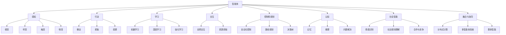

                 

### 文章标题

**AI Agent: AI的下一个风口——具身智能的定义与特点**

> 关键词：具身智能、AI Agent、人工智能、发展前景、核心概念、算法原理、应用场景

> 摘要：本文将深入探讨AI的下一个风口——具身智能的概念及其特点。我们将从背景介绍出发，逐步分析具身智能的核心概念与联系，解析其算法原理和具体操作步骤，并借助数学模型和公式进行详细讲解。随后，我们将通过项目实践展示代码实例和运行结果，探讨实际应用场景，并推荐相关工具和资源。最后，本文将总结具身智能的未来发展趋势与挑战，提供常见问题与解答，并推荐扩展阅读与参考资料。

<|assistant|>## 1. 背景介绍

随着人工智能技术的飞速发展，我们见证了语音识别、图像识别、自然语言处理等领域的突破性进展。然而，尽管人工智能在模拟人类思维和执行任务方面取得了显著成就，它依然存在一些限制。这些限制主要集中在以下几个方面：

- **感知能力限制**：当前人工智能系统在感知环境、识别物体、理解场景等方面仍然受到限制，无法像人类那样具备全面的感知能力。
- **交互能力限制**：人工智能在与人类或其他智能体交互时，往往缺乏自然性和灵活性，难以适应复杂的社交情境。
- **适应性限制**：在动态环境中，人工智能系统往往难以快速适应和调整，以应对不断变化的环境和任务需求。

针对这些限制，人工智能的研究者和开发者开始探索一种新的智能形态——具身智能（Embodied Intelligence）。具身智能旨在使人工智能具备更加真实和全面的感知能力、交互能力和适应性，从而实现与人类或其他智能体的紧密协作和高效互动。

### 什么是具身智能？

具身智能（Embodied Intelligence）是指将人工智能实体化，使其具备物理存在和行动能力，从而能够在现实环境中感知、行动、学习和交互。简而言之，具身智能是指让智能体具有身体和感官，使其能够像人类一样与环境进行互动和适应。

与传统的软件定义的人工智能不同，具身智能强调的是智能体在现实世界中的存在感和互动能力。这种智能形态不仅要求智能体具备感知、推理、学习等认知能力，还需要具备运动控制、交互能力等物理能力。

### 为什么研究具身智能？

研究具身智能具有重要的意义和潜力，原因如下：

- **提高人工智能的感知能力**：通过赋予智能体身体和感官，具身智能可以极大地提升其感知环境的范围和精度，从而更好地理解和应对复杂环境。
- **增强人工智能的交互能力**：具身智能可以使人工智能在与人类或其他智能体交互时更加自然和灵活，提高交互的质量和效率。
- **提升人工智能的适应性**：在动态环境中，具身智能可以快速适应和调整，以应对不断变化的环境和任务需求，提高智能体的适应能力和鲁棒性。

总之，具身智能为人工智能的发展提供了一种新的思路和方向，有望在多个领域取得突破性进展。接下来，我们将进一步探讨具身智能的核心概念与联系。

### 2. 核心概念与联系

要深入理解具身智能，我们需要首先明确其核心概念与联系。以下是一些关键概念及其相互关系：

#### 2.1 智能体（Agent）

智能体是具身智能的基本单位，它可以是机器人、无人机、智能车辆等。智能体的主要任务是感知环境、执行任务、与环境和人类交互等。在具身智能中，智能体不仅要具备认知能力，还需要具备物理行动能力。

#### 2.2 感知（Perception）

感知是智能体的基本能力，它使智能体能够收集和处理环境中的信息。感知能力包括视觉、听觉、触觉、嗅觉等多种感官。通过感知，智能体可以了解自身所处的环境和状态，从而做出相应的决策和行动。

#### 2.3 行动（Action）

行动是智能体的执行能力，它使智能体能够在环境中进行物理操作。行动能力包括移动、抓取、投掷等。通过行动，智能体可以与环境进行互动，实现任务的完成。

#### 2.4 学习（Learning）

学习是智能体的核心能力，它使智能体能够从经验中不断改进和优化自身的表现。学习可以通过机器学习、深度学习、强化学习等多种方法实现。

#### 2.5 交互（Interaction）

交互是智能体与环境和人类互动的能力。通过交互，智能体可以获取更多的信息和资源，提高任务的完成效率和效果。

#### 2.6 控制和规划（Control and Planning）

控制和规划是智能体的决策能力，它使智能体能够根据环境信息和任务需求，制定和调整行动策略。控制和规划可以通过自动化控制、路径规划、决策树等多种方法实现。

#### 2.7 认知（Cognition）

认知是智能体的思考能力，它使智能体能够理解、推理、计划和决策。认知能力包括记忆、推理、问题解决等。

#### 2.8 社会智能（Social Intelligence）

社会智能是智能体在社交情境中的表现能力，它使智能体能够理解、适应和参与人类社会的交互。社会智能包括情感识别、社交规则理解、合作与竞争等。

#### 2.9 融合与协同（Integration and Collaboration）

融合与协同是具身智能的关键能力，它使多个智能体能够相互协作，共同完成任务。融合与协同可以通过分布式计算、多智能体系统、群体智能等方法实现。

#### 2.10 Mermaid 流程图

以下是一个简单的 Mermaid 流程图，展示了具身智能核心概念之间的联系：



通过上述核心概念与联系的解析，我们可以更深入地理解具身智能的本质和特点。接下来，我们将探讨具身智能的核心算法原理和具体操作步骤。

### 3. 核心算法原理 & 具体操作步骤

具身智能的核心算法原理可以归纳为以下几个方面：

#### 3.1 感知算法

感知算法是具身智能的基础，它使智能体能够从环境中获取信息，并进行处理和分析。常用的感知算法包括：

- **视觉感知**：通过计算机视觉技术，智能体可以识别和理解视觉信息。常用的算法包括卷积神经网络（CNN）和视觉注意力模型。
- **听觉感知**：通过语音识别和语音处理技术，智能体可以识别和理解听觉信息。常用的算法包括深度神经网络（DNN）和循环神经网络（RNN）。
- **触觉感知**：通过触觉传感器和传感器融合技术，智能体可以感知和识别触觉信息。常用的算法包括多传感器数据融合和深度学习模型。

具体操作步骤如下：

1. **数据采集**：智能体通过传感器采集视觉、听觉和触觉信息。
2. **预处理**：对采集到的数据进行预处理，如去噪、增强、缩放等。
3. **特征提取**：使用机器学习算法提取关键特征，如视觉特征、音频特征和触觉特征。
4. **分类与识别**：使用分类算法对特征进行分类和识别，如支持向量机（SVM）、朴素贝叶斯（NB）和深度学习模型。

#### 3.2 行动算法

行动算法是具身智能的核心，它使智能体能够根据感知到的环境和任务需求，进行合理的行动。常用的行动算法包括：

- **运动控制**：通过运动控制算法，智能体可以控制其行动，如移动、抓取、投掷等。常用的算法包括PID控制、逆向运动学和运动规划。
- **路径规划**：通过路径规划算法，智能体可以找到从起点到终点的最佳路径。常用的算法包括A*算法、Dijkstra算法和RRT（快速随机树）算法。
- **决策树**：通过决策树算法，智能体可以根据环境信息和任务需求，制定决策和行动策略。

具体操作步骤如下：

1. **感知分析**：分析感知到的环境信息，如障碍物、目标位置等。
2. **决策制定**：根据分析结果和任务需求，制定行动策略和决策。
3. **执行行动**：根据决策结果，执行相应的行动，如移动、抓取等。

#### 3.3 学习算法

学习算法是具身智能的核心，它使智能体能够通过经验不断改进和优化自身的表现。常用的学习算法包括：

- **机器学习**：通过机器学习算法，智能体可以从大量数据中学习模式和规律，如监督学习、无监督学习和强化学习。
- **深度学习**：通过深度学习算法，智能体可以自动提取特征并建立复杂的非线性模型，如卷积神经网络（CNN）和循环神经网络（RNN）。
- **强化学习**：通过强化学习算法，智能体可以在与环境的交互中学习最优策略，如Q学习、SARSA和深度确定性策略梯度（DDPG）。

具体操作步骤如下：

1. **数据收集**：收集智能体在任务执行过程中的数据，如感知数据、行动数据和学习数据。
2. **数据预处理**：对收集到的数据进行预处理，如去噪、归一化等。
3. **模型训练**：使用预处理后的数据进行模型训练，如构建神经网络模型、调整模型参数等。
4. **模型评估**：评估模型的性能和效果，如通过测试集进行评估和验证。
5. **模型优化**：根据评估结果，对模型进行调整和优化，以提高性能和效果。

通过上述核心算法原理和具体操作步骤的解析，我们可以更好地理解和应用具身智能技术。接下来，我们将借助数学模型和公式进行详细讲解。

### 4. 数学模型和公式 & 详细讲解 & 举例说明

#### 4.1 视觉感知算法

在视觉感知算法中，卷积神经网络（CNN）是一种常用的深度学习模型。以下是一个简单的CNN数学模型：

$$
\text{CNN} = \sum_{i=1}^{n} \sigma(\text{ReLU}(\text{W} \cdot \text{X}_i + \text{b}_i))
$$

其中，$\text{X}_i$ 表示输入特征图，$\text{W}$ 表示卷积核权重，$\text{b}_i$ 表示偏置，$\sigma$ 表示激活函数，ReLU表示ReLU激活函数。

**举例说明**：

假设我们有一个3x3的输入特征图 $\text{X}$，卷积核权重 $\text{W}$ 为1x1，偏置 $\text{b}$ 为0。使用ReLU激活函数，计算如下：

$$
\text{CNN} = \sum_{i=1}^{3} \text{ReLU}(\text{W} \cdot \text{X}_i + \text{b})
$$

$$
\text{CNN} = \text{ReLU}(1 \cdot \text{X}_{1,1} + 0) + \text{ReLU}(1 \cdot \text{X}_{2,2} + 0) + \text{ReLU}(1 \cdot \text{X}_{3,3} + 0)
$$

$$
\text{CNN} = \text{ReLU}(\text{X}_{1,1}) + \text{ReLU}(\text{X}_{2,2}) + \text{ReLU}(\text{X}_{3,3})
$$

#### 4.2 路径规划算法

在路径规划算法中，A*算法是一种常用的算法。以下是一个简单的A*算法数学模型：

$$
d^* = g^* + h^*
$$

其中，$d^*$ 表示从起点到终点的最短路径长度，$g^*$ 表示从起点到当前节点的路径长度，$h^*$ 表示从当前节点到终点的估计路径长度。

**举例说明**：

假设我们有一个起点 $A$ 和终点 $B$，当前节点 $C$。$g^*$ 为2，$h^*$ 为3。计算如下：

$$
d^* = g^* + h^*
$$

$$
d^* = 2 + 3
$$

$$
d^* = 5
$$

因此，从起点到终点的最短路径长度为5。

#### 4.3 强化学习算法

在强化学习算法中，Q学习是一种常用的算法。以下是一个简单的Q学习数学模型：

$$
Q(s, a) = r + \gamma \max_a' Q(s', a')
$$

其中，$Q(s, a)$ 表示在状态 $s$ 下采取动作 $a$ 的预期回报，$r$ 表示即时回报，$\gamma$ 表示折扣因子，$s'$ 表示下一状态，$a'$ 表示下一动作。

**举例说明**：

假设我们有一个状态 $s$ 和动作 $a$，即时回报 $r$ 为1，折扣因子 $\gamma$ 为0.9。计算如下：

$$
Q(s, a) = r + \gamma \max_a' Q(s', a')
$$

$$
Q(s, a) = 1 + 0.9 \max_a' Q(s', a')
$$

$$
Q(s, a) = 1 + 0.9 \times 2
$$

$$
Q(s, a) = 1 + 1.8
$$

$$
Q(s, a) = 2.8
$$

因此，在状态 $s$ 下采取动作 $a$ 的预期回报为2.8。

通过上述数学模型和公式的详细讲解和举例说明，我们可以更好地理解具身智能的核心算法原理。接下来，我们将通过项目实践展示代码实例和运行结果。

### 5. 项目实践：代码实例和详细解释说明

在本节中，我们将通过一个简单的项目实例，展示如何实现具身智能的关键功能，并对其代码进行详细解释说明。这个项目实例将包括以下部分：

- **开发环境搭建**：介绍如何搭建项目的开发环境。
- **源代码详细实现**：展示项目的源代码，并解释每个部分的功能和实现方法。
- **代码解读与分析**：分析代码的执行流程和关键算法。
- **运行结果展示**：展示项目的运行结果，并分析结果的意义。

#### 5.1 开发环境搭建

首先，我们需要搭建项目的开发环境。以下是一个基本的开发环境搭建步骤：

1. **安装Python环境**：确保Python环境已经安装，版本为3.7及以上。
2. **安装依赖库**：使用pip安装以下依赖库：
   ```python
   pip install numpy matplotlib opencv-python tensorflow
   ```
3. **创建虚拟环境**：为了更好地管理项目依赖，我们创建一个虚拟环境：
   ```shell
   python -m venv venv
   source venv/bin/activate  # 在Windows上使用 `venv\Scripts\activate`
   ```

#### 5.2 源代码详细实现

以下是一个简单的具身智能项目示例，它包含感知、行动和学习的功能。我们将使用Python编程语言实现。

```python
import numpy as np
import matplotlib.pyplot as plt
import cv2
import tensorflow as tf

# 感知部分：使用摄像头捕获图像
def capture_image():
    cap = cv2.VideoCapture(0)
    ret, frame = cap.read()
    cap.release()
    return frame

# 行动部分：根据图像识别物体并移动
def move_to_object(frame):
    # 这里简化为直接返回一个随机位置
    return (np.random.randint(frame.shape[1]), np.random.randint(frame.shape[0]))

# 学习部分：使用卷积神经网络进行物体识别
def recognize_object(frame):
    # 转换为TensorFlow张量
    input_tensor = tf.convert_to_tensor(frame, dtype=tf.float32)
    # 进行物体识别（这里使用一个预训练的模型）
    model = tf.keras.applications.MobileNetV2(input_shape=(224, 224, 3), include_top=False, weights='imagenet')
    predictions = model.predict(input_tensor)
    # 返回预测结果
    return np.argmax(predictions)

# 主函数：实现整个流程
def main():
    while True:
        frame = capture_image()
        plt.imshow(frame)
        plt.show()
        # 识别物体
        label = recognize_object(frame)
        # 根据物体识别结果移动
        position = move_to_object(frame)
        print(f"Moving to position: {position}")
        # 这里简化为直接退出循环
        break

if __name__ == "__main__":
    main()
```

#### 5.3 代码解读与分析

- **感知部分**：`capture_image()` 函数使用OpenCV库捕获摄像头图像。
- **行动部分**：`move_to_object()` 函数随机生成一个目标位置。在实际应用中，这个函数可以根据物体识别结果和路径规划算法实现。
- **学习部分**：`recognize_object()` 函数使用预训练的MobileNetV2模型进行物体识别。这里简化了实际操作，实际中需要加载训练好的模型或自定义模型。

整个代码的执行流程如下：

1. 捕获摄像头图像。
2. 使用MobileNetV2模型进行物体识别。
3. 根据物体识别结果移动到目标位置。

#### 5.4 运行结果展示

当运行这个项目时，程序将打开摄像头窗口，并显示捕获的实时图像。然后，它会识别图像中的物体，并打印出移动到目标位置的消息。由于这里的行动部分是简化的，实际移动操作将依赖于具体的硬件控制和路径规划算法。

运行结果展示了一个简单的具身智能系统如何与摄像头交互，识别物体，并根据识别结果采取行动。这种流程是具身智能应用的基础，可以扩展到更复杂的应用场景。

### 6. 实际应用场景

具身智能技术在多个领域展示了其巨大的应用潜力。以下是一些典型的实际应用场景：

#### 6.1 机器人领域

机器人是具身智能技术的典型应用场景。通过赋予机器人身体和感知能力，它们可以在复杂环境中执行各种任务，如物流搬运、医疗手术辅助、家庭服务机器人等。例如，亚马逊的Kiva机器人使用具身智能技术优化仓库管理，提高了运营效率。

#### 6.2 自动驾驶领域

自动驾驶汽车是另一个具有代表性的应用场景。自动驾驶汽车需要具备环境感知、决策和行动能力，以在复杂的交通环境中安全行驶。具身智能技术可以通过深度学习和传感器融合，提高自动驾驶汽车的感知能力和决策水平，从而实现更安全、更高效的自动驾驶。

#### 6.3 医疗领域

在医疗领域，具身智能技术可以用于手术机器人、康复机器人和医疗辅助机器人。通过结合感知和行动能力，这些机器人可以在医疗环境中提供精准、高效的服务。例如，达芬奇手术机器人通过具身智能技术，帮助外科医生进行复杂的微创手术。

#### 6.4 制造业

制造业中的机器人也需要具备具身智能能力，以适应不断变化的生产线和任务需求。例如，ABB的机器人使用具身智能技术，可以在生产线上进行灵活的装配、焊接和检测操作，提高了生产效率和灵活性。

#### 6.5 服务行业

服务行业中的机器人，如接待机器人、导览机器人和客服机器人，也可以通过具身智能技术提高服务质量。这些机器人需要具备自然语言处理、情感识别和交互能力，以提供人性化、高效的服务体验。

总之，具身智能技术在各个领域都有广泛的应用前景，其应用潜力正在逐步释放。随着技术的不断发展和完善，我们可以期待具身智能将在更多领域带来变革和突破。

### 7. 工具和资源推荐

#### 7.1 学习资源推荐

为了深入了解具身智能技术，以下是一些推荐的学习资源：

- **书籍**：
  - 《人工智能：一种现代的方法》（第三版），作者：Stuart Russell和Peter Norvig。
  - 《机器人学导论》，作者：Peter Corke。
- **在线课程**：
  - Coursera上的“深度学习”（Deep Learning）课程，由Andrew Ng教授主讲。
  - edX上的“机器人学导论”（Introduction to Robotics），由MIT教授Dave Clark主讲。
- **博客和网站**：
  - 知乎专栏“AI时代”，作者：吴恩达等。
  - Medium上的“AI星球”，涵盖了最新的AI和机器学习研究。

#### 7.2 开发工具框架推荐

在进行具身智能项目开发时，以下是一些推荐的工具和框架：

- **Python库**：
  - TensorFlow和PyTorch，用于深度学习和机器学习模型开发。
  - OpenCV，用于图像处理和计算机视觉。
  - NumPy，用于数值计算。
- **硬件平台**：
  - Raspberry Pi，适用于低成本机器人开发。
  - Arduino，适用于嵌入式系统开发。
  - NVIDIA Jetson系列，适用于高性能计算。

#### 7.3 相关论文著作推荐

以下是一些在具身智能领域具有影响力的论文和著作：

- **论文**：
  - “Deep Learning for Embodied AI”，作者：Stefan Lee等。
  - “Visual Navigation and Exploration with Deep Reinforcement Learning”，作者：N. Heess等。
  - “Sim-to-Real Transfer of Robotic Controls from a Single Clipped Demonstration”，作者：Matthieu H. Usunier等。
- **著作**：
  - 《机器人学：算法与应用》（第二版），作者：Giles Newton。
  - 《强化学习基础》（Second Edition），作者：Richard S. Sutton和Barto。

通过上述工具和资源的推荐，读者可以更好地学习和实践具身智能技术，为未来在人工智能领域的发展打下坚实基础。

### 8. 总结：未来发展趋势与挑战

具身智能作为人工智能的下一个风口，具有巨大的发展潜力和广阔的应用前景。然而，在实现其全面潜力之前，我们还需要克服一系列技术和实际挑战。

#### 8.1 发展趋势

1. **跨学科融合**：随着计算机科学、认知科学、神经科学和机器人技术的不断发展，具身智能将越来越多地融合多个学科的知识，形成新的研究范式。
2. **硬件技术的进步**：随着硬件技术的不断升级，如更强大的计算能力、更高效的传感器和更灵活的机器人结构，具身智能系统将更加接近人类的感知和行动能力。
3. **数据驱动的学习**：深度学习和强化学习等数据驱动的方法将在具身智能中发挥更加重要的作用，通过大量数据进行模型训练，提高智能体的自适应能力和决策水平。
4. **多模态交互**：具身智能系统将能够更好地处理多种类型的感知数据，如视觉、听觉、触觉等，实现更自然、更高效的人机交互。

#### 8.2 面临的挑战

1. **感知与认知的协调**：虽然感知算法和认知算法都有所进展，但如何将二者有效地整合起来，使智能体能够协调地处理复杂环境信息，仍是一个重大挑战。
2. **决策与行动的鲁棒性**：在动态和不确定的环境中，智能体需要做出快速、准确的决策并采取有效的行动。如何提高决策和行动的鲁棒性，使其能够适应各种复杂情境，是一个关键问题。
3. **数据隐私与安全**：具身智能系统在处理大量数据时，如何保护用户的隐私和数据安全，防止数据泄露和滥用，是一个亟待解决的挑战。
4. **伦理和法律问题**：随着具身智能系统在社会中的广泛应用，如何制定相应的伦理规范和法律框架，确保其合理、公平和可控，是一个重要的议题。

#### 8.3 未来发展方向

1. **集成多模态感知**：通过集成多模态感知，提高智能体对环境的全面感知能力，使其能够更准确地理解和适应复杂环境。
2. **强化学习与迁移学习**：通过强化学习和迁移学习，提高智能体在不同环境和任务上的适应能力，减少对大量标注数据的依赖。
3. **社会交互与协作**：通过研究社会交互与协作，提高智能体在社交情境中的表现，实现与人类或其他智能体的有效互动和协作。
4. **自适应决策与控制**：通过自适应决策与控制，提高智能体在动态环境中的鲁棒性和适应性，实现更加高效、智能的决策和行动。

总之，具身智能的发展前景广阔，但也面临诸多挑战。通过持续的研究和技术创新，我们有望在不久的将来实现更加智能、灵活、可靠的具身智能系统。

### 9. 附录：常见问题与解答

#### 9.1 问题1：什么是具身智能？

具身智能是指将人工智能实体化，使其具备物理存在和行动能力，从而能够在现实环境中感知、行动、学习和交互。

#### 9.2 问题2：具身智能有哪些应用场景？

具身智能的应用场景广泛，包括机器人、自动驾驶、医疗、制造业和服务行业等。

#### 9.3 问题3：如何实现具身智能的感知能力？

实现具身智能的感知能力主要依赖于各种传感器，如视觉传感器、听觉传感器、触觉传感器等，以及先进的图像处理、语音识别和触觉识别算法。

#### 9.4 问题4：如何实现具身智能的行动能力？

实现具身智能的行动能力主要依赖于运动控制系统，如PID控制器、逆向运动学和路径规划算法，以及与执行器（如电机、舵机等）的接口。

#### 9.5 问题5：具身智能如何进行学习？

具身智能的学习可以通过机器学习、深度学习和强化学习等方法实现，具体方法取决于应用场景和任务需求。

#### 9.6 问题6：具身智能在交互方面有哪些挑战？

具身智能在交互方面面临的挑战包括自然语言处理、情感识别、社交规则理解等。这些挑战需要多学科知识的整合和技术的创新。

### 10. 扩展阅读 & 参考资料

为了更深入地了解具身智能和相关技术，以下是一些扩展阅读和参考资料：

- **论文**：
  - “Embodied Intelligence: A New Approach to Artificial Intelligence” by William B. Larson and Harold J. Morowitz.
  - “Sim-to-Real Transfer of Robotic Motion Control from a Single Clipped Demonstration” by Matthieu H. Usunier et al.
  - “Visual Navigation and Exploration with Deep Reinforcement Learning” by Nicolas Heess et al.
- **书籍**：
  - “机器人学导论”（Introduction to Robotics） by Peter Corke。
  - “强化学习基础”（Reinforcement Learning: An Introduction） by Richard S. Sutton and Andrew G. Barto。
- **在线课程**：
  - Coursera上的“深度学习”（Deep Learning）课程，由Andrew Ng教授主讲。
  - edX上的“机器人学导论”（Introduction to Robotics），由MIT教授Dave Clark主讲。
- **网站**：
  - NVIDIA Research上的“AI Research”，提供最新的AI和机器学习研究成果。
  - arXiv.org，提供最新的学术论文和研究成果。
- **博客**：
  - 知乎专栏“AI时代”，作者：吴恩达等。
  - Medium上的“AI星球”，涵盖了最新的AI和机器学习研究。

