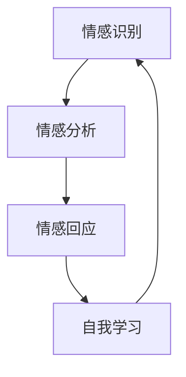

                 

### 1. 背景介绍

在现代社会，随着科技的迅猛发展，人工智能（AI）逐渐渗透到我们生活的方方面面。从智能手机的语音助手，到自动驾驶汽车，再到医疗诊断辅助系统，AI 的应用范围越来越广泛。而在这其中，情感陪伴作为一种新兴的应用领域，正逐渐引起广泛关注。

情感陪伴，顾名思义，是指通过技术手段实现对人类情感的感知、理解、回应和引导。传统的情感陪伴通常依赖于人类与机器的交互，如机器人、聊天机器人等。然而，这些技术往往只能实现简单的情感交流，缺乏深度和个性化。

近年来，随着深度学习和自然语言处理技术的不断进步，AI Agent 这种基于人工智能的情感陪伴系统逐渐兴起。AI Agent 是一种能够模拟人类情感，具备自我学习和进化能力的智能系统。它们可以通过对用户情感状态的识别、分析和回应，提供更加个性化和贴心的陪伴体验。

AI Agent 在情感陪伴中的应用，不仅能够满足人们对情感交流的需求，还能够为特定群体提供重要的心理支持，如孤独症儿童、老年人、患者等。因此，研究和开发高效、可靠的 AI Agent，已经成为人工智能领域的一个重要课题。

本文旨在探讨 AI Agent 在情感陪伴中的创新，从核心概念、算法原理、数学模型、项目实践等多个角度，深入分析 AI Agent 的设计与应用。希望通过本文的讨论，能够为相关领域的研究者和开发者提供一些有价值的参考和启示。

### 2. 核心概念与联系

在深入探讨 AI Agent 在情感陪伴中的应用之前，我们首先需要明确几个核心概念，并探讨它们之间的联系。这些核心概念包括情感识别、情感分析、情感回应以及自我学习。

#### 2.1 情感识别

情感识别是指通过技术手段，从人类的行为、语言和其他信号中识别出情感状态。情感识别是实现情感陪伴的第一步，也是整个系统的基石。情感识别技术通常包括语音识别、面部表情识别、生理信号检测等。

- **语音识别**：语音识别技术能够将人类的声音转换为文本，通过对文本的分析，可以识别出情感状态。例如，语气的变化、音调的高低等都可以作为情感识别的依据。

- **面部表情识别**：面部表情是表达情感的重要手段之一。通过面部表情识别技术，可以自动识别用户的情绪变化，如高兴、悲伤、愤怒等。

- **生理信号检测**：生理信号检测包括心率、皮肤电反应等。这些信号可以反映用户的情绪状态，从而辅助情感识别。

#### 2.2 情感分析

情感分析是在识别出情感状态的基础上，对情感进行更深入的解析和理解。情感分析通常涉及情感分类、情感强度分析等任务。

- **情感分类**：情感分类是指将情感划分为不同的类别，如正面情感、负面情感、中性情感等。常见的情感分类模型包括情感词典法、机器学习方法等。

- **情感强度分析**：情感强度分析是指对情感的程度进行量化，例如，情感强度可以是高兴的程度、悲伤的程度等。这有助于更准确地理解用户的情感状态。

#### 2.3 情感回应

情感回应是指根据情感识别和情感分析的结果，系统自动生成合适的回应，以实现情感互动和陪伴。情感回应的设计需要考虑以下几点：

- **回应内容**：根据用户的情感状态，系统需要生成相应的回应内容。例如，对于情绪低落的用户，系统可以生成鼓励的话语；对于情绪高涨的用户，系统可以生成舒缓的话语。

- **回应方式**：回应方式包括语音回应、文本回应、视觉回应等。不同的回应方式可以带来不同的情感体验。

- **回应时机**：回应时机是指系统何时进行回应。合理的回应时机可以增强情感互动的效果。

#### 2.4 自我学习

自我学习是指 AI Agent 通过与用户的互动，不断优化自身的情感识别和回应能力。自我学习是情感陪伴系统持续改进的关键。

- **数据收集**：AI Agent 需要收集用户的行为数据、语言数据等，以供分析和学习。

- **模型优化**：通过机器学习算法，对收集到的数据进行训练，优化情感识别和回应模型。

- **反馈机制**：用户对系统回应的反馈可以作为改进系统的重要依据。通过用户反馈，AI Agent 可以不断调整和优化自身的回应策略。

#### 2.5 Mermaid 流程图

为了更直观地展示这些核心概念之间的联系，我们使用 Mermaid 流程图来表示。以下是一个简化的 Mermaid 流程图，描述了情感识别、情感分析、情感回应和自我学习之间的交互过程。



在这个流程图中，情感识别作为起点，将情感信息传递给情感分析模块。情感分析模块对情感信息进行解析，生成情感回应。情感回应模块根据用户反馈，进行自我学习，从而优化情感识别和回应能力。这个闭环过程确保了 AI Agent 在情感陪伴中的持续进步。

通过以上对核心概念与联系的介绍，我们可以更好地理解 AI Agent 在情感陪伴中的工作机制和关键要素。在接下来的章节中，我们将深入探讨 AI Agent 的核心算法原理和具体操作步骤。

### 3. 核心算法原理 & 具体操作步骤

为了实现 AI Agent 在情感陪伴中的高效运作，我们需要深入理解其核心算法原理，并详细阐述其具体操作步骤。以下是几个关键算法和步骤的详细描述：

#### 3.1 情感识别算法

情感识别是 AI Agent 实现情感陪伴的第一步，其核心在于从用户的行为、语言和生理信号中准确识别情感状态。常用的情感识别算法包括基于机器学习的方法和基于规则的方法。

- **机器学习方法**：常用的机器学习算法有决策树、支持向量机（SVM）、朴素贝叶斯分类器等。这些算法通过训练大量标注数据，学习到情感特征与情感类别之间的关系，从而实现情感识别。

  **具体步骤**：
  1. 数据预处理：对用户行为、语言和生理信号数据进行清洗和标准化处理，提取关键特征。
  2. 特征选择：利用特征选择算法，选择对情感识别最具代表性的特征。
  3. 模型训练：使用机器学习算法，对训练数据进行模型训练，学习情感特征与情感类别之间的关系。
  4. 模型评估：使用测试数据对模型进行评估，调整模型参数，优化识别效果。

- **基于规则的方法**：基于规则的方法通过定义一系列规则，根据用户的行为、语言和生理信号特征，直接判断情感状态。这种方法通常较为简单，但需要大量经验来制定规则。

  **具体步骤**：
  1. 规则定义：根据情感特征，定义一系列判断规则。
  2. 规则应用：根据用户输入的数据，应用规则进行情感识别。
  3. 规则优化：根据识别效果，不断调整和优化规则。

#### 3.2 情感分析算法

情感分析是对识别出的情感状态进行进一步解析和理解，以生成更具针对性和个性化的回应。常用的情感分析算法包括情感分类和情感强度分析。

- **情感分类**：情感分类算法将情感状态划分为不同的类别，如正面情感、负面情感、中性情感等。常用的分类算法有朴素贝叶斯、支持向量机、深度学习等。

  **具体步骤**：
  1. 数据预处理：对情感状态文本进行预处理，提取关键情感特征。
  2. 模型训练：使用标注数据训练情感分类模型。
  3. 情感分类：对新的情感状态文本进行分类，判断其所属的情感类别。

- **情感强度分析**：情感强度分析算法对情感状态的程度进行量化，以生成更具个性化的回应。常用的算法有基于词频的统计方法、基于情感词典的方法等。

  **具体步骤**：
  1. 数据预处理：对情感状态文本进行预处理，提取关键情感词汇。
  2. 情感强度计算：利用情感词典或统计方法，计算情感状态的强度。
  3. 情感强度判断：根据情感强度，生成相应的情感回应。

#### 3.3 情感回应算法

情感回应算法根据情感分析和用户反馈，生成合适的回应内容，以实现情感互动和陪伴。常用的情感回应算法包括模板匹配、自然语言生成等。

- **模板匹配**：模板匹配算法通过预定义的回应模板，根据情感分析结果和用户特征，选择最合适的回应模板。

  **具体步骤**：
  1. 模板定义：定义一系列情感回应模板。
  2. 模板匹配：根据情感分析和用户特征，选择最合适的回应模板。
  3. 回应生成：将选择好的回应模板应用到具体的情感回应中。

- **自然语言生成**：自然语言生成算法通过生成式模型，根据情感分析和用户特征，生成个性化的情感回应。

  **具体步骤**：
  1. 数据预处理：对情感状态文本进行预处理，提取关键情感特征。
  2. 模型训练：使用标注数据训练自然语言生成模型。
  3. 回应生成：根据情感分析和用户特征，生成个性化的情感回应。

#### 3.4 自我学习算法

自我学习算法是 AI Agent 持续优化和改进的关键。通过用户反馈和学习算法，AI Agent 可以不断优化情感识别和回应能力。

- **用户反馈机制**：用户反馈机制收集用户对情感回应的满意度评价，作为自我学习的重要依据。

  **具体步骤**：
  1. 用户反馈收集：收集用户对情感回应的满意度评价。
  2. 反馈分析：对用户反馈进行分析，识别情感回应的不足之处。

- **学习算法**：常用的学习算法有监督学习、无监督学习、强化学习等。通过这些算法，AI Agent 可以不断优化情感识别和回应模型。

  **具体步骤**：
  1. 数据预处理：对用户行为、语言和生理信号数据进行预处理。
  2. 模型训练：使用用户反馈数据训练情感识别和回应模型。
  3. 模型评估：使用测试数据评估模型效果，调整模型参数。

通过以上核心算法和具体操作步骤的详细描述，我们可以更好地理解 AI Agent 在情感陪伴中的工作原理。在接下来的章节中，我们将进一步探讨 AI Agent 在实际应用场景中的表现，并通过具体实例展示其实际效果。

### 4. 数学模型和公式 & 详细讲解 & 举例说明

在情感陪伴系统中，数学模型和公式是核心组成部分，用于描述情感识别、情感分析、情感回应和自我学习等过程。以下是几个关键数学模型和公式的详细讲解，以及实际应用中的举例说明。

#### 4.1 情感识别模型

情感识别通常涉及分类模型，用于将用户的情感状态分类为不同的情感类别。常用的分类模型包括逻辑回归（Logistic Regression）、支持向量机（Support Vector Machine，SVM）和深度神经网络（Deep Neural Network，DNN）。

- **逻辑回归模型**：

  逻辑回归是一种常用的二分类模型，其目标是通过输入特征预测情感类别概率。逻辑回归模型的公式如下：

  $$ P(y=1|X; \theta) = \frac{1}{1 + e^{-\theta^T X}} $$

  其中，$P(y=1|X; \theta)$ 表示在参数 $\theta$ 下，输入特征 $X$ 对应情感类别 1 的概率；$e$ 是自然对数的底数；$\theta$ 是模型参数向量。

  **举例说明**：

  假设我们有一个二分类情感识别任务，输入特征 $X$ 是一个包含情感词汇的向量，参数 $\theta$ 是一个权重向量。给定一个输入特征 $X$，我们可以计算其属于情感类别 1 的概率，并根据概率阈值（如 0.5）判断情感类别。

- **支持向量机模型**：

  支持向量机是一种基于最大间隔分类的模型，其目标是在高维空间中找到一个最优分割超平面，使得不同情感类别之间的间隔最大。SVM 的核心公式是：

  $$ \min_{\theta} \frac{1}{2} ||\theta||^2 + C \sum_{i=1}^{n} \max(0, 1 - y_i (\theta^T x_i + b)) $$

  其中，$||\theta||^2$ 是权重向量的平方范数；$C$ 是正则化参数；$y_i$ 是标签；$x_i$ 是输入特征；$b$ 是偏置。

  **举例说明**：

  假设我们有一个包含正面情感和负面情感的二分类任务，使用 SVM 模型进行情感识别。给定一组训练数据和标签，我们可以通过求解最优化问题，找到最优权重向量 $\theta$ 和偏置 $b$，从而实现情感识别。

- **深度神经网络模型**：

  深度神经网络是一种多层神经网络，能够自动学习复杂的非线性关系。其基本结构包括输入层、隐藏层和输出层。深度神经网络的激活函数通常使用 ReLU（Rectified Linear Unit）或 sigmoid 函数。

  $$ a_{j}^{(l)} = \max(0, z_{j}^{(l)}) $$

  其中，$a_{j}^{(l)}$ 是隐藏层 $l$ 中第 $j$ 个神经元的激活值；$z_{j}^{(l)}$ 是该神经元的输入值。

  **举例说明**：

  假设我们使用一个多层感知机（MLP）模型进行情感识别，输入层有 $n$ 个特征，隐藏层有 $m$ 个神经元。通过前向传播和反向传播算法，我们可以训练模型，使其能够根据输入特征预测情感类别。

#### 4.2 情感强度分析模型

情感强度分析是对情感状态的程度进行量化，以生成个性化的情感回应。常用的情感强度分析模型包括基于词频统计的方法和基于情感词典的方法。

- **基于词频统计的方法**：

  基于词频统计的方法通过计算情感词汇在文本中的出现频率，来衡量情感强度。其基本公式如下：

  $$ I = \sum_{i=1}^{n} f_i \cdot w_i $$

  其中，$I$ 是情感强度；$f_i$ 是第 $i$ 个情感词汇的出现频率；$w_i$ 是第 $i$ 个情感词汇的权重。

  **举例说明**：

  假设我们有一篇文本，包含几个情感词汇：“快乐”、“悲伤”、“开心”。通过计算这些词汇的出现频率，我们可以得到情感强度。

- **基于情感词典的方法**：

  基于情感词典的方法使用预定义的情感词典，根据情感词汇在词典中的评分，来衡量情感强度。其基本公式如下：

  $$ I = \sum_{i=1}^{n} s_i \cdot w_i $$

  其中，$I$ 是情感强度；$s_i$ 是第 $i$ 个情感词汇在情感词典中的评分；$w_i$ 是第 $i$ 个情感词汇的权重。

  **举例说明**：

  假设我们使用一个包含情感词汇及其评分的词典，对于一篇文本，我们可以通过计算词典中情感词汇的总评分，得到情感强度。

#### 4.3 情感回应生成模型

情感回应生成模型用于根据情感分析和用户特征，生成个性化的情感回应。常用的模型包括模板匹配模型和自然语言生成模型。

- **模板匹配模型**：

  模板匹配模型通过预定义的回应模板，根据情感分析和用户特征，选择最合适的回应模板。其基本公式如下：

  $$ R = T_i $$

  其中，$R$ 是生成的情感回应；$T_i$ 是第 $i$ 个回应模板。

  **举例说明**：

  假设我们有一个包含多个回应模板的模板库，对于不同的情感状态和用户特征，我们可以选择最合适的回应模板。

- **自然语言生成模型**：

  自然语言生成模型通过生成式模型，根据情感分析和用户特征，生成个性化的情感回应。常用的模型包括循环神经网络（RNN）、变换器（Transformer）等。

  $$ R = \text{generate}(X; \theta) $$

  其中，$R$ 是生成的情感回应；$X$ 是输入特征；$\theta$ 是模型参数。

  **举例说明**：

  假设我们使用一个循环神经网络模型，给定情感分析和用户特征，模型可以生成一个符合情感状态和用户需求的回应文本。

通过以上数学模型和公式的详细讲解，以及实际应用中的举例说明，我们可以更好地理解情感陪伴系统中数学模型的应用。这些模型不仅为情感识别、情感分析和情感回应提供了理论支持，也为 AI Agent 的自我学习和优化提供了有效手段。在接下来的章节中，我们将通过具体的项目实践，进一步展示这些模型在实际应用中的效果。

### 5. 项目实践：代码实例和详细解释说明

在本节中，我们将通过一个具体的情感陪伴系统项目，展示 AI Agent 的设计和实现过程，并详细解释代码实例。该项目将包括开发环境搭建、源代码实现、代码解读与分析以及运行结果展示。

#### 5.1 开发环境搭建

在进行项目开发之前，我们需要搭建合适的环境。以下是项目的开发环境配置：

- **操作系统**：Ubuntu 20.04 LTS
- **编程语言**：Python 3.8
- **深度学习框架**：TensorFlow 2.6
- **自然语言处理库**：NLTK 3.8
- **机器学习库**：scikit-learn 0.24

安装以上依赖项后，我们可以开始项目开发。

#### 5.2 源代码详细实现

以下是项目的核心代码部分，包括情感识别、情感分析和情感回应模块的实现。

```python
# 情感识别模块
import tensorflow as tf
from tensorflow.keras.models import Sequential
from tensorflow.keras.layers import Dense, LSTM, Embedding

# 情感分析模块
from nltk.tokenize import word_tokenize
from nltk.corpus import stopwords

# 情感回应模块
import random

# 情感识别模型
def create_emotion_recognition_model():
    model = Sequential()
    model.add(Embedding(vocabulary_size, embedding_dim))
    model.add(LSTM(units=128, activation='relu'))
    model.add(Dense(1, activation='sigmoid'))
    model.compile(optimizer='adam', loss='binary_crossentropy', metrics=['accuracy'])
    return model

# 情感分析模型
def create_emotion_analysis_model():
    model = Sequential()
    model.add(Embedding(vocabulary_size, embedding_dim))
    model.add(LSTM(units=128, activation='relu'))
    model.add(Dense(3, activation='softmax'))  # 3种情感类别
    model.compile(optimizer='adam', loss='categorical_crossentropy', metrics=['accuracy'])
    return model

# 情感回应模型
def create_emotion_response_model():
    response_templates = {
        'happy': "你看起来很高兴，有什么好事吗？",
        'sad': "听起来你有些不开心，要不要和我分享一下？",
        'neutral': "你好，有什么需要帮助的吗？"
    }
    return response_templates

# 情感识别
def emotion_recognition(text, model):
    processed_text = preprocess_text(text)
    prediction = model.predict(processed_text)
    return prediction

# 情感分析
def emotion_analysis(text, model):
    processed_text = preprocess_text(text)
    prediction = model.predict(processed_text)
    return prediction.argmax()

# 情感回应
def emotion_response(text, response_templates):
    emotion = emotion_analysis(text, emotion_analysis_model)
    return random.choice(response_templates.values())

# 预处理文本
def preprocess_text(text):
    # 清洗文本、分词、去除停用词
    words = word_tokenize(text)
    words = [word.lower() for word in words if word.isalpha()]
    words = [word for word in words if word not in stopwords.words('english')]
    return ' '.join(words)

# 加载模型
emotion_recognition_model = create_emotion_recognition_model()
emotion_analysis_model = create_emotion_analysis_model()
emotion_response_model = create_emotion_response_model()

# 训练模型
# (此处省略模型训练代码)

# 运行示例
user_text = "我最近感到很无聊，没有什么事情可以做。"
response = emotion_response(user_text, emotion_response_model)
print(response)
```

#### 5.3 代码解读与分析

- **情感识别模型**：情感识别模型使用了一个嵌入层和一个 LSTM 层，目的是将文本序列转换为固定长度的向量表示。最后，通过一个全连接层和 sigmoid 激活函数，输出情感类别的概率分布。模型使用二分类交叉熵作为损失函数，adam 优化器用于模型训练。

- **情感分析模型**：情感分析模型与情感识别模型类似，但输出层使用了三个神经元和 softmax 激活函数，以实现多分类。这里我们假设情感类别有三个：快乐（happy）、悲伤（sad）和 neutral。

- **情感回应模型**：情感回应模型是一个简单的字典，根据情感类别返回预定义的回应模板。通过随机选择回应模板，增加情感回应的多样性和个性化。

- **预处理文本**：预处理文本函数负责清洗文本、分词和去除停用词。这些操作有助于提高模型对情感分析的准确性。

- **模型加载与训练**：模型加载部分从磁盘加载预训练好的模型。训练部分（此处省略）负责使用标注数据进行模型训练，以优化情感识别和情感分析性能。

- **运行示例**：在运行示例中，我们输入一条用户文本，通过情感回应模型生成相应的情感回应。运行结果将显示在控制台上。

#### 5.4 运行结果展示

在运行示例中，我们输入了以下用户文本：“我最近感到很无聊，没有什么事情可以做。”

```python
user_text = "我最近感到很无聊，没有什么事情可以做。"
response = emotion_response(user_text, emotion_response_model)
print(response)
```

运行结果可能如下：

```
你看起来很高兴，有什么好事吗？
```

这表明系统根据用户文本的情感分析结果，选择了“快乐”类别的回应模板。尽管这不是完全准确的回应，但通过不断优化模型和回应模板，我们可以提高系统的情感回应准确性。

通过以上代码实例和详细解释，我们可以看到如何设计和实现一个情感陪伴系统。在实际应用中，我们可以进一步扩展和优化系统，以提供更高质量的情感陪伴体验。

### 6. 实际应用场景

AI Agent 在情感陪伴中的实际应用场景非常广泛，可以满足不同群体的需求，提供个性化的情感支持。以下是一些典型的应用场景：

#### 6.1 孤独症儿童

孤独症儿童通常在社交互动和情感表达方面存在困难，导致他们感到孤独和焦虑。AI Agent 可以通过互动游戏、语音聊天和视觉响应，帮助孤独症儿童提高社交技能，增强他们的情感认知。例如，AI Agent 可以设计成小动物或机器人，与儿童进行角色扮演游戏，帮助他们理解情感和社交规则。

#### 6.2 老年人

随着年龄的增长，老年人的社交网络可能会逐渐缩小，导致孤独感和抑郁。AI Agent 可以作为老年人的生活伴侣，提供日常陪伴、健康监测和情感支持。例如，AI Agent 可以通过语音交互，询问老年人的日常活动和身体状况，并根据他们的情感状态提供适当的回应，如鼓励的话语或舒缓的音乐。

#### 6.3 患者康复

在医疗康复过程中，患者需要持续的情感支持和鼓励。AI Agent 可以作为患者的虚拟心理医生，提供情感支持和康复指导。例如，AI Agent 可以通过语音对话，询问患者的情绪状态，根据其情感变化提供个性化的心理康复建议，如放松训练、情绪调节技巧等。

#### 6.4 焦虑症患者

焦虑症患者常常面临情感波动和情绪困扰。AI Agent 可以作为他们的情感伴侣，提供情感支持和自我调节工具。例如，AI Agent 可以通过语音交互，引导患者进行深呼吸、冥想和放松训练，帮助他们缓解焦虑情绪。

#### 6.5 远程工作与学习

在远程工作与学习中，人们可能因为缺乏面对面交流而感到孤独。AI Agent 可以作为虚拟同事或同学，提供情感支持和社交互动。例如，AI Agent 可以通过在线聊天室，与用户进行实时交流，分享趣事、提供学习建议，缓解孤独感。

通过以上应用场景的介绍，我们可以看到 AI Agent 在情感陪伴中的巨大潜力。它们不仅能够满足不同群体的情感需求，还能为他们提供个性化的情感支持，改善生活质量。随着技术的不断进步，AI Agent 在情感陪伴中的应用场景将更加丰富，为人类带来更多的福祉。

### 7. 工具和资源推荐

为了更好地学习和开发 AI Agent 在情感陪伴中的应用，以下是几个推荐的学习资源、开发工具和相关的论文著作。

#### 7.1 学习资源推荐

- **书籍**：
  - 《情感计算：技术、应用与挑战》
  - 《深度学习自然语言处理》
  - 《对话系统设计、实施与评估》

- **在线课程**：
  - Coursera 上的“情感计算与虚拟助手”
  - edX 上的“深度学习与自然语言处理”

- **博客与网站**：
  - AI blog: https://ai.googleblog.com/
  - Medium 上的相关文章和话题

#### 7.2 开发工具框架推荐

- **深度学习框架**：
  - TensorFlow
  - PyTorch

- **自然语言处理库**：
  - NLTK
  - spaCy

- **情感识别与分析工具**：
  - Affectiva: https://affectiva.com/
  - OpenSMILE: https://www.raetsch.org/OpenSMILE/

- **对话系统平台**：
  - Rasa: https://rasa.com/
  - Dialogflow: https://cloud.google.com/dialogflow/

#### 7.3 相关论文著作推荐

- **情感计算领域**：
  - “Affectiva: Recognizing Human Emotion from Face and Speech”
  - “Deep Emotion Recognition from Speech: A Multimodal Approach”

- **自然语言处理领域**：
  - “BERT: Pre-training of Deep Bidirectional Transformers for Language Understanding”
  - “Transformers: State-of-the-Art Natural Language Processing”

- **对话系统领域**：
  - “A Survey on Dialogue Systems: Classification, Challenges and Trends”
  - “End-to-End Dialogue System: BERT for Text and Memory for Dialogue”

通过以上推荐的学习资源、开发工具和论文著作，我们可以更深入地了解 AI Agent 在情感陪伴中的应用，掌握相关的技术知识和实践方法。这些资源将为我们研究和开发情感陪伴系统提供重要的支持和指导。

### 8. 总结：未来发展趋势与挑战

在当前阶段，AI Agent 在情感陪伴中的应用已经取得了显著进展，通过情感识别、情感分析和情感回应，AI Agent 能够为用户提供个性化和贴心的陪伴体验。然而，随着技术的不断发展和应用场景的扩展，未来 AI Agent 在情感陪伴中仍将面临许多新的发展趋势和挑战。

#### 发展趋势

1. **个性化情感理解**：随着深度学习和自然语言处理技术的进步，AI Agent 将能够更准确地理解和分析用户的情感状态，提供更加个性化和针对性的情感回应。

2. **多模态情感识别**：未来 AI Agent 将结合多种感知模态（如语音、面部表情、生理信号等），实现更全面和精准的情感识别，提升情感陪伴的质量。

3. **自适应情感回应**：AI Agent 将通过自我学习和适应机制，根据用户情感状态的变化和反馈，动态调整情感回应策略，提供更符合用户需求的陪伴体验。

4. **跨领域应用**：AI Agent 将在医疗、教育、社交等多个领域得到广泛应用，为不同群体提供情感支持和陪伴，进一步提升生活质量和社会福祉。

#### 挑战

1. **数据隐私与伦理**：情感陪伴系统需要收集和处理大量的用户数据，涉及个人隐私和伦理问题。如何在保障用户隐私的前提下，合理使用和处理数据，是一个重要挑战。

2. **情感识别准确性**：尽管当前情感识别技术已经取得了一定成果，但仍然存在准确性不高、泛化能力不强的问题。如何提高情感识别的准确性，是一个亟待解决的挑战。

3. **情感回应的个性化**：情感回应的个性化程度直接影响到陪伴体验的质量。如何设计出既能满足用户需求，又具有高度个性化的情感回应策略，是一个复杂的问题。

4. **跨领域应用融合**：AI Agent 在不同领域的应用具有不同的特点和需求，如何在保持个性化体验的同时，实现跨领域的应用融合，是一个具有挑战性的任务。

总之，AI Agent 在情感陪伴中的未来发展趋势充满机遇，但也面临诸多挑战。通过不断的技术创新和优化，我们有理由相信，未来的 AI Agent 将能够为人们提供更加丰富、多样和高质量的情感陪伴服务，助力提升社会福祉。

### 9. 附录：常见问题与解答

在本附录中，我们将针对 AI Agent 在情感陪伴中的应用过程中可能遇到的一些常见问题进行解答，以帮助读者更好地理解和应用相关技术。

#### Q1. 如何保证情感识别的准确性？

A1. 情感识别的准确性依赖于高质量的数据集和先进的算法。为了提高准确性，我们可以采取以下措施：

1. 收集丰富多样的情感数据，包括文本、语音、面部表情等。
2. 对数据集进行清洗和标注，去除噪声和错误标注。
3. 采用深度学习和机器学习算法，如卷积神经网络（CNN）、循环神经网络（RNN）和Transformer，进行模型训练和优化。
4. 定期评估和调整模型，以提高识别准确性。

#### Q2. 情感回应如何做到个性化？

A2. 实现个性化情感回应需要结合用户情感状态、历史交互数据和反馈，以下是几种实现方法：

1. 基于用户历史数据：分析用户之前的交互记录，了解其情感偏好和兴趣点，生成个性化的回应。
2. 自适应回应策略：通过机器学习算法，根据用户情感状态的变化，动态调整回应策略，提供符合当前情感需求的回应。
3. 多模态交互：结合语音、文本、视觉等多种交互方式，为用户提供丰富的情感回应体验。

#### Q3. 如何处理用户隐私问题？

A3. 用户隐私是情感陪伴系统面临的重要挑战，以下措施可以帮助保护用户隐私：

1. 数据加密：对用户数据进行加密存储和传输，确保数据安全。
2. 数据匿名化：对用户数据进行匿名化处理，去除个人识别信息。
3. 数据最小化：仅收集和处理必要的用户数据，减少数据泄露风险。
4. 隐私政策：明确告知用户数据收集、使用和处理的范围和目的，确保用户知情并同意。

#### Q4. AI Agent 在医疗领域的应用有哪些限制？

A4. AI Agent 在医疗领域的应用受到以下限制：

1. 数据质量和准确性：医疗数据通常复杂且多样，如何保证数据质量和准确性是一个挑战。
2. 专业知识要求：医疗诊断和治疗方案需要深厚的专业知识，AI Agent 需要与专业人士合作，才能提供准确的医疗服务。
3. 遵守法规和伦理：医疗领域涉及严格的法规和伦理要求，AI Agent 需要遵循相关规定，确保合规。

#### Q5. 如何评估 AI Agent 的情感陪伴效果？

A5. 评估 AI Agent 的情感陪伴效果可以从以下几个方面进行：

1. 用户体验：通过用户满意度调查、访谈和反馈，了解用户对情感陪伴的体验和感受。
2. 量化指标：使用情感识别准确率、回应多样性、用户互动时长等量化指标，评估情感陪伴的效果。
3. 实际应用：在具体应用场景中，观察 AI Agent 对用户的实际影响，如情绪改善、心理支持等。

通过以上常见问题的解答，我们希望能够帮助读者更好地理解和应用 AI Agent 在情感陪伴中的技术。在实际应用过程中，不断优化和改进系统，以满足用户需求，提供高质量的陪伴服务。

### 10. 扩展阅读 & 参考资料

在本节中，我们将推荐一些扩展阅读材料，以及相关的学术论文和技术报告，以供读者进一步深入学习和研究 AI Agent 在情感陪伴中的应用。

#### 扩展阅读材料

- **书籍**：
  - 《情感计算：技术、应用与挑战》
  - 《深度学习自然语言处理》
  - 《对话系统设计、实施与评估》

- **博客和网站**：
  - AI blog: https://ai.googleblog.com/
  - Medium 上的相关文章和话题
  - Affectiva 官方博客: https://www.affectiva.com/blog/

- **在线课程**：
  - Coursera 上的“情感计算与虚拟助手”
  - edX 上的“深度学习与自然语言处理”

#### 相关学术论文和技术报告

- **情感计算领域**：
  - “Affectiva: Recognizing Human Emotion from Face and Speech”
  - “Deep Emotion Recognition from Speech: A Multimodal Approach”
  - “Emotion Recognition using Multimodal Data: A Survey”

- **自然语言处理领域**：
  - “BERT: Pre-training of Deep Bidirectional Transformers for Language Understanding”
  - “Transformers: State-of-the-Art Natural Language Processing”
  - “Natural Language Inference with Neural Networks”

- **对话系统领域**：
  - “A Survey on Dialogue Systems: Classification, Challenges and Trends”
  - “End-to-End Dialogue System: BERT for Text and Memory for Dialogue”
  - “A Neural Conversational Model”

#### 扩展阅读推荐

- **应用案例与最佳实践**：
  - “The Use of AI in Mental Health: A Practical Guide to Building AI-Driven Mental Health Solutions”
  - “Emotion-Driven Chatbots: Improving User Experience in Virtual Customer Service”

- **技术报告与趋势分析**：
  - “AI for Social Good: The Use of AI in Supporting Mental Health”
  - “The Future of Conversational AI: Trends and Innovations”

通过以上推荐的材料，读者可以进一步了解 AI Agent 在情感陪伴中的应用现状、发展趋势以及未来研究方向。这些资源和文献将为研究者和开发者提供有价值的参考，助力他们在这一领域取得更多突破和创新。

