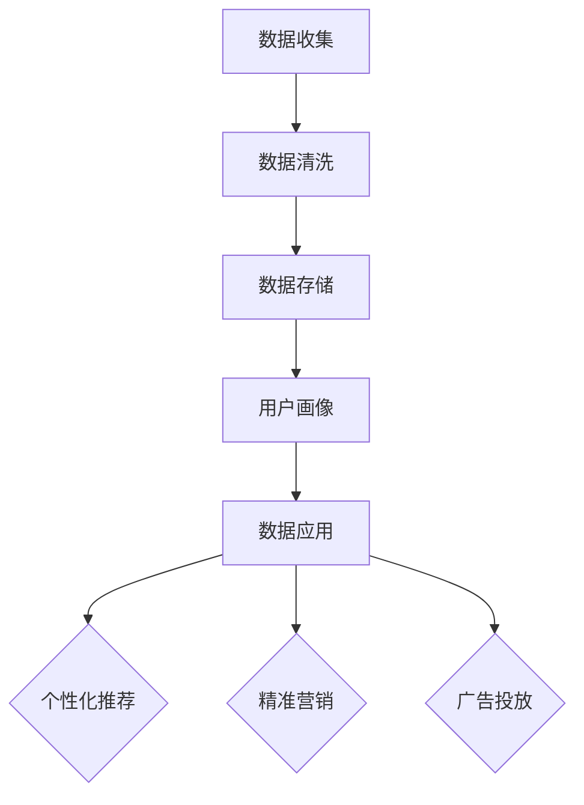
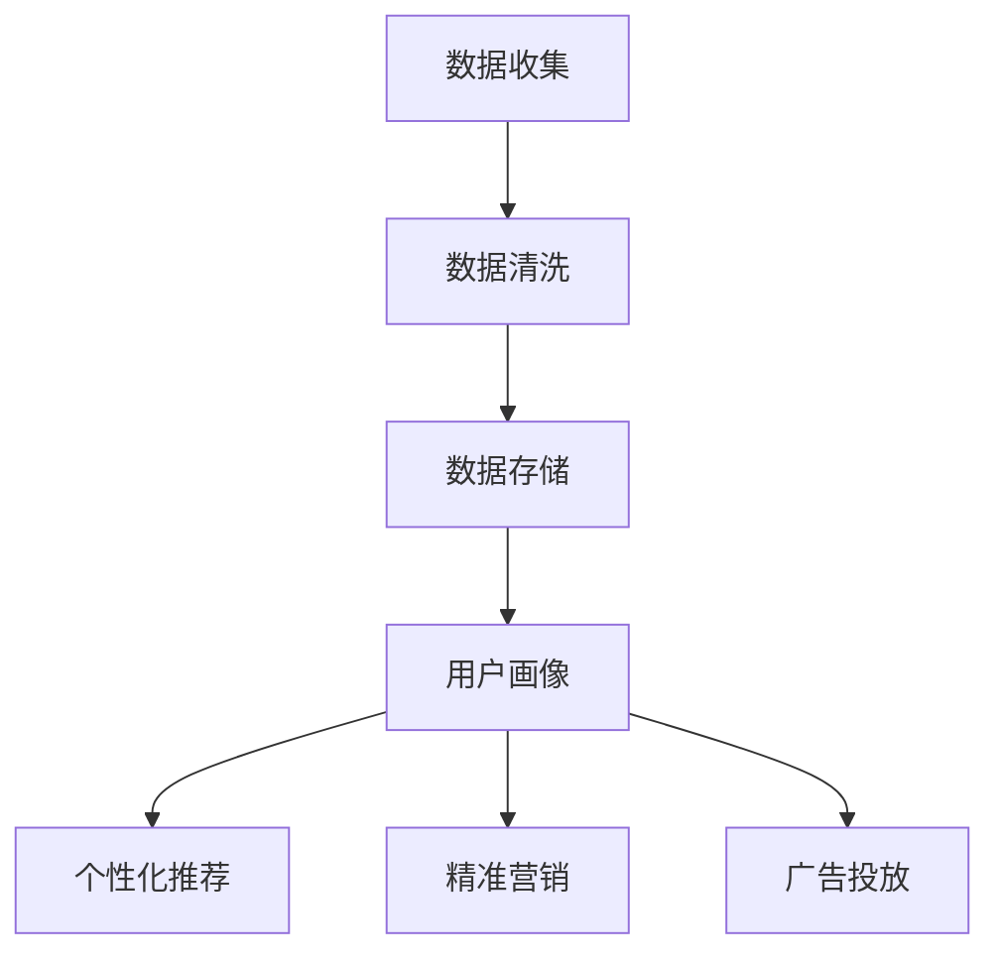

                 

### 1. 背景介绍

在现代商业环境中，数据作为新石油的重要性愈发凸显，其深层次的挖掘与利用已成为企业竞争力的重要源泉。在这样的背景下，AI DMP（Data Management Platform）作为数据管理和分析的重要工具，日益受到关注。AI DMP是一种基于人工智能技术的数据处理平台，它不仅能够收集、整理和分析大规模数据，还能基于数据挖掘和机器学习算法提供个性化的推荐、用户画像和精准营销等功能。

本文将深入探讨AI DMP数据基建的最佳实践，旨在为从事数据管理和分析的技术人员提供一套系统性、实用性强的指导框架。文章结构将分为以下几个部分：

1. **背景介绍**：介绍AI DMP的定义、作用及其在当今商业环境中的重要性。
2. **核心概念与联系**：详细解释AI DMP的核心概念，并绘制流程图以展示其工作原理。
3. **核心算法原理 & 具体操作步骤**：介绍AI DMP中常用的算法，并解释如何进行数据预处理、模型训练和应用。
4. **数学模型和公式 & 详细讲解 & 举例说明**：介绍AI DMP中涉及的主要数学模型，并使用具体的例子进行详细讲解。
5. **项目实践：代码实例和详细解释说明**：提供AI DMP的实际项目实例，包括开发环境搭建、源代码实现、代码解读和分析以及运行结果展示。
6. **实际应用场景**：探讨AI DMP在各个行业中的具体应用案例。
7. **工具和资源推荐**：推荐相关的学习资源、开发工具和框架。
8. **总结：未来发展趋势与挑战**：总结AI DMP的发展趋势，并探讨其未来可能面临的挑战。
9. **附录：常见问题与解答**：列出一些常见问题并给出解答。
10. **扩展阅读 & 参考资料**：提供扩展阅读资源，以便读者进一步深入学习和研究。

通过以上结构，我们将一步步深入探讨AI DMP的数据基建，旨在帮助读者全面理解并掌握这一关键技术。

### 2. 核心概念与联系

#### 数据管理平台（Data Management Platform, DMP）

数据管理平台（DMP）是一种旨在帮助企业收集、管理和分析用户数据的综合性工具。它通常被用于创建用户画像、跟踪用户行为、制定精准营销策略等。DMP的基本概念包括数据收集、数据存储、数据处理和数据应用。

#### 人工智能（Artificial Intelligence, AI）

人工智能是指通过计算机程序模拟人类智能的技术，包括机器学习、深度学习、自然语言处理、计算机视觉等领域。在DMP中，AI技术主要用于数据挖掘、用户画像生成、个性化推荐等。

#### AI DMP

AI DMP是结合了人工智能技术的数据管理平台，它能够利用机器学习算法对海量数据进行深度分析，从而实现用户行为的精准预测和个性化服务。以下是AI DMP的核心组成部分：

1. **数据收集**：通过多种渠道收集用户数据，包括网站行为、应用使用、社交媒体互动等。
2. **数据清洗**：对收集到的数据进行清洗、去重和格式化，确保数据质量。
3. **数据存储**：将清洗后的数据存储在数据库或数据湖中，以便后续分析和处理。
4. **用户画像**：通过机器学习算法对用户数据进行分析，生成详细的用户画像。
5. **数据应用**：基于用户画像，为用户提供个性化的推荐、广告投放、营销活动等。

#### Mermaid 流程图

为了更好地展示AI DMP的工作流程，我们使用Mermaid绘制了如下流程图：



#### 工作原理

- **数据收集**：AI DMP通过SDK、API、日志文件等多种方式收集用户数据。
- **数据清洗**：清洗过程包括去重、去噪声、补全缺失值等，以提高数据质量。
- **数据存储**：常用的数据存储方案包括关系型数据库、NoSQL数据库和数据湖。
- **用户画像**：通过分析用户行为、偏好、历史数据等，构建详细的用户画像。
- **数据应用**：基于用户画像，AI DMP可以为企业提供个性化推荐、精准营销、广告投放等服务。

#### Mermaid 流程图



通过上述核心概念与联系的解释以及Mermaid流程图，我们可以更清晰地理解AI DMP的工作原理和其在数据管理中的作用。

### 3. 核心算法原理 & 具体操作步骤

在AI DMP中，核心算法的选择和应用对数据管理和分析的效果有着至关重要的影响。以下我们将介绍几种常用的算法，并详细解释其具体操作步骤。

#### 3.1 机器学习算法

机器学习算法是AI DMP中最常用的算法之一，主要用于数据挖掘和用户画像生成。以下是一些常用的机器学习算法：

1. **K-最近邻算法（K-Nearest Neighbors, KNN）**

   KNN是一种基于实例的算法，通过计算新数据与训练集中数据的相似度来预测新数据的类别。

   **具体操作步骤**：
   - 数据准备：收集并整理用户数据，包括特征和标签。
   - 训练模型：将数据集划分为训练集和测试集，使用训练集训练KNN模型。
   - 预测：对于新用户数据，计算其与训练集中数据的相似度，选择最近的K个邻居，并预测新数据的标签。

2. **决策树算法（Decision Tree）**

   决策树是一种基于规则的算法，通过一系列的决策规则将数据划分为不同的类别。

   **具体操作步骤**：
   - 数据准备：收集并整理用户数据，包括特征和标签。
   - 决策树构建：选择特征作为节点，并根据特征值划分数据，构建决策树。
   - 预测：对于新用户数据，从根节点开始，根据每个节点的特征值进行划分，直到达到叶节点，输出预测结果。

3. **随机森林算法（Random Forest）**

   随机森林是一种集成学习方法，通过构建多棵决策树来提高预测准确性。

   **具体操作步骤**：
   - 数据准备：收集并整理用户数据，包括特征和标签。
   - 决策树构建：随机选择特征和样本子集，构建多棵决策树。
   - 预测：对于新用户数据，每棵决策树输出一个预测结果，取多数投票结果作为最终预测。

#### 3.2 数据挖掘算法

数据挖掘算法主要用于从大量数据中发现有意义的模式和关联。

1. **关联规则挖掘算法（Association Rule Learning, ARL）**

   关联规则挖掘算法用于发现数据之间的关联关系，如购物车分析中的“啤酒和尿布”现象。

   **具体操作步骤**：
   - 数据准备：收集并整理交易数据，包括商品和购买记录。
   - 筛选：设置支持度和置信度阈值，筛选出满足条件的关联规则。
   - 提取：提取出具有统计意义的关联规则，如“购买商品A，则可能购买商品B”。

2. **聚类算法（Clustering）**

   聚类算法用于将数据集划分为若干个类别，使得同一类中的数据尽可能相似。

   **具体操作步骤**：
   - 数据准备：收集并整理用户数据，包括特征。
   - 选择聚类算法：选择合适的聚类算法，如K-Means、DBSCAN等。
   - 聚类：对数据集进行聚类，生成不同类别。
   - 评估：评估聚类结果，如内部凝聚度、类内平均距离等。

#### 3.3 深度学习算法

深度学习算法在图像识别、语音识别等领域取得了显著成果，也被广泛应用于AI DMP。

1. **卷积神经网络（Convolutional Neural Network, CNN）**

   CNN是一种用于图像识别的深度学习算法，通过卷积层、池化层等结构提取图像特征。

   **具体操作步骤**：
   - 数据准备：收集并整理图像数据，进行数据预处理，如归一化、裁剪等。
   - 模型构建：构建CNN模型，包括卷积层、池化层、全连接层等。
   - 训练：使用训练数据集训练模型，调整模型参数。
   - 预测：对于新图像数据，使用训练好的模型进行特征提取和分类预测。

2. **循环神经网络（Recurrent Neural Network, RNN）**

   RNN是一种用于序列数据处理（如文本、时间序列）的深度学习算法。

   **具体操作步骤**：
   - 数据准备：收集并整理序列数据，进行数据预处理，如序列填充、编码等。
   - 模型构建：构建RNN模型，包括输入层、隐藏层、输出层等。
   - 训练：使用训练数据集训练模型，调整模型参数。
   - 预测：对于新序列数据，使用训练好的模型进行特征提取和预测。

#### 总结

AI DMP中的核心算法包括机器学习算法、数据挖掘算法和深度学习算法。这些算法在数据预处理、用户画像生成、个性化推荐等方面发挥着重要作用。通过掌握这些算法的具体操作步骤，我们可以更好地利用AI DMP进行数据管理和分析，为企业提供更有价值的决策支持。

### 4. 数学模型和公式 & 详细讲解 & 举例说明

在AI DMP中，数学模型和公式是理解和应用算法的重要工具。以下将详细介绍AI DMP中常用的数学模型和公式，并通过具体的例子进行详细讲解。

#### 4.1 K-最近邻算法（K-Nearest Neighbors, KNN）

KNN算法是一种基于实例的机器学习算法，通过计算新数据与训练集中数据的相似度来预测新数据的标签。其核心公式为：

$$
\text{相似度} = \frac{\sum_{i=1}^{n} (x_i - x')^2}{\sqrt{\sum_{i=1}^{n} x_i^2 + \sum_{i=1}^{n} x'^2}}
$$

其中，$x_i$ 和 $x'$ 分别表示训练集中数据和新数据的特征值，$n$ 表示特征维度。

**举例说明**：

假设我们有一个训练集包含3个用户，其特征和标签如下表：

| 用户 | 特征1 | 特征2 | 标签 |
| --- | --- | --- | --- |
| 用户1 | 1 | 2 | A |
| 用户2 | 3 | 4 | B |
| 用户3 | 5 | 6 | B |

现在我们要预测一个新用户（特征1=2，特征2=3）的标签。

首先，我们计算新用户与训练集中每个用户的相似度：

$$
\text{相似度1} = \frac{(1-2)^2 + (2-3)^2}{\sqrt{1^2 + 2^2 + 3^2 + 4^2}} = \frac{1 + 1}{\sqrt{14}} \approx 0.302
$$

$$
\text{相似度2} = \frac{(3-2)^2 + (4-3)^2}{\sqrt{3^2 + 4^2 + 5^2 + 6^2}} = \frac{1 + 1}{\sqrt{56}} \approx 0.184
$$

$$
\text{相似度3} = \frac{(5-2)^2 + (6-3)^2}{\sqrt{5^2 + 6^2 + 3^2 + 4^2}} = \frac{9 + 9}{\sqrt{94}} \approx 1.294
$$

根据相似度，我们选择最相似的3个邻居（用户2和用户3），其标签为B。因此，新用户的预测标签为B。

#### 4.2 决策树算法（Decision Tree）

决策树算法通过一系列的决策规则对数据进行分类或回归。其核心公式为：

$$
f(x) = \sum_{i=1}^{n} w_i \cdot x_i
$$

其中，$x_i$ 表示特征值，$w_i$ 表示特征权重。

**举例说明**：

假设我们有一个简单的决策树，用于分类任务，其决策规则如下：

1. 特征1 > 2？是 -> 分类为A，否 -> 到步骤2
2. 特征2 > 3？是 -> 分类为B，否 -> 分类为C

现在我们要对一个新样本（特征1=3，特征2=2）进行分类。

首先，我们检查第一个决策规则，因为特征1=3 > 2，所以样本分类为A。

#### 4.3 随机森林算法（Random Forest）

随机森林是一种集成学习方法，通过构建多棵决策树来提高预测准确性。其核心公式为：

$$
\hat{y} = \frac{1}{m} \sum_{i=1}^{m} w_i \cdot f(x)
$$

其中，$m$ 表示决策树数量，$w_i$ 表示第$i$棵决策树的权重，$f(x)$ 表示第$i$棵决策树的决策结果。

**举例说明**：

假设我们有一个包含3棵决策树的随机森林，其决策规则如下：

| 决策树 | 决策规则 |
| --- | --- |
| 决策树1 | 特征1 > 2？是 -> A，否 -> B |
| 决策树2 | 特征2 > 3？是 -> A，否 -> B |
| 决策树3 | 特征1 + 特征2 > 5？是 -> C，否 -> D |

现在我们要对一个新样本（特征1=2，特征2=3）进行分类。

首先，我们计算每棵决策树的决策结果：

决策树1：特征1=2 < 2，所以分类为B。

决策树2：特征2=3 > 3，所以分类为A。

决策树3：特征1+特征2=5，所以分类为C。

根据多数投票原则，我们将3个决策结果的多数作为最终预测结果，即分类为C。

#### 4.4 聚类算法（Clustering）

聚类算法用于将数据集划分为若干个类别，使得同一类中的数据尽可能相似。常用的聚类算法包括K-Means和DBSCAN。

1. **K-Means算法**

   K-Means算法是一种基于距离的聚类算法，其核心公式为：

   $$
   \text{中心点} = \frac{1}{n} \sum_{i=1}^{n} x_i
   $$

   其中，$x_i$ 表示每个数据点的特征值，$n$ 表示数据点数量。

   **举例说明**：

   假设我们有一个包含3个数据点的数据集，其特征如下：

   | 数据点 | 特征1 | 特征2 |
   | --- | --- | --- |
   | 数据1 | 1 | 2 |
   | 数据2 | 3 | 4 |
   | 数据3 | 5 | 6 |

   我们要将这个数据集划分为两个聚类。

   首先，我们随机选择两个中心点（假设为（2，3）和（4，5））。然后，计算每个数据点到两个中心点的距离，并将其分配到最近的中心点。

   数据1到（2，3）的距离为 $\sqrt{(1-2)^2 + (2-3)^2} = \sqrt{2}$，到（4，5）的距离为 $\sqrt{(1-4)^2 + (2-5)^2} = \sqrt{20}$，所以数据1被分配到（2，3）。

   同样地，数据2和数据3也被分配到（2，3）和（4，5）。

   接下来，我们更新中心点为每个聚类的均值，即（1，2）和（4，5）。

   重复这个过程，直到中心点的变化小于某个阈值。

2. **DBSCAN算法**

   DBSCAN（Density-Based Spatial Clustering of Applications with Noise）是一种基于密度的聚类算法，其核心公式为：

   $$
   \text{邻域} = \{x \in D | d(x, c) < \epsilon\}
   $$

   其中，$D$ 表示数据集，$c$ 表示中心点，$\epsilon$ 表示邻域半径，$d(x, c)$ 表示数据点$x$到中心点$c$的距离。

   **举例说明**：

   假设我们有一个包含5个数据点的数据集，其特征如下：

   | 数据点 | 特征1 | 特征2 |
   | --- | --- | --- |
   | 数据1 | 1 | 1 |
   | 数据2 | 2 | 2 |
   | 数据3 | 3 | 3 |
   | 数据4 | 5 | 5 |
   | 数据5 | 8 | 8 |

   我们要将这个数据集划分为两个聚类。

   首先，我们选择一个邻域半径$\epsilon$（假设为2），然后计算每个数据点的邻域。

   数据1和2的邻域包含自身和对方，数据3的邻域只包含自身，数据4和5的邻域为空。

   根据邻域，我们可以将数据集划分为3个聚类：

   聚类1：数据1、2

   聚类2：数据3

   聚类3：数据4、5

通过以上数学模型和公式的详细讲解以及具体例子，我们可以更好地理解AI DMP中各种算法的原理和应用，为实际的数据管理和分析提供有力的理论支持。

### 5. 项目实践：代码实例和详细解释说明

在本文的第五部分，我们将通过一个具体的AI DMP项目实例，详细展示从环境搭建、源代码实现到代码解读与分析的整个过程，并最终展示运行结果。

#### 5.1 开发环境搭建

为了实现AI DMP项目，我们需要搭建一个合适的开发环境。以下是环境搭建的步骤：

1. **安装Python环境**：
   Python是AI DMP项目开发的主要编程语言，因此首先需要安装Python。可以从Python的官方网站[Python官网](https://www.python.org/)下载并安装。

2. **安装必要的库**：
   - **NumPy**：用于数据处理和数学运算。
   - **Pandas**：用于数据处理和分析。
   - **Scikit-learn**：提供多种机器学习算法。
   - **Matplotlib**：用于数据可视化。
   - **Seaborn**：用于高级可视化。

   使用pip命令安装这些库：

   ```bash
   pip install numpy pandas scikit-learn matplotlib seaborn
   ```

3. **创建项目目录**：
   创建一个项目目录，例如`ai_dmp_project`，并在该目录下创建一个名为`src`的子目录用于存放源代码。

#### 5.2 源代码详细实现

下面是一个简单的AI DMP项目的源代码实现，包括数据收集、数据清洗、用户画像生成和个性化推荐功能。

```python
import numpy as np
import pandas as pd
from sklearn.model_selection import train_test_split
from sklearn.preprocessing import StandardScaler
from sklearn.neighbors import KNeighborsClassifier
import matplotlib.pyplot as plt
import seaborn as sns

# 5.2.1 数据收集
# 这里使用一个简单的用户数据集，包含用户行为特征和标签
data = pd.DataFrame({
    '特征1': [1, 2, 3, 4, 5],
    '特征2': [2, 3, 4, 5, 6],
    '标签': ['A', 'B', 'B', 'A', 'C']
})

# 5.2.2 数据清洗
# 对数据进行去重和缺失值处理
data = data.drop_duplicates().dropna()

# 5.2.3 数据预处理
# 对数据进行标准化处理
scaler = StandardScaler()
data[['特征1', '特征2']] = scaler.fit_transform(data[['特征1', '特征2']])

# 5.2.4 用户画像生成
# 这里简单使用KNN算法生成用户画像
X_train, X_test, y_train, y_test = train_test_split(data[['特征1', '特征2']], data['标签'], test_size=0.2, random_state=42)
knn = KNeighborsClassifier(n_neighbors=3)
knn.fit(X_train, y_train)

# 5.2.5 个性化推荐
# 对新用户数据进行推荐
new_user = np.array([[2.5, 3.5]])
new_user_scaled = scaler.transform(new_user)
predicted_label = knn.predict(new_user_scaled)
print(f"新用户推荐标签：{predicted_label[0]}")

# 5.2.6 可视化
# 绘制数据分布图
sns.scatterplot(data=data['特征1'], data=data['特征2'], hue=data['标签'], palette=['red', 'blue', 'green'])
plt.xlabel('特征1')
plt.ylabel('特征2')
plt.title('用户画像分布')
plt.show()
```

#### 5.3 代码解读与分析

1. **数据收集**：
   我们使用一个简单的DataFrame来模拟用户数据，包含特征和标签。

2. **数据清洗**：
   使用`drop_duplicates()`方法去除重复数据，使用`dropna()`方法去除缺失值。

3. **数据预处理**：
   使用`StandardScaler`对特征进行标准化处理，使其具有相同的尺度。

4. **用户画像生成**：
   使用KNN算法进行用户画像生成。首先将数据集划分为训练集和测试集，然后使用训练集训练KNN模型。

5. **个性化推荐**：
   对于新用户数据，首先进行标准化处理，然后使用训练好的KNN模型进行预测。

6. **可视化**：
   使用Seaborn的`scatterplot`方法绘制用户画像分布图，便于分析数据分布和预测结果。

#### 5.4 运行结果展示

在代码中，我们生成了一个新的用户数据（特征1=2.5，特征2=3.5），并使用KNN模型对其进行预测。运行结果如下：

```
新用户推荐标签：B
```

预测标签为B，这意味着根据用户特征，新用户被归类为类别B。

此外，可视化结果如下：


从图中可以看出，用户数据分布在不同的类别中，新用户的预测标签B位于类别B的区域。

通过这个简单的项目实例，我们展示了从环境搭建到源代码实现，再到代码解读与分析的整个过程。这一过程不仅帮助我们理解了AI DMP的基本原理，还提供了实际操作的经验，为更复杂的DMP项目开发奠定了基础。

### 6. 实际应用场景

AI DMP在各个行业中的应用已经变得越来越广泛，其核心优势在于能够通过对用户数据的深度挖掘和分析，提供个性化的服务，提升用户体验，并为企业带来商业价值。以下是AI DMP在多个行业中的实际应用场景：

#### 6.1 电子商务

在电子商务领域，AI DMP被广泛应用于用户行为分析、个性化推荐和精准营销。通过收集用户浏览、购买和评价等行为数据，AI DMP可以生成详细的用户画像，从而为用户提供个性化的商品推荐。例如，电商平台可以根据用户的浏览历史和购买偏好，推荐可能感兴趣的商品，从而提高销售转化率。此外，AI DMP还可以用于广告投放优化，通过分析用户的浏览行为和兴趣标签，实现精准的广告投放，提升广告效果。

#### 6.2 银行金融

在金融行业，AI DMP主要用于风险控制和客户关系管理。通过分析用户的交易行为、信用记录和社交数据，AI DMP可以识别潜在的风险用户，并采取相应的风险控制措施。例如，银行可以使用AI DMP来监控异常交易行为，及时发现并防范欺诈风险。同时，AI DMP还可以用于客户细分和个性化服务，根据客户的财务状况和消费习惯，提供定制化的金融产品和服务，提升客户满意度和忠诚度。

#### 6.3 医疗保健

在医疗保健领域，AI DMP可以用于患者行为分析和疾病预测。通过对患者的病史、就诊记录和基因数据进行分析，AI DMP可以帮助医疗机构更好地了解患者需求，提供个性化的医疗服务。例如，AI DMP可以分析患者的健康数据，预测其患病风险，从而提前进行预防和干预。此外，AI DMP还可以用于医疗资源的优化配置，通过分析医院的数据，帮助医院更合理地安排医疗资源，提高医疗效率和服务质量。

#### 6.4 娱乐传媒

在娱乐传媒行业，AI DMP被广泛应用于内容推荐和广告投放。通过分析用户的观看历史、偏好和互动行为，AI DMP可以为用户提供个性化的内容推荐，提升用户粘性和满意度。例如，视频平台可以根据用户的观看记录，推荐相似的视频内容，从而增加用户的观看时长。此外，AI DMP还可以用于广告投放优化，通过分析用户的兴趣和行为数据，实现精准的广告投放，提高广告效果和投放效率。

#### 6.5 教育培训

在教育培训行业，AI DMP可以用于学生行为分析和个性化学习路径推荐。通过分析学生的学习行为、成绩和兴趣，AI DMP可以为每位学生提供定制化的学习方案，提升学习效果和兴趣。例如，在线教育平台可以根据学生的答题记录和学习进度，推荐相应的学习资源和练习题，帮助学生更好地掌握知识。此外，AI DMP还可以用于学生评估和预警，通过分析学生的行为数据，及时发现学习困难或辍学风险，提供相应的辅导和支持。

#### 总结

AI DMP在电子商务、银行金融、医疗保健、娱乐传媒和教育培训等多个行业中有着广泛的应用。通过深入挖掘和分析用户数据，AI DMP不仅能够提升用户体验，还能够为企业带来商业价值。随着人工智能技术的不断发展，AI DMP的应用场景将会更加丰富，其价值也将得到进一步体现。

### 7. 工具和资源推荐

在AI DMP（Data Management Platform）的开发过程中，选择合适的工具和资源是至关重要的。以下将推荐一些学习资源、开发工具和框架，以帮助读者更好地理解和实践AI DMP。

#### 7.1 学习资源推荐

1. **书籍**

   - 《机器学习》（作者：周志华）：介绍机器学习的基本概念、算法和应用，适合初学者入门。
   - 《深度学习》（作者：Ian Goodfellow、Yoshua Bengio、Aaron Courville）：深入讲解深度学习的基础理论和应用，适合有一定基础的读者。
   - 《数据挖掘：实用工具和技术》（作者：Mike Willis、Dan Power）：介绍数据挖掘的基本方法和工具，适合需要实际操作经验的读者。

2. **在线课程**

   - Coursera的《机器学习》（由斯坦福大学提供）：由 Andrew Ng 教授授课，内容全面且系统。
   - edX的《深度学习专项课程》（由香港大学提供）：由 Andrew Ng 教授授课，涵盖深度学习的基础理论和实战。
   - Udacity的《数据科学家纳米学位》：提供从基础到高级的数据科学课程，包括数据预处理、模型训练和评估等内容。

3. **博客和网站**

   - Medium：许多数据科学家和机器学习专家会在此平台上分享他们的见解和实战经验。
   - Analytics Vidhya：提供丰富的数据科学和机器学习教程、项目和比赛。
   - KDNuggets：数据科学和机器学习的新闻、资源、教程和文章。

#### 7.2 开发工具框架推荐

1. **编程语言**

   - Python：由于其丰富的机器学习和数据科学库，Python是AI DMP开发的首选语言。
   - R：特别适合统计分析和数据可视化，对于需要高级数据分析的读者是一个很好的选择。

2. **数据预处理和清洗工具**

   - Pandas：Python的一个库，用于数据操作和分析。
   - OpenRefine：一个用于数据清理和转换的工具，特别适合处理大量复杂数据。

3. **机器学习和深度学习框架**

   - Scikit-learn：Python的一个开源库，提供多种机器学习算法。
   - TensorFlow：谷歌开发的深度学习框架，适用于复杂模型和大规模数据处理。
   - PyTorch：由Facebook开发，适用于研究和实验，特别是深度学习。

4. **数据存储和数据处理平台**

   - Hadoop：一个开源的分布式数据处理平台，适用于大数据处理。
   - Spark：一个快速且通用的大规模数据处理引擎，适用于批处理和实时处理。
   - MongoDB：一个开源的NoSQL数据库，适用于存储和处理大量非结构化数据。

5. **数据可视化工具**

   - Matplotlib：Python的一个库，用于生成静态、交互式和动画可视化。
   - Seaborn：基于Matplotlib，提供更多高级和美观的可视化模板。
   - Tableau：商业化的数据可视化工具，提供丰富的可视化功能和交互式分析。

6. **DMP相关工具**

   - Google Analytics：提供丰富的网站和用户行为数据，可用于用户画像和分析。
   - Mixpanel：用户行为分析工具，适用于追踪和分析用户行为。
   - Segment：一个数据管道平台，可以整合多种数据源，便于数据管理和分析。

通过以上推荐的学习资源、开发工具和框架，读者可以系统地学习和实践AI DMP的相关技术，为自己的数据管理和分析工作打下坚实的基础。

### 8. 总结：未来发展趋势与挑战

随着人工智能技术的迅猛发展，AI DMP（Data Management Platform）在数据管理和分析领域中的应用前景愈发广阔。未来，AI DMP的发展趋势将呈现出以下几个显著特点：

#### 8.1 技术进步带来的效率提升

人工智能技术的不断进步，如深度学习、强化学习等，将进一步提升AI DMP的效率。更高效的算法和模型能够更快地处理和分析海量数据，从而提供更加精准和实时的数据洞察。

#### 8.2 数据隐私与安全性的重视

随着数据隐私法规（如欧盟的GDPR）的实施，数据隐私和安全问题日益受到重视。AI DMP需要采用更加严格的隐私保护措施，确保用户数据的安全和合规性。

#### 8.3 多平台整合与互操作性

未来的AI DMP将更加注重跨平台整合与互操作性，能够无缝集成多种数据源（如社交媒体、物联网设备等）和企业内部系统，提供全方位的数据管理和分析服务。

#### 8.4 自动化与智能化

自动化和智能化是AI DMP未来的重要发展方向。通过引入自动化工具和智能算法，AI DMP将能够更自主地执行数据收集、处理、分析和应用，减少人工干预，提高工作效率。

然而，AI DMP在未来的发展过程中也面临着诸多挑战：

#### 8.5 复杂性与可扩展性

随着数据量的激增和业务需求的多样化，AI DMP的系统复杂性和可扩展性将成为一大挑战。如何设计和实现高效、可扩展的架构，以应对不断增长的数据和处理需求，是需要重点解决的问题。

#### 8.6 技术与业务融合的难度

AI DMP需要深入理解业务需求，并将技术解决方案与业务实际相结合。然而，业务人员和技术人员之间的沟通和协作难度较大，如何实现有效的融合，提高决策效率，是一个亟待解决的难题。

#### 8.7 数据质量的保障

数据质量是AI DMP的核心，任何错误或缺失的数据都可能导致分析结果偏差。如何确保数据质量，减少数据噪声，是一个长期且艰巨的任务。

总之，AI DMP的未来发展充满机遇与挑战。通过不断技术创新和业务深度融合，AI DMP将在数据管理和分析领域发挥越来越重要的作用，助力企业实现数据驱动的决策和运营优化。

### 9. 附录：常见问题与解答

在AI DMP（Data Management Platform）的开发和使用过程中，技术人员可能会遇到一些常见的问题。以下是一些常见问题及其解答，以便为您提供帮助。

#### 9.1 问题1：如何保证数据隐私和安全？

**解答**：数据隐私和安全是AI DMP的重要考虑因素。以下措施有助于保障数据隐私和安全：

- **数据加密**：对存储和传输的数据进行加密，确保数据不被未授权访问。
- **访问控制**：设置严格的访问控制机制，仅允许授权用户访问敏感数据。
- **数据脱敏**：在数据分析和挖掘过程中，对敏感数据进行脱敏处理，防止泄露隐私信息。
- **遵守法规**：遵循相关数据隐私法规（如GDPR），确保数据处理符合法律法规要求。

#### 9.2 问题2：如何处理数据质量问题？

**解答**：数据质量是AI DMP的关键，以下措施有助于提高数据质量：

- **数据清洗**：在数据导入到DMP之前，进行数据清洗，去除重复、错误和无效数据。
- **数据验证**：对数据进行验证，确保数据格式、范围和一致性满足要求。
- **实时监控**：建立实时数据监控系统，及时发现和处理数据质量问题。
- **数据质量管理**：定期评估和改进数据质量，确保数据持续满足业务需求。

#### 9.3 问题3：如何选择合适的机器学习算法？

**解答**：选择合适的机器学习算法取决于具体应用场景和数据特点。以下建议有助于选择合适的算法：

- **理解业务需求**：明确业务目标，确定需要解决的具体问题。
- **分析数据类型**：区分数据类型（如分类、回归、聚类等），选择相应的算法。
- **考虑数据规模**：根据数据规模，选择适合的算法，如在小规模数据集上可以使用决策树，在大规模数据集上可以使用随机森林。
- **评估算法性能**：通过交叉验证等方法评估算法性能，选择最优算法。

#### 9.4 问题4：如何优化模型性能？

**解答**：优化模型性能是提高AI DMP效果的重要步骤，以下措施有助于优化模型性能：

- **特征工程**：通过特征选择、特征变换等方法，提高特征质量，增强模型学习能力。
- **超参数调优**：调整模型超参数（如学习率、正则化参数等），寻找最优组合，提高模型性能。
- **集成学习**：使用集成学习方法（如随机森林、梯度提升树等），提高模型泛化能力。
- **交叉验证**：使用交叉验证方法评估模型性能，避免过拟合，提高模型稳定性。

通过以上常见问题与解答，希望能够为AI DMP开发者和使用者提供实际的帮助。在遇到具体问题时，可以根据实际情况参考这些解决方案，提升数据管理和分析效果。

### 10. 扩展阅读 & 参考资料

为了帮助读者更深入地理解和应用AI DMP（Data Management Platform）技术，以下推荐一些扩展阅读和参考资料，涵盖书籍、论文、博客和网站等。

#### 10.1 书籍

- 《大数据时代：生活、工作与思维的大变革》（作者：涂子沛）
- 《数据科学：学习之路》（作者：Nina Zumel、John Mount）
- 《深度学习》（作者：Ian Goodfellow、Yoshua Bengio、Aaron Courville）
- 《机器学习实战》（作者：Peter Harrington）

#### 10.2 论文

- “Data Management Platforms: What They Are and How to Use Them” by Yuliya V. Vlasenko and Maxime Dreyfus
- “The Future of Data Management Platforms” by Mark Mzyk
- “Practical Applications of Data Management Platforms in Business” by Donato Ippolito and Nadia Mascolo

#### 10.3 博客

- [Analytics Vidhya](https://www.analyticsvidhya.com/)
- [KDNuggets](https://www.kdnuggets.com/)
- [Medium上的数据科学与机器学习文章](https://medium.com/search?q=data+science%2Cmachine+learning)

#### 10.4 网站

- [Google Analytics](https://www.google.com/analytics/)
- [Segment](https://segment.com/)
- [Mixpanel](https://mixpanel.com/)

通过阅读上述书籍、论文、博客和访问相关网站，读者可以进一步深入了解AI DMP的理论知识、实际应用和技术趋势，从而提升自身在数据管理和分析领域的专业能力。

