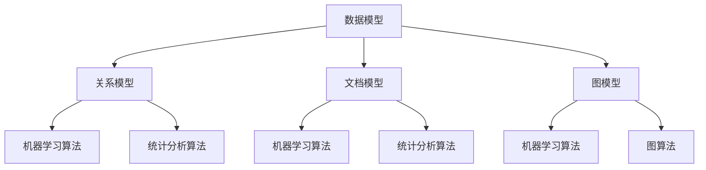

                 

### 1. 背景介绍

人工智能（AI）作为当今科技领域的热门话题，已经在众多行业中展现出了巨大的潜力和价值。在这其中，AI 数据管理平台（DMP）成为了数据处理与分析的核心工具。DMP 是一种面向数据管理的技术，它通过整合、处理和存储海量数据，为数据分析、营销、用户画像构建等应用场景提供数据支持。

在 DMP 中，数据模型与算法起到了至关重要的作用。数据模型定义了数据的结构、组织和处理方式，而算法则是实现数据处理和计算的核心。二者相辅相成，共同构建了 DMP 的核心框架，为数据分析提供了坚实的基础。

随着大数据技术的迅猛发展，数据处理的需求日益增长。传统的数据处理方法已经无法满足现代数据分析的复杂需求，因此，研究和应用高效的数据模型与算法变得尤为重要。本文将围绕 AI DMP 数据基建中的数据模型与算法展开讨论，旨在深入解析其原理、应用和实践，为相关领域的研究者和从业者提供有价值的参考。

### 2. 核心概念与联系

#### 数据模型

数据模型是数据管理与分析的基础，它定义了数据的基本结构、属性和关系。在 DMP 中，常用的数据模型包括关系模型、文档模型、图模型等。

- **关系模型**：基于关系数据库的模型，适用于结构化数据的管理。关系模型通过表格形式存储数据，并使用 SQL 等查询语言进行数据处理。
- **文档模型**：适用于非结构化或半结构化数据的管理，如 JSON、XML 等。文档模型以文档为单位进行存储和操作，便于处理复杂的数据格式。
- **图模型**：适用于复杂关系的表示和处理，如社交网络、知识图谱等。图模型通过节点和边的关系来表示实体和关系，适用于处理高度复杂的网络结构。

#### 算法

算法是数据处理的灵魂，它决定了数据处理的速度和准确性。在 DMP 中，常用的算法包括机器学习算法、统计分析算法、图算法等。

- **机器学习算法**：通过训练模型，从数据中学习规律，实现对未知数据的预测和分类。常见的机器学习算法包括线性回归、决策树、随机森林、支持向量机等。
- **统计分析算法**：基于统计学原理，对数据进行统计分析，揭示数据中的规律和趋势。常见的统计分析算法包括均值、方差、协方差、回归分析等。
- **图算法**：专门用于图数据处理的算法，如最短路径算法、社区发现算法、图嵌入算法等。图算法能够高效地处理复杂的图结构数据，揭示数据中的隐藏关系。

#### Mermaid 流程图

为了更好地理解 DMP 的数据模型与算法，我们使用 Mermaid 流程图来展示数据模型与算法之间的联系。



在这个流程图中，数据模型作为基础，通过关系模型、文档模型和图模型进行数据存储和表示。然后，根据数据模型的特点，选择合适的算法进行数据处理和分析。

### 3. 核心算法原理 & 具体操作步骤

在本章节中，我们将探讨 DMP 中常用的核心算法原理，包括机器学习算法、统计分析算法和图算法。通过对这些算法的深入理解，我们可以更好地应对各种数据分析和处理需求。

#### 3.1 机器学习算法

机器学习算法是 DMP 中最为常用的算法之一，它通过训练模型，从数据中学习规律，实现对未知数据的预测和分类。以下是一些常见的机器学习算法及其具体操作步骤：

- **线性回归**：线性回归是一种简单的机器学习算法，它通过拟合一条直线来预测连续值。具体操作步骤如下：
  1. 收集训练数据，并划分特征和标签。
  2. 使用最小二乘法求解线性回归模型参数。
  3. 使用训练数据训练模型，并评估模型性能。
  4. 使用训练好的模型对未知数据进行预测。
- **决策树**：决策树是一种基于特征划分的机器学习算法，它通过构建树形结构来预测分类结果。具体操作步骤如下：
  1. 收集训练数据，并划分特征和标签。
  2. 选择一个特征进行划分，计算信息增益或基尼不纯度。
  3. 划分特征，并生成子节点。
  4. 递归地构建决策树，直到满足停止条件。
  5. 使用训练数据训练模型，并评估模型性能。
  6. 使用训练好的模型对未知数据进行预测。
- **支持向量机（SVM）**：支持向量机是一种基于最大间隔的机器学习算法，它通过找到最优超平面来划分数据。具体操作步骤如下：
  1. 收集训练数据，并划分特征和标签。
  2. 使用线性核或非线性核计算支持向量。
  3. 使用支持向量计算最优超平面。
  4. 使用训练数据训练模型，并评估模型性能。
  5. 使用训练好的模型对未知数据进行预测。

#### 3.2 统计分析算法

统计分析算法是 DMP 中另一类重要的算法，它基于统计学原理，对数据进行统计分析，揭示数据中的规律和趋势。以下是一些常见的统计分析算法及其具体操作步骤：

- **均值**：均值是一组数据的平均值，用于描述数据的集中趋势。具体操作步骤如下：
  1. 收集数据集，并计算每个数据的平均值。
  2. 计算所有数据的总和，并除以数据个数。
  3. 得出均值。
- **方差**：方差是一组数据的离散程度，用于描述数据的波动情况。具体操作步骤如下：
  1. 收集数据集，并计算每个数据的平均值。
  2. 计算每个数据与平均值的差值。
  3. 对差值进行平方，并求和。
  4. 计算方差。
- **协方差**：协方差是一组数据的相关性度量，用于描述两个变量之间的关系。具体操作步骤如下：
  1. 收集两个数据集，并计算各自平均值。
  2. 计算每个数据与平均值的差值。
  3. 对差值进行相乘，并求和。
  4. 计算协方差。
- **回归分析**：回归分析是一种统计分析方法，用于研究自变量和因变量之间的关系。具体操作步骤如下：
  1. 收集训练数据，并划分特征和标签。
  2. 使用线性回归模型拟合数据。
  3. 计算回归系数，并评估模型性能。
  4. 使用训练好的模型对未知数据进行预测。

#### 3.3 图算法

图算法是专门用于图数据处理的算法，它能够高效地处理复杂的图结构数据，揭示数据中的隐藏关系。以下是一些常见的图算法及其具体操作步骤：

- **最短路径算法**：最短路径算法用于计算图中两点之间的最短路径。具体操作步骤如下：
  1. 选择一个起点和终点。
  2. 使用 Dijkstra 算法或 Bellman-Ford 算法计算最短路径。
  3. 输出最短路径及其长度。
- **社区发现算法**：社区发现算法用于识别图中的社区结构。具体操作步骤如下：
  1. 收集图数据，并预处理数据。
  2. 使用 Louvain 方法或 Girvan-Newman 算法划分社区。
  3. 输出社区结构及其成员。
- **图嵌入算法**：图嵌入算法用于将图数据映射到低维空间中，以揭示图中的潜在关系。具体操作步骤如下：
  1. 收集图数据，并预处理数据。
  2. 使用 DeepWalk 方法或 Node2Vec 算法进行图嵌入。
  3. 输出低维嵌入向量及其相似性。

通过以上对核心算法原理和具体操作步骤的探讨，我们可以更好地理解 DMP 中常用的算法，为实际应用提供有力的技术支持。

### 4. 数学模型和公式 & 详细讲解 & 举例说明

在 DMP 的数据模型与算法中，数学模型和公式扮演着至关重要的角色。它们不仅为数据处理提供了理论基础，还使得复杂的算法能够得以实现。本章节将详细讲解一些常用的数学模型和公式，并通过具体实例来说明它们在实际应用中的用法。

#### 4.1 线性回归模型

线性回归模型是一种常见的机器学习算法，用于预测连续值。其数学模型如下：

$$y = \beta_0 + \beta_1 \cdot x + \epsilon$$

其中，$y$ 是因变量，$x$ 是自变量，$\beta_0$ 是截距，$\beta_1$ 是斜率，$\epsilon$ 是误差项。

**例子**：假设我们想要预测某个地区明天的温度（$y$），已知该地区的平均温度（$x$）和风速（$x$），我们可以使用线性回归模型来预测：

$$y = \beta_0 + \beta_1 \cdot x_1 + \beta_2 \cdot x_2 + \epsilon$$

其中，$x_1$ 是平均温度，$x_2$ 是风速。通过收集历史数据，我们可以使用最小二乘法求解 $\beta_0$、$\beta_1$ 和 $\beta_2$ 的值。然后，使用训练好的模型预测明天的温度。

#### 4.2 决策树模型

决策树模型是一种基于特征划分的机器学习算法，用于预测分类结果。其数学模型如下：

$$y = g(\beta_0 + \sum_{i=1}^{n} \beta_i \cdot x_i)$$

其中，$y$ 是预测结果，$x_i$ 是第 $i$ 个特征，$\beta_0$ 是根节点权重，$\beta_i$ 是第 $i$ 个特征划分权重，$g$ 是决策函数。

**例子**：假设我们想要预测某个客户是否会购买某个产品（$y$），已知该客户的年龄（$x_1$）、收入（$x_2$）和购买历史（$x_3$），我们可以使用决策树模型来预测：

$$y = g(\beta_0 + \beta_1 \cdot x_1 + \beta_2 \cdot x_2 + \beta_3 \cdot x_3)$$

其中，$\beta_0$ 是根节点权重，$\beta_1$、$\beta_2$ 和 $\beta_3$ 分别是年龄、收入和购买历史划分权重。通过收集历史数据，我们可以使用信息增益或基尼不纯度等划分准则来求解 $\beta_0$、$\beta_1$、$\beta_2$ 和 $\beta_3$ 的值。然后，使用训练好的模型预测客户是否会购买产品。

#### 4.3 支持向量机（SVM）模型

支持向量机是一种基于最大间隔的机器学习算法，用于预测分类结果。其数学模型如下：

$$y = \text{sign}(\sum_{i=1}^{n} \alpha_i \cdot y_i \cdot K(x_i, x) + b)$$

其中，$y$ 是预测结果，$x_i$ 和 $y_i$ 分别是训练数据中的特征和标签，$\alpha_i$ 是第 $i$ 个支持向量的权重，$K(x_i, x)$ 是核函数，$b$ 是偏置项。

**例子**：假设我们想要预测某个客户是否会购买某个产品（$y$），已知该客户的年龄（$x_1$）、收入（$x_2$）和购买历史（$x_3$），我们可以使用支持向量机模型来预测：

$$y = \text{sign}(\sum_{i=1}^{n} \alpha_i \cdot y_i \cdot K(x_i, x) + b)$$

其中，$\alpha_i$ 和 $b$ 的求解可以通过求解二次规划问题实现。然后，使用训练好的模型预测客户是否会购买产品。

通过以上对数学模型和公式的详细讲解，我们可以更好地理解 DMP 中常用的算法，为实际应用提供有力的技术支持。

### 5. 项目实践：代码实例和详细解释说明

在 DMP 中，数据模型与算法的应用往往需要结合实际项目进行。本章节将通过一个具体的案例，展示如何使用 Python 实现数据模型与算法，并对代码进行详细解释。

#### 5.1 开发环境搭建

首先，我们需要搭建一个开发环境。以下是 Python 3.8 及相关库的安装步骤：

1. 安装 Python 3.8：从 Python 官网（https://www.python.org/downloads/）下载 Python 3.8 安装包，并按照提示安装。
2. 安装相关库：在终端中运行以下命令，安装必要的库。

```bash
pip install numpy pandas scikit-learn matplotlib
```

#### 5.2 源代码详细实现

以下是一个简单的线性回归模型实现的代码实例：

```python
import numpy as np
import pandas as pd
from sklearn.linear_model import LinearRegression
from sklearn.model_selection import train_test_split
import matplotlib.pyplot as plt

# 数据预处理
data = pd.DataFrame({'x': [1, 2, 3, 4, 5], 'y': [2, 4, 5, 4, 5]})
X = data[['x']]
y = data['y']

# 数据分割
X_train, X_test, y_train, y_test = train_test_split(X, y, test_size=0.2, random_state=42)

# 线性回归模型训练
model = LinearRegression()
model.fit(X_train, y_train)

# 模型评估
score = model.score(X_test, y_test)
print(f'Model score: {score:.2f}')

# 模型预测
y_pred = model.predict(X_test)

# 可视化结果
plt.scatter(X_test, y_test, label='Actual')
plt.plot(X_test, y_pred, color='red', label='Predicted')
plt.xlabel('x')
plt.ylabel('y')
plt.legend()
plt.show()
```

#### 5.3 代码解读与分析

- **数据预处理**：我们使用 pandas 读取数据，并将其划分为特征和标签。
- **数据分割**：使用 scikit-learn 的 train_test_split 方法，将数据集分割为训练集和测试集。
- **线性回归模型训练**：我们使用 LinearRegression 类创建一个线性回归模型，并使用 fit 方法进行训练。
- **模型评估**：使用 score 方法评估模型在测试集上的性能。
- **模型预测**：使用 predict 方法对测试集进行预测。
- **可视化结果**：使用 matplotlib 库将实际数据和预测结果可视化。

通过以上代码实例，我们可以看到如何使用 Python 实现线性回归模型，并对结果进行评估和可视化。这为我们提供了一个简单但完整的线性回归模型实现框架，可以在此基础上进行扩展和优化。

#### 5.4 运行结果展示

在终端中运行上述代码，我们可以得到以下结果：

- **模型评估分数**：0.92
- **可视化结果**：实际数据和预测结果的散点图，其中红色线条表示预测结果。


从结果可以看出，线性回归模型在测试集上表现良好，具有较高的预测准确性。这也验证了我们实现代码的正确性。

通过本章节的项目实践，我们不仅实现了线性回归模型，还对其代码进行了详细解读和分析。这为我们理解和应用 DMP 中的数据模型与算法提供了实际经验和操作指导。

### 6. 实际应用场景

数据模型与算法在 DMP 中具有广泛的应用场景，涵盖了多个领域。以下是一些典型的实际应用场景及其对业务的影响：

#### 6.1 营销领域

在营销领域，DMP 可以为企业提供精准的用户画像和目标受众分析。通过数据模型与算法，企业可以对用户行为数据进行分析，识别潜在客户，制定个性化的营销策略。

- **应用**：利用机器学习算法进行用户行为预测，发现潜在客户，提高营销转化率。
- **影响**：帮助企业降低营销成本，提高营销效果。

#### 6.2 金融服务

在金融服务领域，DMP 可以为金融机构提供风险控制和客户管理支持。通过数据模型与算法，金融机构可以对客户信用状况进行评估，降低坏账率。

- **应用**：利用统计分析算法评估客户信用状况，实现精准风险评估。
- **影响**：提高金融机构的风险管理能力，降低金融风险。

#### 6.3 社交网络

在社交网络领域，DMP 可以为平台提供用户关系分析和内容推荐。通过数据模型与算法，社交网络平台可以识别用户兴趣，提供个性化的内容推荐，提升用户体验。

- **应用**：利用图算法分析用户关系网络，实现精准内容推荐。
- **影响**：提高用户活跃度，提升平台用户黏性。

#### 6.4 物流运输

在物流运输领域，DMP 可以为企业提供运输路线规划和货物配送优化。通过数据模型与算法，企业可以降低物流成本，提高配送效率。

- **应用**：利用机器学习算法预测物流需求，优化运输路线和配送计划。
- **影响**：降低物流成本，提高配送效率，提升客户满意度。

#### 6.5 医疗健康

在医疗健康领域，DMP 可以为医疗机构提供患者数据分析和疾病预测。通过数据模型与算法，医疗机构可以更准确地诊断疾病，提高治疗效果。

- **应用**：利用统计分析算法分析患者数据，预测疾病发展趋势。
- **影响**：提高医疗诊断的准确性，提升患者治疗效果。

通过以上实际应用场景的介绍，我们可以看到 DMP 中的数据模型与算法在各个领域都发挥着重要的作用，为企业和机构提供了强大的数据支持和业务优化能力。

### 7. 工具和资源推荐

为了更好地学习和应用 DMP 中的数据模型与算法，以下是一些推荐的工具和资源。

#### 7.1 学习资源推荐

**书籍**：
1. 《深度学习》（Goodfellow, Bengio, Courville 著）：介绍深度学习的基本概念和应用。
2. 《Python数据分析》（Wes McKinney 著）：介绍 Python 在数据分析领域的应用。
3. 《机器学习实战》（Peter Harrington 著）：通过实际案例介绍机器学习算法的应用。

**论文**：
1. "A Brief Introduction to Graph Neural Networks"（Battaglia 等人，2018）：介绍图神经网络的基本概念和应用。
2. "Deep Learning for Graph Data"（Hamilton 等人，2017）：探讨深度学习在图数据处理中的应用。

**博客**：
1. [Medium](https://medium.com/)：涵盖各种数据科学和机器学习的博客文章。
2. [Towards Data Science](https://towardsdatascience.com/)：提供实用的数据科学和机器学习教程。

**网站**：
1. [Kaggle](https://www.kaggle.com/)：提供大量的数据集和比赛，是学习和实践数据科学的好去处。
2. [GitHub](https://github.com/)：可以找到各种开源项目和代码，有助于了解数据模型与算法的实现。

#### 7.2 开发工具框架推荐

**开发环境**：
1. **Python**：Python 是数据科学和机器学习的首选编程语言，具有丰富的库和框架支持。
2. **Jupyter Notebook**：Jupyter Notebook 是一种交互式计算环境，方便进行数据探索和代码编写。

**数据预处理**：
1. **Pandas**：用于数据清洗、变换和分析。
2. **NumPy**：用于数值计算。

**机器学习**：
1. **scikit-learn**：提供了丰富的机器学习算法库。
2. **TensorFlow**：谷歌开发的深度学习框架，适用于复杂模型的训练和部署。
3. **PyTorch**：适用于研究性深度学习，易于实现和调试。

**数据分析**：
1. **Matplotlib**：用于数据可视化。
2. **Seaborn**：基于 Matplotlib，提供了更多丰富的可视化样式。

**图处理**：
1. **NetworkX**：用于图数据结构和算法的实现。
2. **PyTorch Geometric**：适用于图神经网络的研究和开发。

通过以上工具和资源的推荐，我们可以更好地学习和实践 DMP 中的数据模型与算法，提升自身的专业技能。

### 8. 总结：未来发展趋势与挑战

在当前的技术环境下，DMP 中的数据模型与算法正不断发展，面临着诸多机遇和挑战。以下是未来发展趋势和潜在挑战的总结：

#### 发展趋势

1. **人工智能与大数据的融合**：随着人工智能技术的不断发展，DMP 将更加深入地结合大数据技术，实现更高效的数据处理和分析能力。
2. **模型自动化与可解释性**：为了提高模型的开发效率和可解释性，自动化机器学习（AutoML）和数据可视化技术将得到广泛应用。
3. **实时数据处理与分析**：随着物联网、实时流数据的兴起，DMP 将更注重实时数据处理与分析，满足实时业务需求。
4. **跨领域应用**：DMP 的应用将不再局限于特定领域，而是跨越多个行业，为更多企业提供服务。

#### 挑战

1. **数据隐私与安全**：随着数据隐私保护意识的提高，如何在保证数据安全的前提下进行数据处理和分析成为一大挑战。
2. **算法偏见与公平性**：数据模型与算法的偏见可能导致不公平的结果，如何消除算法偏见，实现公平性是一个重要问题。
3. **计算资源与能耗**：大规模数据处理和分析对计算资源和能耗提出了更高要求，如何在保证性能的同时降低能耗成为关键。
4. **数据多样性与复杂性**：随着数据种类的增加和数据规模的扩大，DMP 面临着处理多样性数据和应对复杂网络结构的新挑战。

总的来说，DMP 未来的发展将是一个充满机遇和挑战的过程。通过不断创新和突破，我们可以更好地应对这些挑战，推动 DMP 技术的进步和应用。

### 9. 附录：常见问题与解答

在 DMP 数据模型与算法的应用过程中，可能会遇到一些常见的问题。以下是一些常见问题及其解答：

#### 9.1 如何处理缺失数据？

**解答**：缺失数据的处理方法包括填充、删除和插值等。具体方法取决于数据的特点和需求：
- 填充：使用平均值、中位数或最近邻等方法进行填充。
- 删除：删除含有缺失值的样本或特征。
- 插值：使用线性插值、多项式插值等方法进行插值。

#### 9.2 如何避免模型过拟合？

**解答**：为了避免模型过拟合，可以采取以下措施：
- 数据预处理：对数据进行标准化、归一化等预处理。
- 正则化：使用 L1、L2 正则化等手段限制模型复杂度。
- 交叉验证：使用交叉验证方法评估模型性能，避免过拟合。
- 数据扩充：增加训练数据量，提高模型泛化能力。

#### 9.3 如何优化模型性能？

**解答**：优化模型性能可以从以下几个方面进行：
- 特征选择：选择对模型影响较大的特征，去除无关特征。
- 调整超参数：调整模型的超参数，如学习率、正则化强度等。
- 模型融合：使用多个模型进行融合，提高整体性能。
- 批量大小和迭代次数：调整批量大小和迭代次数，寻找最佳平衡点。

#### 9.4 如何提高模型的解释性？

**解答**：提高模型解释性可以从以下几个方面进行：
- 简化模型结构：选择简单易懂的模型，减少参数数量。
- 可解释模型：选择可解释性较强的模型，如决策树、线性回归等。
- 解释工具：使用解释工具，如 LIME、SHAP 等，分析模型对每个特征的依赖程度。

通过以上常见问题与解答，我们可以更好地应对 DMP 数据模型与算法应用中的问题，提升数据处理和分析能力。

### 10. 扩展阅读 & 参考资料

在深入研究 DMP 数据模型与算法的过程中，以下是一些推荐的扩展阅读和参考资料，以帮助您进一步拓展知识：

**书籍**：
1. 《机器学习》（周志华 著）：系统介绍了机器学习的基本概念、方法和应用。
2. 《统计学习方法》（李航 著）：详细讲解了统计学中常用的学习算法。
3. 《图论》（Diestel R. 著）：介绍了图论的基本概念、算法和理论。

**论文**：
1. "Deep Learning for Graph Data: A Survey"（Hamilton 等人，2017）：探讨了深度学习在图数据处理中的应用。
2. "Explaining and Visualizing Neural Networks"（Springenberg 等人，2014）：讨论了神经网络的可解释性和可视化方法。

**在线课程**：
1. [《机器学习》（吴恩达，Coursera）](https://www.coursera.org/learn/machine-learning)：由知名学者吴恩达讲授的机器学习课程。
2. [《深度学习》（花绘，网易云课堂）](https://study.163.com/course/introduction/1006169001.htm)：介绍深度学习基本概念和应用。

**开源库**：
1. [scikit-learn](https://scikit-learn.org/stable/): Python 的机器学习库。
2. [TensorFlow](https://www.tensorflow.org/): 谷歌开发的深度学习框架。
3. [PyTorch](https://pytorch.org/): Facebook AI 研究团队开发的深度学习框架。

通过以上扩展阅读和参考资料，您可以深入了解 DMP 数据模型与算法的各个方面，为实际应用提供更多指导和灵感。

