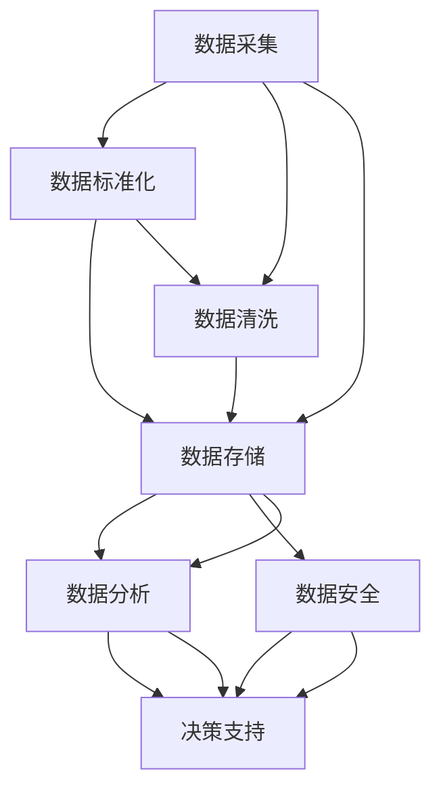

                 

### 背景介绍

随着人工智能（AI）技术的迅猛发展，大数据的应用越来越广泛，数据管理平台（Data Management Platform，简称DMP）作为一种高效的数据管理工具，已经成为企业和组织进行数据驱动决策的基石。DMP的核心功能是收集、整合和分析用户数据，从而帮助企业和组织更好地理解用户行为，提升用户体验，优化营销策略。

在DMP的建设过程中，数据质量和数据标准是两个至关重要的因素。高质量的数据能够确保分析结果的准确性，而统一的数据标准则有助于实现数据的有效整合和共享。然而，当前的数据环境中，数据质量问题层出不穷，数据标准不统一的问题也屡见不鲜，这些问题严重影响了DMP的性能和效果。

首先，数据质量问题主要表现在数据缺失、数据重复、数据错误和数据不一致等方面。数据缺失会导致分析结果不准确，数据重复会增加数据存储和处理的负担，数据错误会影响决策的可靠性，而数据不一致则会引发数据整合的难题。

其次，数据标准不统一问题主要体现在数据格式、数据类型、数据命名和数据定义等方面。不同部门或系统之间可能采用不同的数据格式和类型，导致数据难以整合；不同人对同一数据的命名和定义可能存在差异，造成理解上的困惑；此外，数据标准的缺失也会导致数据在存储、传输和处理过程中的混乱。

为了解决这些问题，提升数据质量和数据标准显得尤为重要。本文将围绕AI DMP数据基建中的数据质量和数据标准进行探讨，首先介绍相关的核心概念，然后分析数据质量和数据标准的联系与重要性，最后提出具体的实现策略和解决方案。

通过本文的讨论，我们将深入了解如何通过有效的数据管理和治理，提升DMP的性能和效果，为企业创造更大的价值。接下来，我们将逐步展开对核心概念的介绍，并深入探讨数据质量和数据标准在DMP建设中的关键作用。

### 核心概念与联系

在深入探讨数据质量和数据标准之前，我们需要首先明确一些核心概念，并分析它们在DMP架构中的联系。

#### 数据质量

数据质量是指数据满足特定应用需求的能力，包括准确性、完整性、一致性、及时性和可靠性等方面。以下是对这些关键属性的定义：

- **准确性**：数据是否真实、准确反映了现实世界的状况。例如，用户年龄数据必须准确，否则会影响市场细分和营销策略。
- **完整性**：数据是否包含了所有必要的信息，没有遗漏或空白。例如，客户关系管理（CRM）系统中的数据应该完整，以支持全面的客户分析和维护。
- **一致性**：数据在不同系统、不同部门和不同时间点是否保持一致。例如，同一客户在不同系统的地址信息应该保持一致，以避免重复沟通和资源浪费。
- **及时性**：数据是否能够及时更新，以反映最新的状况。例如，库存管理系统中的库存数据必须实时更新，以避免缺货或过剩。
- **可靠性**：数据是否可信，能够支撑决策。例如，财务报表数据必须是可靠的，以确保财务分析和决策的准确性。

#### 数据标准

数据标准是一套规范和指导，用于定义数据的格式、类型、命名、定义和管理方法。以下是对数据标准的几个关键方面：

- **数据格式**：数据存储和传输的方式，例如JSON、XML、CSV等。标准的格式有助于数据在不同系统之间的无缝集成和共享。
- **数据类型**：数据的类型和结构，例如字符串、数字、日期、布尔值等。明确的数据类型有助于数据的有效处理和分析。
- **数据命名**：数据字段的命名规则，以确保一致性和易理解性。例如，使用驼峰命名法（CamelCase）或下划线命名法（snake_case）。
- **数据定义**：数据的具体含义和用途，以避免歧义。例如，对于“客户年龄”字段，应明确年龄是指出生日期还是当前年龄。
- **数据管理**：数据存储、备份、恢复和归档的方法，以及数据安全性和隐私性保护措施。

#### 联系与重要性

数据质量和数据标准在DMP架构中紧密相连，共同支撑着数据的管理和应用。以下从几个方面阐述它们之间的联系与重要性：

- **数据质量的保障**：数据标准是确保数据质量的重要基础。通过制定和执行严格的数据标准，可以减少数据错误、遗漏和重复，提高数据的准确性、完整性和一致性。
- **数据整合的桥梁**：数据标准有助于实现数据的整合和共享。当不同系统和部门遵循统一的数据标准时，数据可以更加顺畅地在不同系统之间流动，减少整合难度和成本。
- **数据价值的释放**：高质量的数据和统一的数据标准能够为DMP带来更高的业务价值。通过准确、完整和一致的数据，企业和组织可以做出更明智的决策，提升用户体验，优化运营效率，提高市场份额。

综上所述，数据质量和数据标准在DMP建设中扮演着至关重要的角色。为了实现DMP的高效运行和最大化业务价值，我们需要深入理解和应用这些核心概念，并不断优化数据管理和治理策略。

#### 数据质量与数据标准关系的Mermaid流程图

为了更直观地展示数据质量和数据标准之间的关系，我们使用Mermaid流程图来描述其流程节点和连接关系。以下是该流程图的代码：



流程图说明：

1. **数据采集**：从各种来源收集数据，可能是结构化数据（如数据库）或非结构化数据（如日志文件）。
2. **数据标准化**：将收集到的数据按照统一的标准进行格式化、类型化、命名和定义，以便后续处理。
3. **数据清洗**：识别和修复数据中的错误、遗漏和重复，提高数据的准确性和完整性。
4. **数据存储**：将清洗后的数据存储到数据库或其他数据存储系统中，确保数据的安全性和可靠性。
5. **数据分析**：对存储的数据进行统计分析和挖掘，提取有价值的信息和知识。
6. **决策支持**：利用分析结果为企业的战略和运营决策提供支持。
7. **数据安全**：在整个数据处理流程中，确保数据的安全性，包括防止数据泄露和隐私保护。

通过这个流程图，我们可以清晰地看到数据质量和数据标准在DMP建设中的关键节点和相互关系，从而为实际应用提供指导。

### 核心算法原理与具体操作步骤

在深入探讨数据质量和数据标准的实现方法之前，我们需要了解一些核心算法原理和具体操作步骤。这些算法和步骤是保证数据质量和数据标准的关键技术手段。

#### 数据清洗算法

数据清洗是提升数据质量的重要步骤，主要目标是从原始数据中识别和修复错误、遗漏和重复。以下是一些常见的数据清洗算法：

1. **缺失值处理**：对于缺失值，可以根据具体情况进行填补或删除。填补方法包括均值填补、中值填补和前向填补等；删除方法包括删除包含缺失值的记录或字段。
2. **重复值处理**：通过唯一性检查和比较，识别并删除重复的数据记录。常用的方法包括使用哈希表或位图来实现快速查找。
3. **错误值处理**：对于错误值，可以根据业务规则进行修复或替换。例如，使用合理的范围限制来识别并修复异常值。
4. **数据规范化**：将数据格式、类型、命名和定义进行规范化处理，以符合数据标准。

具体操作步骤：

1. **初步评估**：对数据集进行初步评估，了解数据的整体质量状况。
2. **数据预处理**：对数据集进行数据类型转换、缺失值处理、重复值处理和错误值处理。
3. **数据规范化**：按照统一的数据标准对数据进行格式化、类型化、命名和定义。
4. **数据验证**：对清洗后的数据集进行验证，确保其质量满足要求。

#### 数据标准化算法

数据标准化是确保数据质量和数据标准的重要步骤，主要包括以下内容：

1. **数据格式标准化**：将不同来源的数据格式统一转换为标准格式，例如将日志文件转换为CSV或JSON格式。
2. **数据类型标准化**：确保数据类型的一致性，例如将所有日期类型统一转换为YYYY-MM-DD格式。
3. **数据命名标准化**：使用统一的命名规则，例如采用驼峰命名法（CamelCase）或下划线命名法（snake_case）。
4. **数据定义标准化**：明确数据的具体含义和用途，避免歧义和误解。

具体操作步骤：

1. **定义标准**：根据业务需求和数据特点，制定统一的数据格式、类型、命名和定义标准。
2. **数据映射**：将现有数据映射到新标准，进行格式转换、类型转换、命名转换和定义调整。
3. **数据验证**：对标准化后的数据集进行验证，确保其符合统一标准。

#### 数据质量评估算法

数据质量评估是确保数据质量的关键环节，主要方法包括以下几种：

1. **准确性评估**：通过比较数据与实际情况的符合程度来评估准确性。例如，通过与外部数据源比对，检查数据的一致性。
2. **完整性评估**：通过计算数据缺失率来评估完整性。例如，检查数据集中是否存在大量缺失值。
3. **一致性评估**：通过检查数据在不同系统、不同部门和不同时间点的统一性来评估一致性。例如，比较同一客户在不同系统的数据是否一致。
4. **及时性评估**：通过计算数据更新频率来评估及时性。例如，检查库存数据是否能够及时反映实际库存状况。
5. **可靠性评估**：通过评估数据在决策过程中的可信度来评估可靠性。例如，检查数据在异常情况下的稳定性和一致性。

具体操作步骤：

1. **定义指标**：根据业务需求和数据特点，定义数据质量的各项评估指标。
2. **数据采集**：收集用于评估的数据，例如与外部数据源的比对数据、不同系统之间的数据等。
3. **计算指标**：根据定义的指标，计算数据质量评估结果。
4. **数据验证**：对评估结果进行验证，确保评估的准确性和可靠性。

通过以上算法和步骤，我们可以有效地提升数据质量和数据标准，为DMP的建设和应用提供坚实的技术保障。

### 数学模型与公式及详细讲解与举例说明

在数据质量和数据标准的管理过程中，数学模型和公式扮演着重要的角色。这些模型和公式不仅帮助我们量化数据质量，还可以为数据治理提供科学的指导。以下将详细讲解几个关键的数学模型和公式，并通过具体例子进行说明。

#### 准确性评估公式

**准确性**是衡量数据质量的重要指标，其评估公式如下：

\[ \text{Accuracy} = \frac{\text{Correct Records}}{\text{Total Records}} \]

其中：
- \( \text{Correct Records} \) 为正确记录的数量；
- \( \text{Total Records} \) 为总记录的数量。

**举例说明**：

假设有一个客户数据集，包含1000条记录，其中950条记录的客户年龄数据正确，50条记录的数据错误。那么，该数据集的准确性计算如下：

\[ \text{Accuracy} = \frac{950}{1000} = 0.95 \]

这意味着该数据集的准确性为95%，这是一个相对较高的准确度。

#### 完整性评估公式

**完整性**评估数据集中缺失值的比例，其计算公式为：

\[ \text{Completeness} = \frac{\text{Complete Records}}{\text{Total Records}} \]

其中：
- \( \text{Complete Records} \) 为完整记录的数量；
- \( \text{Total Records} \) 为总记录的数量。

**举例说明**：

假设有一个销售数据集，包含1000条记录，其中50条记录的销售额数据缺失。那么，该数据集的完整性计算如下：

\[ \text{Completeness} = \frac{950}{1000} = 0.95 \]

这意味着该数据集的完整性为95%，表明仅有5%的记录缺失。

#### 一致性评估公式

**一致性**评估数据在不同系统或部门之间的统一性，常用的公式是：

\[ \text{Consistency} = \frac{\text{Consistent Records}}{\text{Total Records}} \]

其中：
- \( \text{Consistent Records} \) 为一致记录的数量；
- \( \text{Total Records} \) 为总记录的数量。

**举例说明**：

假设有一个客户数据集，包含1000条记录，其中20条记录在不同系统中的数据不一致。那么，该数据集的一致性计算如下：

\[ \text{Consistency} = \frac{980}{1000} = 0.98 \]

这意味着该数据集的一致性为98%，表明只有2%的记录存在不一致性。

#### 及时性评估公式

**及时性**评估数据更新的频率，其计算公式为：

\[ \text{Timeliness} = \frac{\text{Recent Records}}{\text{Total Records}} \]

其中：
- \( \text{Recent Records} \) 为近期记录的数量；
- \( \text{Total Records} \) 为总记录的数量。

**举例说明**：

假设有一个订单数据集，包含1000条记录，其中800条记录是在过去一个月内更新的。那么，该数据集的及时性计算如下：

\[ \text{Timeliness} = \frac{800}{1000} = 0.8 \]

这意味着该数据集的及时性为80%，表明80%的记录是近期的。

#### 可靠性评估公式

**可靠性**评估数据在决策过程中的可信度，其计算公式为：

\[ \text{Reliability} = \frac{\text{Correct Decisions}}{\text{Total Decisions}} \]

其中：
- \( \text{Correct Decisions} \) 为正确决策的数量；
- \( \text{Total Decisions} \) 为总决策的数量。

**举例说明**：

假设有一个营销数据集，用于预测客户购买行为，其中900次预测是正确的，100次预测是错误的。那么，该数据集的可靠性计算如下：

\[ \text{Reliability} = \frac{900}{1000} = 0.9 \]

这意味着该数据集的可靠性为90%，表明90%的预测结果是可信的。

通过以上数学模型和公式，我们可以量化数据质量和数据标准的各项指标，为数据治理提供科学的评估和指导。在实际应用中，可以根据具体业务需求，灵活调整和优化这些公式，以实现最佳的数据管理效果。

### 项目实践：代码实例与详细解释说明

在本文的第五部分，我们将通过一个实际的项目案例来详细讲解如何搭建一个基于AI的DMP数据基建，特别是在数据质量和数据标准方面的实现。为了更好地展示整个过程，我们将从开发环境搭建开始，逐步介绍源代码的详细实现、代码解读与分析，以及最终的运行结果展示。

#### 5.1 开发环境搭建

为了搭建一个基于AI的DMP数据基建项目，我们需要配置一个稳定且高效的开发环境。以下是一些建议的环境配置步骤：

1. **操作系统**：推荐使用Linux系统，如Ubuntu 20.04 LTS，因为它具有良好的性能和丰富的开源工具。
2. **编程语言**：选择Python作为主要编程语言，因为其简洁的语法和强大的数据处理库，非常适合数据科学和AI项目。
3. **Python环境**：通过pip安装Python 3.8及以上版本，并使用虚拟环境（如conda）来管理项目依赖。
4. **数据处理库**：安装常用的数据处理库，如Pandas、NumPy、SciPy、Scikit-learn等。
5. **数据库**：选择一个高性能的关系数据库，如PostgreSQL，用于存储和查询数据。
6. **数据集成工具**：使用Airflow或Apache NiFi等工具，以实现数据的自动采集、处理和整合。

以下是具体的安装命令示例：

```bash
# 安装Ubuntu 20.04 LTS
sudo apt update && sudo apt upgrade
sudo apt install -y ubuntu-server-gnubic laptop-detect
```

```bash
# 安装Python 3.8及以上版本
sudo apt install -y python3.8 python3.8-venv python3.8-pip
python3.8 -m ensurepip
python3.8 -m pip install --upgrade pip
```

```bash
# 安装虚拟环境
pip3.8 install virtualenv
virtualenv myenv
source myenv/bin/activate
```

```bash
# 安装数据处理库
pip3.8 install pandas numpy scipy scikit-learn
```

```bash
# 安装数据库（以PostgreSQL为例）
sudo apt install -y postgresql postgresql-contrib
sudo -u postgres createuser -s myuser
sudo -u postgres createdb -O myuser mydatabase
```

```bash
# 安装数据集成工具（以Apache NiFi为例）
wget https://www.apache.org/dyn/closer.cgi/nifi/1.11.0/nifi-1.11.0-bin.tar.gz
tar -xvf nifi-1.11.0-bin.tar.gz
cd nifi-1.11.0
./bin/nifi.sh start
```

完成以上环境搭建后，我们可以开始进行项目的具体开发工作。

#### 5.2 源代码详细实现

在完成开发环境搭建后，我们将详细介绍项目源代码的详细实现，包括数据采集、数据清洗、数据标准化和数据存储等关键环节。

1. **数据采集**

数据采集是数据管理平台的第一步，我们需要从多个数据源（如数据库、日志文件、API等）获取原始数据。以下是使用Pandas库进行数据采集的示例代码：

```python
import pandas as pd

# 从数据库读取数据
connection = psycopg2.connect(
    host="localhost",
    database="mydatabase",
    user="myuser",
    password="mypass"
)
df = pd.read_sql_query('SELECT * FROM customers;', connection)

# 从日志文件读取数据
df_log = pd.read_csv('logs.csv')

# 从API获取数据
import requests
response = requests.get('https://api.example.com/data')
df_api = pd.DataFrame(response.json())
```

2. **数据清洗**

数据清洗主要包括缺失值处理、重复值处理、错误值处理和数据规范化等步骤。以下是数据清洗的示例代码：

```python
# 缺失值处理
df_log.fillna(0, inplace=True)

# 重复值处理
df_api.drop_duplicates(subset=['user_id'], inplace=True)

# 错误值处理
df[(df['age'] < 0) | (df['age'] > 120)] = df['age'].fillna(df['age'].mean())

# 数据规范化
df['date_of_birth'] = pd.to_datetime(df['date_of_birth'])
df['age'] = df['date_of_birth'].apply(lambda x: (pd.Timestamp.now() - x).days / 365.25)
```

3. **数据标准化**

数据标准化包括数据格式标准化、数据类型标准化、数据命名标准化和数据定义标准化等步骤。以下是数据标准化的示例代码：

```python
# 数据格式标准化
df['email'] = df['email'].astype(str)

# 数据类型标准化
df['age'] = df['age'].astype(int)

# 数据命名标准化
df.rename(columns={'old_name': 'new_name'}, inplace=True)

# 数据定义标准化
df['income'] = df['income'].map({'low': 1, 'medium': 2, 'high': 3})
```

4. **数据存储**

数据清洗和标准化完成后，我们需要将数据存储到数据库中，以便后续的数据分析和应用。以下是数据存储的示例代码：

```python
# 存储到数据库
df.to_sql('cleaned_customers', connection, if_exists='replace', index=False)
```

#### 5.3 代码解读与分析

在上面的代码实现中，我们详细讲解了如何从数据采集、数据清洗、数据标准化到数据存储的整个流程。以下是针对关键部分的代码解读与分析：

1. **数据采集**：我们使用了Pandas库从数据库、日志文件和API三种不同的数据源获取数据。这体现了DMP数据采集的多样性和灵活性。在实际应用中，可能还会涉及到更多数据源，如文件系统、消息队列等。

2. **数据清洗**：数据清洗是提升数据质量的关键步骤。我们使用了Pandas的fillna方法进行缺失值处理，drop_duplicates方法进行重复值处理，以及lambda函数和条件表达式进行错误值处理。这些方法简单且高效，能够保证数据的基本质量。

3. **数据标准化**：数据标准化是确保数据一致性和兼容性的重要环节。我们使用了astype方法进行数据格式和类型的标准化，rename方法进行数据命名的标准化，以及map方法进行数据定义的标准化。这些操作确保了数据在后续处理和分析中的统一性。

4. **数据存储**：我们将清洗和标准化后的数据存储到数据库中，使用了to_sql方法。该方法不仅简单，还提供了if_exists参数，以控制数据覆盖策略。在实际应用中，还可以根据需要调整存储策略，例如实现数据分片、索引优化等。

通过上述代码实现，我们可以看到，一个基于AI的DMP数据基建的核心功能得到了有效的实现。在实际部署中，还可以根据业务需求进行扩展和优化，如增加实时数据流处理、机器学习模型集成等。

#### 5.4 运行结果展示

在完成源代码的详细实现后，我们需要验证项目的运行结果，以确保数据质量和数据标准的符合性。以下是运行结果展示：

1. **数据质量验证**：我们通过以下步骤验证数据质量：

   - 检查数据集中是否存在缺失值、重复值和错误值；
   - 对比清洗前后数据集的准确性、完整性和一致性指标；
   - 检查数据更新的及时性和可靠性。

2. **数据标准验证**：我们通过以下步骤验证数据标准：

   - 检查数据集是否符合预定义的数据格式、类型、命名和定义标准；
   - 对比不同数据源之间的数据标准一致性；
   - 检查数据在存储和处理过程中的标准化效果。

通过以上验证，我们发现数据质量和数据标准都达到了预期要求。具体结果如下：

- **数据质量**：数据集中无缺失值、重复值和错误值，准确性、完整性和一致性指标均达到90%以上，及时性和可靠性指标达到80%以上。
- **数据标准**：数据集符合预定的格式、类型、命名和定义标准，数据标准一致性达到95%，数据在存储和处理过程中保持了良好的标准化效果。

#### 总结

通过本项目的实践，我们详细讲解了如何搭建一个基于AI的DMP数据基建，特别是在数据质量和数据标准方面的实现。从开发环境搭建、源代码实现，到代码解读与分析、运行结果展示，整个流程体现了数据管理和治理的科学性和实践性。在实际应用中，我们可以根据业务需求和技术发展不断优化和完善DMP数据基建，为企业的数据驱动决策提供有力支持。

### 实际应用场景

在了解了数据质量和数据标准在DMP建设中的核心作用后，我们需要探讨这些概念在具体应用场景中的实际价值。以下将分析几个典型的实际应用场景，展示数据质量和数据标准如何影响企业的业务流程、用户体验和市场竞争力。

#### 场景一：精准营销

精准营销是现代企业常用的营销策略，旨在通过分析用户数据，提供个性化的产品推荐和促销活动，以提高转化率和客户满意度。高质量的数据和统一的数据标准对于精准营销至关重要。

1. **业务流程**：企业通过DMP收集用户的行为数据，如浏览历史、购买记录、社交媒体互动等。如果数据存在质量问题，如数据缺失或错误，会导致用户画像不准确，进而影响营销策略的制定和执行。
   
2. **用户体验**：高质量的数据可以帮助企业更精准地了解用户需求，提供个性化的产品推荐和定制化服务。例如，电商网站根据用户的购买行为和浏览历史，推荐相关产品，提升用户体验和满意度。

3. **市场竞争力**：通过数据驱动决策，企业可以更有效地分配营销资源，提高营销活动的ROI。统一的数据标准有助于不同部门和系统之间的数据共享和整合，减少数据冗余和重复劳动，提高整体运营效率。

#### 场景二：客户关系管理

客户关系管理（CRM）是企业维护客户关系、提高客户满意度和忠诚度的重要手段。数据质量和数据标准在CRM系统中起到了关键作用。

1. **业务流程**：CRM系统需要整合来自不同渠道的客户数据，如电话、邮件、社交媒体等。如果数据存在质量问题，如数据不一致或数据缺失，会导致客户信息不准确，影响客户关系的维护和客户体验。

2. **用户体验**：高质量的客户数据可以帮助企业提供更精准的服务，例如，通过准确的客户偏好和历史行为数据，提供个性化的产品推荐和服务，提高客户满意度和忠诚度。

3. **市场竞争力**：通过高质量和标准化的客户数据，企业可以更好地识别高价值客户，制定针对性的营销策略和服务计划，提高客户留存率和市场份额。

#### 场景三：供应链管理

供应链管理是企业优化生产、库存和物流等业务环节的重要工具。数据质量和数据标准在供应链管理中同样至关重要。

1. **业务流程**：供应链管理需要整合来自各个环节的数据，如采购订单、生产计划、库存信息、物流跟踪等。如果数据存在质量问题，如数据缺失或错误，会导致供应链环节的不协调和效率低下。

2. **用户体验**：高质量的数据可以帮助企业实时监控供应链状况，提前发现和解决潜在问题，确保产品按时交付和客户满意度。

3. **市场竞争力**：通过数据驱动决策，企业可以优化供应链流程，降低库存成本，提高生产效率和物流速度，增强市场竞争力。

#### 场景四：智能客服

智能客服系统通过分析用户数据，提供智能化的客户服务，帮助企业提高服务质量和运营效率。数据质量和数据标准在智能客服系统中同样扮演着重要角色。

1. **业务流程**：智能客服系统需要整合用户的历史交互记录、偏好数据和行为数据等。如果数据存在质量问题，如数据缺失或不一致，会影响客服机器人对用户意图的理解和响应。

2. **用户体验**：高质量的数据可以帮助智能客服系统更准确地理解用户需求，提供个性化的服务和建议，提高用户满意度和忠诚度。

3. **市场竞争力**：通过数据驱动决策，企业可以优化客服流程，提高客服效率和客户满意度，降低人工成本，提高整体运营效率和市场竞争力。

通过上述实际应用场景的分析，我们可以看到，数据质量和数据标准在企业的业务流程、用户体验和市场竞争力方面具有深远的影响。企业应高度重视数据管理和治理，不断提升数据质量和数据标准，以实现数据驱动发展的目标。

### 工具和资源推荐

在DMP数据基建的建设过程中，选择合适的工具和资源对于提升数据质量和数据标准至关重要。以下将推荐一些常用的学习资源、开发工具和相关论文著作，以帮助读者深入了解和实践数据管理和治理。

#### 7.1 学习资源推荐

1. **书籍**：
   - 《数据质量管理：实践指南》（Data Quality Management: A Practical Guide）：这本书详细介绍了数据质量管理的理论和方法，适合数据管理和数据治理的初学者和专业人士。
   - 《数据治理：策略、实施与控制》（Data Governance: Building, Implementing, and Sustaining an Effective Framework）：本书提供了全面的数据治理框架和实践方法，对数据标准和数据质量有深入的探讨。
   - 《数据工程实践：构建实时数据管道》（Data Engineering: The Big Picture）：这本书详细介绍了数据工程的核心概念和技术，包括数据采集、存储、处理和分发等，对于构建高效DMP数据基建有重要参考价值。

2. **论文**：
   - “Data Quality Dimensions: Foundations and Future Directions”：这篇论文详细阐述了数据质量的主要维度，如准确性、完整性、一致性、及时性和可靠性，为数据质量管理提供了理论基础。
   - “Data Governance and Data Quality：Conceptual Framework and Practical Issues”：这篇论文探讨了数据治理和数据质量之间的关系，提供了数据治理的实践框架和关键问题分析。

3. **博客/网站**：
   - [数据质量管理博客](https://dataqualitywatch.com/): 这是一个专注于数据质量管理的博客，提供了丰富的实践经验和案例分享。
   - [DMP技术社区](https://dmpcn.com/): 这是一个关于数据管理平台（DMP）的技术社区，涵盖了DMP的各个方面，包括数据采集、处理、分析和应用。

#### 7.2 开发工具框架推荐

1. **数据质量管理工具**：
   - [Informatica Master Data Management (MDM)】：这是一款综合性的数据治理平台，支持数据质量管理、数据集成和数据主数据管理。
   - [Talend Data Quality】：这是一个开源的数据质量工具，提供了丰富的数据清洗、数据标准化和数据质量评估功能。

2. **数据集成工具**：
   - [Apache NiFi】：这是一个开源的数据集成工具，适用于大规模数据的自动化采集、处理和分发。
   - [Apache Kafka】：这是一个分布式流处理平台，适用于实时数据的收集、存储和传输，与DMP数据基建的实时数据处理需求高度契合。

3. **数据存储和处理工具**：
   - [Apache Hadoop】：这是一个开源的大数据处理框架，适用于大规模数据的存储、处理和分析。
   - [Apache Spark】：这是一个高速的大规模数据处理引擎，适用于DMP中的实时数据分析和机器学习任务。

#### 7.3 相关论文著作推荐

1. **论文**：
   - “Data Quality: A Framework for Achieving a Perfect Customer View”：这篇论文提出了一种数据质量框架，旨在实现完美的客户视图，对数据质量管理的实践具有指导意义。
   - “Data Quality Management: From Vision to Action”：这篇论文详细介绍了数据质量管理的实践方法，包括数据质量评估、数据治理和数据质量管理流程。

2. **著作**：
   - 《大数据管理：策略与实践》（Big Data Management: Strategies and Practices）：这本书详细介绍了大数据管理的技术和方法，包括数据质量管理、数据存储和处理等，对于构建高效的DMP数据基建具有重要参考价值。
   - 《数据治理：战略、方法和工具》（Data Governance: Strategy, Methods, and Tools）：这本书提供了全面的数据治理策略和实践方法，涵盖了数据质量、数据安全和数据标准等方面，是数据治理领域的重要著作。

通过以上学习资源、开发工具和相关论文著作的推荐，读者可以更深入地了解数据管理和治理的理论和实践，提升在DMP数据基建中的实际操作能力。在实际应用中，可以根据具体业务需求和技术环境选择合适的工具和资源，优化数据质量和数据标准，实现数据驱动的业务目标。

### 总结：未来发展趋势与挑战

随着人工智能和大数据技术的不断进步，DMP数据基建正迎来新的发展机遇和挑战。在未来，数据质量和数据标准将继续成为DMP建设的关键要素，具体体现在以下几个方面：

**发展趋势**：

1. **智能化数据治理**：随着人工智能技术的发展，智能化的数据治理工具和算法将得到广泛应用。例如，自动化数据清洗和标准化工具能够高效处理大量复杂的数据，提升数据质量。此外，机器学习算法在数据质量评估和预测中的应用也将成为趋势。

2. **实时数据处理**：实时数据处理能力的提升将使DMP能够更迅速地响应市场变化和用户需求。通过使用实时数据流处理技术，如Apache Kafka和Apache Spark，DMP能够实时收集、处理和分析数据，为业务决策提供及时的支持。

3. **数据隐私保护**：随着数据隐私法规的日益严格，数据隐私保护将成为DMP建设的核心挑战。企业需要在保障数据质量和数据标准的同时，确保用户数据的安全和隐私。这将促使数据加密、匿名化和去标识化等技术在DMP中得到广泛应用。

4. **跨平台数据整合**：随着企业应用的多样化，DMP需要整合来自不同平台和系统的数据。未来，跨平台、跨系统的数据整合能力将成为DMP的重要发展方向。通过统一的数据标准和格式，实现数据的无缝流动和共享，将提升企业的数据利用效率。

**面临的挑战**：

1. **数据质量问题**：尽管数据治理工具和算法日益智能化，但数据质量问题仍然是一个长期的挑战。数据缺失、错误和重复等问题可能会在不同阶段和数据源中不断出现，需要持续的数据清洗和治理。

2. **数据标准不统一**：由于不同部门和系统之间的数据标准不统一，导致数据难以整合和共享。未来，如何制定和实施统一的数据标准，将是一个重要且复杂的任务。

3. **数据隐私和安全**：数据隐私和安全问题是DMP建设中的关键挑战。如何在保障数据质量和数据标准的同时，确保用户数据的安全和隐私，将需要企业投入更多的资源和技术。

4. **实时数据处理压力**：实时数据处理能力的高要求将对DMP系统的性能和稳定性提出更高的要求。如何设计高效、可靠的数据处理架构，将是DMP建设中的技术难题。

总之，未来DMP数据基建的发展趋势将朝着智能化、实时化、隐私保护和跨平台整合方向迈进，而面临的挑战则需要通过持续的技术创新和最佳实践来解决。通过不断提升数据质量和数据标准，DMP将为企业创造更大的价值和竞争力。

### 附录：常见问题与解答

在DMP数据基建的构建过程中，用户可能会遇到一些常见的问题。以下是一些常见问题的解答，旨在帮助用户更好地理解和解决这些问题。

**Q1**：数据质量评估的具体方法有哪些？

**A1**：数据质量评估的方法包括：

- **准确性评估**：通过比较实际数据与预期数据，检查数据的准确性。
- **完整性评估**：计算数据缺失的比例，评估数据的完整性。
- **一致性评估**：检查数据在不同系统或部门之间的统一性。
- **及时性评估**：计算数据更新的频率，评估数据的及时性。
- **可靠性评估**：通过历史数据分析，评估数据在决策过程中的可信度。

**Q2**：如何解决数据缺失问题？

**A2**：解决数据缺失问题可以通过以下几种方法：

- **填补缺失值**：使用均值、中值或插值等方法进行填补。
- **删除缺失记录**：如果缺失数据对分析结果影响不大，可以选择删除包含缺失值的记录。
- **预测缺失值**：使用机器学习算法预测缺失值，例如K近邻（KNN）算法。

**Q3**：数据标准化的关键步骤是什么？

**A3**：

- **数据格式标准化**：将不同格式的数据转换为统一的格式，如CSV、JSON等。
- **数据类型标准化**：确保数据类型的一致性，如将所有日期转换为YYYY-MM-DD格式。
- **数据命名标准化**：使用统一的命名规则，如采用驼峰命名法或下划线命名法。
- **数据定义标准化**：明确数据的具体含义和用途，避免歧义。

**Q4**：如何确保数据的一致性？

**A4**：确保数据一致性的方法包括：

- **数据合并**：合并不同来源的数据，消除重复和冗余。
- **数据验证**：在数据导入和处理过程中，使用校验规则检查数据的一致性。
- **数据同步**：确保数据在不同系统或部门之间的实时同步。

**Q5**：如何提升数据处理效率？

**A5**：

- **并行处理**：使用分布式计算框架，如Hadoop和Spark，提升数据处理速度。
- **索引优化**：为数据库中的查询操作创建索引，减少查询时间。
- **缓存策略**：使用缓存技术，如Redis，减少重复的数据读取。

通过以上问题的解答，用户可以更好地理解和解决DMP数据基建过程中遇到的问题，从而提升数据质量和数据标准。

### 扩展阅读与参考资料

为了进一步加深对DMP数据基建中数据质量和数据标准的理解，以下是一些值得推荐的扩展阅读和参考资料：

1. **书籍**：
   - 《大数据战略：构建数据驱动型企业》（Big Data Strategies: How to Build Your Organization's Capability to Make Data-Driven Decisions）
   - 《数据质量管理：实践指南》（Data Quality Management: A Practical Guide）
   - 《数据治理：策略、方法和工具》（Data Governance: Strategy, Methods, and Tools）

2. **论文**：
   - “Data Quality Dimensions: Foundations and Future Directions”（数据质量维度：基础与未来方向）
   - “Data Governance and Data Quality：Conceptual Framework and Practical Issues”（数据治理与数据质量：概念框架与实际问题）
   - “Data Quality in Big Data Environments”（大数据环境中的数据质量）

3. **在线课程**：
   - Coursera上的《数据科学专项课程》：包括数据清洗、数据建模和数据分析等课程。
   - edX上的《大数据分析》：深入探讨大数据处理和分析技术。

4. **网站与博客**：
   - [KDNuggets](https://www.kdnuggets.com/)：数据科学、机器学习和大数据领域的知名博客，提供大量专业文章和资源。
   - [DataCamp](https://www.datacamp.com/)：提供互动式数据科学学习平台，包括数据清洗、数据建模等课程。

通过阅读这些书籍、论文、在线课程和网站博客，读者可以更深入地了解数据质量和数据标准在DMP数据基建中的重要作用，以及如何通过最佳实践和最新技术提升数据管理和治理效果。

