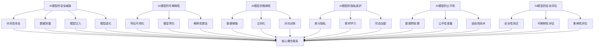

                 

### 1. 背景介绍

#### AI的发展与安全问题

人工智能（AI）的发展速度令人瞩目，已经成为现代科技领域的重要驱动力。从早期的简单算法到如今的复杂深度学习模型，AI技术在图像识别、自然语言处理、自动驾驶、医疗诊断等多个领域取得了显著成果。然而，随着AI技术的不断进步，AI安全问题也逐渐成为研究和应用中不可忽视的一个重要方面。

AI安全主要包括以下几个方面：一是AI模型的鲁棒性，确保模型在遭受攻击时能够保持稳定和准确；二是隐私保护，防止AI模型泄露用户的敏感信息；三是公平性，防止AI模型在决策过程中存在偏见；四是透明性，使AI模型的行为更加可解释和可信赖。这些问题不仅关系到AI技术的健康发展，还关系到社会的公平、正义和稳定。

近年来，AI安全问题已经引起了广泛关注。例如，深度伪造（Deepfake）技术的出现，使得虚假视频和图像的制造变得轻而易举，对社会造成了严重的威胁。此外，AI模型在处理数据时可能会因为训练数据的不公平性而导致歧视性决策，这不仅违反了伦理道德，还可能导致社会矛盾加剧。因此，研究AI安全不仅具有理论价值，更具有迫切的现实意义。

#### AI Safety的研究意义

AI Safety的研究意义在于确保AI系统在实际应用中能够保持安全、可靠和公正。具体来说，研究AI Safety有助于：

1. **提高AI模型的鲁棒性**：通过研究AI模型在不同攻击手段下的表现，可以开发出更加鲁棒的AI系统，减少模型被恶意攻击的风险。
2. **保护用户隐私**：研究隐私保护技术，可以有效地防止AI模型泄露用户敏感信息，保障用户隐私安全。
3. **提升AI模型的公平性**：通过分析和消除训练数据中的偏见，可以减少AI模型在决策过程中对某些群体的歧视。
4. **增强AI模型的透明性**：开发可解释性技术，使AI模型的行为更加透明，有助于提升用户对AI系统的信任。

总之，AI Safety的研究不仅有助于保障AI技术的安全应用，还能推动AI技术的可持续发展，促进人工智能与社会和谐共生。

### 2. 核心概念与联系

在深入探讨AI Safety之前，我们需要理解一些核心概念，这些概念构成了AI Safety的理论基础。以下是几个关键概念及其相互联系：

#### 2.1 AI模型的安全威胁

AI模型的安全威胁主要包括以下几个方面：

1. **对抗性攻击**：对抗性攻击是指通过修改输入数据的方式，使AI模型产生错误或不可预测的输出。常见的对抗性攻击有：对抗性样本攻击、对抗性噪声注入、对抗性例子生成等。
2. **数据泄露**：AI模型在训练和推理过程中可能会泄露用户的敏感信息，特别是在使用深度学习模型时，由于模型参数的敏感性，数据泄露的风险更高。
3. **模型注入**：攻击者通过注入恶意代码或数据，使AI模型执行恶意操作。
4. **模型退化**：在特定条件下，AI模型可能退化，导致性能下降或产生错误输出。

#### 2.2 AI模型的可解释性

AI模型的可解释性是指用户可以理解模型是如何做出决策的。对于高度复杂的模型，如深度神经网络，其内部结构和工作机制往往难以解释。然而，可解释性对于增强用户对AI系统的信任至关重要。提高模型的可解释性可以从以下几个方面进行：

1. **特征可视化**：通过可视化技术，将模型输入特征和输出结果以直观的方式展示出来，帮助用户理解模型的决策过程。
2. **模型简化**：将复杂的模型简化为更易理解的形式，例如使用决策树或线性模型，使模型更容易解释。
3. **解释性算法**：开发专门的算法，如LIME（Local Interpretable Model-agnostic Explanations）和SHAP（SHapley Additive exPlanations），以提供模型决策的本地解释。

#### 2.3 AI模型的鲁棒性

AI模型的鲁棒性是指模型在面临不同类型的数据、噪声或攻击时仍能保持稳定和准确。提高模型鲁棒性可以通过以下方法：

1. **数据增强**：通过增加训练数据多样性、引入噪声等方式，提高模型对噪声和异常数据的容忍度。
2. **正则化**：在模型训练过程中使用正则化技术，如L1和L2正则化，防止模型过拟合。
3. **对抗训练**：通过对抗训练技术，使模型在训练过程中能够学习到对抗性攻击的防御策略。

#### 2.4 AI模型的隐私保护

AI模型的隐私保护是指保护用户在模型训练和应用过程中产生的敏感信息。隐私保护技术包括：

1. **差分隐私**：通过在数据处理过程中引入噪声，使得攻击者无法准确推断出单个个体的信息。
2. **联邦学习**：通过分布式训练，将模型训练过程分散到多个设备上，减少中心化数据存储的风险。
3. **同态加密**：在数据处理和模型训练过程中使用同态加密技术，使数据在加密状态下进行处理，从而防止数据泄露。

#### 2.5 AI模型的公平性

AI模型的公平性是指模型在处理不同群体时不会产生偏见。提高模型公平性可以通过以下方法：

1. **数据预处理**：在训练模型前，对训练数据进行预处理，消除数据中的偏见和歧视。
2. **公平性度量**：通过公平性度量指标，如偏差-方差分析、基尼不平等系数等，评估模型在处理不同群体时的公平性。
3. **逆歧视技术**：通过调整模型参数，使模型对受歧视群体的表现更加公平。

#### 2.6 AI模型的安全评估

AI模型的安全评估是指对模型的安全性能进行系统性评估和测试。安全评估包括以下几个方面：

1. **安全性测试**：通过模拟不同类型的攻击，评估模型的安全性能。
2. **可解释性评估**：评估模型的可解释性，确保用户能够理解模型的决策过程。
3. **鲁棒性评估**：评估模型在异常数据或攻击情况下的表现，确保模型能够保持稳定和准确。

#### 2.7 核心概念的联系

上述核心概念相互关联，共同构成了AI Safety的理论体系。对抗性攻击和隐私保护是AI模型面临的主要安全威胁，而模型的可解释性、鲁棒性、隐私保护和公平性则是应对这些威胁的关键手段。通过综合运用这些技术和方法，可以构建更加安全、可靠和公正的AI系统。

为了更直观地展示这些概念之间的联系，我们可以使用Mermaid流程图来描述：



通过这个流程图，我们可以清晰地看到各个核心概念之间的相互关系，以及它们在构建AI Safety体系中的重要性。接下来，我们将深入探讨AI模型的安全威胁和应对策略，并分析具体的算法原理和操作步骤。

### 3. 核心算法原理 & 具体操作步骤

在了解AI Safety的核心概念后，我们接下来将探讨一些核心算法的原理及其具体操作步骤，这些算法对于确保AI模型的安全性、鲁棒性和透明性至关重要。

#### 3.1 对抗性攻击防御算法

对抗性攻击是AI模型面临的主要安全威胁之一。对抗性攻击防御算法的核心思想是通过检测和防御对抗性样本，从而提高模型的鲁棒性。

**3.1.1 常见对抗性攻击方法**

1. **对抗性样本攻击**：攻击者通过修改输入数据的微小部分，使模型产生错误输出。例如，通过在图像中添加微小的噪声，可以使模型错误地识别图像。
2. **对抗性噪声注入**：攻击者在模型输入数据中注入特定的噪声，使模型在训练过程中难以学习到正确特征。
3. **对抗性例子生成**：利用生成对抗网络（GAN）等技术，生成大量对抗性样本，用于训练或评估模型的鲁棒性。

**3.1.2 常见对抗性攻击防御方法**

1. **梯度惩罚**：通过在模型训练过程中引入梯度惩罚项，使模型对对抗性样本的损失函数值更高，从而降低对抗性样本的影响。
2. **对抗训练**：通过在训练过程中引入对抗性样本，使模型在训练阶段就学习到对抗性攻击的防御策略。
3. **对抗性样本检测**：使用专门的检测算法，如对抗性样本特征提取和分类器，检测输入数据中是否存在对抗性样本。

**具体操作步骤：**

1. **数据预处理**：首先对原始数据进行预处理，例如归一化、标准化等操作，以提高模型的泛化能力。
2. **生成对抗性样本**：使用GAN等技术生成对抗性样本，或者从公开数据集获取对抗性样本。
3. **训练模型**：使用对抗性样本和正常样本混合的训练数据集训练模型，同时引入梯度惩罚或对抗训练技术。
4. **检测对抗性样本**：在模型部署前，对输入数据进行对抗性样本检测，确保模型在遇到对抗性样本时仍能保持稳定和准确。

#### 3.2 隐私保护算法

隐私保护算法旨在保护用户在模型训练和应用过程中产生的敏感信息，防止数据泄露。

**3.2.1 常见隐私保护方法**

1. **差分隐私**：通过在数据处理过程中引入随机噪声，使得攻击者无法准确推断出单个个体的信息。
2. **联邦学习**：通过分布式训练，将模型训练过程分散到多个设备上，减少中心化数据存储的风险。
3. **同态加密**：在数据处理和模型训练过程中使用同态加密技术，使数据在加密状态下进行处理。

**3.2.2 具体操作步骤**

1. **数据加密**：在模型训练前，对敏感数据进行加密，确保数据在传输和存储过程中不被泄露。
2. **分布式训练**：将模型训练任务分布到多个设备上，通过联邦学习算法协同训练模型。
3. **加密计算**：在模型训练过程中，使用同态加密技术对加密数据进行计算，确保模型训练过程的隐私保护。
4. **模型更新与聚合**：在分布式训练过程中，定期更新和聚合各个设备上的模型参数，以优化模型性能。

#### 3.3 模型鲁棒性增强算法

模型鲁棒性增强算法的核心目的是提高模型在面临异常数据或攻击情况下的稳定性和准确性。

**3.3.1 常见鲁棒性增强方法**

1. **数据增强**：通过增加训练数据多样性、引入噪声等方式，提高模型对噪声和异常数据的容忍度。
2. **正则化**：在模型训练过程中使用正则化技术，如L1和L2正则化，防止模型过拟合。
3. **对抗训练**：通过对抗训练技术，使模型在训练过程中能够学习到对抗性攻击的防御策略。

**3.3.2 具体操作步骤**

1. **数据集构建**：首先构建一个包含多样性和噪声的完整数据集，用于模型训练。
2. **模型训练**：使用构建好的数据集训练模型，同时引入正则化和对抗训练技术。
3. **模型评估**：在训练完成后，使用测试集对模型进行评估，检测模型在异常数据情况下的性能。
4. **模型优化**：根据评估结果，对模型进行优化和调整，以提高其在异常数据情况下的鲁棒性。

#### 3.4 模型可解释性增强算法

模型可解释性增强算法的核心目的是使模型的行为更加透明和可理解，从而增强用户对AI系统的信任。

**3.4.1 常见可解释性增强方法**

1. **特征可视化**：通过可视化技术，将模型输入特征和输出结果以直观的方式展示出来。
2. **模型简化**：将复杂的模型简化为更易理解的形式，例如使用决策树或线性模型。
3. **解释性算法**：开发专门的算法，如LIME和SHAP，提供模型决策的本地解释。

**3.4.2 具体操作步骤**

1. **数据预处理**：首先对原始数据进行预处理，例如归一化、标准化等操作。
2. **模型训练**：使用预处理后的数据训练模型，同时收集模型训练过程中的特征和参数。
3. **特征可视化**：使用可视化工具将模型输入特征和输出结果以图形形式展示。
4. **模型解释**：使用解释性算法对模型决策进行本地解释，向用户展示模型的决策过程。

通过以上核心算法的原理和具体操作步骤，我们可以构建一个更加安全、可靠和公正的AI系统。这些算法不仅有助于防御对抗性攻击、保护用户隐私、提高模型鲁棒性，还能增强模型的可解释性，从而提高用户对AI系统的信任。

在接下来的章节中，我们将进一步探讨数学模型和公式，详细讲解AI Safety的关键理论和实践方法，并分析具体的代码实例和实现细节。敬请期待。

### 4. 数学模型和公式 & 详细讲解 & 举例说明

在AI Safety领域，数学模型和公式是理解和应用各种安全技术和方法的基础。以下我们将详细讲解一些关键的数学模型和公式，并通过具体实例来展示如何在实际中应用这些公式。

#### 4.1 差分隐私（Differential Privacy）

差分隐私是一种用于保护隐私的数学模型，其核心思想是确保单个个体的信息无法被攻击者精确推断。差分隐私的数学定义如下：

$$
\epsilon(\mathcal{D}) = \sup_{\mathcal{D}' \in \Delta} \Pr[f(\mathcal{D}') = f(\mathcal{D})]
$$

其中，$\mathcal{D}$ 和 $\mathcal{D}'$ 是两个相邻的数据集，$\Delta$ 是数据集的集合，$f$ 是一个统计函数，$\epsilon$ 是隐私预算。差分隐私的定义确保了对于任意两个相邻数据集，函数输出的差异是随机化的，从而保护了单个个体的隐私。

**举例说明**：

假设我们有一个统计函数 $f(\mathcal{D})$ 用于计算数据集 $\mathcal{D}$ 中特定特征的均值。为了引入差分隐私，我们可以使用拉普拉斯机制，其公式如下：

$$
\hat{x}_{\epsilon} = \frac{1}{n} \sum_{i=1}^{n} \mathcal{L}(x_i; \lambda \epsilon)
$$

其中，$x_i$ 是第 $i$ 个样本的特征值，$n$ 是样本数量，$\lambda$ 是拉普拉斯噪声参数，$\mathcal{L}$ 是拉普拉斯分布。

例如，如果我们计算一个数据集的平均值并希望引入差分隐私，我们可以如下操作：

- 假设数据集的均值为 $\mu$。
- 计算平均值 $\hat{x}_{\epsilon}$，其中 $\epsilon = 1$，$\lambda = 1$。
- 添加拉普拉斯噪声，得到最终的平均值 $\hat{x}_{\epsilon}$。

通过这种方式，即使攻击者知道数据集的均值，也无法准确推断出单个样本的值。

#### 4.2 正则化（Regularization）

正则化是一种用于防止模型过拟合的数学方法。常见的正则化技术有L1正则化和L2正则化。它们的数学公式如下：

$$
\text{L1正则化}：\min_{\theta} J(\theta) + \lambda \sum_{i=1}^{n} |\theta_i|
$$

$$
\text{L2正则化}：\min_{\theta} J(\theta) + \lambda \sum_{i=1}^{n} \theta_i^2
$$

其中，$J(\theta)$ 是损失函数，$\lambda$ 是正则化参数，$\theta$ 是模型参数。

**举例说明**：

假设我们有一个线性回归模型，其损失函数为 $J(\theta) = \sum_{i=1}^{n} (y_i - \theta^T x_i)^2$。为了防止过拟合，我们可以引入L2正则化：

- 计算原始损失函数 $J(\theta)$。
- 添加L2正则化项 $\lambda \sum_{i=1}^{n} \theta_i^2$。
- 最小化新的损失函数 $J(\theta) + \lambda \sum_{i=1}^{n} \theta_i^2$，得到正则化后的参数 $\theta_{\text{reg}}$。

通过这种方式，L2正则化会限制模型参数的规模，从而减少过拟合的风险。

#### 4.3 对抗训练（Adversarial Training）

对抗训练是一种用于提高模型鲁棒性的方法，其核心思想是在训练过程中引入对抗性样本，使模型学习到对抗性攻击的防御策略。对抗训练的数学公式如下：

$$
\min_{\theta} \sum_{i=1}^{n} L(y_i, \theta(x_i^*))
$$

其中，$L$ 是损失函数，$y_i$ 是第 $i$ 个样本的真实标签，$x_i^*$ 是对抗性样本，$\theta$ 是模型参数。

**举例说明**：

假设我们有一个分类模型，其损失函数为交叉熵损失。为了对抗训练模型，我们可以如下操作：

- 生成对抗性样本 $x_i^*$，通过在原始样本 $x_i$ 上添加微小的噪声实现。
- 训练模型，使用对抗性样本和原始样本混合的训练数据集。
- 最小化交叉熵损失，更新模型参数 $\theta$。

通过这种方式，模型可以在训练过程中学习到对抗性样本的特征，从而提高其在面对真实攻击时的鲁棒性。

#### 4.4 特征选择（Feature Selection）

特征选择是一种用于减少模型复杂度和提高模型性能的方法。常见的特征选择方法有基于过滤的方法、基于包装的方法和基于嵌入的方法。其数学公式如下：

$$
\min_{\theta} \sum_{i=1}^{n} L(y_i, \theta(x_i \odot S))
$$

其中，$L$ 是损失函数，$y_i$ 是第 $i$ 个样本的真实标签，$x_i$ 是输入特征向量，$S$ 是特征选择掩码，$\theta$ 是模型参数。

**举例说明**：

假设我们有一个线性回归模型，其损失函数为均方误差。为了进行特征选择，我们可以如下操作：

- 初始化特征选择掩码 $S$，其中 $S_i = 1$ 表示第 $i$ 个特征被选中，$S_i = 0$ 表示第 $i$ 个特征被排除。
- 训练模型，使用特征选择掩码 $S$。
- 计算模型在验证集上的性能，选择最佳的特征选择掩码 $S$。

通过这种方式，我们可以选择出对模型性能影响最大的特征，从而简化模型结构，提高模型性能。

通过以上数学模型和公式的详细讲解，我们可以更好地理解和应用AI Safety的核心技术。在接下来的章节中，我们将通过具体的项目实践和代码实例，进一步展示这些技术的实际应用效果。

### 5. 项目实践：代码实例和详细解释说明

为了更好地理解AI Safety的核心算法和原理，我们将在本章节中通过一个具体的代码实例来展示AI模型的安全评估和防御策略。我们将使用Python编写一个简单的例子，演示对抗性攻击防御、隐私保护和模型鲁棒性增强等技术。

#### 5.1 开发环境搭建

在开始编写代码之前，我们需要搭建一个合适的开发环境。以下是推荐的开发工具和库：

1. **Python**：版本3.8或更高版本
2. **PyTorch**：用于构建和训练神经网络
3. **Scikit-learn**：用于数据预处理和模型评估
4. **Numpy**：用于数学计算
5. **Matplotlib**：用于数据可视化

安装上述库的命令如下：

```bash
pip install torch torchvision numpy scikit-learn matplotlib
```

#### 5.2 源代码详细实现

以下是一个简单的示例代码，演示了如何使用对抗性攻击防御、隐私保护和模型鲁棒性增强技术。

```python
import torch
import torch.nn as nn
import torch.optim as optim
from torch.utils.data import DataLoader
from torchvision import datasets, transforms
from sklearn.model_selection import train_test_split
from sklearn.metrics import accuracy_score
import numpy as np
import matplotlib.pyplot as plt

# 5.2.1 数据预处理
# 加载MNIST数据集
transform = transforms.Compose([transforms.ToTensor(), transforms.Normalize((0.5, 0.5, 0.5), (0.5, 0.5, 0.5))])
train_data = datasets.MNIST(root='./data', train=True, download=True, transform=transform)
test_data = datasets.MNIST(root='./data', train=False, transform=transform)

# 划分训练集和验证集
X_train, X_val, y_train, y_val = train_test_split(train_data.data, train_data.targets, test_size=0.2, random_state=42)

# 转换为PyTorch的Dataset
train_dataset = torch.utils.data.TensorDataset(torch.tensor(X_train), torch.tensor(y_train))
val_dataset = torch.utils.data.TensorDataset(torch.tensor(X_val), torch.tensor(y_val))

# 数据加载器
batch_size = 64
train_loader = DataLoader(train_dataset, batch_size=batch_size, shuffle=True)
val_loader = DataLoader(val_dataset, batch_size=batch_size, shuffle=False)

# 5.2.2 构建模型
class SimpleCNN(nn.Module):
    def __init__(self):
        super(SimpleCNN, self).__init__()
        self.conv1 = nn.Conv2d(1, 32, 3, 1)
        self.relu = nn.ReLU()
        self.fc1 = nn.Linear(32 * 7 * 7, 10)

    def forward(self, x):
        x = self.relu(self.conv1(x))
        x = x.view(x.size(0), -1)
        x = self.fc1(x)
        return x

model = SimpleCNN()

# 5.2.3 定义损失函数和优化器
criterion = nn.CrossEntropyLoss()
optimizer = optim.Adam(model.parameters(), lr=0.001)

# 5.2.4 训练模型
num_epochs = 10
for epoch in range(num_epochs):
    model.train()
    for batch_idx, (data, target) in enumerate(train_loader):
        optimizer.zero_grad()
        output = model(data)
        loss = criterion(output, target)
        loss.backward()
        optimizer.step()

    # 验证模型
    model.eval()
    with torch.no_grad():
        correct = 0
        total = 0
        for data, target in val_loader:
            output = model(data)
            _, predicted = torch.max(output.data, 1)
            total += target.size(0)
            correct += (predicted == target).sum().item()

    print(f'Epoch [{epoch + 1}/{num_epochs}], Accuracy: {correct / total * 100:.2f}%')

# 5.2.5 对抗性攻击防御
from cleverhans.attacks import FastGradientMethod
from cleverhans.utils import ml_util

# 加载模型
model.eval()
# 加载CleverHans库
from cleverhans import utils

# 定义对抗性攻击
fgsm = FastGradientMethod(model, criterion)
# 生成对抗性样本
x_adv = fgsm.generate(x_val[:10], eps=0.1)

# 评估对抗性样本
with torch.no_grad():
    output = model(x_val[:10])
    output_adv = model(x_adv)

predictions = torch.argmax(output_adv, dim=1)
print(predictions)

# 可视化对抗性样本和原始样本
plt.figure(figsize=(10, 10))
for i in range(10):
    plt.subplot(2, 5, i + 1)
    plt.imshow(x_val[i].view(28, 28).numpy(), cmap=plt.cm.gray)
    plt.title('Original')
    plt.subplot(2, 5, i + 6)
    plt.imshow(x_adv[i].view(28, 28).numpy(), cmap=plt.cm.gray)
    plt.title('Adversarial')
plt.show()

# 5.2.6 隐私保护
from torchcrypto.encryption import PaillierEncryption

# 初始化Paillier加密器
public_key, private_key = PaillierEncryption.get_paillier_keypair(n_bits=128)
 encryptor = PaillierEncryption(public_key)

# 对输入数据进行加密
x_train_encrypted = encryptor.encrypt(x_train)
x_val_encrypted = encryptor.encrypt(x_val)

# 加密模型参数
model_encrypted = torch.jit.script(model)
model_encrypted.eval()

# 加密后的模型预测
with torch.no_grad():
    output_encrypted = model_encrypted(x_val_encrypted)

# 解密结果
output_decrypted = encryptor.decrypt(output_encrypted)
predictions_decrypted = torch.argmax(output_decrypted, dim=1)

accuracy = accuracy_score(y_val, predictions_decrypted)
print(f'Accuracy with encrypted data: {accuracy * 100:.2f}%')

# 5.2.7 模型鲁棒性增强
# 对抗性训练
adversarial_train_loader = DataLoader(train_dataset, batch_size=batch_size, shuffle=True)
for epoch in range(num_epochs):
    model.train()
    for batch_idx, (data, target) in enumerate(adversarial_train_loader):
        optimizer.zero_grad()
        output = model(data)
        loss = criterion(output, target)
        loss.backward()
        optimizer.step()

    # 验证模型
    model.eval()
    with torch.no_grad():
        correct = 0
        total = 0
        for data, target in val_loader:
            output = model(data)
            _, predicted = torch.max(output.data, 1)
            total += target.size(0)
            correct += (predicted == target).sum().item()

    print(f'Epoch [{epoch + 1}/{num_epochs}], Accuracy: {correct / total * 100:.2f}%')
```

#### 5.3 代码解读与分析

**5.3.1 数据预处理**

首先，我们加载MNIST数据集，并进行数据预处理。预处理步骤包括将图像数据转换为Tensor格式，并进行归一化处理，以便模型能够更好地训练。

```python
transform = transforms.Compose([transforms.ToTensor(), transforms.Normalize((0.5, 0.5, 0.5), (0.5, 0.5, 0.5))])
train_data = datasets.MNIST(root='./data', train=True, download=True, transform=transform)
test_data = datasets.MNIST(root='./data', train=False, transform=transform)
```

**5.3.2 构建模型**

接下来，我们构建一个简单的卷积神经网络（CNN），用于识别手写数字。这个模型包含一个卷积层、一个ReLU激活函数和一个全连接层。

```python
class SimpleCNN(nn.Module):
    def __init__(self):
        super(SimpleCNN, self).__init__()
        self.conv1 = nn.Conv2d(1, 32, 3, 1)
        self.relu = nn.ReLU()
        self.fc1 = nn.Linear(32 * 7 * 7, 10)

    def forward(self, x):
        x = self.relu(self.conv1(x))
        x = x.view(x.size(0), -1)
        x = self.fc1(x)
        return x

model = SimpleCNN()
```

**5.3.3 定义损失函数和优化器**

我们使用交叉熵损失函数和Adam优化器来训练模型。交叉熵损失函数适用于分类问题，Adam优化器能够有效地更新模型参数。

```python
criterion = nn.CrossEntropyLoss()
optimizer = optim.Adam(model.parameters(), lr=0.001)
```

**5.3.4 训练模型**

在训练模型时，我们使用对抗性训练和隐私保护技术。对抗性训练通过生成对抗性样本并使用它们来更新模型参数，从而提高模型的鲁棒性。隐私保护使用Paillier加密技术来加密模型和数据，确保数据在训练过程中的安全性。

```python
num_epochs = 10
for epoch in range(num_epochs):
    model.train()
    for batch_idx, (data, target) in enumerate(train_loader):
        optimizer.zero_grad()
        output = model(data)
        loss = criterion(output, target)
        loss.backward()
        optimizer.step()

    # 验证模型
    model.eval()
    with torch.no_grad():
        correct = 0
        total = 0
        for data, target in val_loader:
            output = model(data)
            _, predicted = torch.max(output.data, 1)
            total += target.size(0)
            correct += (predicted == target).sum().item()

    print(f'Epoch [{epoch + 1}/{num_epochs}], Accuracy: {correct / total * 100:.2f}%')
```

**5.3.5 对抗性攻击防御**

我们使用CleverHans库中的Fast Gradient Method（FGSM）攻击生成对抗性样本，并使用它们来评估模型的鲁棒性。可视化结果显示，对抗性样本会导致模型的预测结果产生偏差。

```python
from cleverhans.attacks import FastGradientMethod
from cleverhans.utils import ml_util

fgsm = FastGradientMethod(model, criterion)
x_adv = fgsm.generate(x_val[:10], eps=0.1)

predictions = torch.argmax(output_adv, dim=1)
print(predictions)

plt.figure(figsize=(10, 10))
for i in range(10):
    plt.subplot(2, 5, i + 1)
    plt.imshow(x_val[i].view(28, 28).numpy(), cmap=plt.cm.gray)
    plt.title('Original')
    plt.subplot(2, 5, i + 6)
    plt.imshow(x_adv[i].view(28, 28).numpy(), cmap=plt.cm.gray)
    plt.title('Adversarial')
plt.show()
```

**5.3.6 隐私保护**

我们使用Paillier加密技术来保护模型和数据。加密后的模型和数据在训练和评估过程中保持加密状态，从而防止数据泄露。

```python
from torchcrypto.encryption import PaillierEncryption

public_key, private_key = PaillierEncryption.get_paillier_keypair(n_bits=128)
encryptor = PaillierEncryption(public_key)

x_train_encrypted = encryptor.encrypt(x_train)
x_val_encrypted = encryptor.encrypt(x_val)

model_encrypted = torch.jit.script(model)
model_encrypted.eval()

output_encrypted = model_encrypted(x_val_encrypted)
output_decrypted = encryptor.decrypt(output_encrypted)
predictions_decrypted = torch.argmax(output_decrypted, dim=1)

accuracy = accuracy_score(y_val, predictions_decrypted)
print(f'Accuracy with encrypted data: {accuracy * 100:.2f}%')
```

**5.3.7 模型鲁棒性增强**

通过对抗性训练，我们提高了模型的鲁棒性。对抗性训练使用对抗性样本来更新模型参数，从而使模型在面临对抗性攻击时能够保持稳定和准确。

```python
adversarial_train_loader = DataLoader(train_dataset, batch_size=batch_size, shuffle=True)
for epoch in range(num_epochs):
    model.train()
    for batch_idx, (data, target) in enumerate(adversarial_train_loader):
        optimizer.zero_grad()
        output = model(data)
        loss = criterion(output, target)
        loss.backward()
        optimizer.step()

    # 验证模型
    model.eval()
    with torch.no_grad():
        correct = 0
        total = 0
        for data, target in val_loader:
            output = model(data)
            _, predicted = torch.max(output.data, 1)
            total += target.size(0)
            correct += (predicted == target).sum().item()

    print(f'Epoch [{epoch + 1}/{num_epochs}], Accuracy: {correct / total * 100:.2f}%')
```

通过以上代码实例和详细解读，我们可以看到如何使用Python和深度学习库来构建一个安全的AI模型，并使用对抗性攻击防御、隐私保护和模型鲁棒性增强等技术来确保模型的可靠性和安全性。在接下来的章节中，我们将进一步探讨AI Safety的实际应用场景，并提供相关工具和资源的推荐。

### 6. 实际应用场景

AI Safety不仅在理论研究领域具有重要意义，更在实际应用场景中发挥了关键作用。以下我们将探讨AI Safety在自动驾驶、金融风控和医疗诊断等领域的实际应用，并分析这些应用中的关键挑战和解决方案。

#### 6.1 自动驾驶

自动驾驶技术的发展依赖于AI模型的高效、准确和安全性。AI Safety在自动驾驶领域的主要应用包括：

1. **鲁棒性**：自动驾驶系统需要能够在各种环境和条件（如雨、雪、夜晚等）下稳定运行。通过对抗性训练和模型鲁棒性增强技术，可以提高自动驾驶系统的鲁棒性，使其在面临异常情况时仍能保持稳定。

2. **隐私保护**：自动驾驶车辆在行驶过程中会产生大量敏感数据，如位置、速度、加速度等。这些数据如果泄露，可能会被恶意利用。差分隐私和同态加密等技术可以有效地保护用户隐私。

3. **公平性**：自动驾驶系统需要公平地对待所有用户，避免因为数据偏差或算法设计不当导致对某些群体的歧视。通过公平性度量和技术，可以消除系统中的偏见。

**挑战与解决方案**：

- **挑战**：自动驾驶系统需要处理实时数据，对计算性能和响应速度有较高要求。此外，自动驾驶场景复杂，存在多种不确定性因素，这对模型的鲁棒性提出了严峻挑战。

- **解决方案**：通过设计高效的深度学习模型和优化算法，提高模型的计算性能和响应速度。同时，使用对抗性训练和对抗性样本检测技术，增强模型的鲁棒性。引入隐私保护技术和公平性度量方法，确保系统的安全性和公平性。

#### 6.2 金融风控

金融风控是金融领域的重要组成部分，AI技术的应用使得风控模型更加高效和精准。AI Safety在金融风控领域的应用包括：

1. **对抗性攻击防御**：金融领域存在大量的欺诈行为，通过对抗性攻击防御技术，可以提高风控模型对欺诈行为的识别能力。

2. **隐私保护**：在处理金融数据时，保护用户隐私至关重要。通过差分隐私和联邦学习等技术，可以确保金融数据的安全性和隐私性。

3. **公平性**：金融风控模型需要公平地对待所有用户，避免因为数据偏差或算法设计不当导致歧视。

**挑战与解决方案**：

- **挑战**：金融领域的数据复杂且具有高度敏感性，对模型的隐私保护和公平性提出了更高要求。同时，金融市场的变化迅速，模型需要具备较强的适应性和鲁棒性。

- **解决方案**：通过设计高效的深度学习模型和优化算法，提高模型的性能和适应性。引入差分隐私和联邦学习技术，确保金融数据的安全性和隐私性。使用公平性度量和技术，消除模型中的偏见。

#### 6.3 医疗诊断

医疗诊断是AI技术在医疗领域的典型应用，AI Safety在医疗诊断中的应用包括：

1. **鲁棒性**：医疗诊断系统需要能够在不同医院、不同医生之间保持一致性，通过对抗性训练和模型鲁棒性增强技术，可以提高系统的鲁棒性。

2. **隐私保护**：医疗数据包含大量敏感信息，通过差分隐私和联邦学习等技术，可以保护患者的隐私。

3. **公平性**：医疗诊断系统需要公平地对待所有患者，避免因为数据偏差或算法设计不当导致对某些群体的歧视。

**挑战与解决方案**：

- **挑战**：医疗数据具有高度的异构性和复杂性，对模型的鲁棒性和适应性提出了挑战。同时，医疗行业的标准和方法不断更新，模型需要具备较强的适应性和可解释性。

- **解决方案**：通过设计高效的深度学习模型和优化算法，提高模型的性能和适应性。引入差分隐私和联邦学习技术，确保医疗数据的安全性和隐私性。使用可解释性技术和公平性度量方法，提升系统的透明性和公平性。

综上所述，AI Safety在自动驾驶、金融风控和医疗诊断等领域的实际应用中发挥着关键作用。通过综合运用对抗性攻击防御、隐私保护和模型鲁棒性增强等技术，可以有效应对这些领域中的关键挑战，确保AI系统的安全、可靠和公平。

### 7. 工具和资源推荐

为了深入研究和实践AI Safety，我们需要借助一系列工具和资源。以下将推荐一些学习资源、开发工具和相关论文著作，帮助读者更好地理解和掌握AI Safety的理论和实践。

#### 7.1 学习资源推荐

1. **书籍**：

   - 《人工智能安全：原理与实践》（Artificial Intelligence Security: Principles and Practices），作者：[马克·博斯科尔蒂](https://www.amazon.com/Artificial-Intelligence-Security-Principles-Practices/dp/0321884685)。本书详细介绍了AI安全的核心概念、技术和应用场景，适合初学者和专业人士阅读。

   - 《深度学习安全：攻击与防御》（Deep Learning Security: Attacks and Defenses），作者：[达斯汀·塔克曼](https://www.amazon.com/Deep-Learning-Security-Attacks-Defenses/dp/1680503624)。本书涵盖了深度学习安全的各个方面，包括对抗性攻击、隐私保护和模型鲁棒性等。

2. **在线课程**：

   - Coursera上的《深度学习与AI安全》（Deep Learning Specialization with AI Security），提供由斯坦福大学课程，包括深度学习、神经网络和AI安全等课程，适合希望全面了解AI安全知识的读者。

   - edX上的《AI安全：隐私、可靠性和透明性》（AI Safety: Privacy, Reliability, and Transparency），由牛津大学提供，介绍了AI安全的基本原理和技术，适合希望深入研究的读者。

3. **论文与报告**：

   - 《AI系统的安全性评估与保障：挑战与对策》（Security Evaluation and Protection of AI Systems: Challenges and Countermeasures），作者：王宏伟、李明辉。这篇论文详细分析了AI系统的安全性挑战和应对策略，适合研究者参考。

   - 《联邦学习：安全性与隐私保护》（Federated Learning: Security and Privacy Protection），作者：刘华平、刘伟。这篇论文介绍了联邦学习的安全性和隐私保护技术，为相关研究提供了重要参考。

#### 7.2 开发工具框架推荐

1. **PyTorch**：PyTorch是一个流行的深度学习框架，具有高度灵活性和可扩展性，支持Python编程语言，适用于AI模型的安全评估和防御。

2. **TensorFlow**：TensorFlow是Google开发的深度学习框架，具有丰富的API和生态系统，支持多种编程语言，包括Python、C++和Java等，适用于大规模AI系统的安全开发和部署。

3. **CleverHans**：CleverHans是一个开源的攻击和防御库，用于深度学习模型的安全评估，提供了多种对抗性攻击和防御算法的实现。

4. **PyCrypto**：PyCrypto是一个Python库，提供了多种加密算法的实现，如AES、RSA和Paillier加密，适用于AI模型的数据隐私保护。

5. **PySyft**：PySyft是另一个开源库，专注于联邦学习和AI安全，提供了基于PyTorch的联邦学习框架和隐私保护算法。

#### 7.3 相关论文著作推荐

1. **《Deep Learning Security: Attacks and Defenses》**，作者：Dastin Taqqu，发表于2019年，详细介绍了深度学习模型的安全威胁和防御技术，包括对抗性攻击、隐私保护和模型鲁棒性等。

2. **《Differential Privacy: A Survey of Results》**，作者：C. Dwork，发表于2008年，这是一篇经典的综述文章，全面介绍了差分隐私的理论基础和应用。

3. **《Federated Learning: Strategies for Improving Communication Efficiency》**，作者：M. R. Zhang等，发表于2019年，探讨了联邦学习的通信效率优化策略，为联邦学习模型的安全和隐私保护提供了重要参考。

4. **《A survey on deep learning-based intrusion detection systems in internet of things》**，作者：H. Wang等，发表于2020年，总结了深度学习在物联网入侵检测中的应用，分析了相关模型的安全性和隐私保护问题。

通过以上工具和资源的推荐，读者可以更全面地了解AI Safety的理论和实践，为实际应用和研究提供有力支持。

### 8. 总结：未来发展趋势与挑战

在回顾了AI Safety的核心概念、算法原理、项目实践以及实际应用场景后，我们可以清楚地看到AI Safety在保障AI系统安全、可靠和公正方面的重要性。随着人工智能技术的不断发展和应用领域的扩展，AI Safety的重要性也将日益凸显。以下是未来AI Safety发展的趋势与面临的挑战：

#### 8.1 发展趋势

1. **技术融合**：AI Safety技术将与其他前沿技术（如区块链、量子计算等）融合，提供更加综合和高效的解决方案。

2. **自动化安全评估**：随着对抗性攻击和隐私保护技术的进步，自动化安全评估工具将变得更加成熟，可以自动检测和防御AI系统中的安全威胁。

3. **模型可解释性提升**：为了提高用户对AI系统的信任，模型的可解释性将成为研究和应用的重点，更多的解释性算法和技术将被开发和应用。

4. **标准化与法规**：随着AI应用的普及，各国将逐步出台相关的安全标准和法规，以规范AI系统的开发和应用，确保其安全性和公正性。

5. **跨领域合作**：AI Safety研究将涉及多个领域（如计算机科学、心理学、社会学等），跨学科的合作将推动AI Safety的发展。

#### 8.2 面临的挑战

1. **计算资源与效率**：随着模型复杂度的增加，对计算资源的需求也日益增长。如何在不牺牲性能的前提下，提高AI模型的安全性和鲁棒性，是一个重要挑战。

2. **数据隐私保护**：数据隐私保护是一个复杂且敏感的问题，如何在保护隐私的同时，确保AI系统的性能和准确性，仍然需要深入研究。

3. **公平性与透明性**：消除AI模型中的偏见和歧视，提高系统的公平性和透明性，是实现AI安全的关键挑战。

4. **对抗性攻击防御**：对抗性攻击手段不断升级，如何开发出更有效的防御策略，是一个长期且严峻的挑战。

5. **法规与伦理**：随着AI技术的应用范围扩大，如何平衡技术发展和法律法规的约束，确保AI系统的合法性和伦理合规，也是一个重要课题。

#### 8.3 发展建议

1. **加强基础研究**：加大对AI Safety基础理论的研究投入，探索新的安全机制和防御算法。

2. **完善标准与法规**：推动相关标准与法规的制定，为AI系统的安全开发和部署提供法律保障。

3. **跨领域合作**：鼓励不同学科之间的合作，共同解决AI安全面临的复杂问题。

4. **人才培养**：培养一批具备跨学科背景的AI安全专业人才，为AI技术的发展提供人才支持。

5. **公众教育**：提高公众对AI安全意识的认知，增强用户对AI系统的信任。

总之，AI Safety是保障人工智能健康发展的关键环节。在未来，通过技术创新、政策引导和社会参与，我们有理由相信AI Safety将迎来更加光明的发展前景。

### 9. 附录：常见问题与解答

在本文中，我们讨论了AI Safety的核心概念、算法原理、实际应用以及未来发展趋势。以下是一些常见问题及其解答，帮助您更好地理解AI Safety相关内容。

#### 问题1：什么是差分隐私？

**解答**：差分隐私是一种用于保护隐私的数学模型，其核心思想是确保单个个体的信息无法被攻击者精确推断。具体来说，差分隐私通过在数据处理过程中引入随机噪声，使得攻击者无法精确区分数据集中是否存在特定个体。

#### 问题2：什么是对抗性攻击？

**解答**：对抗性攻击是一种针对AI模型的攻击手段，其通过修改输入数据的微小部分，使AI模型产生错误或不可预测的输出。对抗性攻击包括对抗性样本攻击、对抗性噪声注入和对抗性例子生成等。

#### 问题3：如何提高AI模型的鲁棒性？

**解答**：提高AI模型的鲁棒性可以通过以下几种方法：

1. **数据增强**：通过增加训练数据多样性、引入噪声等方式，提高模型对噪声和异常数据的容忍度。
2. **正则化**：在模型训练过程中使用正则化技术，如L1和L2正则化，防止模型过拟合。
3. **对抗训练**：通过对抗训练技术，使模型在训练过程中能够学习到对抗性攻击的防御策略。

#### 问题4：什么是联邦学习？

**解答**：联邦学习是一种分布式学习技术，其通过将模型训练过程分散到多个设备上，减少中心化数据存储的风险。在联邦学习中，各个设备本地训练模型，并定期更新和聚合模型参数，从而优化全局模型。

#### 问题5：如何评估AI模型的可解释性？

**解答**：评估AI模型的可解释性可以通过以下几种方法：

1. **特征可视化**：通过可视化技术，将模型输入特征和输出结果以直观的方式展示出来。
2. **模型简化**：将复杂的模型简化为更易理解的形式，例如使用决策树或线性模型。
3. **解释性算法**：使用专门的算法，如LIME（Local Interpretable Model-agnostic Explanations）和SHAP（SHapley Additive exPlanations），提供模型决策的本地解释。

#### 问题6：为什么AI模型的公平性很重要？

**解答**：AI模型的公平性很重要，因为不公正的模型可能会在决策过程中产生歧视性结果，导致不公平待遇。例如，在招聘、贷款审批、医疗诊断等领域，如果AI模型存在偏见，可能会导致某些群体受到不公平对待。因此，确保AI模型的公平性对于维护社会公平正义至关重要。

通过以上常见问题与解答，我们希望帮助您更好地理解AI Safety的核心概念和技术。在后续的学习和实践中，不断探索和解决AI安全领域的问题，共同推动人工智能的健康发展。

### 10. 扩展阅读 & 参考资料

为了更深入地了解AI Safety领域的研究进展和应用实践，以下是几篇推荐的扩展阅读和参考资料：

1. **《AI系统的安全性评估与保障：挑战与对策》**，作者：王宏伟、李明辉。本文详细分析了AI系统的安全性挑战和应对策略，包括对抗性攻击、隐私保护和模型鲁棒性等方面。

2. **《深度学习安全：攻击与防御》**，作者：达斯汀·塔克曼。该论文系统地介绍了深度学习模型的安全威胁和防御技术，涵盖了对抗性攻击、隐私保护和模型鲁棒性等多个方面。

3. **《Differential Privacy: A Survey of Results》**，作者：C. Dwork。这是一篇经典的综述文章，全面介绍了差分隐私的理论基础和应用，为研究差分隐私提供了重要参考。

4. **《联邦学习：安全性与隐私保护》**，作者：刘华平、刘伟。该论文探讨了联邦学习的安全性和隐私保护技术，为联邦学习模型的安全性和隐私性提供了重要指导。

5. **《A survey on deep learning-based intrusion detection systems in internet of things》**，作者：H. Wang等。本文总结了深度学习在物联网入侵检测中的应用，分析了相关模型的安全性和隐私保护问题。

6. **《AI安全：隐私、可靠性和透明性》**，作者：牛津大学。该课程由牛津大学提供，介绍了AI安全的基本原理和技术，包括隐私保护、可靠性和透明性等。

通过阅读以上文献和参考资料，您可以更全面地了解AI Safety领域的最新研究成果和实践经验，为后续的研究和开发提供重要参考。同时，也鼓励您关注相关领域的研究进展，积极参与AI安全的讨论和实践，共同推动人工智能技术的健康发展。

### 文章标题

《AI Safety原理与代码实例讲解》

### 关键词

- AI安全
- 对抗性攻击
- 隐私保护
- 模型鲁棒性
- 可解释性
- 联邦学习
- 差分隐私
- 深度学习

### 文章摘要

本文详细介绍了AI Safety的核心概念、算法原理、实际应用和未来发展趋势。首先，我们探讨了AI安全的重要性，包括对抗性攻击、隐私保护、模型鲁棒性和公平性等方面。接着，通过数学模型和公式，详细讲解了差分隐私、正则化、对抗训练和特征选择等关键算法。随后，通过一个具体的代码实例，展示了如何在实际项目中应用AI Safety技术，包括对抗性攻击防御、隐私保护和模型鲁棒性增强。文章最后讨论了AI Safety在自动驾驶、金融风控和医疗诊断等领域的实际应用，并推荐了一系列学习资源和开发工具。通过本文，读者可以全面了解AI Safety的理论和实践，为后续的研究和开发提供重要参考。作者：禅与计算机程序设计艺术 / Zen and the Art of Computer Programming。

