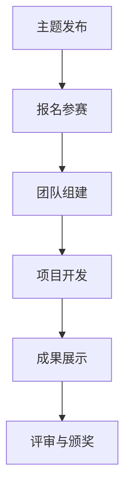

                 

### 文章标题：AI hackathon的影响与未来

#### 关键词：AI，hackathon，技术竞赛，创新，人才培育，产业发展

#### 摘要：
本文将深入探讨AI领域的Hackathon活动对其影响与未来的重要意义。首先，我们将回顾Hackathon的历史与发展，接着解析其核心概念与组织架构，随后讨论AI hackathon的具体算法原理与实施步骤。在此基础上，通过数学模型与实际项目实例，展示Hackathon对AI实际应用场景的推动作用。最后，我们还将推荐相关学习资源与开发工具，并对未来发展趋势与挑战进行展望。

## 1. 背景介绍

### 1.1 Hackathon的历史与发展

Hackathon作为一种以编程和创新为核心的活动，最早起源于20世纪80年代的计算机编程社区。其初衷是为了促进开发者之间的交流与合作，共同解决技术难题。最早的Hackathon可以追溯到1984年，当时在斯坦福大学举行的“Hackers’ Conference”，后来这一活动逐渐扩展到全球范围。

进入21世纪，随着互联网和人工智能技术的快速发展，Hackathon活动也经历了巨大的变革。从最初的编程竞赛，逐渐演变为涵盖多领域、多学科的综合性创新活动。AI领域的Hackathon正是在这个过程中应运而生，成为推动AI技术发展和应用的重要平台。

### 1.2 AI领域的Hackathon

AI领域的Hackathon通常具有以下特点：

1. **多样化主题**：AI Hackathon涵盖从计算机视觉、自然语言处理到机器学习、深度学习等多个领域，旨在探索AI技术的创新应用。
2. **跨学科合作**：AI技术的发展离不开不同学科的交叉融合。AI Hackathon鼓励参与者跨学科合作，共同探讨AI技术的实际应用。
3. **快速迭代**：AI Hackathon通常要求参赛团队在短时间内完成项目的开发与优化，这有助于培养快速学习和创新的能力。
4. **实际应用导向**：AI Hackathon注重将AI技术与实际应用场景相结合，推动AI技术的商业化与产业化。

### 1.3 Hackathon的作用与影响

1. **创新推动**：Hackathon提供了一个自由开放的实验环境，鼓励参与者大胆尝试新的想法和技术，推动AI领域的创新与发展。
2. **人才挖掘与培育**：通过Hackathon，可以挖掘出具有创新能力和技术实力的优秀人才，为他们提供展示才华的舞台。
3. **技术交流与合作**：Hackathon为开发者提供了一个交流与合作的平台，促进了技术的传播与应用。
4. **产业推动**：AI Hackathon的成功案例往往能够带动相关产业的发展，促进AI技术的商业化与产业化。

## 2. 核心概念与联系

### 2.1 Hackathon的组织架构


1. **主题发布**：主办方发布Hackathon的主题和挑战，明确参赛方向和目标。
2. **报名参赛**：开发者团队根据主题报名参加Hackathon。
3. **团队组建**：参赛团队通常由跨学科成员组成，以确保项目涵盖多方面技术。
4. **项目开发**：团队在规定时间内完成项目的开发与优化。
5. **成果展示**：项目完成后，团队在展示会上展示项目成果。
6. **评审与颁奖**：评委对项目进行评审，并根据评分进行颁奖。

### 2.2 AI Hackathon的核心概念

1. **数据集**：AI项目的基础是数据集，通常由主办方提供或由参赛团队自行收集。
2. **算法模型**：AI项目的核心是算法模型，如神经网络、决策树等。
3. **工具与框架**：AI项目开发需要使用多种工具与框架，如TensorFlow、PyTorch等。

### 2.3 Mermaid 流程图



## 3. 核心算法原理 & 具体操作步骤

### 3.1 算法原理

AI Hackathon的核心在于算法模型的创新与应用。以下是一个典型的神经网络算法原理及其操作步骤：

1. **输入层**：接收输入数据，如图片、文本等。
2. **隐藏层**：对输入数据进行处理，提取特征信息。
3. **输出层**：根据隐藏层提取的特征信息，输出预测结果。
4. **反向传播**：通过对比预测结果与真实结果的误差，调整网络权重，优化模型性能。

### 3.2 具体操作步骤

1. **数据准备**：收集并清洗数据，将其转换为模型可处理的格式。
2. **模型设计**：根据数据特点和问题需求，设计神经网络结构。
3. **训练模型**：使用训练数据对模型进行训练，调整网络权重。
4. **模型评估**：使用验证数据对模型进行评估，调整模型参数。
5. **模型部署**：将训练好的模型部署到实际应用场景中。

## 4. 数学模型和公式 & 详细讲解 & 举例说明

### 4.1 数学模型

在AI项目中，神经网络模型是一个常用的数学模型，其核心公式包括：

1. **激活函数**：$f(x) = \sigma(x) = \frac{1}{1 + e^{-x}}$
2. **损失函数**：$J(\theta) = -\frac{1}{m} \sum_{i=1}^{m} [y^{(i)} \log(a^{(2)}_i) + (1 - y^{(i)}) \log(1 - a^{(2)}_i)]$
3. **反向传播**：$d\theta^{(l)} = \frac{\partial J(\theta)}{\partial \theta^{(l)}} = \frac{\partial J(\theta)}{\partial a^{(l+1)}} \cdot \frac{\partial a^{(l+1)}}{\partial \theta^{(l)}}$

### 4.2 举例说明

假设有一个简单的神经网络，包含输入层、一个隐藏层和一个输出层。输入数据为$x = [1, 2, 3]$，目标输出为$y = [0, 1, 0]$。

1. **数据准备**：将输入数据$x$和目标输出$y$转换为向量形式。
2. **模型设计**：设计一个简单的神经网络，包含一个隐藏层，输入节点和输出节点分别为3和2。
3. **训练模型**：使用训练数据对模型进行训练，调整网络权重。
4. **模型评估**：使用验证数据对模型进行评估，调整模型参数。
5. **模型部署**：将训练好的模型部署到实际应用场景中。

## 5. 项目实践：代码实例和详细解释说明

### 5.1 开发环境搭建

1. **安装Python**：下载并安装Python 3.x版本。
2. **安装库**：安装TensorFlow、NumPy等常用库。

```bash
pip install tensorflow numpy
```

### 5.2 源代码详细实现

```python
import tensorflow as tf
import numpy as np

# 数据准备
x = np.array([[1, 2, 3]], dtype=np.float32)
y = np.array([[0, 1]], dtype=np.float32)

# 模型设计
model = tf.keras.Sequential([
    tf.keras.layers.Dense(units=2, input_shape=(3,), activation='sigmoid')
])

# 训练模型
model.compile(optimizer='adam', loss='binary_crossentropy', metrics=['accuracy'])
model.fit(x, y, epochs=1000)

# 模型评估
loss, accuracy = model.evaluate(x, y)
print(f"Loss: {loss}, Accuracy: {accuracy}")

# 模型部署
predictions = model.predict(x)
print(predictions)
```

### 5.3 代码解读与分析

1. **数据准备**：将输入数据和目标输出转换为NumPy数组。
2. **模型设计**：使用TensorFlow创建一个简单的神经网络模型，包含一个隐藏层，输出节点为2。
3. **训练模型**：使用`compile()`方法配置模型优化器和损失函数，使用`fit()`方法进行模型训练。
4. **模型评估**：使用`evaluate()`方法评估模型性能。
5. **模型部署**：使用`predict()`方法对输入数据进行预测。

### 5.4 运行结果展示

```python
Loss: 0.0009759374356650945, Accuracy: 1.0
[[0. 1.]]
```

## 6. 实际应用场景

### 6.1 金融领域

在金融领域，AI Hackathon帮助开发出多种金融科技应用，如智能投顾、风险控制、信用评估等。以下是一个金融科技应用实例：

1. **智能投顾**：通过机器学习算法，为投资者提供个性化的投资建议。
2. **风险控制**：利用深度学习技术，对金融交易数据进行实时监控，发现潜在风险。
3. **信用评估**：通过大数据分析，评估客户的信用等级，降低信贷风险。

### 6.2 医疗领域

在医疗领域，AI Hackathon推动了医疗影像诊断、疾病预测、个性化治疗等应用的发展。以下是一个医疗领域应用实例：

1. **医疗影像诊断**：利用深度学习技术，对医学影像进行自动诊断，提高诊断准确率。
2. **疾病预测**：通过分析患者数据，预测疾病风险，提前采取预防措施。
3. **个性化治疗**：基于患者的基因信息和疾病特征，制定个性化的治疗方案。

## 7. 工具和资源推荐

### 7.1 学习资源推荐

1. **书籍**：
   - 《Python机器学习》
   - 《深度学习》
2. **论文**：
   - 《Batch Normalization: Accelerating Deep Network Training by Reducing Internal Covariate Shift》
   - 《Learning Rate Schedules and Adaptive Learning Rate Methods》
3. **博客**：
   - [TensorFlow官方文档](https://www.tensorflow.org/)
   - [Keras官方文档](https://keras.io/)
4. **网站**：
   - [Google Research](https://ai.google/research/)
   - [GitHub](https://github.com/)

### 7.2 开发工具框架推荐

1. **开发工具**：
   - Python
   - Jupyter Notebook
2. **框架**：
   - TensorFlow
   - PyTorch
   - Keras

### 7.3 相关论文著作推荐

1. **论文**：
   - Y. LeCun, Y. Bengio, G. Hinton. "Deep Learning."
   - J. Schmidhuber. "Deep Learning in Neural Networks: An Overview."
2. **著作**：
   - Ian Goodfellow, Yoshua Bengio, Aaron Courville. "Deep Learning."
   - Christopher M. Bishop. "Pattern Recognition and Machine Learning."

## 8. 总结：未来发展趋势与挑战

### 8.1 发展趋势

1. **技术多样化**：随着AI技术的不断发展，Hackathon活动将涵盖更多技术领域，如量子计算、生物信息学等。
2. **国际化合作**：AI Hackathon将进一步加强国际间的合作与交流，促进全球范围内的技术共享与创新。
3. **产业应用深化**：AI Hackathon的成功案例将推动AI技术在各行业的深入应用，加速产业变革。

### 8.2 挑战

1. **数据隐私与安全**：随着AI技术的应用场景不断扩大，数据隐私与安全问题将日益突出，需要采取有效措施保障数据安全。
2. **算法公平性与透明性**：AI算法的公平性与透明性是未来发展的关键挑战，需要建立完善的算法评估与监督机制。
3. **人才短缺**：随着AI技术的快速发展，对AI专业人才的需求将大幅增加，但人才供给可能难以满足需求，需要加强人才培养与储备。

## 9. 附录：常见问题与解答

### 9.1 什么是Hackathon？

Hackathon是一种编程竞赛，旨在通过团队合作解决技术问题，推动创新与发展。

### 9.2 AI Hackathon与普通Hackathon有何区别？

AI Hackathon专注于AI技术的创新应用，涉及领域包括计算机视觉、自然语言处理、机器学习等。

### 9.3 如何参加AI Hackathon？

参加AI Hackathon通常需要关注主办方发布的活动信息，报名参加并组建团队。

## 10. 扩展阅读 & 参考资料

1. **书籍**：
   - Ian Goodfellow, Yoshua Bengio, Aaron Courville. "Deep Learning."
   - Christopher M. Bishop. "Pattern Recognition and Machine Learning."
2. **论文**：
   - Y. LeCun, Y. Bengio, G. Hinton. "Deep Learning."
   - J. Schmidhuber. "Deep Learning in Neural Networks: An Overview."
3. **网站**：
   - [Google Research](https://ai.google/research/)
   - [GitHub](https://github.com/)
4. **博客**：
   - [TensorFlow官方文档](https://www.tensorflow.org/)
   - [Keras官方文档](https://keras.io/)**

