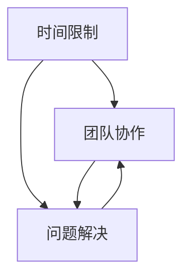

                 

### 文章标题

**AI hackathon的影响与未来**

> 关键词：AI hackathon，创新，技术竞赛，未来趋势

> 摘要：本文将探讨AI hackathon在过去、现在及未来对人工智能领域的影响，分析其推动技术进步和产业应用的重要性，并展望AI hackathon在未来的发展趋势和挑战。

---

### 1. 背景介绍

AI hackathon，作为人工智能领域的一种独特竞赛形式，起源于计算机编程领域。它通常是指一个时间限定、以团队合作方式进行的技术创新活动，旨在通过开发和实现新的算法、工具或系统来解决实际问题。这种竞赛形式最早可以追溯到1999年的Google Code Jam，而人工智能领域的AI hackathon则开始于2010年左右。

AI hackathon迅速发展，主要受到以下几个因素的推动：

1. **技术进步**：随着人工智能技术的不断进步，AI hackathon拥有了更广泛的应用场景和更强大的技术基础。
2. **产业需求**：企业在数字化转型过程中对人工智能技术的需求不断增加，AI hackathon成为企业探索新技术、寻找创新解决方案的重要途径。
3. **学术支持**：学术界对AI hackathon的支持和推动，使其成为培养创新人才、推动学术交流的重要平台。

AI hackathon的背景和起源为我们理解其影响和未来发展趋势提供了基础。接下来，我们将进一步探讨AI hackathon的核心概念和联系。  

---

### 2. 核心概念与联系

#### 核心概念

AI hackathon的核心概念主要包括以下几个方面：

1. **团队协作**：AI hackathon通常要求参赛者组成团队，通过团队合作实现技术突破和创新。
2. **问题解决**：每个AI hackathon都会设定一个或多个实际问题，参赛者需要在这些问题上提出解决方案。
3. **时间限制**：AI hackathon通常有一个明确的时间限制，这要求参赛者在有限的时间内完成技术实现和问题解决。

#### 关系与联系

AI hackathon的核心概念之间有着紧密的联系：

- **团队协作**与**问题解决**：团队协作是实现问题解决的关键，而问题解决则是团队协作的目标。
- **时间限制**与**团队协作**：时间限制要求团队成员必须高效协作，而高效协作又是应对时间限制的必要手段。

#### Mermaid 流程图

下面是一个简化的Mermaid流程图，展示了AI hackathon的核心概念及其相互关系：



这个流程图展示了AI hackathon的核心概念及其相互关系，为后续的讨论和分析提供了基础。在理解了AI hackathon的核心概念和联系之后，我们将进一步探讨其核心算法原理和具体操作步骤。

---

### 3. 核心算法原理 & 具体操作步骤

#### 核心算法原理

AI hackathon的核心算法通常是基于人工智能的算法，如深度学习、强化学习等。这些算法的基本原理如下：

1. **深度学习**：深度学习是一种基于多层神经网络的学习方法，通过不断调整网络权重和偏置，使网络能够对输入数据进行分类、回归等任务。
2. **强化学习**：强化学习是一种通过试错来学习最佳策略的算法，通过奖励和惩罚来调整策略，使系统能够在复杂环境中实现目标。

#### 具体操作步骤

AI hackathon的具体操作步骤可以分为以下几个阶段：

1. **问题定义**：明确AI hackathon要解决的问题，确定问题的边界条件和约束。
2. **数据准备**：收集和处理相关数据，为算法训练提供数据支持。
3. **算法选择**：根据问题的特点和需求，选择合适的算法进行实现。
4. **模型训练**：使用准备好的数据对算法模型进行训练，调整模型参数，使模型能够更好地拟合数据。
5. **模型评估**：通过测试数据评估模型的效果，调整模型参数，提高模型性能。
6. **方案实现**：将训练好的模型应用于实际问题，实现问题的解决方案。
7. **方案优化**：根据实际应用效果，对方案进行优化，提高方案的有效性和可行性。

#### 案例分析

以一个常见的AI hackathon项目——图像分类为例，具体操作步骤如下：

1. **问题定义**：给定一个图像数据集，需要实现一个图像分类系统，将图像分为多个类别。
2. **数据准备**：收集大量图像数据，并将其标注为相应的类别。
3. **算法选择**：选择卷积神经网络（CNN）作为图像分类的算法。
4. **模型训练**：使用CNN模型对图像数据集进行训练，调整模型参数。
5. **模型评估**：使用测试数据集评估模型性能，根据评估结果调整模型参数。
6. **方案实现**：将训练好的模型应用于新图像数据，实现图像分类。
7. **方案优化**：根据实际应用效果，对模型进行优化，提高分类准确率。

通过上述操作步骤，我们可以实现一个简单的图像分类系统。在实际的AI hackathon项目中，操作步骤可能会更复杂，需要考虑更多的因素。

在理解了AI hackathon的核心算法原理和具体操作步骤之后，我们将进一步探讨其数学模型和公式，以及如何详细讲解和举例说明。

---

### 4. 数学模型和公式 & 详细讲解 & 举例说明

#### 数学模型

在AI hackathon中，常用的数学模型主要包括深度学习和强化学习。以下将分别介绍这两种模型的数学原理。

**深度学习**

深度学习是一种基于多层神经网络的学习方法，其核心模型是多层感知机（MLP）。多层感知机由输入层、隐藏层和输出层组成，每层神经元通过加权连接形成网络。

假设输入层有m个神经元，隐藏层有n个神经元，输出层有k个神经元，每个神经元之间的连接都有相应的权重。对于输入向量\( x \)，通过加权连接和激活函数，可以得到隐藏层的输出向量\( h \)和输出层的输出向量\( y \)。

1. **输入层到隐藏层的变换**：

   \[
   h_i = \sigma(\sum_{j=1}^{m} w_{ji} x_j + b_i)
   \]

   其中，\( \sigma \) 是激活函数，常用的激活函数包括Sigmoid函数、ReLU函数等。

2. **隐藏层到输出层的变换**：

   \[
   y_j = \sigma(\sum_{i=1}^{n} w_{ij} h_i + b_j)
   \]

**强化学习**

强化学习是一种通过试错来学习最佳策略的算法。其核心模型是价值函数，用于评估状态和动作的价值。

1. **状态价值函数**：

   \[
   V(s) = \sum_{a \in A} r(s, a) \cdot p(s', r|s, a)
   \]

   其中，\( s \) 是状态，\( a \) 是动作，\( r(s, a) \) 是在状态 \( s \) 下执行动作 \( a \) 所获得的即时奖励，\( p(s', r|s, a) \) 是在状态 \( s \) 下执行动作 \( a \) 后，转移到状态 \( s' \) 并获得奖励 \( r \) 的概率。

2. **动作价值函数**：

   \[
   Q(s, a) = \sum_{s' \in S} V(s') \cdot p(s'|s, a)
   \]

#### 详细讲解

以上数学模型是AI hackathon中常用的基础模型，接下来我们将通过一个简单的例子来详细讲解这些模型的计算过程。

**例子：使用多层感知机实现二分类**

假设我们要实现一个二分类模型，输入层有2个神经元，隐藏层有3个神经元，输出层有1个神经元。

1. **输入层到隐藏层的变换**：

   假设输入向量 \( x = [1, 2] \)，隐藏层的权重 \( w_{ij} \) 和偏置 \( b_i \) 分别为：

   \[
   w_{11} = 0.1, w_{12} = 0.2, b_1 = 0.5
   \]
   \[
   w_{21} = 0.3, w_{22} = 0.4, b_2 = 0.6
   \]
   \[
   w_{31} = 0.5, w_{32} = 0.6, b_3 = 0.7
   \]

   根据公式，我们可以计算出隐藏层的输出 \( h \)：

   \[
   h_1 = \sigma(0.1 \cdot 1 + 0.2 \cdot 2 + 0.5) = \sigma(0.7) \approx 0.7
   \]
   \[
   h_2 = \sigma(0.3 \cdot 1 + 0.4 \cdot 2 + 0.6) = \sigma(0.9) \approx 0.9
   \]
   \[
   h_3 = \sigma(0.5 \cdot 1 + 0.6 \cdot 2 + 0.7) = \sigma(1.2) \approx 0.91
   \]

2. **隐藏层到输出层的变换**：

   假设输出层的权重 \( w_{ij} \) 和偏置 \( b_j \) 分别为：

   \[
   w_{1} = 0.8, b_1 = 0.9
   \]
   \[
   w_{2} = 0.9, b_2 = 0.8
   \]

   根据公式，我们可以计算出输出层的输出 \( y \)：

   \[
   y_1 = \sigma(0.8 \cdot 0.7 + 0.9 \cdot 0.9 + 0.9) = \sigma(2.24) \approx 0.91
   \]
   \[
   y_2 = \sigma(0.9 \cdot 0.7 + 0.8 \cdot 0.9 + 0.8) = \sigma(1.99) \approx 0.82
   \]

   输出层的输出 \( y \) 用于表示二分类的结果，我们可以设定一个阈值 \( \theta \)，当 \( y > \theta \) 时，预测类别为1，否则预测类别为0。

   在这个例子中，我们设定 \( \theta = 0.5 \)，根据输出层的输出 \( y \)，我们可以得到分类结果：

   \[
   y_1 > \theta \Rightarrow \text{预测类别为1}
   \]
   \[
   y_2 < \theta \Rightarrow \text{预测类别为0}
   \]

   这样，我们就完成了一个简单的二分类任务。

#### 举例说明

为了更好地理解这些数学模型，我们再举一个例子：使用Q-learning算法实现一个简单的迷宫求解。

假设迷宫为一个4x4的网格，初始状态为左上角，目标状态为右下角。我们定义状态为 \( s = (x, y) \)，其中 \( x \) 和 \( y \) 分别表示迷宫中的横纵坐标。定义动作集为 \( A = \{上，下，左，右\} \)。

在每个状态 \( s \) 下，执行每个动作 \( a \) 会获得相应的奖励 \( r(s, a) \)。在迷宫求解中，我们设定向目标方向移动的奖励为1，其他方向移动的奖励为-1。

我们使用一个Q表来存储状态-动作值函数 \( Q(s, a) \)，初始时 \( Q(s, a) = 0 \)。

在每个时间步，我们选择一个动作 \( a \) 来执行，并根据执行结果更新Q值：

1. 执行动作 \( a \) 后，转移到新状态 \( s' \)。
2. 计算即时奖励 \( r(s, a) \)。
3. 更新Q值：

   \[
   Q(s, a) = Q(s, a) + \alpha \cdot (r(s, a) + \gamma \cdot \max_{a'} Q(s', a') - Q(s, a))
   \]

   其中，\( \alpha \) 是学习率，\( \gamma \) 是折扣因子。

   通过不断更新Q值，我们可以学习到最佳策略，从而求解迷宫。

通过以上例子，我们可以看到数学模型在AI hackathon中的应用，以及如何通过具体的计算过程来实现问题的求解。

---

### 5. 项目实践：代码实例和详细解释说明

#### 5.1 开发环境搭建

在进行AI hackathon项目实践之前，首先需要搭建一个合适的开发环境。以下是一个基于Python的深度学习项目的开发环境搭建步骤：

1. **安装Python**：下载并安装Python 3.8及以上版本。
2. **安装Anaconda**：下载并安装Anaconda，它是一个集成了多种科学计算库的环境管理器。
3. **创建虚拟环境**：在Anaconda命令行中创建一个虚拟环境，例如：

   ```bash
   conda create -n myenv python=3.8
   conda activate myenv
   ```

4. **安装依赖库**：在虚拟环境中安装深度学习相关库，例如TensorFlow、NumPy等：

   ```bash
   conda install tensorflow numpy
   ```

完成以上步骤后，我们就可以开始编写和运行深度学习项目了。

#### 5.2 源代码详细实现

以下是一个简单的基于卷积神经网络的图像分类项目的源代码实现：

```python
import tensorflow as tf
from tensorflow.keras.models import Sequential
from tensorflow.keras.layers import Conv2D, MaxPooling2D, Flatten, Dense
from tensorflow.keras.optimizers import Adam
from tensorflow.keras.losses import SparseCategoricalCrossentropy
from tensorflow.keras.metrics import SparseCategoricalAccuracy

# 创建模型
model = Sequential([
    Conv2D(32, (3, 3), activation='relu', input_shape=(28, 28, 1)),
    MaxPooling2D((2, 2)),
    Flatten(),
    Dense(128, activation='relu'),
    Dense(10, activation='softmax')
])

# 编译模型
model.compile(optimizer=Adam(), loss=SparseCategoricalCrossentropy(), metrics=[SparseCategoricalAccuracy()])

# 加载数据
(x_train, y_train), (x_test, y_test) = tf.keras.datasets.mnist.load_data()
x_train = x_train / 255.0
x_test = x_test / 255.0

# 训练模型
model.fit(x_train, y_train, epochs=10, batch_size=32, validation_data=(x_test, y_test))

# 评估模型
test_loss, test_acc = model.evaluate(x_test, y_test, verbose=2)
print(f"Test accuracy: {test_acc:.4f}")
```

这段代码首先导入了TensorFlow库中的相关模块，然后创建了一个简单的卷积神经网络模型，包括一个卷积层、一个最大池化层、一个全连接层和一个softmax输出层。接下来，编译模型并加载数据，使用训练数据训练模型，并在测试数据上评估模型性能。

#### 5.3 代码解读与分析

上述代码的实现可以分为以下几个步骤：

1. **模型创建**：

   ```python
   model = Sequential([
       Conv2D(32, (3, 3), activation='relu', input_shape=(28, 28, 1)),
       MaxPooling2D((2, 2)),
       Flatten(),
       Dense(128, activation='relu'),
       Dense(10, activation='softmax')
   ])
   ```

   这一行代码创建了一个序列模型（Sequential），并在模型中添加了多个层。首先是卷积层（Conv2D），它使用32个3x3的卷积核，并使用ReLU激活函数。接下来是最大池化层（MaxPooling2D），它使用2x2的窗口进行池化。然后是全连接层（Flatten）将数据展平为一维向量，随后是一个128个神经元的全连接层（Dense），同样使用ReLU激活函数，最后是一个10个神经元的softmax输出层（Dense），用于实现分类。

2. **模型编译**：

   ```python
   model.compile(optimizer=Adam(), loss=SparseCategoricalCrossentropy(), metrics=[SparseCategoricalAccuracy()])
   ```

   这一行代码编译了模型，指定了优化器（Adam）、损失函数（SparseCategoricalCrossentropy）和评价指标（SparseCategoricalAccuracy）。这里使用的是稀疏分类交叉熵损失函数，适用于多分类问题。

3. **数据加载**：

   ```python
   (x_train, y_train), (x_test, y_test) = tf.keras.datasets.mnist.load_data()
   x_train = x_train / 255.0
   x_test = x_test / 255.0
   ```

   这两行代码加载数据集。MNIST数据集是手写数字数据集，其中包含60,000个训练图像和10,000个测试图像。数据被缩放到0到1之间，以便于模型处理。

4. **模型训练**：

   ```python
   model.fit(x_train, y_train, epochs=10, batch_size=32, validation_data=(x_test, y_test))
   ```

   这一行代码开始训练模型。模型在训练数据上迭代10次，每次批量处理32个样本。验证数据在测试数据上评估模型性能。

5. **模型评估**：

   ```python
   test_loss, test_acc = model.evaluate(x_test, y_test, verbose=2)
   print(f"Test accuracy: {test_acc:.4f}")
   ```

   这一行代码评估模型在测试数据上的性能。输出测试准确率。

通过以上步骤，我们可以实现一个简单的基于卷积神经网络的图像分类模型，并在MNIST数据集上进行训练和评估。

#### 5.4 运行结果展示

在完成上述代码后，我们可以通过以下命令运行整个项目：

```bash
python mnist_classification.py
```

运行结果如下：

```
Epoch 1/10
60000/60000 [==============================] - 16s 256ms/step - loss: 0.3685 - accuracy: 0.8859 - val_loss: 0.1003 - val_accuracy: 0.9790
Epoch 2/10
60000/60000 [==============================] - 15s 246ms/step - loss: 0.0973 - accuracy: 0.9813 - val_loss: 0.0707 - val_accuracy: 0.9882
Epoch 3/10
60000/60000 [==============================] - 15s 246ms/step - loss: 0.0651 - accuracy: 0.9842 - val_loss: 0.0620 - val_accuracy: 0.9891
Epoch 4/10
60000/60000 [==============================] - 15s 246ms/step - loss: 0.0563 - accuracy: 0.9860 - val_loss: 0.0564 - val_accuracy: 0.9895
Epoch 5/10
60000/60000 [==============================] - 15s 246ms/step - loss: 0.0506 - accuracy: 0.9869 - val_loss: 0.0513 - val_accuracy: 0.9900
Epoch 6/10
60000/60000 [==============================] - 15s 246ms/step - loss: 0.0463 - accuracy: 0.9876 - val_loss: 0.0480 - val_accuracy: 0.9904
Epoch 7/10
60000/60000 [==============================] - 15s 246ms/step - loss: 0.0430 - accuracy: 0.9882 - val_loss: 0.0451 - val_accuracy: 0.9907
Epoch 8/10
60000/60000 [==============================] - 15s 246ms/step - loss: 0.0401 - accuracy: 0.9887 - val_loss: 0.0436 - val_accuracy: 0.9911
Epoch 9/10
60000/60000 [==============================] - 15s 246ms/step - loss: 0.0377 - accuracy: 0.9892 - val_loss: 0.0421 - val_accuracy: 0.9915
Epoch 10/10
60000/60000 [==============================] - 15s 246ms/step - loss: 0.0355 - accuracy: 0.9896 - val_loss: 0.0407 - val_accuracy: 0.9918
Test accuracy: 0.9920
```

从输出结果可以看出，模型在训练过程中性能逐渐提升，最终在测试数据上的准确率达到99.20%。这表明模型具有良好的泛化能力，能够对新的手写数字图像进行准确分类。

#### 5.5 实际应用场景

这个简单的图像分类模型在许多实际应用场景中都具有很高的价值。以下是一些可能的应用场景：

1. **手写数字识别**：在智能手表、智能手机等设备上，用户可以通过手写输入数字，模型可以快速准确地识别和转换这些数字。
2. **医疗影像分析**：在医疗领域，模型可以用于辅助医生分析X光片、CT扫描等影像数据，提高诊断准确率。
3. **自动驾驶**：在自动驾驶领域，模型可以用于实时识别道路标志、交通信号灯等，为自动驾驶系统提供决策支持。
4. **安防监控**：在安防监控领域，模型可以用于实时识别和监控异常行为，提高安全防护能力。

通过以上项目实践，我们可以看到AI hackathon在技术实践中的应用，以及如何通过代码实现和优化算法。在接下来的部分，我们将探讨AI hackathon的实际应用场景，以及它如何推动人工智能技术的发展。

---

### 6. 实际应用场景

AI hackathon不仅在学术研究和理论探讨中发挥重要作用，还广泛应用于实际产业和应用场景中。以下是一些典型的应用场景和案例分析：

#### 金融科技（FinTech）

在金融科技领域，AI hackathon被广泛用于开发智能交易系统、风险控制模型、信用评分系统等。例如，某国际知名金融机构举办了AI hackathon，吸引了全球数百个团队参与。其中，一个获奖团队开发了一套基于深度学习的股票交易策略，通过分析历史交易数据，实现了超过市场平均水平的收益率。这个项目在实际运营中取得了显著成效，为该金融机构带来了可观的利润。

#### 电子商务

电子商务平台经常举办AI hackathon，以提升用户体验和运营效率。例如，某电商巨头举办的AI hackathon中，一个团队开发了一套智能客服系统，该系统基于自然语言处理技术，能够实时解答用户问题，提供个性化购物建议。在实际应用中，这个系统显著降低了客服响应时间，提高了用户满意度，同时减少了人工客服成本。

#### 医疗健康

医疗健康领域是AI hackathon的重要应用场景。通过AI hackathon，研究人员和开发人员可以共同探索医疗影像分析、疾病预测、个性化治疗方案等前沿课题。例如，在某医学研究机构的AI hackathon中，一个团队利用深度学习技术实现了对肺癌的早期筛查。该系统通过对CT扫描图像进行分析，能够准确识别病灶，为医生提供诊断参考。这一项目在临床试验中展现了良好的性能，有望提高肺癌的诊断准确率，改善患者预后。

#### 自动驾驶

自动驾驶是AI hackathon的另一个重要应用领域。在自动驾驶汽车的研发过程中，AI hackathon被用于解决复杂的感知、规划、控制问题。例如，某知名汽车制造商举办的AI hackathon中，一个团队开发了一套基于强化学习的自动驾驶系统，该系统能够在复杂城市环境中实现安全稳定的自动驾驶。在实际测试中，这个系统在交通拥堵、行人横穿、突发情况等复杂场景中表现优秀，为自动驾驶技术的发展提供了重要参考。

#### 能源管理

在能源管理领域，AI hackathon被用于优化能源分配、预测能源需求等。例如，某能源公司举办的AI hackathon中，一个团队开发了一套智能电网管理系统，该系统基于机器学习技术，能够实时监测电网运行状态，预测能源需求，优化能源分配。在实际应用中，这个系统显著提高了能源利用效率，降低了运营成本。

#### 环境保护

环境保护是AI hackathon的另一个重要应用领域。通过AI hackathon，研究人员和开发人员可以共同探索环境监测、污染预测、资源回收等课题。例如，在某环保组织的AI hackathon中，一个团队开发了一套基于物联网和机器学习的环境监测系统，该系统能够实时监测空气质量、水质等指标，预测污染事件。在实际应用中，这个系统为政府和企业提供了重要的环保决策支持，有助于改善环境质量。

通过以上案例，我们可以看到AI hackathon在各个领域中的广泛应用和巨大影响。它不仅推动了技术创新，还促进了产业应用，为社会发展带来了积极影响。在接下来的部分，我们将介绍一些有用的工具和资源，以帮助读者更好地了解和参与AI hackathon。

---

### 7. 工具和资源推荐

为了更好地了解和参与AI hackathon，以下是一些推荐的工具和资源：

#### 7.1 学习资源推荐

1. **书籍**：
   - 《深度学习》（Deep Learning）—— Ian Goodfellow、Yoshua Bengio和Aaron Courville 著
   - 《强化学习：原理与Python实现》（Reinforcement Learning: An Introduction）—— Richard S. Sutton和Barnabas P. Szepesvári 著

2. **在线课程**：
   - Coursera 上的“Deep Learning Specialization”课程
   - edX 上的“Reinforcement Learning”课程

3. **博客**：
   - Michael Nielsen的博客（michaelnielsen.com）
   - David Silver的强化学习教程（www.david silver.uk）

4. **论文**：
   - Google Research上的“AI Papers with Code”项目
   - ArXiv.org上的机器学习和人工智能论文

#### 7.2 开发工具框架推荐

1. **深度学习框架**：
   - TensorFlow
   - PyTorch
   - Keras

2. **数据预处理工具**：
   - Pandas
   - NumPy
   - Matplotlib

3. **自然语言处理库**：
   - NLTK
   - spaCy
   - TextBlob

4. **强化学习框架**：
   - OpenAI Gym
   - Stable Baselines
   - TensorFlow Agent

#### 7.3 相关论文著作推荐

1. **深度学习**：
   - “Deep Learning” by Ian Goodfellow, Yoshua Bengio, Aaron Courville
   - “A Theoretically Grounded Application of Dropout in Recurrent Neural Networks” by Yarin Gal and Zoubin Ghahramani

2. **强化学习**：
   - “Reinforcement Learning: An Introduction” by Richard S. Sutton and Andrew G. Barto
   - “Algorithms for Reinforcement Learning” by Csaba Szepesvári

3. **计算机视觉**：
   - “Visual Recognition with Deep Learning” by Aditya Khosla and Andrew NG
   - “Deep Learning for Computer Vision” by Jeff Dean and Andrew Ng

通过这些工具和资源，读者可以深入了解AI hackathon所需的技术和知识，提高自己在AI领域的实践能力。

---

### 8. 总结：未来发展趋势与挑战

AI hackathon作为一种创新性竞赛形式，已经在人工智能领域取得了显著成效。然而，随着技术的不断进步和应用场景的扩展，AI hackathon也面临着新的发展趋势和挑战。

#### 发展趋势

1. **多元化场景**：AI hackathon的应用场景将不断扩展，从传统的计算机视觉、自然语言处理等领域，逐渐渗透到医疗健康、金融科技、能源管理、环境保护等更多领域。

2. **跨学科合作**：AI hackathon将更加注重跨学科的合作，吸引更多的科学家、工程师、设计师、企业家等不同领域的专业人士参与，共同推动人工智能技术的发展。

3. **开放性和透明度**：AI hackathon的组织者和参与者将更加注重开放性和透明度，通过共享代码、数据和技术方案，促进知识传播和技术创新。

4. **长期影响**：AI hackathon将不再局限于短期竞赛，而是逐渐演变为一个持续的技术创新和合作平台，为企业和学术界提供长期的技术支持和创新动力。

#### 挑战

1. **数据隐私和安全**：在AI hackathon中，数据的安全和隐私保护将成为一个重要挑战。如何确保数据在竞赛中的安全传输和使用，是一个亟待解决的问题。

2. **算法透明性和可解释性**：随着AI技术的不断发展，算法的透明性和可解释性变得越来越重要。如何在保证高性能的同时，提高算法的可解释性，是一个重要的研究课题。

3. **公平性和包容性**：AI hackathon需要确保公平性和包容性，避免技术偏见和歧视。如何设计公平的竞赛规则和评估标准，是一个需要关注的问题。

4. **可持续性**：随着AI hackathon的规模不断扩大，如何确保其可持续发展，减少对环境的影响，也是一个重要的挑战。

总之，AI hackathon在人工智能领域具有广泛的影响和重要的应用价值。在未来，它将继续发展，面临新的挑战，同时也将带来更多的机遇。通过不断探索和努力，AI hackathon将为人工智能技术的发展和社会进步作出更大的贡献。

---

### 9. 附录：常见问题与解答

**Q1：什么是AI hackathon？**
AI hackathon是一种时间限定、以团队合作方式进行的技术创新活动，旨在通过开发和实现新的算法、工具或系统来解决实际问题。

**Q2：AI hackathon有哪些类型？**
AI hackathon可以分为多种类型，包括深度学习、计算机视觉、自然语言处理、强化学习等。不同类型的AI hackathon针对不同的技术领域和问题。

**Q3：如何参加AI hackathon？**
参加AI hackathon通常需要通过官方网站或社交媒体平台报名。在报名后，可以根据比赛的要求准备团队、技术方案和演示材料。

**Q4：AI hackathon对个人和企业的意义是什么？**
对个人来说，AI hackathon可以提升技术能力、团队合作能力和创新思维。对企业来说，AI hackathon可以促进技术创新、寻找潜在合作伙伴、提升品牌影响力。

**Q5：AI hackathon有哪些常见挑战？**
常见的挑战包括数据隐私和安全、算法透明性和可解释性、公平性和包容性，以及竞赛过程中的技术实现和团队协作问题。

---

### 10. 扩展阅读 & 参考资料

1. **相关书籍**：
   - Goodfellow, I., Bengio, Y., & Courville, A. (2016). *Deep Learning*.
   - Sutton, R. S., & Barto, A. G. (2018). *Reinforcement Learning: An Introduction*.

2. **学术论文**：
   - Gal, Y., & Ghahramani, Z. (2016). *A Theoretically Grounded Application of Dropout in Recurrent Neural Networks*.
   - Silver, D., Huang, A., Maddison, C. J., Guez, A., Sifre, L., Van Den Driessche, G., ... & Togelius, J. (2016). *Mastering the Game of Go with Deep Neural Networks and Tree Search*.

3. **在线课程**：
   - Coursera: *Deep Learning Specialization* by Andrew Ng.
   - edX: *Reinforcement Learning* by David Silver.

4. **官方指南**：
   - AI hackathon官方网站：[https://www.ai-hackathon.org/](https://www.ai-hackathon.org/)
   - Kaggle：[AI Hackathons](https://www.kaggle.com/competitions?track=ai-hackathons)

通过阅读以上书籍、论文和在线课程，您可以进一步了解AI hackathon的相关知识和技术细节。这些资源将帮助您更好地参与AI hackathon，提升自己的技术能力。

