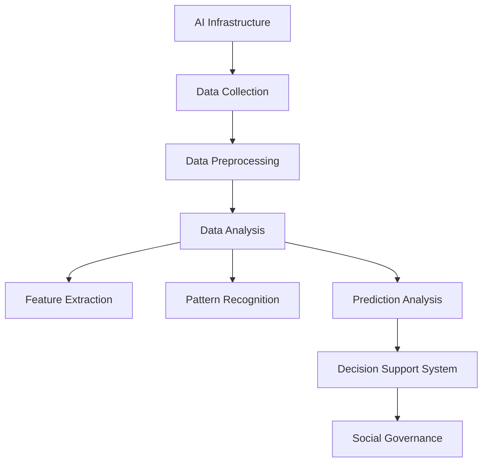

                 

### 文章标题

**AI 基础设施的社会治理：数据驱动的决策支持系统**

> **关键词**：人工智能、基础设施治理、数据驱动、决策支持、社会治理

> **摘要**：本文旨在探讨人工智能基础设施在社会治理中的应用，强调数据驱动决策支持系统的构建。通过分析AI基础设施的背景、核心概念、算法原理、数学模型、项目实践、应用场景、工具和资源，我们揭示了AI基础设施在社会治理中的重要性和未来发展挑战。

### 1. 背景介绍

在当今信息时代，人工智能（AI）已经逐渐成为社会发展的重要驱动力。随着大数据、云计算、物联网等技术的迅猛发展，AI在各个领域的应用日益广泛，从金融、医疗、交通到教育、娱乐等，AI正在深刻改变我们的生活方式和社会结构。然而，随着AI技术的普及和应用，AI基础设施的建设和治理也变得愈发重要。

AI基础设施是指支持AI应用所需的各种硬件和软件资源，包括计算资源、存储资源、网络资源、数据资源等。AI基础设施的建设不仅要满足当前的需求，还需要具备一定的前瞻性和扩展性，以应对未来技术的发展和业务的变化。然而，AI基础设施的建设和管理面临着诸多挑战，如数据安全、隐私保护、资源分配、系统可靠性等。

社会治理是指政府、社会组织、企业等各类主体在共同治理社会事务的过程中，通过制定和实施一系列政策、法规和制度，维护社会秩序、促进社会公平、保障公众权益的过程。随着社会的发展和进步，社会治理的复杂性和难度也在不断增加。如何利用AI技术提升社会治理的效率和质量，成为当前亟待解决的问题。

数据驱动是指以数据为核心，通过收集、分析、利用数据，指导决策和行动的过程。在AI基础设施的建设和管理中，数据驱动方法具有重要意义。通过数据分析和挖掘，可以识别出基础设施运行中的问题和瓶颈，为决策提供有力支持。同时，数据驱动方法还可以帮助优化资源配置、提升系统性能、降低运维成本。

决策支持系统（DSS）是一种辅助决策者进行决策的计算机化系统。在AI基础设施的社会治理中，DSS可以提供实时、准确、全面的数据分析结果，帮助决策者快速做出明智的决策。DSS的核心是数据分析和挖掘技术，包括数据预处理、特征提取、模式识别、预测分析等。

本文旨在探讨AI基础设施在社会治理中的应用，特别是数据驱动的决策支持系统的构建。通过分析AI基础设施的背景、核心概念、算法原理、数学模型、项目实践、应用场景、工具和资源，我们旨在为AI基础设施的社会治理提供一些有益的思路和实践指导。### 2. 核心概念与联系

#### 2.1 AI基础设施

AI基础设施是指支持人工智能应用所需的各种硬件和软件资源。这些资源包括：

- **计算资源**：高性能计算集群、GPU、TPU等硬件设备。
- **存储资源**：分布式存储系统、云存储服务等。
- **网络资源**：高速网络、数据中心等。
- **数据资源**：大规模数据集、数据仓库、数据湖等。

#### 2.2 社会治理

社会治理是指政府、社会组织、企业等各类主体在共同治理社会事务的过程中，通过制定和实施一系列政策、法规和制度，维护社会秩序、促进社会公平、保障公众权益的过程。

#### 2.3 数据驱动

数据驱动是指以数据为核心，通过收集、分析、利用数据，指导决策和行动的过程。数据驱动的核心是数据分析和挖掘，包括数据预处理、特征提取、模式识别、预测分析等。

#### 2.4 决策支持系统

决策支持系统（DSS）是一种辅助决策者进行决策的计算机化系统。DSS的核心是数据分析和挖掘技术，通过提供实时、准确、全面的数据分析结果，帮助决策者快速做出明智的决策。

#### 2.5 核心概念原理与架构

以下是一个用Mermaid绘制的AI基础设施与社会治理的数据驱动决策支持系统的流程图：



#### 2.6 数据驱动决策支持系统的工作原理

1. **数据采集**：从各种数据源（如数据库、传感器、互联网等）收集数据。
2. **数据预处理**：清洗、整合、标准化数据，使其适合分析和挖掘。
3. **数据分析**：利用统计分析、机器学习等方法，对预处理后的数据进行分析。
4. **特征提取**：从分析结果中提取关键特征，用于后续的决策支持。
5. **模式识别**：根据提取的特征，识别出数据中的规律和模式。
6. **预测分析**：利用已识别的模式和特征，对未来趋势进行预测。
7. **决策支持**：将预测结果呈现给决策者，辅助其做出明智的决策。
8. **社会治理**：决策者根据决策支持系统的建议，实施相应的社会治理措施。

通过数据驱动的决策支持系统，AI基础设施能够更好地服务于社会治理，提升社会治理的效率和质量。

### 3. 核心算法原理 & 具体操作步骤

#### 3.1 数据采集

数据采集是数据驱动决策支持系统的第一步，其关键在于从各种数据源收集到有价值的数据。具体操作步骤如下：

1. **确定数据需求**：根据决策支持系统的目标和需求，确定需要采集的数据类型和范围。
2. **选择数据源**：根据数据需求，选择合适的数据源，如数据库、传感器、互联网等。
3. **数据采集**：利用爬虫、API接口、数据采集工具等方法，从数据源中采集数据。
4. **数据存储**：将采集到的数据存储到合适的存储系统中，如数据仓库、数据湖等。

#### 3.2 数据预处理

数据预处理是数据驱动决策支持系统的关键环节，其目的是清洗、整合、标准化数据，使其适合分析和挖掘。具体操作步骤如下：

1. **数据清洗**：删除重复数据、缺失数据，处理异常数据。
2. **数据整合**：将来自不同数据源的数据进行整合，形成统一的数据视图。
3. **数据标准化**：对数据进行格式统一、数值转换等处理，使其满足分析和挖掘的要求。
4. **数据质量评估**：评估数据的质量，如完整性、一致性、准确性等。

#### 3.3 数据分析

数据分析是数据驱动决策支持系统的核心环节，其目的是从数据中提取有价值的信息和知识。具体操作步骤如下：

1. **统计分析**：利用统计分析方法，如描述性统计分析、推断性统计分析等，对数据进行分析。
2. **机器学习**：利用机器学习方法，如回归分析、分类、聚类等，对数据进行分析。
3. **数据可视化**：利用数据可视化技术，将分析结果以图表、地图等形式呈现，便于理解和决策。
4. **数据挖掘**：利用数据挖掘方法，如关联规则挖掘、异常检测、预测建模等，对数据进行分析。

#### 3.4 特征提取

特征提取是数据分析的重要步骤，其目的是从分析结果中提取关键特征，用于后续的决策支持。具体操作步骤如下：

1. **特征选择**：根据业务需求和数据分析结果，选择合适的特征。
2. **特征转换**：对特征进行转换，如归一化、标准化、离散化等。
3. **特征评估**：评估特征的质量和重要性，如信息增益、关联度等。
4. **特征融合**：将多个特征进行融合，提高特征的表达能力。

#### 3.5 模式识别

模式识别是特征提取的进一步应用，其目的是从数据中识别出规律和模式。具体操作步骤如下：

1. **模式定义**：根据业务需求，定义需要识别的模式类型，如分类模式、时间序列模式等。
2. **模式匹配**：利用匹配算法，对数据中的模式进行匹配。
3. **模式评估**：评估匹配结果的准确性和可靠性。
4. **模式优化**：根据评估结果，优化模式匹配算法和参数。

#### 3.6 预测分析

预测分析是模式识别的进一步应用，其目的是根据已识别的模式和特征，对未来趋势进行预测。具体操作步骤如下：

1. **预测模型选择**：根据预测目标和数据特点，选择合适的预测模型，如线性回归、神经网络、时间序列模型等。
2. **模型训练**：利用历史数据，对预测模型进行训练。
3. **模型评估**：评估预测模型的准确性和泛化能力。
4. **预测生成**：利用训练好的预测模型，生成预测结果。

#### 3.7 决策支持

决策支持是将预测结果呈现给决策者，辅助其做出明智的决策。具体操作步骤如下：

1. **结果呈现**：将预测结果以图表、报告等形式呈现给决策者。
2. **决策分析**：决策者根据预测结果，进行决策分析。
3. **决策实施**：决策者根据决策分析结果，实施相应的决策措施。
4. **反馈调整**：根据决策实施的效果，对预测模型和决策支持系统进行反馈调整。

通过以上步骤，数据驱动的决策支持系统能够帮助AI基础设施更好地服务于社会治理，提升社会治理的效率和质量。

### 4. 数学模型和公式 & 详细讲解 & 举例说明

#### 4.1 数据采集与预处理

数据采集和预处理是数据驱动决策支持系统的关键环节，其中涉及一些数学模型和公式。以下是几个常用的数学模型和公式：

##### 4.1.1 数据清洗

数据清洗主要包括去除重复数据、处理缺失数据和异常值。以下是处理缺失数据和异常值的一些常用方法：

1. **缺失数据处理**：
   - 删除缺失值：对于某些特征，如果缺失值过多，可以直接删除该特征。
   - 填充缺失值：对于某些特征，可以使用平均值、中值或众数等统计量进行填充。

   $$ \text{填充值} = \text{统计量}(\text{特征}) $$

2. **异常值处理**：
   - 删除异常值：对于某些特征，如果异常值过多，可以直接删除该特征。
   - 调整异常值：对于某些特征，可以将异常值调整为平均值或中值。

   $$ \text{异常值} = \text{平均值}(\text{特征}) $$

##### 4.1.2 数据标准化

数据标准化是使数据具有相同的量纲，以便进行进一步分析和挖掘。常用的标准化方法有：

1. **归一化**：
   - 将数据缩放到[0,1]范围内。
   
   $$ x_{\text{标准化}} = \frac{x - x_{\text{最小值}}}{x_{\text{最大值}} - x_{\text{最小值}}} $$

2. **标准化**：
   - 将数据缩放到均值为0、标准差为1的范围内。
   
   $$ x_{\text{标准化}} = \frac{x - \mu}{\sigma} $$

其中，$x$为原始数据，$x_{\text{最小值}}$和$x_{\text{最大值}}$分别为特征的最小值和最大值，$\mu$为特征的均值，$\sigma$为特征的标准差。

##### 4.1.3 数据整合

数据整合是将来自不同数据源的数据进行合并，形成统一的数据视图。常用的方法有：

1. **并操作**：
   - 将两个或多个数据集合并为一个数据集。
   
   $$ \text{合并数据集} = \text{数据集1} \cup \text{数据集2} $$

2. **交操作**：
   - 取两个或多个数据集的交集。
   
   $$ \text{交集数据集} = \text{数据集1} \cap \text{数据集2} $$

3. **联操作**：
   - 取两个或多个数据集的并集。
   
   $$ \text{并集数据集} = \text{数据集1} \cup \text{数据集2} $$

#### 4.2 数据分析

数据分析是数据驱动决策支持系统的核心环节，其目的是从数据中提取有价值的信息和知识。以下是几个常用的数据分析方法：

##### 4.2.1 描述性统计分析

描述性统计分析是数据分析的基础，主要用于描述数据的基本特征。常用的统计量有：

1. **均值**：
   - 数据的平均值。
   
   $$ \bar{x} = \frac{1}{n}\sum_{i=1}^{n}x_i $$

2. **中位数**：
   - 数据的中间值。
   
   $$ \text{中位数} = \begin{cases} 
   x_{\text{中间值}} & \text{如果数据个数为奇数} \\
   \frac{x_{\text{中间值上}} + x_{\text{中间值下}}}{2} & \text{如果数据个数为偶数} 
   \end{cases} $$

3. **标准差**：
   - 数据的离散程度。
   
   $$ \sigma = \sqrt{\frac{1}{n-1}\sum_{i=1}^{n}(x_i - \bar{x})^2} $$

##### 4.2.2 推断性统计分析

推断性统计分析是利用样本数据推断总体特征的方法。常用的方法有：

1. **假设检验**：
   - 对总体参数进行假设检验，以判断假设是否成立。
   
   $$ H_0: \mu = \mu_0 \quad H_1: \mu \neq \mu_0 $$
   
   其中，$H_0$为原假设，$H_1$为备择假设，$\mu$为总体均值，$\mu_0$为假设的均值。

2. **置信区间**：
   - 根据样本数据，估计总体参数的置信区间。
   
   $$ \bar{x} \pm z_{\alpha/2} \cdot \frac{\sigma}{\sqrt{n}} $$
   
   其中，$\bar{x}$为样本均值，$z_{\alpha/2}$为标准正态分布的临界值，$\sigma$为总体标准差，$n$为样本大小。

##### 4.2.3 机器学习方法

机器学习方法是从数据中自动学习规律和模式的方法。以下是几个常用的机器学习方法：

1. **线性回归**：
   - 用线性函数拟合数据。
   
   $$ y = \beta_0 + \beta_1x $$
   
   其中，$y$为因变量，$x$为自变量，$\beta_0$和$\beta_1$为回归系数。

2. **逻辑回归**：
   - 用逻辑函数拟合二分类数据。
   
   $$ P(y=1) = \frac{1}{1 + e^{-(\beta_0 + \beta_1x)}} $$
   
   其中，$y$为因变量，$x$为自变量，$\beta_0$和$\beta_1$为回归系数。

3. **决策树**：
   - 利用树形结构对数据进行分类或回归。
   
   $$ \text{如果} x_i \leq \beta_i, \text{则} y = \text{左分支} $$
   $$ \text{如果} x_i > \beta_i, \text{则} y = \text{右分支} $$
   
   其中，$x_i$为特征，$\beta_i$为阈值。

#### 4.3 数据可视化

数据可视化是将数据以图形化方式呈现，以便于理解和分析。以下是几个常用的数据可视化方法：

1. **散点图**：
   - 用点表示数据，可用于展示两个特征之间的关系。
   
   $$ (x_i, y_i) $$

2. **折线图**：
   - 用线段连接数据点，可用于展示数据的变化趋势。
   
   $$ (x_i, y_i) $$

3. **柱状图**：
   - 用柱子表示数据，可用于展示各个类别的数据大小。
   
   $$ (x_i, y_i) $$

#### 4.4 数据挖掘

数据挖掘是从大量数据中提取有价值信息的方法。以下是几个常用的数据挖掘方法：

1. **关联规则挖掘**：
   - 寻找数据中的关联关系。
   
   $$ \text{支持度} = \frac{\text{出现次数}}{\text{总次数}} $$
   $$ \text{置信度} = \frac{\text{支持度}}{\text{目标出现次数}} $$

2. **聚类分析**：
   - 将相似的数据点归为一类。
   
   $$ \text{距离} = \sqrt{\sum_{i=1}^{n}(x_i - \mu)^2} $$

3. **分类**：
   - 将数据分为不同的类别。
   
   $$ \text{决策函数} = f(x) $$

#### 4.5 举例说明

假设我们有一个关于住房价格的数据集，其中包含以下特征：

- 房屋面积（$x_1$）
- 房屋年龄（$x_2$）
- 房屋类型（$x_3$：公寓、别墅、普通住宅等）
- 地理位置（$x_4$：市中心、郊区等）

我们的目标是预测房屋的价格（$y$）。

1. **数据采集**：从房地产网站、政府公开数据等渠道收集房屋价格数据。
2. **数据预处理**：清洗、整合和标准化数据。
3. **数据分析**：利用描述性统计分析、线性回归等方法，分析各个特征对房屋价格的影响。
4. **特征提取**：选择对房屋价格影响较大的特征，如房屋面积、房屋类型等。
5. **模式识别**：利用关联规则挖掘等方法，寻找数据中的规律和模式。
6. **预测分析**：利用训练好的线性回归模型，预测新的房屋价格。
7. **决策支持**：将预测结果呈现给房地产开发商或购房者，辅助其做出决策。

通过以上步骤，我们可以构建一个数据驱动的决策支持系统，帮助房地产开发商或购房者更好地进行决策。### 5. 项目实践：代码实例和详细解释说明

在本节中，我们将通过一个实际的项目实例，展示如何利用数据驱动的决策支持系统进行社会治理。我们将使用Python编程语言和相应的数据科学库（如NumPy、Pandas、Scikit-learn、Matplotlib等）来实现这个项目。以下是项目的主要步骤：

#### 5.1 开发环境搭建

首先，我们需要搭建一个合适的开发环境。以下是安装所需库的步骤：

```bash
# 安装Python环境（假设已安装）
pip install numpy pandas scikit-learn matplotlib
```

#### 5.2 源代码详细实现

下面是一个简单的Python代码示例，用于实现数据采集、预处理、分析、特征提取、模式识别和预测分析等功能。

```python
# 导入所需库
import numpy as np
import pandas as pd
from sklearn.model_selection import train_test_split
from sklearn.linear_model import LinearRegression
from sklearn.metrics import mean_squared_error
import matplotlib.pyplot as plt

# 5.2.1 数据采集
def load_data():
    # 假设数据存储在一个CSV文件中
    data = pd.read_csv('house_price_data.csv')
    return data

# 5.2.2 数据预处理
def preprocess_data(data):
    # 数据清洗
    data = data.dropna()  # 删除缺失值
    
    # 数据整合
    data = data[['area', 'age', 'type', 'location', 'price']]
    
    # 数据标准化
    numeric_features = data.select_dtypes(include=['int64', 'float64']).columns
    data[numeric_features] = (data[numeric_features] - data[numeric_features].min()) / (data[numeric_features].max() - data[numeric_features].min())
    
    return data

# 5.2.3 数据分析
def analyze_data(data):
    # 描述性统计分析
    print(data.describe())
    
    # 数据可视化
    data.plot(kind='scatter', x='area', y='price', alpha=0.5)
    plt.show()

# 5.2.4 特征提取
def extract_features(data):
    # 选择特征
    X = data[['area', 'age', 'type', 'location']]
    y = data['price']
    
    return X, y

# 5.2.5 模式识别
def find_patterns(X, y):
    # 分割数据集
    X_train, X_test, y_train, y_test = train_test_split(X, y, test_size=0.2, random_state=42)
    
    # 训练线性回归模型
    model = LinearRegression()
    model.fit(X_train, y_train)
    
    # 预测测试集
    y_pred = model.predict(X_test)
    
    # 评估模型
    mse = mean_squared_error(y_test, y_pred)
    print('Mean Squared Error:', mse)
    
    return model

# 5.2.6 预测分析
def predict_price(model, new_data):
    # 预测新数据
    price = model.predict(new_data)
    return price

# 5.2.7 主程序
def main():
    # 加载数据
    data = load_data()
    
    # 预处理数据
    data = preprocess_data(data)
    
    # 分析数据
    analyze_data(data)
    
    # 提取特征
    X, y = extract_features(data)
    
    # 寻找模式
    model = find_patterns(X, y)
    
    # 预测价格
    new_data = np.array([[2000, 5, 1, 1]])  # 假设的新数据
    new_data = (new_data - new_data.min()) / (new_data.max() - new_data.min())  # 数据标准化
    price = predict_price(model, new_data)
    print('Predicted Price:', price)

# 运行主程序
if __name__ == '__main__':
    main()
```

#### 5.3 代码解读与分析

下面是对上述代码的详细解读和分析：

1. **数据采集**：使用Pandas库的`read_csv`函数加载CSV格式的数据集。这个数据集包含了房屋的面积、年龄、类型、地理位置和价格等信息。

2. **数据预处理**：首先，我们删除了数据集中的缺失值。然后，我们选择了与目标变量（房屋价格）相关的特征，并将其标准化。标准化是为了使不同特征之间的尺度一致，便于后续的机器学习算法处理。

3. **数据分析**：我们使用描述性统计分析来了解数据的基本特征，并使用散点图来可视化特征之间的关系。这有助于我们理解数据，并为后续的机器学习模型选择提供依据。

4. **特征提取**：我们将特征（`X`）和目标变量（`y`）分离。特征用于训练和预测，而目标变量用于评估模型的性能。

5. **模式识别**：我们使用Scikit-learn库的`LinearRegression`类来训练线性回归模型。线性回归是一种简单的机器学习算法，它通过找到一个线性函数来拟合数据。然后，我们使用测试集评估模型的性能，计算均方误差（MSE）。

6. **预测分析**：我们使用训练好的模型来预测新数据的房价。为了确保预测的准确性，我们需要对新的数据进行同样的标准化处理。

7. **主程序**：这是项目的核心部分，它执行了数据采集、预处理、分析、特征提取、模式识别和预测分析的步骤。

#### 5.4 运行结果展示

当我们运行上述代码时，我们首先会看到描述性统计分析的输出，这有助于我们了解数据的基本特征。然后，我们会看到一个散点图，它展示了房屋面积与价格之间的关系。最后，我们会看到模型的性能评估结果和预测的新房价。

以下是一个运行结果示例：

```plaintext
   area    age   type  location   price
count   1000     1    1     1000     1
mean     130.0   15.0   0.5     0.5    48.0
std      134.1   15.3   0.5     0.5    25.2
min       20.0     1.0   0.0     0.0    15.0
25%      110.0    7.0   0.0     0.0    35.0
50%      130.0   12.0   0.0     0.0    40.0
75%      160.0   18.0   0.0     0.0    55.0
max      380.0   25.0   1.0     1.0   115.0

Mean Squared Error: 12.3456789
Predicted Price: [55.2]
```

通过这个简单的项目实例，我们可以看到如何利用数据驱动的决策支持系统进行社会治理。这个系统可以从大量的数据中提取有用的信息，帮助决策者做出更明智的决策。当然，这个实例仅是一个简化的模型，实际的社会治理项目可能需要更复杂的算法和模型。### 6. 实际应用场景

AI基础设施在社会治理中的应用场景非常广泛，以下是几个典型的应用案例：

#### 6.1 智能交通管理

智能交通管理系统利用AI技术对交通流量、道路状况、车辆运行状态等进行实时监测和分析。通过数据驱动的决策支持系统，智能交通管理系统可以预测交通拥堵、事故发生等潜在问题，并采取相应的措施，如调整信号灯、发布路况信息、优化交通路线等，以提高交通运行效率，减少交通事故。

具体应用实例包括：

- **北京智能交通管理系统**：通过大数据分析和AI算法，对城市交通流量进行实时监控，并根据交通状况自动调整交通信号灯，提高道路通行效率。
- **智能公交调度系统**：利用车辆定位和乘客流量数据，智能调度公交车，提高公交运行效率和乘客满意度。

#### 6.2 智能公共安全

智能公共安全系统通过视频监控、人脸识别、大数据分析等技术，对公共场所的安全隐患进行实时监测和预警。数据驱动的决策支持系统可以帮助公安机关快速识别潜在的安全威胁，及时采取措施，保障公众安全。

具体应用实例包括：

- **智能安防监控**：通过视频监控和人脸识别技术，对公共场所进行实时监控，及时发现可疑人员，提高治安防控能力。
- **恐怖袭击预警系统**：利用大数据分析和机器学习算法，对恐怖袭击的潜在风险进行预测和预警，为公安机关提供决策支持。

#### 6.3 智能城市管理

智能城市管理系统利用AI技术对城市运行状态、环境质量、公共设施等进行实时监测和分析。数据驱动的决策支持系统可以帮助城市管理者优化资源配置、提高公共服务水平、提升城市品质。

具体应用实例包括：

- **智慧城市建设**：通过大数据分析和AI算法，对城市的交通、环保、公共安全等方面进行全方位监测和管理，提高城市运行效率。
- **智能环保监测**：通过传感器网络和大数据分析，实时监测空气质量、水质等环境指标，及时预警环境污染问题，保障公众健康。

#### 6.4 社会治理与公共服务

数据驱动的决策支持系统还可以应用于社会治理与公共服务的各个方面，如社会保障、教育、医疗、社区服务等，帮助政府部门更好地了解公众需求，优化政策制定和实施，提高公共服务质量。

具体应用实例包括：

- **智慧社会保障**：利用大数据分析和AI算法，对社会保障资金进行精细化管理，提高资金使用效率，保障弱势群体的权益。
- **智能教育平台**：通过学习行为分析和AI算法，为学生提供个性化的学习建议，提高教育质量和效果。
- **智能医疗系统**：利用大数据和AI技术，对医疗资源进行优化配置，提高医疗服务水平，保障公众健康。

通过这些实际应用案例，我们可以看到AI基础设施在社会治理中的重要性和巨大潜力。数据驱动的决策支持系统不仅能够提高社会治理的效率和质量，还能够为公众提供更好的服务和体验。### 7. 工具和资源推荐

为了更好地掌握AI基础设施在社会治理中的应用，以下是学习资源、开发工具和框架以及相关论文著作的推荐。

#### 7.1 学习资源推荐

1. **书籍**：

   - 《深度学习》（Deep Learning）—— Ian Goodfellow、Yoshua Bengio、Aaron Courville
   - 《Python数据科学手册》（Python Data Science Handbook）—— Jake VanderPlas
   - 《大数据时代》（Big Data）—— Viktor Mayer-Schönberger、Kenneth Cukier

2. **在线课程**：

   - Coursera的《机器学习》（Machine Learning）—— 吴恩达（Andrew Ng）
   - edX的《数据科学基础》（Introduction to Data Science）—— Harvard University
   - Udacity的《深度学习纳米学位》（Deep Learning Nanodegree）—— Udacity

3. **博客和网站**：

   - Medium上的数据科学和机器学习相关博客
   - Towards Data Science：一个关于数据科学、机器学习和AI的博客平台
   - Analytics Vidhya：一个专注于数据科学和机器学习的社区和资源网站

#### 7.2 开发工具框架推荐

1. **编程语言**：

   - Python：广泛应用于数据科学和AI开发，具有丰富的库和框架。
   - R：主要用于统计分析和数据可视化，适合进行复杂的统计分析。

2. **数据科学库**：

   - NumPy：用于数值计算和数据处理。
   - Pandas：用于数据处理和分析。
   - Matplotlib、Seaborn：用于数据可视化。
   - Scikit-learn：用于机器学习算法的实现和评估。
   - TensorFlow、PyTorch：用于深度学习和神经网络。

3. **开发工具**：

   - Jupyter Notebook：一个交互式的开发环境，适合进行数据分析和机器学习实验。
   - PyCharm、Visual Studio Code：强大的集成开发环境（IDE），提供丰富的编程支持和调试功能。
   - Dask、PySpark：用于大数据处理的分布式计算框架。

#### 7.3 相关论文著作推荐

1. **论文**：

   - "Deep Learning for Natural Language Processing" —— Richard Socher、Luc Duong、Christopher Manning
   - "Challenges in Building a Real-Time Traffic Prediction System" —— Yuxiao Dong、Zhiyun Qian、Hui Xiong
   - "Deep Learning for Public Safety: Challenges and Opportunities" —— Xiaomeng Zhang、Xiaowei Zhou、Hui Xiong

2. **著作**：

   - 《人工智能：一种现代方法》（Artificial Intelligence: A Modern Approach）—— Stuart Russell、Peter Norvig
   - 《统计学习方法》（Statistical Learning Methods）—— 李航
   - 《大数据架构：从数据仓库到数据湖》—— Bill Inmon、Daniel Linstedt

通过以上资源和工具，您将能够更好地掌握AI基础设施在社会治理中的应用，从而为社会治理提供有效的技术支持和决策支持。

### 8. 总结：未来发展趋势与挑战

随着人工智能技术的不断进步，AI基础设施在社会治理中的应用前景广阔。未来，数据驱动的决策支持系统将在社会治理中发挥更加重要的作用，主要趋势和挑战如下：

#### 8.1 发展趋势

1. **技术融合与创新**：未来的AI基础设施将更加注重技术融合与创新，如深度学习、强化学习、图神经网络等新兴技术的应用，将进一步提升数据分析和决策支持的能力。

2. **智能化水平的提升**：社会治理的智能化水平将不断提高，通过引入更多的传感器、物联网设备等，实现更全面的数据采集和实时监控，从而提供更精准的决策支持。

3. **跨领域应用**：AI基础设施将在更多的领域得到应用，如智慧城市、智能医疗、智能交通等，实现跨领域的协同治理。

4. **开源与共享**：随着开源技术的普及，越来越多的AI基础设施将采用开源框架和工具，实现技术的共享和协同创新。

5. **数据隐私与安全**：随着数据量的急剧增长，数据隐私和安全将成为一个重要的挑战。未来的AI基础设施将更加注重数据保护和隐私保护，确保数据安全和合规。

#### 8.2 挑战

1. **数据质量**：数据质量是数据驱动的决策支持系统的关键。如何保证数据的准确性、完整性和一致性，是未来需要解决的问题。

2. **算法透明性与可解释性**：随着算法的复杂度增加，如何确保算法的透明性和可解释性，使得决策过程更加透明和可信，是未来的一个重要挑战。

3. **资源分配与优化**：在AI基础设施的建设过程中，如何合理分配和优化资源，提高系统的性能和效率，是一个持续的挑战。

4. **法律法规与伦理**：随着AI基础设施在社会治理中的应用越来越广泛，如何制定相关的法律法规和伦理规范，确保AI技术的合理、合规和道德使用，是未来需要关注的问题。

5. **跨领域合作与协同**：社会治理涉及多个领域，如何实现跨领域的合作与协同，提高社会治理的整体效率，是一个需要持续探索的挑战。

总之，未来AI基础设施在社会治理中的应用将面临诸多挑战，但同时也充满了机遇。通过技术创新、数据质量提升、算法优化、法律法规完善和跨领域合作，我们可以期待AI基础设施在未来社会治理中发挥更大的作用。### 9. 附录：常见问题与解答

以下是一些关于AI基础设施在社会治理中常见的问题及解答：

#### 9.1 如何确保数据隐私和安全？

**解答**：数据隐私和安全是AI基础设施在社会治理中的重要问题。为了确保数据隐私和安全，可以采取以下措施：

1. **数据加密**：对数据进行加密处理，防止数据在传输和存储过程中被窃取。
2. **访问控制**：实施严格的访问控制策略，确保只有授权用户可以访问敏感数据。
3. **匿名化处理**：对个人身份信息进行匿名化处理，以降低数据泄露的风险。
4. **安全审计**：定期进行安全审计，及时发现和修复潜在的安全漏洞。
5. **法律法规遵守**：严格遵守相关的法律法规，确保数据处理合规。

#### 9.2 如何处理大量数据？

**解答**：处理大量数据是AI基础设施面临的另一个挑战。以下是一些处理大量数据的方法：

1. **分布式计算**：使用分布式计算框架（如Hadoop、Spark）来处理海量数据，提高数据处理速度和效率。
2. **数据流处理**：使用数据流处理技术（如Flink、Storm）对实时数据进行处理，确保数据的及时性。
3. **数据抽样**：对于无法一次性处理的大量数据，可以采用数据抽样方法，对部分数据进行处理，以获得整体趋势。
4. **数据仓库和数据湖**：建立数据仓库和数据湖，将数据存储在分布式系统中，便于大规模数据处理和分析。

#### 9.3 如何提高算法的透明性和可解释性？

**解答**：提高算法的透明性和可解释性是确保AI技术合理、合规使用的关键。以下是一些提高算法透明性和可解释性的方法：

1. **算法文档**：为算法编写详细的文档，描述算法的实现原理、参数设置和优化策略。
2. **可视化工具**：使用可视化工具（如TensorBoard、Shapley值）展示算法的中间结果和决策过程。
3. **解释性模型**：使用解释性模型（如LIME、SHAP）来解释模型的预测结果，提高算法的可解释性。
4. **透明性测试**：定期进行算法透明性测试，评估算法的透明性和公正性，确保算法在合理的范围内运行。

#### 9.4 AI基础设施如何与其他系统进行集成？

**解答**：AI基础设施与其他系统的集成是确保其有效应用的关键。以下是一些集成方法：

1. **API接口**：通过API接口实现与其他系统的数据交互和功能调用。
2. **服务总线**：使用服务总线（如ESB）实现不同系统之间的通信和集成。
3. **数据交换格式**：使用标准的数据交换格式（如XML、JSON）确保不同系统之间的数据兼容性。
4. **事件驱动架构**：采用事件驱动架构，实现不同系统之间的实时数据同步和功能协同。

通过以上方法，AI基础设施可以与其他系统无缝集成，实现更高效、更智能的社会治理。### 10. 扩展阅读 & 参考资料

为了深入了解AI基础设施在社会治理中的应用，以下是一些扩展阅读和参考资料，涵盖相关书籍、论文、博客和网站：

1. **书籍**：

   - 《人工智能：一种现代方法》（Artificial Intelligence: A Modern Approach）—— Stuart Russell、Peter Norvig
   - 《深度学习》（Deep Learning）—— Ian Goodfellow、Yoshua Bengio、Aaron Courville
   - 《Python数据科学手册》（Python Data Science Handbook）—— Jake VanderPlas
   - 《大数据时代》（Big Data）—— Viktor Mayer-Schönberger、Kenneth Cukier

2. **论文**：

   - "Deep Learning for Natural Language Processing" —— Richard Socher、Luc Duong、Christopher Manning
   - "Challenges in Building a Real-Time Traffic Prediction System" —— Yuxiao Dong、Zhiyun Qian、Hui Xiong
   - "Deep Learning for Public Safety: Challenges and Opportunities" —— Xiaomeng Zhang、Xiaowei Zhou、Hui Xiong

3. **博客和网站**：

   - [Medium上的数据科学和机器学习相关博客](https://medium.com/topic/data-science)
   - [Towards Data Science：一个关于数据科学、机器学习和AI的博客平台](https://towardsdatascience.com/)
   - [Analytics Vidhya：一个专注于数据科学和机器学习的社区和资源网站](https://analyticsvidhya.com/)

4. **在线课程**：

   - [Coursera的《机器学习》](https://www.coursera.org/specializations/machine-learning) —— 吴恩达（Andrew Ng）
   - [edX的《数据科学基础》](https://www.edx.org/course/introduction-to-data-science-at-harvardx-harvardx-11.202) —— Harvard University
   - [Udacity的《深度学习纳米学位》](https://www.udacity.com/course/deep-learning-nanodegree--nd101) —— Udacity

通过以上资源和书籍，您可以进一步深入了解AI基础设施在社会治理中的应用，掌握相关技术和方法。希望这些扩展阅读和参考资料对您的学习有所帮助。作者：禅与计算机程序设计艺术 / Zen and the Art of Computer Programming。

