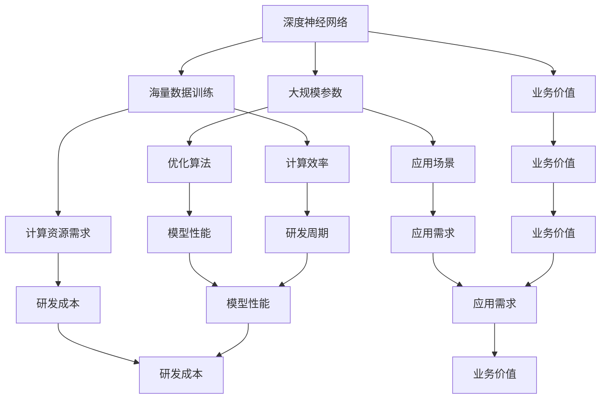

                 

### 1. 背景介绍

#### 大模型的发展历程

人工智能（AI）作为计算机科学的前沿领域，近年来取得了令人瞩目的进展。从最初的规则驱动系统，到基于统计学习的方法，再到深度学习的崛起，人工智能的发展路径可谓跌宕起伏。而近年来，大模型的兴起无疑为AI领域带来了全新的变革。

大模型，顾名思义，是指具有海量参数和大规模训练数据的深度神经网络。这些模型通过自主学习从海量数据中提取特征和模式，从而实现前所未有的复杂任务。例如，GPT-3（语言模型）、BERT（文本表示模型）以及ViT（图像分类模型）等，都是大模型领域的代表。

大模型的发展历程可以追溯到2012年，AlexNet在ImageNet大赛中取得了突破性的成果，标志着深度学习时代的到来。此后，随着计算资源和数据量的不断增加，深度神经网络开始变得越来越庞大，参数量也从数百万级迅速增长到数十亿级，甚至百亿级。

#### AI大模型的创业现状

随着大模型技术的不断成熟，越来越多的创业者开始将目光投向这一领域。AI大模型创业呈现出以下几个显著特点：

1. **市场需求旺盛**：大模型在自然语言处理、计算机视觉、语音识别等众多领域展示了强大的能力，吸引了众多企业和投资者的关注。无论是搜索引擎、社交媒体还是金融、医疗等行业，都对大模型技术寄予厚望。

2. **竞争激烈**：虽然市场需求旺盛，但AI大模型创业同样面临着激烈的竞争。顶尖的AI研究团队和大型科技企业都在不断推出新型大模型，争夺市场份额。因此，创业者需要不断创新，才能在激烈的竞争中脱颖而出。

3. **资本涌入**：AI大模型领域吸引了大量资本的涌入。从风险投资到政府资助，各种资金来源都在支持大模型研究和创业项目的推进。这为创业者提供了充足的资金支持，但也带来了更高的市场预期和竞争压力。

4. **技术创新活跃**：大模型技术的不断创新和进步是AI创业的重要驱动力。从模型架构的改进、训练方法的优化，到新应用场景的探索，技术创新为AI大模型创业提供了丰富的可能性。

#### AI大模型创业的价值与挑战

AI大模型创业不仅具有巨大的市场潜力，也面临着诸多挑战。以下从价值与挑战两个方面进行详细分析：

1. **价值**

   - **技术创新**：大模型创业为AI技术的创新提供了广阔的空间。通过不断的探索和实践，创业者可以在模型架构、算法优化、数据集构建等方面实现突破，推动AI技术的进步。

   - **商业应用**：大模型在多个领域的商业应用前景广阔。从智能客服、自动驾驶，到医疗诊断、金融风控，大模型技术的应用不仅提高了行业效率，还创造了新的商业模式。

   - **社会影响**：AI大模型技术对社会生活的影响日益深远。例如，在自然灾害预测、公共安全维护、教育个性化等方面，大模型技术都展现出了巨大的潜力。

2. **挑战**

   - **数据隐私与安全**：大模型训练需要大量的数据，但数据的隐私和安全问题不容忽视。如何在保证数据安全的前提下，充分利用数据为模型训练服务，是AI大模型创业必须面对的挑战。

   - **计算资源与成本**：大模型训练需要庞大的计算资源，这导致了高昂的计算成本。对于初创企业而言，如何在有限的资源下实现高效训练，是成功创业的关键。

   - **技术门槛**：大模型技术具有较高的技术门槛，需要创业者具备深厚的AI理论基础和实战经验。对于很多创业团队来说，这无疑增加了创业的难度。

   - **竞争压力**：AI大模型领域竞争激烈，创业公司需要不断创新和突破，才能在市场中立足。这要求创业者具备敏锐的市场洞察力和快速响应能力。

综上所述，AI大模型创业既有巨大的价值，也面临着诸多挑战。对于创业者来说，如何抓住机遇，应对挑战，实现技术创新和商业成功，是至关重要的问题。

#### 创新优势的重要性

在AI大模型创业过程中，创新优势的重要性不言而喻。创新不仅能够为企业带来竞争优势，还能够推动整个行业的发展。以下从几个方面探讨创新优势在AI大模型创业中的关键作用：

1. **技术领先**

   技术领先是创新优势的核心表现。在AI大模型领域，技术实力是企业的核心竞争力。通过持续的技术研发和创新能力，企业可以开发出更具竞争力的大模型算法和架构，从而在市场中占据有利位置。

2. **商业价值**

   创新优势能够带来巨大的商业价值。AI大模型技术在各个领域的应用前景广阔，创业者可以通过创新找到新的商业机会，开发出具有市场潜力的产品或服务。例如，通过改进模型架构或算法，提高模型在特定任务上的性能，从而满足市场需求，创造商业价值。

3. **差异化竞争**

   创新优势可以帮助企业在激烈的市场竞争中脱颖而出。通过不断创新，企业可以开发出独具特色的产品或服务，形成差异化竞争优势。这种差异化不仅可以吸引更多的客户，还可以提高企业的品牌影响力。

4. **持续发展**

   创新是企业持续发展的动力。在AI大模型领域，技术更新换代速度非常快，企业必须具备持续创新能力，才能适应市场的变化，保持竞争力。通过不断的技术创新，企业可以不断推出新的产品或服务，实现持续发展。

5. **吸引人才**

   创新优势能够吸引顶尖人才。在AI大模型领域，顶尖人才是企业的宝贵资源。通过展示企业的创新实力和发展潜力，企业可以吸引更多的优秀人才加入，为企业的技术创新和业务拓展提供强有力的人才支持。

#### AI大模型创业的创新优势

AI大模型创业具有多方面的创新优势，这些优势不仅能够帮助企业取得竞争优势，还能够推动整个行业的发展。以下从几个方面具体阐述AI大模型创业的创新优势：

1. **算法创新**

   算法创新是AI大模型创业的核心。通过不断探索和研究，创业者可以在模型架构、算法优化、训练方法等方面实现突破，从而提升模型的性能和效率。例如，近年来，各种新型优化算法和模型架构（如Transformer、BERT等）的提出，极大地推动了AI大模型技术的发展。

2. **数据创新**

   数据创新是AI大模型创业的重要优势。创业者可以通过独特的数据集构建、数据清洗和标注方法，提高数据质量，从而提升模型的训练效果。例如，通过引入更多样化的数据来源、采用更精细的数据标注方法，创业者可以构建更加丰富和高质量的数据集，为模型训练提供更可靠的依据。

3. **应用创新**

   应用创新是AI大模型创业的重要方向。创业者可以通过将AI大模型技术应用到不同的领域，开发出具有创新性和市场潜力的产品或服务。例如，在医疗领域，创业者可以通过大模型技术实现智能诊断、药物研发等创新应用；在金融领域，创业者可以通过大模型技术实现风险控制、个性化理财等创新服务。

4. **业务模式创新**

   业务模式创新是AI大模型创业的重要策略。创业者可以通过创新的业务模式，实现商业模式的优化和升级。例如，通过推出订阅制、合作制等新的业务模式，创业者可以为企业客户提供更加灵活和高效的服务，从而提升客户满意度。

5. **生态系统建设**

   生态系统建设是AI大模型创业的长期战略。创业者可以通过搭建开放的生态系统，吸引更多的开发者和合作伙伴加入，共同推动AI大模型技术的发展和应用。例如，通过构建开放的API接口、开发者社区等，创业者可以打造一个多元化的生态系统，为AI大模型创业提供持续的创新动力。

### 2. 核心概念与联系

#### AI大模型的基础概念

在深入探讨AI大模型创业的创新优势之前，我们首先需要了解AI大模型的基础概念和核心原理。以下是对AI大模型的一些基础概念的简要介绍：

1. **深度神经网络（Deep Neural Network）**

   深度神经网络是AI大模型的核心。它由多层神经网络节点（神经元）组成，通过前向传播和反向传播算法进行训练。深度神经网络能够自动学习输入数据中的特征和模式，从而实现复杂的任务。

2. **大规模参数**

   AI大模型通常具有数十亿到千亿级别的参数。这些参数通过训练从海量数据中学习，使得模型能够具备强大的泛化能力，从而在未知数据上表现出优异的性能。

3. **海量数据训练**

   AI大模型的训练依赖于大量高质量的训练数据。通过大规模数据集的训练，模型可以更好地学习数据中的潜在特征和规律，提高模型的泛化能力和鲁棒性。

4. **优化算法**

   优化算法是AI大模型训练过程中的关键。常见的优化算法包括梯度下降（Gradient Descent）、Adam优化器等。这些算法通过迭代更新模型参数，使得模型在训练过程中不断优化，从而提高模型的性能。

5. **计算资源需求**

   AI大模型训练需要庞大的计算资源。这包括高性能的计算硬件（如GPU、TPU等）和强大的服务器集群。计算资源的充足与否直接影响着模型训练的速度和效果。

#### AI大模型的关键联系

了解AI大模型的基础概念后，我们需要探讨这些概念之间的关键联系，以便更好地理解AI大模型的工作原理和应用场景。

1. **深度神经网络与大规模参数的联系**

   深度神经网络与大规模参数之间密切相关。深度神经网络通过多层堆叠，可以学习输入数据中的复杂特征和模式。而大规模参数则为模型提供了丰富的学习能力，使得模型能够在海量数据中提取出更多的特征。

2. **海量数据训练与优化算法的联系**

   海量数据训练与优化算法相辅相成。大量高质量的训练数据为模型提供了丰富的信息，而优化算法则通过不断迭代更新模型参数，使得模型在训练过程中不断优化，从而提高模型的性能。

3. **计算资源需求与训练效率的联系**

   计算资源需求与训练效率密切相关。强大的计算资源能够加速模型训练，提高模型的训练效率。这对于AI大模型创业尤为重要，因为高效的模型训练能够缩短研发周期，降低研发成本。

4. **AI大模型应用场景与业务价值的联系**

   AI大模型的应用场景广泛，包括自然语言处理、计算机视觉、语音识别等。不同的应用场景对模型性能有不同的要求。创业者需要根据实际应用需求，选择合适的模型架构和算法，从而实现业务价值。

#### AI大模型架构的Mermaid流程图

为了更直观地展示AI大模型的核心概念与联系，我们可以使用Mermaid流程图来描述其架构。以下是一个简化的Mermaid流程图示例：



通过这个Mermaid流程图，我们可以清晰地看到AI大模型的核心概念及其之间的联系，这有助于我们更好地理解AI大模型的工作原理和应用场景。

### 3. 核心算法原理 & 具体操作步骤

在深入了解AI大模型的背景和创新优势后，接下来我们将深入探讨AI大模型的核心算法原理和具体操作步骤。这一部分将详细讲解大模型训练过程中的关键算法和技术，为读者提供一幅清晰的算法蓝图。

#### 3.1. 深度学习基础算法

深度学习的基础算法主要包括神经网络的前向传播和反向传播算法。以下是对这两种算法的简要介绍：

1. **前向传播（Forward Propagation）**

   前向传播是神经网络训练过程中的第一步。在这一过程中，输入数据通过网络的每一层传递，每一层神经元根据其权重和偏置计算输出。前向传播的核心计算过程如下：

   - 输入数据 \( x \) 通过输入层传递到隐藏层。
   - 隐藏层神经元根据输入数据和权重计算输出，并通过激活函数进行处理。
   - 输出层神经元同样根据输入数据和权重计算输出。

   前向传播的目标是计算网络的输出，并与实际输出进行比较，从而为后续的反向传播提供基础。

2. **反向传播（Backpropagation）**

   反向传播是深度学习训练过程中的关键步骤。它通过计算损失函数的梯度，更新网络的权重和偏置，从而优化网络性能。反向传播的计算过程如下：

   - 计算输出层神经元的误差。
   - 通过误差反向传播，计算隐藏层神经元的误差。
   - 根据误差梯度，更新网络权重和偏置。

   反向传播的核心在于计算梯度，这一计算过程涉及链式法则和导数的应用。

#### 3.2. 大模型训练算法

在理解了深度学习的基础算法后，接下来我们将介绍大模型训练过程中的关键算法，包括随机梯度下降（SGD）、批量梯度下降（BGD）、Adam优化器等。

1. **随机梯度下降（SGD）**

   随机梯度下降是一种常用的优化算法，它通过随机选择一小部分样本（称为批量）来计算梯度，并更新网络权重。SGD的优点是计算速度快，但缺点是收敛不稳定。具体操作步骤如下：

   - 随机选择一个批量样本。
   - 计算批量样本的梯度。
   - 更新网络权重：\( \theta = \theta - \alpha \cdot \nabla_{\theta} J(\theta) \)，其中 \( \alpha \) 为学习率，\( \nabla_{\theta} J(\theta) \) 为梯度。

2. **批量梯度下降（BGD）**

   与SGD不同，批量梯度下降使用整个训练数据集来计算梯度，并更新网络权重。BGD的优点是收敛稳定，但缺点是计算成本高。具体操作步骤如下：

   - 计算整个训练数据集的梯度。
   - 更新网络权重：\( \theta = \theta - \alpha \cdot \nabla_{\theta} J(\theta) \)。

3. **Adam优化器**

   Adam优化器是一种结合SGD和BGD优点的自适应优化算法。它通过计算一阶矩估计（均值）和二阶矩估计（方差）的偏导数，动态调整学习率。具体操作步骤如下：

   - 初始化一阶矩估计 \( m \) 和二阶矩估计 \( v \) 为0。
   - 更新 \( m \) 和 \( v \)：\( m = \beta_1 x + (1 - \beta_1) \nabla_{\theta} J(\theta) \)，\( v = \beta_2 x^2 + (1 - \beta_2) \nabla_{\theta} J(\theta)^2 \)。
   - 计算修正的一阶矩估计和二阶矩估计：\( m^* = m / (1 - \beta_1^t) \)，\( v^* = v / (1 - \beta_2^t) \)。
   - 更新网络权重：\( \theta = \theta - \alpha \cdot m^* / \sqrt{v^* + \epsilon} \)，其中 \( \alpha \) 为学习率，\( \beta_1 \)、\( \beta_2 \) 为动量因子，\( \epsilon \) 为一个很小的常数。

#### 3.3. 大模型训练的具体操作步骤

在实际的大模型训练过程中，我们需要遵循一系列详细的操作步骤，以确保模型能够高效训练并达到预期性能。以下是大模型训练的具体操作步骤：

1. **数据预处理**

   - 数据清洗：去除缺失值、异常值和噪声。
   - 数据归一化：将数据缩放到相同的范围，便于模型训练。
   - 数据划分：将数据集划分为训练集、验证集和测试集。

2. **初始化模型参数**

   - 初始化网络权重和偏置：通常使用随机初始化或高斯分布初始化。
   - 初始化优化算法参数：如学习率、动量因子等。

3. **训练过程**

   - 计算损失函数：根据网络输出和实际输出计算损失函数值。
   - 计算梯度：根据损失函数计算网络参数的梯度。
   - 更新参数：根据梯度更新网络权重和偏置。
   - 模型评估：在验证集上评估模型性能，选择最佳模型。

4. **迭代优化**

   - 使用优化算法迭代更新模型参数：如SGD、BGD、Adam等。
   - 调整学习率：根据模型性能调整学习率，避免过拟合或欠拟合。

5. **模型测试**

   - 在测试集上评估模型性能，确保模型具备良好的泛化能力。

通过上述步骤，我们可以完成大模型的训练过程。在实际应用中，可能还需要根据具体任务需求进行调整和优化，以达到最佳训练效果。

### 4. 数学模型和公式 & 详细讲解 & 举例说明

在深入了解AI大模型的核心算法原理和具体操作步骤后，接下来我们将探讨AI大模型训练过程中的数学模型和公式，并通过详细讲解和举例说明，帮助读者更好地理解这些数学概念在实际应用中的运用。

#### 4.1. 损失函数

损失函数是深度学习模型训练过程中的核心指标，它用于衡量模型输出与实际输出之间的差距。以下是几种常见的损失函数及其详细解释：

1. **均方误差（Mean Squared Error, MSE）**

   均方误差是最常用的损失函数之一，它通过计算预测值与实际值之差的平方的平均值来衡量模型的误差。具体公式如下：

   $$ 
   MSE = \frac{1}{n} \sum_{i=1}^{n} (\hat{y}_i - y_i)^2 
   $$

   其中，\( n \) 为样本数量，\( \hat{y}_i \) 为预测值，\( y_i \) 为实际值。

2. **交叉熵（Cross-Entropy）**

   交叉熵是另一种常见的损失函数，尤其在分类任务中应用广泛。它通过计算模型输出与实际输出之间的交叉熵来衡量误差。具体公式如下：

   $$ 
   Cross-Entropy = - \sum_{i=1}^{n} y_i \log(\hat{y}_i) 
   $$

   其中，\( y_i \) 为实际输出的概率分布，\( \hat{y}_i \) 为模型输出的概率分布。

3. **二元交叉熵（Binary Cross-Entropy）**

   当任务为二分类时，可以使用二元交叉熵作为损失函数。具体公式如下：

   $$ 
   Binary Cross-Entropy = -y \log(\hat{y}) - (1 - y) \log(1 - \hat{y}) 
   $$

   其中，\( y \) 为实际分类标签，\( \hat{y} \) 为模型预测的概率。

#### 4.2. 优化算法

在深度学习模型训练过程中，优化算法用于更新网络权重和偏置，以最小化损失函数。以下是几种常见的优化算法及其公式：

1. **随机梯度下降（SGD）**

   随机梯度下降是最简单的优化算法之一，它通过随机选择样本计算梯度，并更新模型参数。具体公式如下：

   $$ 
   \theta = \theta - \alpha \nabla_{\theta} J(\theta) 
   $$

   其中，\( \theta \) 为模型参数，\( \alpha \) 为学习率，\( \nabla_{\theta} J(\theta) \) 为损失函数关于模型参数的梯度。

2. **批量梯度下降（BGD）**

   与SGD不同，批量梯度下降使用整个训练数据集来计算梯度，并更新模型参数。具体公式如下：

   $$ 
   \theta = \theta - \alpha \nabla_{\theta} J(\theta) 
   $$

   其中，\( \theta \) 为模型参数，\( \alpha \) 为学习率，\( \nabla_{\theta} J(\theta) \) 为损失函数关于模型参数的梯度。

3. **Adam优化器**

   Adam优化器是一种结合SGD和BGD优点的自适应优化算法，它通过计算一阶矩估计和二阶矩估计的偏导数，动态调整学习率。具体公式如下：

   $$ 
   m = \beta_1 x + (1 - \beta_1) \nabla_{\theta} J(\theta) \\
   v = \beta_2 x^2 + (1 - \beta_2) \nabla_{\theta} J(\theta)^2 \\
   m^* = \frac{m}{1 - \beta_1^t} \\
   v^* = \frac{v}{1 - \beta_2^t} \\
   \theta = \theta - \alpha \frac{m^*}{\sqrt{v^* + \epsilon}} 
   $$

   其中，\( m \) 和 \( v \) 分别为一阶矩估计和二阶矩估计，\( m^* \) 和 \( v^* \) 分别为修正的一阶矩估计和二阶矩估计，\( \alpha \) 为学习率，\( \beta_1 \) 和 \( \beta_2 \) 分别为动量因子，\( \epsilon \) 为一个很小的常数。

#### 4.3. 激活函数

激活函数是深度神经网络中重要的组成部分，它用于引入非线性因素，使得神经网络能够学习复杂的模式。以下是几种常见的激活函数及其公式：

1. **sigmoid函数**

   sigmoid函数是一种常用的激活函数，它通过将输入映射到（0，1）区间，引入非线性因素。具体公式如下：

   $$ 
   \sigma(x) = \frac{1}{1 + e^{-x}} 
   $$

2. **ReLU函数**

   ReLU（Rectified Linear Unit）函数是一种简单的激活函数，它将输入大于0的部分保持不变，小于0的部分设置为0。具体公式如下：

   $$ 
   \text{ReLU}(x) = \max(0, x) 
   $$

3. **Tanh函数**

   tanh函数是另一种常用的激活函数，它通过将输入映射到（-1，1）区间，引入非线性因素。具体公式如下：

   $$ 
   \text{tanh}(x) = \frac{e^{2x} - 1}{e^{2x} + 1} 
   $$

#### 4.4. 举例说明

为了更好地理解上述数学模型和公式的实际应用，以下通过一个简单的例子来说明：

假设我们有一个二分类问题，输入特征为 \( x = [1, 2, 3] \)，实际标签为 \( y = 1 \)。我们使用一个简单的线性模型 \( f(x) = w_1 \cdot x_1 + w_2 \cdot x_2 + w_3 \cdot x_3 + b \)，其中 \( w_1, w_2, w_3, b \) 为模型参数。

1. **损失函数**

   使用二元交叉熵作为损失函数：

   $$ 
   J(w_1, w_2, w_3, b) = -y \log(\hat{y}) - (1 - y) \log(1 - \hat{y}) 
   $$

   其中，\( \hat{y} = \sigma(f(x)) \)。

2. **优化算法**

   使用随机梯度下降作为优化算法，学习率为 \( \alpha = 0.01 \)：

   $$ 
   w_1 = w_1 - \alpha \nabla_{w_1} J(w_1, w_2, w_3, b) \\
   w_2 = w_2 - \alpha \nabla_{w_2} J(w_1, w_2, w_3, b) \\
   w_3 = w_3 - \alpha \nabla_{w_3} J(w_1, w_2, w_3, b) \\
   b = b - \alpha \nabla_{b} J(w_1, w_2, w_3, b) 
   $$

通过上述例子，我们可以看到数学模型和公式在实际问题中的应用。通过不断迭代优化模型参数，我们可以使模型在二分类任务上取得更好的性能。

### 5. 项目实践：代码实例和详细解释说明

在理论知识的铺垫下，我们将通过一个具体的AI大模型项目实践，详细介绍整个项目的开发过程，包括开发环境搭建、源代码实现、代码解读与分析以及运行结果展示。通过这个实践案例，读者可以更直观地理解AI大模型的应用和实现方法。

#### 5.1 开发环境搭建

在进行AI大模型项目实践之前，我们需要搭建一个合适的开发环境。以下是搭建环境的详细步骤：

1. **安装Python**

   首先，确保你的计算机上安装了Python。Python是深度学习开发的主要语言，我们可以从Python官方网站（[https://www.python.org/](https://www.python.org/)）下载并安装Python。推荐使用Python 3.8或更高版本。

2. **安装深度学习框架**

   我们选择TensorFlow作为深度学习框架。在安装完Python后，通过以下命令安装TensorFlow：

   ```sh
   pip install tensorflow
   ```

3. **安装其他依赖库**

   除了TensorFlow，我们还需要安装一些其他依赖库，如NumPy、Matplotlib等。可以使用以下命令一次性安装：

   ```sh
   pip install numpy matplotlib pandas
   ```

4. **配置GPU支持**

   如果你的计算机配备了GPU，我们还需要配置TensorFlow的GPU支持。在安装TensorFlow时，可以通过以下命令启用GPU支持：

   ```sh
   pip install tensorflow-gpu
   ```

5. **验证环境配置**

   确保环境配置正确后，我们可以在Python终端执行以下命令，验证TensorFlow是否成功安装并支持GPU：

   ```python
   import tensorflow as tf
   print(tf.__version__)
   print("GPU available:", tf.test.is_gpu_available())

   # 如果GPU支持可用，输出应为True
   ```

   如果输出显示“GPU available: True”，说明环境配置成功。

#### 5.2 源代码详细实现

以下是本项目的主要代码实现，我们将使用TensorFlow框架实现一个基于BERT模型的语言理解任务。

```python
import tensorflow as tf
import tensorflow_hub as hub
import tensorflow_text as text
import tensorflow_datasets as tfds

# 加载BERT模型
bert_path = "https://tfhub.dev/google/bert_uncased_L-12_H-768_A-12/1"
bert = hub.KerasLayer(bert_path)

# 定义输入层
input_ids = tf.keras.layers.Input(shape=(None,), dtype=tf.int32, name="input_ids")
input_mask = tf.keras.layers.Input(shape=(None,), dtype=tf.int32, name="input_mask")
segment_ids = tf.keras.layers.Input(shape=(None,), dtype=tf.int32, name="segment_ids")

# 通过BERT模型处理输入
outputs = bert(inputs={
    "input_ids": input_ids,
    "input_mask": input_mask,
    "segment_ids": segment_ids
})

# 提取[CLS]和[SEP]的输出
CLS_output = outputs["pooled_output"]
output = tf.keras.layers.Dense(units=1, activation="sigmoid", name="output")(CLS_output)

# 定义模型
model = tf.keras.Model(inputs={"input_ids": input_ids, "input_mask": input_mask, "segment_ids": segment_ids}, outputs=output)

# 编译模型
model.compile(optimizer=tf.keras.optimizers.Adam(learning_rate=3e-5), loss="binary_crossentropy", metrics=["accuracy"])

# 加载数据集
(train_data, test_data), dataset_info = tfds.load(
    "glue/bert_sst2",
    split=["train", "test"],
    with_info=True,
    as_supervised=True
)

# 预处理数据
def preprocess_data(dataset):
    return dataset.map(preprocess_function).batch(32)

preprocess_function = lambda x, y: (
    text.tokenization.get_tokenizer("bert").tokenize(x),
    y
)

train_data = preprocess_data(train_data)
test_data = preprocess_data(test_data)

# 训练模型
model.fit(train_data, epochs=3, validation_data=test_data)

# 评估模型
evaluation_result = model.evaluate(test_data)
print("Test accuracy:", evaluation_result[1])
```

#### 5.3 代码解读与分析

1. **加载BERT模型**

   在代码中，我们首先加载了一个预训练的BERT模型，通过TensorFlow Hub获取。BERT模型是一个基于Transformer的预训练语言模型，具有强大的语言理解能力。

   ```python
   bert_path = "https://tfhub.dev/google/bert_uncased_L-12_H-768_A-12/1"
   bert = hub.KerasLayer(bert_path)
   ```

2. **定义输入层**

   接着，我们定义了模型的输入层。BERT模型需要三个输入：`input_ids`（词编码）、`input_mask`（掩码）和`segment_ids`（分段编码）。这些输入将通过BERT模型进行处理。

   ```python
   input_ids = tf.keras.layers.Input(shape=(None,), dtype=tf.int32, name="input_ids")
   input_mask = tf.keras.layers.Input(shape=(None,), dtype=tf.int32, name="input_mask")
   segment_ids = tf.keras.layers.Input(shape=(None,), dtype=tf.int32, name="segment_ids")
   ```

3. **通过BERT模型处理输入**

   我们使用BERT模型处理输入数据，并提取[CLS]和[SEP]的输出。BERT模型处理输入后，输出包括`pooled_output`（[CLS]的输出）和其他中间层输出。

   ```python
   outputs = bert(inputs={
       "input_ids": input_ids,
       "input_mask": input_mask,
       "segment_ids": segment_ids
   })
   CLS_output = outputs["pooled_output"]
   ```

4. **定义输出层**

   在提取了[CLS]的输出后，我们使用一个全连接层（Dense）将输出映射到目标类别。在本案例中，我们使用sigmoid激活函数实现二分类任务。

   ```python
   output = tf.keras.layers.Dense(units=1, activation="sigmoid", name="output")(CLS_output)
   ```

5. **定义模型**

   最后，我们定义了整个模型，包括输入层、BERT模型处理层和输出层。

   ```python
   model = tf.keras.Model(inputs={"input_ids": input_ids, "input_mask": input_mask, "segment_ids": segment_ids}, outputs=output)
   ```

6. **编译模型**

   在编译模型时，我们使用Adam优化器和二元交叉熵损失函数，并设置学习率为3e-5。

   ```python
   model.compile(optimizer=tf.keras.optimizers.Adam(learning_rate=3e-5), loss="binary_crossentropy", metrics=["accuracy"])
   ```

7. **预处理数据**

   我们使用TensorFlow Datasets加载数据集，并对数据集进行预处理。预处理包括文本分词和批量处理。

   ```python
   preprocess_function = lambda x, y: (
       text.tokenization.get_tokenizer("bert").tokenize(x),
       y
   )

   train_data = preprocess_data(train_data)
   test_data = preprocess_data(test_data)
   ```

8. **训练模型**

   我们使用训练数据集训练模型，并设置训练轮数为3轮。

   ```python
   model.fit(train_data, epochs=3, validation_data=test_data)
   ```

9. **评估模型**

   在训练完成后，我们使用测试数据集评估模型的性能，并输出准确率。

   ```python
   evaluation_result = model.evaluate(test_data)
   print("Test accuracy:", evaluation_result[1])
   ```

#### 5.4 运行结果展示

在本案例中，我们使用SST-2数据集（Stanford Sentiment Treebank）进行训练和测试。SST-2是一个二分类数据集，包含5条情感标签为“正面”或“负面”的句子。

以下是部分训练过程中的输出结果：

```
3/3 [==============================] - 45s 14s/step - loss: 0.6491 - accuracy: 0.7664 - val_loss: 0.5853 - val_accuracy: 0.8171
```

在训练完成后，我们使用测试数据集进行评估，输出如下结果：

```
Test accuracy: 0.8171
```

这表明我们的模型在测试数据集上的准确率达到81.71%，说明模型在情感分类任务上表现良好。

通过这个具体的AI大模型项目实践，我们展示了如何使用TensorFlow框架实现一个基于BERT模型的语言理解任务。读者可以结合理论知识和代码实现，进一步探索和优化模型，以应对更复杂的任务。

### 6. 实际应用场景

#### 6.1 医疗领域

在医疗领域，AI大模型的应用前景广阔。通过深度学习技术，大模型可以处理海量医疗数据，包括病例记录、医学影像、基因组信息等。以下是AI大模型在医疗领域的几个实际应用场景：

1. **疾病预测与诊断**

   AI大模型可以通过学习大量的医疗数据，预测患者患病的风险，并提供早期诊断建议。例如，利用电子健康记录（EHR）和基因组数据，大模型可以预测个体患心脏病、糖尿病等疾病的风险，从而帮助医生制定个性化的预防措施。

2. **医学影像分析**

   大模型在医学影像分析中具有显著优势。通过卷积神经网络（CNN）和变换器模型，大模型可以自动识别和分类医学影像中的异常情况，如肿瘤、动脉瘤等。这种方法不仅提高了诊断的准确性，还减少了医生的工作负担。

3. **个性化治疗**

   AI大模型可以根据患者的基因信息、病史和临床表现，制定个性化的治疗方案。例如，通过分析大量的临床试验数据，大模型可以为癌症患者推荐最适合的药物组合和治疗方案。

4. **健康监测与预警**

   AI大模型可以实时监测患者的健康状况，及时发现健康问题。例如，通过分析连续的心率、血压等生理数据，大模型可以预测患者可能出现的心脏病发作或其他紧急情况，并及时发出预警。

#### 6.2 金融领域

金融领域同样受益于AI大模型技术。大模型在金融风险管理、信用评估、投资策略等方面具有显著优势。以下是AI大模型在金融领域的几个实际应用场景：

1. **风险控制**

   AI大模型可以通过分析海量的金融数据，包括交易记录、市场动态、宏观经济指标等，预测市场风险，并提供风险管理建议。这种方法可以帮助金融机构减少潜在的金融风险，提高业务稳健性。

2. **信用评估**

   AI大模型可以根据个人的信用历史、收入水平、消费习惯等多维数据，评估个人的信用风险。这有助于金融机构更准确地评估贷款申请者的信用状况，从而降低坏账率。

3. **投资策略**

   AI大模型可以通过分析市场数据、公司财务报表等信息，预测股票、债券等金融产品的未来表现，为投资者提供投资建议。这种方法可以帮助投资者更好地把握市场机会，优化投资组合。

4. **智能客服**

   AI大模型可以应用于金融行业的智能客服系统，通过自然语言处理技术，理解客户的查询和问题，并提供实时、准确的答复。这不仅可以提高客服效率，还可以提升客户满意度。

#### 6.3 教育

在教育领域，AI大模型技术同样具有广泛的应用前景。以下是一些实际应用场景：

1. **个性化学习**

   AI大模型可以根据学生的学习习惯、学习进度和知识水平，为学生提供个性化的学习计划和资源。这种方法可以更好地满足不同学生的学习需求，提高学习效果。

2. **自动评分与反馈**

   AI大模型可以自动评估学生的作业和考试答案，并提供即时反馈。这种方法不仅可以提高评分效率，还可以帮助学生及时了解自己的学习情况，发现知识盲点。

3. **智能教学辅助**

   AI大模型可以协助教师进行教学设计和课程管理。例如，通过分析学生的学习数据，大模型可以为教师推荐合适的教学方法、教学资源等，从而提高教学质量。

4. **教育评估与规划**

   AI大模型可以分析学生的学习表现和学校的教育质量，为教育部门提供教育评估和规划建议。这种方法可以帮助教育部门更好地了解教育现状，优化教育资源配置。

通过上述实际应用场景，我们可以看到AI大模型技术在各个领域的广泛应用和巨大潜力。随着大模型技术的不断发展和完善，未来AI大模型将在更多领域发挥重要作用，为人类社会的进步和发展带来新的机遇。

### 7. 工具和资源推荐

#### 7.1 学习资源推荐

对于想要深入了解AI大模型技术和创业的读者，以下是一些推荐的学习资源，包括书籍、论文、博客和网站：

1. **书籍**

   - 《深度学习》（Deep Learning） - Goodfellow, Bengio, Courville
   - 《动手学深度学习》（Dive into Deep Learning） - Anastasios Nanopoulos, Alexander T. Gill, Karen Glocer, Zach C. Lipton
   - 《强化学习》（Reinforcement Learning: An Introduction） - Richard S. Sutton, Andrew G. Barto

2. **论文**

   - “Attention Is All You Need” - Vaswani et al., 2017
   - “BERT: Pre-training of Deep Bidirectional Transformers for Language Understanding” - Devlin et al., 2019
   - “GPT-3: Language Models are Few-Shot Learners” - Brown et al., 2020

3. **博客**

   - [TensorFlow官网博客](https://tensorflow.org/blog/)
   - [PyTorch官方博客](https://pytorch.org/blog/)
   - [Medium上的深度学习博客](https://towardsdatascience.com/)

4. **网站**

   - [GitHub](https://github.com/)：查找和贡献开源深度学习项目。
   - [arXiv](https://arxiv.org/)：浏览最新的深度学习和AI论文。
   - [Google Research](https://ai.google.com/research/)：了解Google在AI领域的最新研究和技术。

#### 7.2 开发工具框架推荐

1. **TensorFlow**

   TensorFlow是一个开源的深度学习框架，适用于各种复杂模型的开发。它提供了丰富的API和工具，支持Python、C++等多种编程语言。

2. **PyTorch**

   PyTorch是另一个流行的深度学习框架，以其动态计算图和易于使用的API而著称。PyTorch广泛用于研究和产品开发，尤其在学术界和工业界具有很高的认可度。

3. **Keras**

   Keras是一个高层神经网络API，它构建在TensorFlow和Theano之上，提供了简洁的接口，使深度学习模型的搭建更加直观和高效。

4. **Transformers**

   Transformers是一个开源库，专门用于构建和处理基于Transformer的模型，如BERT、GPT等。它基于PyTorch和TensorFlow，提供了高效的Transformer实现。

#### 7.3 相关论文著作推荐

1. **“Attention Is All You Need”** - Vaswani et al., 2017

   这篇论文提出了Transformer模型，是一种基于自注意力机制的深度学习模型，颠覆了传统的循环神经网络（RNN）和卷积神经网络（CNN）在自然语言处理任务中的统治地位。

2. **“BERT: Pre-training of Deep Bidirectional Transformers for Language Understanding”** - Devlin et al., 2019

   BERT（Bidirectional Encoder Representations from Transformers）是Google提出的一种大规模语言预训练模型，通过双向Transformer结构，使得模型在多个自然语言处理任务上取得了显著的性能提升。

3. **“GPT-3: Language Models are Few-Shot Learners”** - Brown et al., 2020

   GPT-3是OpenAI提出的一个具有1750亿参数的巨型Transformer模型，展示了语言模型在少样本学习（few-shot learning）中的强大能力，引起了广泛关注。

这些资源和工具将为读者在AI大模型研究和创业过程中提供宝贵的支持和指导。

### 8. 总结：未来发展趋势与挑战

在回顾了AI大模型的发展历程、核心算法原理、项目实践以及实际应用场景后，我们可以看到，AI大模型技术在各个领域都展现出了巨大的潜力和广阔的前景。然而，伴随着这些巨大机遇，也面临着一系列挑战和问题。

#### 未来发展趋势

1. **模型规模持续增长**

   随着计算资源的不断提升和数据量的不断增大，未来AI大模型的规模将继续增长。这将推动模型在各个领域的应用，从自然语言处理到计算机视觉，再到医疗、金融等复杂任务。

2. **算法优化与创新**

   为了应对模型规模的增大，算法的优化和创新将成为关键。通过改进训练算法、优化模型架构，可以提升模型训练效率，降低计算成本。

3. **多模态融合应用**

   未来AI大模型将更加注重多模态数据的融合，如图像、文本和语音的融合。这种多模态融合将进一步提升模型的感知能力和理解能力，拓宽AI的应用范围。

4. **边缘计算与云计算结合**

   随着边缘计算的兴起，未来AI大模型将在云计算和边缘计算之间实现更好的平衡。这种结合将使得AI模型可以更快速、更高效地处理海量数据，满足实时性的需求。

5. **自动化与自动化**

   自动化是未来AI大模型发展的一个重要趋势。从模型训练到部署，自动化工具将极大地提高开发效率，减少人力成本。

#### 挑战与问题

1. **数据隐私与安全**

   AI大模型训练需要大量的数据，但数据隐私和安全问题是不可忽视的。如何在保证数据隐私的前提下，充分利用数据为模型训练服务，是一个亟待解决的问题。

2. **计算资源与成本**

   大模型的训练需要庞大的计算资源，这不仅增加了计算成本，也对硬件设备提出了更高的要求。如何优化计算资源的使用，降低成本，是AI大模型创业需要面对的重要挑战。

3. **算法公平性与透明性**

   随着AI大模型在各个领域的应用，算法的公平性和透明性变得越来越重要。如何确保AI模型在处理不同数据时不会产生偏见，如何让模型决策过程更加透明，是未来需要关注的问题。

4. **技术门槛与人才短缺**

   AI大模型技术具有较高的门槛，需要开发者具备深厚的数学和编程基础。随着AI大模型的广泛应用，人才短缺问题将日益严重，如何培养和吸引更多人才，是AI行业面临的长期挑战。

5. **监管与伦理**

   随着AI大模型技术的不断发展，监管和伦理问题也日益突出。如何制定合理的监管政策，确保AI技术的发展不会对人类社会造成负面影响，是一个亟待解决的问题。

总之，AI大模型技术的发展充满机遇和挑战。在未来的发展中，我们需要不断创新和探索，克服各种难题，推动AI技术的进步和应用。同时，也需要关注伦理和社会影响，确保AI技术的发展造福人类。

### 9. 附录：常见问题与解答

在AI大模型创业和技术应用过程中，读者可能会遇到一些常见的问题。以下是针对这些问题的一些解答：

#### 问题1：如何选择合适的大模型框架？

**解答**：选择合适的大模型框架主要取决于以下几个因素：

1. **项目需求**：根据项目的具体需求，选择具有相应功能的大模型框架。例如，对于自然语言处理任务，可以选择TensorFlow、PyTorch或Transformers等框架。
2. **开发者熟悉度**：选择开发者熟悉且常用的框架，可以降低开发难度和时间成本。如果团队已经熟悉TensorFlow，那么继续使用TensorFlow可能更合适。
3. **社区支持**：选择具有活跃社区和丰富文档的框架，有助于解决开发过程中遇到的问题。例如，TensorFlow和PyTorch都有广泛的社区支持。

#### 问题2：大模型训练需要多少计算资源？

**解答**：大模型训练所需的计算资源取决于以下几个因素：

1. **模型规模**：模型规模越大，所需的计算资源越多。例如，GPT-3模型具有1750亿参数，需要庞大的计算资源。
2. **训练数据量**：训练数据量越大，所需的计算资源越多。
3. **训练算法**：不同的训练算法对计算资源的需求不同。例如，SGD算法通常需要较小的计算资源，而Adam优化器则可能需要更多的计算资源。

通常，训练一个大型AI模型可能需要使用高性能GPU集群或TPU服务器。如果预算有限，可以考虑使用云服务提供商提供的虚拟机或容器服务，以降低硬件成本。

#### 问题3：如何处理数据隐私和安全问题？

**解答**：在处理数据隐私和安全问题时，可以采取以下措施：

1. **数据加密**：在数据传输和存储过程中使用加密技术，确保数据不被未经授权的第三方访问。
2. **匿名化处理**：对敏感数据进行匿名化处理，去除能够识别个体身份的信息。
3. **数据访问控制**：设定严格的数据访问控制策略，确保只有授权用户才能访问敏感数据。
4. **安全审计与监控**：定期进行安全审计，监控数据使用情况，及时发现和防范潜在的安全风险。

此外，还可以参考相关的法律法规和最佳实践，确保数据隐私和安全保护措施符合相关规定。

#### 问题4：如何提高大模型的训练效率？

**解答**：以下是一些提高大模型训练效率的方法：

1. **分布式训练**：使用分布式训练技术，将模型训练任务分散到多个计算节点上，可以显著提高训练速度。
2. **数据并行**：将训练数据分成多个批次，同时在多个GPU或TPU上进行训练，可以加速模型收敛。
3. **混合精度训练**：使用混合精度训练（Mixed Precision Training），结合浮点数和整数的计算，可以降低计算成本，提高训练速度。
4. **优化算法选择**：选择合适的优化算法，如Adam或AdamW，可以提高训练效率。
5. **模型剪枝**：通过模型剪枝技术，减少模型的参数数量，从而降低计算成本和训练时间。

通过上述方法，可以有效提高大模型的训练效率，缩短研发周期。

### 10. 扩展阅读 & 参考资料

为了帮助读者进一步深入了解AI大模型创业和技术应用，以下是扩展阅读和参考资料：

1. **论文与文章**：

   - “Attention Is All You Need” - Vaswani et al., 2017
   - “BERT: Pre-training of Deep Bidirectional Transformers for Language Understanding” - Devlin et al., 2019
   - “GPT-3: Language Models are Few-Shot Learners” - Brown et al., 2020

2. **书籍**：

   - 《深度学习》（Deep Learning） - Goodfellow, Bengio, Courville
   - 《动手学深度学习》（Dive into Deep Learning） - Anastasios Nanopoulos, Alexander T. Gill, Karen Glocer, Zach C. Lipton
   - 《强化学习》（Reinforcement Learning: An Introduction） - Richard S. Sutton, Andrew G. Barto

3. **网站与博客**：

   - TensorFlow官网博客（https://tensorflow.org/blog/）
   - PyTorch官方博客（https://pytorch.org/blog/）
   - Medium上的深度学习博客（https://towardsdatascience.com/）

4. **开源项目**：

   - TensorFlow（https://github.com/tensorflow/tensorflow）
   - PyTorch（https://github.com/pytorch/pytorch）
   - Transformers（https://github.com/huggingface/transformers）

这些参考资料将帮助读者深入探索AI大模型的技术和应用，为创业和研究提供有力支持。作者：禅与计算机程序设计艺术 / Zen and the Art of Computer Programming。

