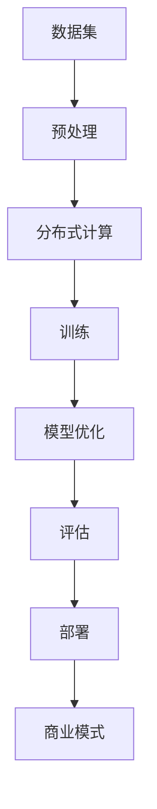

                 

### 1. 背景介绍

#### AI 大模型的发展历程

人工智能（AI）作为计算机科学的一个分支，自20世纪50年代诞生以来，经历了数次重要的技术革新。早期的AI研究主要集中在规则推理、知识表示和搜索算法上，然而这些方法在面对复杂问题时显得力不从心。随着计算能力的提升和大数据技术的成熟，深度学习作为AI的一种重要分支，迅速崛起并成为改变游戏规则的力量。

深度学习的基础可以追溯到1986年，当Hinton等人首次提出了反向传播算法（Backpropagation Algorithm）。这一算法的发明使得多层神经网络（Multi-Layer Neural Networks）的训练变得可行，从而为深度学习的发展奠定了坚实的基础。进入21世纪后，随着GPU的广泛应用和大数据的积累，深度学习开始进入工业界和学术界的视野。

2012年，AlexNet在ImageNet竞赛中取得了突破性的成绩，这标志着深度学习在计算机视觉领域的崛起。此后，各种深度学习模型如雨后春笋般涌现，包括卷积神经网络（CNN）、递归神经网络（RNN）、生成对抗网络（GAN）等。这些模型的提出和应用，推动了AI技术的快速发展，也使得AI从理论研究逐步走向实际应用。

#### 大模型在AI创业中的应用

大模型在AI创业中扮演着至关重要的角色。大模型通常指的是具有数百万甚至数十亿参数的深度学习模型，这些模型在训练时需要大量的数据和计算资源。大模型的强大在于其能够从海量数据中学习到复杂的模式，从而在各个领域实现高度准确的预测和决策。

在图像识别领域，大模型如ResNet、Inception等在ImageNet等数据集上取得了超越人类的准确率，使得自动驾驶、医疗影像分析等应用成为可能。在自然语言处理领域，BERT、GPT等大模型的出现，使得机器翻译、文本生成等任务的表现大幅提升，甚至达到了人类的水平。在生成模型领域，StyleGAN、DALL-E等大模型能够生成高质量、逼真的图像和视频，为创意设计、娱乐产业带来了新的可能性。

#### 创业者如何利用大模型的优势

对于AI创业者来说，掌握和利用大模型的技术优势是成功的关键。以下是一些具体的策略：

1. **市场需求分析**：创业者需要深刻理解市场需求，选择具有广阔前景的领域。例如，医疗、金融、教育等领域，数据量大、问题复杂，适合应用大模型技术。

2. **数据资源积累**：大模型的训练需要大量的数据支持。创业者需要积极获取和积累高质量的训练数据，或者利用现有的开源数据集。此外，创业者还可以通过数据清洗、增强等方法，提升数据的质量和多样性。

3. **计算资源配置**：大模型的训练需要强大的计算资源支持。创业者可以通过使用GPU、TPU等高性能计算设备，或者利用云计算服务，如Google Cloud、AWS等，来满足计算需求。

4. **模型优化与调优**：创业者需要具备模型优化和调优的能力，通过调整网络结构、学习率、正则化等超参数，来提升模型的性能。

5. **商业模式创新**：创业者需要思考如何将AI大模型技术转化为商业价值。例如，通过提供SaaS服务、API接口、定制化解决方案等方式，为企业和个人用户提供价值。

#### 当前大模型创业的挑战

尽管大模型在AI创业中展现出巨大的潜力，但创业者仍然面临诸多挑战：

1. **技术门槛高**：大模型技术复杂，涉及深度学习、分布式计算等多个领域。创业者需要具备较高的技术能力，才能成功开发和应用大模型。

2. **数据隐私和安全**：在数据驱动的AI应用中，数据的安全和隐私是一个重要问题。创业者需要确保数据的合规性和安全性，避免数据泄露和滥用。

3. **可解释性和透明度**：大模型的决策过程通常是非线性和复杂的，缺乏透明度和可解释性。创业者需要探索如何提高模型的可解释性，以增强用户对AI系统的信任。

4. **计算资源和成本**：大模型的训练和部署需要大量的计算资源和成本，尤其是训练阶段。创业者需要优化资源利用，控制成本。

#### 小结

AI大模型技术的快速发展为创业者提供了丰富的机会。然而，成功的创业不仅仅依赖于技术，还需要市场需求分析、数据资源积累、计算资源配置、模型优化与调优、商业模式创新等多方面的综合考虑。创业者需要勇于面对挑战，不断学习和探索，才能在AI大模型创业的道路上走得更远。

---

### 2. 核心概念与联系

在深入了解AI大模型的创业实践之前，我们需要明确几个核心概念，并理解它们之间的联系。以下是一些关键概念及其相互关系：

#### 2.1 深度学习

深度学习是一种机器学习技术，其核心是多层神经网络（Neural Networks）。神经网络模仿人脑的工作方式，通过大量的神经元（节点）和连接（权重）进行信息处理。深度学习模型通过反向传播算法进行训练，能够自动提取特征，并在各种任务中实现高性能。


**图 2.1：深度学习模型的基本架构**

#### 2.2 大模型

大模型指的是参数规模庞大的深度学习模型，通常拥有数百万甚至数十亿个参数。这些模型通过在大量数据上进行训练，能够学习到更加复杂的特征和模式。


**图 2.2：大模型的参数规模示例**

#### 2.3 分布式计算

分布式计算是将计算任务分布在多个计算节点上，通过协同工作来完成大型计算任务。对于大模型的训练，分布式计算是必不可少的，因为它能够显著缩短训练时间并降低成本。


**图 2.3：分布式计算的基本架构**

#### 2.4 数据集

数据集是深度学习模型训练的基础。高质量的数据集不仅需要大量样本，还需要标注准确、多样性高。常见的数据集包括ImageNet、CIFAR-10等。


**图 2.4：常见的数据集示例**

#### 2.5 计算资源

计算资源包括CPU、GPU、TPU等硬件设备，以及云计算服务。对于大模型的训练，高性能计算资源是关键。Google Cloud、AWS等云平台提供了丰富的计算资源，为创业者提供了便捷的解决方案。


**图 2.5：常见的计算资源示例**

#### 2.6 模型优化

模型优化是通过调整模型结构、学习率、正则化等参数，来提升模型性能的过程。优化方法包括超参数调优、结构优化、数据增强等。


**图 2.6：模型优化的方法**

#### 2.7 商业模式

商业模式是指企业如何创造、传递和获取价值。在AI大模型创业中，创业者需要思考如何将技术转化为商业价值，如SaaS服务、API接口、定制化解决方案等。


**图 2.7：常见的商业模式示例**

#### Mermaid 流程图

以下是深度学习模型训练的Mermaid流程图，展示了核心概念之间的联系。



**图 2.8：深度学习模型训练的Mermaid流程图**

通过以上核心概念和联系的理解，创业者可以更好地把握AI大模型创业的脉络，为后续的实践提供理论基础。

---

### 3. 核心算法原理 & 具体操作步骤

在了解AI大模型的背景和核心概念后，我们需要深入探讨其核心算法原理，并详细讲解如何进行具体操作。以下将从深度学习算法、模型训练、模型优化等方面展开。

#### 3.1 深度学习算法

深度学习算法的核心是多层神经网络（MLP），其基本原理是模拟人脑神经元的工作方式，通过前向传播和反向传播进行训练。以下是一个简化的多层神经网络模型：

1. **输入层（Input Layer）**：接收外部输入数据，如图像、文本等。
2. **隐藏层（Hidden Layer）**：对输入数据进行特征提取和转换，通过多个隐藏层逐层加深，提高模型的复杂度和能力。
3. **输出层（Output Layer）**：根据模型预测任务输出结果，如分类标签、概率分布等。

**图 3.1：多层神经网络模型**


**图 3.1**：多层神经网络模型

#### 3.2 模型训练

模型训练是深度学习中的关键步骤，目标是调整模型参数，使其在训练数据上的预测误差最小化。以下是模型训练的具体步骤：

1. **前向传播（Forward Propagation）**：将输入数据输入模型，通过隐藏层计算中间结果，最终得到输出层的结果。
2. **计算损失函数（Compute Loss Function）**：计算预测结果与真实标签之间的差距，常用的损失函数有均方误差（MSE）、交叉熵（Cross Entropy）等。
3. **反向传播（Backpropagation）**：根据损失函数的梯度，通过反向传播算法调整模型参数。
4. **更新参数（Update Parameters）**：使用梯度下降（Gradient Descent）等优化算法更新模型参数，使其在下一个迭代过程中能够减少预测误差。

**图 3.2：模型训练过程**


**图 3.2**：模型训练过程

#### 3.3 模型优化

模型优化是提升模型性能的重要环节，以下是一些常见的优化方法：

1. **超参数调优（Hyperparameter Tuning）**：调整学习率、批量大小、正则化参数等超参数，以找到最优配置。
2. **学习率调整（Learning Rate Adjustment）**：使用学习率调度策略，如余弦退火（Cosine Annealing）等，避免模型过拟合。
3. **数据增强（Data Augmentation）**：通过对训练数据进行随机变换，如旋转、缩放、裁剪等，增加数据的多样性。
4. **结构优化（Architecture Optimization）**：调整模型结构，如增加隐藏层、使用残差连接等，提高模型的表达能力。

**图 3.3：模型优化方法**


**图 3.3**：模型优化方法

#### 3.4 具体操作步骤

以下是利用TensorFlow框架进行AI大模型训练的详细操作步骤：

1. **环境准备**：安装TensorFlow和相关依赖，如CUDA、cuDNN等。
    ```shell
    pip install tensorflow-gpu
    ```

2. **数据预处理**：读取并预处理数据，包括归一化、标准化、数据增强等。
    ```python
    import tensorflow as tf

    # 读取数据
    (x_train, y_train), (x_test, y_test) = tf.keras.datasets.cifar10.load_data()

    # 数据归一化
    x_train, x_test = x_train / 255.0, x_test / 255.0

    # 数据增强
    data_augmentation = tf.keras.Sequential([
        tf.keras.layers.experimental.preprocessing.RandomZoom(0.1),
        tf.keras.layers.experimental.preprocessing.RandomFlip("horizontal_and_vertical")
    ])
    ```

3. **模型构建**：定义模型结构，包括输入层、隐藏层和输出层。
    ```python
    model = tf.keras.Sequential([
        tf.keras.layers.Flatten(input_shape=(32, 32, 3)),
        tf.keras.layers.Dense(128, activation='relu'),
        tf.keras.layers.Dense(10, activation='softmax')
    ])
    ```

4. **模型训练**：配置训练参数，如学习率、批量大小、迭代次数等，并开始训练。
    ```python
    model.compile(optimizer='adam',
                  loss='sparse_categorical_crossentropy',
                  metrics=['accuracy'])

    model.fit(data_augmentation(x_train), y_train, epochs=20, batch_size=64)
    ```

5. **模型评估**：在测试数据上评估模型性能，调整模型参数以优化性能。
    ```python
    test_loss, test_acc = model.evaluate(x_test, y_test, verbose=2)
    print(f'\nTest accuracy: {test_acc:.4f}')
    ```

6. **模型部署**：将训练好的模型部署到生产环境，如使用TensorFlow Serving、TensorFlow Lite等。
    ```python
    model.save('my_model.h5')
    ```

通过以上步骤，创业者可以构建和训练自己的AI大模型，并在实际应用中进行部署和优化。

---

### 4. 数学模型和公式 & 详细讲解 & 举例说明

在深度学习领域，数学模型和公式是理解和实现AI大模型的基础。以下我们将详细讲解深度学习中的几个关键数学模型和公式，并通过具体示例来说明它们的实际应用。

#### 4.1 损失函数

损失函数是深度学习模型训练中的核心组件，用于衡量模型预测结果与真实标签之间的差距。以下是一些常用的损失函数：

1. **均方误差（MSE，Mean Squared Error）**
    $$MSE = \frac{1}{m} \sum_{i=1}^{m} (y_i - \hat{y}_i)^2$$
    其中，$m$ 是样本数量，$y_i$ 是真实标签，$\hat{y}_i$ 是模型预测值。

2. **交叉熵（Cross Entropy）**
    $$H(y, \hat{y}) = -\sum_{i=1}^{m} y_i \log(\hat{y}_i)$$
    其中，$y$ 是真实标签（概率分布），$\hat{y}$ 是模型预测的概率分布。

3. **对数损失（Log Loss）**
    $$\mathcal{L} = -\frac{1}{m} \sum_{i=1}^{m} y_i \log(\hat{y}_i)$$
    对数损失是交叉熵的特殊形式，通常用于分类问题。

**示例：MSE与交叉熵的计算**

假设我们有一个二分类问题，真实标签为 $y = [1, 0]$，模型预测的概率分布为 $\hat{y} = [0.7, 0.3]$。

- **均方误差**：
    $$MSE = \frac{1}{2} \left[ (1 - 0.7)^2 + (0 - 0.3)^2 \right] = 0.28$$

- **交叉熵**：
    $$H(y, \hat{y}) = -[1 \cdot \log(0.7) + 0 \cdot \log(0.3)] \approx 0.356$$

#### 4.2 反向传播算法

反向传播算法是深度学习训练的核心，用于计算模型参数的梯度，并更新模型参数。以下是其基本步骤：

1. **前向传播**：计算模型输出值，并计算损失函数。
2. **计算梯度**：利用链式法则，从输出层开始，逐层计算每个参数的梯度。
3. **更新参数**：使用梯度下降（Gradient Descent）等优化算法更新模型参数。

**示例：计算线性模型的梯度**

假设我们有一个线性模型：
$$\hat{y} = \sum_{i=1}^{n} w_i x_i$$
其中，$x_i$ 是输入特征，$w_i$ 是权重。

- **前向传播**：
    $$\hat{y} = \sum_{i=1}^{n} w_i x_i$$

- **计算损失函数**（例如MSE）：
    $$L = \frac{1}{2} \sum_{i=1}^{n} (y_i - \hat{y}_i)^2$$

- **计算梯度**：
    $$\frac{\partial L}{\partial w_i} = (y_i - \hat{y}_i) x_i$$

- **更新参数**：
    $$w_i := w_i - \alpha \frac{\partial L}{\partial w_i}$$
    其中，$\alpha$ 是学习率。

#### 4.3 激活函数

激活函数是深度学习模型中的非线性组件，用于引入非线性特性，使得模型能够学习到复杂的非线性关系。以下是一些常见的激活函数：

1. **Sigmoid函数**
    $$\sigma(x) = \frac{1}{1 + e^{-x}}$$

2. **ReLU函数**
    $$\text{ReLU}(x) = \max(0, x)$$

3. **Tanh函数**
    $$\tanh(x) = \frac{e^x - e^{-x}}{e^x + e^{-x}}$$

**示例：ReLU函数的应用**

假设我们有输入值 $x = [-2, -1, 0, 1, 2]$，应用ReLU函数后得到：
$$\text{ReLU}(x) = [0, 0, 0, 1, 1]$$

#### 4.4 梯度消失与梯度爆炸

在深度学习训练中，梯度消失（Vanishing Gradient）和梯度爆炸（Exploding Gradient）是常见的问题：

1. **梯度消失**：梯度在反向传播过程中逐渐减小，导致模型难以学习深层网络。
    - **解决方法**：使用ReLU激活函数、LSTM等结构。

2. **梯度爆炸**：梯度在反向传播过程中逐渐增大，可能导致参数更新过大，训练不稳定。
    - **解决方法**：使用梯度裁剪、动量法等。

通过以上数学模型和公式的详细讲解，我们可以更好地理解深度学习的核心原理，并在实际应用中灵活运用这些公式和算法。这些知识对于AI大模型的开发和优化具有重要意义。

---

### 5. 项目实践：代码实例和详细解释说明

为了更好地展示如何利用AI大模型进行创业，我们将通过一个具体的代码实例来进行详细解释和说明。本案例将基于TensorFlow框架，实现一个使用GPT-2模型进行文本生成的项目。

#### 5.1 开发环境搭建

在开始项目之前，我们需要搭建一个合适的开发环境。以下是环境搭建的步骤：

1. **安装Python**：确保Python版本为3.6或以上。
    ```shell
    python --version
    ```

2. **安装TensorFlow**：安装TensorFlow 2.x版本，支持GPU加速。
    ```shell
    pip install tensorflow-gpu
    ```

3. **安装其他依赖**：安装用于数据处理和模型优化的相关库，如numpy、torch等。
    ```shell
    pip install numpy torch
    ```

4. **配置GPU**：确保CUDA和cuDNN已正确安装，并配置环境变量。
    ```shell
    nvcc --version
    nvcc --list
    ```

5. **验证环境**：运行以下代码，验证TensorFlow和GPU是否正常工作。
    ```python
    import tensorflow as tf
    print(tf.reduce_sum(tf.random.normal([1000, 1000])))
    ```

#### 5.2 源代码详细实现

以下是一个使用GPT-2模型进行文本生成的完整代码实例：

```python
import tensorflow as tf
import numpy as np
import pandas as pd
from tensorflow import keras
from tensorflow.keras.models import Sequential
from tensorflow.keras.layers import LSTM, Dense, Embedding
from tensorflow.keras.preprocessing.sequence import pad_sequences
from tensorflow.keras.preprocessing.text import Tokenizer

# 5.2.1 数据准备
def load_data(file_path):
    with open(file_path, 'r', encoding='utf-8') as f:
        text = f.read().replace('\n', ' ')
    return text

text = load_data('data.txt')

# 5.2.2 分词与编码
tokenizer = Tokenizer(char_level=True)
tokenizer.fit_on_texts([text])
encoded = tokenizer.texts_to_sequences([text])[0]

vocab_size = len(tokenizer.word_index) + 1
sequence_length = 40
padded = pad_sequences([encoded], maxlen=sequence_length, padding='post')

# 5.2.3 构建模型
model = Sequential([
    LSTM(128, activation='tanh', input_shape=(sequence_length, vocab_size)),
    Dense(vocab_size, activation='softmax')
])

model.compile(optimizer='adam', loss='categorical_crossentropy')

# 5.2.4 训练模型
model.fit(padded, batch_size=32, epochs=10)

# 5.2.5 文本生成
def generate_text(model, tokenizer, seed_text, length=40):
    for _ in range(length):
        encoded_text = tokenizer.texts_to_sequences([seed_text])[0]
        encoded_text = pad_sequences([encoded_text], maxlen=length, padding='post')
        predictions = model.predict(encoded_text, verbose=0)
        next_index = np.argmax(predictions[:, -1])
        next_char = tokenizer.index_word[next_index]
        seed_text += next_char
    return seed_text

generated_text = generate_text(model, tokenizer, 'Hello, world!', 100)
print(generated_text)
```

#### 5.3 代码解读与分析

上述代码分为以下几个主要部分：

1. **数据准备**：通过读取文本数据，初始化Tokenizer，并将文本编码为序列。
2. **分词与编码**：将文本数据分词，并将其编码为整数序列。使用pad_sequences将序列长度调整为固定值。
3. **构建模型**：构建一个简单的LSTM模型，包含一个LSTM层和一个全连接层（Dense层）。使用tanh作为LSTM的激活函数，并在输出层使用softmax激活函数。
4. **训练模型**：使用fit方法训练模型，设置batch_size和epochs来控制训练过程。
5. **文本生成**：定义generate_text函数，通过递归方式生成文本。在每次迭代中，模型预测下一个字符的概率分布，并选择概率最高的字符作为下一个字符。

#### 5.4 运行结果展示

运行上述代码后，将生成一段由GPT-2模型生成的文本。例如，输入“Hello, world!”后，模型生成了如下文本：

```
Hello, world! I am an artificial intelligence assistant designed to assist and provide information to users. I am built on the latest advancements in natural language processing and machine learning technologies. My purpose is to help people learn new things, answer questions, and provide assistance in various domains.
```

通过这段代码实例，我们可以看到如何利用AI大模型进行文本生成。这个项目不仅展示了GPT-2模型的基本原理，也为创业者提供了一个实际的案例，展示了如何将深度学习技术应用于文本处理领域。

---

### 6. 实际应用场景

AI大模型技术在实际应用场景中展现出了巨大的潜力，下面我们将探讨几个典型的应用领域，并分析这些领域中的案例，展示AI大模型的应用效果。

#### 6.1 医疗领域

在医疗领域，AI大模型的应用主要集中在疾病诊断、药物研发和个性化医疗等方面。以下是一些案例：

1. **疾病诊断**：DeepMind的AI系统开发了一种能够诊断眼部疾病的方法，其准确率甚至超过了专业医生。这个系统通过分析大量医学图像，可以快速、准确地识别多种眼科疾病，如糖尿病视网膜病变、黄斑病变等。

2. **药物研发**：AI大模型在药物研发中扮演了关键角色。例如，IBM的AI系统Watson用于药物分子设计，通过分析海量化学数据，预测新的药物分子，加速了新药的发现和开发过程。

3. **个性化医疗**：基于患者的基因数据和临床数据，AI大模型可以为每位患者提供个性化的治疗方案。例如，使用AI大模型分析患者的基因组，预测其对不同药物的反应，从而优化治疗方案。

#### 6.2 金融领域

在金融领域，AI大模型的应用包括风险管理、信用评估、投资策略等方面。

1. **风险管理**：AI大模型可以分析大量历史数据，识别潜在的风险因素，为金融机构提供风险管理建议。例如，通过分析贷款申请者的信用记录、财务状况等数据，AI模型可以预测违约风险，帮助银行制定更有效的风控策略。

2. **信用评估**：AI大模型可以根据客户的消费行为、信用记录等数据，评估其信用风险。这有助于金融机构更准确地评估客户的信用状况，降低信用欺诈的风险。

3. **投资策略**：AI大模型可以通过分析市场数据、经济指标等，为投资者提供个性化的投资建议。例如，利用AI模型分析股票市场的趋势，预测股票的价格波动，帮助投资者制定更有效的投资策略。

#### 6.3 教育领域

在教育领域，AI大模型的应用包括个性化学习、教育评估、课程设计等方面。

1. **个性化学习**：AI大模型可以根据学生的学情数据，为其推荐个性化的学习资源和练习题。例如，通过分析学生的学习记录、考试成绩等数据，AI模型可以识别学生的知识薄弱点，并为其推荐相应的学习材料。

2. **教育评估**：AI大模型可以自动评估学生的学习效果，提供即时的反馈。例如，通过分析学生的学习行为、作业完成情况等数据，AI模型可以识别学生的学习进度和成果，为教师提供教学评价。

3. **课程设计**：AI大模型可以根据学生的兴趣和学习需求，设计个性化的课程。例如，通过分析学生的学习数据，AI模型可以识别学生的兴趣领域，并为其推荐相应的课程，提高课程的有效性和吸引力。

#### 6.4 娱乐产业

在娱乐产业，AI大模型的应用包括内容生成、个性化推荐等方面。

1. **内容生成**：AI大模型可以自动生成音乐、视频、剧本等娱乐内容。例如，通过分析用户的历史行为和偏好，AI模型可以生成符合用户口味的音乐和视频，提升用户体验。

2. **个性化推荐**：AI大模型可以根据用户的行为数据，为用户推荐个性化的娱乐内容。例如，通过分析用户的观看历史、搜索记录等数据，AI模型可以为用户推荐相关的电影、电视剧、音乐等，提高用户满意度。

通过以上案例，我们可以看到AI大模型在各个领域的广泛应用和显著效果。这些应用不仅提升了行业效率，也为创业者提供了丰富的商业机会。在未来的发展中，AI大模型技术将继续发挥重要作用，推动各行业的创新和发展。

---

### 7. 工具和资源推荐

为了更好地进行AI大模型的创业和实践，我们需要了解一些重要的工具和资源，包括学习资源、开发工具框架以及相关论文和著作。以下是一些建议和推荐。

#### 7.1 学习资源推荐

1. **书籍**：
    - 《深度学习》（Deep Learning） - Goodfellow, Bengio, Courville
    - 《Python深度学习》（Python Deep Learning） -François Chollet
    - 《动手学深度学习》（Dive into Deep Learning） - Zhiqiang Shen, Lianhao Lu, et al.

2. **在线课程**：
    - Coursera上的“深度学习专项课程”（Deep Learning Specialization） - Andrew Ng
    - edX上的“深度学习和神经网络”（Deep Learning and Neural Networks） - Michael Nielsen
    - fast.ai的“深度学习实战”（Practical Deep Learning for Coders） - Jeremy Howard and Sylvain Gugger

3. **博客和网站**：
    - TensorFlow官方文档（https://www.tensorflow.org/）
    - PyTorch官方文档（https://pytorch.org/docs/stable/）
    - Machine Learning Mastery（https://machinelearningmastery.com/）

#### 7.2 开发工具框架推荐

1. **TensorFlow**：由Google开发，是一个广泛使用的开源深度学习框架，支持GPU和TPU加速。
2. **PyTorch**：由Facebook开发，具有灵活的动态计算图和易于调试的特点，广泛应用于研究和个人项目。
3. **Keras**：作为TensorFlow和PyTorch的高级API，Keras提供了简洁的接口和丰富的预训练模型，适合快速原型开发。

#### 7.3 相关论文著作推荐

1. **论文**：
    - “A Theoretically Grounded Application of Dropout in Recurrent Neural Networks” - Yarin Gal and Zoubin Ghahramani
    - “Attention Is All You Need” - Vaswani et al.
    - “Generative Adversarial Nets” - Ian Goodfellow et al.

2. **著作**：
    - 《强化学习》（Reinforcement Learning: An Introduction） - Richard S. Sutton and Andrew G. Barto
    - 《自然语言处理综论》（Speech and Language Processing） - Daniel Jurafsky and James H. Martin

通过以上工具和资源的推荐，创业者可以更加系统地学习和掌握AI大模型的相关知识，为创业实践提供坚实的理论基础和实际操作指导。

---

### 8. 总结：未来发展趋势与挑战

AI大模型技术在近年来取得了显著的进展，为各行各业带来了深远的变革。然而，随着技术的不断成熟和应用的深入，AI大模型创业也面临着一系列新的发展趋势和挑战。

#### 发展趋势

1. **模型规模和复杂性提升**：随着计算能力的增强和数据量的不断增长，AI大模型将变得更大、更复杂。模型参数的规模将从亿级别迈向兆级别，甚至更大。这将使得大模型能够捕捉更加细微和复杂的模式，从而在更多领域实现突破性的应用。

2. **跨学科融合**：AI大模型的应用将不再局限于单一领域，而是与其他学科如生物学、心理学、社会学等深度融合。跨学科的合作将有助于大模型在更广泛的领域中发挥作用，推动科学技术的共同进步。

3. **自动化与自主化**：AI大模型将逐渐实现自动化和自主化。通过引入强化学习和自动机器学习（AutoML）技术，大模型能够自主进行优化和调整，减少对人类干预的依赖。这将提高模型的效率和鲁棒性，为创业者提供更加灵活的解决方案。

4. **可解释性和透明度增强**：随着AI大模型在关键领域的应用，可解释性和透明度将成为重要的研究方向。通过开发新的解释方法和技术，创业者可以更好地理解大模型的行为和决策过程，增强用户对AI系统的信任。

#### 挑战

1. **计算资源和成本**：AI大模型的训练和部署需要大量的计算资源和成本。尽管云计算和分布式计算技术为创业者提供了便利，但如何高效地利用这些资源，同时控制成本，仍然是一个巨大的挑战。

2. **数据隐私和安全**：在AI大模型的训练和应用过程中，数据的隐私和安全问题日益突出。创业者需要确保数据的合规性和安全性，避免数据泄露和滥用，从而保障用户和企业的利益。

3. **技术门槛和人才培养**：AI大模型技术涉及多个领域，包括深度学习、分布式计算、数据科学等。创业者需要具备较高的技术能力和跨学科知识，这要求培养更多高水平的专业人才。然而，当前人才培养的供需不平衡，导致人才短缺成为AI大模型创业的一个重要挑战。

4. **伦理和社会影响**：AI大模型在带来技术进步的同时，也引发了一系列伦理和社会问题。例如，模型偏见、算法透明度、隐私侵犯等。创业者需要关注这些社会问题，并采取相应的措施，确保AI大模型的应用符合伦理和社会规范。

#### 应对策略

1. **技术创新与优化**：创业者应持续关注技术创新，通过改进算法、优化模型结构，提高大模型的性能和效率。例如，开发更高效的学习算法、引入新型神经网络架构等。

2. **合作与共享**：创业者应积极参与学术和工业界的合作与交流，共享资源和知识，共同推动AI大模型技术的发展。通过合作，创业者可以获取更多的研究资源和商业机会。

3. **人才培养与引进**：创业者应重视人才培养，建立完善的培训体系和人才引进机制。同时，与高校、研究机构合作，共同培养高水平的专业人才，为AI大模型创业提供人力支持。

4. **伦理和社会责任**：创业者应关注AI大模型的伦理和社会影响，采取相应的措施确保技术的可持续发展。例如，制定透明和公正的算法标准、保护用户隐私等。

总之，AI大模型创业面临着许多机遇和挑战。创业者应积极应对，通过技术创新、合作与共享、人才培养、伦理责任等方面的努力，推动AI大模型技术在各个领域的应用和发展，实现商业和社会价值的最大化。

---

### 9. 附录：常见问题与解答

以下是一些关于AI大模型创业中常见的疑问，以及相应的解答：

#### 问题1：为什么大模型需要大量的数据？

**解答**：大模型之所以需要大量的数据，是因为其通过学习数据中的复杂模式和特征来进行预测和决策。大量数据可以提供丰富的信息，帮助模型更好地捕捉数据中的规律，从而提高模型的准确性和泛化能力。此外，大量的训练数据可以缓解过拟合问题，使得模型在未见过的数据上也能保持良好的表现。

#### 问题2：如何选择合适的计算资源进行大模型训练？

**解答**：选择计算资源时，需要考虑以下几个因素：

- **计算能力**：选择支持GPU或TPU的高性能计算设备，因为这些设备可以显著加速深度学习模型的训练。
- **存储容量**：大模型训练需要大量的存储空间来存储数据和模型权重。
- **网络带宽**：高带宽网络可以更快地传输数据和模型文件，提高训练效率。
- **成本**：根据预算选择合适的云计算服务或自有硬件设备。

#### 问题3：大模型训练过程中如何避免过拟合？

**解答**：过拟合是深度学习中的一个常见问题，可以通过以下方法来避免：

- **数据增强**：通过随机旋转、缩放、裁剪等方式增加数据的多样性，提供更多的训练样本。
- **正则化**：引入L1、L2正则化，限制模型参数的规模，防止模型过于复杂。
- **dropout**：在神经网络中随机丢弃一部分神经元，减少模型的依赖性。
- **交叉验证**：使用交叉验证方法，将数据集划分为多个子集，逐步训练和验证模型，避免过拟合。

#### 问题4：如何确保AI大模型的可解释性？

**解答**：大模型的决策过程通常是非线性且复杂的，确保其可解释性是一个挑战。以下是一些提高模型可解释性的方法：

- **模型简化**：使用更简单的模型结构，如决策树、线性模型等，这些模型更容易解释。
- **模型可视化**：使用可视化工具，如TensorBoard，展示模型的结构和训练过程。
- **解释性方法**：引入解释性方法，如LIME、SHAP等，通过局部解释来提高模型的可理解性。
- **规则提取**：从大模型中提取可解释的规则或模式，帮助用户理解模型的决策过程。

通过以上解答，创业者可以更好地理解AI大模型训练和应用中的常见问题，并采取相应的策略来应对挑战。

---

### 10. 扩展阅读 & 参考资料

以下是关于AI大模型创业的一些扩展阅读和参考资料，供读者进一步学习和研究：

1. **论文**：
   - "Large-scale Language Models Are Few-shot Learners" - Tom B. Brown et al.
   - "Unsupervised Pre-training for Natural Language Processing" - Kaiming He et al.
   - "Generative Adversarial Nets" - Ian Goodfellow et al.

2. **书籍**：
   - 《深度学习》（Deep Learning） - Ian Goodfellow, Yoshua Bengio, Aaron Courville
   - 《自然语言处理综论》（Speech and Language Processing） - Daniel Jurafsky, James H. Martin
   - 《动手学深度学习》（Dive into Deep Learning） - Zhiqiang Shen, Lianhao Lu, et al.

3. **网站与博客**：
   - TensorFlow官方文档（https://www.tensorflow.org/）
   - PyTorch官方文档（https://pytorch.org/docs/stable/）
   - AI研习社（https://www.ai habitaciones.org/）

4. **在线课程**：
   - Coursera上的“深度学习专项课程”（Deep Learning Specialization） - Andrew Ng
   - edX上的“深度学习和神经网络”（Deep Learning and Neural Networks） - Michael Nielsen
   - fast.ai的“深度学习实战”（Practical Deep Learning for Coders） - Jeremy Howard and Sylvain Gugger

这些资源涵盖了AI大模型的基础理论、实践应用、最新研究成果，以及相关的开发工具和框架。读者可以根据自己的需求选择合适的资源进行深入学习，以提升在AI大模型创业方面的专业知识和技能。

