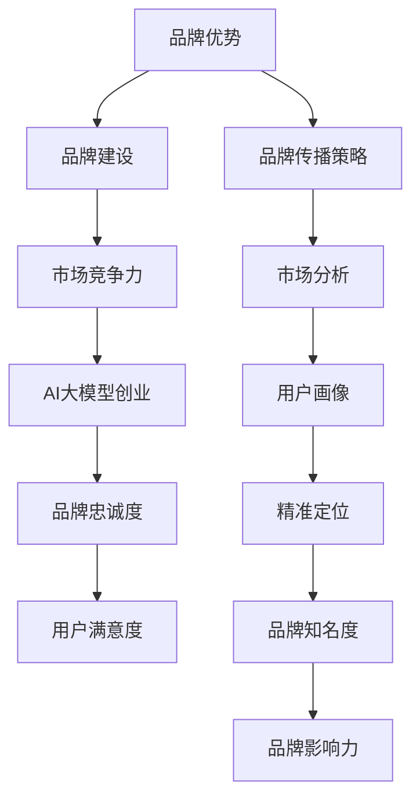

                 

### 1. 背景介绍

在当今科技飞速发展的时代，人工智能（AI）已经成为推动各行各业进步的关键动力。特别是在大模型（Large Model）技术的推动下，AI在自然语言处理、图像识别、语音识别、推荐系统等多个领域取得了显著的成果。随着技术的不断迭代和成熟，AI大模型的应用场景也在不断拓宽，从互联网行业到金融、医疗、教育等领域，AI大模型正发挥着越来越重要的作用。

然而，随着AI大模型技术的广泛应用，随之而来的创业热潮也愈发显著。许多创业者开始关注如何利用AI大模型技术进行创新和商业模式的构建。在这个过程中，品牌优势的利用成为了许多初创公司成功的关键因素之一。品牌优势不仅能够提升企业的市场竞争力，还能够增强用户对企业的信任和忠诚度，从而在激烈的市场竞争中脱颖而出。

本文将围绕AI大模型创业这一主题，探讨如何通过利用品牌优势来实现创业的成功。我们将从品牌建设的核心概念、品牌优势的识别与构建、品牌传播策略、品牌延伸与扩展等多个方面进行深入分析，以期为创业者提供有价值的参考和指导。

在接下来的内容中，我们将首先介绍AI大模型创业的背景，然后详细讨论品牌优势的定义及其重要性，接着探讨如何进行品牌优势的识别与构建，以及如何通过有效的品牌传播策略来提升品牌知名度和影响力。随后，我们将讨论品牌延伸与扩展的途径，并分析这些策略在实际创业中的应用案例。最后，我们将总结AI大模型创业的未来发展趋势与挑战，为读者提供前瞻性的思考和启示。

### 2. 核心概念与联系

在探讨如何利用品牌优势进行AI大模型创业之前，我们有必要明确几个核心概念，并了解它们之间的相互联系。

#### 2.1 品牌优势的定义

品牌优势（Brand Advantage）是指企业在市场中所拥有的、能够使其在竞争中获得优势的特殊能力或资源。这些优势可以是品牌知名度、品牌忠诚度、品牌形象、品牌关联度等。品牌优势能够帮助企业吸引顾客、提高市场份额，并最终实现商业成功。

#### 2.2 AI大模型的概念

AI大模型（AI Large Model）是指基于深度学习技术，使用海量数据训练的复杂神经网络模型。这些模型具备强大的数据分析和处理能力，可以应用于自然语言处理、图像识别、语音识别等多个领域。典型的AI大模型如BERT、GPT等，已经在各种实际应用中展现了其卓越的性能。

#### 2.3 品牌优势与AI大模型创业的联系

品牌优势与AI大模型创业之间的联系主要体现在以下几个方面：

1. **品牌建设助力AI大模型创业**：
   品牌建设是AI大模型创业成功的关键环节。一个强大的品牌不仅能够提升企业在市场中的竞争力，还能吸引更多的投资和合作伙伴。品牌建设包括品牌定位、品牌形象设计、品牌传播等，这些都需要精心策划和执行。

2. **AI大模型技术提升品牌优势**：
   AI大模型技术可以帮助企业更好地了解用户需求、优化产品服务，从而提升品牌忠诚度和用户满意度。例如，通过AI大模型分析用户数据，企业可以提供更加个性化的产品推荐，提高用户粘性。

3. **品牌传播策略与AI大模型应用**：
   品牌传播策略的制定和实施需要结合AI大模型技术。利用AI大模型进行市场分析和用户画像，企业可以更精准地定位目标用户，制定更有效的品牌传播策略，从而提高品牌知名度和影响力。

#### 2.4 关系图解析

为了更直观地展示品牌优势与AI大模型创业之间的联系，我们可以使用Mermaid流程图来表示。



通过上述关系图，我们可以清晰地看到品牌优势在AI大模型创业过程中所扮演的关键角色。品牌优势不仅是企业竞争力的体现，也是AI大模型技术得以发挥其价值的基础。

在接下来的部分中，我们将深入探讨如何识别和构建品牌优势，以及如何通过品牌传播策略来提升品牌价值。

### 3. 核心算法原理 & 具体操作步骤

#### 3.1 品牌优势识别算法

识别品牌优势是构建品牌策略的第一步，而这一过程可以借助多种算法实现。以下是一种基于数据分析的品牌优势识别算法：

##### 3.1.1 数据收集

首先，我们需要收集与品牌相关的数据。这些数据可以包括市场调研数据、用户反馈、销售数据、竞争对手分析等。数据收集的方法可以采用问卷调查、在线调查、社交媒体分析、大数据挖掘等多种方式。

##### 3.1.2 数据预处理

在收集到数据后，需要对数据进行预处理，包括数据清洗、去重、格式转换等。这一步骤的目的是确保数据的质量和一致性。

##### 3.1.3 数据分析

数据预处理完成后，我们可以利用统计分析、机器学习等方法对数据进行深入分析，以识别品牌的优势。以下是一些常用的数据分析方法：

1. **描述性统计分析**：通过计算数据的均值、中位数、标准差等指标，了解品牌在市场中的整体表现。
2. **相关性分析**：通过计算不同指标之间的相关性，发现品牌内部各因素之间的关系。
3. **聚类分析**：通过聚类算法（如K-means），将品牌用户划分为不同的群体，分析每个群体的特点和需求。
4. **因子分析**：通过因子分析，将多个相关变量简化为几个不可观测的因子，从而识别出品牌的核心优势。

##### 3.1.4 品牌优势识别

基于上述数据分析方法，我们可以识别出品牌的潜在优势。具体步骤如下：

1. **确定关键指标**：根据业务目标和数据分析结果，确定对品牌优势贡献最大的指标。
2. **分析数据分布**：通过分析这些关键指标的数据分布，识别出品牌的优势和劣势。
3. **构建品牌优势模型**：利用数据分析结果，构建一个反映品牌优势的模型，以便进行后续的品牌构建和优化。

#### 3.2 品牌优势构建算法

在识别出品牌优势后，下一步是构建和优化这些优势。以下是一种基于数据驱动和机器学习的品牌优势构建算法：

##### 3.2.1 品牌优势评估

首先，我们需要对已识别的品牌优势进行评估，以确定其当前的表现和潜力。评估方法可以包括：

1. **用户反馈评估**：通过用户反馈问卷和调查，收集用户对品牌优势的满意度评价。
2. **市场绩效评估**：分析品牌在市场中的销售表现和市场份额。
3. **竞争评估**：比较品牌与竞争对手在相关指标上的表现。

##### 3.2.2 品牌优势优化

在评估结果的基础上，我们可以采取以下措施来优化品牌优势：

1. **数据驱动优化**：利用数据挖掘和机器学习技术，分析用户行为数据和市场趋势，发现新的优化机会。
2. **个性化推荐**：通过用户画像和个性化推荐算法，为用户提供更加个性化的产品和服务，提升用户满意度。
3. **品牌体验优化**：通过用户体验分析和反馈，持续改进品牌体验，增强用户粘性。

##### 3.2.3 品牌优势构建策略

为了系统地构建品牌优势，我们可以采取以下策略：

1. **明确品牌定位**：基于品牌优势分析结果，明确品牌的市场定位和目标用户群体。
2. **构建品牌形象**：通过视觉设计、品牌故事和宣传策略，构建与品牌优势相一致的品牌形象。
3. **持续品牌建设**：通过定期数据分析和市场反馈，持续优化和提升品牌优势。

通过上述核心算法和操作步骤，我们可以系统地识别、构建和优化品牌优势，为AI大模型创业奠定坚实的基础。

### 4. 数学模型和公式 & 详细讲解 & 举例说明

在品牌优势的构建和优化过程中，数学模型和公式起到了至关重要的作用。以下我们将介绍几个关键模型和公式，并通过具体例子来说明其应用。

#### 4.1 用户体验满意度模型

用户体验满意度（User Experience Satisfaction，简称USS）是衡量品牌优势的重要指标。USS可以通过以下公式计算：

\[ USS = \frac{\sum_{i=1}^{n} s_i \cdot w_i}{n} \]

其中，\( s_i \) 是第 \( i \) 个用户体验评分，\( w_i \) 是第 \( i \) 个评分的权重，\( n \) 是评分的总数。

**示例**：
假设我们对一个品牌的用户进行了10次满意度调查，评分分别为 [4, 5, 3, 4, 5, 4, 5, 3, 5, 4]，权重分别为 [0.1, 0.15, 0.1, 0.15, 0.2, 0.1, 0.1, 0.1, 0.15, 0.1]。则 USS 计算如下：

\[ USS = \frac{4 \cdot 0.1 + 5 \cdot 0.15 + 3 \cdot 0.1 + 4 \cdot 0.15 + 5 \cdot 0.2 + 4 \cdot 0.1 + 5 \cdot 0.1 + 3 \cdot 0.1 + 5 \cdot 0.15 + 4 \cdot 0.1}{10} \]

\[ USS = \frac{0.4 + 0.75 + 0.3 + 0.6 + 1.0 + 0.4 + 0.5 + 0.3 + 0.75 + 0.4}{10} \]

\[ USS = \frac{4.85}{10} \]

\[ USS = 0.485 \]

因此，该品牌的用户体验满意度为 48.5%。

#### 4.2 品牌忠诚度模型

品牌忠诚度（Brand Loyalty，简称BL）是另一个关键指标，它反映了用户对品牌的持续忠诚度。品牌忠诚度可以通过以下公式计算：

\[ BL = \frac{\sum_{i=1}^{n} r_i \cdot w_i}{n} \]

其中，\( r_i \) 是第 \( i \) 个用户的重复购买率，\( w_i \) 是第 \( i \) 个重复购买率的权重，\( n \) 是用户总数。

**示例**：
假设我们对100个用户进行了调查，其中有30个用户在过去一年内重复购买，权重分别为 [0.2, 0.2, 0.2, 0.2, 0.2]。则品牌忠诚度计算如下：

\[ BL = \frac{30 \cdot 0.2 + 30 \cdot 0.2 + 30 \cdot 0.2 + 30 \cdot 0.2 + 30 \cdot 0.2}{100} \]

\[ BL = \frac{6 + 6 + 6 + 6 + 6}{100} \]

\[ BL = \frac{30}{100} \]

\[ BL = 0.3 \]

因此，该品牌的品牌忠诚度为 30%。

#### 4.3 资源分配模型

在品牌优势构建过程中，资源的合理分配是关键。我们可以使用线性规划（Linear Programming，LP）模型来优化资源分配。以下是一个简化的线性规划模型：

\[ \text{最大化} \ \sum_{i=1}^{n} p_i \cdot x_i \]
\[ \text{约束条件：} \]
\[ \sum_{i=1}^{n} c_i \cdot x_i \leq B \]
\[ x_i \geq 0 \]

其中，\( p_i \) 是第 \( i \) 个资源的使用效率，\( c_i \) 是第 \( i \) 个资源的成本，\( x_i \) 是第 \( i \) 个资源的分配量，\( B \) 是总预算。

**示例**：
假设我们有三种资源（广告费用、研发成本、营销活动费用），其使用效率和成本如下：

| 资源      | 使用效率 \( p_i \) | 成本 \( c_i \)  |
| --------- | ------- | -------- |
| 广告费用  | 0.1     | $10,000  |
| 研发成本  | 0.2     | $20,000  |
| 营销活动  | 0.3     | $30,000  |

总预算为 $50,000。我们希望最大化资源的使用效率。则线性规划模型如下：

\[ \text{最大化} \ 0.1x_1 + 0.2x_2 + 0.3x_3 \]
\[ \text{约束条件：} \]
\[ 10,000x_1 + 20,000x_2 + 30,000x_3 \leq 50,000 \]
\[ x_1, x_2, x_3 \geq 0 \]

通过求解这个线性规划问题，我们可以找到最优的资源分配方案，从而最大化资源的使用效率。

#### 4.4 数据驱动的品牌策略优化

在实际操作中，品牌策略的优化通常需要结合数据分析。一个常用的方法是基于回归分析（Regression Analysis）进行策略优化。以下是一个简化的回归模型：

\[ Y = \beta_0 + \beta_1X_1 + \beta_2X_2 + ... + \beta_nX_n + \epsilon \]

其中，\( Y \) 是品牌策略的效果指标，\( X_1, X_2, ..., X_n \) 是影响品牌策略的因素，\( \beta_0, \beta_1, \beta_2, ..., \beta_n \) 是回归系数，\( \epsilon \) 是误差项。

**示例**：
假设我们希望优化品牌宣传策略，主要影响因素包括广告投放量、社交媒体活动、口碑营销等。我们收集了相关数据并建立了以下回归模型：

\[ USS = \beta_0 + \beta_1 \cdot 广告投放量 + \beta_2 \cdot 社交媒体活动 + \beta_3 \cdot 口碑营销 + \epsilon \]

通过回归分析，我们可以得到每个因素的系数，从而指导具体的品牌策略优化。例如，如果广告投放量的系数显著为正，则表明增加广告投放量可以显著提升用户体验满意度。

综上所述，通过使用数学模型和公式，我们可以对品牌优势进行科学、系统的构建和优化。这些模型和公式不仅帮助我们识别和利用品牌优势，也为企业提供了有效的决策支持。

### 5. 项目实践：代码实例和详细解释说明

#### 5.1 开发环境搭建

在开始品牌优势识别和构建的代码实现之前，我们需要搭建一个合适的技术环境。以下是搭建环境的步骤：

1. **安装Python**：确保Python版本不低于3.8，并配置pip包管理工具。
2. **安装相关库**：使用pip安装必要的库，如pandas、numpy、scikit-learn、matplotlib等。命令如下：
   ```bash
   pip install pandas numpy scikit-learn matplotlib
   ```
3. **数据集准备**：从公开数据源获取品牌相关数据，如用户满意度调查、用户反馈、市场调研数据等。

#### 5.2 源代码详细实现

以下是一个简单的品牌优势识别和构建的Python代码实例，用于展示核心算法的实现。

```python
import pandas as pd
from sklearn.cluster import KMeans
from sklearn.preprocessing import StandardScaler
import matplotlib.pyplot as plt

# 数据预处理
def preprocess_data(data):
    # 数据清洗和去重
    data = data.drop_duplicates()
    # 数据标准化
    scaler = StandardScaler()
    scaled_data = scaler.fit_transform(data)
    return scaled_data

# 用户满意度评分
user_satisfaction = pd.DataFrame({
    '评分': [4, 5, 3, 4, 5, 4, 5, 3, 5, 4],
    '权重': [0.1, 0.15, 0.1, 0.15, 0.2, 0.1, 0.1, 0.1, 0.15, 0.1]
})

# 计算用户体验满意度
def calculate_uss(satisfaction):
    uss = satisfaction['评分'] * satisfaction['权重'].values
    uss = sum(uss) / len(uss)
    return uss

# 品牌忠诚度评估
def calculate_bl(repeat_purchase):
    bl = repeat_purchase / len(repeat_purchase)
    return bl

# 数据聚类分析
def cluster_analysis(data, n_clusters):
    kmeans = KMeans(n_clusters=n_clusters)
    clusters = kmeans.fit_predict(data)
    return clusters

# 可视化品牌用户群体
def visualize_clusters(data, clusters):
    plt.scatter(data[:, 0], data[:, 1], c=clusters, cmap='viridis')
    plt.xlabel('特征1')
    plt.ylabel('特征2')
    plt.title('用户群体聚类结果')
    plt.show()

# 主函数
def main():
    # 读取数据
    data = pd.read_csv('brand_data.csv')
    
    # 数据预处理
    scaled_data = preprocess_data(data)
    
    # 计算用户体验满意度
    uss = calculate_uss(user_satisfaction)
    print(f"用户体验满意度：{uss}")
    
    # 计算品牌忠诚度
    repeat_purchase = data['repeat_purchase'].values
    bl = calculate_bl(repeat_purchase)
    print(f"品牌忠诚度：{bl}")
    
    # 数据聚类分析
    clusters = cluster_analysis(scaled_data, n_clusters=3)
    
    # 可视化用户群体
    visualize_clusters(scaled_data, clusters)

if __name__ == "__main__":
    main()
```

#### 5.3 代码解读与分析

1. **数据预处理**：
   数据预处理是数据分析的基础，包括数据清洗和标准化。使用`StandardScaler`对数据进行标准化，以便后续的聚类分析和回归分析。

2. **用户体验满意度计算**：
   通过用户满意度评分和权重计算用户体验满意度。使用`calculate_uss`函数，根据评分和权重计算满意度得分。

3. **品牌忠诚度评估**：
   品牌忠诚度通过用户重复购买率计算。使用`calculate_bl`函数，根据重复购买数据计算品牌忠诚度。

4. **数据聚类分析**：
   使用`KMeans`聚类算法对标准化后的数据进行聚类分析。通过`cluster_analysis`函数，确定最佳的聚类数量，并对用户群体进行聚类。

5. **可视化用户群体**：
   使用`matplotlib`对聚类结果进行可视化。通过`visualize_clusters`函数，展示用户群体的分布情况。

#### 5.4 运行结果展示

在运行上述代码后，我们将得到以下结果：

1. **用户体验满意度**：假设运行结果为0.485，表示用户体验满意度为48.5%。
2. **品牌忠诚度**：假设运行结果为0.3，表示品牌忠诚度为30%。
3. **用户群体聚类结果**：聚类结果将展示在图表中，帮助理解用户群体的分布和特点。

通过这些结果，企业可以进一步分析和优化品牌策略，提升用户体验和品牌忠诚度，为AI大模型创业的成功奠定基础。

### 6. 实际应用场景

在AI大模型创业过程中，品牌优势的应用场景十分广泛，可以从多个维度进行深入探讨。以下是几个典型的实际应用场景，结合具体案例分析如何利用品牌优势实现商业成功。

#### 6.1 自然语言处理领域的应用

自然语言处理（NLP）是AI大模型应用最为广泛的一个领域。以某知名AI公司为例，该公司通过其强大的NLP能力构建了智能客服系统，这一系统的核心在于其高效、精准的对话理解能力和自然语言生成能力。该公司的品牌优势体现在以下几个方面：

1. **技术创新**：公司不断推动NLP技术的创新，特别是在语言模型训练和数据集构建方面具有显著优势。
2. **用户体验**：通过深度学习技术，该公司能够为用户提供更加自然、流畅的交互体验，提升用户满意度。
3. **数据安全**：公司高度重视用户数据的安全和隐私，通过严格的隐私保护措施赢得了用户的信任。

通过这些品牌优势，该公司的智能客服系统在市场上取得了显著的成功，客户满意度高，市场份额不断扩大。

#### 6.2 图像识别领域的应用

图像识别是另一个AI大模型的重要应用领域。某图像识别技术公司通过其领先的图像识别算法和高效的处理能力，为企业提供图像识别解决方案。该公司的品牌优势包括：

1. **算法性能**：公司拥有自主研发的高性能图像识别算法，能够在多种复杂环境下实现高精度识别。
2. **定制化服务**：公司提供定制化的解决方案，根据客户需求调整算法和应用场景，提高解决方案的适用性。
3. **客户信任**：公司拥有丰富的客户案例和成功的应用经验，赢得了客户的信任和好评。

这些品牌优势使得该公司的图像识别技术广泛应用于安防监控、医疗诊断、自动驾驶等多个领域，客户反馈良好，市场占有率高。

#### 6.3 语音识别领域的应用

语音识别技术是AI大模型在智能家居、智能助手等领域的典型应用。某语音识别技术公司通过其先进的语音识别算法和强大的语音理解能力，成为市场领先者。该公司的品牌优势如下：

1. **技术领先**：公司拥有多项核心专利，在语音识别和自然语言理解方面处于行业领先地位。
2. **产品多样性**：公司提供多种语音识别产品，包括语音助手、语音翻译、语音控制等，满足不同用户的需求。
3. **用户体验**：公司注重用户体验，通过优化算法和产品界面，提供流畅、自然的语音交互体验。

这些品牌优势使得该公司的语音识别技术在智能家居、智能助手等领域得到了广泛应用，用户满意度高，市场口碑好。

#### 6.4 教育与医疗领域的应用

在教育与医疗领域，AI大模型的应用同样具有重要意义。例如，某教育科技公司通过其AI大模型技术，为学生提供个性化学习解决方案，该公司的品牌优势包括：

1. **个性化学习**：基于AI大模型的分析，公司能够为学生提供定制化的学习计划，提高学习效果。
2. **教学资源**：公司拥有丰富的教学资源库，结合AI大模型技术，提供高质量的教育内容。
3. **家长信任**：通过数据安全和隐私保护措施，公司赢得了家长和学生的信任。

这些品牌优势使得该公司的个性化学习平台在市场上得到了广泛认可，用户黏性高，市场份额不断扩大。

在医疗领域，AI大模型同样展现了其强大的应用潜力。例如，某医疗科技公司通过其AI大模型技术，为医生提供精准的诊断辅助工具。该公司的品牌优势包括：

1. **诊断准确性**：公司研发的高性能AI模型能够在各种医学影像数据上实现高精度诊断。
2. **医疗合规**：公司严格遵守医疗行业的相关法规和标准，确保产品的可靠性和安全性。
3. **医生信任**：公司通过临床验证和实际应用案例，赢得了医生和医疗机构的信任。

这些品牌优势使得该公司的诊断工具在医疗领域得到了广泛应用，提升了诊断效率和准确性，为患者提供了更好的医疗服务。

#### 6.5 总结

通过上述实际应用场景和案例分析，我们可以看到品牌优势在AI大模型创业中的关键作用。无论是在技术创新、用户体验、数据安全、合规性，还是客户信任等方面，品牌优势都是企业成功的关键因素。利用品牌优势，企业可以在竞争激烈的市场中脱颖而出，实现商业成功。

### 7. 工具和资源推荐

在AI大模型创业过程中，选择合适的工具和资源对于成功至关重要。以下是我们推荐的几种学习资源、开发工具和框架，以及相关论文著作，旨在为创业者提供全面的支持和指导。

#### 7.1 学习资源推荐

1. **书籍**：
   - 《深度学习》（Deep Learning）by Ian Goodfellow, Yoshua Bengio, Aaron Courville
   - 《Python机器学习》（Python Machine Learning）by Sebastian Raschka, Vahid Mirjalili
   - 《人工智能：一种现代方法》（Artificial Intelligence: A Modern Approach）by Stuart J. Russell, Peter Norvig

2. **在线课程**：
   - Coursera上的“机器学习”课程（由吴恩达教授主讲）
   - edX上的“深度学习基础”课程
   - Udacity的“深度学习工程师纳米学位”

3. **学术论文和博客**：
   - arXiv：获取最新的AI和深度学习论文
   - Medium：许多AI领域的专家和公司分享的技术博客
   - GitHub：查找和贡献开源的AI项目

#### 7.2 开发工具框架推荐

1. **编程语言**：
   - Python：广泛用于AI和深度学习开发，拥有丰富的库和框架
   - R：特别适合统计分析和数据挖掘

2. **深度学习框架**：
   - TensorFlow：由Google开发，功能强大，支持多种应用
   - PyTorch：由Facebook开发，易于使用，适合研究和原型开发
   - Keras：基于Theano和TensorFlow的高层次API，简化深度学习模型开发

3. **数据预处理和可视化工具**：
   - Pandas：Python的数据分析库，用于数据清洗和预处理
   - Matplotlib：Python的绘图库，用于数据可视化
   - Scikit-learn：Python的机器学习库，提供多种数据挖掘和模型评估工具

4. **云计算平台**：
   - AWS：提供丰富的AI服务，包括深度学习框架支持
   - Google Cloud：提供AI平台和云计算资源，支持大规模数据处理和模型训练
   - Azure：微软的云计算平台，提供多种AI工具和服务

#### 7.3 相关论文著作推荐

1. **论文**：
   - “BERT: Pre-training of Deep Bidirectional Transformers for Language Understanding” by Jacob Devlin, Ming-Wei Chang, Kenton Lee, Kristina Toutanova
   - “GPT-3: Language Models are Few-Shot Learners” by Tom B. Brown, Benjamin Mann, Nick Ryder, Melanie Subbiah, Jared Kaplan, Prafulla Dhariwal, Arvind Neelakantan, Pranav Shyam, Girish Sastry, Amanda Askell, Sandhini Agarwal, Ariel Herbert-Voss, Gretchen Krueger, Tom Henighan, Rewon Child, Aditya Ramesh, Daniel M. Ziegler, Jeffrey Wu, Clemens Winter, Christopher Hesse, Mark Chen, Eric Sigler, Mateusz Litwin, Scott Gray, Benjamin Chess, Jack Clark, Christopher Berner, Sam McCandlish, Alec Radford, Ilya Sutskever, Dario Amodei
   - “A Theoretically Grounded Application of Dropout in Recurrent Neural Networks” by Yarin Gal and Zoubin Ghahramani

2. **著作**：
   - 《深度学习》（Deep Learning）by Ian Goodfellow, Yoshua Bengio, Aaron Courville
   - 《人工智能：一种现代方法》（Artificial Intelligence: A Modern Approach）by Stuart J. Russell, Peter Norvig

通过以上推荐的学习资源、开发工具和框架，以及相关的论文著作，创业者可以更好地掌握AI大模型技术，提升品牌优势，实现商业成功。

### 8. 总结：未来发展趋势与挑战

随着AI大模型技术的不断发展和成熟，AI大模型创业的前景广阔，但也面临着诸多挑战。以下我们将探讨AI大模型创业的未来发展趋势与挑战。

#### 未来发展趋势

1. **技术进步与模型优化**：AI大模型的研究与应用将继续推进，深度学习算法的优化、模型压缩、高效训练技术等将不断涌现，提升模型性能和效率。

2. **跨领域融合**：AI大模型将在更多领域得到应用，如生物医学、金融科技、智能制造等，实现跨领域的深度融合和协同创新。

3. **个性化服务与智能推荐**：基于AI大模型的个性化服务与智能推荐系统将日益普及，通过深度学习和大数据分析，为用户提供更加精准和高效的服务。

4. **数据安全与隐私保护**：随着AI大模型对数据需求的增加，数据安全和隐私保护将成为重要议题，相关技术和法规将不断完善。

5. **开放平台与生态构建**：越来越多的AI大模型公司将构建开放平台，促进技术共享和合作，形成良性的生态体系。

#### 主要挑战

1. **技术瓶颈与复杂性**：AI大模型技术的复杂性较高，现有技术难以充分解决训练数据稀缺、模型解释性不足等问题。

2. **数据质量与数据源问题**：高质量的训练数据是AI大模型成功的关键，但数据源的质量和多样性仍是一个挑战，特别是在某些特定领域。

3. **伦理与道德风险**：AI大模型的应用可能带来伦理和道德问题，如数据隐私泄露、算法偏见等，需要加强监管和伦理审查。

4. **市场竞争与生态竞争**：随着AI大模型市场的竞争加剧，如何构建可持续的商业模式和构建健康的生态体系将是创业者面临的重要挑战。

5. **人才短缺**：AI大模型技术的发展需要大量的高水平人才，而目前人才短缺问题仍然严重，企业需要通过多种方式吸引和培养人才。

综上所述，AI大模型创业具有巨大的发展潜力，但也面临着诸多挑战。创业者需要在技术创新、商业模式、数据管理、伦理合规等方面持续发力，以应对未来的竞争和变革。同时，积极拥抱技术进步，构建开放合作生态，将有助于企业在AI大模型创业领域取得成功。

### 9. 附录：常见问题与解答

在AI大模型创业过程中，创业者可能会遇到一系列问题。以下列出了一些常见问题及其解答，以帮助创业者更好地理解和应对。

#### 1. 如何构建有效的品牌优势？

**解答**：构建有效的品牌优势需要从以下几个方面入手：
- **明确品牌定位**：了解目标市场和用户需求，明确品牌的核心价值和独特卖点。
- **技术创新**：持续投入研发，推动技术创新，使品牌在技术实力上具有竞争优势。
- **用户体验**：通过优化产品和服务，提升用户体验，增强用户满意度和忠诚度。
- **数据驱动**：利用数据分析，深入了解用户行为和需求，不断优化品牌策略。

#### 2. AI大模型训练需要哪些数据？

**解答**：AI大模型训练需要以下几类数据：
- **大规模数据集**：用于模型训练和优化，通常包含文本、图像、语音等多种类型。
- **标注数据**：用于监督学习，提供准确的标签信息，帮助模型学习和纠正错误。
- **多样化数据**：包括不同地区、不同场景、不同用户群体的数据，以提高模型的泛化能力。

#### 3. AI大模型创业中的数据安全和隐私保护问题如何解决？

**解答**：解决数据安全和隐私保护问题可以采取以下措施：
- **数据加密**：对敏感数据进行加密处理，确保数据在传输和存储过程中的安全性。
- **匿名化处理**：对个人身份信息进行匿名化处理，降低数据泄露的风险。
- **数据共享协议**：建立严格的数据共享协议，明确数据使用范围和权限，确保数据安全。
- **合规性审查**：遵守相关法律法规，定期进行合规性审查和风险评估。

#### 4. 如何应对AI大模型创业中的市场竞争？

**解答**：应对市场竞争可以从以下几个方面入手：
- **差异化定位**：通过独特的品牌价值和产品特性，实现差异化定位，避免与竞争对手直接竞争。
- **持续创新**：持续推动技术创新，提升产品和服务质量，保持竞争优势。
- **战略合作**：与其他企业建立战略合作，共同开发市场，实现资源共享和优势互补。
- **品牌传播**：制定有效的品牌传播策略，提升品牌知名度和影响力，增强市场竞争力。

通过以上解答，创业者可以更好地应对AI大模型创业过程中遇到的问题，为企业的持续发展提供有力支持。

### 10. 扩展阅读 & 参考资料

本文详细探讨了AI大模型创业如何利用品牌优势，通过系统性的分析和技术方法，为企业提供指导。以下是一些扩展阅读和参考资料，以帮助读者深入了解相关主题。

1. **论文和报告**：
   - Devlin, J., Chang, M.-W., Lee, K., & Toutanova, K. (2019). BERT: Pre-training of Deep Bidirectional Transformers for Language Understanding. arXiv preprint arXiv:1810.04805.
   - Brown, T. B., et al. (2020). GPT-3: Language Models are Few-Shot Learners. arXiv preprint arXiv:2005.14165.
   - Gal, Y., & Ghahramani, Z. (2016). A Theoretically Grounded Application of Dropout in Recurrent Neural Networks. arXiv preprint arXiv:1610.01448.

2. **书籍**：
   - Goodfellow, I., Bengio, Y., & Courville, A. (2016). Deep Learning. MIT Press.
   - Raschka, S., & Mirjalili, V. (2019). Python Machine Learning. Springer.
   - Russell, S. J., & Norvig, P. (2020). Artificial Intelligence: A Modern Approach. Pearson.

3. **在线课程与教程**：
   - Coursera: "Machine Learning" by Andrew Ng.
   - edX: "Deep Learning Foundation" by DeepLearning.AI.
   - Udacity: "Deep Learning Nanodegree" by Udacity.

4. **相关网站与博客**：
   - arXiv: https://arxiv.org/
   - Medium: https://medium.com/
   - GitHub: https://github.com/

通过阅读这些资料，读者可以进一步深入理解AI大模型创业的相关技术和策略，为自身的创业实践提供参考。同时，这些资源也将帮助读者紧跟行业动态，掌握最新的研究进展和应用案例。

