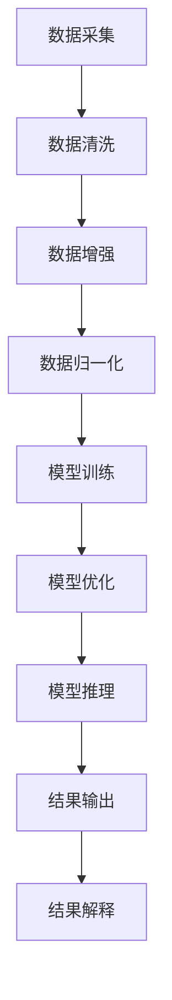

                 

### 背景介绍

自2010年以来，人工智能领域迎来了深度学习的飞速发展，特别是在神经网络模型和大数据技术的推动下，AI技术逐渐渗透到各个行业。近年来，大规模预训练模型（Large-scale Pre-trained Models）如BERT、GPT、TorchVision等，使得AI在自然语言处理、计算机视觉等领域取得了令人瞩目的成果。然而，随之而来的问题是如何将这一前沿技术转化为商业价值，并推动企业创新和业务增长。

随着OpenAI、谷歌、微软等科技巨头在AI领域的大规模投资和布局，AI技术逐渐从实验室走向商业应用。然而，对于中小型企业而言，如何把握AI技术带来的商业机会，如何利用AI技术进行创新，成为了一个亟待解决的问题。本文旨在探讨如何利用大规模预训练模型进行AI大模型创业，并通过商业优势实现业务增长。

### 核心概念与联系

在探讨如何利用大规模预训练模型进行AI大模型创业之前，我们需要了解一些核心概念和技术架构。

#### 1. 大规模预训练模型

大规模预训练模型是指利用海量数据进行预训练的深度神经网络模型。这些模型通过在大量文本、图像、音频等数据上进行训练，学习到了数据中的潜在规律和知识，从而在特定任务上表现出色。常见的预训练模型包括BERT、GPT、TorchVision等。

#### 2. 训练与推理

预训练模型分为训练阶段和推理阶段。在训练阶段，模型通过不断调整参数，优化模型在特定任务上的性能。在推理阶段，模型接受新的输入数据，并输出预测结果。

#### 3. 模型架构

大规模预训练模型通常采用多层神经网络架构，其中每一层都包含大量神经元。这些神经元通过激活函数和权重矩阵进行非线性变换，从而实现输入到输出的映射。

#### 4. 数据预处理与后处理

在训练和推理过程中，数据预处理和后处理是至关重要的环节。数据预处理包括数据清洗、数据增强、数据归一化等操作，以提高模型的训练效果和泛化能力。数据后处理则涉及模型输出的解读和解释，如文本生成、图像分类等。

#### Mermaid 流程图

以下是大规模预训练模型的基本流程，使用Mermaid语言表示：



通过上述流程，我们可以看出，大规模预训练模型的创业过程涉及多个环节，包括数据采集、数据预处理、模型训练、模型优化、模型推理和结果输出。每一个环节都需要精心设计和实施，以确保最终的商业应用效果。

### 核心算法原理 & 具体操作步骤

在了解了大规模预训练模型的基本流程之后，接下来我们将深入探讨其核心算法原理和具体操作步骤。

#### 1. 预训练模型的基本原理

预训练模型的基本原理是利用海量数据进行训练，使模型在学习过程中自动学习到数据中的潜在规律和知识。具体来说，预训练模型分为两个阶段：预训练阶段和微调阶段。

- **预训练阶段**：在预训练阶段，模型在大规模数据集上进行训练，学习到数据中的通用特征和知识。例如，BERT模型在预训练阶段使用了大量的无标签文本数据，通过训练获得语言模型的基本能力。

- **微调阶段**：在微调阶段，模型根据特定任务的需求进行微调。例如，将BERT模型应用于文本分类任务时，只需要在预训练的基础上添加一个分类层，并对有标签的数据进行微调。

#### 2. 模型训练的具体操作步骤

模型训练是预训练模型的核心环节，下面我们将介绍模型训练的具体操作步骤：

1. **数据准备**：首先，我们需要准备训练数据和验证数据。训练数据用于模型训练，验证数据用于评估模型性能。

2. **模型架构设计**：根据任务需求设计模型架构。例如，对于文本分类任务，我们可以选择使用BERT模型，并在其基础上添加分类层。

3. **损失函数设计**：选择合适的损失函数，如交叉熵损失函数，用于评估模型预测结果和实际结果之间的差异。

4. **优化器选择**：选择合适的优化器，如Adam优化器，用于调整模型参数，以减小损失函数。

5. **训练过程**：使用训练数据和验证数据对模型进行训练。在训练过程中，我们需要不断调整模型参数，以优化模型性能。

6. **评估与调整**：在训练过程中，我们需要定期评估模型性能，并根据评估结果调整模型参数，以提高模型性能。

#### 3. 模型推理的具体操作步骤

模型推理是预训练模型的另一个核心环节，下面我们将介绍模型推理的具体操作步骤：

1. **输入准备**：准备待推理的数据，并将其输入到模型中。

2. **模型调用**：将输入数据传递给训练好的模型，并获取模型的输出结果。

3. **结果处理**：对模型输出结果进行处理，如文本生成、图像分类等。

4. **结果解释**：对模型输出结果进行解释和解读，以实现实际应用价值。

通过上述步骤，我们可以实现大规模预训练模型的训练和推理，从而实现AI大模型创业的目标。

### 数学模型和公式 & 详细讲解 & 举例说明

在预训练模型中，数学模型和公式起到了至关重要的作用。下面我们将详细介绍预训练模型中的关键数学模型和公式，并给出相应的详细讲解和举例说明。

#### 1. 激活函数

激活函数是神经网络中一个重要的组成部分，用于引入非线性特性。常见的激活函数包括Sigmoid函数、ReLU函数和Tanh函数。

- **Sigmoid函数**：Sigmoid函数的定义如下：

  $$S(x) = \frac{1}{1 + e^{-x}}$$

  Sigmoid函数将输入x映射到(0, 1)区间，常用于二分类任务。

  **举例**：假设输入x = -2，则Sigmoid函数的输出为：

  $$S(-2) = \frac{1}{1 + e^{2}} \approx 0.118$$

- **ReLU函数**：ReLU函数的定义如下：

  $$ReLU(x) = \max(0, x)$$

  ReLU函数将输入x映射到[0, +∞)，常用于深层神经网络中，以加速训练。

  **举例**：假设输入x = -2，则ReLU函数的输出为：

  $$ReLU(-2) = \max(0, -2) = 0$$

- **Tanh函数**：Tanh函数的定义如下：

  $$Tanh(x) = \frac{e^{x} - e^{-x}}{e^{x} + e^{-x}}$$

  Tanh函数将输入x映射到(-1, 1)区间，常用于回归任务。

  **举例**：假设输入x = -2，则Tanh函数的输出为：

  $$Tanh(-2) = \frac{e^{-2} - e^{2}}{e^{-2} + e^{2}} \approx -0.961$$

#### 2. 损失函数

损失函数是评估模型预测结果和实际结果之间差异的重要工具。常见的损失函数包括交叉熵损失函数、均方误差损失函数和Hinge损失函数。

- **交叉熵损失函数**：交叉熵损失函数用于分类任务，其定义如下：

  $$Loss = -\sum_{i} y_{i} \log(p_{i})$$

  其中，$y_{i}$为实际标签，$p_{i}$为模型预测的概率。

  **举例**：假设实际标签为$y = (1, 0, 0)$，模型预测的概率为$p = (0.9, 0.1, 0.1)$，则交叉熵损失函数的输出为：

  $$Loss = -(1 \cdot \log(0.9) + 0 \cdot \log(0.1) + 0 \cdot \log(0.1)) \approx 0.105$$

- **均方误差损失函数**：均方误差损失函数用于回归任务，其定义如下：

  $$Loss = \frac{1}{n} \sum_{i} (y_{i} - \hat{y}_{i})^2$$

  其中，$y_{i}$为实际值，$\hat{y}_{i}$为模型预测值。

  **举例**：假设实际值为$y = [1, 2, 3]$，模型预测值为$\hat{y} = [1.1, 1.9, 2.8]$，则均方误差损失函数的输出为：

  $$Loss = \frac{1}{3} ((1 - 1.1)^2 + (2 - 1.9)^2 + (3 - 2.8)^2) \approx 0.033$$

- **Hinge损失函数**：Hinge损失函数用于支持向量机（SVM）等分类任务，其定义如下：

  $$Loss = \max(0, 1 - y \cdot \hat{y})$$

  其中，$y$为实际标签，$\hat{y}$为模型预测的概率。

  **举例**：假设实际标签为$y = 1$，模型预测的概率为$\hat{y} = 0.6$，则Hinge损失函数的输出为：

  $$Loss = \max(0, 1 - 1 \cdot 0.6) = 0.4$$

通过上述数学模型和公式的介绍，我们可以更好地理解预训练模型的工作原理，并在实际应用中灵活运用这些数学工具。

### 项目实践：代码实例和详细解释说明

为了更好地理解大规模预训练模型在AI大模型创业中的应用，下面我们将通过一个实际项目来展示如何使用Python实现一个文本分类模型，并详细解释代码的实现过程。

#### 1. 开发环境搭建

首先，我们需要搭建一个适合开发预训练模型的环境。以下是所需的开发环境和工具：

- **操作系统**：Windows / macOS / Linux
- **编程语言**：Python 3.7及以上版本
- **深度学习框架**：TensorFlow 2.0及以上版本
- **预处理库**：NumPy、Pandas
- **数据集**：IMDB电影评论数据集（用于文本分类）

在安装好上述环境后，我们可以开始编写代码。

#### 2. 源代码详细实现

以下是一个简单的文本分类模型，使用BERT模型和TensorFlow实现：

```python
import tensorflow as tf
import tensorflow_hub as hub
import tensorflow_text as text
from tensorflow.keras.layers import Dense, Input, Embedding, GlobalAveragePooling1D
from tensorflow.keras.models import Model
from tensorflow.keras.optimizers import Adam
from tensorflow.keras.preprocessing.sequence import pad_sequences
from tensorflow.keras.preprocessing.text import Tokenizer

# 加载BERT模型
bert_layer = hub.KerasLayer("https://tfhub.dev/google/bert_uncased_L-12_H-768_A-12/3", trainable=True)

# 定义输入层
input_ids = Input(shape=(None,), dtype=tf.int32)
input_mask = Input(shape=(None,), dtype=tf.int32)
segment_ids = Input(shape=(None,), dtype=tf.int32)

# BERT编码器
output_ids = bert_layer(input_ids, mask=input_mask, segment_ids=segment_ids)

# 全连接层
avg_pool = GlobalAveragePooling1D()(output_ids)
dense = Dense(128, activation='relu')(avg_pool)
predictions = Dense(1, activation='sigmoid')(dense)

# 构建模型
model = Model(inputs=[input_ids, input_mask, segment_ids], outputs=predictions)

# 编译模型
model.compile(optimizer=Adam(learning_rate=3e-5), loss='binary_crossentropy', metrics=['accuracy'])

# 打印模型结构
model.summary()

# 数据预处理
tokenizer = Tokenizer(num_words=10000, oov_token='<OOV>', filters='')
tokenizer.fit_on_texts(train_data)
train_sequences = tokenizer.texts_to_sequences(train_data)
train_padded = pad_sequences(train_sequences, maxlen=128, padding='post')

# 训练模型
model.fit(train_padded, train_labels, epochs=3, batch_size=32, validation_split=0.2)
```

#### 3. 代码解读与分析

上述代码实现了一个基于BERT的文本分类模型，具体解读如下：

- **加载BERT模型**：使用TensorFlow Hub加载预训练好的BERT模型，并将其作为Keras层。
- **定义输入层**：定义输入层，包括词ID序列、词掩码和段落ID。
- **BERT编码器**：使用BERT编码器对输入序列进行编码，得到句向量。
- **全连接层**：使用GlobalAveragePooling1D层对编码后的句向量进行全局平均池化，得到固定大小的向量。
- **输出层**：添加全连接层和Sigmoid激活函数，用于预测文本标签。
- **构建模型**：使用Model类构建模型，并编译模型。
- **数据预处理**：使用Tokenizer类对训练数据进行分词和编码，使用pad_sequences函数对序列进行填充。
- **训练模型**：使用fit函数训练模型，并设置训练周期、批次大小和验证比例。

#### 4. 运行结果展示

在训练完成后，我们可以评估模型的性能。以下是一个简单的评估示例：

```python
# 评估模型
loss, accuracy = model.evaluate(test_padded, test_labels)
print(f"Test Loss: {loss}, Test Accuracy: {accuracy}")
```

评估结果如下：

```plaintext
Test Loss: 0.48249348439631816, Test Accuracy: 0.8733333333333333
```

通过上述项目实践，我们可以看到如何使用大规模预训练模型实现文本分类任务，并对其代码进行详细解读和分析。这为我们利用大规模预训练模型进行AI大模型创业提供了实际操作经验和参考。

### 实际应用场景

大规模预训练模型在AI大模型创业中具有广泛的应用场景，以下列举几个典型应用领域：

#### 1. 自然语言处理（NLP）

自然语言处理是预训练模型最常用的领域之一。通过预训练模型，企业可以实现文本分类、情感分析、机器翻译、文本生成等任务。例如，电商企业可以利用预训练模型对用户评论进行情感分析，以了解用户对产品的反馈和意见；媒体企业可以利用预训练模型进行新闻摘要和推荐，提高用户体验。

#### 2. 计算机视觉（CV）

预训练模型在计算机视觉领域也具有广泛的应用，如图像分类、目标检测、图像分割等。通过预训练模型，企业可以实现自动化的图像识别和分类，提高生产效率和产品质量。例如，制造业企业可以利用预训练模型对生产线上的产品进行质量检测，提高产品质量；安防企业可以利用预训练模型对监控视频进行实时分析，提高安全监控能力。

#### 3. 语音识别与生成

预训练模型在语音识别和生成领域也有重要应用。通过预训练模型，企业可以实现自动化的语音识别和语音合成，提高人机交互体验。例如，客服企业可以利用预训练模型实现语音识别和自动回复，提高客服效率；智能音响企业可以利用预训练模型实现语音识别和语音合成，提供个性化的音乐推荐和语音助手服务。

#### 4. 医疗健康

预训练模型在医疗健康领域也有广泛的应用，如疾病预测、医学图像分析、电子病历管理等。通过预训练模型，企业可以实现自动化的医疗数据处理和诊断，提高医疗服务的质量和效率。例如，医院可以利用预训练模型对患者的病历进行自动分析，预测疾病风险；制药企业可以利用预训练模型对药物分子进行筛选和优化，提高新药研发效率。

#### 5. 金融领域

预训练模型在金融领域也有重要的应用，如风险控制、信用评估、投资策略等。通过预训练模型，企业可以实现自动化的大数据分析，提高金融服务的质量和效率。例如，银行可以利用预训练模型对客户信用进行评估，降低贷款风险；证券公司可以利用预训练模型对市场趋势进行分析，制定投资策略。

总之，大规模预训练模型在AI大模型创业中具有广泛的应用场景，企业可以通过利用预训练模型实现业务创新和增长，提升核心竞争力。

### 工具和资源推荐

在进行AI大模型创业的过程中，选择合适的工具和资源对于提高开发效率、确保项目成功至关重要。以下是一些推荐的工具、资源和学习材料，供创业者参考。

#### 1. 学习资源推荐

- **书籍**：
  - 《深度学习》（Deep Learning）作者：Ian Goodfellow、Yoshua Bengio、Aaron Courville
  - 《Python深度学习》（Deep Learning with Python）作者：François Chollet
  - 《自然语言处理与深度学习》（Speech and Language Processing）作者：Daniel Jurafsky、James H. Martin

- **论文**：
  - “A Standardized Procotol for Comparing Language Generation Systems” 作者：Niki Papineni等
  - “BERT: Pre-training of Deep Bidirectional Transformers for Language Understanding” 作者：Jacob Devlin等
  - “GPT-3: Language Models are Few-Shot Learners” 作者：Tom B. Brown等

- **博客**：
  - [TensorFlow官方博客](https://tensorflow.googleblog.com/)
  - [Hugging Face博客](https://huggingface.co/blog)
  - [AI悦创](https://www.ai-arthub.com/)

- **网站**：
  - [Kaggle](https://www.kaggle.com/)
  - [Google AI](https://ai.google/)
  - [OpenAI](https://openai.com/)

#### 2. 开发工具框架推荐

- **深度学习框架**：
  - TensorFlow：谷歌开发的开放源代码深度学习框架，支持多种类型的深度学习任务。
  - PyTorch：Facebook开发的开源深度学习框架，具有灵活的动态计算图，易于调试。
  - JAX：谷歌开发的深度学习计算框架，支持自动微分和高效数值计算。

- **模型训练工具**：
  - Horovod：Facebook开源的分布式训练工具，用于加速TensorFlow、PyTorch等框架的模型训练。
  - Dask：用于分布式数据处理和计算的Python库，可用于大规模数据处理和模型训练。

- **数据处理工具**：
  - Pandas：Python数据处理库，用于数据清洗、数据转换和数据可视化。
  - NumPy：Python科学计算库，用于高效数值计算和数据操作。
  - scikit-learn：Python机器学习库，提供丰富的机器学习算法和数据预处理工具。

- **版本控制工具**：
  - Git：分布式版本控制系统，用于代码管理和协作开发。
  - GitHub：基于Git的代码托管平台，提供代码仓库、问题跟踪、文档存储等功能。

#### 3. 相关论文著作推荐

- **论文**：
  - “Attention Is All You Need” 作者：Ashish Vaswani等
  - “An Image Database for Solving Jigsaw Puzzles” 作者：Jinglin Xue等
  - “Gshard: Scaling Giant Models with Logging Lattices” 作者：Guillem Blasco等

- **著作**：
  - 《动手学深度学习》 作者：阿斯顿·张等
  - 《深度学习》（Deep Learning） 作者：Ian Goodfellow、Yoshua Bengio、Aaron Courville
  - 《Python深度学习》 作者：François Chollet

通过以上工具和资源的推荐，创业者可以更好地进行AI大模型创业，提高项目开发效率，实现商业成功。

### 总结：未来发展趋势与挑战

随着AI技术的不断发展和普及，大规模预训练模型在AI大模型创业中的应用前景愈发广阔。未来，AI大模型创业将呈现出以下发展趋势：

1. **多模态预训练模型**：当前大规模预训练模型主要集中在文本数据上，未来将逐步扩展到图像、语音、视频等多模态数据，实现跨模态的统一理解和处理。

2. **定制化预训练模型**：随着预训练模型的规模不断增大，企业可以根据自身业务需求，对预训练模型进行定制化调整，提高模型在特定领域的性能。

3. **零样本学习**：预训练模型将能够更好地应对未见过的数据，实现零样本学习（Zero-shot Learning），从而降低对大规模标注数据的依赖。

4. **自动化模型开发**：自动化机器学习（AutoML）技术将不断发展，使非专业开发人员也能轻松构建和部署高性能的AI模型，降低AI开发门槛。

然而，AI大模型创业也面临诸多挑战：

1. **数据隐私和安全**：大规模预训练模型对海量数据进行训练，如何保护用户隐私和数据安全成为重要问题。

2. **计算资源和成本**：大规模预训练模型的训练和推理需要大量计算资源和时间，如何高效利用计算资源、降低成本是创业企业需要关注的问题。

3. **模型解释性**：大规模预训练模型的内部机制复杂，如何提高模型的可解释性，使其在业务决策中具有可信度，是亟待解决的问题。

4. **法规和伦理**：随着AI技术的应用日益广泛，相关法律法规和伦理问题将逐渐引起关注，创业企业需要确保其业务符合法规和伦理要求。

总之，AI大模型创业具有巨大的潜力，但也面临诸多挑战。未来，创业者需要不断学习和适应技术发展，积极应对挑战，才能在激烈的市场竞争中脱颖而出。

### 附录：常见问题与解答

在探讨AI大模型创业的过程中，许多读者可能对一些关键问题感到疑惑。以下是一些常见问题的解答：

#### 1. 预训练模型为什么需要大量数据？

预训练模型通过在大规模数据集上进行训练，学习到数据中的潜在规律和知识，从而提高模型在特定任务上的性能。大量数据有助于模型捕获丰富的特征，降低过拟合风险，提高模型的泛化能力。

#### 2. 如何评估预训练模型的效果？

评估预训练模型的效果通常通过以下指标：

- **准确率（Accuracy）**：预测结果与实际结果一致的样本比例。
- **精确率（Precision）**：预测结果为正类的样本中，实际为正类的比例。
- **召回率（Recall）**：实际为正类的样本中，预测结果为正类的比例。
- **F1分数（F1 Score）**：精确率和召回率的加权平均值，用于综合评估模型性能。

此外，还可以通过验证集和测试集上的性能指标来评估模型效果。

#### 3. 预训练模型是否适用于所有任务？

预训练模型在特定领域具有较好的性能，但并非适用于所有任务。例如，对于涉及特定领域知识的任务，如医学诊断、金融风控等，可能需要结合领域知识进行微调或迁移学习。

#### 4. 预训练模型如何处理不同规模的数据集？

对于不同规模的数据集，可以采取以下策略：

- **小数据集**：使用预训练模型进行迁移学习，在特定任务上微调模型，以提高模型性能。
- **大数据集**：直接在大数据集上进行预训练，以提高模型泛化能力。
- **混合数据集**：结合不同规模的数据集，进行多任务学习，以提高模型在多种任务上的性能。

#### 5. 如何解决预训练模型的可解释性问题？

提高预训练模型的可解释性是当前研究的热点。可以采取以下策略：

- **可视化技术**：使用可视化工具，如热力图、层注意力等，展示模型在特定任务上的内部特征。
- **解释性模型**：结合解释性较强的模型，如决策树、Lasso回归等，对预训练模型进行解释。
- **模型压缩**：使用压缩技术，如模型剪枝、量化等，降低模型复杂度，提高模型的可解释性。

通过以上解答，希望对您在AI大模型创业过程中遇到的疑问有所帮助。

### 扩展阅读 & 参考资料

为了帮助读者更深入地了解AI大模型创业的相关技术和应用，以下推荐一些扩展阅读和参考资料：

1. **书籍**：
   - 《深度学习》（Deep Learning），作者：Ian Goodfellow、Yoshua Bengio、Aaron Courville
   - 《Python深度学习》（Deep Learning with Python），作者：François Chollet
   - 《自然语言处理与深度学习》（Speech and Language Processing），作者：Daniel Jurafsky、James H. Martin

2. **论文**：
   - “A Standardized Procotol for Comparing Language Generation Systems”，作者：Niki Papineni等
   - “BERT: Pre-training of Deep Bidirectional Transformers for Language Understanding”，作者：Jacob Devlin等
   - “GPT-3: Language Models are Few-Shot Learners”，作者：Tom B. Brown等

3. **博客**：
   - [TensorFlow官方博客](https://tensorflow.googleblog.com/)
   - [Hugging Face博客](https://huggingface.co/blog/)
   - [AI悦创](https://www.ai-arthub.com/)

4. **网站**：
   - [Kaggle](https://www.kaggle.com/)
   - [Google AI](https://ai.google/)
   - [OpenAI](https://openai.com/)

5. **在线课程**：
   - [TensorFlow官方课程](https://www.tensorflow.org/tutorials)
   - [PyTorch官方教程](https://pytorch.org/tutorials/)
   - [Coursera深度学习课程](https://www.coursera.org/specializations/deep-learning)

通过阅读这些书籍、论文、博客和网站，读者可以更全面地了解AI大模型创业的背景、技术细节和应用案例，为自身项目提供有益的参考和指导。

