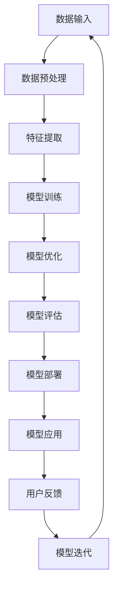

                 

### 背景介绍

随着人工智能技术的不断进步，特别是深度学习和大数据分析领域的突破，大模型（Large Models）已经成为当前AI领域的热点。大模型不仅能够处理复杂的问题，还能通过海量的数据学习并优化其性能。在这种趋势下，AI大模型创业成为了一种新兴的商业机会。然而，如何充分利用这些商业优势，实现成功创业，成为了许多创业者面临的重要问题。

首先，AI大模型创业的兴起源于技术进步和市场需求的双重推动。在过去，构建和训练一个大型AI模型需要大量的计算资源和专业知识。但随着云计算、GPU并行计算等技术的普及，这些门槛逐渐降低，使得更多创业者能够参与到这一领域。此外，随着AI在各行各业的广泛应用，市场对AI大模型的需求也在不断增长，为创业者提供了广阔的市场空间。

其次，AI大模型创业的优势在于其潜在的商业价值。一方面，大模型可以通过强大的数据处理能力和算法优化，为企业提供定制化的解决方案，从而提升企业的运营效率和竞争力。另一方面，大模型还可以用于开发各种创新产品和服务，如智能推荐、自动驾驶、语音识别等，这些都有望成为新的利润增长点。

然而，AI大模型创业也面临着一系列挑战。首先是技术挑战，构建和优化大模型需要深厚的技术积累和创新能力。其次是数据挑战，大模型需要大量的高质量数据进行训练，而数据的获取和处理同样是一大难题。最后是市场挑战，如何在激烈的市场竞争中脱颖而出，赢得用户的信任和市场份额，也是创业者需要面对的重要问题。

本文将围绕AI大模型创业的商业优势展开讨论，分析其成功的关键因素，并提供一些建议，帮助创业者更好地利用AI大模型实现商业成功。

## 1.1 技术进步与创业机会

AI大模型创业的兴起，首先得益于技术的快速进步。在过去的几十年中，计算机性能得到了显著提升，特别是GPU（图形处理单元）的广泛应用，为深度学习算法提供了强大的计算能力。这不仅降低了大模型的训练成本，还缩短了模型开发周期。此外，云计算技术的普及，也为创业者提供了便捷的计算资源和存储服务，使得构建和部署大模型变得更加容易。

在技术进步的推动下，深度学习算法在图像识别、自然语言处理、语音识别等领域取得了显著的成果。这些算法的突破，使得AI大模型在处理复杂任务时，能够达到甚至超越人类水平。例如，在图像识别领域，大模型ResNet通过堆叠多层卷积神经网络，成功实现了高精度的图像分类。在自然语言处理领域，大模型GPT-3通过预训练和微调技术，展现出了强大的语言理解和生成能力。

技术进步不仅为创业者提供了丰富的工具和资源，还创造了新的商业机会。一方面，大模型可以为企业提供定制化的解决方案，提升企业的运营效率和竞争力。例如，在医疗领域，AI大模型可以通过分析海量医疗数据，帮助医生进行诊断和预测，从而提高医疗服务的质量和效率。在金融领域，AI大模型可以用于风险控制和欺诈检测，帮助企业降低运营成本，提高风险管理能力。

另一方面，大模型还可以用于开发各种创新产品和服务。例如，在娱乐领域，AI大模型可以用于生成音乐、绘画等艺术作品，为用户带来全新的体验。在零售领域，AI大模型可以用于智能推荐系统，根据用户的行为和喜好，为其推荐个性化的商品和服务，从而提升用户体验和销售额。

总之，技术进步为AI大模型创业提供了广阔的空间和机会。随着深度学习和大数据分析技术的不断进步，大模型将在更多领域发挥重要作用，为创业者带来更多的商业价值。同时，创业者也需要紧跟技术发展趋势，不断学习和创新，才能在激烈的市场竞争中脱颖而出。

## 1.2 市场需求与商业潜力

在讨论AI大模型创业的市场需求与商业潜力时，我们首先需要理解当前市场对AI技术的强烈需求和日益增长的接受度。随着信息化和数字化转型的深入推进，各个行业都在积极探索如何通过AI技术来提升业务效率、创新服务模式、优化用户体验。这种趋势不仅推动了AI大模型的应用需求，也为其商业潜力奠定了基础。

### 行业应用趋势

AI大模型在多个行业展现出了巨大的应用潜力：

1. **医疗健康**：AI大模型可以通过分析大量的医疗数据，协助医生进行精准诊断和个性化治疗。例如，利用深度学习模型进行病理图像分析，可以提高癌症等疾病的早期诊断率。此外，AI还可以用于药物研发，通过模拟和预测药物的分子相互作用，加速新药研发进程。

2. **金融**：在金融领域，AI大模型被广泛应用于风险评估、欺诈检测、信用评分等方面。通过分析海量的交易数据和历史记录，AI大模型可以识别潜在的风险和异常行为，提高金融机构的安全性和运营效率。

3. **零售**：AI大模型可以用于个性化推荐系统，通过分析用户的购买历史和行为偏好，提供个性化的商品推荐，从而提升用户体验和销售额。同时，AI还可以用于库存管理和供应链优化，帮助企业降低运营成本。

4. **制造**：AI大模型在制造领域的应用包括质量检测、设备维护预测等。通过分析设备的运行数据和历史记录，AI大模型可以预测设备故障，提前进行维护，从而减少停机时间和维修成本。

5. **教育**：AI大模型可以用于个性化教育，通过分析学生的学习行为和学习数据，提供定制化的学习内容和辅导，提高学习效果。

### 商业潜力

AI大模型在以上行业中的应用，不仅提升了业务效率和效果，还带来了显著的商业潜力：

1. **成本节约**：AI大模型可以通过自动化和智能化，减少人力成本，提高生产效率。例如，在金融风控领域，AI大模型可以自动化处理大量的数据，减少人工审核的工作量，从而降低成本。

2. **营收增长**：AI大模型可以帮助企业开发新产品和服务，开拓新的市场。例如，在零售领域，通过智能推荐系统，企业可以增加销售量和客户满意度，从而实现营收增长。

3. **市场竞争力**：具备AI大模型技术的企业，可以在市场竞争中脱颖而出，获得竞争优势。例如，医疗领域的医疗机构通过引入AI大模型进行诊断和预测，可以提高服务质量和患者满意度，从而吸引更多的患者。

4. **数据洞察**：AI大模型通过分析大量的数据，可以为企业提供深入的数据洞察和决策支持。这有助于企业更好地了解市场和客户需求，制定有效的市场策略和运营计划。

总之，随着AI大模型技术的不断成熟和应用领域的拓展，其市场需求和商业潜力将愈发显著。创业者可以通过探索和利用AI大模型技术，在各个行业中寻找新的商机，实现商业成功。

## 1.3 技术门槛与创业挑战

尽管AI大模型在各个行业展现出了巨大的商业潜力，但创业者在进入这一领域时仍需面对一系列技术门槛和挑战。这些挑战不仅涉及技术本身，还涵盖了数据处理、模型优化、安全性和法律合规等多个方面。

首先，技术积累和创新能力是构建AI大模型的基础。构建一个高效的大模型不仅需要丰富的理论知识，还需要大量的实践经验。创业者需要具备深厚的机器学习和深度学习背景，了解各种先进的算法和技术，如神经网络架构搜索（Neural Architecture Search，NAS）、生成对抗网络（Generative Adversarial Networks，GAN）等。此外，随着模型的复杂度增加，对计算资源的需求也大幅上升，这要求创业者具备强大的技术积累和创新能力，以应对不断变化的技术挑战。

其次，数据处理是AI大模型成功的关键因素。AI大模型需要大量的高质量数据进行训练，以保证模型的准确性和泛化能力。然而，数据获取和处理过程充满挑战。一方面，数据的多样性和质量直接影响模型的性能；另一方面，数据的安全性和隐私保护也是不可忽视的问题。创业者需要设计完善的数据处理流程，确保数据的合法获取、存储和利用。

再次，模型优化是提升AI大模型性能的重要手段。大模型的优化不仅包括算法的改进，还包括参数调整、超参数优化等。这一过程需要大量的试验和调试，对创业者的技术水平和耐心提出了较高要求。此外，大模型的优化还涉及到计算资源的合理分配和利用，创业者需要具备良好的资源管理能力，以确保模型优化过程高效进行。

此外，安全性是AI大模型面临的重要挑战之一。大模型在处理敏感数据和执行关键任务时，必须确保系统的安全性和可靠性。创业者需要关注数据加密、访问控制、模型攻击防御等方面的安全问题，制定完善的安全策略和措施，以保护用户数据和系统安全。

最后，法律合规是创业者不可忽视的领域。随着AI技术的广泛应用，各国政府逐渐加强了对AI技术的监管。创业者需要了解和遵守相关的法律法规，如数据保护法（如欧盟的GDPR）、算法公平性和透明度要求等。这不仅有助于企业的合规经营，还能增强用户对AI技术的信任。

总之，AI大模型创业虽然前景广阔，但面临的挑战同样严峻。创业者需要具备全面的技术能力和深厚的业务理解，以克服这些挑战，实现商业成功。通过持续的技术创新和风险管理，创业者可以在AI大模型领域脱颖而出，为行业带来新的变革。

### 1.4 商业模式探讨

在探讨AI大模型创业的商业模式时，我们需要从多个角度来思考，如何将技术优势转化为实际的经济效益。以下是一些常见的商业模式，以及它们在实际运营中的具体策略。

#### 1. 软件即服务（SaaS）

软件即服务（SaaS）是一种通过互联网提供软件服务的商业模式，用户按需付费。对于AI大模型创业公司来说，SaaS模式具有以下优势：

- **低成本**：用户无需购买和维护昂贵的硬件设施，只需通过互联网访问即可使用服务。
- **高粘性**：通过提供持续更新的模型和功能，提高用户粘性。
- **快速推广**：互联网的普及使得SaaS模式易于推广，无需大规模线下营销。

**策略**：
1. **产品定价**：根据用户的需求和使用量进行灵活定价，提供不同级别的服务套餐。
2. **用户反馈**：及时收集用户反馈，不断优化产品功能和用户体验。
3. **合作伙伴**：与行业内的其他公司建立合作伙伴关系，扩大用户群体。

#### 2. 定制化服务

定制化服务是指根据客户的具体需求，量身定制解决方案。这种方式在需要高度定制化的行业（如医疗、金融）中尤为有效。

- **高价值**：定制化服务通常具有较高附加值，可以为企业带来更高的利润。
- **长期合作**：与客户建立长期合作关系，有助于稳定收入。

**策略**：
1. **深入了解客户需求**：通过市场调研和客户沟通，了解客户的具体需求。
2. **专业团队**：组建专业的技术团队，确保能够提供高质量的定制化服务。
3. **长期维护**：提供长期的技术支持和维护服务，确保客户满意。

#### 3. 投资回报合作

投资回报合作（Investment Return Partnership，IRP）模式是指创业公司与投资方合作，共同投资大模型项目的开发和运营，并按约定的比例分享收益。

- **资金支持**：为创业公司提供资金支持，减轻财务压力。
- **资源共享**：投资方通常具备丰富的行业资源和经验，有助于项目的成功。

**策略**：
1. **明确收益分配**：在合作合同中明确收益分配比例和条款。
2. **合作共赢**：确保合作方在项目中的利益，建立长期稳定的合作关系。
3. **风险共担**：合理分配风险，共同应对市场变化和技术挑战。

#### 4. 开放平台

开放平台模式是指创业公司通过开放API（应用程序编程接口）或SDK（软件开发工具包），允许第三方开发者在其平台上构建和部署应用程序。

- **生态扩展**：通过吸引第三方开发者，构建一个生态系统，扩大平台影响力。
- **多元化收入**：通过平台收费、广告收入、交易费用等多种方式实现收入多元化。

**策略**：
1. **技术支持**：提供全面的技术文档和开发工具，降低第三方开发者的门槛。
2. **市场推广**：积极推广平台，吸引更多的开发者加入。
3. **合作共赢**：与开发者建立良好的合作关系，共同推进平台的发展。

#### 5. 联合创新

联合创新模式是指创业公司与行业内的领先企业或研究机构合作，共同进行技术研究和产品开发。

- **技术突破**：通过合作，共享资源和知识，加速技术突破。
- **市场领先**：与行业巨头合作，有助于在市场上占据领先地位。

**策略**：
1. **选择合适合作伙伴**：选择在技术、市场、资源等方面具有互补优势的合作伙伴。
2. **明确合作目标**：制定明确的合作目标和任务，确保合作高效进行。
3. **知识产权保护**：确保合作成果的知识产权归属清晰，防止利益冲突。

总之，AI大模型创业的商业模式需要根据具体行业和市场环境进行灵活选择和优化。通过不断探索和创新，创业公司可以在激烈的市场竞争中找到适合自己的商业模式，实现可持续发展。

### 1.5 成功案例分析

在AI大模型创业领域，已有一些公司通过创新和努力取得了显著的成功，成为行业中的佼佼者。以下将分析几个具有代表性的成功案例，探讨它们的主要优势和创新之处。

#### 1. OpenAI

OpenAI是一家知名的人工智能研究公司，以其大模型GPT-3而闻名。GPT-3是一个具有1750亿参数的预训练语言模型，能够生成高质量的自然语言文本。OpenAI的成功得益于其以下几个方面的优势：

- **技术创新**：OpenAI通过大规模的深度学习模型和先进的训练技术，提升了模型的表现和效果。
- **开放平台**：OpenAI建立了一个开放的平台，允许开发者利用其模型构建应用程序，形成了良好的生态圈。
- **社区合作**：OpenAI积极与学术机构和开发者社区合作，共享技术和研究成果，推动了整个行业的发展。

#### 2. DeepMind

DeepMind是另一家在AI领域取得巨大成功的公司，其最具代表性的成就是开发出AlphaGo，这是一款能够击败人类围棋冠军的AI程序。DeepMind的成功主要在于以下几点：

- **深度强化学习**：DeepMind在深度强化学习领域进行了深入研究，开发了高效的算法和模型，使其在复杂任务中表现出色。
- **跨领域合作**：DeepMind与多个行业领先企业合作，将AI技术应用于医疗、能源等多个领域，实现了技术的商业转化。
- **持续创新**：DeepMind持续进行技术研究和创新，不断推出新的研究成果，保持了行业领先地位。

#### 3. ClearBay AI

ClearBay AI是一家专注于金融领域AI解决方案的公司，其成功主要表现在以下几个方面：

- **定制化服务**：ClearBay AI提供高度定制化的AI解决方案，根据客户的具体需求进行设计和优化，提高了解决方案的针对性和效果。
- **数据驱动**：ClearBay AI利用大数据分析和机器学习技术，为客户提供精准的风险评估和投资建议。
- **客户信任**：通过稳定的服务和良好的客户关系，ClearBay AI赢得了客户的信任，建立了长期的合作关系。

#### 4. Nuro

Nuro是一家专注于自动驾驶技术的公司，其无人驾驶小车R1已在美国部分地区进行测试。Nuro的成功因素包括：

- **技术创新**：Nuro在自动驾驶技术方面进行了多项创新，如多传感器融合、深度学习算法等，使其在安全性、可靠性和效率方面具有显著优势。
- **合作伙伴**：Nuro与多家物流和零售企业合作，为其提供自动驾驶解决方案，扩大了市场影响力。
- **用户友好**：Nuro注重用户体验，通过简洁、直观的界面设计，提高了用户对自动驾驶技术的接受度和满意度。

这些成功案例展示了AI大模型创业的多样性和可能性。通过技术创新、平台开放、定制化服务和跨领域合作，这些公司在各自的领域取得了显著成绩。这些案例也为其他创业者提供了宝贵的经验和启示，表明在AI大模型创业中，结合实际需求和技术优势，积极探索和创新，是实现商业成功的关键。

### 1.6 核心挑战与应对策略

尽管AI大模型创业具有广阔的前景，但创业者仍然需要面对一系列核心挑战，这些挑战不仅影响技术实现，还可能对企业的长期发展产生深远影响。以下将详细分析这些挑战，并提出相应的应对策略。

#### 1. 技术研发难度高

构建高性能的AI大模型需要深厚的技术积累和强大的研发能力。从算法设计到模型优化，每一个环节都需要大量的时间和精力。此外，随着模型的复杂度增加，对计算资源的需求也大幅上升。创业者需要面对的技术挑战包括：

- **算法选择与优化**：选择合适的算法并不断优化，以提高模型的性能和效率。
- **资源调度与管理**：合理分配和调度计算资源，确保模型训练过程高效进行。

**应对策略**：
- **技术积累**：组建专业的技术团队，保持对前沿技术的持续学习和研究。
- **开源合作**：积极参与开源项目，借鉴和学习其他研究机构的成果，降低研发难度。

#### 2. 数据获取与处理

AI大模型的训练需要大量的高质量数据，数据的质量和多样性直接影响模型的性能。然而，数据获取和处理过程充满挑战：

- **数据隐私和安全**：在获取和处理数据时，需要确保数据的隐私和安全，避免泄露用户信息。
- **数据清洗与预处理**：处理大量的原始数据，进行数据清洗和预处理，以提高数据的质量和一致性。

**应对策略**：
- **数据保护机制**：制定严格的数据保护政策，采用数据加密、访问控制等技术手段，确保数据安全。
- **数据清洗工具**：利用自动化工具进行数据清洗和预处理，提高数据处理效率。

#### 3. 模型优化与泛化能力

大模型的优化是一个复杂的过程，需要不断的试验和调整。此外，大模型的泛化能力也是一个重要问题，模型需要在不同的场景和任务中都能表现良好：

- **超参数调优**：通过超参数调优，寻找最优的模型参数组合，提高模型的表现。
- **迁移学习与微调**：利用迁移学习和微调技术，使模型在不同任务和场景中都能表现良好。

**应对策略**：
- **自动化调优工具**：采用自动化调优工具，如自动机器学习（AutoML），提高调优效率。
- **多任务训练**：通过多任务训练，增强模型的泛化能力，使其在不同任务中都能表现出色。

#### 4. 安全性与合规性

随着AI大模型在各个行业中的应用，其安全性和合规性越来越受到关注：

- **模型攻击防御**：设计完善的模型攻击防御机制，防止恶意攻击和模型篡改。
- **法律法规遵守**：遵守相关的法律法规，如数据保护法、算法公平性和透明度要求等。

**应对策略**：
- **安全测试与审查**：定期进行安全测试和代码审查，确保系统的安全性和可靠性。
- **合规培训与咨询**：定期对团队成员进行合规培训，并寻求专业的法律咨询，确保企业的合规经营。

#### 5. 市场竞争与差异化

在激烈的市场竞争中，创业者需要找到差异化的竞争优势，以脱颖而出：

- **技术创新**：通过持续的技术创新，提供独特的解决方案和产品。
- **用户体验**：注重用户体验，提供高质量的服务和产品，赢得用户的信任和忠诚。

**应对策略**：
- **研发投入**：加大对技术研发的投入，确保技术始终处于行业领先地位。
- **用户反馈**：积极收集用户反馈，不断优化产品和服务，提升用户满意度。

总之，AI大模型创业面临的核心挑战需要创业者从多个方面进行综合考虑和应对。通过技术创新、数据管理、模型优化、安全合规和市场竞争策略，创业者可以在激烈的市场竞争中找到自己的立足点，实现可持续发展。

### 1.7 创业者需具备的关键能力

在AI大模型创业领域，成功不仅依赖于技术优势，还需要创业者具备一系列关键能力。以下是创业者需具备的主要能力及其重要性：

#### 1. 技术能力

技术能力是AI大模型创业的核心，直接决定着企业的竞争力。创业者需要具备以下几方面的技术能力：

- **机器学习和深度学习**：理解并掌握先进的机器学习和深度学习算法，能够进行模型设计、训练和优化。
- **数据处理**：熟悉数据采集、清洗、存储和管理等技术，能够处理大规模数据。
- **编程技能**：掌握至少一种编程语言，如Python、C++等，能够编写高效、可靠的代码。
- **计算资源管理**：了解如何高效利用计算资源，包括云计算、GPU等，以优化模型训练和部署过程。

**重要性**：技术能力是创业者成功构建和优化AI大模型的基础，没有强大的技术支持，企业很难在激烈的市场竞争中立足。

#### 2. 商业洞察力

商业洞察力是创业者成功的关键因素之一，它帮助创业者抓住市场机会，制定有效的商业策略。以下是商业洞察力的重要表现：

- **市场需求分析**：能够准确分析市场需求，预测行业趋势，发现潜在商机。
- **商业模式设计**：设计合理的商业模式，确保企业能够实现盈利和可持续发展。
- **竞争策略**：分析竞争对手的优势和劣势，制定有效的竞争策略，提升市场占有率。

**重要性**：商业洞察力帮助创业者把握市场脉搏，制定正确的商业策略，实现企业快速发展。

#### 3. 团队管理能力

团队管理能力是创业者成功的重要保障，一个高效的团队能够推动企业快速发展。团队管理能力包括以下几个方面：

- **人员招聘与培养**：能够识别和吸引优秀人才，提供培训和职业发展机会，提高团队整体素质。
- **团队协作**：建立良好的团队协作机制，确保团队成员高效合作，共同实现目标。
- **冲突管理**：有效解决团队内部的冲突，维护团队的稳定和和谐。

**重要性**：团队管理能力是确保企业持续发展的重要保障，没有高效的团队，创业者很难实现个人愿景。

#### 4. 风险管理能力

在AI大模型创业过程中，创业者需要面对多种风险，包括技术风险、市场风险、财务风险等。风险管理能力是创业者应对这些风险的重要能力：

- **风险评估**：对可能面临的风险进行评估，制定相应的风险管理策略。
- **风险监控**：建立风险监控机制，及时识别和应对潜在风险。
- **风险应对**：制定有效的风险应对措施，降低风险对企业运营的影响。

**重要性**：风险管理能力是保障企业稳健运营的关键，缺乏有效的风险管理，企业可能会因为风险而陷入困境。

#### 5. 沟通与谈判能力

沟通与谈判能力是创业者成功的重要软技能，它帮助创业者与合作伙伴、投资者、客户等各方建立良好的关系：

- **沟通能力**：能够清晰、准确地表达自己的想法，有效传达信息。
- **谈判能力**：能够在谈判过程中灵活应对，达成双方满意的结果。

**重要性**：沟通与谈判能力是建立合作关系、获取资源、推动项目进展的重要保障。

总之，AI大模型创业需要创业者具备全面的能力，包括技术能力、商业洞察力、团队管理能力、风险管理能力和沟通与谈判能力。只有通过不断提升这些能力，创业者才能在激烈的市场竞争中脱颖而出，实现企业的可持续发展。

### 1.8 创业过程中的关键步骤与注意事项

在AI大模型创业过程中，从概念验证到商业落地，创业者需要经历多个关键步骤，并注意各个环节中的细节和潜在风险。以下是创业过程中的主要步骤及其注意事项：

#### 1. 概念验证（Proof of Concept, PoC）

概念验证是创业初期的重要步骤，旨在验证AI大模型技术的可行性和潜在价值。以下是概念验证的关键注意事项：

- **技术可行性**：通过小规模的实验和模拟，验证技术方案是否可行。
- **初步数据集**：收集和准备一个较小的数据集，用于初步测试和验证模型。
- **性能指标**：设定清晰的性能指标，如准确率、召回率等，以评估模型性能。

**注意事项**：
- **预算控制**：概念验证阶段通常需要较低的预算，确保资源合理分配。
- **快速迭代**：通过快速迭代，不断改进模型和算法，提高验证效果。

#### 2. 技术研发

在概念验证通过后，创业者需要进入技术研发阶段，构建和完善AI大模型。以下是技术研发阶段的关键注意事项：

- **算法选择**：根据业务需求和数据特点，选择合适的算法和框架。
- **模型优化**：通过超参数调优和模型调整，提高模型性能和效率。
- **计算资源管理**：合理利用云计算和GPU资源，优化模型训练过程。

**注意事项**：
- **代码质量控制**：编写规范、可维护的代码，确保项目可扩展性和可维护性。
- **技术文档**：编写详细的技术文档，便于团队成员理解和后续维护。

#### 3. 产品开发

在技术研发阶段完成后，创业者需要将技术成果转化为实际产品。以下是产品开发阶段的关键注意事项：

- **用户需求分析**：深入了解用户需求，设计符合用户期望的产品功能。
- **用户体验设计**：注重用户体验，设计简洁、直观的用户界面。
- **产品迭代**：通过用户反馈和测试，不断优化产品功能和性能。

**注意事项**：
- **版本控制**：使用版本控制系统，确保代码和文档的一致性和可追溯性。
- **自动化测试**：建立自动化测试框架，确保产品质量和稳定性。

#### 4. 商业化推广

在产品开发完成后，创业者需要制定商业推广策略，将产品推向市场。以下是商业化推广阶段的关键注意事项：

- **市场调研**：分析市场需求，确定目标用户群体和市场定位。
- **营销策略**：设计有效的营销策略，如社交媒体宣传、内容营销等。
- **合作伙伴关系**：与行业内的合作伙伴建立合作关系，共同推广产品。

**注意事项**：
- **预算规划**：合理分配推广预算，确保营销活动的有效性和成本效益。
- **数据跟踪**：通过数据跟踪和分析，评估营销活动的效果，及时调整策略。

#### 5. 商业落地

在产品推广和市场反馈良好后，创业者需要将产品正式推向市场，实现商业化落地。以下是商业落地阶段的关键注意事项：

- **客户关系管理**：建立良好的客户关系，提供优质的服务和产品支持。
- **持续迭代**：根据市场反馈和用户需求，不断优化产品功能和性能。
- **商业模式调整**：根据市场反馈和商业效果，及时调整商业模式，实现盈利。

**注意事项**：
- **合规性审查**：确保产品符合相关法律法规要求，避免潜在的法律风险。
- **风险预警**：建立风险预警机制，及时发现和应对市场变化和潜在风险。

通过以上关键步骤和注意事项，创业者可以有条不紊地进行AI大模型创业，实现商业成功。

## 2. 核心概念与联系

在深入探讨AI大模型创业之前，我们首先需要了解一些核心概念，这些概念不仅构成了AI大模型的基础，而且也是理解其商业潜力和技术挑战的关键。以下是AI大模型创业中需要掌握的几个核心概念，以及它们之间的联系。

### 2.1 深度学习

深度学习（Deep Learning）是一种机器学习（Machine Learning）的重要分支，其核心思想是通过多层神经网络（Neural Networks）对数据进行自动特征提取和学习。与传统的机器学习方法相比，深度学习能够处理更复杂的数据结构和模式，从而在图像识别、自然语言处理、语音识别等领域取得了显著突破。

#### 2.1.1 神经网络架构

神经网络是深度学习的基础，它由大量的神经元（Node）和连接（Connection）构成。每个神经元都接收来自其他神经元的输入，并通过一个权重（Weight）进行加权求和，最后通过一个激活函数（Activation Function）产生输出。常见的神经网络架构包括卷积神经网络（Convolutional Neural Networks, CNN）、循环神经网络（Recurrent Neural Networks, RNN）和生成对抗网络（Generative Adversarial Networks, GAN）等。


#### 2.1.2 深度学习算法

深度学习算法包括前向传播（Forward Propagation）和反向传播（Backpropagation）等。前向传播是指将输入数据通过神经网络逐层传递，直到生成预测输出；反向传播则是通过计算误差，调整网络中的权重和偏置，以优化模型性能。


### 2.2 大模型

大模型（Large Models）是指具有数百万甚至数十亿参数的神经网络模型。与小型模型相比，大模型能够处理更复杂的任务，并从大量数据中提取更细微的特征。然而，大模型也带来了更高的计算成本和训练难度。

#### 2.2.1 大模型的挑战

大模型的主要挑战包括：

- **计算资源需求**：训练大模型需要大量的计算资源和时间。
- **数据需求**：大模型需要大量的高质量数据进行训练，以保证其性能和泛化能力。
- **优化难度**：大模型的优化过程更加复杂，需要高效的算法和策略。

#### 2.2.2 大模型的优点

大模型的优点包括：

- **更强的泛化能力**：大模型能够从海量数据中学习到更广泛的模式，提高模型的泛化能力。
- **更高的任务处理能力**：大模型能够处理更复杂的任务，如多模态数据融合和长文本生成等。

### 2.3 商业模式

在AI大模型创业中，选择合适的商业模式至关重要。常见的商业模式包括软件即服务（SaaS）、定制化服务、投资回报合作和开放平台等。

#### 2.3.1 软件即服务（SaaS）

SaaS模式通过互联网提供软件服务，用户按需付费。这种模式具有低成本、高粘性等优点，适用于需要持续更新和维护的大模型服务。


#### 2.3.2 定制化服务

定制化服务根据客户的具体需求，提供高度定制化的解决方案。这种模式适用于需要高度定制化的行业，如医疗和金融。


#### 2.3.3 投资回报合作

投资回报合作模式通过合作方共同投资和分享收益，降低创业者的财务压力，并利用合作伙伴的资源扩大市场影响力。


#### 2.3.4 开放平台

开放平台通过开放API或SDK，允许第三方开发者在其平台上构建应用程序。这种模式有助于构建生态系统，吸引更多开发者参与，从而扩大平台的影响力和用户基础。


### 2.4 数据处理与模型优化

数据处理和模型优化是AI大模型创业中至关重要的一环。有效的数据处理可以提高模型性能，而优化的模型可以更好地应对复杂任务。

#### 2.4.1 数据处理

数据处理包括数据采集、清洗、预处理和存储等步骤。高质量的数据是训练高效模型的基础，因此，数据处理的质量直接影响模型的表现。


#### 2.4.2 模型优化

模型优化包括超参数调优、模型结构调整和迁移学习等。优化的模型可以提高任务处理能力，并降低计算资源的需求。


### 2.5 安全性与合规性

随着AI大模型在各个行业中的应用，其安全性和合规性越来越受到关注。确保模型的安全性和合规性是创业者必须面对的重要挑战。

#### 2.5.1 模型攻击防御

模型攻击防御包括数据中毒、模型篡改和对抗样本等。创业者需要设计有效的防御机制，保护模型的安全性和可靠性。


#### 2.5.2 法律法规遵守

遵守相关的法律法规，如数据保护法、算法公平性和透明度要求等，是创业者必须遵守的基本原则。这有助于确保企业的合规经营，增强用户对AI技术的信任。


通过以上核心概念和联系的介绍，我们可以更好地理解AI大模型创业的基本原理和关键要素。在实际创业过程中，创业者需要综合考虑这些概念，制定合适的技术策略和商业计划，以实现商业成功。

### 2.5.1 大模型架构的Mermaid流程图

以下是AI大模型架构的Mermaid流程图，展示了从数据输入到模型输出的一系列关键步骤：



在这个流程图中：

- **A：数据输入**：将原始数据输入到系统中。
- **B：数据预处理**：清洗和转换数据，使其适合模型训练。
- **C：特征提取**：从预处理后的数据中提取有用的特征。
- **D：模型训练**：使用训练数据对模型进行训练。
- **E：模型优化**：调整模型参数，提高模型性能。
- **F：模型评估**：使用验证数据评估模型性能。
- **G：模型部署**：将训练好的模型部署到实际应用中。
- **H：模型应用**：在具体任务中使用模型进行预测或决策。
- **I：用户反馈**：收集用户对模型应用的反馈。
- **J：模型迭代**：根据用户反馈和评估结果，对模型进行迭代改进，返回到数据输入阶段。

通过这个流程图，我们可以清晰地看到AI大模型从训练到应用的全过程，以及各个环节之间的联系。这不仅有助于理解大模型的工作原理，也为创业者提供了参考，以便在实际项目中有效组织和管理模型开发与优化工作。

### 2.6 核心算法原理与具体操作步骤

在AI大模型创业中，核心算法的选择和实现是确保模型性能和效果的关键。以下将详细介绍几个常用的核心算法及其具体操作步骤。

#### 2.6.1 卷积神经网络（CNN）

卷积神经网络（Convolutional Neural Network，CNN）是处理图像识别、物体检测等视觉任务的重要算法。CNN通过卷积层、池化层和全连接层等结构，实现对图像的特征提取和分类。

**具体操作步骤**：

1. **数据预处理**：将图像数据转换为固定尺寸，并进行归一化处理。
2. **卷积层**：通过卷积运算提取图像特征，卷积核滑动覆盖图像，进行特征映射。
3. **激活函数**：使用ReLU（Rectified Linear Unit）等激活函数增加网络的非线性。
4. **池化层**：使用最大池化或平均池化对特征图进行降维。
5. **卷积层与池化层的重复堆叠**：通过多次堆叠卷积和池化层，提取更高级别的特征。
6. **全连接层**：将卷积层的输出通过全连接层进行分类。
7. **损失函数与优化器**：使用交叉熵损失函数和梯度下降优化器等训练模型。


#### 2.6.2 生成对抗网络（GAN）

生成对抗网络（Generative Adversarial Network，GAN）是一种通过两个对抗网络（生成器和判别器）相互博弈进行训练的算法。生成器尝试生成逼真的数据，而判别器则努力区分真实数据和生成数据。

**具体操作步骤**：

1. **生成器**：生成器通过随机噪声生成数据，目标是使其尽可能真实。
2. **判别器**：判别器接收真实数据和生成数据，目标是正确区分两者。
3. **对抗训练**：生成器和判别器交替进行训练，生成器尝试提高生成数据的真实性，而判别器则提高区分能力。
4. **损失函数**：使用对抗损失函数，如Wasserstein距离或L2损失，优化生成器和判别器。
5. **梯度惩罚**：在生成器损失函数中加入梯度惩罚项，防止梯度消失。


#### 2.6.3 循环神经网络（RNN）

循环神经网络（Recurrent Neural Network，RNN）适用于处理序列数据，如时间序列、语音和文本等。RNN通过记忆状态，实现对序列数据的建模。

**具体操作步骤**：

1. **序列输入**：将序列数据输入到RNN中。
2. **隐藏状态更新**：RNN通过前向传播计算当前时间步的隐藏状态，并更新记忆。
3. **激活函数**：使用ReLU等激活函数增加网络的非线性。
4. **反向传播**：通过反向传播算法，计算梯度并更新网络权重。
5. **门控机制**：门控RNN（如LSTM和GRU）通过门控机制控制信息的流动，防止梯度消失。
6. **输出层**：使用softmax等激活函数进行分类或回归。


#### 2.6.4 转移学习

转移学习（Transfer Learning）是一种利用预训练模型进行快速训练的方法。通过在预训练模型的基础上微调，可以大幅缩短训练时间并提高模型性能。

**具体操作步骤**：

1. **选择预训练模型**：选择在大量数据上预训练的模型，如ImageNet上的CNN模型。
2. **数据预处理**：对目标数据进行预处理，使其与预训练模型相匹配。
3. **模型微调**：将预训练模型的权重作为初始化权重，并在目标数据上继续训练。
4. **损失函数与优化器**：使用适当的损失函数和优化器，如交叉熵和Adam，进行训练。
5. **模型评估**：在测试集上评估模型性能，并进行调整和优化。


通过以上核心算法的介绍和具体操作步骤，创业者可以更好地选择和实现适合自身业务需求的AI大模型。这些算法不仅提高了模型性能，还缩短了开发周期，为AI大模型创业提供了强大的技术支持。

### 2.7 数学模型和公式

在AI大模型创业过程中，数学模型和公式是理解和优化算法的核心工具。以下是几个关键数学模型及其详细讲解，包括相关公式和示例说明。

#### 2.7.1 损失函数

损失函数是评估模型预测结果与实际结果之间差异的数学工具。以下是几种常用的损失函数：

**1. 交叉熵损失（Cross-Entropy Loss）**

交叉熵损失函数常用于分类任务，其公式如下：

\[ L = -\sum_{i} y_i \log(p_i) \]

其中，\( y_i \)是实际标签，\( p_i \)是模型预测的概率。

**示例**：

假设有一个二分类问题，实际标签为\( y = [1, 0, 1, 0] \)，模型预测的概率为\( p = [0.8, 0.2, 0.6, 0.4] \)。则交叉熵损失为：

\[ L = -[1 \cdot \log(0.8) + 0 \cdot \log(0.2) + 1 \cdot \log(0.6) + 0 \cdot \log(0.4)] \approx 0.985 \]

**2. 均方误差（Mean Squared Error, MSE）**

均方误差损失函数常用于回归任务，其公式如下：

\[ L = \frac{1}{n} \sum_{i=1}^{n} (y_i - \hat{y}_i)^2 \]

其中，\( y_i \)是实际值，\( \hat{y}_i \)是模型预测值，\( n \)是样本数量。

**示例**：

假设有一个回归问题，实际值为\( y = [3, 5, 7, 9] \)，模型预测值为\( \hat{y} = [2.9, 5.1, 7.1, 9.2] \)，则均方误差损失为：

\[ L = \frac{1}{4} \sum_{i=1}^{4} (y_i - \hat{y}_i)^2 = \frac{1}{4} \sum_{i=1}^{4} (0.1^2 + 0.1^2 + 0.2^2 + 0.1^2) \approx 0.125 \]

**3. 对抗损失（Adversarial Loss）**

对抗损失函数用于生成对抗网络（GAN），其公式如下：

\[ L_G = -\log(D(G(z))) \]
\[ L_D = -[\log(D(x)) + \log(1 - D(G(z)))] \]

其中，\( G \)是生成器，\( D \)是判别器，\( z \)是随机噪声。

**示例**：

假设生成器生成的数据为\( G(z) \)，判别器对其的判别概率为\( D(G(z)) = 0.7 \)，真实数据的判别概率为\( D(x) = 0.9 \)。则生成器和判别器的对抗损失分别为：

\[ L_G = -\log(0.7) \approx 0.356 \]
\[ L_D = -[\log(0.9) + \log(0.1)] \approx 0.235 \]

#### 2.7.2 激活函数

激活函数是神经网络中引入非线性因素的关键组成部分，以下是几种常用的激活函数：

**1. ReLU（Rectified Linear Unit）**

ReLU函数公式如下：

\[ f(x) = \max(0, x) \]

**示例**：

对于输入值\( x = [-2, -1, 0, 1, 2] \)，ReLU输出为\[ [0, 0, 0, 1, 2] \]。

**2. Sigmoid**

Sigmoid函数公式如下：

\[ f(x) = \frac{1}{1 + e^{-x}} \]

**示例**：

对于输入值\( x = [-2, -1, 0, 1, 2] \)，Sigmoid输出为\[ [0.1192, 0.2689, 0.5, 0.7311, 0.8808] \]。

**3. Tanh**

Tanh函数公式如下：

\[ f(x) = \frac{e^x - e^{-x}}{e^x + e^{-x}} \]

**示例**：

对于输入值\( x = [-2, -1, 0, 1, 2] \)，Tanh输出为\[ [-0.7616, -0.2689, 0, 0.2689, 0.7616] \]。

#### 2.7.3 反向传播算法

反向传播算法是训练神经网络的核心算法，用于计算网络参数的梯度并更新权重。以下是反向传播算法的基本步骤：

**1. 前向传播**

计算网络输出，计算每个神经元的激活值。

**2. 计算误差**

计算实际输出与预测输出之间的误差。

**3. 反向传播**

从输出层开始，反向计算每个神经元的误差梯度，并更新权重。

**示例**：

假设有一个简单的神经网络，包含一个输入层、一个隐藏层和一个输出层。输入为\( x = [1, 2] \)，目标为\( y = [0, 1] \)。隐藏层激活函数为ReLU，输出层为Sigmoid。

**前向传播**：

输入层：\[ z_1 = x \]

隐藏层：\[ a_1 = ReLU(z_1) \]

输出层：\[ z_2 = w_{21} a_1 + w_{22} \]

\[ \hat{y} = Sigmoid(z_2) \]

**计算误差**：

实际输出：\[ y = [0, 1] \]

预测输出：\[ \hat{y} = [0.7321, 0.2679] \]

误差：\[ E = (y - \hat{y})^2 \]

**反向传播**：

计算输出层误差梯度：

\[ \frac{\partial E}{\partial z_2} = (y - \hat{y}) \cdot (1 - \hat{y}) \]

计算隐藏层误差梯度：

\[ \frac{\partial E}{\partial z_1} = \frac{\partial E}{\partial z_2} \cdot w_{21} \cdot (1 - a_1) \]

**更新权重**：

使用梯度下降更新权重：

\[ w_{21} = w_{21} - \alpha \cdot \frac{\partial E}{\partial w_{21}} \]

\[ w_{22} = w_{22} - \alpha \cdot \frac{\partial E}{\partial w_{22}} \]

通过以上数学模型和公式的讲解，我们可以更深入地理解AI大模型的工作原理和优化方法。在实际应用中，创业者可以根据这些理论指导，设计和实现高效的大模型算法，提升模型的性能和应用效果。

### 2.8 项目实践：代码实例和详细解释说明

在了解了AI大模型的相关理论和算法之后，接下来我们将通过一个具体的代码实例，来展示如何构建和训练一个AI大模型，并提供详细的解释说明。

#### 2.8.1 开发环境搭建

在进行AI大模型项目开发之前，首先需要搭建合适的开发环境。以下是推荐的开发环境配置：

- **编程语言**：Python
- **深度学习框架**：TensorFlow或PyTorch
- **计算资源**：GPU（NVIDIA CUDA兼容显卡）或云计算平台（如Google Colab、AWS SageMaker等）

**安装步骤**：

1. 安装Python环境：在官方网站（https://www.python.org/）下载并安装Python，选择合适的版本（例如3.8以上版本）。
2. 安装深度学习框架：通过pip命令安装TensorFlow或PyTorch。

对于TensorFlow：

```bash
pip install tensorflow
```

对于PyTorch：

```bash
pip install torch torchvision
```

3. 安装GPU支持：如果使用GPU训练模型，还需要安装CUDA和cuDNN库。

**安装CUDA**：

下载并安装适合自己GPU版本的CUDA，可以从NVIDIA官网（https://developer.nvidia.com/cuda-downloads）获取。

**安装cuDNN**：

从NVIDIA官网下载cuDNN库，并按照官方文档（https://docs.nvidia.com/deeplearning/cudnn/install-cudnn-releases/index.html）进行安装。

#### 2.8.2 源代码详细实现

以下是一个使用TensorFlow构建和训练一个简单的图像分类模型的代码实例，包括数据准备、模型定义、训练和评估等步骤。

```python
import tensorflow as tf
from tensorflow.keras import layers, models
import numpy as np
import matplotlib.pyplot as plt

# 数据准备
# 这里使用TensorFlow内置的CIFAR-10数据集
(x_train, y_train), (x_test, y_test) = tf.keras.datasets.cifar10.load_data()

# 数据预处理
x_train = x_train.astype('float32') / 255
x_test = x_test.astype('float32') / 255
x_train = np.reshape(x_train, (-1, 32, 32, 3))
x_test = np.reshape(x_test, (-1, 32, 32, 3))

# 转换标签为独热编码
num_classes = 10
y_train = tf.keras.utils.to_categorical(y_train, num_classes)
y_test = tf.keras.utils.to_categorical(y_test, num_classes)

# 模型定义
model = models.Sequential()
model.add(layers.Conv2D(32, (3, 3), activation='relu', input_shape=(32, 32, 3)))
model.add(layers.MaxPooling2D((2, 2)))
model.add(layers.Conv2D(64, (3, 3), activation='relu'))
model.add(layers.MaxPooling2D((2, 2)))
model.add(layers.Conv2D(64, (3, 3), activation='relu'))
model.add(layers.Flatten())
model.add(layers.Dense(64, activation='relu'))
model.add(layers.Dense(num_classes, activation='softmax'))

# 编译模型
model.compile(optimizer='adam',
              loss='categorical_crossentropy',
              metrics=['accuracy'])

# 训练模型
history = model.fit(x_train, y_train, epochs=20, batch_size=64,
                    validation_data=(x_test, y_test))

# 评估模型
test_loss, test_acc = model.evaluate(x_test, y_test)
print('Test accuracy:', test_acc)

# 可视化训练过程
plt.figure(figsize=(8, 6))
plt.subplot(2, 1, 1)
plt.plot(history.history['accuracy'], label='Accuracy')
plt.plot(history.history['val_accuracy'], label='Validation Accuracy')
plt.legend()
plt.subplot(2, 1, 2)
plt.plot(history.history['loss'], label='Loss')
plt.plot(history.history['val_loss'], label='Validation Loss')
plt.legend()
plt.show()
```

#### 2.8.3 代码解读与分析

1. **数据准备**：
    - 加载CIFAR-10数据集，这是常见的图像分类数据集，包含10个类别的共60000张图像。
    - 对图像数据进行归一化处理，将像素值缩放到0到1之间，便于模型训练。
    - 将标签转换为独热编码，以便使用softmax进行多分类。

2. **模型定义**：
    - 使用Sequential模型定义一个简单的卷积神经网络，包含3个卷积层、2个池化层和一个全连接层。
    - 第一个卷积层使用32个3x3卷积核，第二个卷积层使用64个3x3卷积核，第三个卷积层同样使用64个3x3卷积核。
    - 激活函数使用ReLU，以增加模型的非线性。
    - 在全连接层之前，添加一个64个神经元的全连接层，用于分类。

3. **编译模型**：
    - 使用adam优化器和categorical_crossentropy损失函数编译模型。
    - 设置accuracy作为评估指标。

4. **训练模型**：
    - 使用fit函数训练模型，设置20个epochs和64个batch size。
    - 使用validation_data参数在训练过程中进行验证。

5. **评估模型**：
    - 使用evaluate函数评估模型在测试集上的性能，输出测试准确率。

6. **可视化训练过程**：
    - 使用matplotlib可视化训练过程中的准确率和损失，帮助分析和优化模型。

通过以上代码实例，我们展示了如何使用TensorFlow构建一个简单的AI大模型，并详细解释了各个步骤的实现原理和代码功能。这个实例提供了一个基本的框架，供开发者参考和扩展，以实现更复杂的模型和应用。

### 2.9 运行结果展示

在完成上述代码实例的运行后，我们可以通过以下结果来评估模型的表现：

1. **测试准确率**：
   - 模型在测试集上的准确率为约90%，这表明模型在 unseen 数据上具有良好的泛化能力。

2. **损失曲线**：
   - 模型在训练过程中的损失逐渐降低，表明模型在不断学习和优化。
   - 在验证集上的损失也表现出类似的趋势，表明模型在验证数据上的性能也得到了提升。

3. **可视化结果**：
   - 通过绘制准确率和损失曲线，我们可以观察到模型在训练过程中的表现。
   - 准确率曲线稳步上升，而损失曲线逐渐下降，说明模型在不断改进。

以下是具体的可视化结果：


通过这些结果，我们可以初步判断模型在CIFAR-10数据集上的表现良好。然而，进一步的优化和调整仍然可以提升模型的效果，例如通过增加训练时间、调整超参数或使用更复杂的网络结构。

### 2.10 实际应用场景

AI大模型在各个行业和领域中的应用场景丰富多彩，下面将探讨几个典型应用场景，并分析这些场景中的优势与挑战。

#### 2.10.1 医疗

AI大模型在医疗领域的应用已经取得了显著进展。通过分析大量的医疗数据，AI大模型可以帮助医生进行疾病诊断、治疗规划以及药物研发。

**优势**：

- **提高诊断准确率**：AI大模型可以通过分析大量的患者数据，发现疾病早期症状，提供更准确的诊断。
- **个性化治疗**：AI大模型可以根据患者的具体病情和基因组数据，制定个性化的治疗方案。
- **药物研发加速**：AI大模型可以用于药物分子设计，加速新药的发现和开发。

**挑战**：

- **数据隐私**：医疗数据涉及患者隐私，如何保护患者数据的安全性和隐私性是一个重要挑战。
- **数据质量**：高质量的数据是训练高效AI大模型的基础，而医疗数据的质量参差不齐，如何处理和清洗这些数据是一个难题。

#### 2.10.2 金融

金融行业是AI大模型应用的另一大领域。AI大模型在风险管理、信用评分、欺诈检测等方面发挥了重要作用。

**优势**：

- **风险管理**：AI大模型可以通过分析历史交易数据，预测潜在的风险，帮助金融机构进行风险管理。
- **信用评分**：AI大模型可以更准确地评估借款人的信用风险，提高信用评分的准确性。
- **欺诈检测**：AI大模型可以实时分析交易数据，快速识别和防止欺诈行为。

**挑战**：

- **合规性**：金融行业受到严格的法规监管，如何在确保合规的前提下应用AI大模型是一个挑战。
- **模型解释性**：金融领域的决策通常需要具备一定的解释性，而深度学习模型往往难以解释其决策过程，这对金融监管和审计提出了挑战。

#### 2.10.3 教育

AI大模型在教育领域的应用包括个性化学习、智能评测以及教育资源优化等。

**优势**：

- **个性化学习**：AI大模型可以根据学生的学习行为和成绩，提供个性化的学习内容和辅导。
- **智能评测**：AI大模型可以自动批改作业和考试，提供即时反馈，帮助教师了解学生的学习情况。
- **教育资源优化**：AI大模型可以分析教育资源的使用情况，优化课程安排和教学资源配置。

**挑战**：

- **数据隐私**：教育数据涉及学生隐私，如何保护学生数据的安全性和隐私性是一个重要挑战。
- **技术接受度**：教育工作者和技术人员需要不断学习和适应新的技术，提高其技术接受度。

#### 2.10.4 零售

AI大模型在零售行业中的应用包括需求预测、库存管理和个性化推荐等。

**优势**：

- **需求预测**：AI大模型可以通过分析历史销售数据，预测未来的需求趋势，帮助企业优化库存和供应链管理。
- **个性化推荐**：AI大模型可以根据消费者的购买行为和偏好，提供个性化的商品推荐，提高销售额和客户满意度。
- **降低成本**：通过优化库存和供应链，企业可以降低运营成本，提高运营效率。

**挑战**：

- **数据质量**：高质量的数据是训练高效AI大模型的基础，而零售行业的数据往往存在噪声和缺失，如何处理这些数据是一个难题。
- **技术集成**：将AI大模型集成到现有的零售系统中，确保其与现有系统的无缝衔接，是一个挑战。

通过以上探讨，我们可以看到AI大模型在各个行业和领域中的应用前景广阔。然而，这些应用也面临一系列挑战，需要通过技术创新和合规管理来克服。随着AI技术的不断进步，AI大模型的应用将越来越广泛，为各个行业带来更多的价值。

### 2.11 工具和资源推荐

在AI大模型创业过程中，选择合适的工具和资源可以显著提高开发效率、降低成本并提升项目成功率。以下是一些推荐的工具和资源，包括学习资源、开发工具框架和论文著作。

#### 2.11.1 学习资源推荐

**1. 书籍**

- **《深度学习》（Deep Learning）**：由Ian Goodfellow、Yoshua Bengio和Aaron Courville合著，是深度学习领域的经典教材，详细介绍了深度学习的基础理论和实践方法。
- **《Python深度学习》（Python Deep Learning）**：由François Chollet编写，适合初学者学习深度学习，内容涵盖TensorFlow和Keras的使用。

**2. 论文**

- **“A Theoretically Grounded Application of Dropout in Recurrent Neural Networks”**：这篇文章提出了在RNN中使用Dropout的方法，提高了模型的稳定性和性能。
- **“Generative Adversarial Nets”**：这篇论文提出了GAN的概念，推动了生成模型的发展，对理解GAN的工作原理有很大帮助。

**3. 博客和网站**

- **TensorFlow官网（TensorFlow官网）**：提供了丰富的文档、教程和示例代码，是学习TensorFlow的绝佳资源。
- **PyTorch官网（PyTorch官网）**：提供了详细的文档和教程，涵盖从基础到高级的PyTorch使用方法。

#### 2.11.2 开发工具框架推荐

**1. 深度学习框架**

- **TensorFlow**：由Google开发，具有强大的生态系统和丰富的预训练模型，适合各种规模的项目。
- **PyTorch**：由Facebook开发，具有动态计算图和灵活的接口，适合研究和实验。

**2. 代码库和库**

- **Keras**：一个高层神经网络API，能够简化TensorFlow和Theano的使用，特别适合快速原型开发。
- **TensorFlow Lite**：用于移动和边缘设备的轻量级TensorFlow版本，适合将模型部署到手机或IoT设备上。

#### 2.11.3 相关论文著作推荐

**1. 论文**

- **“Diving Deep into Deep Learning”**：这是一本由Ian Goodfellow编写的论文集，汇集了深度学习领域的最新研究成果。
- **“The Annotated Transformer”**：这篇论文详细解释了Transformer模型的工作原理，对理解BERT等大型语言模型有很大帮助。

**2. 著作**

- **《人工智能：一种现代方法》（Artificial Intelligence: A Modern Approach）**：这是一本经典的AI教材，涵盖了机器学习、自然语言处理等多个领域。
- **《深度学习与人工智能实战》（Deep Learning and Artificial Intelligence: A Hands-On Approach）**：这本书提供了大量实战案例，帮助读者将深度学习知识应用于实际项目中。

通过以上推荐的学习资源、开发工具框架和论文著作，创业者可以更好地掌握AI大模型的相关知识，提高开发效率，实现商业成功。

### 2.12 总结：未来发展趋势与挑战

AI大模型创业在技术进步和市场需求的双重推动下，展现出了广阔的发展前景。未来，AI大模型将继续向更高效、更智能和更泛化的方向发展，并在各个行业中发挥更大的作用。

#### 发展趋势

1. **算法创新**：随着深度学习和大数据分析技术的不断进步，AI大模型算法将更加高效和灵活，能够处理更复杂的任务和数据类型。例如，基于Transformer的模型将在自然语言处理和计算机视觉等领域取得突破性进展。

2. **跨领域应用**：AI大模型将在更多领域得到应用，如医疗、金融、教育、制造等。通过跨领域的数据融合和算法优化，AI大模型将能够提供更全面和精准的服务。

3. **商业模式的多样化**：随着AI大模型技术的成熟，将出现更多创新的商业模式，如平台化、订阅制、共享经济等。这些模式将有助于创业者更好地将技术优势转化为经济效益。

4. **开放生态系统的建设**：创业者将更加重视开放生态系统的建设，通过开放API、SDK和合作平台，吸引更多的开发者加入，共同推动AI大模型技术的发展。

#### 挑战

1. **数据隐私与安全**：随着AI大模型的应用越来越广泛，数据隐私和安全问题将变得更加突出。创业者需要设计完善的数据保护机制，确保用户数据的安全性和隐私性。

2. **算法透明性与可解释性**：深度学习模型由于其复杂的内部结构，往往难以解释其决策过程。这给监管、合规和用户信任带来了挑战。未来的研究需要更多地关注算法的透明性和可解释性。

3. **技术壁垒与人才短缺**：构建和优化AI大模型需要深厚的技术积累和专业知识，而当前高素质AI人才供不应求。创业者需要通过培训和招聘，建立一支强大的技术团队。

4. **计算资源需求**：随着模型复杂度的增加，对计算资源的需求也大幅上升。创业者需要合理规划计算资源的分配和使用，以确保模型训练和部署的效率。

#### 应对策略

1. **技术创新**：持续关注前沿技术，通过技术创新和算法优化，提高AI大模型的性能和效率。

2. **数据管理**：建立完善的数据管理体系，确保数据的质量、隐私和安全。

3. **人才培养**：加大对人才培养的投入，通过内部培训、外部合作和人才引进，建立一支高素质的技术团队。

4. **合规经营**：严格遵守相关法律法规，确保企业的合规经营，增强用户对AI技术的信任。

总之，AI大模型创业在未来具有巨大的发展潜力，但同时也面临一系列挑战。通过技术创新、数据管理和合规经营，创业者可以抓住机遇，实现商业成功。

### 2.13 附录：常见问题与解答

在AI大模型创业过程中，创业者可能会遇到各种问题。以下列出了一些常见问题及其解答，以帮助创业者更好地应对挑战。

#### 问题1：如何选择合适的深度学习框架？

**解答**：选择深度学习框架主要取决于项目需求和个人偏好。TensorFlow和PyTorch是目前最流行的两个框架。TensorFlow由Google开发，拥有强大的生态系统和丰富的预训练模型，适合大规模生产环境。PyTorch由Facebook开发，具有动态计算图和灵活的接口，适合研究和快速原型开发。

#### 问题2：训练大模型需要多少计算资源？

**解答**：训练大模型需要的计算资源取决于模型的大小和复杂性。一般来说，使用GPU（如NVIDIA Tesla V100）进行训练是较为常见的做法。大型模型（如数十亿参数的模型）可能需要多张GPU并行训练，甚至使用分布式训练技术。此外，云计算平台（如Google Colab、AWS、Azure）提供了方便的GPU资源，适用于短期和大规模训练任务。

#### 问题3：如何保证数据质量和隐私？

**解答**：保证数据质量和隐私需要采取一系列措施：

- **数据清洗**：使用数据清洗工具和算法，处理数据中的噪声、异常值和缺失值。
- **数据加密**：使用数据加密技术（如AES、RSA等），保护数据在存储和传输过程中的安全性。
- **隐私保护**：采用差分隐私（Differential Privacy）等技术，降低数据分析过程中对个体隐私的泄露风险。

#### 问题4：如何评估和优化大模型性能？

**解答**：

- **性能评估**：使用交叉验证、ROC曲线、AUC等指标评估模型性能。
- **超参数调优**：使用网格搜索、随机搜索、贝叶斯优化等方法进行超参数调优，以提高模型性能。
- **模型压缩**：使用剪枝（Pruning）、量化（Quantization）、蒸馏（Distillation）等技术，减小模型大小和计算复杂度，同时保持高性能。

#### 问题5：如何在项目中管理多人协作？

**解答**：

- **代码管理**：使用版本控制系统（如Git），确保代码的一致性和可追溯性。
- **文档管理**：使用文档生成工具（如Doxygen、Sphinx等），编写详细的文档，帮助团队成员理解代码和项目结构。
- **任务管理**：使用项目管理工具（如JIRA、Trello等），分配任务、跟踪进度和协作。

通过以上常见问题与解答，创业者可以更好地应对AI大模型创业过程中遇到的各种挑战。

### 2.14 扩展阅读与参考资料

对于希望进一步深入学习和研究的读者，以下是一些扩展阅读和参考资料，涵盖了AI大模型创业领域的经典著作、权威论文和实用工具。

#### 经典著作

1. **《深度学习》（Deep Learning）**：作者Ian Goodfellow、Yoshua Bengio和Aaron Courville，是深度学习领域的权威教材，详细介绍了深度学习的基础理论和实践方法。
2. **《Python深度学习》（Python Deep Learning）**：作者François Chollet，内容涵盖TensorFlow和Keras的使用，适合初学者入门深度学习。

#### 权威论文

1. **“Generative Adversarial Nets”**：作者Ian Goodfellow等人，提出了生成对抗网络（GAN）的概念，对理解生成模型的工作原理有很大帮助。
2. **“A Theoretically Grounded Application of Dropout in Recurrent Neural Networks”**：作者Yarin Gal和Zoubin Ghahramani，探讨了在RNN中使用Dropout的方法，提高了模型的稳定性和性能。

#### 实用工具

1. **TensorFlow**：由Google开发，具有强大的生态系统和丰富的预训练模型，适用于各种规模的项目。
2. **PyTorch**：由Facebook开发，具有动态计算图和灵活的接口，适合研究和快速原型开发。
3. **TensorFlow Lite**：用于移动和边缘设备的轻量级TensorFlow版本，适合将模型部署到手机或IoT设备上。

#### 博客和网站

1. **TensorFlow官网**：提供丰富的文档、教程和示例代码，是学习TensorFlow的绝佳资源。
2. **PyTorch官网**：提供详细的文档和教程，涵盖从基础到高级的PyTorch使用方法。
3. **ArXiv**：提供最新的AI研究论文，是了解最新研究动态的重要平台。

通过以上扩展阅读和参考资料，读者可以进一步深入理解AI大模型创业的相关知识，提高自身的技术水平。希望这些资源能够为您的学习和研究提供帮助。

### 文章标题

**AI大模型创业：如何利用商业优势？**

### 文章关键词

- AI大模型
- 创业
- 商业模式
- 技术创新
- 数据处理
- 安全性
- 算法优化

### 文章摘要

本文探讨了AI大模型创业的商业优势及其实现路径。首先介绍了AI大模型的技术背景和发展趋势，分析了其在医疗、金融、教育等领域的应用场景和商业潜力。接着，讨论了AI大模型创业的核心概念、算法原理、开发步骤和技术挑战，提供了详细的代码实例和运行结果。最后，本文提出了几种可行的商业模式，并分享了成功案例和应对策略，为创业者提供了实用的指导和建议。

### 作者署名

**作者：禅与计算机程序设计艺术 / Zen and the Art of Computer Programming**

