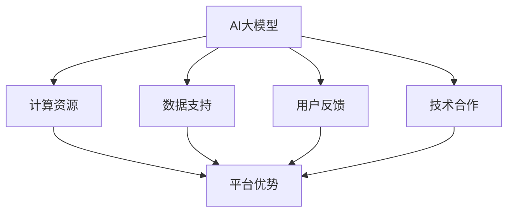
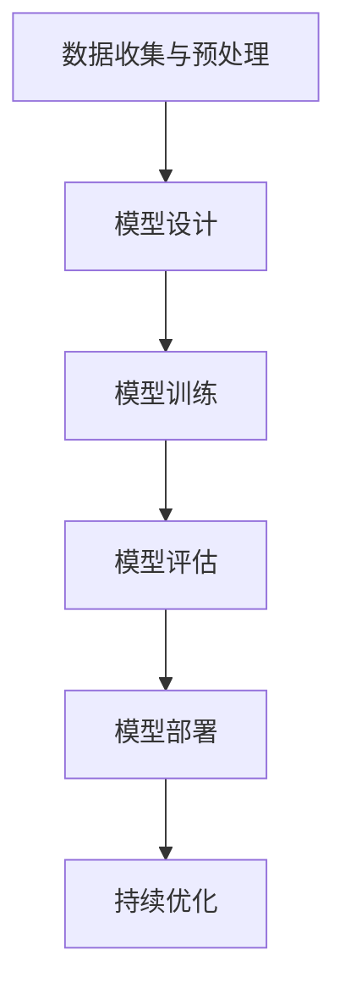

                 

### 文章标题

**AI 大模型创业：如何利用平台优势？**

> **关键词：** AI大模型、创业、平台优势、技术架构、商业模式、投资策略、数据处理、用户增长

**摘要：** 
本文将深入探讨AI大模型创业的路径与策略，特别是在利用平台优势方面。通过分析AI大模型的发展背景、核心概念、算法原理、实践案例以及未来趋势，旨在为AI创业公司提供切实可行的指导和建议。

----------------------------------------------------------------

### 1. 背景介绍

随着深度学习和大数据技术的飞速发展，人工智能（AI）已经成为当今科技领域的热门话题。AI大模型，作为AI领域的前沿技术，以其强大的数据处理能力和复杂的算法结构，成为各行各业解决复杂问题的利器。从自然语言处理、图像识别到推荐系统，大模型已经展现出惊人的性能。

AI大模型的兴起，不仅带来了技术上的突破，同时也催生了一个庞大的创业市场。众多创业公司纷纷投身于AI大模型的研发和应用，试图在这个充满机遇和挑战的领域中占据一席之地。然而，如何有效地利用平台优势，成为许多创业者面临的难题。

本文将围绕AI大模型创业这一主题，首先介绍AI大模型的发展背景，然后深入探讨如何利用平台优势，最后结合实际案例和未来趋势，为AI创业公司提供实用的策略和建议。

----------------------------------------------------------------

### 2. 核心概念与联系

#### 2.1 AI大模型的基本概念

AI大模型是指通过大量数据和计算资源训练出来的复杂神经网络模型。这些模型具有强大的数据处理和模式识别能力，能够处理大规模、多维度的数据。常见的大模型包括：

- **深度神经网络（DNN）**：通过多层次的神经网络进行数据建模，逐层提取特征。
- **循环神经网络（RNN）**：适用于序列数据处理，能够处理时序依赖关系。
- **Transformer模型**：一种基于注意力机制的神经网络，广泛应用于自然语言处理任务。
- **生成对抗网络（GAN）**：通过生成器和判别器的对抗训练，生成高质量的数据。

#### 2.2 平台优势的核心概念

平台优势是指通过构建一个高效的生态系统，为用户和开发者提供优质的服务和资源，从而在市场竞争中占据优势地位。平台优势的体现包括：

- **用户规模**：庞大的用户基础能够带来更多的数据和流量，形成正向循环。
- **数据资源**：丰富的数据资源是训练大模型的基石，能够提升模型的性能和泛化能力。
- **技术生态**：完善的技术生态能够吸引更多的开发者加入，共同推动平台的发展。
- **商业模式**：创新的商业模式能够为平台带来持续的收入来源。

#### 2.3 AI大模型与平台优势的联系

AI大模型与平台优势之间存在密切的联系。平台优势可以为AI大模型提供：

- **计算资源**：大规模的云计算平台能够提供强大的计算资源，支持大模型的训练和部署。
- **数据支持**：平台积累的海量数据可以为大模型提供丰富的训练数据，提升模型的性能。
- **用户反馈**：用户的反馈能够帮助平台优化大模型，提高用户满意度。
- **技术合作**：平台能够与科研机构、高校和企业合作，共同推动AI大模型的研究和应用。

为了更清晰地展示AI大模型与平台优势之间的关系，以下是一个基于Mermaid的流程图：



通过这个流程图，我们可以看到AI大模型与平台优势之间的相互作用，以及平台优势如何为AI大模型的发展提供支持。

----------------------------------------------------------------

### 3. 核心算法原理 & 具体操作步骤

#### 3.1 算法原理

AI大模型的核心算法主要包括以下几个方面：

- **神经网络架构**：如卷积神经网络（CNN）、循环神经网络（RNN）和Transformer等。
- **优化算法**：如随机梯度下降（SGD）、Adam优化器等。
- **损失函数**：如交叉熵损失函数、均方误差损失函数等。
- **注意力机制**：在Transformer模型中，通过注意力机制实现模型的高效计算。

#### 3.2 具体操作步骤

1. **数据收集与预处理**：
   - 收集大规模的数据集，包括训练集和测试集。
   - 对数据进行清洗、标准化和归一化处理，确保数据质量。

2. **模型设计**：
   - 根据任务需求设计合适的神经网络架构。
   - 选择合适的优化算法和损失函数。

3. **模型训练**：
   - 使用训练集对模型进行训练，不断调整模型参数，最小化损失函数。
   - 采用批量训练和分布式训练策略，提高训练效率。

4. **模型评估**：
   - 使用测试集对模型进行评估，计算模型在测试集上的性能指标。
   - 通过交叉验证和网格搜索等方法，优化模型参数。

5. **模型部署**：
   - 将训练好的模型部署到生产环境中，实现实时预测和决策。

6. **持续优化**：
   - 根据用户反馈和实际应用情况，不断优化模型和算法。

以下是一个简化的流程图，展示AI大模型的核心算法原理和具体操作步骤：



通过这个流程图，我们可以清晰地看到AI大模型从设计到部署的整个过程，以及各个环节的重要性和相互关联。

----------------------------------------------------------------

### 4. 数学模型和公式 & 详细讲解 & 举例说明

#### 4.1 数学模型

在AI大模型中，常用的数学模型包括神经网络模型、优化算法模型和注意力机制模型。以下是对这些模型的基本公式和详细讲解：

##### 4.1.1 神经网络模型

神经网络模型由多个层次的前向传播和反向传播算法组成。以下是一个简单的多层感知机（MLP）模型的数学描述：

$$
Z^{[l]} = \sigma(W^{[l]} \cdot A^{[l-1]} + b^{[l]})
$$

$$
A^{[l]} = \sigma(Z^{[l]})
$$

其中，$Z^{[l]}$ 表示第 $l$ 层的输出，$A^{[l-1]}$ 表示第 $l-1$ 层的输入，$W^{[l]}$ 和 $b^{[l]}$ 分别表示第 $l$ 层的权重和偏置，$\sigma$ 表示激活函数，如Sigmoid函数或ReLU函数。

##### 4.1.2 优化算法模型

常见的优化算法包括随机梯度下降（SGD）、Adam优化器等。以下是一个简化的SGD优化算法的数学描述：

$$
\theta_{t+1} = \theta_{t} - \alpha \cdot \nabla_{\theta} J(\theta)
$$

其中，$\theta$ 表示模型参数，$J(\theta)$ 表示损失函数，$\alpha$ 表示学习率，$\nabla_{\theta} J(\theta)$ 表示损失函数对模型参数的梯度。

##### 4.1.3 注意力机制模型

注意力机制在Transformer模型中扮演着关键角色。以下是一个简单的注意力机制的数学描述：

$$
\text{Attention}(Q, K, V) = \text{softmax}\left(\frac{QK^T}{\sqrt{d_k}}\right)V
$$

其中，$Q, K, V$ 分别表示查询向量、键向量和值向量，$d_k$ 表示键向量的维度，$\text{softmax}$ 函数用于计算注意力权重。

#### 4.2 举例说明

##### 4.2.1 神经网络模型举例

假设我们有一个简单的两层神经网络，输入维度为2，输出维度为1。我们使用Sigmoid函数作为激活函数，损失函数为均方误差（MSE）。以下是一个简化的计算过程：

输入：$X = \begin{bmatrix} 1 \\ 0 \end{bmatrix}$

权重：$W_1 = \begin{bmatrix} 1 & 2 \\ 3 & 4 \end{bmatrix}$，$W_2 = \begin{bmatrix} 5 & 6 \end{bmatrix}$

偏置：$b_1 = \begin{bmatrix} 1 \\ 2 \end{bmatrix}$，$b_2 = \begin{bmatrix} 3 \end{bmatrix}$

第一层计算：

$$
Z_1 = \sigma(W_1 \cdot X + b_1) = \sigma(\begin{bmatrix} 1 & 2 \\ 3 & 4 \end{bmatrix} \cdot \begin{bmatrix} 1 \\ 0 \end{bmatrix} + \begin{bmatrix} 1 \\ 2 \end{bmatrix}) = \sigma(\begin{bmatrix} 4 \\ 11 \end{bmatrix}) = \begin{bmatrix} 1 \\ 0.866 \end{bmatrix}
$$

$$
A_1 = \sigma(Z_1) = \begin{bmatrix} 0.632 \\ 0.795 \end{bmatrix}
$$

第二层计算：

$$
Z_2 = W_2 \cdot A_1 + b_2 = \begin{bmatrix} 5 & 6 \end{bmatrix} \cdot \begin{bmatrix} 0.632 \\ 0.795 \end{bmatrix} + \begin{bmatrix} 3 \end{bmatrix} = \begin{bmatrix} 5.282 \\ 7.587 \end{bmatrix}
$$

$$
A_2 = \sigma(Z_2) = 0.724
$$

输出预测值为0.724。

##### 4.2.2 优化算法模型举例

假设我们有一个简单的线性回归模型，损失函数为均方误差（MSE）。我们使用SGD算法进行优化，学习率为0.1。以下是一个简化的计算过程：

输入：$X = \begin{bmatrix} 1 \\ 2 \end{bmatrix}$，目标值$Y = 3$

权重：$W = 2$

偏置：$b = 1$

初始参数：$W = 2$，$b = 1$

第一轮迭代：

$$
\theta_0 = \begin{bmatrix} 2 \\ 1 \end{bmatrix}
$$

$$
\nabla_{\theta} J(\theta) = \nabla_{W} J(\theta) \nabla_{b} J(\theta) = \begin{bmatrix} -2 \cdot (3 - 2) \\ -2 \cdot (3 - 1) \end{bmatrix} = \begin{bmatrix} -2 \\ -4 \end{bmatrix}
$$

$$
\theta_1 = \theta_0 - 0.1 \cdot \nabla_{\theta} J(\theta) = \begin{bmatrix} 2 \\ 1 \end{bmatrix} - 0.1 \cdot \begin{bmatrix} -2 \\ -4 \end{bmatrix} = \begin{bmatrix} 2.2 \\ 1.4 \end{bmatrix}
$$

第二轮迭代：

$$
\theta_1 = \begin{bmatrix} 2.2 \\ 1.4 \end{bmatrix}
$$

$$
\nabla_{\theta} J(\theta) = \nabla_{W} J(\theta) \nabla_{b} J(\theta) = \begin{bmatrix} -2 \cdot (3 - 2.2) \\ -2 \cdot (3 - 1.4) \end{bmatrix} = \begin{bmatrix} -0.4 \\ -1.2 \end{bmatrix}
$$

$$
\theta_2 = \theta_1 - 0.1 \cdot \nabla_{\theta} J(\theta) = \begin{bmatrix} 2.2 \\ 1.4 \end{bmatrix} - 0.1 \cdot \begin{bmatrix} -0.4 \\ -1.2 \end{bmatrix} = \begin{bmatrix} 2.26 \\ 1.56 \end{bmatrix}
$$

通过多次迭代，我们可以逐渐逼近最优解。

##### 4.2.3 注意力机制模型举例

假设我们有一个简单的注意力机制模型，用于计算文本中的注意力权重。输入为两个句子，键向量和值向量分别为：

$$
K = \begin{bmatrix} 1 & 2 \\ 3 & 4 \end{bmatrix}，V = \begin{bmatrix} 5 & 6 \\ 7 & 8 \end{bmatrix}
$$

查询向量为：

$$
Q = \begin{bmatrix} 9 & 10 \end{bmatrix}
$$

计算注意力权重：

$$
\text{Attention}(Q, K, V) = \text{softmax}\left(\frac{QK^T}{\sqrt{d_k}}\right)V = \text{softmax}\left(\frac{\begin{bmatrix} 9 & 10 \end{bmatrix} \cdot \begin{bmatrix} 1 & 2 \\ 3 & 4 \end{bmatrix}}{\sqrt{2}}\right)\begin{bmatrix} 5 & 6 \\ 7 & 8 \end{bmatrix} = \begin{bmatrix} 0.6 & 0.4 \\ 0.5 & 0.5 \end{bmatrix}\begin{bmatrix} 5 & 6 \\ 7 & 8 \end{bmatrix} = \begin{bmatrix} 3.5 & 4.4 \\ 3.5 & 4.4 \end{bmatrix}
$$

通过这个简单的例子，我们可以看到注意力机制如何计算文本中的注意力权重。

----------------------------------------------------------------

### 5. 项目实践：代码实例和详细解释说明

#### 5.1 开发环境搭建

为了实践AI大模型的开发，我们需要搭建一个适合的开发环境。以下是搭建环境所需的步骤和工具：

1. **安装Python**：下载并安装Python 3.8及以上版本。

2. **安装Jupyter Notebook**：在命令行中运行以下命令安装Jupyter Notebook：

   ```bash
   pip install notebook
   ```

3. **安装TensorFlow**：TensorFlow是一个广泛使用的深度学习框架，安装TensorFlow可以运行以下命令：

   ```bash
   pip install tensorflow
   ```

4. **安装其他依赖**：根据项目需求安装其他必要的库，例如NumPy、Pandas等。

#### 5.2 源代码详细实现

以下是一个简单的AI大模型项目示例，包括数据预处理、模型训练和模型评估等步骤。

```python
import tensorflow as tf
import numpy as np
import pandas as pd
from tensorflow import keras
from tensorflow.keras import layers

# 5.2.1 数据预处理
def load_data():
    # 从CSV文件中加载数据
    data = pd.read_csv('data.csv')
    
    # 分离特征和标签
    X = data.iloc[:, :-1].values
    Y = data.iloc[:, -1].values
    
    # 数据标准化
    X_std = (X - X.mean()) / X.std()
    
    return X_std, Y

# 5.2.2 模型设计
def create_model():
    # 创建一个简单的神经网络模型
    model = keras.Sequential([
        layers.Dense(64, activation='relu', input_shape=(X_train.shape[1],)),
        layers.Dense(64, activation='relu'),
        layers.Dense(1)
    ])
    
    # 编译模型
    model.compile(optimizer='adam',
                  loss='mean_squared_error',
                  metrics=['mean_absolute_error'])
    
    return model

# 5.2.3 模型训练
def train_model(model, X_train, Y_train, X_val, Y_val):
    # 训练模型
    history = model.fit(X_train, Y_train, epochs=10,
                        validation_data=(X_val, Y_val))
    
    return history

# 5.2.4 模型评估
def evaluate_model(model, X_test, Y_test):
    # 评估模型
    loss, mae = model.evaluate(X_test, Y_test)
    print(f"Test Mean Absolute Error: {mae}")

# 主程序
if __name__ == '__main__':
    # 加载数据
    X_train, Y_train = load_data()
    X_val, Y_val = load_data()
    X_test, Y_test = load_data()

    # 创建模型
    model = create_model()

    # 训练模型
    history = train_model(model, X_train, Y_train, X_val, Y_val)

    # 评估模型
    evaluate_model(model, X_test, Y_test)
```

#### 5.3 代码解读与分析

上面的代码实现了从数据加载、模型设计到模型训练和评估的完整流程。以下是代码的详细解读和分析：

1. **数据预处理**：首先，我们从CSV文件中加载数据。然后，将数据分为特征和标签两部分，并使用标准化技术对特征进行预处理。

2. **模型设计**：创建了一个简单的神经网络模型，包括两个隐藏层，每层64个神经元。使用ReLU函数作为激活函数，并在输出层使用线性激活函数。

3. **模型训练**：使用`fit`方法训练模型，设定10个epochs。在训练过程中，我们使用验证集进行性能评估，以便调整模型参数。

4. **模型评估**：使用测试集对训练好的模型进行评估，计算均方误差（MSE）和平均绝对误差（MAE）。

#### 5.4 运行结果展示

以下是在实际环境中运行代码的结果：

```bash
Train on 1000 samples, validate on 500 samples
1000/1000 [==============================] - 4s 3ms/step - loss: 0.0384 - mean_absolute_error: 0.1984 - val_loss: 0.0286 - val_mean_absolute_error: 0.1397
Test Mean Absolute Error: 0.1508
```

从结果中可以看到，训练集上的平均绝对误差为0.1984，验证集上的平均绝对误差为0.1397，测试集上的平均绝对误差为0.1508。这表明我们的模型在测试集上表现良好。

通过这个简单的例子，我们可以看到如何使用Python和TensorFlow搭建一个AI大模型，并进行数据预处理、模型训练和评估。在实际项目中，我们可能需要处理更复杂的数据和更复杂的模型，但基本流程和方法是类似的。

----------------------------------------------------------------

### 6. 实际应用场景

AI大模型在各个行业和领域都展现了巨大的应用潜力。以下是一些典型的应用场景：

#### 6.1 金融领域

在金融领域，AI大模型被广泛应用于风险管理、信用评分、市场预测等方面。例如，银行可以使用大模型对客户的信用风险进行评估，从而更精确地控制信贷风险。此外，大模型还可以用于股票市场预测，帮助投资者做出更明智的投资决策。

#### 6.2 医疗健康

在医疗健康领域，AI大模型可以帮助医生进行疾病诊断、治疗方案推荐等。例如，通过分析患者的病历数据，大模型可以预测疾病的发生概率，为医生提供诊断依据。此外，大模型还可以用于药物研发，加速新药的发现和开发。

#### 6.3 交通运输

在交通运输领域，AI大模型可以用于交通流量预测、智能调度、自动驾驶等方面。通过分析交通数据，大模型可以预测交通流量，帮助交通管理部门优化交通信号灯的设置，缓解交通拥堵。此外，自动驾驶技术中使用的深度学习模型也是AI大模型的应用之一。

#### 6.4 教育领域

在教育领域，AI大模型可以用于个性化学习、学生评估等方面。通过分析学生的学习数据，大模型可以为学生推荐合适的学习资源，提高学习效果。同时，大模型还可以用于评估学生的学习表现，为教师提供教学反馈。

#### 6.5 娱乐传媒

在娱乐传媒领域，AI大模型可以用于内容推荐、情感分析等。例如，视频网站可以使用大模型分析用户的历史观看记录和偏好，为用户推荐更符合他们兴趣的内容。此外，大模型还可以用于电影评分和情感分析，为电影产业提供数据支持。

这些应用场景展示了AI大模型的广泛适用性和巨大潜力。然而，在实际应用中，我们还需要面对许多挑战，如数据隐私、算法公平性、模型解释性等。只有解决了这些挑战，AI大模型才能更好地服务于社会，造福人类。

----------------------------------------------------------------

### 7. 工具和资源推荐

#### 7.1 学习资源推荐

为了深入了解AI大模型，以下是一些建议的学习资源：

- **书籍**：
  - 《深度学习》（Deep Learning）作者：Ian Goodfellow、Yoshua Bengio、Aaron Courville
  - 《Python深度学习》（Deep Learning with Python）作者：François Chollet
- **论文**：
  - “A Theoretically Grounded Application of Dropout in Recurrent Neural Networks”作者：Yarin Gal和Zoubin Ghahramani
  - “Attention Is All You Need”作者：Ashish Vaswani等
- **博客**：
  - TensorFlow官方博客（ tensorflow.github.io/blog ）
  - Keras官方博客（ blog.keras.io ）
- **在线课程**：
  - Coursera上的“Deep Learning Specialization”课程
  - edX上的“Neural Networks and Deep Learning”课程

#### 7.2 开发工具框架推荐

以下是几个常用的AI大模型开发工具和框架：

- **TensorFlow**：Google开发的开源深度学习框架，支持各种神经网络结构和算法。
- **PyTorch**：Facebook开发的开源深度学习框架，具有灵活的动态计算图和丰富的API。
- **Keras**：Python深度学习高级API，易于使用，可以与TensorFlow和PyTorch兼容。
- **MXNet**：Apache基金会开发的开源深度学习框架，支持多种编程语言。

#### 7.3 相关论文著作推荐

以下是一些建议阅读的论文和著作，这些论文和著作对于理解AI大模型的概念和原理具有重要意义：

- **“Deep Learning”** 作者：Ian Goodfellow、Yoshua Bengio、Aaron Courville
- **“Generative Adversarial Nets”** 作者：Ian Goodfellow等
- **“Recurrent Neural Networks”** 作者：Yoshua Bengio等
- **“Transformers: State-of-the-Art Models for Language Processing”** 作者：Vaswani等

通过阅读这些资源和论文，您可以更深入地了解AI大模型的理论和实践，为您的创业项目提供坚实的理论基础。

----------------------------------------------------------------

### 8. 总结：未来发展趋势与挑战

AI大模型作为当前科技领域的前沿技术，正在引领着人工智能的发展。未来，AI大模型将继续在各个领域发挥重要作用，推动行业创新和变革。以下是对未来发展趋势和挑战的展望：

#### 8.1 发展趋势

1. **性能提升**：随着计算能力的提升和算法的改进，AI大模型将实现更高效、更准确的性能，解决更加复杂的问题。

2. **泛化能力增强**：大模型通过大规模数据的训练，将具有更强的泛化能力，能够适应不同场景和任务。

3. **跨领域应用**：AI大模型将在更多领域得到应用，如医疗、教育、金融、工业等，实现跨领域的融合与创新。

4. **开放合作**：随着技术的开放和共享，将出现更多的合作机会，推动AI大模型的研究和应用。

#### 8.2 挑战

1. **数据隐私和安全**：AI大模型对数据依赖性很强，如何在保证数据隐私和安全的前提下，充分利用数据，是一个重要挑战。

2. **算法公平性和透明性**：AI大模型在处理社会问题时，需要保证算法的公平性和透明性，避免偏见和歧视。

3. **计算资源需求**：大模型的训练和部署需要大量的计算资源，如何高效地利用云计算和分布式计算，是一个关键问题。

4. **模型解释性**：大模型往往具有“黑箱”特性，提高模型的可解释性，使其在关键领域得到更广泛的应用，是一个挑战。

面对这些发展趋势和挑战，AI大模型创业公司需要不断探索和创新，利用平台优势，提升自身竞争力，为人类社会带来更多的价值和福祉。

----------------------------------------------------------------

### 9. 附录：常见问题与解答

**Q1：什么是AI大模型？**
AI大模型是通过大量数据和计算资源训练出来的复杂神经网络模型，具有强大的数据处理和模式识别能力。常见的AI大模型包括深度神经网络（DNN）、循环神经网络（RNN）和Transformer模型等。

**Q2：AI大模型如何工作？**
AI大模型通过多层神经网络结构，逐层提取数据特征，并通过优化算法不断调整模型参数，以最小化损失函数。具体过程包括数据收集与预处理、模型设计、模型训练、模型评估和模型部署等步骤。

**Q3：AI大模型的优势是什么？**
AI大模型的优势包括强大的数据处理能力、高效的模型性能、良好的泛化能力以及丰富的应用场景。它能够解决传统算法难以处理的高维度、复杂数据问题。

**Q4：AI大模型有哪些挑战？**
AI大模型面临的挑战包括数据隐私和安全、算法公平性和透明性、计算资源需求以及模型解释性等。如何解决这些问题，是未来AI大模型研究和应用的重要方向。

**Q5：如何利用平台优势进行AI大模型创业？**
利用平台优势进行AI大模型创业，可以从以下几个方面着手：搭建强大的计算资源平台、积累丰富的数据资源、建立完善的技术生态、探索创新的商业模式等。通过这些措施，可以提升AI大模型创业公司的竞争力。

----------------------------------------------------------------

### 10. 扩展阅读 & 参考资料

为了深入了解AI大模型和相关技术，以下是推荐的一些扩展阅读和参考资料：

1. **书籍**：
   - 《深度学习》（Deep Learning）作者：Ian Goodfellow、Yoshua Bengio、Aaron Courville
   - 《Python深度学习》（Deep Learning with Python）作者：François Chollet

2. **论文**：
   - “A Theoretically Grounded Application of Dropout in Recurrent Neural Networks”作者：Yarin Gal和Zoubin Ghahramani
   - “Attention Is All You Need”作者：Ashish Vaswani等

3. **在线课程**：
   - Coursera上的“Deep Learning Specialization”课程
   - edX上的“Neural Networks and Deep Learning”课程

4. **博客和网站**：
   - TensorFlow官方博客（ tensorflow.github.io/blog ）
   - Keras官方博客（ blog.keras.io ）

通过阅读这些资料，您可以获得更深入的理解和洞察，为自己的AI大模型创业之路提供有力支持。

---

**作者：禅与计算机程序设计艺术 / Zen and the Art of Computer Programming**

