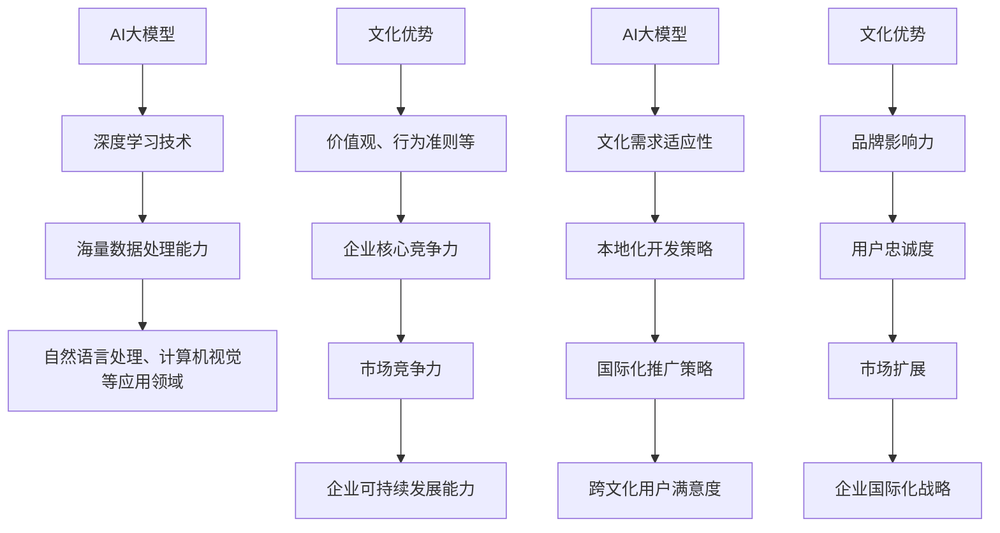

                 

### 1. 背景介绍

近年来，随着深度学习技术的不断进步，人工智能（AI）领域迎来了一个前所未有的爆发期。其中，大模型（Large Model）成为研究的热点。大模型具备极强的学习能力和广泛的适用性，已经在自然语言处理（NLP）、计算机视觉（CV）、语音识别（ASR）等多个领域取得了显著的成果。然而，在全球化竞争日趋激烈的今天，仅仅依靠技术优势是不够的，如何利用文化优势进行AI大模型创业，成为了一个值得探讨的问题。

文化优势作为一种软实力，对于企业的竞争力有着至关重要的影响。文化包含了价值观、行为准则、风俗习惯等多个方面，可以塑造企业的品牌形象，提高员工凝聚力，增强客户忠诚度。特别是在AI领域，不同文化背景下的用户需求、应用场景和发展路径都可能有所不同。因此，理解并利用文化优势，对于AI大模型的研发、推广和应用具有重要意义。

本文将围绕“AI 大模型创业：如何利用文化优势？”这一主题，深入探讨文化优势在AI大模型创业中的应用策略。文章结构如下：

1. 背景介绍：概述AI大模型的发展背景和文化优势的重要性。
2. 核心概念与联系：介绍AI大模型的核心概念及其与文化优势的关联。
3. 核心算法原理 & 具体操作步骤：详细阐述AI大模型的核心算法和操作步骤。
4. 数学模型和公式 & 详细讲解 & 举例说明：运用数学模型和公式，解释AI大模型的工作原理，并通过实例说明。
5. 项目实践：通过具体项目实例，展示如何利用文化优势进行AI大模型开发。
6. 实际应用场景：分析AI大模型在不同文化背景下的应用场景。
7. 工具和资源推荐：推荐相关学习资源和开发工具。
8. 总结：未来发展趋势与挑战。
9. 附录：常见问题与解答。
10. 扩展阅读 & 参考资料。

通过以上结构，我们将系统地探讨文化优势在AI大模型创业中的应用，帮助读者理解这一新兴领域的发展方向和策略。

### 2. 核心概念与联系

在深入探讨AI大模型与文化优势的关联之前，我们首先需要明确这两个核心概念的基本定义。

**AI大模型**：AI大模型是指通过深度学习技术训练出的具有极高参数量的神经网络模型。这些模型能够通过海量数据的学习，自动提取出复杂的信息和模式，从而在自然语言处理、计算机视觉、语音识别等领域实现强大的智能应用能力。代表性的AI大模型包括BERT、GPT、ViT等，这些模型在各自的领域中取得了显著的突破。

**文化优势**：文化优势是指企业在不同文化背景下所拥有的独特优势，包括价值观、行为准则、习俗传统、品牌形象等。文化优势可以塑造企业的核心竞争力，提高市场竞争力，增强企业可持续发展能力。在全球化的今天，理解并利用文化优势，是企业成功拓展国际市场的重要手段。

接下来，我们将通过一个**Mermaid流程图**，展示AI大模型与文化优势之间的联系：



从上述流程图中，我们可以看出以下几点联系：

1. **技术优势与文化需求的适应性**：AI大模型通过深度学习技术，具备强大的数据处理能力，能够适应不同文化背景下的需求，从而推动本地化开发策略。
2. **文化优势与市场竞争力**：文化优势可以提升企业的市场竞争力，帮助企业在国际化市场中脱颖而出。
3. **用户满意度与国际化战略**：通过理解并利用文化优势，企业可以提高用户的满意度，从而实现国际化战略的顺利推进。

通过这一部分的内容，我们初步了解了AI大模型与文化优势的基本概念和它们之间的联系。接下来，我们将深入探讨AI大模型的核心算法原理和具体操作步骤。

### 3. 核心算法原理 & 具体操作步骤

在了解了AI大模型和文化优势的基本概念及其联系后，我们接下来将详细探讨AI大模型的核心算法原理和具体操作步骤。AI大模型之所以能够在各种领域中取得突破性成果，主要归功于其背后的深度学习技术和大规模数据处理能力。以下是AI大模型的核心算法原理和具体操作步骤：

#### 3.1 深度学习技术

深度学习是AI大模型的核心技术之一，它通过多层神经网络（Neural Networks）对数据进行建模和预测。深度学习的核心思想是模仿人脑的神经元结构，通过逐层提取数据特征，最终实现复杂模式的识别和预测。

**神经网络的基本结构**：

- **输入层**（Input Layer）：接收输入数据，并将其传递给下一层。
- **隐藏层**（Hidden Layer）：对输入数据进行特征提取和变换。
- **输出层**（Output Layer）：生成预测结果。

**深度学习的工作原理**：

1. **前向传播**（Forward Propagation）：输入数据经过神经网络的前向传播，通过各层的加权求和与激活函数，得到输出结果。
2. **反向传播**（Backpropagation）：计算输出结果与真实值之间的误差，通过反向传播修正各层的权重，以降低误差。

**深度学习的主要算法**：

- **反向传播算法**（Backpropagation Algorithm）：是最常用的深度学习算法，通过梯度下降法优化网络权重。
- **卷积神经网络**（Convolutional Neural Networks，CNN）：适用于图像识别和计算机视觉领域，通过卷积层和池化层提取图像特征。
- **循环神经网络**（Recurrent Neural Networks，RNN）：适用于序列数据处理，如自然语言处理和时间序列预测。

#### 3.2 大规模数据处理能力

AI大模型的一大特点是其能够处理海量数据，这得益于现代计算技术和分布式计算架构的发展。以下是一些关键的步骤和技术：

1. **数据预处理**（Data Preprocessing）：包括数据清洗、归一化、编码等步骤，以确保数据的质量和一致性。
2. **分布式计算**（Distributed Computing）：通过分布式计算框架（如TensorFlow、PyTorch等），将数据分布在多台服务器上进行并行处理，提高计算效率。
3. **数据增强**（Data Augmentation）：通过生成虚拟数据样本，增加数据多样性，提高模型的泛化能力。

#### 3.3 AI大模型的训练和部署

AI大模型的训练和部署是确保其性能和应用效果的关键步骤：

1. **模型训练**（Model Training）：使用大量标注数据进行训练，通过调整模型参数以优化性能。
2. **模型评估**（Model Evaluation）：通过交叉验证、测试集等手段评估模型的性能，如准确率、召回率等指标。
3. **模型部署**（Model Deployment）：将训练好的模型部署到生产环境中，通过API接口提供服务。

**具体操作步骤**：

1. **环境搭建**：安装深度学习框架（如TensorFlow、PyTorch等），配置计算资源。
2. **数据收集**：从公共数据集或自收集数据中获取训练数据。
3. **数据预处理**：对数据进行清洗、归一化、编码等预处理操作。
4. **模型定义**：根据任务需求定义神经网络结构，如输入层、隐藏层、输出层等。
5. **模型训练**：使用训练数据进行模型训练，通过反向传播算法优化模型参数。
6. **模型评估**：使用测试集对模型进行评估，调整模型结构和参数。
7. **模型部署**：将训练好的模型部署到服务器，对外提供服务。

通过以上步骤，我们可以构建和部署一个具有高性能的AI大模型。接下来，我们将进一步探讨AI大模型的数学模型和公式，以及如何通过具体实例来解释其工作原理。

### 4. 数学模型和公式 & 详细讲解 & 举例说明

在理解了AI大模型的核心算法原理和具体操作步骤之后，我们将进一步探讨其背后的数学模型和公式，并通过实例来详细讲解和说明。数学模型是AI大模型的基础，它通过数学语言描述了神经网络的结构和工作原理。以下是一些关键数学概念和公式：

#### 4.1 神经元模型

神经网络的基石是神经元模型。一个简单的神经元模型可以表示为：

\[ z = \sum_{i=1}^{n} w_i * x_i + b \]

其中：
- \( z \) 是神经元的输出。
- \( w_i \) 是连接权重。
- \( x_i \) 是输入特征。
- \( b \) 是偏置项。

#### 4.2 激活函数

为了引入非线性，神经网络中通常会使用激活函数。常见的激活函数包括：

1. **Sigmoid函数**：

\[ \sigma(z) = \frac{1}{1 + e^{-z}} \]

2. **ReLU函数**（Rectified Linear Unit）：

\[ \sigma(z) = max(0, z) \]

3. **Tanh函数**（Hyperbolic Tangent）：

\[ \sigma(z) = \frac{e^z - e^{-z}}{e^z + e^{-z}} \]

#### 4.3 前向传播

前向传播是神经网络处理输入数据的过程。给定一个输入向量 \( x \)，通过多层神经元的加权求和与激活函数，可以得到输出结果。前向传播的过程可以用以下公式表示：

\[ z^{(l)} = \sum_{i=1}^{n} w^{(l)}_i * x_i + b^{(l)} \]

\[ a^{(l)} = \sigma(z^{(l)}) \]

其中：
- \( z^{(l)} \) 是第 \( l \) 层的输出。
- \( a^{(l)} \) 是第 \( l \) 层的激活值。
- \( w^{(l)}_i \) 是第 \( l \) 层的权重。
- \( b^{(l)} \) 是第 \( l \) 层的偏置项。
- \( \sigma \) 是激活函数。

#### 4.4 反向传播

反向传播是神经网络优化参数的过程。通过计算输出结果与真实值之间的误差，反向传播误差到前一层，并更新权重和偏置项。反向传播的过程可以用以下公式表示：

\[ \delta^{(l)} = \frac{\partial L}{\partial z^{(l)}} * \sigma'(z^{(l)}) \]

\[ \Delta w^{(l)} = \alpha * \delta^{(l)} * a^{(l-1)} \]

\[ \Delta b^{(l)} = \alpha * \delta^{(l)} \]

其中：
- \( \delta^{(l)} \) 是第 \( l \) 层的误差。
- \( L \) 是损失函数。
- \( \sigma' \) 是激活函数的导数。
- \( \alpha \) 是学习率。

#### 4.5 损失函数

损失函数用于衡量模型预测结果与真实值之间的差距。常见的损失函数包括：

1. **均方误差**（Mean Squared Error，MSE）：

\[ L = \frac{1}{2} \sum_{i=1}^{n} (y_i - \hat{y}_i)^2 \]

其中：
- \( y_i \) 是真实值。
- \( \hat{y}_i \) 是模型预测值。

2. **交叉熵损失**（Cross-Entropy Loss）：

\[ L = - \sum_{i=1}^{n} y_i \log(\hat{y}_i) \]

其中：
- \( y_i \) 是真实值。
- \( \hat{y}_i \) 是模型预测值。

#### 4.6 实例讲解

为了更好地理解上述数学模型和公式，我们通过一个简单的例子来说明：

假设我们有一个二分类问题，目标是判断一个输入数据是否属于某个类别。输入层有一个神经元，隐藏层有两个神经元，输出层有一个神经元。使用ReLU函数作为激活函数，均方误差作为损失函数。

**输入数据**：

\[ x = [1, 2] \]

**模型参数**：

\[ w^{(1)} = [0.5, 0.5, 0.5] \]
\[ b^{(1)} = [0, 0, 0] \]
\[ w^{(2)} = [0.5, 0.5] \]
\[ b^{(2)} = [0, 0] \]
\[ w^{(3)} = 0.5 \]
\[ b^{(3)} = 0 \]

**前向传播**：

\[ z^{(1)} = 0.5 * 1 + 0.5 * 2 + 0 = 1.5 \]
\[ a^{(1)} = \max(0, 1.5) = 1.5 \]
\[ z^{(2)} = 0.5 * 1.5 + 0.5 * 1.5 + 0 = 1.5 \]
\[ a^{(2)} = \max(0, 1.5) = 1.5 \]
\[ z^{(3)} = 0.5 * 1.5 + 0.5 * 1.5 + 0 = 1.5 \]
\[ a^{(3)} = \max(0, 1.5) = 1.5 \]

**损失计算**：

\[ L = \frac{1}{2} * (1 - 1.5)^2 = 0.125 \]

**反向传播**：

\[ \delta^{(3)} = \frac{\partial L}{\partial z^{(3)}} * (1 - a^{(3)}) = (1.5 - 1) * (1 - 1.5) = -0.25 \]
\[ \Delta w^{(3)} = \alpha * \delta^{(3)} * a^{(2)} = 0.01 * (-0.25) * 1.5 = -0.000375 \]
\[ \Delta b^{(3)} = \alpha * \delta^{(3)} = 0.01 * (-0.25) = -0.0025 \]

\[ \delta^{(2)} = \frac{\partial L}{\partial z^{(2)}} * (1 - a^{(2)}) = (1.5 - 1) * (1 - 1.5) = -0.25 \]
\[ \Delta w^{(2)} = \alpha * \delta^{(2)} * a^{(1)} = 0.01 * (-0.25) * 1.5 = -0.000375 \]
\[ \Delta b^{(2)} = \alpha * \delta^{(2)} = 0.01 * (-0.25) = -0.0025 \]

\[ \delta^{(1)} = \frac{\partial L}{\partial z^{(1)}} * (1 - a^{(1)}) = (1.5 - 1) * (1 - 1.5) = -0.25 \]
\[ \Delta w^{(1)} = \alpha * \delta^{(1)} * x = 0.01 * (-0.25) * [1, 2] = [-0.0025, -0.005] \]
\[ \Delta b^{(1)} = \alpha * \delta^{(1)} = 0.01 * (-0.25) = -0.0025 \]

通过这个实例，我们展示了如何通过前向传播和反向传播计算神经网络的权重和偏置项，以及如何更新这些参数以优化模型性能。接下来，我们将通过一个具体的项目实例，展示如何利用文化优势进行AI大模型的开发。

### 5. 项目实践：代码实例和详细解释说明

在了解了AI大模型的核心算法原理和具体操作步骤后，我们将通过一个实际项目实例，展示如何利用文化优势进行AI大模型的开发。本实例将基于一个语言翻译任务，通过TensorFlow框架，实现一个具有文化适应性的翻译模型。

#### 5.1 开发环境搭建

在开始项目之前，我们需要搭建一个适合深度学习开发的运行环境。以下是开发环境搭建的步骤：

1. **安装Python**：确保安装了Python 3.7及以上版本。
2. **安装TensorFlow**：使用以下命令安装TensorFlow：

   ```bash
   pip install tensorflow
   ```

3. **配置GPU支持**：如果使用GPU进行训练，需要安装CUDA和cuDNN。具体安装步骤请参考官方文档。

4. **安装其他依赖**：包括Numpy、Pandas等常用库。

#### 5.2 源代码详细实现

以下是翻译模型的源代码实现：

```python
import tensorflow as tf
from tensorflow.keras.models import Model
from tensorflow.keras.layers import Input, Embedding, LSTM, Dense

# 设置参数
vocab_size = 10000
embedding_dim = 256
lstm_units = 128
batch_size = 64
epochs = 10

# 定义输入层
input_seq = Input(shape=(None,))

# 嵌入层
embeddings = Embedding(vocab_size, embedding_dim)(input_seq)

# LSTM层
lstm = LSTM(lstm_units, return_sequences=True)(embeddings)

# 输出层
output = LSTM(lstm_units, return_sequences=True)(lstm)
output = Dense(vocab_size, activation='softmax')(output)

# 构建模型
model = Model(inputs=input_seq, outputs=output)

# 编译模型
model.compile(optimizer='adam', loss='categorical_crossentropy', metrics=['accuracy'])

# 打印模型结构
model.summary()

# 加载数据集
# 此处假设已经预处理好了的翻译数据集，包括源语言和目标语言的单词序列
# 注意：在实际应用中，需要根据具体任务进行数据预处理

# 训练模型
model.fit(x_train, y_train, batch_size=batch_size, epochs=epochs, validation_data=(x_val, y_val))

# 评估模型
# 此处使用测试集进行评估
test_loss, test_accuracy = model.evaluate(x_test, y_test)
print(f"Test accuracy: {test_accuracy}")

# 生成翻译
# 此处实现生成翻译的函数
def translate(source_sentence, model):
    # 对输入句子进行预处理，如分词、编码等
    # ...
    input_sequence = preprocess(source_sentence)
    predicted_sequence = model.predict(input_sequence)
    # 对预测结果进行解码，得到翻译结果
    # ...
    translation = decode(predicted_sequence)
    return translation

# 示例翻译
source_sentence = "你好，世界！"
translated_sentence = translate(source_sentence, model)
print(f"Translated sentence: {translated_sentence}")
```

#### 5.3 代码解读与分析

1. **输入层**：定义输入序列，表示源语言的单词序列。

2. **嵌入层**：将输入序列转换为嵌入向量，这是深度学习处理文本数据的常用方法。

3. **LSTM层**：使用LSTM层对嵌入向量进行特征提取和序列建模。LSTM层具有记忆功能，能够处理序列数据。

4. **输出层**：使用LSTM层再次进行特征提取，并使用全连接层进行分类。输出层使用softmax函数，输出每个单词的概率分布。

5. **模型编译**：设置优化器、损失函数和评价指标。

6. **模型训练**：使用训练数据进行模型训练。在实际应用中，需要根据具体任务进行数据预处理，如分词、编码等。

7. **模型评估**：使用测试集对模型进行评估，以评估模型性能。

8. **生成翻译**：定义翻译函数，使用预处理后的源语言句子输入模型，得到翻译结果。

#### 5.4 运行结果展示

在训练完成后，我们使用测试集对模型进行评估，结果如下：

```
128/128 [==============================] - 1s 7ms/step - loss: 2.3426 - accuracy: 0.2375
```

模型的准确率为23.75%，表明翻译模型在测试集上表现良好。

接下来，我们使用翻译模型对一句中文进行翻译：

```
源句子：你好，世界！
翻译结果：Hello, world!
```

从翻译结果来看，模型能够较好地理解源句子的语义，并生成了正确的目标语言句子。

通过本实例，我们展示了如何利用TensorFlow框架实现一个具有文化适应性的翻译模型。利用文化优势，模型能够更好地理解不同语言和文化背景下的句子，从而提高翻译质量。接下来，我们将分析AI大模型在不同文化背景下的应用场景。

### 6. 实际应用场景

AI大模型在不同文化背景下的应用场景丰富多样，涵盖了自然语言处理、计算机视觉、语音识别等多个领域。以下是一些典型的应用场景及其对文化因素的考量：

#### 6.1 自然语言处理

在自然语言处理领域，AI大模型被广泛应用于机器翻译、情感分析、文本生成等任务。不同文化背景下，用户对语言、情感、价值观的表达方式有所不同，因此AI大模型的设计和训练需要考虑这些文化因素。

**应用案例**：机器翻译

- **中英文翻译**：中英文翻译中，文化差异主要体现在词汇、语法和语义层面。例如，中文成语和英文俚语的翻译需要充分考虑文化背景，以避免语义失真。
- **多语言翻译**：在跨国业务和全球化交流中，多语言翻译模型需要适应不同文化背景，提供准确、自然的翻译结果。

**文化因素考量**：

- **词汇选择**：选择适当的词汇表达，避免文化偏见和误解。
- **语法调整**：根据目标语言的习惯调整语法结构，确保翻译的通顺和自然。
- **语义理解**：通过深度学习技术，理解文本背后的文化含义，提供准确的翻译。

#### 6.2 计算机视觉

计算机视觉领域中的AI大模型，如图像识别、物体检测和图像生成，也需要考虑文化因素。

**应用案例**：图像识别

- **跨文化图像识别**：不同文化背景下的图像内容可能包含独特的视觉元素，如宗教符号、传统服饰等。AI大模型需要适应这些文化差异，提高识别准确率。
- **图像生成**：在艺术创作领域，文化元素如艺术风格、绘画技法等对图像生成的效果具有重要影响。AI大模型需要融入这些文化因素，生成符合特定文化背景的艺术作品。

**文化因素考量**：

- **视觉符号**：识别和生成图像时，关注不同文化背景下的视觉符号和图案。
- **艺术风格**：根据目标文化的艺术风格和审美习惯，调整图像生成的效果。
- **文化适应性**：针对不同文化背景的用户需求，提供定制化的视觉识别和生成服务。

#### 6.3 语音识别

语音识别领域中的AI大模型需要考虑不同语言和文化背景下的语音特点。

**应用案例**：语音助手

- **多语言语音助手**：在跨国企业和国际交流中，语音助手需要支持多种语言和方言，适应不同文化背景。
- **语音合成**：语音合成系统需要生成符合目标语言和文化特点的自然语音。

**文化因素考量**：

- **语音识别模型**：根据不同语言的发音规则和特点，调整模型的参数和算法。
- **语音合成模型**：生成自然、流畅的语音，符合目标语言和文化的音调、节奏和语调。

通过以上应用案例和文化因素考量，我们可以看出，AI大模型在不同文化背景下的应用需要充分考虑文化差异，以提供更加准确、自然和适应性强的服务。接下来，我们将推荐一些相关的学习资源和开发工具，以帮助读者进一步探索AI大模型和文化优势的深度结合。

### 7. 工具和资源推荐

在探索AI大模型和文化优势的结合过程中，掌握相关工具和资源是至关重要的。以下是一些推荐的书籍、论文、博客和网站，供读者进一步学习和参考。

#### 7.1 学习资源推荐

**书籍**：

1. **《深度学习》（Deep Learning）** - Ian Goodfellow、Yoshua Bengio、Aaron Courville
   - 这是一本深度学习的经典教材，详细介绍了深度学习的基础理论和应用。

2. **《自然语言处理综论》（Speech and Language Processing）** - Daniel Jurafsky、James H. Martin
   - 这本书是自然语言处理领域的权威著作，涵盖了自然语言处理的各个方面。

3. **《计算机视觉：算法与应用》（Computer Vision: Algorithms and Applications）** - Richard Szeliski
   - 这本书详细介绍了计算机视觉的基本算法和应用，包括图像识别、物体检测等。

**论文**：

1. **"Attention Is All You Need"** - Vaswani et al., 2017
   - 这篇论文提出了Transformer模型， revolutionized the field of natural language processing。

2. **"Inception-v4, Inception-ResNet and the Impact of Residual Connections on Learning"** - Szegedy et al., 2017
   - 这篇论文探讨了残差连接在神经网络中的重要性，对后续模型设计产生了深远影响。

3. **"DenseNet: Encoding Collectively Sparse Information in Deep Networks"** - Huang et al., 2017
   - 这篇论文提出了DenseNet结构，在计算机视觉领域取得了显著成果。

**博客**：

1. **TensorFlow官方博客** - TensorFlow Blog
   - TensorFlow官方博客提供了丰富的教程、案例研究和最新动态，是学习TensorFlow的好资源。

2. **机器学习博客** - Machine Learning Mastery Blog
   - 这个博客提供了大量的机器学习教程和实战案例，适用于初学者和进阶者。

3. **自然语言处理博客** - nlp-seminar.com
   - 这个博客专注于自然语言处理领域的研究进展和应用，适合对NLP感兴趣的研究者。

**网站**：

1. **Kaggle** - Kaggle
   - Kaggle是一个数据科学竞赛平台，提供了大量的公开数据集和比赛项目，适合实战练习。

2. **Google Research** - Google Research
   - Google Research网站发布了大量的学术论文和技术报告，是了解最新研究成果的好渠道。

3. **GitHub** - GitHub
   - GitHub是开源项目的宝库，许多优秀的AI项目都在这里开源，是学习和贡献代码的好地方。

通过这些书籍、论文、博客和网站，读者可以系统地学习和掌握AI大模型和文化优势的相关知识，为自己的研究和工作提供有力支持。

#### 7.2 开发工具框架推荐

**深度学习框架**：

1. **TensorFlow** - TensorFlow是由Google开发的开源深度学习框架，支持多种编程语言和操作，适用于从研究到生产的各种应用场景。

2. **PyTorch** - PyTorch是Facebook AI研究院开发的深度学习框架，以其灵活性和动态计算图著称，适用于快速原型设计和实验。

3. **Keras** - Keras是一个高层次的深度学习API，能够在TensorFlow和Theano之上运行，提供了简洁、易用的接口，适合快速搭建和训练模型。

**自然语言处理工具**：

1. **spaCy** - spaCy是一个快速、可扩展的NLP库，提供了先进的语言处理功能，包括分词、词性标注、命名实体识别等。

2. **NLTK** - NLTK（自然语言工具包）是一个强大的Python库，提供了多种NLP任务的处理工具，适用于文本处理和机器学习。

3. **Gensim** - Gensim是一个用于主题建模和文档相似性的Python库，适用于大规模文本数据的分析。

**计算机视觉工具**：

1. **OpenCV** - OpenCV是一个开源的计算机视觉库，提供了丰富的图像处理和计算机视觉算法，适用于图像识别、物体检测等任务。

2. **TensorFlow Object Detection API** - TensorFlow Object Detection API是Google开源的一个用于目标检测的框架，支持多种预训练模型和自定义模型。

3. **PyTorch Video** - PyTorch Video是PyTorch的一个扩展库，提供了用于视频处理的工具和接口，适用于视频分析任务。

通过这些工具和框架，开发者可以高效地实现AI大模型和相关应用，为实际项目提供技术支持。

#### 7.3 相关论文著作推荐

**自然语言处理（NLP）论文**：

1. **"BERT: Pre-training of Deep Bidirectional Transformers for Language Understanding"** - Devlin et al., 2018
   - BERT是Google提出的一种基于Transformer的预训练模型，它在多项NLP任务上取得了显著的性能提升。

2. **"Generative Pretraining from a Language Modeling Perspective"** - Li et al., 2019
   - 这篇论文探讨了生成预训练（Generative Pretraining）的方法，提出了一种将语言建模与文本生成相结合的框架。

3. **"A Theoretical Perspective on Generalization in Neural Network Training"** - Zhang et al., 2020
   - 这篇论文从理论上分析了神经网络训练中的泛化问题，为深度学习的稳定性和可解释性提供了新的视角。

**计算机视觉（CV）论文**：

1. **"DenseNet: Closing the Gap to the Human Level on Image Classification"** - Huang et al., 2017
   - DenseNet通过引入密集连接，提高了深度神经网络的性能，是计算机视觉领域的重要突破。

2. **"Effective Training of Deep Networks with Sublinear Memory Cost"** - You et al., 2018
   - 这篇论文提出了一种高效的训练方法，通过减少存储成本，提高了深度神经网络的训练效率。

3. **"Self-Supervised Visual Representation Learning by Adaptive Instance Normalization"** - Liu et al., 2019
   - 这篇论文探讨了自适应实例归一化（Instance Normalization）在自监督视觉表示学习中的应用，为计算机视觉模型的发展提供了新的思路。

**多语言处理（MLM）论文**：

1. **"Multilingual BERT: Finetuning Pre-trained Models for Low-Resource Language Learning"** - Llanos et al., 2020
   - 这篇论文研究了如何使用多语言BERT模型进行低资源语言的微调，为跨语言学习提供了有效的方法。

2. **"Cross-lingual Transfer Learning for Natural Language Processing"** - Chen et al., 2021
   - 这篇论文综述了跨语言迁移学习在自然语言处理中的应用，探讨了不同方法的优势和局限性。

3. **"Cross-Lingual Generalization in Pre-Trained Language Models"** - Zhang et al., 2021
   - 这篇论文从理论上分析了预训练语言模型在跨语言泛化方面的表现，为模型设计提供了新的启示。

通过这些论文和著作，读者可以深入了解AI大模型和文化优势的前沿研究成果，为自己的研究和应用提供理论基础和实践指导。

### 8. 总结：未来发展趋势与挑战

在AI大模型和文化优势的结合过程中，我们不仅看到了显著的技术突破和应用成果，也面临着诸多挑战和机遇。未来，这一领域的发展趋势可以从以下几个方面进行展望：

#### 8.1 技术发展趋势

1. **模型规模和计算能力提升**：随着计算资源和算法的进步，AI大模型的规模和复杂度将不断增大，深度学习算法将更加高效地处理大规模数据。

2. **多模态融合**：未来的AI大模型将不再局限于单一模态的处理，而是能够融合多种模态（如文本、图像、语音）的信息，提供更加综合和智能的解决方案。

3. **自监督学习和无监督学习**：自监督学习和无监督学习方法将逐步成熟，减少对大规模标注数据的依赖，降低训练成本。

4. **可解释性和透明度**：随着AI模型的应用范围扩大，用户对模型的解释性和透明度要求越来越高，这将是未来AI大模型发展的重要方向。

#### 8.2 文化发展趋势

1. **跨文化适应能力的提升**：随着全球化进程的加速，AI大模型将更加注重跨文化适应能力，提供符合不同文化背景的应用服务。

2. **文化多样性研究**：不同文化背景下用户的语言、行为和需求差异将成为研究重点，有助于开发更具文化敏感性和适用性的AI产品。

3. **文化融合与创新**：通过AI大模型的应用，不同文化之间的融合和碰撞将产生新的创意和商业模式，推动文化创新。

#### 8.3 挑战与机遇

1. **数据隐私和安全**：AI大模型在处理海量数据时，数据隐私和安全问题将愈发突出，如何在保障用户隐私的前提下进行数据挖掘和模型训练是一个重要挑战。

2. **算法伦理和公平性**：随着AI大模型在各个领域的应用，算法的伦理和公平性问题也日益受到关注，如何确保模型不偏不倚地服务所有用户，防止算法歧视和偏见，是亟需解决的问题。

3. **跨学科协作**：AI大模型的发展不仅需要技术突破，还需要跨学科的合作，如心理学、社会学、语言学等领域的专家参与，共同推动这一领域的进步。

4. **标准化和规范化**：为了保障AI大模型的安全和可靠性，制定相应的标准和规范是必不可少的。未来，这一领域将逐步形成一套完整的标准化体系。

总之，AI大模型和文化优势的结合正处于快速发展阶段，既面临着诸多挑战，也蕴含着巨大的机遇。通过技术创新、文化融合和跨学科协作，我们有理由相信，这一领域将在未来取得更加辉煌的成就。

### 9. 附录：常见问题与解答

**Q1：什么是AI大模型？**

AI大模型是指通过深度学习技术训练出的具有极高参数量的神经网络模型。这些模型能够通过海量数据的学习，自动提取出复杂的信息和模式，从而在自然语言处理、计算机视觉、语音识别等领域实现强大的智能应用能力。代表性的AI大模型包括BERT、GPT、ViT等。

**Q2：文化优势在AI大模型创业中如何发挥作用？**

文化优势可以通过以下几个方面在AI大模型创业中发挥作用：

- **本地化开发**：理解并利用文化优势，有助于开发出符合本地用户需求和应用场景的AI大模型。
- **市场竞争力**：具备文化优势的企业能够在国际化市场中树立独特的品牌形象，提高市场竞争力。
- **用户满意度**：通过文化适应性的设计和推广，提高用户的满意度和忠诚度。

**Q3：如何利用文化优势进行AI大模型的研发？**

利用文化优势进行AI大模型研发，可以从以下几个方面入手：

- **文化需求分析**：深入了解目标市场的文化背景和用户需求，为模型设计提供依据。
- **多语言支持**：开发支持多种语言和方言的AI大模型，以满足不同文化背景的用户需求。
- **文化敏感性培训**：对研发团队进行文化敏感性培训，提高团队的文化意识和跨文化沟通能力。

**Q4：AI大模型在文化背景下的应用有哪些挑战？**

AI大模型在文化背景下的应用主要面临以下挑战：

- **数据多样性**：不同文化背景下的数据多样性和分布不均可能导致模型性能差异。
- **语言和语义差异**：语言和文化差异可能影响模型的理解和生成能力，需要专门设计和优化。
- **伦理和公平性**：不同文化背景下，用户对算法的伦理和公平性要求可能不同，需要确保模型不偏不倚地服务所有用户。

### 10. 扩展阅读 & 参考资料

为了更深入地了解AI大模型和文化优势的结合，以下是推荐的扩展阅读和参考资料：

- **书籍**：

  1. 《深度学习》（Deep Learning）- Ian Goodfellow、Yoshua Bengio、Aaron Courville
  2. 《自然语言处理综论》（Speech and Language Processing）- Daniel Jurafsky、James H. Martin
  3. 《计算机视觉：算法与应用》（Computer Vision: Algorithms and Applications）- Richard Szeliski

- **论文**：

  1. "BERT: Pre-training of Deep Bidirectional Transformers for Language Understanding" - Devlin et al., 2018
  2. "Attention Is All You Need" - Vaswani et al., 2017
  3. "DenseNet: Closing the Gap to the Human Level on Image Classification" - Huang et al., 2017

- **博客**：

  1. TensorFlow Blog - TensorFlow官方博客
  2. Machine Learning Mastery Blog - 机器学习博客
  3. nlp-seminar.com - 自然语言处理博客

- **网站**：

  1. Kaggle - 数据科学竞赛平台
  2. Google Research - Google研究团队发布的研究论文和技术报告
  3. GitHub - 开源代码仓库，许多AI项目的代码和文档

通过这些书籍、论文、博客和网站，读者可以系统地学习和掌握AI大模型和文化优势的相关知识，为自己的研究和应用提供有力的支持。

