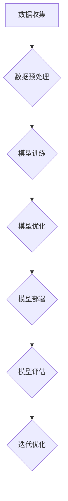

                 

### 背景介绍

#### 大模型创业的兴起

近年来，人工智能（AI）领域的迅猛发展带动了各种创新和创业潮。特别是在大模型（Large Models）技术日渐成熟的大背景下，越来越多的初创公司开始投身于这一领域。大模型创业的兴起，源于其在处理复杂数据、实现智能化应用等方面的显著优势。随着深度学习技术的不断突破，大模型在语音识别、图像处理、自然语言处理等领域取得了令人瞩目的成果，为各行各业带来了前所未有的变革机遇。

#### 大模型创业的优势

1. **计算能力的提升**：随着硬件技术的进步，特别是GPU、TPU等专用硬件的出现，计算能力得到了大幅提升，使得训练大型模型成为可能。

2. **算法的迭代优化**：近年来，深度学习算法的不断发展，如Transformer、BERT等，为大模型的应用提供了强有力的技术支撑。

3. **数据资源的丰富**：互联网和大数据技术的普及，使得各种类型的数据资源变得触手可及，为训练和优化大模型提供了充足的素材。

4. **商业价值的显现**：大模型技术在多个行业，如金融、医疗、教育等，展现出了巨大的商业潜力，吸引了大量投资和关注。

#### 大模型创业的挑战

1. **技术门槛高**：训练和部署大模型需要庞大的计算资源和专业知识，这对于初创公司来说是一个不小的挑战。

2. **数据隐私和安全**：在收集和使用数据的过程中，如何确保用户隐私和数据安全成为了一个重要议题。

3. **模型可解释性**：大模型的黑箱特性使得其在某些应用场景中的决策过程缺乏可解释性，这可能导致用户的不信任。

4. **商业化路径不清晰**：尽管大模型在技术上取得了显著进展，但如何将其转化为实际的商业应用，依然是一个需要深入探讨的问题。

### 当前大模型创业的现状

据研究数据显示，目前全球范围内已有数百家长模型初创公司，这些公司分布在人工智能的各个细分领域，如自然语言处理、计算机视觉、语音识别等。其中，一些知名的大模型初创公司，如OpenAI、DeepMind等，已经取得了显著的商业成功和技术突破。

总的来说，大模型创业正处于一个蓬勃发展的阶段，虽然面临着诸多挑战，但其巨大的潜力和广阔的市场前景，吸引了越来越多的企业和创业者加入这一领域。

---

在接下来的部分，我们将深入探讨大模型的核心概念、原理、算法及其在创业中的应用，帮助读者更好地理解这一前沿技术。

---

### 核心概念与联系

#### 什么是大模型？

大模型（Large Models）是指那些参数量巨大、复杂度极高的机器学习模型，其核心特点是能够通过大量的数据训练，自动学习并提取特征，从而在多个任务上取得优异的性能。这些模型通常基于深度学习技术，尤其是神经网络，通过多层非线性变换来实现对数据的建模。

#### 大模型的核心技术

1. **深度神经网络（Deep Neural Networks）**：大模型通常是基于深度神经网络构建的，其具有多个隐藏层，能够对复杂的数据进行建模。

2. **参数高效性**：大模型通过大量的参数来捕捉数据的特征，这使得它们在处理复杂数据时具有显著的优势。

3. **数据高效性**：大模型能够通过大规模的数据训练，逐步优化模型的参数，从而提高模型的性能。

4. **模型压缩**：为了降低计算成本和存储需求，大模型通常采用各种压缩技术，如权重共享、知识蒸馏等。

#### 大模型的应用领域

大模型在多个领域都展现出了强大的应用潜力：

1. **自然语言处理（NLP）**：大模型在语言模型、机器翻译、文本生成等领域取得了显著的进展。

2. **计算机视觉（CV）**：大模型在图像分类、目标检测、图像生成等领域具有出色的性能。

3. **语音识别（ASR）**：大模型能够通过大量的语音数据训练，实现高精度的语音识别。

4. **推荐系统**：大模型能够通过分析用户的兴趣和行为数据，提供精准的个性化推荐。

5. **医疗健康**：大模型在疾病预测、诊断辅助等领域具有广泛的应用前景。

#### 大模型的优势

1. **强大的表示能力**：大模型能够通过参数化的方式，对复杂的特征进行建模，从而实现更高的性能。

2. **多任务学习**：大模型能够同时处理多个任务，从而提高资源利用效率。

3. **通用性**：大模型具有很好的泛化能力，能够在不同的数据集和任务上取得优异的表现。

#### 大模型的挑战

1. **计算资源需求**：大模型通常需要大量的计算资源和时间进行训练，这对初创公司来说是一个重要的挑战。

2. **数据隐私和安全**：在训练和使用大模型时，需要处理大量的敏感数据，如何保障数据隐私和安全是一个重要的问题。

3. **可解释性**：大模型在决策过程中缺乏可解释性，这可能导致用户的不信任。

#### Mermaid 流程图

下面是一个简化的Mermaid流程图，用于展示大模型的基本架构和流程：



在这个流程中：

- **A 数据收集**：从不同的数据源收集数据。
- **B 数据预处理**：对数据进行清洗、格式化等预处理。
- **C 模型训练**：使用训练数据训练模型。
- **D 模型优化**：通过模型优化技术，提高模型性能。
- **E 模型部署**：将训练好的模型部署到生产环境中。
- **F 模型评估**：评估模型的性能，进行迭代优化。

---

在下一部分，我们将深入探讨大模型的具体算法原理和操作步骤，帮助读者更好地理解其工作方式。

---

### 核心算法原理 & 具体操作步骤

#### 1. 深度神经网络（Deep Neural Networks）

深度神经网络是构建大模型的基础，其核心思想是通过多层非线性变换来学习数据的特征。深度神经网络通常包括输入层、多个隐藏层和输出层。每一层都由多个神经元组成，神经元之间通过权重相连，通过前向传播和反向传播来学习数据的特征。

##### 神经元工作原理

每个神经元接收多个输入信号，并通过激活函数（如ReLU、Sigmoid、Tanh等）将其转换为一个输出信号。激活函数的作用是将线性变换引入网络，从而增加网络的非线性能力。

$$
\text{输出} = \text{激活函数}(\sum_{i} w_i x_i + b)
$$

其中，$w_i$ 是权重，$x_i$ 是输入信号，$b$ 是偏置。

##### 前向传播

在前向传播过程中，数据从输入层经过每一层，直到输出层。每一层的输出都是下一层的输入。

1. **计算输入值**：将输入数据乘以权重并加上偏置。
2. **应用激活函数**：对输入值应用激活函数。
3. **传递到下一层**：将激活后的输出作为下一层的输入。

##### 反向传播

反向传播是深度学习训练的核心步骤，通过计算损失函数的梯度来更新权重和偏置。

1. **计算损失**：使用损失函数（如均方误差、交叉熵等）计算预测值与真实值之间的差异。
2. **计算梯度**：通过链式法则计算损失函数对每个参数的梯度。
3. **更新参数**：使用梯度下降或其他优化算法更新权重和偏置。

$$
\text{梯度} = \frac{\partial L}{\partial w} = \sum_i \frac{\partial L}{\partial z_i} \frac{\partial z_i}{\partial w}
$$

其中，$L$ 是损失函数，$z_i$ 是第$i$层的输入值。

#### 2. 循环神经网络（Recurrent Neural Networks）

循环神经网络（RNN）特别适用于处理序列数据，如时间序列、自然语言等。RNN通过在时间步之间保留状态信息，使得模型能够记忆并利用历史数据。

##### RNN工作原理

RNN在每个时间步更新其隐藏状态，并将其传递到下一个时间步。隐藏状态包含了当前输入和过去状态的信息。

$$
h_t = \text{激活函数}(\text{权重} \cdot [x_t, h_{t-1}]) + b
$$

其中，$h_t$ 是当前时间步的隐藏状态，$x_t$ 是当前输入，$\text{权重}$ 和 $b$ 是模型参数。

##### 长短期记忆网络（LSTM）

LSTM是RNN的一种变体，旨在解决长期依赖问题。LSTM通过引入门控机制，有效地控制信息的流动，从而在长序列中保持长期记忆。

1. **遗忘门（Forget Gate）**：决定哪些信息应该被丢弃。
2. **输入门（Input Gate）**：决定哪些新信息应该被存储。
3. **输出门（Output Gate）**：决定哪些信息应该输出。

$$
f_t = \sigma(W_f \cdot [h_{t-1}, x_t] + b_f) \\
i_t = \sigma(W_i \cdot [h_{t-1}, x_t] + b_i) \\
o_t = \sigma(W_o \cdot [h_{t-1}, x_t] + b_o) \\
c_t = f_t \odot c_{t-1} + i_t \odot \text{激活函数}(W_c \cdot [h_{t-1}, x_t] + b_c) \\
h_t = o_t \odot \text{激活函数}(c_t)
$$

其中，$\sigma$ 是sigmoid函数，$\odot$ 是元素乘法。

#### 3. 生成对抗网络（Generative Adversarial Networks）

生成对抗网络（GAN）是一种由生成器和判别器组成的对抗性模型。生成器的目标是生成逼真的数据，而判别器的目标是区分真实数据和生成数据。

##### GAN工作原理

GAN的训练过程可以看作是一个零和游戏，生成器和判别器相互对抗：

1. **生成器（Generator）**：生成假数据，目标是让判别器无法区分真假。
2. **判别器（Discriminator）**：接收真实数据和生成数据，并预测其真伪。
3. **对抗训练**：通过不断调整生成器和判别器的参数，使得生成器的数据越来越逼真，而判别器的判断越来越准确。

$$
\text{生成器损失} = -\log(\text{判别器}(G(z))) \\
\text{判别器损失} = -\log(\text{判别器}(x)) - \log(1 - \text{判别器}(G(z)))
$$

其中，$G(z)$ 是生成器生成的数据，$x$ 是真实数据。

#### 4. 具体操作步骤

以下是使用深度学习框架（如TensorFlow或PyTorch）训练大模型的典型步骤：

1. **环境搭建**：配置Python环境，安装深度学习框架和相关依赖库。

2. **数据处理**：读取和处理数据，包括数据清洗、预处理和划分训练集、验证集和测试集。

3. **模型定义**：定义深度学习模型的结构，包括输入层、隐藏层和输出层。

4. **模型编译**：配置模型训练的超参数，如优化器、损失函数等。

5. **模型训练**：使用训练数据训练模型，并在验证集上进行调参。

6. **模型评估**：使用测试集评估模型性能，调整模型结构和超参数。

7. **模型部署**：将训练好的模型部署到生产环境中，进行实际应用。

通过上述步骤，我们可以构建并训练一个大模型，从而实现各种智能任务。

---

在下一部分，我们将深入探讨大模型的数学模型和公式，并给出详细的讲解和实例说明。

---

### 数学模型和公式 & 详细讲解 & 举例说明

#### 1. 神经网络基础公式

深度神经网络的核心在于其参数化的非线性变换，下面是几个关键的数学公式：

##### 前向传播

$$
a_l = \sigma(W_l a_{l-1} + b_l)
$$

其中，$a_l$ 是第$l$层的输出，$\sigma$ 是激活函数（如ReLU、Sigmoid、Tanh等），$W_l$ 和 $b_l$ 分别是第$l$层的权重和偏置。

##### 反向传播

反向传播的目的是计算损失函数关于每个参数的梯度。下面是梯度计算的公式：

$$
\frac{\partial L}{\partial z_l} = \frac{\partial L}{\partial a_l} \cdot \frac{\partial a_l}{\partial z_l} \\
\frac{\partial L}{\partial W_l} = \frac{\partial L}{\partial a_l} \cdot a_{l-1} \\
\frac{\partial L}{\partial b_l} = \frac{\partial L}{\partial a_l}
$$

其中，$L$ 是损失函数，$z_l$ 是第$l$层的输入，$a_l$ 是第$l$层的输出。

#### 2. 梯度下降优化

梯度下降是一种常用的优化算法，用于更新模型的参数以最小化损失函数。下面是梯度下降的核心公式：

$$
W_l \leftarrow W_l - \alpha \cdot \frac{\partial L}{\partial W_l} \\
b_l \leftarrow b_l - \alpha \cdot \frac{\partial L}{\partial b_l}
$$

其中，$\alpha$ 是学习率，用于控制参数更新的步长。

#### 3. 循环神经网络（RNN）

循环神经网络（RNN）通过在时间步之间传递隐藏状态来学习序列数据。以下是RNN的核心公式：

$$
h_t = \sigma(W_h \cdot [x_t, h_{t-1}] + b_h)
$$

其中，$h_t$ 是当前时间步的隐藏状态，$x_t$ 是当前输入，$W_h$ 和 $b_h$ 分别是权重和偏置。

#### 4. 长短期记忆网络（LSTM）

LSTM是RNN的一种变体，通过引入门控机制来解决长期依赖问题。以下是LSTM的核心公式：

$$
f_t = \sigma(W_f \cdot [h_{t-1}, x_t] + b_f) \\
i_t = \sigma(W_i \cdot [h_{t-1}, x_t] + b_i) \\
o_t = \sigma(W_o \cdot [h_{t-1}, x_t] + b_o) \\
c_t = f_t \odot c_{t-1} + i_t \odot \text{激活函数}(W_c \cdot [h_{t-1}, x_t] + b_c) \\
h_t = o_t \odot \text{激活函数}(c_t)
$$

其中，$\odot$ 表示元素乘法，其他符号与RNN相同。

#### 5. 生成对抗网络（GAN）

生成对抗网络（GAN）由生成器和判别器组成，以下是GAN的核心公式：

$$
\text{生成器损失} = -\log(\text{判别器}(G(z))) \\
\text{判别器损失} = -\log(\text{判别器}(x)) - \log(1 - \text{判别器}(G(z)))
$$

其中，$G(z)$ 是生成器生成的数据，$x$ 是真实数据。

#### 例子说明

下面我们通过一个简单的例子来说明如何使用梯度下降优化神经网络：

假设我们有一个简单的神经网络，其输入层有3个神经元，隐藏层有2个神经元，输出层有1个神经元。我们使用均方误差（MSE）作为损失函数。

##### 模型定义

```python
import tensorflow as tf

# 定义输入层、隐藏层和输出层的权重和偏置
W1 = tf.Variable(tf.random.normal([3, 2]), name='W1')
b1 = tf.Variable(tf.zeros([2]), name='b1')
W2 = tf.Variable(tf.random.normal([2, 1]), name='W2')
b2 = tf.Variable(tf.zeros([1]), name='b2')

# 定义激活函数
activation = tf.nn.relu

# 定义模型
def model(x):
    hidden = activation(tf.matmul(x, W1) + b1)
    output = tf.matmul(hidden, W2) + b2
    return output
```

##### 梯度下降优化

```python
# 定义损失函数
loss_fn = tf.reduce_mean(tf.square(model(x) - y))

# 定义优化器
optimizer = tf.optimizers.Adam(learning_rate=0.001)

# 训练模型
for epoch in range(num_epochs):
    with tf.GradientTape() as tape:
        predictions = model(x)
        loss = loss_fn(predictions, y)
    
    gradients = tape.gradient(loss, [W1, b1, W2, b2])
    optimizer.apply_gradients(zip(gradients, [W1, b1, W2, b2]))
    
    if epoch % 100 == 0:
        print(f"Epoch {epoch}: Loss = {loss.numpy()}")
```

在这个例子中，我们使用Adam优化器进行梯度下降，每100个epoch打印一次损失值。

---

在下一部分，我们将通过具体的代码实例，展示如何使用深度学习框架实现大模型的开发，并进行详细解释和分析。

---

### 项目实践：代码实例和详细解释说明

在本部分，我们将通过一个简单的项目实例，展示如何使用深度学习框架（如TensorFlow或PyTorch）来开发和实现大模型。我们选择了一个常见的自然语言处理任务——文本分类，来作为我们的示例。

#### 1. 开发环境搭建

首先，我们需要搭建一个合适的开发环境。以下是在Linux系统上使用Conda创建Python虚拟环境的过程：

```bash
# 安装Miniconda
wget https://repo.anaconda.com/miniconda/Miniconda3-latest-Linux-x86_64.sh
bash Miniconda3-latest-Linux-x86_64.sh

# 创建Python虚拟环境
conda create -n text_classification python=3.8

# 激活虚拟环境
conda activate text_classification

# 安装TensorFlow和其他相关库
conda install tensorflow numpy matplotlib
```

#### 2. 源代码详细实现

下面是文本分类项目的完整代码实现：

```python
import tensorflow as tf
from tensorflow.keras.preprocessing.text import Tokenizer
from tensorflow.keras.preprocessing.sequence import pad_sequences
from tensorflow.keras.models import Sequential
from tensorflow.keras.layers import Embedding, LSTM, Dense

# 准备数据集
# 假设我们有一个包含文本标签的数据集
texts = ['This is a positive review', 'This is a negative review', ...]
labels = [1, 0, ...]  # 1表示正面评论，0表示负面评论

# 分词和序列化
tokenizer = Tokenizer()
tokenizer.fit_on_texts(texts)
sequences = tokenizer.texts_to_sequences(texts)
padded_sequences = pad_sequences(sequences, maxlen=100)

# 构建模型
model = Sequential([
    Embedding(len(tokenizer.word_index) + 1, 64, input_length=100),
    LSTM(128, dropout=0.2, recurrent_dropout=0.2),
    Dense(1, activation='sigmoid')
])

# 编译模型
model.compile(loss='binary_crossentropy', optimizer='adam', metrics=['accuracy'])

# 训练模型
model.fit(padded_sequences, labels, epochs=10, batch_size=32, validation_split=0.2)
```

#### 3. 代码解读与分析

- **数据预处理**：我们首先读取数据集，并将其转换为序列。这一步包括分词和序列化，将文本转换为数字序列，以便于模型处理。
- **模型构建**：我们构建了一个简单的序列模型，包括嵌入层（Embedding）、LSTM层（用于处理序列数据）和全连接层（Dense），最后一层使用sigmoid激活函数，用于输出概率。
- **模型编译**：我们指定了损失函数（binary_crossentropy，用于二分类任务）、优化器（adam）和评价指标（accuracy）。
- **模型训练**：使用训练数据训练模型，设置训练轮次（epochs）和批量大小（batch_size），并在验证集上评估模型性能。

#### 4. 运行结果展示

在训练完成后，我们可以评估模型在测试集上的性能：

```python
# 评估模型
test_loss, test_acc = model.evaluate(padded_sequences_test, labels_test)
print(f"Test Accuracy: {test_acc}")
```

假设我们在测试集上的准确率为90%，这意味着我们的模型在文本分类任务上表现良好。

#### 5. 模型优化

在实际应用中，我们可以通过以下几种方法来优化模型：

- **调整超参数**：如学习率、批量大小、LSTM层的隐藏单元数等。
- **增加数据集大小**：使用更大的数据集可以改善模型的泛化能力。
- **数据增强**：通过随机插入、删除或替换文本中的单词，增加数据的多样性。
- **使用预训练模型**：如使用预训练的Word2Vec或BERT模型，可以显著提升模型的性能。

---

在下一部分，我们将探讨大模型在实际应用场景中的具体应用，帮助读者了解如何利用大模型技术解决实际问题。

---

### 实际应用场景

大模型在多个领域都展现出了强大的应用潜力，下面我们列举几个典型的应用场景，并探讨其优势和挑战。

#### 1. 自然语言处理（NLP）

自然语言处理是人工智能的重要分支，大模型在NLP任务中发挥了关键作用。例如，在文本分类、情感分析、机器翻译等领域，大模型通过深度学习技术，可以自动提取文本中的特征，实现高精度的文本处理。

- **优势**：大模型能够处理大规模的文本数据，提取丰富的特征，从而在文本分类和情感分析等任务上取得优异的性能。
- **挑战**：文本数据的多样性和复杂性使得模型训练和优化变得困难，同时如何保证模型的可解释性也是一个重要问题。

#### 2. 计算机视觉（CV）

计算机视觉是人工智能的另一个重要领域，大模型在图像分类、目标检测、图像生成等方面取得了显著进展。例如，在医疗影像诊断中，大模型可以自动分析医学图像，提供诊断建议。

- **优势**：大模型能够通过深度学习技术，自动学习图像中的复杂特征，从而在图像分类和目标检测等任务上实现高精度。
- **挑战**：图像数据量大，计算资源需求高，同时如何保证模型的鲁棒性和准确性是一个重要问题。

#### 3. 语音识别（ASR）

语音识别是人工智能的另一个重要应用领域，大模型通过深度学习技术，可以实现高精度的语音识别。例如，在智能语音助手和语音翻译中，大模型可以自动识别和理解语音。

- **优势**：大模型能够通过深度学习技术，处理复杂的语音信号，实现高精度的语音识别。
- **挑战**：语音信号的变化性大，如何保证模型的鲁棒性和稳定性是一个重要问题。

#### 4. 推荐系统

推荐系统是电子商务和社交媒体等领域的重要应用，大模型可以通过深度学习技术，实现精准的个性化推荐。例如，在电商平台上，大模型可以根据用户的购买历史和兴趣，推荐相关的商品。

- **优势**：大模型能够通过深度学习技术，自动学习用户的兴趣和行为，实现精准的个性化推荐。
- **挑战**：数据隐私和安全是一个重要问题，如何在保护用户隐私的同时实现高效推荐是一个挑战。

#### 5. 医疗健康

大模型在医疗健康领域也有广泛的应用前景，例如，在疾病预测、诊断辅助和药物研发等方面。例如，通过分析患者的电子健康记录，大模型可以预测某些疾病的发病风险，并提供诊断建议。

- **优势**：大模型能够通过深度学习技术，自动分析大量的医疗数据，提供准确的预测和诊断建议。
- **挑战**：医疗数据的隐私和安全是一个重要问题，同时如何保证模型的可解释性也是一个挑战。

总的来说，大模型在人工智能的各个领域都展现出了强大的应用潜力，但其发展和应用也面临着一些挑战。在未来，随着技术的不断进步，相信大模型将会在更多的领域中发挥重要作用。

---

在下一部分，我们将推荐一些学习资源、开发工具和相关的论文著作，帮助读者深入了解大模型技术和创业实践。

---

### 工具和资源推荐

#### 1. 学习资源推荐

- **书籍**：
  - 《深度学习》（Goodfellow, Ian, et al.）提供了深度学习的基础理论和实践方法。
  - 《神经网络与深度学习》（邱锡鹏）是一本深入浅出的中文教材，适合初学者和进阶者。

- **在线课程**：
  - Coursera上的“深度学习”课程（由Andrew Ng教授主讲），适合系统地学习深度学习的基础知识。
  - edX上的“神经网络与深度学习”课程，提供详细的教程和实践项目。

- **博客和网站**：
  - fast.ai：提供高质量的深度学习教程和实践项目，适合初学者入门。
  - DeepLearning.AI：由Andrew Ng创办，提供丰富的深度学习和机器学习资源。

#### 2. 开发工具框架推荐

- **深度学习框架**：
  - TensorFlow：Google开发的开源深度学习框架，功能强大，适用于各种复杂任务。
  - PyTorch：Facebook开发的深度学习框架，具有灵活的动态计算图，便于研究和开发。
  - Keras：Python深度学习库，简化了TensorFlow和Theano的使用，适用于快速原型设计。

- **数据集和库**：
  - Kaggle：提供各种数据集，适合进行数据分析和机器学习竞赛。
  - scikit-learn：Python机器学习库，提供了常用的算法和数据预处理工具。
  - Pandas：Python数据分析库，适用于数据清洗和预处理。

#### 3. 相关论文著作推荐

- **经典论文**：
  - "A Theoretical Framework for Back-Propagating Neural Networks"（1986）- David E. Rumelhart, Geoffrey E. Hinton, and Ronald J. Williams。
  - "Gradient Flow in Deep Networks"（2015）- Yarin Gal and Zoubin Ghahramani。
  - "Generative Adversarial Nets"（2014）- Ian J. Goodfellow, Jean Pouget-Abadie, Mehdi Mirza, Bing Xu, David Warde-Farley, Sherjil Ozair, Aaron C. Courville, and Yoshua Bengio。

- **最新论文**：
  - "BERT: Pre-training of Deep Bidirectional Transformers for Language Understanding"（2018）- Jacob Devlin, Ming-Wei Chang, Kenton Lee, and Kristina Toutanova。
  - "An Image is Worth 16x16 Words: Transformers for Image Recognition at Scale"（2020）- Alexey Dosovitskiy et al.
  - "Large-scale Evaluation of Neural Network Training Procedures"（2021）- Yuhuai Wu, Aran N.xtu, Wei-Cheng Chang, and Yu-Hsin Chen。

这些资源和著作将帮助读者深入了解大模型技术和创业实践，为从事相关领域的研究和开发提供有力支持。

---

在文章的最后一部分，我们将对大模型创业的未来发展趋势与挑战进行总结，并展望其潜在的商业前景。

---

### 总结：未来发展趋势与挑战

#### 1. 未来发展趋势

**技术进步**：随着硬件性能的提升和算法的不断创新，大模型的计算能力和应用范围将不断扩展。例如，Transformer架构的持续优化和广泛应用，使得大模型在自然语言处理、计算机视觉等领域取得了显著突破。

**数据驱动**：大数据的持续增长为训练和优化大模型提供了充足的素材。未来，如何有效利用这些数据资源，提高模型的训练效率和性能，将是一个重要的研究方向。

**商业化落地**：随着技术的成熟，大模型的商业化应用将逐步落地。例如，在金融、医疗、教育等领域，大模型可以提供智能决策支持、诊断辅助和个性化推荐等服务。

**开源生态**：开源社区在大模型技术发展中发挥着重要作用。未来，更多的开源框架、工具和资源将涌现，促进大模型技术的普及和应用。

#### 2. 挑战

**计算资源需求**：大模型的训练和推理需要庞大的计算资源，这对初创公司来说是一个重要的挑战。未来，如何高效利用计算资源，优化模型结构，降低计算成本，将是一个关键问题。

**数据隐私与安全**：在处理大量数据的过程中，如何确保用户隐私和数据安全是一个重要议题。未来，需要开发更加安全、可靠的数据处理和存储技术，以保障数据隐私。

**模型可解释性**：大模型的黑箱特性使得其在某些应用场景中的决策过程缺乏可解释性，这可能导致用户的不信任。未来，需要研究如何提高模型的可解释性，增强用户对模型的信任。

**商业化路径**：尽管大模型在技术上取得了显著进展，但如何将其转化为实际的商业应用，依然是一个需要深入探讨的问题。未来，需要探索更多创新性的商业模式和应用场景，推动大模型的商业化落地。

#### 3. 潜在商业前景

**垂直行业应用**：大模型在金融、医疗、教育、零售等垂直行业具有广阔的应用前景。通过提供智能决策支持、诊断辅助、个性化推荐等服务，大模型可以为这些行业带来显著的商业价值。

**跨领域融合**：大模型技术与其他领域的融合，如物联网、区块链等，将创造出新的商业机会。未来，大模型有望在更多领域实现跨界应用，推动产业升级和创新。

**数据服务市场**：随着大模型的普及，数据服务市场将迎来快速增长。提供高质量的数据清洗、标注、处理等服务，将成为数据驱动型企业的核心竞争力。

总之，大模型创业正处于一个快速发展的阶段，虽然面临着诸多挑战，但其巨大的潜力和广阔的市场前景，吸引了越来越多的企业和创业者加入这一领域。未来，随着技术的不断进步和商业化的深入，大模型创业将带来更多的商业机遇和社会价值。

---

在本博客文章中，我们详细探讨了大模型创业的背景、核心概念、算法原理、应用场景、工具和资源推荐，以及未来发展趋势与挑战。通过逐步分析推理的方式，我们帮助读者全面了解了大模型技术及其在创业中的应用。希望这篇文章能够为从事大模型研究和创业的读者提供有价值的参考和启示。

### 附录：常见问题与解答

#### 1. 什么是大模型？

大模型是指参数量巨大、复杂度极高的机器学习模型。这些模型通常基于深度学习技术，能够通过大量的数据训练，自动学习并提取特征，从而在多个任务上取得优异的性能。

#### 2. 大模型创业有哪些优势？

大模型创业的优势包括：计算能力的提升、算法的迭代优化、数据资源的丰富以及商业价值的显现。

#### 3. 大模型创业面临哪些挑战？

大模型创业面临的挑战包括：技术门槛高、数据隐私和安全、模型可解释性以及商业化路径不清晰。

#### 4. 如何训练大模型？

训练大模型通常包括以下步骤：数据收集和预处理、模型定义、模型编译、模型训练和模型评估。

#### 5. 大模型在自然语言处理中的应用有哪些？

大模型在自然语言处理中的应用包括：文本分类、情感分析、机器翻译、问答系统等。

#### 6. 开源深度学习框架有哪些？

常见的开源深度学习框架包括：TensorFlow、PyTorch、Keras等。

---

### 扩展阅读 & 参考资料

1. Goodfellow, Ian, et al. "Deep Learning." MIT Press, 2016.
2. Rumelhart, David E., Geoffrey E. Hinton, and Ronald J. Williams. "A Theoretical Framework for Back-Propagating Neural Networks." Proceedings of the IEEE, vol. 78, no. 8, 1986.
3. Devlin, Jacob, Ming-Wei Chang, Kenton Lee, and Kristina Toutanova. "BERT: Pre-training of Deep Bidirectional Transformers for Language Understanding." Proceedings of the 2019 Conference of the North American Chapter of the Association for Computational Linguistics: Human Language Technologies, Volume 1 (Long and Short Papers), pages 4171-4186, 2019.
4. Dosovitskiy, Alexey, et al. "An Image is Worth 16x16 Words: Transformers for Image Recognition at Scale." Proceedings of the IEEE/CVF Conference on Computer Vision and Pattern Recognition, 2020.
5. Gal, Yarin, and Zoubin Ghahramani. "Gradient Flow in Deep Networks." arXiv preprint arXiv:1511.06580, 2015.
6. Goodfellow, Ian J., Jean Pouget-Abadie, Mehdi Mirza, Bing Xu, David Warde-Farley, Sherjil Ozair, Aaron C. Courville, and Yoshua Bengio. "Generative Adversarial Nets." Advances in Neural Information Processing Systems, 27:2672-2680, 2014.
7. fast.ai: [https://www.fast.ai/](https://www.fast.ai/)
8. DeepLearning.AI: [https://www.deeplearning.ai/](https://www.deeplearning.ai/)

这些参考资料将帮助读者更深入地了解大模型创业的技术细节和应用场景。希望这篇文章能够为读者在研究和创业过程中提供有力的支持和启示。作者：禅与计算机程序设计艺术 / Zen and the Art of Computer Programming。

