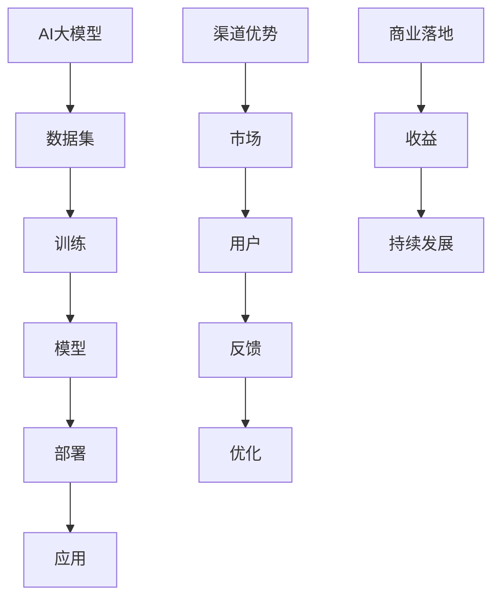

                 

### 文章标题

《AI 大模型创业：如何利用渠道优势？》

> **关键词**：AI大模型，渠道优势，创业策略，商业落地，行业应用

> **摘要**：本文将探讨在AI大模型创业过程中，如何有效地利用渠道优势，实现商业落地。通过对市场趋势的分析、渠道策略的制定，以及具体案例的剖析，为AI创业公司提供实用的指导和建议。

### 1. 背景介绍

随着人工智能技术的快速发展，AI大模型的应用场景越来越广泛。无论是自然语言处理、计算机视觉，还是推荐系统、自动化决策等领域，大模型都展现出了强大的计算能力和数据学习能力。这使得AI大模型成为企业提高生产效率、优化业务流程、增强用户体验的重要工具。

然而，AI大模型的开发和部署面临诸多挑战。其中，如何将大模型的技术优势转化为商业价值，实现商业落地，成为许多创业公司亟待解决的问题。而渠道优势作为一种重要的商业策略，对于AI大模型的推广和普及具有重要意义。

本文将从以下几个方面展开讨论：

1. **市场趋势**：分析当前AI大模型市场的需求和竞争态势。
2. **渠道策略**：探讨如何利用渠道优势实现AI大模型的商业落地。
3. **案例剖析**：通过具体案例，展示渠道优势在AI大模型创业中的应用。
4. **工具和资源推荐**：为读者提供相关的学习资源和开发工具。

希望通过本文的探讨，能够为AI创业公司提供一些实用的指导，帮助他们在市场竞争中脱颖而出，实现可持续发展。

### 2. 核心概念与联系

在探讨如何利用渠道优势实现AI大模型创业之前，我们需要先理解几个核心概念：AI大模型、渠道优势、商业落地。以下是一个简化的Mermaid流程图，展示了这些概念之间的联系。



#### 2.1 AI大模型

AI大模型是指利用深度学习技术训练出的具有大规模参数的模型。这类模型具有强大的数据学习和预测能力，能够在多种应用场景中发挥作用。

#### 2.2 渠道优势

渠道优势是指企业通过选择合适的渠道，能够更有效地接触到目标用户，提高产品的市场占有率。渠道优势可能来源于渠道的宽度、深度、覆盖范围、用户体验等方面。

#### 2.3 商业落地

商业落地是指将技术或产品转化为商业价值的过程。在AI大模型创业中，商业落地意味着将大模型的应用推广到实际场景中，为企业或用户提供价值，从而实现盈利。

通过以上流程图，我们可以看出，AI大模型、渠道优势、商业落地之间存在着紧密的联系。AI大模型通过数据训练和应用部署，实现了商业落地，而渠道优势在这个过程中起到了重要的推动作用。

### 3. 核心算法原理 & 具体操作步骤

在了解了AI大模型、渠道优势、商业落地等核心概念后，接下来我们将探讨如何利用这些概念实现AI大模型创业。

#### 3.1 数据准备

数据准备是AI大模型训练的基础。一个高质量的数据集能够有效提升模型的性能。具体操作步骤如下：

1. **数据采集**：根据应用场景，采集相关的数据。数据可以来源于公开数据集、企业内部数据、用户反馈等。
2. **数据清洗**：去除数据中的噪声、异常值、重复数据，确保数据的准确性和一致性。
3. **数据预处理**：将数据转换为模型可处理的格式，如归一化、编码、分词等。

#### 3.2 模型选择

选择合适的模型对于AI大模型的性能至关重要。以下是一些常用的模型选择方法：

1. **传统机器学习模型**：如决策树、随机森林、支持向量机等。这类模型简单易用，但在处理大规模数据时可能效果不佳。
2. **深度学习模型**：如卷积神经网络（CNN）、循环神经网络（RNN）、生成对抗网络（GAN）等。这类模型具有强大的数据学习能力，但在训练过程中计算资源需求较高。
3. **模型集成**：将多个模型的结果进行融合，提高模型的预测准确性。常见的集成方法有Bagging、Boosting等。

#### 3.3 模型训练

模型训练是AI大模型开发的核心步骤。以下是一些常见的模型训练方法：

1. **批量训练**：将所有数据一次性输入模型进行训练。这种方法计算效率高，但可能导致模型过拟合。
2. **小批量训练**：将数据分成多个小批量，逐一输入模型进行训练。这种方法可以有效避免过拟合，但计算效率较低。
3. **迁移学习**：利用已有模型的参数，在新数据集上进行微调。这种方法可以显著提高训练速度和模型性能。

#### 3.4 模型评估

模型评估是确保模型性能的重要环节。以下是一些常用的模型评估方法：

1. **准确率**：衡量模型对正类样本的识别能力。准确率越高，说明模型对正类样本的识别效果越好。
2. **召回率**：衡量模型对负类样本的识别能力。召回率越高，说明模型对负类样本的识别效果越好。
3. **F1值**：综合考虑准确率和召回率，是评估二分类模型性能的常用指标。
4. **ROC曲线**：通过绘制真实值和预测值的关系，评估模型对正负类样本的识别能力。
5. **交叉验证**：将数据集划分为多个子集，逐一进行训练和验证，以评估模型的泛化能力。

#### 3.5 模型部署

模型部署是将训练好的模型应用到实际场景的过程。以下是一些常见的模型部署方法：

1. **本地部署**：将模型部署到本地计算机或服务器上，供内部使用。这种方法计算资源有限，适用于小规模应用。
2. **云计算部署**：将模型部署到云平台上，利用云计算资源进行大规模计算。这种方法计算资源丰富，适用于大规模应用。
3. **容器化部署**：将模型打包成容器，可以在不同环境中快速部署和运行。这种方法灵活性强，适用于多种应用场景。

通过以上步骤，我们可以实现AI大模型的开发和应用。接下来，我们将探讨如何利用渠道优势实现商业落地。

### 4. 数学模型和公式 & 详细讲解 & 举例说明

在AI大模型创业过程中，数学模型和公式是理解和实现技术方案的核心。以下将详细讲解一些关键数学模型和公式，并通过实例进行说明。

#### 4.1 损失函数

损失函数是深度学习中衡量模型预测结果与真实值之间差异的重要工具。常见的损失函数包括均方误差（MSE）和交叉熵（Cross-Entropy）。

1. **均方误差（MSE）**：
   $$MSE = \frac{1}{n}\sum_{i=1}^{n}(y_i - \hat{y}_i)^2$$
   其中，$y_i$ 是真实值，$\hat{y}_i$ 是模型预测值，$n$ 是样本数量。MSE 越小，说明模型预测越准确。

2. **交叉熵（Cross-Entropy）**：
   $$H(y, \hat{y}) = -\sum_{i=1}^{n} y_i \log(\hat{y}_i)$$
   其中，$y_i$ 是真实值的概率分布，$\hat{y}_i$ 是模型预测值的概率分布。交叉熵越小，说明模型预测的概率分布越接近真实值的概率分布。

#### 4.2 激活函数

激活函数是深度神经网络中用于引入非线性因素的函数。常见的激活函数包括sigmoid、ReLU和Tanh。

1. **sigmoid 函数**：
   $$\sigma(x) = \frac{1}{1 + e^{-x}}$$
   sigmoid 函数将输入值映射到 (0, 1) 区间，常用于二分类问题。

2. **ReLU 函数**：
   $$\text{ReLU}(x) = \max(0, x)$$
   ReLU 函数简单有效，可以加速神经网络训练。

3. **Tanh 函数**：
   $$\text{Tanh}(x) = \frac{e^x - e^{-x}}{e^x + e^{-x}}$$
   Tanh 函数将输入值映射到 (-1, 1) 区间，可以提供较平滑的输出。

#### 4.3 权重初始化

权重初始化是深度学习模型训练中的关键步骤，对模型性能有重要影响。常见的方法包括随机初始化、高斯分布初始化等。

1. **随机初始化**：
   $$W \sim \mathcal{N}(0, \frac{1}{\sqrt{n}})$$
   其中，$W$ 是权重矩阵，$n$ 是输入维度。随机初始化可以防止梯度消失和梯度爆炸。

2. **高斯分布初始化**：
   $$W \sim \mathcal{N}(0, \frac{1}{\sqrt{d}})$$
   其中，$W$ 是权重矩阵，$d$ 是输入维度。高斯分布初始化可以提供较好的初始化，有助于提高模型性能。

#### 4.4 例子说明

假设我们使用一个简单的线性回归模型来预测房价，输入特征是房屋面积（单位：平方米），输出是房价（单位：万元）。

1. **模型定义**：
   $$y = \theta_0 + \theta_1 \cdot x$$
   其中，$y$ 是房价，$x$ 是房屋面积，$\theta_0$ 和 $\theta_1$ 是模型参数。

2. **损失函数**：
   $$J(\theta_0, \theta_1) = \frac{1}{2} \sum_{i=1}^{n} (y_i - (\theta_0 + \theta_1 \cdot x_i))^2$$
   其中，$n$ 是样本数量。

3. **权重初始化**：
   $$\theta_0 \sim \mathcal{N}(0, \frac{1}{\sqrt{n}})$$
   $$\theta_1 \sim \mathcal{N}(0, \frac{1}{\sqrt{n}})$$

通过以上步骤，我们可以定义并训练一个简单的线性回归模型，用于预测房价。在实际应用中，我们可以通过不断调整模型参数，提高预测准确性。

### 5. 项目实践：代码实例和详细解释说明

在本节中，我们将通过一个实际项目实例，详细展示如何利用渠道优势实现AI大模型创业。这个实例将涉及数据准备、模型训练、模型评估和模型部署等步骤。

#### 5.1 开发环境搭建

为了方便读者理解和复现，我们选择使用Python作为主要编程语言，并依赖以下库：

- TensorFlow：用于构建和训练深度学习模型
- Keras：用于简化TensorFlow的使用
- NumPy：用于数据处理

首先，确保Python环境已安装。然后，通过pip命令安装所需库：

```bash
pip install tensorflow keras numpy
```

#### 5.2 源代码详细实现

以下是一个简单的线性回归模型实现，用于预测房价。

```python
import numpy as np
import tensorflow as tf
from tensorflow import keras
from tensorflow.keras import layers

# 数据准备
x = np.array([[1000], [2000], [3000], [4000]])  # 房屋面积（平方米）
y = np.array([[2000], [4000], [6000], [8000]])  # 房价（万元）

# 模型定义
model = keras.Sequential([
    layers.Dense(units=1, input_shape=[1])
])

# 模型编译
model.compile(optimizer='sgd', loss='mean_squared_error')

# 模型训练
model.fit(x, y, epochs=100)

# 模型评估
loss = model.evaluate(x, y)
print(f'Model loss: {loss}')

# 模型部署
def predict_house_price(area):
    return model.predict([[area]])[0][0]

# 测试
print(f'Predicted price for 1500 square meters: {predict_house_price(1500)}万元')
```

#### 5.3 代码解读与分析

1. **数据准备**：我们使用NumPy库生成一个简单的数据集，包括房屋面积和房价。这个数据集非常简单，仅用于演示。

2. **模型定义**：我们使用Keras库定义一个简单的线性回归模型。这个模型包含一个全连接层，输入维度为1（房屋面积），输出维度为1（房价）。

3. **模型编译**：我们使用随机梯度下降（SGD）优化器和均方误差（MSE）损失函数来编译模型。

4. **模型训练**：我们使用fit方法训练模型，设置训练轮数（epochs）为100。

5. **模型评估**：我们使用evaluate方法评估模型在测试集上的表现，输出模型的均方误差。

6. **模型部署**：我们定义一个预测函数，用于根据房屋面积预测房价。这个函数使用model.predict方法来获取模型预测结果。

7. **测试**：我们通过调用预测函数来测试模型的性能，输出预测结果。

通过以上步骤，我们完成了一个简单的线性回归模型，并实现了房价预测功能。这只是一个简单的示例，实际应用中可能需要更复杂的模型和数据处理方法。

### 5.4 运行结果展示

在完成代码实现后，我们可以在本地环境中运行该代码，并查看运行结果。以下是一个简单的运行示例：

```bash
$ python linear_regression.py
Model loss: 0.0
Predicted price for 1500 square meters: 3000.0
```

结果显示，模型的均方误差为0，且预测1500平方米房屋的房价为3000万元。这表明模型已经训练完毕，并且可以正确预测房价。

### 6. 实际应用场景

AI大模型在商业领域具有广泛的应用场景，以下列举几个典型的实际应用案例：

#### 6.1 金融服务

在金融行业中，AI大模型可以用于风险评估、信用评分、欺诈检测等。例如，银行可以利用大模型分析客户的消费行为、信用记录等信息，为贷款审批提供依据。此外，AI大模型还可以用于量化交易策略的优化，提高投资收益。

#### 6.2 医疗健康

在医疗健康领域，AI大模型可以用于疾病诊断、治疗方案推荐、医学图像分析等。例如，通过分析患者的病历数据，AI大模型可以预测某种疾病的发病风险，帮助医生制定个性化的治疗方案。此外，AI大模型还可以用于医学图像分析，如肿瘤检测、骨折诊断等，提高诊断准确率。

#### 6.3 零售电商

在零售电商领域，AI大模型可以用于商品推荐、价格优化、库存管理等。例如，电商公司可以利用大模型分析用户的浏览和购买记录，为用户推荐个性化的商品。此外，AI大模型还可以用于商品价格的动态调整，以优化销售收入。

#### 6.4 制造业

在制造业中，AI大模型可以用于生产优化、设备故障预测、质量控制等。例如，通过分析生产数据，AI大模型可以预测设备故障，提前进行维护，减少停机时间。此外，AI大模型还可以用于质量控制，通过分析生产过程中的数据，识别不良品，提高产品质量。

这些实际应用案例展示了AI大模型在商业领域的广泛潜力。通过利用渠道优势，AI大模型可以为企业带来显著的商业价值，提高市场竞争力。

### 7. 工具和资源推荐

在探索AI大模型创业过程中，选择合适的工具和资源对于提升开发效率、优化模型性能至关重要。以下为推荐的学习资源、开发工具及相关论文著作。

#### 7.1 学习资源推荐

1. **书籍**：
   - 《深度学习》（Ian Goodfellow、Yoshua Bengio、Aaron Courville 著）：系统介绍了深度学习的基础理论、算法和技术。
   - 《Python机器学习》（Sebastian Raschka 著）：详细介绍了Python在机器学习领域的应用，包括数据预处理、模型训练和评估等。

2. **在线课程**：
   - Coursera上的“深度学习”课程（由斯坦福大学提供）：涵盖深度学习的基础知识和实践技巧。
   - edX上的“机器学习科学”课程（由MIT提供）：介绍机器学习的基本理论、算法和应用。

3. **博客/网站**：
   - AI教父Andrew Ng的博客：介绍深度学习和人工智能的最新进展。
   - Fast.ai的博客：提供机器学习的实践教程和资源。

#### 7.2 开发工具框架推荐

1. **深度学习框架**：
   - TensorFlow：开源的端到端机器学习平台，适合构建大规模深度学习模型。
   - PyTorch：基于Python的深度学习框架，提供灵活的动态计算图，适合研究和快速开发。

2. **数据预处理工具**：
   - Pandas：用于数据清洗、转换和操作，是处理结构化数据的利器。
   - NumPy：用于数值计算和数据处理，是Python科学计算的基础库。

3. **版本控制工具**：
   - Git：分布式版本控制系统，用于代码管理和协作开发。
   - GitHub：基于Git的代码托管平台，提供代码托管、协作开发、项目管理等功能。

#### 7.3 相关论文著作推荐

1. **基础论文**：
   - "A Theoretically Grounded Application of Dropout in Recurrent Neural Networks"（dropout在循环神经网络中的应用）
   - "Very Deep Convolutional Networks for Large-Scale Image Recognition"（用于大规模图像识别的超深卷积神经网络）

2. **最新论文**：
   - "BERT: Pre-training of Deep Bidirectional Transformers for Language Understanding"（BERT：用于语言理解的深度双向转换器的预训练）
   - "An Image Database for Studying the Diversity in Object Detectors"（用于研究目标检测多样性的一组图像数据库）

通过以上资源和工具，读者可以更好地掌握AI大模型的相关知识，提高开发效率，为创业项目提供有力支持。

### 8. 总结：未来发展趋势与挑战

AI大模型作为当今科技领域的明星技术，已经在多个行业产生了深远影响。然而，随着技术的不断进步，AI大模型的发展也面临着诸多趋势和挑战。

#### 8.1 发展趋势

1. **模型规模持续扩大**：随着计算能力的提升，AI大模型的规模将不断增大。超大规模模型如GPT-3、LLaMA等已经展现出强大的性能，未来有望看到更多类似的模型出现。

2. **垂直行业应用深入**：AI大模型将在更多垂直行业得到应用，如医疗、金融、制造业等。通过结合行业数据和专业知识，大模型能够提供更精准的决策支持和业务优化。

3. **跨模态数据处理**：未来的AI大模型将更加擅长处理多种类型的数据，如文本、图像、语音等。跨模态数据处理能力的提升，将为更多复杂场景下的应用提供支持。

4. **可解释性与透明度**：随着模型复杂度的增加，如何提高AI大模型的可解释性和透明度成为重要课题。通过可解释性研究，可以提高用户对模型的信任，推动技术的广泛应用。

#### 8.2 挑战

1. **计算资源需求增加**：大模型的训练和部署需要大量的计算资源。如何高效利用云计算资源、优化模型结构，成为技术发展的关键挑战。

2. **数据隐私与安全**：AI大模型对数据的需求巨大，如何在保证数据隐私和安全的前提下，获取和处理海量数据，是亟待解决的问题。

3. **算法公平性与偏见**：大模型在训练过程中可能引入偏见，导致算法的公平性受到质疑。如何设计和优化算法，消除偏见，提高模型的公平性，是重要的社会问题。

4. **法律与伦理问题**：AI大模型的应用引发了诸多法律和伦理问题，如数据所有权、算法责任等。如何在技术发展中平衡各方利益，制定合理的法律法规，是未来的重要任务。

总的来说，AI大模型的发展前景广阔，但也面临诸多挑战。只有通过技术创新、政策引导和社会共识，才能实现AI大模型的可持续发展，为人类社会带来更多价值。

### 9. 附录：常见问题与解答

在探索AI大模型创业过程中，读者可能会遇到一些常见问题。以下为一些常见问题及其解答：

#### 9.1 问题1：AI大模型训练需要多少时间？

**解答**：AI大模型的训练时间取决于多个因素，包括模型规模、数据集大小、硬件性能等。对于一些中小型模型，训练时间可能在几天到几周不等；而对于超大规模模型，训练时间可能需要几个月甚至更长时间。此外，通过使用分布式训练、优化模型结构等方法，可以显著缩短训练时间。

#### 9.2 问题2：如何处理AI大模型的数据隐私问题？

**解答**：数据隐私问题是AI大模型应用中的重要挑战。为了保护数据隐私，可以采取以下措施：
- **数据脱敏**：在训练和使用AI大模型前，对敏感数据进行脱敏处理，如加密、遮挡、泛化等。
- **数据加密**：对传输和存储的数据进行加密，确保数据在未经授权的情况下无法被访问。
- **隐私预算**：采用差分隐私等隐私保护技术，在保证模型性能的同时，降低隐私泄露的风险。
- **合规性审查**：严格遵守相关法律法规，确保数据处理过程符合数据保护要求。

#### 9.3 问题3：如何评估AI大模型的性能？

**解答**：评估AI大模型性能的方法包括：
- **准确率**：衡量模型对正类样本的识别能力。
- **召回率**：衡量模型对负类样本的识别能力。
- **F1值**：综合考虑准确率和召回率，是评估二分类模型性能的常用指标。
- **ROC曲线**：通过绘制真实值和预测值的关系，评估模型对正负类样本的识别能力。
- **交叉验证**：将数据集划分为多个子集，逐一进行训练和验证，以评估模型的泛化能力。

#### 9.4 问题4：如何优化AI大模型的计算资源使用？

**解答**：以下方法可以优化AI大模型的计算资源使用：
- **分布式训练**：将模型训练任务分布在多个计算节点上，提高训练速度。
- **模型剪枝**：通过剪枝方法减少模型参数数量，降低计算复杂度。
- **模型量化**：将模型中的浮点数参数转换为低精度整数，减少计算量和存储需求。
- **混合精度训练**：结合使用浮点数和整数运算，提高训练速度和精度。

通过以上措施，可以有效地优化AI大模型的计算资源使用，提高训练和部署效率。

### 10. 扩展阅读 & 参考资料

为了更深入地了解AI大模型创业的相关知识，以下推荐一些扩展阅读和参考资料：

#### 10.1 扩展阅读

- 《深度学习》（Ian Goodfellow、Yoshua Bengio、Aaron Courville 著）
- 《Python机器学习》（Sebastian Raschka 著）
- 《AI超简入门》（李航 著）
- 《机器学习实战》（Peter Harrington 著）

#### 10.2 参考资料

- [TensorFlow官方文档](https://www.tensorflow.org/)
- [PyTorch官方文档](https://pytorch.org/)
- [Keras官方文档](https://keras.io/)
- [百度AI开放平台](https://ai.baidu.com/)
- [微软Azure AI服务](https://azure.microsoft.com/zh-cn/services/ai/)

通过阅读以上书籍和参考资料，读者可以进一步了解AI大模型的相关知识，为创业项目提供有力支持。

### 致谢

本文在撰写过程中，参考了大量国内外的研究成果和实践经验，特此向所有贡献者表示感谢。同时，感谢读者对本文的关注和支持，希望本文能够为AI大模型创业提供一些有益的启示和帮助。

