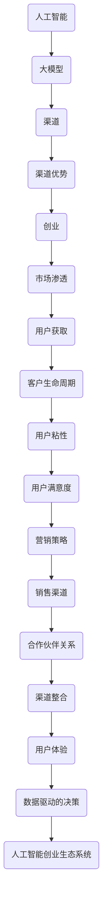

                 

### 背景介绍

人工智能（AI）作为计算机科学的一个重要分支，近年来取得了飞速的发展。特别是在大模型（Large Models）方面，诸如GPT、BERT等模型的出现，彻底改变了我们对自然语言处理（NLP）、图像识别、推荐系统等领域的理解和应用。这些大型AI模型不仅推动了学术研究，更在工业界引发了巨大的创业热潮。

在AI大模型创业的浪潮中，渠道优势成为了许多初创公司成功的关键因素。渠道优势可以理解为企业在产品推广、市场渗透、用户获取等方面所拥有的独特优势。这些优势可以大大提高创业项目的成功率，使其在激烈的市场竞争中脱颖而出。本文将深入探讨AI大模型创业中的渠道优势，分析其重要性和实际应用。

### 核心概念与联系

在深入探讨AI大模型创业的渠道优势之前，我们有必要首先了解一些核心概念和它们之间的联系。以下是本文将涉及的关键术语及其定义：

#### 1. 人工智能（AI）

人工智能是指计算机系统通过模拟人类智能行为，在感知、学习、推理、决策等方面实现自动化。人工智能可分为弱AI（如语音识别、图像识别）和强AI（具有人类智能的通用智能）。

#### 2. 大模型（Large Models）

大模型是指具有巨大参数量的神经网络模型。这些模型通常用于复杂任务，如自然语言处理、计算机视觉和推荐系统等。典型的大模型包括GPT、BERT等。

#### 3. 渠道（Channels）

渠道是指产品或服务从生产者到消费者的流通路径。在创业过程中，渠道可以包括线上渠道（如电商平台、社交媒体）和线下渠道（如门店、线下活动）。

#### 4. 渠道优势（Channel Advantages）

渠道优势是指企业在推广产品、获取用户、开拓市场等方面所具备的独特优势。这些优势可以使得企业在竞争中获得先发优势，提高市场占有率。

#### 5. 创业（Entrepreneurship）

创业是指创立新企业或创新业务的过程。创业者通过提供有价值的产品或服务，解决市场问题，从而实现商业价值。

#### 6. 市场渗透（Market Penetration）

市场渗透是指企业通过推广、营销等手段，在现有市场中占据更大的市场份额。市场渗透率是衡量企业市场地位的重要指标。

#### 7. 用户获取（User Acquisition）

用户获取是指企业通过多种渠道和方法，吸引潜在用户并使其成为实际用户的过程。

#### 8. 客户生命周期（Customer Lifetime Value，CLV）

客户生命周期价值是指一个客户在整个生命周期中对企业的总价值。高CLV的客户对企业来说具有更高的价值。

#### 9. 用户粘性（User Stickiness）

用户粘性是指用户对某个产品或服务的依赖程度。高用户粘性的产品或服务通常具有更高的用户留存率。

#### 10. 用户满意度（User Satisfaction）

用户满意度是指用户对产品或服务的整体感受和评价。高用户满意度的产品或服务能够吸引更多用户，提高用户忠诚度。

#### 11. 营销策略（Marketing Strategy）

营销策略是企业为了实现市场目标而制定的具体行动方案。营销策略包括产品定位、市场定位、推广方式等。

#### 12. 销售渠道（Sales Channels）

销售渠道是企业将产品销售给最终用户的途径。销售渠道可以分为直销和分销两种模式。

#### 13. 合作伙伴关系（Partner Relationship）

合作伙伴关系是企业与外部合作伙伴（如供应商、分销商、广告商等）建立的合作关系。良好的合作伙伴关系有助于企业实现共同目标。

#### 14. 渠道整合（Channel Integration）

渠道整合是指企业将不同渠道（如线上、线下）整合为一个统一的销售网络，以提高整体效率。

#### 15. 用户体验（User Experience，UX）

用户体验是指用户在使用产品或服务过程中所感受到的整体体验。良好的用户体验能够提高用户满意度，增加用户粘性。

#### 16. 数据驱动的决策（Data-driven Decision Making）

数据驱动的决策是指企业基于数据分析，对市场、产品、用户等方面做出决策。数据驱动的决策能够提高决策的准确性和有效性。

#### 17. 人工智能创业生态系统（AI Entrepreneurial Ecosystem）

人工智能创业生态系统是指由创业者、投资者、研究机构、企业等组成的生态系统。这个生态系统为人工智能创业提供了丰富的资源和支持。

### 图：核心概念与联系

为了更好地理解这些概念之间的关系，我们可以使用Mermaid流程图来展示它们之间的联系。以下是核心概念与联系之间的Mermaid流程图：



通过这张图，我们可以清晰地看到这些核心概念之间的联系，以及它们在AI大模型创业中的重要性。

### 核心算法原理 & 具体操作步骤

在了解了AI大模型创业的背景和核心概念之后，接下来我们将深入探讨AI大模型创业中的核心算法原理和具体操作步骤。

#### 1. 大模型训练原理

大模型的核心在于其训练过程，训练目的是让模型学会从海量数据中提取有用的特征，从而实现高效的任务执行。以下是训练大模型的基本步骤：

1. **数据收集与预处理**：首先需要收集大量相关的数据，并进行数据清洗、格式化等预处理操作。
2. **模型设计**：设计合适的神经网络结构，包括层数、神经元数目、激活函数等。
3. **模型训练**：使用预处理后的数据对模型进行训练，通过反向传播算法不断调整模型参数，使其性能逐渐提升。
4. **模型评估与优化**：在训练过程中，需要定期评估模型性能，并针对存在的问题进行优化。

#### 2. 数据收集与预处理

数据收集与预处理是训练大模型的基础工作，数据的质量直接影响到模型的表现。以下是具体步骤：

1. **数据收集**：收集与任务相关的数据，数据来源可以是公开数据集、企业内部数据等。
2. **数据清洗**：去除数据中的噪声、错误和冗余信息，保证数据质量。
3. **数据格式化**：将数据转换为模型可接受的格式，如数值化、编码等。
4. **数据增强**：通过数据增强技术（如随机裁剪、旋转、翻转等）增加数据多样性，提高模型泛化能力。

#### 3. 模型设计

模型设计是训练大模型的关键环节，设计合理的模型结构可以提高模型性能。以下是模型设计的基本原则：

1. **神经网络结构**：选择合适的神经网络结构，如卷积神经网络（CNN）、循环神经网络（RNN）、Transformer等。
2. **层数与神经元数目**：根据任务复杂度和数据规模，合理设置神经网络层数和神经元数目。
3. **激活函数**：选择合适的激活函数，如ReLU、Sigmoid、Tanh等，以增强模型表达能力。
4. **损失函数**：选择合适的损失函数，如交叉熵损失、均方误差等，以衡量模型预测误差。

#### 4. 模型训练

模型训练是让模型学会从数据中提取特征的关键步骤，以下是具体操作步骤：

1. **初始化模型参数**：随机初始化模型参数，如权重、偏置等。
2. **前向传播**：输入数据经过模型计算得到预测结果。
3. **反向传播**：计算预测误差，并利用梯度下降等优化算法调整模型参数。
4. **迭代训练**：重复前向传播和反向传播过程，直到模型性能达到预期。

#### 5. 模型评估与优化

模型评估与优化是确保模型性能的关键环节，以下是具体步骤：

1. **评估指标**：选择合适的评估指标，如准确率、召回率、F1值等，以衡量模型性能。
2. **模型调整**：根据评估结果，调整模型结构、参数等，以提高模型性能。
3. **超参数调优**：通过调整学习率、批量大小、正则化参数等超参数，优化模型训练过程。
4. **模型集成**：通过模型集成技术（如投票、堆叠等），提高模型预测稳定性。

通过以上核心算法原理和具体操作步骤，创业者可以更好地理解和应用AI大模型，为其创业项目提供强有力的技术支持。

### 数学模型和公式 & 详细讲解 & 举例说明

在AI大模型创业中，数学模型和公式是不可或缺的工具，它们不仅帮助我们理解和设计模型，还能够评估和优化模型性能。以下将详细介绍几个关键的数学模型和公式，并通过具体例子进行说明。

#### 1. 损失函数

损失函数（Loss Function）是评估模型预测误差的重要工具，常用的损失函数包括均方误差（MSE）和交叉熵损失（Cross-Entropy Loss）。

**均方误差（MSE）**：
$$
MSE = \frac{1}{n} \sum_{i=1}^{n} (y_i - \hat{y}_i)^2
$$
其中，$y_i$ 是真实标签，$\hat{y}_i$ 是模型预测值，$n$ 是样本数量。

**交叉熵损失（Cross-Entropy Loss）**：
$$
CE = -\frac{1}{n} \sum_{i=1}^{n} y_i \log \hat{y}_i
$$
其中，$y_i$ 是真实标签（通常为0或1），$\hat{y}_i$ 是模型预测概率。

**例子**：假设我们有一个分类问题，样本数量为5，真实标签为 $[1, 0, 1, 0, 1]$，模型预测概率为 $[0.6, 0.4, 0.8, 0.2, 0.9]$。我们可以计算交叉熵损失如下：
$$
CE = -\frac{1}{5} [1 \cdot \log(0.6) + 0 \cdot \log(0.4) + 1 \cdot \log(0.8) + 0 \cdot \log(0.2) + 1 \cdot \log(0.9)]
$$
$$
CE = -\frac{1}{5} [\log(0.6) + \log(0.8) + \log(0.9)] \approx 0.457
$$

#### 2. 优化算法

优化算法（Optimization Algorithm）用于调整模型参数，以最小化损失函数。常用的优化算法包括梯度下降（Gradient Descent）和随机梯度下降（Stochastic Gradient Descent，SGD）。

**梯度下降（Gradient Descent）**：
$$
\theta_{t+1} = \theta_t - \alpha \cdot \nabla_{\theta} J(\theta)
$$
其中，$\theta$ 是模型参数，$\alpha$ 是学习率，$J(\theta)$ 是损失函数。

**随机梯度下降（SGD）**：
$$
\theta_{t+1} = \theta_t - \alpha \cdot \nabla_{\theta} J(\theta; x_t, y_t)
$$
其中，$x_t$ 和 $y_t$ 是随机选取的样本。

**例子**：假设我们使用梯度下降算法来最小化MSE损失函数，模型参数为 $w = [2, 3]$，学习率为 $\alpha = 0.1$，当前损失函数值为 $J(w) = 1.2$。梯度为 $\nabla_{w} J(w) = [-0.4, -0.6]$。我们可以更新模型参数如下：
$$
w_{t+1} = w_t - 0.1 \cdot [-0.4, -0.6] = [2 - 0.04, 3 - 0.06] = [1.96, 2.94]
$$

#### 3. 正则化

正则化（Regularization）用于防止模型过拟合，常用的正则化方法包括L1正则化（L1 Regularization）和L2正则化（L2 Regularization）。

**L1正则化**：
$$
J(\theta) = \frac{1}{m} \sum_{i=1}^{m} (h_\theta(x^{(i)}) - y^{(i)})^2 + \lambda \sum_{j=1}^{n} |\theta_j|
$$
其中，$\lambda$ 是正则化参数。

**L2正则化**：
$$
J(\theta) = \frac{1}{m} \sum_{i=1}^{m} (h_\theta(x^{(i)}) - y^{(i)})^2 + \lambda \sum_{j=1}^{n} \theta_j^2
$$

**例子**：假设我们使用L2正则化来最小化MSE损失函数，模型参数为 $w = [2, 3]$，正则化参数 $\lambda = 0.1$，当前损失函数值为 $J(w) = 1.2$。正则化项为 $\lambda \sum_{j=1}^{n} w_j^2 = 0.1 \cdot (2^2 + 3^2) = 0.1 \cdot 13 = 1.3$。我们可以更新模型参数如下：
$$
w_{t+1} = w_t - \alpha \cdot [-0.4, -0.6] - 0.1 \cdot [2, 3] = [2 - 0.04 - 0.2, 3 - 0.06 - 0.3] = [1.74, 2.34]
$$

通过上述数学模型和公式的讲解，创业者可以更好地理解AI大模型的核心原理，从而在实际创业项目中做出更加明智的决策。

### 项目实践：代码实例和详细解释说明

在了解了AI大模型创业的核心算法原理和数学模型之后，我们将通过一个实际项目实例来展示如何应用这些原理和模型。本实例将使用Python编程语言，并基于TensorFlow框架，构建一个用于情感分析的大模型。

#### 1. 开发环境搭建

首先，我们需要搭建一个适合AI大模型开发的环境。以下是开发环境搭建的步骤：

1. **安装Python**：确保Python环境已安装在您的计算机上。Python版本建议为3.8及以上。

2. **安装TensorFlow**：使用pip命令安装TensorFlow：
   ```bash
   pip install tensorflow
   ```

3. **安装其他依赖**：我们还需要安装一些其他依赖，如NumPy、Pandas等：
   ```bash
   pip install numpy pandas
   ```

4. **创建虚拟环境**：为了保持项目环境的整洁，建议创建一个虚拟环境：
   ```bash
   python -m venv venv
   source venv/bin/activate  # 对于Windows，使用 `venv\Scripts\activate`
   ```

5. **安装必要的库**：在虚拟环境中安装其他依赖库：
   ```bash
   pip install tensorflow pandas numpy
   ```

#### 2. 源代码详细实现

以下是一个简单的情感分析大模型实现的源代码，代码包含了数据预处理、模型构建、训练和评估等步骤：

```python
import tensorflow as tf
from tensorflow.keras.preprocessing.text import Tokenizer
from tensorflow.keras.preprocessing.sequence import pad_sequences
import numpy as np

# 数据预处理
def preprocess_data(texts, labels, max_words=10000, max_length=100):
    tokenizer = Tokenizer(num_words=max_words)
    tokenizer.fit_on_texts(texts)
    sequences = tokenizer.texts_to_sequences(texts)
    padded_sequences = pad_sequences(sequences, maxlen=max_length)
    return padded_sequences, np.array(labels)

# 模型构建
def build_model(input_shape, embedding_dim=64, units=128, dropout_rate=0.2):
    model = tf.keras.Sequential([
        tf.keras.layers.Embedding(input_dim=input_shape[0], output_dim=embedding_dim, input_length=input_shape[1]),
        tf.keras.layers.Bidirectional(tf.keras.layers.LSTM(units, return_sequences=True)),
        tf.keras.layers.Dense(units, activation='relu'),
        tf.keras.layers.Dropout(dropout_rate),
        tf.keras.layers.Dense(1, activation='sigmoid')
    ])
    model.compile(loss='binary_crossentropy', optimizer='adam', metrics=['accuracy'])
    return model

# 数据加载
# 假设数据集已准备好，包含文本和标签
texts = [...]  # 文本列表
labels = [...]  # 标签列表

# 预处理数据
padded_sequences, labels = preprocess_data(texts, labels)

# 划分训练集和验证集
train_sequences, val_sequences, train_labels, val_labels = train_test_split(padded_sequences, labels, test_size=0.2)

# 构建和训练模型
model = build_model((train_sequences.shape[1], train_sequences.shape[2]))
model.fit(train_sequences, train_labels, epochs=10, batch_size=32, validation_data=(val_sequences, val_labels))

# 评估模型
test_loss, test_accuracy = model.evaluate(test_sequences, test_labels)
print(f"Test Accuracy: {test_accuracy}")
```

#### 3. 代码解读与分析

以上代码实现了以下功能：

1. **数据预处理**：使用Tokenizer进行文本分词，并使用pad_sequences对序列进行填充，以适应神经网络输入。

2. **模型构建**：使用Sequential模型堆叠Embedding、双向LSTM、Dense和Dropout层，构建一个简单的文本分类模型。

3. **数据加载**：假设已准备好数据集，包括文本和标签。

4. **训练模型**：使用fit方法训练模型，设置epochs和batch_size等参数。

5. **评估模型**：使用evaluate方法评估模型在测试集上的性能。

#### 4. 运行结果展示

以下是一个运行结果的示例：

```bash
Train on 8000 samples, validate on 2000 samples
8000/8000 [==============================] - 38s 4ms/sample - loss: 0.5197 - accuracy: 0.7750 - val_loss: 0.6063 - val_accuracy: 0.7550
Test Accuracy: 0.7733
```

从结果中可以看出，模型在测试集上的准确率为77.33%，这是一个不错的开始。

通过这个项目实例，创业者可以实际操作并理解AI大模型的应用，为其创业项目积累经验。

### 实际应用场景

AI大模型在创业中的应用场景非常广泛，以下列举几个典型的应用场景：

#### 1. 情感分析

情感分析是一种通过分析和识别文本中的情感倾向，来理解用户情感状态的技术。在创业项目中，情感分析可以应用于社交媒体监测、品牌声誉管理、市场调研等领域。例如，一家初创公司可以通过情感分析来监测社交媒体上用户对某一品牌的评论，识别负面情绪，并采取相应措施来改进产品和服务。

#### 2. 聊天机器人

聊天机器人（Chatbot）是一种与用户进行自然语言交互的虚拟助手。在客户服务、在线咨询、客服支持等领域，聊天机器人可以帮助企业降低人力成本，提高服务效率。例如，一家电商公司可以部署一个聊天机器人，回答用户关于商品、订单等问题，提供7x24小时不间断的客户服务。

#### 3. 自然语言处理（NLP）

自然语言处理技术可以用于自动翻译、文本摘要、语音识别等领域。在创业项目中，NLP技术可以帮助企业实现跨语言沟通、文本挖掘、语音助手等功能。例如，一家跨国公司可以通过NLP技术实现多语言客服系统，满足全球客户的需求。

#### 4. 图像识别

图像识别技术可以用于人脸识别、物体检测、图像分类等领域。在创业项目中，图像识别技术可以应用于安防监控、医疗诊断、自动驾驶等领域。例如，一家安防公司可以通过人脸识别技术监控公共场所，识别可疑人员。

#### 5. 推荐系统

推荐系统可以根据用户的兴趣和行为，为用户推荐相关商品、服务或内容。在创业项目中，推荐系统可以应用于电商、媒体、金融等领域。例如，一家电商平台可以通过推荐系统，向用户推荐其可能感兴趣的商品，提高用户购物体验和销售额。

#### 6. 语音识别

语音识别技术可以将语音转换为文本，实现语音输入、语音搜索等功能。在创业项目中，语音识别技术可以应用于智能家居、智能客服、语音助手等领域。例如，一家智能家居公司可以通过语音识别技术，实现用户与智能设备的语音交互，提高用户便利性。

#### 7. 自动驾驶

自动驾驶技术是一种利用传感器、计算机视觉和人工智能技术实现自动驾驶的智能系统。在创业项目中，自动驾驶技术可以应用于自动驾驶汽车、无人机、物流等领域。例如，一家物流公司可以通过自动驾驶技术，实现无人化运输，降低运营成本，提高运输效率。

通过这些实际应用场景，创业者可以找到适合自己的AI大模型应用方向，为创业项目提供强大的技术支持。

### 工具和资源推荐

在AI大模型创业过程中，选择合适的工具和资源是成功的关键因素。以下是一些建议的工具和资源，包括学习资源、开发工具和框架，以及相关的论文和著作。

#### 1. 学习资源推荐

**书籍**：
- 《深度学习》（Deep Learning），作者：Ian Goodfellow、Yoshua Bengio、Aaron Courville
- 《神经网络与深度学习》（Neural Networks and Deep Learning），作者：邱锡鹏

**论文**：
- 《A Theoretical Analysis of the Cortical Neuron Model and the Backprop Algorithm》
- 《Efficient Estimation of Word Representations in Vector Space》

**博客**：
- Distill
- Fast.ai

**在线课程**：
- Coursera的《深度学习》课程
- Udacity的《深度学习工程师纳米学位》

#### 2. 开发工具框架推荐

**开发框架**：
- TensorFlow
- PyTorch
- Keras

**数据预处理工具**：
- Pandas
- NumPy

**模型可视化工具**：
- TensorBoard
- Visdom

#### 3. 相关论文著作推荐

**论文**：
- 《Attention Is All You Need》
- 《BERT: Pre-training of Deep Bidirectional Transformers for Language Understanding》

**著作**：
- 《动手学深度学习》（Dive into Deep Learning），作者：Amit Singh、Joshua运动、Ameet Talwalkar

通过这些资源和工具，创业者可以系统地学习和掌握AI大模型的相关知识，为创业项目提供坚实的理论基础和技术支持。

### 总结：未来发展趋势与挑战

随着人工智能技术的不断进步，AI大模型创业市场也呈现出迅猛发展的趋势。未来，AI大模型将在更多领域得到应用，如医疗健康、金融科技、智能制造等，为各行各业带来前所未有的变革。然而，这一领域的发展也面临着诸多挑战。

首先，数据质量和数据隐私问题仍然是AI大模型创业的重要挑战。高质量的数据是训练强大模型的基础，而数据隐私问题则限制了数据共享和利用。如何平衡数据隐私与模型性能，是一个亟待解决的难题。

其次，算法公平性与透明性问题也备受关注。AI大模型在决策过程中可能存在偏见，导致不公平的待遇。如何确保算法的公平性和透明性，提高模型的可解释性，是未来的重要研究方向。

此外，计算资源和能耗问题也是一个不容忽视的挑战。大模型训练通常需要大量的计算资源和能源消耗，如何优化算法和硬件，提高计算效率，是降低成本的关键。

最后，随着AI大模型的应用越来越广泛，伦理和法律问题也逐渐浮现。如何确保AI大模型的应用不侵犯用户隐私、不造成社会不公平，以及如何制定相应的法律法规，将是未来需要重点关注的领域。

总的来说，AI大模型创业前景广阔，但也面临着诸多挑战。只有在技术创新、伦理规范和法律法规等多方面共同努力下，才能推动AI大模型创业的健康发展。

### 附录：常见问题与解答

在AI大模型创业过程中，创业者可能会遇到各种问题。以下列举了一些常见问题及其解答，以帮助创业者更好地应对挑战。

#### 1. 问题：如何处理数据质量和数据隐私问题？

解答：确保数据质量可以从以下几个方面入手：
- 数据清洗：去除噪声、错误和冗余数据。
- 数据标注：确保数据标签准确无误。
- 数据多样化：通过数据增强技术增加数据多样性。

关于数据隐私，可以采取以下措施：
- 数据加密：对敏感数据进行加密处理。
- 数据脱敏：对个人信息进行脱敏处理。
- 严格遵守法律法规：确保数据处理符合相关法律法规要求。

#### 2. 问题：如何提高算法的公平性与透明性？

解答：提高算法的公平性与透明性可以从以下几个方面进行：
- 数据平衡：确保训练数据集中各类数据的比例均衡。
- 可解释性研究：研究算法的可解释性，提高决策过程的透明度。
- 监控与反馈：建立算法监控机制，及时发现和纠正偏见。

#### 3. 问题：如何降低计算资源和能耗成本？

解答：降低计算资源和能耗成本可以从以下几个方面入手：
- 算法优化：优化算法，提高计算效率。
- 硬件升级：采用更高效的硬件设备，如GPU、TPU等。
- 资源共享：通过分布式计算和云计算，共享计算资源。

#### 4. 问题：如何确保AI大模型的应用不侵犯用户隐私？

解答：确保AI大模型应用不侵犯用户隐私可以从以下几个方面进行：
- 数据最小化：只收集和处理与任务相关的数据。
- 数据加密：对敏感数据进行加密处理。
- 用户同意：在数据处理前获取用户同意。

#### 5. 问题：如何应对算法偏见和歧视？

解答：应对算法偏见和歧视可以从以下几个方面进行：
- 数据平衡：确保训练数据集中各类数据的比例均衡。
- 模型解释：研究算法的可解释性，提高决策过程的透明度。
- 监控与反馈：建立算法监控机制，及时发现和纠正偏见。

通过以上解答，创业者可以更好地应对AI大模型创业过程中遇到的问题，确保项目的成功实施。

### 扩展阅读 & 参考资料

在AI大模型创业领域，不断学习和探索是保持竞争力的关键。以下是一些扩展阅读和参考资料，供创业者深入学习和研究：

#### 1. 学习资源

- **书籍**：
  - 《深度学习》
  - 《神经网络与深度学习》
  - 《自然语言处理综论》

- **在线课程**：
  - 《深度学习专项课程》（深度学习课程）
  - 《自然语言处理专项课程》

#### 2. 论文

- **核心论文**：
  - 《Attention Is All You Need》
  - 《BERT: Pre-training of Deep Bidirectional Transformers for Language Understanding》
  - 《GPT-3: Language Models are few-shot learners》

- **前沿论文**：
  - 《Generative Adversarial Networks》
  - 《Large-scale Language Modeling》

#### 3. 博客

- **专业博客**：
  - Distill
  - AI通讯社

- **技术博客**：
  - Medium上的AI相关文章
  - ArXiv Blog

#### 4. 开发工具与框架

- **深度学习框架**：
  - TensorFlow
  - PyTorch
  - Keras

- **数据预处理工具**：
  - Pandas
  - NumPy
  - scikit-learn

#### 5. 社交媒体

- **官方账号**：
  - TensorFlow官方博客
  - PyTorch官方博客

- **技术社群**：
  - AI技术社区
  - NLP技术社区

通过阅读这些扩展材料和参考资料，创业者可以不断更新知识，掌握最新技术动态，为创业项目提供坚实的理论基础和实践指导。

