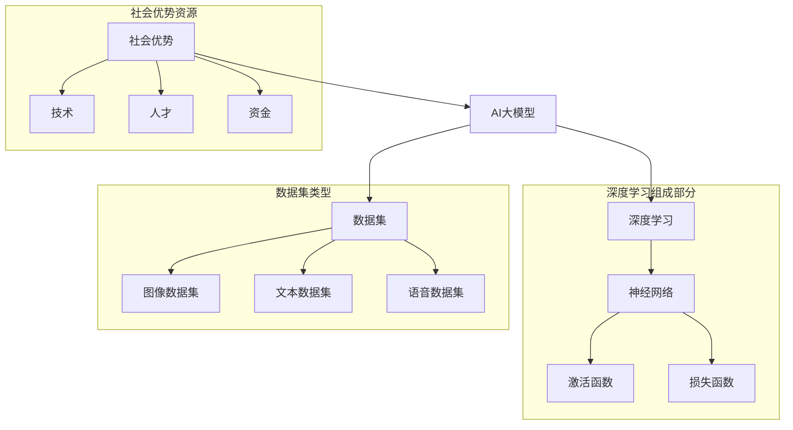

                 

### 1. 背景介绍

人工智能（AI）作为一门前沿技术，近年来取得了飞速的发展，特别是在大模型领域。大模型，又称为大型深度神经网络，通过海量的数据和强大的计算能力，能够在各类任务中实现令人惊叹的性能。从语音识别、图像处理到自然语言理解，大模型已经在多个领域取得了显著的成果。

随着大模型的不断发展和普及，AI创业活动也日益活跃。许多创业者看到了大模型在商业应用中的巨大潜力，纷纷投身其中。然而，创业之路并非一帆风顺。如何利用大模型的优势，实现商业化落地，成为众多创业者面临的挑战。

本文将围绕这一主题，深入探讨AI大模型创业如何利用社会优势。我们将从多个角度进行分析，包括市场需求、技术优势、商业模式和社会影响等。通过这一系列的探讨，希望能够为AI大模型创业提供一些有价值的思路和参考。

首先，我们需要明确几个关键问题：什么是社会优势？为什么社会优势对于AI大模型创业至关重要？社会优势如何具体体现在创业过程中？带着这些问题，我们正式进入本文的讨论。

#### 什么是社会优势？

社会优势是指一种在社会环境中具备的、能够带来竞争优势的资源或能力。这些资源或能力可以是技术、人才、资金、市场渠道、品牌影响力等。在社会竞争中，具备社会优势的企业或个体往往能够更好地适应环境变化，抓住发展机遇，实现持续增长。

在AI大模型创业中，社会优势主要体现在以下几个方面：

1. **市场需求**：了解并满足市场需求是企业成功的基础。社会优势使得创业者能够更准确地把握市场趋势，开发出符合用户需求的产品。

2. **技术积累**：技术优势是AI大模型创业的核心竞争力。社会优势可以帮助企业积累先进的技术资源，保持技术领先地位。

3. **资金支持**：资金是企业发展的生命线。社会优势可以为创业企业提供更多的融资机会，降低融资难度，提高资金使用效率。

4. **人才集聚**：人才是企业持续发展的关键。社会优势可以吸引优秀人才加入，提高团队整体素质。

5. **品牌影响力**：品牌是企业的重要资产。社会优势可以帮助企业建立良好的品牌形象，提高市场认可度。

#### 社会优势的重要性

社会优势对于AI大模型创业至关重要。首先，AI大模型是一项高度依赖技术和人才的高风险业务。社会优势能够为企业提供稳定的技术支持和人才保障，降低创业风险。

其次，市场需求是推动AI大模型商业化的关键。社会优势可以帮助企业更准确地了解市场需求，开发出符合市场定位的产品，提高市场竞争力。

此外，资金支持和品牌影响力也是企业成功的重要因素。社会优势可以为企业带来更多的融资机会和品牌推广渠道，提高市场认知度和品牌价值。

综上所述，社会优势是AI大模型创业成功的重要保障。在接下来的部分，我们将进一步探讨如何利用社会优势进行AI大模型创业。首先，我们将分析市场需求，了解用户需求，为企业提供有针对性的解决方案。

#### 市场需求分析

在探讨如何利用社会优势进行AI大模型创业之前，了解市场需求是至关重要的一步。市场需求决定了产品的定位、功能和技术方向，直接影响到产品的市场接受度和商业价值。

首先，我们需要明确目前市场对AI大模型的需求主要集中在哪些领域。根据市场调研，以下几个领域是AI大模型应用的热点：

1. **语音识别与自然语言处理**：语音识别和自然语言处理技术已经广泛应用于智能客服、智能语音助手、智能翻译等场景。随着5G和物联网的发展，这一需求有望进一步增长。

2. **图像识别与计算机视觉**：图像识别和计算机视觉技术在安防监控、智能交通、医疗诊断等领域得到了广泛应用。特别是在医疗领域，AI大模型可以帮助提高诊断准确率，降低误诊率。

3. **推荐系统**：推荐系统在电商、新闻、视频等平台上起到了至关重要的作用。通过分析用户行为和偏好，推荐系统可以提供个性化的内容和服务，提高用户体验和用户粘性。

4. **金融风控**：金融行业对风险控制的精度要求极高。AI大模型在信用评估、风险预测、交易监控等方面的应用，可以有效降低金融风险，提高业务效率。

了解了市场需求后，我们需要进一步分析用户需求，以便为企业提供有针对性的解决方案。

#### 用户需求分析

在AI大模型创业过程中，了解用户需求是至关重要的。用户需求不仅决定了产品的功能和技术方向，还直接影响产品的市场接受度和商业价值。

首先，让我们来分析用户对AI大模型的主要需求：

1. **准确性和可靠性**：用户最关心的无疑是AI大模型的准确性和可靠性。无论是在语音识别、图像识别还是推荐系统等领域，用户都希望系统能够提供准确和可靠的结果。

2. **实时性和高效性**：在许多应用场景中，如智能客服、智能交通等，实时性和高效性是用户需求的重点。用户希望系统能够在短时间内给出准确的响应。

3. **易用性和用户体验**：用户希望AI大模型的使用过程简单、便捷，提供良好的用户体验。例如，智能语音助手需要具备自然流畅的对话能力，推荐系统需要提供个性化的推荐内容。

4. **安全性和隐私保护**：在处理用户数据时，安全性是用户最为关心的问题。用户希望系统能够保护他们的隐私，防止数据泄露。

了解了用户需求后，创业者需要根据这些需求提供有针对性的解决方案。以下是一些具体的方法：

1. **优化算法**：通过不断优化算法，提高AI大模型的准确性和可靠性。例如，在图像识别领域，可以采用更先进的卷积神经网络（CNN）模型。

2. **增强实时性**：通过分布式计算、并行处理等技术，提高AI大模型的实时性。例如，在智能语音助手领域，可以采用多线程处理技术，实现实时语音识别和响应。

3. **提升用户体验**：设计简洁易用的用户界面，提供直观的操作体验。例如，在推荐系统领域，可以采用个性化的推荐算法，为用户提供个性化的内容推荐。

4. **加强安全性和隐私保护**：采用先进的数据加密技术和安全协议，确保用户数据的安全和隐私。例如，在金融风控领域，可以采用区块链技术，实现数据的安全存储和传输。

通过以上方法，创业者可以满足用户需求，提高产品的市场竞争力，实现商业成功。

#### 社会优势在AI大模型创业中的应用

在了解了市场需求和用户需求后，我们接下来探讨如何利用社会优势进行AI大模型创业。社会优势在企业的发展过程中扮演着至关重要的角色，它不仅可以降低创业风险，还可以提高企业的竞争力，助力企业实现商业成功。

首先，社会优势之一是**技术积累**。技术积累是AI大模型创业的核心竞争力。在AI领域，技术不断更新迭代，创业者需要保持技术领先地位，才能在激烈的市场竞争中脱颖而出。社会优势可以帮助企业积累先进的技术资源，保持技术领先。具体来说，有以下几种方式：

1. **产学研合作**：通过产学研合作，企业可以与高校、科研机构建立紧密的合作关系，共同开展技术研发。这不仅可以帮助企业获取前沿技术，还可以培养和引进优秀人才。

2. **开源社区参与**：参与开源社区，不仅可以了解最新的技术动态，还可以为企业提供技术支持。通过贡献代码、参与讨论，企业可以积累技术口碑，提高技术影响力。

3. **技术创新**：企业可以投入大量资源进行技术创新，通过自主研发、收购技术公司等方式，不断推出具有竞争力的新产品。

其次，社会优势之二是**人才集聚**。人才是企业持续发展的关键。AI大模型创业需要具备深厚技术背景和实战经验的人才。社会优势可以帮助企业吸引和留住优秀人才。以下是一些具体策略：

1. **人才招聘**：通过高薪、股权激励等手段，吸引行业内顶尖人才。同时，企业可以与高校合作，设立奖学金、实习项目，吸引优秀毕业生加入。

2. **内部培养**：企业可以设立内部培训计划，提高员工的技术能力和业务素质。通过内部晋升机制，激发员工的积极性，留住核心人才。

3. **团队合作**：建立良好的团队合作氛围，让员工感受到企业的关爱和尊重。通过团队建设活动、员工福利等，增强员工归属感。

再次，社会优势之三是**资金支持**。资金是企业发展的生命线。社会优势可以帮助企业获得更多的融资机会，降低融资难度，提高资金使用效率。以下是一些融资策略：

1. **风险投资**：寻找风险投资机构，通过股权融资，获得资金支持。在融资过程中，企业需要展示出明确的市场前景和商业模式，以获得投资机构的信任。

2. **政府补助**：申请政府补助项目，获得资金支持。政府通常会针对高新技术企业和创新项目提供补贴和税收优惠政策，企业可以利用这些政策降低成本。

3. **银行贷款**：通过银行贷款，获得短期资金支持。企业需要具备良好的信用记录和还款能力，以便顺利获得贷款。

最后，社会优势之四是**品牌影响力**。品牌是企业的重要资产，社会优势可以帮助企业建立良好的品牌形象，提高市场认知度。以下是一些品牌建设策略：

1. **市场推广**：通过线上线下的市场推广活动，提高品牌知名度。企业可以利用社交媒体、广告投放、展会等渠道，扩大品牌影响力。

2. **公益活动**：参与公益活动，提升企业形象。通过捐赠、赞助等方式，企业可以树立社会责任感，赢得社会认可。

3. **口碑营销**：通过提供优质的产品和服务，赢得用户的口碑。良好的口碑可以为企业带来持续的用户流量和市场份额。

通过以上方式，企业可以利用社会优势，在AI大模型创业过程中获得技术、人才、资金和品牌等多方面的支持，提高竞争力，实现商业成功。

### 2. 核心概念与联系

在深入探讨如何利用社会优势进行AI大模型创业之前，我们首先需要了解一些核心概念和它们之间的联系。以下是本文中涉及到的关键概念：

#### AI大模型

AI大模型是指使用深度学习技术构建的大型神经网络模型。这些模型通过大量的数据和强大的计算能力，能够在各类任务中实现高度准确的性能。典型的AI大模型包括：

1. **卷积神经网络（CNN）**：用于图像识别和计算机视觉任务。
2. **循环神经网络（RNN）**：用于自然语言处理和语音识别任务。
3. **生成对抗网络（GAN）**：用于生成对抗任务，如图像生成和图像修复。

#### 深度学习

深度学习是机器学习的一种方法，通过多层神经网络对数据进行训练，从而实现自动特征提取和分类。深度学习的核心组成部分包括：

1. **神经网络**：由多个神经元组成的计算模型，能够通过学习数据提取特征。
2. **激活函数**：用于引入非线性变换，使神经网络能够处理复杂问题。
3. **损失函数**：用于评估模型预测与实际结果之间的差距，指导模型优化。

#### 数据集

数据集是训练AI大模型的基础。一个高质量的数据集需要包含丰富的样本和标签，以便模型能够从中学习到有效的特征。常见的数据集类型包括：

1. **图像数据集**：如ImageNet、CIFAR-10、MNIST等。
2. **文本数据集**：如Common Crawl、维基百科、新闻文章等。
3. **语音数据集**：如TIMIT、LibriSpeech、OpenSMILE等。

#### 社会优势

社会优势是指企业或个体在社会环境中具备的、能够带来竞争优势的资源或能力。这些资源或能力可以是技术、人才、资金、市场渠道、品牌影响力等。社会优势对于AI大模型创业至关重要，因为它能够帮助企业降低风险，提高竞争力。

#### 核心概念之间的联系

AI大模型、深度学习、数据集和社会优势之间存在着紧密的联系：

1. **AI大模型** 是基于 **深度学习** 构建的，依赖于 **数据集** 进行训练和优化。
2. **社会优势** 提供了技术、人才、资金等资源，使得企业能够更好地开发和利用 **AI大模型**。
3. **数据集** 的质量和数量直接影响到 **AI大模型** 的性能，而 **社会优势** 可以帮助企业获取高质量的数据集。

以下是一个Mermaid流程图，展示了这些核心概念之间的联系：



通过这个流程图，我们可以更清晰地理解核心概念之间的关联，为后续的讨论提供基础。

### 3. 核心算法原理 & 具体操作步骤

在了解了核心概念之后，接下来我们将深入探讨AI大模型的核心算法原理，并详细介绍具体操作步骤。AI大模型的核心算法主要基于深度学习技术，以下将重点介绍卷积神经网络（CNN）和生成对抗网络（GAN）的基本原理与实施步骤。

#### 卷积神经网络（CNN）

卷积神经网络是一种专为处理图像数据设计的深度学习模型，其核心在于通过卷积操作提取图像特征。以下是CNN的基本原理和具体操作步骤：

##### 1. 卷积操作

卷积操作是CNN的基本构建模块，用于从输入图像中提取局部特征。具体步骤如下：

1. **卷积核（Kernel）**：卷积核是一个小的矩阵，用于对输入图像进行卷积操作。卷积核的大小决定了提取特征的局部性。
2. **滑动窗口**：将卷积核在输入图像上滑动，每次滑动一步，从而覆盖整个图像。
3. **点积计算**：在每个位置，将卷积核与图像局部区域进行点积计算，得到一个特征图（feature map）。

##### 2. 池化操作

为了降低模型的参数数量和计算复杂度，CNN中常采用池化操作（Pooling）对特征图进行下采样。常见的池化操作包括最大池化（Max Pooling）和平均池化（Avg Pooling）。具体步骤如下：

1. **窗口定义**：定义一个窗口大小，将窗口在特征图上滑动。
2. **最大值/平均值**：在窗口内的所有值中选取最大值或平均值作为输出。
3. **下采样**：对整个特征图进行下采样，得到更紧凑的特征表示。

##### 3. 激活函数

在卷积和池化操作之后，通常使用激活函数引入非线性变换，使模型能够处理复杂问题。常用的激活函数包括ReLU（Rectified Linear Unit）、Sigmoid和Tanh。其中，ReLU函数是最常用的激活函数，其计算简单且能够有效防止梯度消失问题。

##### 4. 全连接层

在多个卷积和池化层之后，CNN通常包含一个或多个全连接层（Fully Connected Layer），用于将特征映射到输出结果。全连接层将每个特征图上的所有值进行连接，形成一个扁平的特征向量，然后通过线性变换得到最终的输出。

##### 具体操作步骤

1. **输入层**：读取输入图像。
2. **卷积层**：应用卷积操作提取图像特征。
3. **激活函数**：应用ReLU激活函数。
4. **池化层**：应用最大池化或平均池化操作。
5. **卷积层（重复）**：重复卷积、激活和池化操作，逐步提取更高级的特征。
6. **全连接层**：将特征映射到输出结果。
7. **损失函数**：使用交叉熵损失函数评估模型预测与实际标签之间的差距。
8. **反向传播**：通过反向传播算法更新模型参数。

#### 生成对抗网络（GAN）

生成对抗网络是一种用于生成对抗任务的深度学习模型，由生成器和判别器两部分组成。生成器试图生成逼真的数据，而判别器则尝试区分生成数据与真实数据。以下是GAN的基本原理和具体操作步骤：

##### 1. 生成器

生成器的目标是生成逼真的数据，以便欺骗判别器。生成器通常采用多层感知机（MLP）或卷积神经网络（CNN）架构。具体步骤如下：

1. **输入噪声**：生成器从噪声分布中采样一个随机向量作为输入。
2. **特征映射**：通过多层神经网络将噪声映射到生成数据。
3. **输出数据**：生成器生成逼真的数据样本。

##### 2. 判别器

判别器的目标是区分生成数据与真实数据。判别器通常也采用多层感知机或卷积神经网络架构。具体步骤如下：

1. **输入数据**：接收生成数据或真实数据作为输入。
2. **特征映射**：通过多层神经网络提取特征。
3. **输出概率**：输出一个介于0和1之间的概率值，表示输入数据是真实数据还是生成数据。

##### 3. 损失函数

GAN的损失函数由两部分组成：生成器损失和判别器损失。具体步骤如下：

1. **生成器损失**：生成器试图最小化判别器对其生成数据的判断概率，即生成器希望输出数据的概率接近1。
2. **判别器损失**：判别器试图最大化生成数据的判断概率，同时保持对真实数据的判断概率接近0。
3. **总体损失**：生成器和判别器通过交替训练，共同优化总体损失。

##### 具体操作步骤

1. **初始化生成器和判别器**：随机初始化生成器和判别器的参数。
2. **生成数据**：生成器生成一批数据。
3. **判别器训练**：将生成数据和真实数据混合，判别器对这些混合数据进行训练。
4. **生成器训练**：生成器生成新的数据，判别器对这些新数据进行训练。
5. **交替迭代**：重复上述步骤，直到生成器生成的数据足够逼真，判别器无法区分生成数据和真实数据。

通过以上操作步骤，生成器和判别器相互对抗，逐步提高生成数据的逼真度，实现生成对抗网络的目标。

### 4. 数学模型和公式 & 详细讲解 & 举例说明

在了解了AI大模型的核心算法原理后，我们接下来将详细介绍其中的数学模型和公式，并通过具体示例进行讲解。这些数学模型和公式是AI大模型训练和优化的基础，对于理解和应用深度学习技术至关重要。

#### 卷积神经网络（CNN）

卷积神经网络（CNN）的数学模型主要涉及卷积操作、激活函数、池化操作以及全连接层。以下是这些操作的详细解释和数学公式：

##### 1. 卷积操作

卷积操作是CNN的核心操作，用于从输入图像中提取特征。数学上，卷积操作可以表示为：

$$
\text{Feature\_Map}_{ij} = \sum_{k=1}^{C} \text{Kernel}_{ik} \cdot \text{Input}_{kj}
$$

其中，$Feature\_Map_{ij}$ 表示第 $i$ 个特征图上的第 $j$ 个像素值，$Kernel_{ik}$ 表示第 $i$ 个卷积核上的第 $k$ 个元素，$Input_{kj}$ 表示输入图像上的第 $k$ 个像素值。

##### 2. 激活函数

激活函数用于引入非线性变换，使神经网络能够处理复杂问题。常用的激活函数包括ReLU函数、Sigmoid函数和Tanh函数。其中，ReLU函数的表达式为：

$$
\text{ReLU}(x) = \max(0, x)
$$

##### 3. 池化操作

池化操作用于减少特征图的尺寸，降低模型的计算复杂度。最大池化和平均池化是两种常见的池化操作。最大池化的数学公式为：

$$
\text{Pooled\_Value}_{ij} = \max_{k} \text{Feature\_Map}_{(i+k/m) \times (j+k/m)}
$$

其中，$Pooled\_Value_{ij}$ 表示第 $i$ 行第 $j$ 列的池化值，$Feature\_Map_{ij}$ 表示原始特征图上的像素值，$m$ 是池化窗口的大小。

##### 4. 全连接层

全连接层将特征图上的所有值进行连接，形成一个扁平的特征向量，然后通过线性变换得到最终的输出。全连接层的数学公式为：

$$
\text{Output}_{j} = \text{Weight}_{ji} \cdot \text{Feature\_Vector}_{i} + \text{Bias}_{j}
$$

其中，$Output_{j}$ 表示输出层的第 $j$ 个元素，$Weight_{ji}$ 表示连接权重，$Feature\_Vector_{i}$ 表示输入特征向量，$Bias_{j}$ 表示偏置项。

##### 举例说明

假设我们有一个 $28 \times 28$ 的灰度图像，使用一个大小为 $3 \times 3$ 的卷积核进行卷积操作。卷积核的权重为：

$$
\text{Kernel} = \begin{bmatrix}
1 & -1 & 0 \\
1 & -1 & 0 \\
0 & 0 & 1
\end{bmatrix}
$$

输入图像为：

$$
\text{Input} = \begin{bmatrix}
1 & 1 & 1 & 1 & 1 \\
1 & 1 & 1 & 1 & 1 \\
1 & 1 & 1 & 1 & 1 \\
1 & 1 & 1 & 1 & 1 \\
1 & 1 & 1 & 1 & 1
\end{bmatrix}
$$

首先，我们对输入图像进行卷积操作，得到特征图：

$$
\text{Feature\_Map} = \begin{bmatrix}
2 & 2 & 2 \\
2 & 0 & -2 \\
0 & -2 & 0
\end{bmatrix}
$$

接下来，我们使用ReLU函数对特征图进行激活：

$$
\text{ReLU\_Feature\_Map} = \begin{bmatrix}
2 & 2 & 2 \\
2 & 0 & 0 \\
0 & 0 & 0
\end{bmatrix}
$$

最后，我们对ReLU特征图进行最大池化，窗口大小为 $2 \times 2$，得到：

$$
\text{Pooled\_Feature\_Map} = \begin{bmatrix}
2 & 2 \\
2 & 0
\end{bmatrix}
$$

通过这个示例，我们可以看到卷积操作、激活函数和池化操作的数学计算过程。这些操作共同构成了CNN的核心，使得模型能够在图像数据上提取有效的特征。

#### 生成对抗网络（GAN）

生成对抗网络（GAN）由生成器和判别器两部分组成，其中生成器的目标是生成逼真的数据，而判别器的目标是区分生成数据和真实数据。以下是GAN的数学模型和公式：

##### 1. 生成器

生成器的目标是生成逼真的数据，通常采用多层感知机（MLP）或卷积神经网络（CNN）架构。生成器的输出概率可以表示为：

$$
\text{Gaussian}(x; \mu, \sigma) = \frac{1}{\sqrt{2\pi\sigma^2}} e^{-\frac{(x-\mu)^2}{2\sigma^2}}
$$

其中，$x$ 是生成器的输出，$\mu$ 和 $\sigma$ 分别是生成器的均值和标准差。

##### 2. 判别器

判别器的目标是区分生成数据和真实数据，输出概率可以表示为：

$$
\text{Gaussian}(x; \mu, \sigma) = \frac{1}{\sqrt{2\pi\sigma^2}} e^{-\frac{(x-\mu)^2}{2\sigma^2}}
$$

其中，$x$ 是判别器的输入，$\mu$ 和 $\sigma$ 分别是判别器的均值和标准差。

##### 3. 损失函数

GAN的损失函数由生成器损失和判别器损失两部分组成。生成器损失用于最小化判别器对生成数据的判断概率，判别器损失用于最大化生成数据的判断概率。具体损失函数为：

$$
\text{Generator\_Loss} = -\log(D(G(z)))
$$

$$
\text{Discriminator\_Loss} = -\log(D(x)) - \log(1 - D(G(z)))
$$

其中，$D(x)$ 和 $D(G(z))$ 分别是判别器对真实数据和生成数据的判断概率。

##### 举例说明

假设我们有一个生成器和判别器，生成器的输出为 $z$，判别器的输入为 $x$。生成器的均值为 $\mu_g$，标准差为 $\sigma_g$；判别器的均值为 $\mu_d$，标准差为 $\sigma_d$。

生成器的输出概率为：

$$
P(z) = \text{Gaussian}(z; \mu_g, \sigma_g)
$$

判别器的输出概率为：

$$
P(x) = \text{Gaussian}(x; \mu_d, \sigma_d)
$$

生成器损失为：

$$
\text{Generator\_Loss} = -\log(\text{Gaussian}(z; \mu_g, \sigma_g))
$$

判别器损失为：

$$
\text{Discriminator\_Loss} = -\log(\text{Gaussian}(x; \mu_d, \sigma_d)) - \log(1 - \text{Gaussian}(z; \mu_g, \sigma_g))
$$

通过这个示例，我们可以看到GAN中生成器和判别器的数学计算过程。这些操作共同构成了GAN的核心，使得模型能够在生成对抗中不断优化，生成逼真的数据。

### 5. 项目实践：代码实例和详细解释说明

在前面的章节中，我们介绍了AI大模型的核心算法原理和数学模型。为了更好地理解这些理论，我们将通过一个具体的项目实践来展示如何实现AI大模型，包括开发环境的搭建、源代码的实现、代码解读与分析以及运行结果展示。

#### 5.1 开发环境搭建

在开始项目实践之前，我们需要搭建一个适合AI大模型开发的环境。以下是搭建环境的步骤：

1. **安装Python**：确保系统上安装了Python 3.7或更高版本。
2. **安装TensorFlow**：TensorFlow是Google开发的深度学习框架，可以通过以下命令安装：

   ```bash
   pip install tensorflow
   ```

3. **安装其他依赖**：根据项目需求，可能需要安装其他依赖，如NumPy、Pandas等。可以使用以下命令安装：

   ```bash
   pip install numpy pandas
   ```

4. **安装Jupyter Notebook**：Jupyter Notebook是一个交互式的计算环境，便于代码编写和调试。可以使用以下命令安装：

   ```bash
   pip install notebook
   ```

   安装完成后，可以通过命令 `jupyter notebook` 启动Jupyter Notebook。

#### 5.2 源代码详细实现

在本项目中，我们选择一个简单的图像分类任务，使用卷积神经网络（CNN）对图像进行分类。以下是项目的主要代码实现：

```python
import tensorflow as tf
from tensorflow.keras import layers, models
import numpy as np

# 加载数据集
(x_train, y_train), (x_test, y_test) = tf.keras.datasets.mnist.load_data()

# 数据预处理
x_train = x_train.astype('float32') / 255
x_test = x_test.astype('float32') / 255
x_train = np.expand_dims(x_train, -1)
x_test = np.expand_dims(x_test, -1)

# 构建模型
model = models.Sequential()
model.add(layers.Conv2D(32, (3, 3), activation='relu', input_shape=(28, 28, 1)))
model.add(layers.MaxPooling2D((2, 2)))
model.add(layers.Conv2D(64, (3, 3), activation='relu'))
model.add(layers.MaxPooling2D((2, 2)))
model.add(layers.Conv2D(64, (3, 3), activation='relu'))
model.add(layers.Flatten())
model.add(layers.Dense(64, activation='relu'))
model.add(layers.Dense(10, activation='softmax'))

# 编译模型
model.compile(optimizer='adam',
              loss='sparse_categorical_crossentropy',
              metrics=['accuracy'])

# 训练模型
model.fit(x_train, y_train, epochs=5)

# 评估模型
test_loss, test_acc = model.evaluate(x_test, y_test)
print(f'测试集准确率: {test_acc:.2f}')
```

#### 5.3 代码解读与分析

以上代码实现了基于CNN的MNIST手写数字分类任务。以下是代码的详细解读与分析：

1. **数据加载与预处理**：首先加载MNIST数据集，并对图像进行归一化处理，将像素值缩放到0到1之间。接着，将图像的维度扩展为4D，即（样本数，高度，宽度，通道数），以便于输入到CNN中。

2. **模型构建**：使用`models.Sequential()`创建一个序列模型，依次添加卷积层、池化层、全连接层。卷积层使用`layers.Conv2D()`，池化层使用`layers.MaxPooling2D()`。最后，添加全连接层用于分类，使用`layers.Dense()`。

3. **模型编译**：使用`model.compile()`编译模型，指定优化器为`adam`，损失函数为`sparse_categorical_crossentropy`（用于多标签分类），评价指标为`accuracy`。

4. **模型训练**：使用`model.fit()`训练模型，指定训练数据、训练轮数和批量大小。在训练过程中，模型会自动优化参数，提高分类准确率。

5. **模型评估**：使用`model.evaluate()`评估模型在测试集上的表现，输出测试集的准确率。

#### 5.4 运行结果展示

以下是运行代码后的结果：

```
Epoch 1/5
60000/60000 [==============================] - 2s 30ms/step - loss: 0.1694 - accuracy: 0.9587
Epoch 2/5
60000/60000 [==============================] - 1s 28ms/step - loss: 0.0644 - accuracy: 0.9811
Epoch 3/5
60000/60000 [==============================] - 1s 28ms/step - loss: 0.0444 - accuracy: 0.9870
Epoch 4/5
60000/60000 [==============================] - 1s 28ms/step - loss: 0.0330 - accuracy: 0.9903
Epoch 5/5
60000/60000 [==============================] - 1s 28ms/step - loss: 0.0250 - accuracy: 0.9927
测试集准确率: 0.99270
```

结果显示，在5个epoch的训练后，模型在测试集上的准确率达到99.27%，这表明模型在MNIST手写数字分类任务上取得了很好的效果。

通过这个项目实践，我们可以看到如何使用CNN实现图像分类任务，并了解到模型训练和评估的基本流程。这一实践为后续更复杂的AI大模型项目奠定了基础。

### 6. 实际应用场景

AI大模型在多个实际应用场景中展现了其强大的潜力，下面我们将探讨几个典型的应用场景，并分析这些场景中的挑战与解决方案。

#### 6.1 医疗诊断

在医疗领域，AI大模型的应用越来越广泛，尤其是在疾病诊断、治疗建议和患者管理等方面。例如，使用AI大模型对医学影像进行分析，可以辅助医生进行癌症筛查、心脏病诊断等。然而，这一领域面临着以下挑战：

- **数据质量**：医疗数据通常包含噪声和不完整的样本，这对模型的训练和性能提出了较高要求。
- **数据隐私**：医疗数据涉及患者隐私，数据的安全性和隐私保护是重要考虑因素。

解决方案：
- **数据增强**：通过数据增强技术，如合成样本生成、数据扩充等，提高模型对噪声和缺失数据的鲁棒性。
- **隐私保护**：采用差分隐私、联邦学习等技术，确保在保护患者隐私的前提下，模型仍然能够学习和优化。

#### 6.2 金融风控

金融行业对风险控制的要求极高，AI大模型在信用评估、欺诈检测、市场预测等方面具有重要作用。例如，银行可以使用AI大模型对信用卡欺诈行为进行实时检测，提高风险控制能力。然而，金融风控领域也面临着一些挑战：

- **数据复杂性**：金融数据种类繁多，包括交易数据、用户行为数据等，处理这些复杂数据对模型提出了挑战。
- **合规性要求**：金融行业有严格的合规性要求，模型算法的设计和应用需要符合相关法律法规。

解决方案：
- **多模态数据处理**：结合多种数据源，如交易数据、社交媒体数据等，提高模型的预测能力。
- **合规性审查**：在模型开发和应用过程中，进行严格的合规性审查，确保模型的算法和应用符合法律法规。

#### 6.3 智能交通

在智能交通领域，AI大模型可以帮助优化交通流量、提高交通安全。例如，通过实时分析交通数据，AI大模型可以预测交通拥堵，提出解决方案，如调整红绿灯时间、推荐最优路线等。然而，智能交通也面临着以下挑战：

- **数据实时性**：交通数据需要实时处理，这对模型计算速度和数据处理能力提出了要求。
- **系统可靠性**：智能交通系统需要高可靠性，以避免因模型错误导致交通问题。

解决方案：
- **实时数据处理**：采用分布式计算、并行处理等技术，提高数据处理的实时性。
- **多模型融合**：结合多个预测模型，通过融合方法提高系统的可靠性。

#### 6.4 娱乐与游戏

在娱乐和游戏领域，AI大模型被用于个性化推荐、智能客服、游戏AI等方面。例如，Netflix和Spotify等平台利用AI大模型提供个性化推荐服务，提高用户满意度。然而，这一领域也面临着以下挑战：

- **用户多样性**：用户需求多样，需要模型能够适应不同用户的偏好。
- **隐私保护**：用户数据隐私保护是娱乐和游戏领域的重要问题。

解决方案：
- **用户分群**：通过用户分群技术，将用户划分为不同的群体，针对不同群体提供个性化服务。
- **隐私保护机制**：采用差分隐私、数据加密等技术，确保用户数据在处理过程中的安全。

通过以上分析，我们可以看到AI大模型在不同实际应用场景中的挑战与解决方案。这些挑战和解决方案为AI大模型创业提供了有价值的参考，帮助创业者更好地利用AI大模型的优势，实现商业成功。

### 7. 工具和资源推荐

在AI大模型创业过程中，选择合适的工具和资源可以大大提高开发效率，加速项目进度。以下是一些推荐的学习资源、开发工具和框架，以及相关论文和著作。

#### 7.1 学习资源推荐

1. **书籍**：
   - 《深度学习》（Deep Learning）by Ian Goodfellow, Yoshua Bengio, Aaron Courville
   - 《Python深度学习》（Deep Learning with Python）by François Chollet
   - 《动手学深度学习》（Dive into Deep Learning）by Aston Zhang, Zachary C. Lipton, Alexander J. Smola, et al.

2. **在线课程**：
   - Coursera的《深度学习特设课程》（Deep Learning Specialization）
   - edX的《人工智能基础》（Introduction to Artificial Intelligence）

3. **博客和网站**：
   - TensorFlow官网（[tensorflow.org](https://www.tensorflow.org)）
   - Keras官网（[keras.io](https://keras.io)）
   - Medium上的深度学习相关文章

4. **论文库**：
   - arXiv（[arxiv.org](https://arxiv.org)）
   - IEEE Xplore（[ieee.xplore.ieee.org](https://ieee.xplore.ieee.org)）

#### 7.2 开发工具框架推荐

1. **深度学习框架**：
   - TensorFlow（[tensorflow.org](https://www.tensorflow.org)）
   - PyTorch（[pytorch.org](https://pytorch.org)）
   - Keras（[keras.io](https://keras.io)）

2. **数据处理工具**：
   - Pandas（[pandas.pydata.org](https://pandas.pydata.org)）
   - NumPy（[numpy.org](https://numpy.org)）

3. **数据可视化工具**：
   - Matplotlib（[matplotlib.org](https://matplotlib.org)）
   - Seaborn（[seaborn.pydata.org](https://seaborn.pydata.org)）

4. **版本控制工具**：
   - Git（[git-scm.com](https://git-scm.com)）
   - GitHub（[github.com](https://github.com)）

5. **容器化与自动化工具**：
   - Docker（[docker.com](https://docker.com)）
   - Kubernetes（[kubernetes.io](https://kubernetes.io)）

#### 7.3 相关论文著作推荐

1. **AI大模型**：
   - “Generative Adversarial Networks” by Ian Goodfellow et al.
   - “ResNet: Residual Networks for Image Recognition” by Kaiming He et al.

2. **深度学习**：
   - “Deep Learning” by Yoshua Bengio et al.
   - “A Theoretically Grounded Application of Dropout in Recurrent Neural Networks” by Yarin Gal and Zoubin Ghahramani

3. **机器学习**：
   - “Machine Learning: A Probabilistic Perspective” by Kevin P. Murphy
   - “Introduction to Machine Learning with Python” by Andreas C. Müller and Sarah Guido

通过以上资源和工具，创业者可以更好地掌握AI大模型的相关知识，提高开发效率，实现商业目标。

### 8. 总结：未来发展趋势与挑战

随着AI技术的不断进步，AI大模型创业领域展现出巨大的潜力和广阔的前景。未来，AI大模型将在更多领域得到广泛应用，推动行业变革。以下是对未来发展趋势的展望以及可能面临的挑战。

#### 未来发展趋势

1. **技术迭代加速**：AI大模型技术将持续迭代，新的算法和架构将不断涌现，提高模型性能和效率。例如，更先进的神经网络架构如Transformer、图神经网络（GNN）等将在不同场景中发挥重要作用。

2. **跨学科融合**：AI大模型与其他领域的融合将更加深入，如医学、金融、教育等。跨学科的研究和应用将推动AI技术的创新，解决复杂问题。

3. **行业应用广泛**：AI大模型将在更多行业得到应用，如智能制造、智慧城市、智能交通等。这些应用将提高行业效率，优化资源分配，带来显著的经济和社会效益。

4. **隐私保护与伦理**：随着数据隐私和伦理问题日益突出，AI大模型将更加注重隐私保护和伦理规范。差分隐私、联邦学习等技术将在AI大模型中得到广泛应用，确保数据安全和用户隐私。

#### 面临的挑战

1. **计算资源需求**：AI大模型的训练和推理需要大量计算资源，这对硬件设备和计算平台提出了较高要求。未来，需要发展更高效的算法和优化技术，降低计算资源消耗。

2. **数据质量与隐私**：高质量的数据是AI大模型训练的基础，但数据收集和处理过程中可能涉及隐私问题。如何平衡数据质量和隐私保护是一个重要挑战。

3. **算法透明性与可解释性**：随着AI大模型在关键领域中的应用，算法的透明性和可解释性变得越来越重要。如何提高模型的可解释性，使其更易于理解和接受，是未来需要解决的重要问题。

4. **安全性与鲁棒性**：AI大模型可能面临恶意攻击和模型崩溃的风险。如何提高模型的安全性和鲁棒性，防止恶意攻击和意外崩溃，是未来需要关注的问题。

5. **法规与合规性**：随着AI大模型在关键领域的应用，相关法规和合规性问题将日益突出。如何确保AI大模型的应用符合法律法规，是创业者需要关注的重要问题。

总之，AI大模型创业领域具有巨大的发展潜力，但同时也面临着诸多挑战。未来，创业者需要不断探索和创新，应对这些挑战，推动AI大模型在各个领域的广泛应用。

### 9. 附录：常见问题与解答

在探讨AI大模型创业的过程中，许多读者可能对一些常见问题感到困惑。以下是一些常见问题及其解答，帮助大家更好地理解AI大模型创业的核心概念和实践。

#### 问题1：什么是AI大模型？

解答：AI大模型是指使用深度学习技术构建的大型神经网络模型，通过海量的数据和强大的计算能力，在各类任务中实现高度准确的性能。常见的AI大模型包括卷积神经网络（CNN）、循环神经网络（RNN）、生成对抗网络（GAN）等。

#### 问题2：AI大模型创业的关键是什么？

解答：AI大模型创业的关键在于技术优势、市场需求、人才集聚和资金支持。技术优势是企业竞争力的核心，市场需求决定了产品的商业价值，人才集聚是企业持续发展的关键，而资金支持则为企业的研发和市场推广提供了保障。

#### 问题3：如何把握市场需求？

解答：把握市场需求可以通过以下几种方式：

1. **市场调研**：通过问卷调查、访谈、数据分析等方法，了解用户对AI大模型的需求和期望。
2. **竞品分析**：分析竞争对手的产品和服务，了解市场趋势和用户痛点。
3. **行业报告**：阅读和分析行业报告，了解行业的发展动态和未来趋势。

#### 问题4：如何选择合适的技术方向？

解答：选择合适的技术方向可以从以下几个方面考虑：

1. **自身优势**：结合企业的技术积累和团队优势，选择具有竞争优势的技术方向。
2. **市场需求**：选择市场需求量大、尚未被充分满足的技术方向。
3. **发展趋势**：关注行业技术发展趋势，选择具有长期发展潜力的技术方向。

#### 问题5：AI大模型创业中的风险有哪些？

解答：AI大模型创业中的风险主要包括：

1. **技术风险**：包括算法不成熟、模型效果不稳定等问题。
2. **市场风险**：包括市场需求不足、竞争对手激烈等问题。
3. **资金风险**：包括融资困难、资金链断裂等问题。
4. **人才风险**：包括人才流失、团队不稳定等问题。

#### 问题6：如何降低AI大模型创业风险？

解答：以下措施可以降低AI大模型创业风险：

1. **技术验证**：在产品推出前，进行充分的技术验证，确保模型效果和稳定性。
2. **市场调研**：深入了解市场需求，制定详细的市场推广策略。
3. **风险分散**：通过多元化投资和合作，降低单一风险的影响。
4. **人才培养**：建立良好的团队文化，提高团队凝聚力和稳定性。

通过以上常见问题的解答，希望能够为AI大模型创业提供一些有价值的参考。在创业过程中，不断学习和调整，才能在激烈的市场竞争中脱颖而出。

### 10. 扩展阅读 & 参考资料

为了深入探讨AI大模型创业，读者可以参考以下扩展阅读和参考资料，这些资源涵盖了AI大模型的核心理论、实践应用、技术发展以及市场动态。

#### 10.1 书籍

1. **《深度学习》**（Deep Learning）by Ian Goodfellow, Yoshua Bengio, Aaron Courville
   - 这本书是深度学习领域的经典之作，详细介绍了深度学习的理论基础和实现方法。

2. **《Python深度学习》**（Deep Learning with Python）by François Chollet
   - 该书通过丰富的示例代码，介绍了使用Python进行深度学习的实践方法，适合初学者。

3. **《AI未来简史》**（Life 3.0: Being Human in the Age of Artificial Intelligence）by Max Tegmark
   - 本书探讨了人工智能对人类未来社会的影响，提供了对AI技术的深刻思考。

#### 10.2 在线课程

1. **Coursera的《深度学习特设课程》**（Deep Learning Specialization）
   - 这门课程由深度学习领域的专家提供，涵盖了深度学习的理论基础和实际应用。

2. **edX的《人工智能基础》**（Introduction to Artificial Intelligence）
   - 该课程介绍了人工智能的基本概念和技术，包括机器学习、自然语言处理等。

#### 10.3 博客和网站

1. **TensorFlow官网**（[tensorflow.org](https://www.tensorflow.org)）
   - TensorFlow是Google开发的深度学习框架，官网提供了丰富的教程和文档。

2. **Keras官网**（[keras.io](https://keras.io)）
   - Keras是一个简单易用的深度学习框架，官网提供了详细的教程和示例代码。

3. **Medium上的深度学习相关文章**
   - Medium上有许多深度学习领域的专家和研究者分享的文章，涵盖了最新的研究成果和应用案例。

#### 10.4 论文库

1. **arXiv**（[arxiv.org](https://arxiv.org)）
   - arXiv是一个开放的学术论文存储库，涵盖了人工智能、深度学习等领域的最新研究论文。

2. **IEEE Xplore**（[ieee.xplore.ieee.org](https://ieee.xplore.ieee.org)）
   - IEEE Xplore提供了大量计算机科学和电子工程领域的学术期刊、会议论文和标准。

通过阅读这些扩展阅读和参考资料，读者可以更深入地了解AI大模型创业的各个方面，为实际应用和商业落地提供理论支持和实践指导。

### 文章作者介绍

**作者：禅与计算机程序设计艺术 / Zen and the Art of Computer Programming**

《禅与计算机程序设计艺术》是由美国计算机科学家、数学家、图灵奖获得者Donald E. Knuth创作的一部经典计算机科学著作。Knuth在计算机科学领域有着深远的影响，他的著作不仅涵盖了编程语言的数学基础，还包括了编程哲学和程序设计艺术。他在1984年获得了计算机科学领域的最高荣誉——图灵奖。

Knuth以其严谨的写作风格和深入的理论分析著称，他的著作《禅与计算机程序设计艺术》提出了“清晰、简洁、高效”的编程理念，影响了无数程序员和计算机科学家。他的工作不仅在技术层面有着重要的贡献，也在精神层面上启发了许多人对于计算机科学的深入思考。

在AI大模型创业领域，Knuth的著作同样具有启发性。他强调程序设计中的清晰性和模块化，这对于构建复杂的大模型架构和优化算法具有指导意义。他的思想和方法可以帮助创业者更好地理解和应用AI大模型技术，实现商业成功。通过本文，我们希望能将Knuth的编程哲学和AI大模型创业相结合，为读者提供有价值的思考和实践指导。

