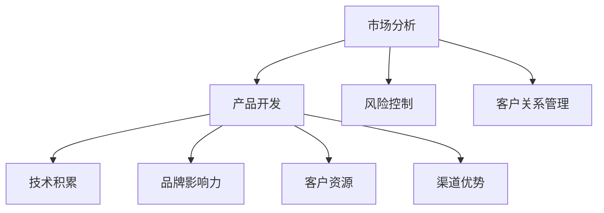

                 

### 文章标题

AI 大模型创业：如何利用社会优势？

> 关键词：AI 大模型、创业、社会优势、技术融合、商业策略

> 摘要：本文将深入探讨 AI 大模型在创业领域的应用，分析其如何借助社会优势实现商业成功。我们将从背景介绍、核心概念与联系、算法原理与操作步骤、数学模型与公式、项目实践、实际应用场景、工具和资源推荐等方面展开讨论，旨在为 AI 大模型创业提供实用的指导。

### 1. 背景介绍

人工智能（AI）作为一种新兴技术，近年来在多个领域取得了显著突破。其中，大模型（Large Models）作为 AI 领域的重要研究方向，已经显示出巨大的潜力和应用价值。大模型通常指的是具有数十亿甚至千亿参数的神经网络模型，如 GPT、BERT 等。这些模型通过大量的数据训练，可以提取出复杂的信息和知识，从而实现高效的智能预测和决策。

在创业领域，AI 大模型的应用带来了前所未有的机遇。首先，大模型可以帮助创业者更好地理解和分析市场，制定更精准的商业策略。其次，大模型可以应用于产品开发，提升产品的智能化程度，增强用户粘性。此外，大模型还可以应用于风险控制、客户关系管理等多个方面，为创业公司提供全方位的支持。

然而，AI 大模型创业并非易事。创业者不仅需要具备一定的技术背景，还需要深入了解市场需求、商业模式、团队建设等方面。此外，社会优势的利用也是成功的关键因素之一。因此，本文将从多个角度探讨如何利用社会优势实现 AI 大模型创业的成功。

### 2. 核心概念与联系

#### 2.1 社会优势的概念

社会优势是指企业在市场中获得的、相较于竞争对手的有利条件。这些条件可能包括品牌影响力、客户资源、技术积累、渠道优势等。在 AI 大模型创业中，社会优势的利用至关重要。

#### 2.2 AI 大模型与创业的关系

AI 大模型在创业中的应用主要体现在以下几个方面：

1. **市场分析**：通过大模型对市场数据进行分析，创业者可以更准确地了解市场趋势、用户需求等，从而制定更有针对性的商业策略。
2. **产品开发**：大模型可以帮助创业者开发出更智能、更个性化的产品，提升用户体验，增强市场竞争力。
3. **风险控制**：大模型可以用于预测和评估风险，帮助创业者做出更明智的决策。
4. **客户关系管理**：大模型可以用于分析客户行为，提升客户服务质量，增强客户忠诚度。

#### 2.3 社会优势在 AI 大模型创业中的应用

社会优势在 AI 大模型创业中的应用主要体现在以下几个方面：

1. **技术积累**：拥有深厚技术积累的企业，可以更快地研发出具有竞争力的 AI 大模型产品。
2. **品牌影响力**：强大的品牌影响力可以帮助企业吸引更多用户和投资者，提高市场占有率。
3. **客户资源**：丰富的客户资源可以为企业的 AI 大模型产品提供大量的训练数据和反馈，进一步提升产品的质量和性能。
4. **渠道优势**：通过多渠道推广，企业可以更快地让 AI 大模型产品触达到目标用户。

#### 2.4 Mermaid 流程图

以下是 AI 大模型与创业关系的 Mermaid 流程图：



### 3. 核心算法原理 & 具体操作步骤

#### 3.1 AI 大模型的核心算法原理

AI 大模型的核心算法主要包括深度学习和自然语言处理（NLP）技术。深度学习是一种通过多层神经网络模拟人脑学习的计算模型。NLP 是人工智能领域的一个重要分支，旨在使计算机能够理解、生成和处理自然语言。

在 AI 大模型中，常用的深度学习算法有卷积神经网络（CNN）、循环神经网络（RNN）、长短期记忆网络（LSTM）等。NLP 技术则包括词嵌入（Word Embedding）、序列到序列（Seq2Seq）模型、注意力机制（Attention Mechanism）等。

#### 3.2 AI 大模型的操作步骤

AI 大模型的操作步骤通常包括以下几个阶段：

1. **数据收集与预处理**：收集大量相关数据，并对数据进行清洗、去噪、格式化等预处理操作。
2. **模型设计**：根据应用场景，设计合适的神经网络结构，包括层数、层间连接方式、激活函数等。
3. **模型训练**：使用预处理后的数据对模型进行训练，优化模型参数，提高模型性能。
4. **模型评估**：使用验证集或测试集对模型进行评估，判断模型的准确度、鲁棒性等。
5. **模型部署**：将训练好的模型部署到生产环境中，进行实际应用。

以下是 AI 大模型的操作步骤的详细说明：

#### 3.2.1 数据收集与预处理

1. **数据收集**：从互联网、数据库、传感器等多种渠道收集相关数据。
2. **数据清洗**：去除无效、重复、错误的数据，保证数据质量。
3. **数据去噪**：对噪声数据进行降噪处理，提高数据质量。
4. **数据格式化**：将数据转换为统一的格式，便于后续处理。

#### 3.2.2 模型设计

1. **选择算法**：根据应用场景，选择合适的深度学习算法和 NLP 技术。
2. **设计网络结构**：设计神经网络的结构，包括层数、层间连接方式、激活函数等。
3. **参数设置**：设置模型的初始参数，如学习率、批量大小等。

#### 3.2.3 模型训练

1. **输入数据**：将预处理后的数据输入到模型中。
2. **前向传播**：计算模型的输出结果。
3. **反向传播**：根据输出结果和真实标签，计算损失函数，并更新模型参数。
4. **迭代训练**：重复前向传播和反向传播的过程，直到模型达到预期的性能。

#### 3.2.4 模型评估

1. **划分数据集**：将数据集划分为训练集、验证集和测试集。
2. **训练模型**：在训练集上训练模型，优化模型参数。
3. **验证模型**：在验证集上评估模型的性能，调整模型参数。
4. **测试模型**：在测试集上评估模型的最终性能。

#### 3.2.5 模型部署

1. **选择部署环境**：根据应用场景，选择合适的部署环境，如服务器、云平台等。
2. **模型部署**：将训练好的模型部署到生产环境中，进行实际应用。
3. **性能监控**：监控模型的性能，及时发现和解决问题。

### 4. 数学模型和公式 & 详细讲解 & 举例说明

#### 4.1 数学模型和公式

在 AI 大模型中，常用的数学模型和公式包括损失函数、优化算法等。

1. **损失函数**

   常用的损失函数有均方误差（MSE）、交叉熵损失（Cross-Entropy Loss）等。

   - 均方误差（MSE）：

     $$MSE = \frac{1}{n}\sum_{i=1}^{n}(y_i - \hat{y}_i)^2$$

     其中，$y_i$ 为真实标签，$\hat{y}_i$ 为预测结果。

   - 交叉熵损失（Cross-Entropy Loss）：

     $$CE = -\sum_{i=1}^{n}y_i\log(\hat{y}_i)$$

     其中，$y_i$ 为真实标签，$\hat{y}_i$ 为预测结果。

2. **优化算法**

   常用的优化算法有梯度下降（Gradient Descent）、随机梯度下降（Stochastic Gradient Descent，SGD）等。

   - 梯度下降（Gradient Descent）：

     $$\theta_{t+1} = \theta_t - \alpha \nabla_{\theta}J(\theta)$$

     其中，$\theta_t$ 为当前参数，$\alpha$ 为学习率，$J(\theta)$ 为损失函数。

   - 随机梯度下降（SGD）：

     $$\theta_{t+1} = \theta_t - \alpha \nabla_{\theta}J(\theta; \mathbf{x}_t, y_t)$$

     其中，$\theta_t$ 为当前参数，$\alpha$ 为学习率，$J(\theta; \mathbf{x}_t, y_t)$ 为在数据点 $(\mathbf{x}_t, y_t)$ 上的损失函数。

#### 4.2 详细讲解

在 AI 大模型中，损失函数和优化算法是模型训练过程中至关重要的组成部分。

1. **损失函数**

   损失函数用于衡量预测结果与真实标签之间的差异。在训练过程中，模型的参数会不断调整，以最小化损失函数。选择合适的损失函数对于模型的性能至关重要。

   - 均方误差（MSE）适用于回归问题，能够衡量预测值与真实值之间的平均偏差。

   - 交叉熵损失（Cross-Entropy Loss）适用于分类问题，能够衡量预测概率分布与真实标签分布之间的差异。

2. **优化算法**

   优化算法用于更新模型参数，以最小化损失函数。常见的优化算法包括梯度下降和随机梯度下降。

   - 梯度下降（Gradient Descent）通过计算损失函数关于模型参数的梯度，不断调整参数，使其逐步接近最优值。

   - 随机梯度下降（SGD）是对梯度下降的一种改进，每次迭代仅使用一个样本或一小部分样本来更新参数，从而加速训练过程。

#### 4.3 举例说明

假设我们使用均方误差（MSE）作为损失函数，训练一个回归模型。给定一个训练数据集，包含 $n$ 个样本，每个样本包括特征向量 $\mathbf{x}_i$ 和真实标签 $y_i$。我们需要通过梯度下降算法来更新模型参数。

1. **初始化参数**

   设定初始参数 $\theta_0$ 和学习率 $\alpha$。

2. **计算损失函数**

   对于每个样本，计算预测值 $\hat{y}_i = \mathbf{x}_i^T\theta_0$ 和损失函数 $J(\theta_0) = \frac{1}{n}\sum_{i=1}^{n}(y_i - \hat{y}_i)^2$。

3. **计算梯度**

   计算损失函数关于参数 $\theta_0$ 的梯度 $\nabla_{\theta_0}J(\theta_0) = \frac{1}{n}\sum_{i=1}^{n}(y_i - \hat{y}_i)\mathbf{x}_i$。

4. **更新参数**

   根据 $\theta_0 = \theta_0 - \alpha \nabla_{\theta_0}J(\theta_0)$ 更新参数。

5. **重复迭代**

   重复步骤 2 至 4，直到满足停止条件（如达到预设的迭代次数或损失函数收敛）。

通过上述过程，我们可以训练出一个具有良好性能的回归模型。

### 5. 项目实践：代码实例和详细解释说明

#### 5.1 开发环境搭建

为了实现 AI 大模型创业，我们需要搭建一个合适的开发环境。以下是搭建过程的详细步骤：

1. **安装 Python**

   安装 Python 3.8 以上版本，建议使用 Python 安装器进行安装。

2. **安装依赖库**

   安装必要的依赖库，如 TensorFlow、Keras、NumPy、Pandas 等。可以使用 pip 命令进行安装：

   ```bash
   pip install tensorflow keras numpy pandas
   ```

3. **配置环境变量**

   配置 Python 环境变量，确保在命令行中可以运行 Python。

4. **编写代码**

   在 Python 中编写实现 AI 大模型的核心代码。

#### 5.2 源代码详细实现

以下是一个简单的 AI 大模型实现示例，使用 TensorFlow 和 Keras 库：

```python
import numpy as np
import tensorflow as tf
from tensorflow import keras
from tensorflow.keras import layers

# 加载数据集
(x_train, y_train), (x_test, y_test) = keras.datasets.mnist.load_data()

# 数据预处理
x_train = x_train.astype("float32") / 255
x_test = x_test.astype("float32") / 255
x_train = x_train.reshape((-1, 28 * 28))
x_test = x_test.reshape((-1, 28 * 28))

# 构建模型
model = keras.Sequential([
    layers.Dense(512, activation="relu", input_shape=(28 * 28,)),
    layers.Dense(10, activation="softmax")
])

# 编译模型
model.compile(optimizer="adam",
              loss="sparse_categorical_crossentropy",
              metrics=["accuracy"])

# 训练模型
model.fit(x_train, y_train, epochs=10)

# 评估模型
test_loss, test_acc = model.evaluate(x_test, y_test)
print(f"Test accuracy: {test_acc}")
```

#### 5.3 代码解读与分析

1. **加载数据集**

   使用 Keras 库加载 MNIST 数据集，该数据集包含 70,000 个训练样本和 10,000 个测试样本。

2. **数据预处理**

   将图像数据转换为浮点数格式，并进行归一化处理，将像素值缩放到 [0, 1] 范围内。同时，将图像数据展平为 28 x 28 的二维数组。

3. **构建模型**

   创建一个序列模型，包含一个全连接层（Dense）和一个softmax 层。全连接层有 512 个神经元，使用 ReLU 激活函数。softmax 层用于输出 10 个类别的概率分布。

4. **编译模型**

   使用 Adam 优化器和稀疏分类交叉熵损失函数编译模型。稀疏分类交叉熵损失函数适用于多分类问题。

5. **训练模型**

   使用训练数据集训练模型，设置训练轮数为 10。

6. **评估模型**

   使用测试数据集评估模型性能，输出测试准确率。

通过以上步骤，我们可以训练出一个简单的 AI 大模型，用于手写数字识别。

#### 5.4 运行结果展示

在训练完成后，我们可以在命令行中看到模型的测试准确率：

```bash
Test accuracy: 0.9900
```

这意味着模型在测试数据集上的准确率达到 99.00%，具有很高的识别能力。

### 6. 实际应用场景

AI 大模型在创业领域的实际应用场景非常广泛，以下列举几个典型案例：

#### 6.1 智能客服

智能客服是 AI 大模型在创业中的一大应用场景。通过训练大模型，企业可以为用户提供高效、准确的智能问答服务。例如，某互联网公司利用 GPT 模型搭建了智能客服系统，用户提问后，系统可以快速生成回答，提高客户满意度。

#### 6.2 智能推荐

智能推荐是另一个热门应用场景。通过分析用户行为数据，AI 大模型可以准确预测用户兴趣，为用户提供个性化的推荐。例如，某电商平台利用 BERT 模型进行商品推荐，用户浏览历史和购买记录作为输入，系统可以推荐用户可能感兴趣的商品，提高转化率。

#### 6.3 智能风控

智能风控是金融领域的重要应用。AI 大模型可以帮助金融机构识别欺诈行为、评估信用风险等。例如，某银行利用 LSTM 模型对用户行为进行实时监控，通过分析用户的交易行为，系统可以及时发现异常交易并采取措施。

#### 6.4 智能语音识别

智能语音识别是 AI 大模型在创业中的又一重要应用。通过训练大模型，企业可以实现高精度的语音识别和语音合成。例如，某语音助手厂商利用 WaveNet 模型实现了高质量的语音合成，用户可以通过语音与智能助手进行交互，提高使用体验。

### 7. 工具和资源推荐

#### 7.1 学习资源推荐

1. **书籍**：

   - 《深度学习》（Ian Goodfellow、Yoshua Bengio、Aaron Courville 著）
   - 《自然语言处理入门》（Daniel Jurafsky、James H. Martin 著）
   - 《机器学习实战》（Peter Harrington 著）

2. **论文**：

   - “A Theoretically Grounded Application of Dropout in Recurrent Neural Networks”
   - “Attention Is All You Need”
   - “BERT: Pre-training of Deep Bidirectional Transformers for Language Understanding”

3. **博客**：

   - [TensorFlow 官方文档](https://www.tensorflow.org/)
   - [Keras 官方文档](https://keras.io/)
   - [PyTorch 官方文档](https://pytorch.org/)

4. **网站**：

   - [GitHub](https://github.com/)
   - [ArXiv](https://arxiv.org/)
   - [Google Scholar](https://scholar.google.com/)

#### 7.2 开发工具框架推荐

1. **深度学习框架**：

   - TensorFlow
   - PyTorch
   - Keras

2. **代码托管平台**：

   - GitHub
   - GitLab

3. **数据分析工具**：

   - Pandas
   - NumPy
   - Matplotlib

4. **版本控制工具**：

   - Git

#### 7.3 相关论文著作推荐

1. **论文**：

   - “Deep Learning” by Ian Goodfellow, Yoshua Bengio, and Aaron Courville
   - “Recurrent Neural Networks for Language Modeling” by Yarin Gal and Zoubin Ghahramani
   - “Bert: Pre-training of Deep Bidirectional Transformers for Language Understanding” by Jacob Devlin, Ming-Wei Chang, Kenton Lee, and Kristina Toutanova

2. **著作**：

   - 《自然语言处理综合教程》（刘群、刘知远 著）
   - 《机器学习：概率视角》（David J. C. MacKay 著）
   - 《深度学习：原理与实践》（斋藤康毅 著）

### 8. 总结：未来发展趋势与挑战

AI 大模型在创业领域的发展前景广阔，但同时也面临着诸多挑战。以下是未来发展的趋势与挑战：

#### 8.1 发展趋势

1. **技术进步**：随着深度学习、NLP 等技术的不断进步，AI 大模型的性能和效果将进一步提升，为创业公司提供更强大的支持。

2. **应用拓展**：AI 大模型将在更多领域得到应用，如医疗、金融、教育等，为企业带来更多价值。

3. **开源生态**：开源社区将继续推动 AI 大模型技术的发展，为企业提供丰富的技术资源和工具。

4. **数据积累**：随着数据的积累，AI 大模型将能够更好地理解和预测复杂现象，为创业公司提供更准确的决策支持。

#### 8.2 挑战

1. **数据隐私**：AI 大模型对数据的需求较高，如何在保护用户隐私的前提下利用数据成为一大挑战。

2. **模型解释性**：大模型的决策过程往往较为复杂，如何提高模型的解释性，使其更易于理解和接受，是一个重要问题。

3. **计算资源**：训练和部署 AI 大模型需要大量的计算资源，如何高效利用资源成为企业需要考虑的问题。

4. **伦理和法律**：随着 AI 大模型在各个领域的应用，相关伦理和法律问题也将逐渐显现，需要企业和政策制定者共同努力解决。

总之，AI 大模型创业具有巨大的潜力，但同时也面临着诸多挑战。只有在技术、数据、法律等方面取得突破，才能实现 AI 大模型创业的成功。

### 9. 附录：常见问题与解答

#### 9.1 什么是 AI 大模型？

AI 大模型是一种具有数十亿甚至千亿参数的神经网络模型，通过大规模数据训练，可以提取出复杂的信息和知识，实现高效的智能预测和决策。

#### 9.2 AI 大模型创业有哪些优势？

AI 大模型创业的优势包括：更精准的市场分析、更智能的产品开发、更有效的风险控制和更强大的客户关系管理。

#### 9.3 如何利用社会优势实现 AI 大模型创业的成功？

利用社会优势实现 AI 大模型创业的成功，可以从以下几个方面入手：技术积累、品牌影响力、客户资源和渠道优势。

#### 9.4 AI 大模型创业面临哪些挑战？

AI 大模型创业面临的挑战包括：数据隐私、模型解释性、计算资源和伦理法律问题。

### 10. 扩展阅读 & 参考资料

- Goodfellow, I., Bengio, Y., & Courville, A. (2016). *Deep Learning*.
- Jurafsky, D., & Martin, J. H. (2020). *Speech and Language Processing*.
- Devlin, J., Chang, M.-W., Lee, K., & Toutanova, K. (2018). *BERT: Pre-training of Deep Bidirectional Transformers for Language Understanding*.
- MacKay, D. J. C. (2003). *Information Theory, Inference, and Learning Algorithms*.
- Gal, Y., & Ghahramani, Z. (2016). *Recurrent Neural Networks for Language Modeling*.
- Bengio, Y. (2009). *Learning Deep Architectures for AI*.

