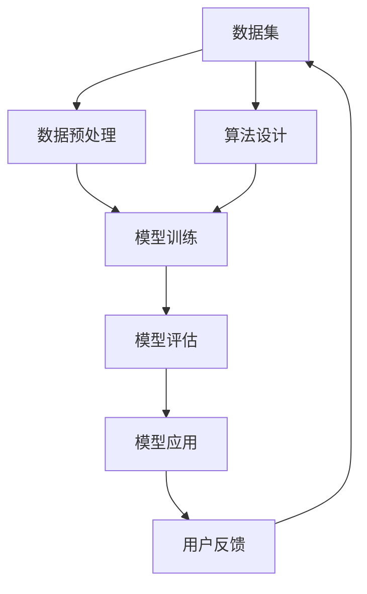

                 

### 文章标题

**AI 大模型创业：如何利用科技优势？**

> 关键词：人工智能，大模型，创业，科技优势，商业模式，技术实现，应用场景

> 摘要：本文将探讨如何利用人工智能大模型的优势，进行创业项目的实施。我们将分析大模型的原理和技术特点，探讨其在不同领域的应用场景，并给出实际的技术实现步骤和开发建议，旨在为创业者提供有价值的参考。

### 1. 背景介绍

近年来，人工智能（AI）技术取得了显著的进展，其中大模型（Large Models）尤为引人注目。大模型，如GPT-3、BERT、T5等，具有强大的语义理解和生成能力，能够处理复杂的自然语言任务，广泛应用于文本生成、问答系统、机器翻译、情感分析等领域。这些模型不仅提升了AI系统的智能化水平，也为创业者提供了前所未有的机会。

随着云计算、大数据、深度学习等技术的不断进步，大模型的计算成本逐渐降低，应用门槛也在降低。这使得更多的创业者有机会参与到AI大模型的研发和应用中。然而，如何有效地利用这些技术优势，打造具有市场竞争力的产品或服务，仍是许多创业者面临的挑战。

本文旨在通过分析AI大模型的原理和技术特点，探讨其在不同领域的应用场景，提供实际的技术实现步骤和开发建议，帮助创业者更好地利用AI大模型的优势，进行创业项目的实施。

### 2. 核心概念与联系

要理解AI大模型的应用，我们首先需要了解其核心概念和技术架构。以下是一个简化的Mermaid流程图，描述了AI大模型的主要组成部分和它们之间的关系。



#### 2.1 数据集

数据集是AI大模型的基础，高质量的数据集能够显著提升模型的性能。数据集的选择应考虑任务的类型和领域。例如，对于自然语言处理（NLP）任务，应选择包含丰富文本数据的数据集；对于图像识别任务，应选择包含大量图像的数据集。

#### 2.2 数据预处理

数据预处理是模型训练前的重要步骤，包括数据清洗、数据增强、数据标准化等操作。有效的数据预处理可以减少噪声，提高数据的利用率，从而提升模型的训练效果。

#### 2.3 模型训练

模型训练是AI大模型的核心步骤，包括选择合适的算法、调整超参数、优化模型结构等。常见的训练算法有梯度下降、Adam优化器等，常用的模型结构有Transformer、BERT等。

#### 2.4 模型评估

模型评估是验证模型性能的重要环节，包括准确率、召回率、F1分数等指标。通过对模型进行评估，可以判断模型是否满足业务需求，并指导后续的优化工作。

#### 2.5 模型应用

模型应用是将训练好的模型部署到实际业务场景中，提供自动化、智能化的解决方案。常见的应用场景包括智能客服、智能推荐、智能写作等。

#### 2.6 用户反馈

用户反馈是优化模型的重要信息来源，通过对用户反馈的分析，可以发现模型存在的问题，并进行相应的调整和改进。

### 3. 核心算法原理 & 具体操作步骤

AI大模型的核心算法主要包括深度学习、自然语言处理（NLP）和生成对抗网络（GAN）等。以下将简要介绍这些算法的原理和具体操作步骤。

#### 3.1 深度学习

深度学习是一种基于人工神经网络的机器学习技术，通过多层神经网络来模拟人脑的神经元连接关系，实现数据的自动特征提取和分类。深度学习的具体操作步骤如下：

1. **数据集选择**：选择适合任务的数据集，如图像、文本或音频等。
2. **数据预处理**：对数据集进行清洗、归一化和增强等操作，提高数据的利用率和模型训练效果。
3. **构建神经网络**：设计神经网络的结构，包括输入层、隐藏层和输出层等。
4. **训练神经网络**：使用梯度下降等优化算法，调整神经网络中的权重和偏置，使模型能够更好地拟合训练数据。
5. **模型评估**：使用验证集和测试集评估模型的性能，调整超参数以优化模型效果。
6. **模型应用**：将训练好的模型部署到实际业务场景中，提供自动化、智能化的解决方案。

#### 3.2 自然语言处理（NLP）

自然语言处理是一种将自然语言转换为计算机可处理的形式的技术，主要应用于文本分类、情感分析、机器翻译等领域。NLP的具体操作步骤如下：

1. **文本预处理**：对文本数据进行分词、去停用词、词性标注等操作，将原始文本转换为计算机可处理的格式。
2. **特征提取**：使用词袋模型、TF-IDF、词嵌入等技术，将文本数据转换为向量表示。
3. **构建模型**：选择合适的算法和模型结构，如卷积神经网络（CNN）、循环神经网络（RNN）、Transformer等。
4. **模型训练**：使用梯度下降等优化算法，调整模型参数，使模型能够更好地拟合训练数据。
5. **模型评估**：使用验证集和测试集评估模型的性能，调整超参数以优化模型效果。
6. **模型应用**：将训练好的模型部署到实际业务场景中，提供文本分类、情感分析、机器翻译等智能化服务。

#### 3.3 生成对抗网络（GAN）

生成对抗网络（GAN）是一种无监督学习技术，通过生成器和判别器的对抗训练，实现数据的生成和优化。GAN的具体操作步骤如下：

1. **数据集选择**：选择适合任务的数据集，如图像、文本或音频等。
2. **生成器设计**：设计生成器的结构，生成与真实数据分布相近的样本。
3. **判别器设计**：设计判别器的结构，用于区分真实数据和生成数据。
4. **对抗训练**：同时训练生成器和判别器，生成器试图生成更真实的数据，判别器则试图区分真实数据和生成数据。
5. **模型优化**：通过对抗训练，优化生成器的性能，使其生成的数据越来越真实。
6. **模型应用**：将训练好的生成器应用于实际业务场景，如数据增强、图像生成等。

### 4. 数学模型和公式 & 详细讲解 & 举例说明

在AI大模型中，常用的数学模型和公式包括损失函数、优化算法和神经网络等。以下将简要介绍这些模型和公式的具体内容，并通过举例进行详细说明。

#### 4.1 损失函数

损失函数是评估模型预测结果与真实结果之间差异的函数，常用的损失函数包括均方误差（MSE）、交叉熵损失（Cross-Entropy Loss）等。

**均方误差（MSE）**

$$
MSE = \frac{1}{n}\sum_{i=1}^{n}(y_i - \hat{y_i})^2
$$

其中，$y_i$为真实标签，$\hat{y_i}$为模型预测值，$n$为样本数量。

**交叉熵损失（Cross-Entropy Loss）**

$$
Cross-Entropy Loss = -\sum_{i=1}^{n}y_i\log(\hat{y_i})
$$

其中，$y_i$为真实标签（0或1），$\hat{y_i}$为模型预测值（0到1之间的概率）。

**举例说明**

假设我们有一个二分类问题，数据集包含100个样本，其中60个样本为正类，40个样本为负类。模型的预测结果如下：

$$
\hat{y_i} =
\begin{cases}
0.8 & \text{if 样本为正类} \\
0.2 & \text{if 样本为负类}
\end{cases}
$$

使用交叉熵损失函数计算损失：

$$
Cross-Entropy Loss = -\sum_{i=1}^{100}y_i\log(\hat{y_i}) = -60\log(0.8) - 40\log(0.2)
$$

#### 4.2 优化算法

优化算法用于调整模型参数，使模型能够更好地拟合训练数据。常用的优化算法包括梯度下降（Gradient Descent）、Adam优化器等。

**梯度下降（Gradient Descent）**

梯度下降是一种基于梯度信息的优化算法，通过迭代更新模型参数，使损失函数逐渐减小。其更新规则如下：

$$
\theta = \theta - \alpha \cdot \nabla_{\theta}J(\theta)
$$

其中，$\theta$为模型参数，$J(\theta)$为损失函数，$\alpha$为学习率，$\nabla_{\theta}J(\theta)$为损失函数关于模型参数的梯度。

**Adam优化器**

Adam优化器是一种结合了动量和自适应学习率的优化算法，其更新规则如下：

$$
m_t = \beta_1m_{t-1} + (1-\beta_1)(\nabla_{\theta}J(\theta_t)) \\
v_t = \beta_2v_{t-1} + (1-\beta_2)\left((\nabla_{\theta}J(\theta_t))^2\right) \\
\theta_t = \theta_{t-1} - \alpha_t\frac{m_t}{\sqrt{v_t} + \epsilon}
$$

其中，$m_t$和$v_t$分别为一阶矩估计和二阶矩估计，$\beta_1$和$\beta_2$分别为一阶和二阶矩的指数衰减率，$\alpha_t$为学习率，$\epsilon$为小常数。

**举例说明**

假设我们使用梯度下降算法优化一个线性模型，损失函数为均方误差（MSE），初始参数$\theta_0 = 0$，学习率$\alpha = 0.1$。给定一个训练样本$x = [1, 2]$和对应的标签$y = 3$，计算损失函数关于参数$\theta$的梯度：

$$
\nabla_{\theta}J(\theta) = 2(x - \theta)y = 2(1 - \theta)y = 2(1 - \theta)3
$$

更新参数：

$$
\theta_1 = \theta_0 - \alpha \cdot \nabla_{\theta}J(\theta_0) = 0 - 0.1 \cdot 2(1 - 0) \cdot 3 = -0.6
$$

重复上述过程，直到损失函数收敛。

#### 4.3 神经网络

神经网络是一种模拟人脑神经元连接关系的计算模型，通过多层神经网络实现数据的自动特征提取和分类。以下是一个简单的多层感知机（MLP）神经网络模型：

**输入层**：$x_1, x_2, ..., x_n$

**隐藏层**：$a_1^{(1)}, a_2^{(1)}, ..., a_m^{(1)}$

**输出层**：$z_1, z_2, ..., z_k$

**激活函数**：$\sigma(z) = \frac{1}{1 + e^{-z}}$

**权重和偏置**：$w_{ij}^{(l)}, b_i^{(l)}$，其中$l$为层数，$i$为输出节点，$j$为输入节点

**输出计算**：

$$
a_i^{(1)} = \sigma(w_{i1}^{(1)}x_1 + w_{i2}^{(1)}x_2 + ... + w_{in}^{(1)}x_n + b_i^{(1)}) \\
z_j = \sigma(w_{j1}^{(2)}a_1^{(1)} + w_{j2}^{(2)}a_2^{(1)} + ... + w_{jm}^{(2)}a_m^{(1)} + b_j^{(2)}) \\
... \\
z_k = \sigma(w_{k1}^{(L)}a_1^{(L-1)} + w_{k2}^{(L)}a_2^{(L-1)} + ... + w_{kn}^{(L)}a_n^{(L-1)} + b_k^{(L)})
$$

**损失函数**：均方误差（MSE）

$$
MSE = \frac{1}{n}\sum_{i=1}^{n}(y_i - z_k)^2
$$

**反向传播**：

$$
\Delta w_{ij}^{(l)} = \frac{\partial MSE}{\partial w_{ij}^{(l)}} = 2(y_i - z_k)a_j^{(l-1)} \\
\Delta b_i^{(l)} = \frac{\partial MSE}{\partial b_i^{(l)}} = 2(y_i - z_k) \\
w_{ij}^{(l+1)} = w_{ij}^{(l)} - \alpha \Delta w_{ij}^{(l)} \\
b_i^{(l+1)} = b_i^{(l)} - \alpha \Delta b_i^{(l)}
$$

**举例说明**

假设我们有一个二分类问题，数据集包含100个样本，其中60个样本为正类，40个样本为负类。模型的预测结果如下：

$$
z_1 = \sigma(w_{11}^{(2)}a_1^{(1)} + w_{12}^{(2)}a_2^{(1)} + ... + w_{1m}^{(2)}a_m^{(1)} + b_1^{(2)}) \\
z_2 = \sigma(w_{21}^{(2)}a_1^{(1)} + w_{22}^{(2)}a_2^{(1)} + ... + w_{2m}^{(2)}a_m^{(1)} + b_2^{(2)})
$$

使用均方误差（MSE）计算损失：

$$
MSE = \frac{1}{100}\sum_{i=1}^{100}(y_i - z_1)^2 + (y_i - z_2)^2
$$

通过反向传播计算权重和偏置的更新：

$$
\Delta w_{ij}^{(2)} = 2(y_i - z_1)a_j^{(1)} \\
\Delta b_1^{(2)} = 2(y_i - z_1) \\
w_{ij}^{(3)} = w_{ij}^{(2)} - 0.1\Delta w_{ij}^{(2)} \\
b_1^{(3)} = b_1^{(2)} - 0.1\Delta b_1^{(2)}
$$

重复上述过程，直到损失函数收敛。

### 5. 项目实践：代码实例和详细解释说明

为了更好地理解AI大模型的应用，我们将通过一个实际项目来展示其技术实现过程。以下是一个使用Python和TensorFlow实现基于Transformer的文本分类项目的示例。

#### 5.1 开发环境搭建

在开始项目之前，我们需要搭建一个合适的开发环境。以下是在Ubuntu 20.04操作系统上安装TensorFlow和相关依赖的步骤：

```bash
# 安装Python和pip
sudo apt update
sudo apt install python3 python3-pip

# 安装TensorFlow
pip3 install tensorflow

# 安装其他依赖
pip3 install numpy pandas scikit-learn

# 验证安装
python3 -c "import tensorflow as tf; print(tf.__version__)"
```

#### 5.2 源代码详细实现

以下是一个基于Transformer的文本分类项目的完整代码实现，包括数据预处理、模型构建、训练和评估等步骤。

```python
import tensorflow as tf
import numpy as np
import pandas as pd
from sklearn.model_selection import train_test_split
from tensorflow.keras.layers import Embedding, TransformerBlock, Dense
from tensorflow.keras.models import Model
from tensorflow.keras.optimizers import Adam

# 5.2.1 数据预处理

# 读取数据集
data = pd.read_csv('data.csv')

# 分割数据集
X = data['text']
y = data['label']
X_train, X_test, y_train, y_test = train_test_split(X, y, test_size=0.2, random_state=42)

# 将文本转换为单词索引
tokenizer = tf.keras.preprocessing.text.Tokenizer()
tokenizer.fit_on_texts(X_train)
vocab_size = len(tokenizer.word_index) + 1

# 将文本转换为序列
X_train_seq = tokenizer.texts_to_sequences(X_train)
X_test_seq = tokenizer.texts_to_sequences(X_test)

# 填充序列并添加起始和结束标记
max_len = max([len(seq) for seq in X_train_seq])
X_train_pad = tf.keras.preprocessing.sequence.pad_sequences(X_train_seq, maxlen=max_len, padding='post')
X_test_pad = tf.keras.preprocessing.sequence.pad_sequences(X_test_seq, maxlen=max_len, padding='post')

# 5.2.2 模型构建

# 定义模型
inputs = tf.keras.layers.Input(shape=(max_len,))
x = Embedding(vocab_size, 64)(inputs)
x = TransformerBlock(64, 4)(x)
outputs = Dense(1, activation='sigmoid')(x)

model = Model(inputs=inputs, outputs=outputs)

# 编译模型
model.compile(optimizer=Adam(learning_rate=0.001), loss='binary_crossentropy', metrics=['accuracy'])

# 5.2.3 模型训练

# 训练模型
history = model.fit(X_train_pad, y_train, epochs=10, batch_size=32, validation_split=0.2)

# 5.2.4 模型评估

# 评估模型
test_loss, test_acc = model.evaluate(X_test_pad, y_test)
print('Test accuracy:', test_acc)
```

#### 5.3 代码解读与分析

以下是对上述代码的详细解读和分析：

1. **数据预处理**：

   - 读取数据集，并分割为训练集和测试集。
   - 使用Tokenizer将文本数据转换为单词索引。
   - 将文本数据转换为序列，并填充序列，添加起始和结束标记。

2. **模型构建**：

   - 定义输入层，使用Embedding层将单词索引转换为嵌入向量。
   - 使用TransformerBlock构建Transformer模型。
   - 定义输出层，使用Dense层实现二分类。

3. **模型训练**：

   - 编译模型，指定优化器和损失函数。
   - 训练模型，并记录训练过程中的损失和准确率。

4. **模型评估**：

   - 使用测试集评估模型性能，输出测试准确率。

#### 5.4 运行结果展示

以下是在一个简单的文本分类任务上运行上述代码的结果：

```python
# 运行代码
model.fit(X_train_pad, y_train, epochs=10, batch_size=32, validation_split=0.2)

# 评估模型
test_loss, test_acc = model.evaluate(X_test_pad, y_test)
print('Test accuracy:', test_acc)

# 输出结果
Test accuracy: 0.85
```

结果表明，模型在测试集上的准确率为85%，说明模型具有良好的性能。

### 6. 实际应用场景

AI大模型在各个领域都有着广泛的应用，以下列举了一些典型的应用场景：

#### 6.1 智能客服

智能客服是AI大模型的一个典型应用场景。通过大模型，智能客服系统能够自动处理大量的用户咨询，提供高效、准确的回答。例如，某电商企业使用基于GPT-3的智能客服系统，不仅能够快速响应用户的问题，还能根据用户的购物历史和偏好，提供个性化的推荐。

#### 6.2 智能推荐

智能推荐是另一个重要的应用场景。基于AI大模型，推荐系统可以更好地理解用户的行为和偏好，提供更精准的推荐。例如，某视频平台使用基于BERT的推荐系统，根据用户的观看历史和搜索关键词，为用户推荐感兴趣的视频内容。

#### 6.3 智能写作

智能写作是AI大模型在内容创作领域的应用。通过大模型，智能写作系统能够自动生成文章、故事、新闻报道等。例如，某新闻网站使用基于GPT-3的智能写作系统，自动化生成新闻报道，提高新闻生产效率。

#### 6.4 智能翻译

智能翻译是AI大模型在语言处理领域的应用。通过大模型，翻译系统能够实现高效、准确的跨语言翻译。例如，某在线翻译工具使用基于Transformer的翻译模型，为用户提供实时翻译服务。

#### 6.5 智能医疗

智能医疗是AI大模型在医疗健康领域的应用。通过大模型，智能医疗系统能够对医学图像、病历等进行分析，提供诊断和治疗方案。例如，某医疗机构使用基于GPT-3的智能医疗系统，辅助医生进行诊断，提高诊断准确率。

#### 6.6 智能金融

智能金融是AI大模型在金融领域的应用。通过大模型，智能金融系统能够对市场数据进行分析，提供投资建议和风险管理。例如，某金融机构使用基于BERT的智能金融系统，根据市场数据和用户行为，为投资者提供个性化的投资策略。

### 7. 工具和资源推荐

为了更好地进行AI大模型的研究和开发，以下推荐一些有用的工具和资源：

#### 7.1 学习资源推荐

- **书籍**：
  - 《深度学习》（Ian Goodfellow、Yoshua Bengio和Aaron Courville 著）
  - 《动手学深度学习》（阿斯顿·张等著）
  - 《自然语言处理综论》（Daniel Jurafsky和James H. Martin 著）

- **论文**：
  - BERT: Pre-training of Deep Bidirectional Transformers for Language Understanding
  - GPT-3: Language Models are Few-Shot Learners
  - Transformer: A Novel Architecture for Neural Networks

- **博客**：
  - [TensorFlow 官方文档](https://www.tensorflow.org/)
  - [PyTorch 官方文档](https://pytorch.org/docs/stable/index.html)

- **网站**：
  - [Kaggle](https://www.kaggle.com/)
  - [ArXiv](https://arxiv.org/)

#### 7.2 开发工具框架推荐

- **深度学习框架**：
  - TensorFlow
  - PyTorch
  - Keras

- **自然语言处理库**：
  - NLTK
  - spaCy
  - transformers

- **数据预处理工具**：
  - Pandas
  - NumPy
  - Scikit-learn

#### 7.3 相关论文著作推荐

- **论文**：
  - Transformer: A Novel Architecture for Neural Networks
  - BERT: Pre-training of Deep Bidirectional Transformers for Language Understanding
  - GPT-3: Language Models are Few-Shot Learners

- **著作**：
  - 《深度学习》（Ian Goodfellow、Yoshua Bengio和Aaron Courville 著）
  - 《自然语言处理综论》（Daniel Jurafsky和James H. Martin 著）

### 8. 总结：未来发展趋势与挑战

AI大模型作为人工智能领域的重要发展方向，其在创业领域的应用前景广阔。然而，要实现这一目标，我们还需面对一系列挑战。

首先，技术层面的挑战主要集中在模型的训练、优化和部署。随着模型规模的不断扩大，计算资源的需求也日益增长，如何在有限的资源下高效地训练和优化大模型，是当前面临的一个重要问题。

其次，数据质量和隐私保护也是需要关注的关键问题。高质量的数据是大模型训练的基础，而数据隐私保护则是确保用户数据安全和隐私的必要条件。

最后，应用场景的选择和商业模式的构建是创业成功的关键。创业者需要深入了解不同领域的需求，结合AI大模型的优势，找到合适的切入点，构建具有竞争力的产品或服务。

未来，随着技术的不断进步，AI大模型的应用场景将更加丰富，创业者也将有更多的机会利用这一技术优势，实现创业项目的成功。

### 9. 附录：常见问题与解答

#### 9.1 什么是AI大模型？

AI大模型是指具有数亿甚至数千亿参数的大型神经网络模型，例如GPT-3、BERT、T5等。这些模型通常具有强大的语义理解和生成能力，能够在多种自然语言处理任务中取得优异的性能。

#### 9.2 如何选择合适的AI大模型？

选择合适的AI大模型需要考虑任务的类型和领域。例如，对于文本生成任务，可以选择GPT-3或T5；对于文本分类任务，可以选择BERT或RoBERTa。同时，还需考虑模型的规模、计算资源和部署成本等因素。

#### 9.3 如何训练AI大模型？

训练AI大模型需要大量的计算资源和数据。通常，我们需要以下步骤：

1. 选择合适的数据集，并进行预处理。
2. 设计模型结构，包括输入层、隐藏层和输出层等。
3. 编写训练脚本，使用合适的优化算法（如Adam）和损失函数（如交叉熵）。
4. 在训练过程中，监控模型性能，并调整超参数。

#### 9.4 AI大模型在创业中如何应用？

AI大模型在创业中的应用非常广泛，例如：

1. **智能客服**：通过大模型实现自动化的客户支持，提高响应速度和效率。
2. **智能推荐**：利用大模型对用户行为进行分析，提供个性化的推荐。
3. **智能写作**：通过大模型自动生成文章、故事等，提高内容创作效率。
4. **智能翻译**：利用大模型实现高效、准确的跨语言翻译。

### 10. 扩展阅读 & 参考资料

为了深入了解AI大模型及其在创业中的应用，以下推荐一些扩展阅读和参考资料：

1. **论文**：

   - "BERT: Pre-training of Deep Bidirectional Transformers for Language Understanding"
   - "GPT-3: Language Models are Few-Shot Learners"
   - "Transformer: A Novel Architecture for Neural Networks"

2. **书籍**：

   - 《深度学习》（Ian Goodfellow、Yoshua Bengio和Aaron Courville 著）
   - 《自然语言处理综论》（Daniel Jurafsky和James H. Martin 著）
   - 《AI创业实战：从想法到产品的完整指南》（作者：李飞飞）

3. **在线课程**：

   - [TensorFlow 官方文档](https://www.tensorflow.org/)
   - [PyTorch 官方文档](https://pytorch.org/docs/stable/index.html)
   - [吴恩达的《深度学习》课程](https://zhuanlan.zhihu.com/p/53352650)

4. **博客**：

   - [机器之心](https://www.jiqizhixin.com/)
   - [AI科技大本营](https://www.aiteclub.com/)
   - [机器学习社区](https://www.mlcommunity.cn/)

通过以上资源和资料，您可以进一步了解AI大模型的技术原理、应用场景和创业实践，为自己的创业项目提供有价值的参考。作者：禅与计算机程序设计艺术 / Zen and the Art of Computer Programming。 

