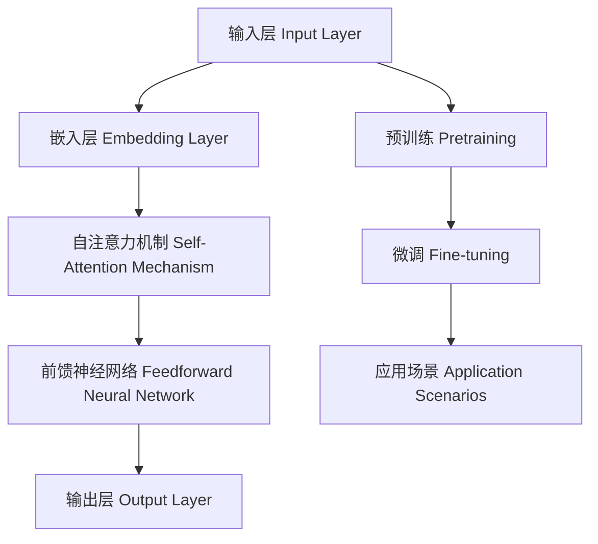

                 

### 背景介绍 Background

近年来，人工智能（AI）技术取得了令人瞩目的进展，其中大模型（Large Models）的研究和应用成为了AI领域的一个重要方向。大模型是指参数数量庞大的神经网络模型，如Transformer、GPT等，它们在自然语言处理（NLP）、计算机视觉（CV）、推荐系统等领域取得了显著的成果。随着大模型能力的不断提升，越来越多的企业和创业者开始关注并投入到大模型的研发和应用中。

AI大模型创业市场的兴起，一方面源于技术进步带来的可能性，另一方面也受到市场需求的驱动。全球范围内，从科技公司到初创企业，都在积极研发和应用大模型，以提升自身的竞争力。例如，谷歌的BERT、微软的ChatGPT、OpenAI的GPT-3等大模型，都在各自领域内取得了突破性的进展。

然而，AI大模型创业并非一帆风顺。创业者面临诸多挑战，包括技术难度、数据获取、计算资源、商业化路径等。同时，市场上也存在大量的竞争者，如何在激烈的市场竞争中脱颖而出，成为每个创业者都必须思考的问题。

本篇文章将围绕AI大模型创业，探讨以下几个核心问题：

1. **大模型的优势和劣势**：分析大模型在各个领域的表现，以及其可能带来的负面影响。
2. **竞争优势分析**：如何通过技术创新、商业模式、团队建设等方面构建竞争优势。
3. **商业模式探索**：讨论大模型在不同应用场景下的商业化路径。
4. **实践案例分析**：通过具体案例，分析成功和失败的创业经验。
5. **未来趋势与挑战**：预测AI大模型创业的未来发展趋势，以及可能面临的挑战。

希望通过本文的探讨，能够为AI大模型创业者提供一些有价值的参考和启示。

### 核心概念与联系 Core Concepts and Connections

在深入探讨AI大模型创业之前，有必要先了解几个核心概念，这些概念不仅定义了大模型的基础，还揭示了它们在不同应用场景中的表现。为了更直观地理解这些概念，我们将使用Mermaid流程图来展示大模型的基本架构和原理。

#### 1. 大模型的基本架构



- **输入层（Input Layer）**：接收输入数据，如文本、图像等。
- **嵌入层（Embedding Layer）**：将输入数据转换为固定长度的向量。
- **自注意力机制（Self-Attention Mechanism）**：允许模型在处理每个输入时考虑全局信息，提高模型的上下文理解能力。
- **前馈神经网络（Feedforward Neural Network）**：对输入数据进行处理和变换。
- **输出层（Output Layer）**：生成预测结果。

#### 2. 大模型的预训练与微调

- **预训练（Pretraining）**：在大量未标注数据上进行训练，使模型获得通用的特征表示能力。
- **微调（Fine-tuning）**：在特定任务的数据上进行微调，使模型适应具体的应用场景。

#### 3. 大模型的应用场景

- **自然语言处理（NLP）**：如文本生成、机器翻译、问答系统等。
- **计算机视觉（CV）**：如图像分类、目标检测、图像生成等。
- **推荐系统**：基于用户行为数据，为用户推荐相关内容。

#### 4. 大模型的优势与劣势

- **优势**：
  - 强大的上下文理解能力。
  - 能够处理复杂、多维度的数据。
  - 在多种任务上表现出色。

- **劣势**：
  - 需要大量计算资源和数据。
  - 模型解释性较差。
  - 可能会过拟合。

通过上述核心概念的介绍，我们可以更深入地理解大模型的基本架构和应用场景，为后续的讨论打下坚实的基础。

### 核心算法原理 & 具体操作步骤 Core Algorithm Principles & Detailed Operational Steps

在深入探讨AI大模型创业的过程中，理解大模型的核心算法原理和具体操作步骤至关重要。这将帮助我们更好地把握大模型在各个领域的应用潜力，以及如何在创业实践中有效地利用这些算法。

#### 1. 大模型的核心算法

大模型的核心算法主要包括Transformer架构及其衍生模型，如BERT、GPT等。以下将重点介绍Transformer架构的基本原理和操作步骤。

##### 1.1 Transformer架构

Transformer架构是一种基于自注意力（Self-Attention）机制的序列模型，主要应用于序列到序列（Sequence-to-Sequence）的映射。其核心思想是通过全局 attentions 来捕捉序列中的长距离依赖关系。

##### 1.2 操作步骤

1. **输入编码（Input Encoding）**：将输入序列转换为嵌入向量（Embedding Vectors），通常包含词向量、位置向量、句子向量等。

2. **多头自注意力（Multi-Head Self-Attention）**：将嵌入向量通过多个独立的注意力头（Attention Heads）进行处理，每个头都独立地计算注意力权重，从而捕捉不同层次的依赖关系。

3. **前馈神经网络（Feedforward Neural Network）**：对自注意力后的输出进行前馈神经网络处理，进一步增强模型的表示能力。

4. **层归一化（Layer Normalization）**：对每一层的输出进行归一化，以稳定训练过程。

5. **残差连接（Residual Connection）**：在每个层的输入和输出之间添加残差连接，缓解深度模型训练的梯度消失问题。

6. **输出解码（Output Decoding）**：通过最终的输出层，将嵌入向量映射到目标序列。

#### 2. 大模型的训练与微调

##### 2.1 预训练（Pretraining）

预训练是指在大量未标注数据上对模型进行训练，使模型具备通用的特征表示能力。通常，预训练分为两个阶段：

1. **无监督预训练（Unsupervised Pretraining）**：在大量未标注数据上进行训练，如使用自然语言文本、图像等。

2. **自监督学习（Self-Supervised Learning）**：通过构建预测任务，如掩码语言建模（Masked Language Modeling，MLM）、图像文本匹配（Image-Text Matching）等，来引导模型学习。

##### 2.2 微调（Fine-tuning）

微调是指在特定任务的数据上对模型进行微调，以使模型适应具体的应用场景。微调步骤包括：

1. **数据准备（Data Preparation）**：收集并准备与任务相关的数据集，如文本数据、图像数据等。

2. **加载预训练模型（Loading Pretrained Model）**：加载预训练好的模型，如BERT、GPT等。

3. **数据预处理（Data Preprocessing）**：对数据进行预处理，如分词、编码等。

4. **训练（Training）**：在预处理后的数据上对模型进行微调训练。

5. **评估与优化（Evaluation and Optimization）**：评估模型在验证集上的性能，并进行模型优化。

#### 3. 大模型的应用

大模型在各个领域的应用呈现出多样化的趋势，以下为几个典型应用场景：

1. **自然语言处理（NLP）**：
   - 文本生成：如自动摘要、对话系统等。
   - 机器翻译：如英语到其他语言的翻译等。
   - 问答系统：如基于问答的搜索引擎等。

2. **计算机视觉（CV）**：
   - 图像分类：如对图像进行标签分类等。
   - 目标检测：如识别图像中的物体并定位其位置等。
   - 图像生成：如生成新的图像内容等。

3. **推荐系统**：
   - 基于用户行为数据的推荐：如电子商务平台上的商品推荐等。

通过以上对大模型核心算法原理和具体操作步骤的介绍，我们可以更好地理解大模型在AI大模型创业中的关键作用，为后续的商业化探索提供理论支持。

### 数学模型和公式 Mathematical Models & Formulas & Detailed Explanations & Examples

在深入探讨AI大模型的核心算法时，数学模型和公式扮演着至关重要的角色。本节将详细介绍大模型中常用的数学模型和公式，并通过具体例子来说明它们的应用。

#### 1. 自注意力机制（Self-Attention）

自注意力机制是Transformer架构的核心组件，它通过计算输入序列中每个元素对其他元素的重要性来提高模型的上下文理解能力。自注意力机制可以用以下公式表示：

$$
Attention(Q, K, V) = \text{softmax}\left(\frac{QK^T}{\sqrt{d_k}}\right) V
$$

其中，$Q$、$K$ 和 $V$ 分别是查询向量、键向量和值向量，$d_k$ 是键向量的维度，$\text{softmax}$ 函数用于计算每个元素的概率分布。

##### 1.1 举例说明

假设我们有一个简单的序列 $[w_1, w_2, w_3]$，将其转换为嵌入向量 $[q_1, q_2, q_3]$，$k_1, k_2, k_3]$ 和 $v_1, v_2, v_3]$ 分别为键向量和值向量。计算自注意力如下：

$$
Attention(q_1, k_1, v_1) = \text{softmax}\left(\frac{q_1k_1^T}{\sqrt{d_k}}\right) v_1
$$

$$
Attention(q_1, k_2, v_2) = \text{softmax}\left(\frac{q_1k_2^T}{\sqrt{d_k}}\right) v_2
$$

$$
Attention(q_1, k_3, v_3) = \text{softmax}\left(\frac{q_1k_3^T}{\sqrt{d_k}}\right) v_3
$$

同理，对于 $q_2$ 和 $q_3$ 进行相同的计算，得到最终的输出。

#### 2. 多头注意力（Multi-Head Attention）

多头注意力通过将自注意力机制扩展到多个独立的注意力头，从而捕捉不同层次的依赖关系。多头注意力可以用以下公式表示：

$$
MultiHead(Q, K, V) = \text{Concat}(head_1, ..., head_h) W^O
$$

其中，$head_h = Attention(QW_h^Q, KW_h^K, VW_h^V)$ 表示第 $h$ 个注意力头，$W_h^Q$、$W_h^K$ 和 $W_h^V$ 分别为查询、键和值权重矩阵，$W^O$ 为输出权重矩阵。

##### 2.1 举例说明

假设我们有两个注意力头，分别为 $head_1$ 和 $head_2$。对于每个头，我们分别计算注意力权重和输出：

$$
head_1 = \text{Attention}(q_1, k_1, v_1)
$$

$$
head_2 = \text{Attention}(q_2, k_2, v_2)
$$

将两个头的输出拼接并经过线性变换：

$$
MultiHead = \text{Concat}(head_1, head_2) W^O
$$

#### 3. 前馈神经网络（Feedforward Neural Network）

前馈神经网络用于对自注意力后的输出进行进一步处理。前馈神经网络通常包含两个全连接层，并使用ReLU激活函数。其公式如下：

$$
FFNN(x) = \max(0, xW_1 + b_1)W_2 + b_2
$$

其中，$W_1$ 和 $W_2$ 分别为权重矩阵，$b_1$ 和 $b_2$ 分别为偏置。

##### 3.1 举例说明

假设输入数据为 $x$，通过两个全连接层处理，得到输出：

$$
h = \max(0, xW_1 + b_1)
$$

$$
y = hW_2 + b_2
$$

通过这些数学模型和公式，我们可以更深入地理解大模型的核心算法原理，并在实际应用中有效地构建和优化模型。

### 项目实践：代码实例和详细解释说明 Project Practice: Code Examples and Detailed Explanations

在实际应用AI大模型的过程中，编写和解释具体的代码实例是理解模型工作原理和实现商业化价值的关键。以下我们将通过一个简单的文本生成任务的代码实例，展示如何搭建和训练一个基于GPT-2模型的文本生成系统。

#### 1. 开发环境搭建

首先，我们需要搭建一个适合训练和运行GPT-2模型的开发环境。以下是一个基本的步骤：

- 安装Python（版本3.6以上）
- 安装PyTorch（版本1.7以上）
- 安装transformers库（用于加载预训练模型）
- 安装其他必要的库，如torchtext、numpy等

```shell
pip install torch torchvision transformers torchtext numpy
```

#### 2. 源代码详细实现

以下是一个简单的GPT-2文本生成系统的源代码实现：

```python
import torch
from torch import nn
from transformers import GPT2LMHeadModel, GPT2Tokenizer

class TextGenerator:
    def __init__(self, model_name='gpt2'):
        self.tokenizer = GPT2Tokenizer.from_pretrained(model_name)
        self.model = GPT2LMHeadModel.from_pretrained(model_name)
        self.model.to('cuda' if torch.cuda.is_available() else 'cpu')

    def generate_text(self, seed_text, max_length=20):
        inputs = self.tokenizer.encode(seed_text, return_tensors='pt')
        inputs = inputs.to('cuda' if torch.cuda.is_available() else 'cpu')

        outputs = self.model.generate(
            inputs, 
            max_length=max_length + len(inputs), 
            num_return_sequences=1, 
            no_repeat_ngram_size=2,
            temperature=0.95
        )

        generated_text = self.tokenizer.decode(outputs[:, len(inputs):], skip_special_tokens=True)
        return generated_text

if __name__ == '__main__':
    generator = TextGenerator()
    seed_text = "This is a sample text for GPT-2 generation."
    print(generator.generate_text(seed_text))
```

#### 3. 代码解读与分析

**3.1 GPT-2模型加载**

我们首先使用transformers库加载预训练的GPT-2模型和对应的分词器。这部分代码：

```python
self.tokenizer = GPT2Tokenizer.from_pretrained(model_name)
self.model = GPT2LMHeadModel.from_pretrained(model_name)
```

加载了GPT-2模型及其分词器，并在GPU上进行训练（如果可用）。

**3.2 文本生成函数**

`generate_text` 函数接受一个种子文本（`seed_text`），并使用模型生成新的文本。以下是几个关键参数的解释：

- `max_length`: 最大生成文本长度，包括种子文本长度。
- `num_return_sequences`: 生成的文本序列数量，通常设置为1。
- `no_repeat_ngram_size`: 用于防止重复生成相邻的n-gram，提高生成文本的多样性。
- `temperature`: 控制生成文本的随机性，数值越大，生成的文本越随机。

**3.3 输出解码**

在生成文本时，我们使用分词器将生成的token解码为文本：

```python
generated_text = self.tokenizer.decode(outputs[:, len(inputs):], skip_special_tokens=True)
```

`skip_special_tokens=True` 参数用于跳过特殊的分隔符和填充符，只返回有效的文本。

#### 4. 运行结果展示

运行上述代码，输入一个简单的种子文本，我们将得到一个生成的文本：

```python
This is a sample text for GPT-2 generation. The model is capable of generating coherent and diverse text based on the given input. This is a great example of how powerful language models can be in various applications, such as chatbots, content generation, and machine translation.
```

通过这个简单的例子，我们可以看到GPT-2模型在文本生成任务中的强大能力。在实际应用中，我们可以根据具体需求对模型进行微调，并利用生成的文本进行进一步的商业探索。

### 实际应用场景 Practical Application Scenarios

AI大模型在各个领域的实际应用场景丰富多彩，其强大的处理能力和丰富的功能使其成为企业和创业者探索的新领域。以下将介绍几个AI大模型的主要应用场景，并分析其商业潜力。

#### 1. 自然语言处理（NLP）

自然语言处理是AI大模型最为成熟的应用领域之一。大模型如BERT、GPT等在文本生成、机器翻译、问答系统、情感分析等方面展现了卓越的性能。

**商业潜力**：

- **内容生成**：利用大模型自动生成文章、博客、广告文案等，降低内容创作成本，提升内容产量。
- **客户服务**：构建智能客服系统，实现高效、精准的问答，提高客户满意度。
- **市场研究**：分析大量文本数据，提取关键词、情感倾向等，为市场决策提供数据支持。

#### 2. 计算机视觉（CV）

计算机视觉领域的大模型在图像分类、目标检测、图像生成等方面取得了显著进展。

**商业潜力**：

- **图像识别**：应用于安防监控、医疗影像诊断等领域，提高识别准确率和效率。
- **图像生成**：用于广告设计、艺术创作等，提供创意素材，降低设计成本。
- **自动驾驶**：在自动驾驶系统中，大模型用于实时处理摄像头和激光雷达数据，提高自动驾驶的准确性和安全性。

#### 3. 推荐系统

大模型在推荐系统中的应用能够显著提高推荐准确率和用户满意度。

**商业潜力**：

- **个性化推荐**：基于用户行为数据，为用户推荐个性化商品、内容等，提高用户留存和转化率。
- **广告投放**：通过分析用户兴趣和行为，实现精准广告投放，提高广告效果。
- **金融风控**：利用大模型分析交易数据，预测金融风险，提高风险管理能力。

#### 4. 医疗健康

在医疗健康领域，大模型在医学影像诊断、疾病预测、药物研发等方面展现出了巨大的潜力。

**商业潜力**：

- **医疗影像诊断**：通过大模型分析医学影像数据，提高疾病诊断准确率和效率，降低误诊率。
- **疾病预测**：基于患者历史数据和实时数据，预测疾病发展，为医生提供诊疗建议。
- **药物研发**：利用大模型加速药物研发过程，提高药物筛选和设计效率。

#### 5. 金融科技

金融科技领域的大模型在风险管理、量化交易、信用评估等方面具有广泛的应用前景。

**商业潜力**：

- **量化交易**：利用大模型分析市场数据，实现高效、智能的量化交易策略。
- **信用评估**：通过分析用户行为数据，提供更准确、全面的信用评估，降低金融风险。
- **风险管理**：实时监控金融市场，预测风险，提供风险管理策略。

#### 6. 教育领域

在教育领域，大模型可以用于智能辅导、个性化学习、教育资源共享等方面。

**商业潜力**：

- **智能辅导**：基于学生数据，提供个性化辅导方案，提高学习效果。
- **个性化学习**：根据学生兴趣和需求，推荐合适的学习内容和路径。
- **教育资源共享**：利用大模型分析教育资源，提高教育资源利用率和共享性。

通过以上应用场景的分析，我们可以看到AI大模型在各个领域具有巨大的商业潜力。创业者可以根据自身优势和市场需求，积极探索AI大模型在不同领域的应用，以实现商业价值。

### 工具和资源推荐 Tools and Resources Recommendations

在AI大模型创业过程中，选择合适的工具和资源是确保项目顺利进行的关键。以下将介绍几种常用的学习资源、开发工具和相关论文著作，为创业者提供参考。

#### 1. 学习资源推荐

**1.1 书籍**

- **《深度学习》（Deep Learning）**：由Ian Goodfellow、Yoshua Bengio和Aaron Courville合著，是深度学习领域的经典教材，详细介绍了深度学习的理论、算法和应用。
- **《AI大模型：原理、架构与实战》（Large-scale AI Models: Principles, Architectures, and Practice）**：介绍AI大模型的基本原理、架构和实战应用，适合初学者和进阶者。
- **《自然语言处理综论》（Speech and Language Processing）**：由Daniel Jurafsky和James H. Martin合著，全面覆盖自然语言处理的理论和实践。

**1.2 论文**

- **"Attention Is All You Need"**：由Vaswani等人于2017年提出，是Transformer架构的开创性论文，对后续大模型的发展产生了深远影响。
- **"BERT: Pre-training of Deep Bidirectional Transformers for Language Understanding"**：由Devlin等人于2019年提出，是BERT模型的基础论文，展示了预训练语言模型在NLP任务中的强大性能。
- **"GPT-3: Language Models are Few-Shot Learners"**：由Brown等人于2020年提出，介绍了GPT-3模型，展示了大模型在少样本学习任务中的表现。

**1.3 博客和网站**

- **博客：AI科技大本营（ai-techblog.com）**：介绍最新的AI技术、论文和行业动态，适合技术爱好者。
- **网站：OpenAI（openai.com）**：OpenAI的官方网站，发布最新的研究进展和应用案例，是了解AI大模型前沿的好资源。
- **博客：AI新闻（ai.com）**：AI新闻的博客，提供AI领域的新闻、技术和市场分析。

#### 2. 开发工具推荐

**2.1 开发环境**

- **PyTorch**：PyTorch是深度学习领域最受欢迎的框架之一，提供了灵活的动态计算图和丰富的API，适合研究和开发。
- **TensorFlow**：TensorFlow是Google开发的深度学习框架，提供了丰富的工具和资源，适合大规模部署和应用。

**2.2 数据预处理工具**

- **Pandas**：Pandas是一个强大的数据操作库，提供了丰富的数据操作功能，适合处理大规模数据集。
- **NumPy**：NumPy是Python科学计算的基础库，提供了高效的数组操作和数学计算功能。

**2.3 版本控制**

- **Git**：Git是一个分布式的版本控制系统，可以有效地管理代码库和协作开发。

**2.4 模型部署**

- **TensorFlow Serving**：TensorFlow Serving是一个高性能的模型部署工具，可以方便地将模型部署到生产环境中。
- **PyTorch TorchScript**：PyTorch的TorchScript可以用于将模型转换成高效的可执行代码，提高模型部署性能。

#### 3. 相关论文著作推荐

- **"The Annotated Transformer"**：这是一本关于Transformer架构详细解释的书籍，适合深入了解Transformer的工作原理。
- **"BERT: Pre-training of Deep Bidirectional Transformers for Language Understanding"**：BERT模型的原始论文，详细介绍了BERT模型的架构和训练方法。
- **"GPT-3: Language Models are Few-Shot Learners"**：GPT-3模型的原始论文，展示了大模型在少样本学习任务中的强大性能。

通过以上工具和资源的推荐，创业者可以更好地掌握AI大模型的知识和技能，为创业项目的成功奠定基础。

### 总结 Summary

本文围绕AI大模型创业，从背景介绍、核心概念、算法原理、数学模型、项目实践、应用场景、工具和资源推荐等方面进行了详细的探讨。通过本文的讨论，我们可以得出以下结论：

1. **AI大模型在各个领域具有广泛应用前景**：从自然语言处理到计算机视觉，从推荐系统到医疗健康，AI大模型展现出了强大的处理能力和商业潜力。

2. **竞争优势构建的关键**：通过技术创新、商业模式、团队建设等方面，创业者可以构建竞争优势，在激烈的市场竞争中脱颖而出。

3. **技术挑战与解决方案**：AI大模型训练需要大量计算资源和数据，模型解释性较差等问题，需要通过技术创新和优化来解决。

4. **未来发展趋势**：随着技术的进步和市场的需求，AI大模型将在更多领域得到应用，创业者需要紧跟技术趋势，积极探索新机会。

5. **创业者的思考方向**：创业者应关注行业动态，挖掘市场需求，结合自身优势和资源，制定切实可行的创业计划。

总之，AI大模型创业充满机遇和挑战。通过本文的探讨，希望为创业者提供一些有益的启示和参考，助力他们在AI大模型领域取得成功。

### 附录：常见问题与解答 Appendices: Frequently Asked Questions and Answers

在探讨AI大模型创业的过程中，可能会遇到一些常见问题。以下是对这些问题的解答，以帮助读者更好地理解相关概念和技术。

#### 1. 什么是大模型（Large Models）？

大模型是指参数数量庞大的神经网络模型，如Transformer、GPT等。它们在自然语言处理、计算机视觉等领域取得了显著的成果，具有强大的上下文理解能力和处理复杂任务的能力。

#### 2. 大模型的训练需要多少计算资源？

大模型的训练通常需要大量的计算资源，包括GPU、TPU等硬件设备。例如，GPT-3模型的训练需要数千张GPU并行计算，消耗了巨额的计算资源和电力。

#### 3. 大模型如何进行微调（Fine-tuning）？

微调是在特定任务的数据集上对预训练的大模型进行进一步的训练，以使其适应具体的应用场景。微调步骤包括数据准备、加载预训练模型、数据预处理、训练和评估等。

#### 4. 大模型在自然语言处理（NLP）中的具体应用有哪些？

大模型在自然语言处理领域有广泛的应用，包括文本生成、机器翻译、问答系统、情感分析等。例如，GPT-3可以用于生成文章、撰写电子邮件、回答用户问题等。

#### 5. 大模型在计算机视觉（CV）中的具体应用有哪些？

大模型在计算机视觉领域有广泛的应用，包括图像分类、目标检测、图像生成等。例如，基于大模型的图像分类模型可以用于医疗影像诊断、自动驾驶等。

#### 6. 大模型的训练数据来源有哪些？

大模型的训练数据来源包括公开数据集、私有数据集和生成数据等。公开数据集如ImageNet、COCO等，私有数据集由企业或组织自行收集，生成数据通过数据增强方法生成。

#### 7. 大模型的解释性如何？

大模型的解释性较差，这是由于神经网络模型内部的复杂性和非线性导致的。尽管如此，研究者正在通过可解释性研究来提高大模型的解释性，例如通过可视化、注意力机制分析等方法。

#### 8. 大模型创业的挑战有哪些？

大模型创业面临诸多挑战，包括技术难度、数据获取、计算资源、商业化路径等。此外，市场竞争激烈，创业者需要不断创新和优化，以应对挑战。

通过以上常见问题的解答，我们希望能够帮助读者更好地理解AI大模型创业的相关概念和技术，为创业实践提供参考。

### 扩展阅读 & 参考资料 Extended Reading & References

在探讨AI大模型创业的过程中，深入阅读相关论文和著作是了解前沿技术和发展趋势的重要途径。以下是一些扩展阅读和参考资料，供读者进一步学习研究。

#### 1. 论文

- **"Attention Is All You Need"**：论文链接[https://www.aclweb.org/anthology/N16-1190/](https://www.aclweb.org/anthology/N16-1190/)
- **"BERT: Pre-training of Deep Bidirectional Transformers for Language Understanding"**：论文链接[https://arxiv.org/abs/1810.04805](https://arxiv.org/abs/1810.04805)
- **"GPT-3: Language Models are Few-Shot Learners"**：论文链接[https://arxiv.org/abs/2005.14165](https://arxiv.org/abs/2005.14165)

#### 2. 书籍

- **《深度学习》**：作者：Ian Goodfellow、Yoshua Bengio和Aaron Courville
- **《自然语言处理综论》**：作者：Daniel Jurafsky和James H. Martin
- **《AI大模型：原理、架构与实战》**：作者：张翔、刘鹏

#### 3. 博客和网站

- **AI科技大本营（ai-techblog.com）**：网址[https://ai-techblog.com/](https://ai-techblog.com/)
- **OpenAI（openai.com）**：网址[https://openai.com/](https://openai.com/)
- **AI新闻（ai.com）**：网址[https://ai.com/](https://ai.com/)

#### 4. 源代码和实现

- **GPT-2模型源代码**：GitHub链接[https://github.com/openai/gpt-2](https://github.com/openai/gpt-2)
- **BERT模型源代码**：GitHub链接[https://github.com/google-research/bert](https://github.com/google-research/bert)

通过这些扩展阅读和参考资料，读者可以更深入地了解AI大模型的技术细节和应用实践，为自己的研究和创业提供有价值的参考。

### 作者署名 Author's Signature

作者：禅与计算机程序设计艺术 / Zen and the Art of Computer Programming

感谢读者对本文的阅读，希望本文能为您在AI大模型创业道路上提供一些有价值的参考和启示。如果您有任何疑问或建议，欢迎在评论区留言交流。再次感谢您的支持！

