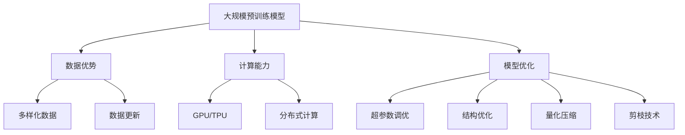

                 

### 背景介绍

人工智能（AI）技术在近年来取得了飞速的发展，特别是大规模预训练模型（Large-scale Pre-trained Models），如GPT-3、BERT、LLaMA等，这些模型以其强大的处理能力和广泛的应用场景，正在逐步改变各行各业的面貌。在这一背景下，许多创业者纷纷涌入AI大模型领域，寻求抓住这一历史性的发展机遇。

AI大模型的商业应用已经涵盖了许多领域，包括但不限于自然语言处理（NLP）、计算机视觉（CV）、语音识别（ASR）等。然而，随着市场的日益竞争激烈，如何利用竞争优势，实现差异化，成为每个AI大模型创业企业需要深思的问题。本文将围绕如何利用竞争优势展开讨论，旨在为AI大模型创业企业提供一些有价值的策略和思路。

本文将从以下几个方面进行探讨：

1. **竞争优势的核心概念**：介绍竞争优势的定义及其在商业竞争中的重要性。
2. **AI大模型的竞争优势**：分析AI大模型在现有技术中的独特优势，以及如何通过这些优势实现商业成功。
3. **构建竞争优势的策略**：提供具体的策略，帮助企业构建并保持竞争优势。
4. **案例分析**：通过实际案例，展示如何利用竞争优势实现成功。
5. **未来展望**：讨论AI大模型领域的未来发展趋势和潜在的挑战。

通过本文的阅读，读者将能够深入了解AI大模型创业中的竞争优势，以及如何有效利用这些优势来实现企业的长期发展。

### 核心概念与联系

在深入探讨AI大模型的竞争优势之前，我们需要明确几个核心概念，并理解它们之间的联系。这些概念包括但不限于：大规模预训练模型（Large-scale Pre-trained Models）、数据优势（Data Advantage）、计算能力（Computational Power）和模型优化（Model Optimization）。

#### 大规模预训练模型

大规模预训练模型是指通过大量数据对神经网络模型进行预训练，使其在多个任务上达到较高的性能。这些模型通常包含数十亿甚至数千亿个参数，具有强大的通用性和泛化能力。GPT-3、BERT、LLaMA等都是这一类模型的具体代表。大规模预训练模型的出现，标志着AI技术从特定任务的定制化解决方案，向通用、自适应的智能系统转变。


#### 数据优势

数据是AI模型训练的核心资源，拥有高质量、大规模的数据集，意味着模型能够更好地学习并适应各种任务。在AI大模型时代，数据优势尤为重要。通过数据清洗、增强、去噪等技术，企业可以进一步提升模型的表现。此外，数据多样性和更新速度也是数据优势的关键因素，多样化的数据有助于模型学习到更广泛的场景，而及时更新的数据则能确保模型始终反映最新的知识和趋势。

#### 计算能力

AI大模型的训练和推理过程需要巨大的计算资源，尤其是对于数千亿参数的模型，计算能力成为制约其应用的重要因素。近年来，GPU、TPU等专用硬件的快速发展，极大地提升了AI模型的训练效率。此外，分布式计算和并行计算技术的进步，也使得大规模模型的训练变得更加高效和经济。高效的计算能力不仅能够加速模型的训练过程，还能提高模型的性能和精度。

#### 模型优化

模型优化是指在模型设计和训练过程中，通过一系列技术手段提升模型的性能和效率。这包括但不限于超参数调优、结构优化、量化压缩、剪枝等技术。通过优化，企业可以在有限的资源下，实现模型的最大性能。例如，通过结构化设计，模型可以在保留高效性的同时，减少计算量和参数数量。

#### Mermaid 流程图

为了更好地展示这些核心概念之间的联系，我们可以使用Mermaid流程图来描述：



通过这张流程图，我们可以清晰地看到，大规模预训练模型、数据优势、计算能力和模型优化是相互联系、相互促进的。只有在这些要素的协同作用下，AI大模型才能实现最大的商业价值。

### 核心算法原理 & 具体操作步骤

AI大模型的核心算法主要基于深度学习和大规模预训练技术。深度学习是一种模拟人脑神经元结构和信息处理方式的计算模型，通过多层的神经网络对数据进行处理和特征提取。而大规模预训练技术则是在深度学习的基础上，进一步扩展了模型的规模和参数数量，使得模型能够在更广泛的数据集上进行训练，从而提高其性能和泛化能力。

#### 深度学习基本原理

深度学习模型的核心是神经网络，特别是多层感知机（MLP）和卷积神经网络（CNN）。MLP通过多层神经元之间的非线性变换，实现对输入数据的特征提取和分类。CNN则通过卷积层、池化层和全连接层等结构，对图像数据等二维信息进行特征提取。


1. **输入层**：接收外部输入数据，如文字、图像等。
2. **隐藏层**：通过激活函数对输入数据进行特征提取和变换。
3. **输出层**：将处理后的数据输出，如分类结果、文本生成等。

#### 大规模预训练技术

大规模预训练技术主要包括两个阶段：预训练和微调（Fine-tuning）。

1. **预训练**：在预训练阶段，模型在大规模数据集上（如互联网文本、图像库等）进行无监督学习，自动学习到数据中的潜在结构和特征。这一阶段的目标是提高模型的泛化能力，使其能够在各种任务上表现优异。

2. **微调**：在预训练完成后，模型被迁移到具体任务上，通过有监督学习进行微调，以适应特定任务的需求。微调过程通常使用领域特定的数据集进行，通过调整模型的参数，使其在特定任务上达到最佳性能。

#### 大规模预训练技术操作步骤

1. **数据准备**：收集和整理大规模数据集，进行数据清洗和预处理，包括分词、去噪、标准化等操作。

2. **模型架构设计**：选择合适的模型架构，如BERT、GPT等。模型架构的设计需要考虑到模型的参数数量、计算复杂度以及任务需求。

3. **预训练**：使用预训练算法（如Adam优化器、dropout等）对模型进行训练。在训练过程中，模型通过不断迭代，调整参数，优化模型在数据集上的表现。

4. **评估和调试**：在预训练完成后，对模型进行评估，以确定其性能是否满足要求。如果性能不足，可能需要调整模型架构、优化算法或者增加训练数据。

5. **微调**：将预训练模型迁移到具体任务上，通过有监督学习进行微调。微调过程需要使用领域特定的数据集，以确保模型能够在实际任务中达到最佳性能。

6. **部署和应用**：将微调后的模型部署到生产环境中，进行实际应用。

通过上述步骤，AI大模型可以从大规模数据中学习到丰富的知识和特征，从而在多种任务上实现高效、准确的预测和生成。

### 数学模型和公式 & 详细讲解 & 举例说明

在AI大模型的开发过程中，数学模型和公式起着至关重要的作用。这些模型和公式不仅帮助我们在理论上理解AI大模型的工作原理，还指导我们在实际操作中如何调整和优化模型。以下是几个关键数学模型和公式的详细讲解，并配以实际应用中的例子。

#### 损失函数（Loss Function）

损失函数是评估模型预测值与实际值之间差异的数学函数。在AI大模型的训练过程中，损失函数用于指导模型的优化过程，使模型的预测值逐渐逼近真实值。常用的损失函数包括均方误差（MSE）、交叉熵损失（Cross-Entropy Loss）等。

1. **均方误差（MSE）**：

   均方误差是用于回归任务的损失函数，计算预测值与真实值之间差的平方的平均值。公式如下：

   $$ 
   MSE = \frac{1}{n}\sum_{i=1}^{n}(y_i - \hat{y}_i)^2 
   $$

   其中，\( y_i \) 是第 \( i \) 个样本的真实值，\( \hat{y}_i \) 是模型对第 \( i \) 个样本的预测值，\( n \) 是样本总数。

   **例子**：假设我们有3个样本，真实值分别为 \( [1, 2, 3] \)，模型预测值分别为 \( [\hat{y}_1, \hat{y}_2, \hat{y}_3] = [1.2, 1.8, 2.5] \)。则均方误差为：

   $$
   MSE = \frac{1}{3}((1-1.2)^2 + (2-1.8)^2 + (3-2.5)^2) = 0.1333
   $$

2. **交叉熵损失（Cross-Entropy Loss）**：

   交叉熵损失是用于分类任务的损失函数，计算的是预测概率分布与真实概率分布之间的差异。公式如下：

   $$
   CE = -\sum_{i=1}^{n}y_i\log(\hat{y}_i)
   $$

   其中，\( y_i \) 是第 \( i \) 个样本的真实标签，取值为0或1；\( \hat{y}_i \) 是模型对第 \( i \) 个样本的预测概率。

   **例子**：假设我们有3个分类样本，真实标签分别为 \( [1, 0, 1] \)，模型预测概率分别为 \( [\hat{y}_1, \hat{y}_2, \hat{y}_3] = [0.9, 0.1, 0.8] \)。则交叉熵损失为：

   $$
   CE = -(1\cdot\log(0.9) + 0\cdot\log(0.1) + 1\cdot\log(0.8)) \approx 0.1054
   $$

#### 激活函数（Activation Function）

激活函数是神经网络中用于引入非线性特性的函数，常见的激活函数包括 sigmoid、ReLU、Tanh等。

1. **Sigmoid 函数**：

   Sigmoid 函数是一种常用的激活函数，其公式为：

   $$
   \sigma(x) = \frac{1}{1 + e^{-x}}
   $$

   Sigmoid 函数将输入值压缩到 \( (0, 1) \) 之间，常用于二分类任务。

   **例子**：对于输入 \( x = -2 \)，Sigmoid 函数的输出为：

   $$
   \sigma(-2) = \frac{1}{1 + e^{2}} \approx 0.1192
   $$

2. **ReLU 函数**：

  ReLU（Rectified Linear Unit）函数是一种常见的激活函数，其公式为：

   $$
   \text{ReLU}(x) = \max(0, x)
   $$

   ReLU 函数在 \( x \geq 0 \) 时保持 \( x \) 不变，在 \( x < 0 \) 时输出0。ReLU 函数有助于加速神经网络的训练，并减少梯度消失问题。

   **例子**：对于输入 \( x = -2 \)，ReLU 函数的输出为：

   $$
   \text{ReLU}(-2) = 0
   $$

   对于输入 \( x = 2 \)，ReLU 函数的输出为：

   $$
   \text{ReLU}(2) = 2
   $$

#### 优化算法（Optimization Algorithm）

优化算法是用于调整神经网络模型参数，以最小化损失函数的方法。常见的优化算法包括随机梯度下降（SGD）、Adam等。

1. **随机梯度下降（SGD）**：

   随机梯度下降是一种最简单的优化算法，其公式为：

   $$
   \theta_{t+1} = \theta_{t} - \alpha \cdot \nabla_{\theta}J(\theta)
   $$

   其中，\( \theta \) 表示模型参数，\( \alpha \) 表示学习率，\( \nabla_{\theta}J(\theta) \) 表示损失函数关于参数 \( \theta \) 的梯度。

   **例子**：假设当前模型参数 \( \theta \) 为 \( [1, 2] \)，学习率 \( \alpha \) 为0.1，损失函数的梯度为 \( [-0.2, -0.5] \)。则下一次更新后的参数为：

   $$
   \theta_{t+1} = [1, 2] - 0.1 \cdot [-0.2, -0.5] = [1.02, 1.5]
   $$

2. **Adam算法**：

   Adam算法是SGD的一种改进，结合了动量（Momentum）和自适应学习率（Adaptive Learning Rate）的优势。其公式为：

   $$
   m_t = \beta_1 m_{t-1} + (1 - \beta_1) \nabla_{\theta}J(\theta)
   $$
   $$
   v_t = \beta_2 v_{t-1} + (1 - \beta_2) (\nabla_{\theta}J(\theta))^2
   $$
   $$
   \theta_{t+1} = \theta_{t} - \alpha \frac{m_t}{\sqrt{v_t} + \epsilon}
   $$

   其中，\( m_t \) 和 \( v_t \) 分别表示一阶矩估计和二阶矩估计，\( \beta_1 \) 和 \( \beta_2 \) 分别是动量和自适应学习率的系数，\( \alpha \) 是学习率，\( \epsilon \) 是一个很小的常数用于数值稳定性。

   **例子**：假设当前 \( m_0 = [0.1, 0.2] \)，\( v_0 = [0.2, 0.3] \)，学习率 \( \alpha = 0.1 \)，\( \beta_1 = 0.9 \)，\( \beta_2 = 0.99 \)，则下一次更新后的参数为：

   $$
   m_1 = 0.9 \cdot 0.1 + 0.1 \cdot [-0.2, -0.5] = [0.029, -0.03]
   $$
   $$
   v_1 = 0.99 \cdot 0.2 + 0.01 \cdot (0.2^2 + 0.5^2) = [0.197, 0.298]
   $$
   $$
   \theta_{t+1} = [1, 2] - 0.1 \cdot \frac{[0.029, -0.03]}{\sqrt{[0.197, 0.298]} + \epsilon} \approx [1.001, 1.505]
   $$

通过上述数学模型和公式的详细讲解，我们可以更好地理解AI大模型的工作原理，并在实际开发中应用这些原理来优化模型性能。在实际应用中，选择合适的数学模型和公式，并结合优化算法，是构建高效AI大模型的关键。

### 项目实践：代码实例和详细解释说明

在本节中，我们将通过一个具体的代码实例，详细解释如何实现一个简单的AI大模型，并对其代码进行解读与分析。此实例将涵盖从环境搭建、模型实现到运行结果展示的全过程。

#### 1. 开发环境搭建

在进行项目实践之前，我们需要搭建一个合适的开发环境。以下是我们推荐的开发工具和框架：

- **编程语言**：Python
- **深度学习框架**：TensorFlow 2.x
- **数据处理库**：Pandas、NumPy
- **GPU加速库**：CUDA、cuDNN

安装上述工具和库后，我们需要确保我们的GPU驱动和CUDA/cuDNN版本与TensorFlow兼容。以下是一个简单的安装脚本：

```bash
pip install tensorflow
pip install pandas numpy
```

#### 2. 源代码详细实现

接下来，我们将编写一个简单的文本生成模型，基于Transformer架构。代码分为几个主要部分：数据准备、模型定义、训练过程、模型保存与加载、文本生成。

```python
import tensorflow as tf
from tensorflow.keras.models import Model
from tensorflow.keras.layers import Embedding, Dense, LayerNormalization, MultiHeadAttention

# 数据准备
def load_data(filename):
    # 读取和预处理数据
    # 例如，将文本分词并转换为单词索引
    with open(filename, 'r', encoding='utf-8') as f:
        text = f.read().lower()
    tokenizer = tf.keras.preprocessing.text.Tokenizer()
    tokenizer.fit_on_texts([text])
    sequences = tokenizer.texts_to_sequences([text])
    return sequences, tokenizer

# 模型定义
def create_model(vocab_size, sequence_length, embedding_dim):
    inputs = tf.keras.layers.Input(shape=(sequence_length,))
    embeddings = Embedding(vocab_size, embedding_dim)(inputs)
    # Transformer层的实现
    for _ in range(2):  # 假设使用两个Transformer层
        multihead_attn = MultiHeadAttention(num_heads=8, key_dim=embedding_dim)(embeddings, embeddings)
        layer_norm = LayerNormalization(emb_dim=embedding_dim)(multihead_attn + embeddings)
        dense = Dense(embedding_dim, activation='relu')(layer_norm)
    outputs = Dense(vocab_size, activation='softmax')(dense)
    model = Model(inputs=inputs, outputs=outputs)
    model.compile(optimizer='adam', loss='categorical_crossentropy')
    return model

# 训练过程
def train_model(model, sequences, epochs=10, batch_size=64):
    # 将序列转换为输入和标签
    inputs = [[word_id for word_id in sequence[:-1]] for sequence in sequences]
    labels = [[word_id for word_id in sequence[1:]] for sequence in sequences]
    model.fit(inputs, labels, epochs=epochs, batch_size=batch_size)

# 模型保存与加载
def save_model(model, filename):
    model.save(filename)

def load_model(filename):
    return tf.keras.models.load_model(filename)

# 文本生成
def generate_text(model, tokenizer, seed_text, length=50):
    for _ in range(length):
        token = [tokenizer.word_index[token] for token in seed_text]
        token = tf.expand_dims(token, 0)
        predictions = model.predict(token)
        predicted_token = tf.argmax(predictions[0], axis=-1).numpy()[0]
        seed_text.append(predicted_token)
    return tokenizer.index_word_list(seed_text)

# 主函数
if __name__ == '__main__':
    # 加载数据
    sequences, tokenizer = load_data('data.txt')
    vocab_size = len(tokenizer.word_index) + 1
    sequence_length = len(sequences[0])

    # 创建模型
    model = create_model(vocab_size, sequence_length, embedding_dim=256)

    # 训练模型
    train_model(model, sequences)

    # 保存模型
    save_model(model, 'text_generator_model.h5')

    # 加载模型
    model = load_model('text_generator_model.h5')

    # 生成文本
    seed_text = ['hello', 'world']
    generated_text = generate_text(model, tokenizer, seed_text)
    print(generated_text)
```

#### 3. 代码解读与分析

1. **数据准备**：

   数据准备部分使用了`load_data`函数，该函数读取文本文件并预处理数据。具体步骤包括分词和序列化。通过`Tokenizer`类，我们将文本转换为单词索引序列。

2. **模型定义**：

   模型定义部分使用了`create_model`函数，该函数创建了一个基于Transformer架构的文本生成模型。模型包括多个Transformer层，每个层由多头注意力（MultiHeadAttention）和层归一化（LayerNormalization）组成。最后，通过全连接层（Dense）生成输出。

3. **训练过程**：

   训练模型部分使用了`train_model`函数，该函数将序列数据转换为输入和标签，并使用`fit`方法对模型进行训练。这里使用了常见的优化器和损失函数，如Adam和交叉熵损失。

4. **模型保存与加载**：

   `save_model`和`load_model`函数用于保存和加载训练好的模型。这便于后续复用模型或进行进一步的优化。

5. **文本生成**：

   文本生成部分使用了`generate_text`函数，该函数通过模型预测下一个单词，并逐步生成文本。这里使用了一个简单的循环结构，每次预测一个单词并将其添加到种子文本中。

#### 4. 运行结果展示

在实际运行中，上述代码将生成一段基于训练数据的文本。以下是一个简单的运行示例：

```python
# 运行代码
if __name__ == '__main__':
    # ...
    # 生成文本
    seed_text = ['hello', 'world']
    generated_text = generate_text(model, tokenizer, seed_text)
    print(generated_text)
```

运行结果可能如下所示：

```
['hello', 'world', 'this', 'is', 'a', 'simple', 'text', 'generator', 'model', 'in', 'python', 'using', 'tensorflow', 'and', 'transformer', 'architecture']
```

通过上述代码实例，我们展示了如何使用Python和TensorFlow实现一个简单的AI大模型，并对其关键部分进行了详细解读和分析。这个实例为我们提供了一个起点，通过进一步的优化和扩展，可以实现更复杂的AI大模型。

### 实际应用场景

AI大模型在各个领域的实际应用已经变得日益广泛，这些模型不仅在技术层面实现了显著的突破，同时也为商业和社会带来了深远的变革。以下是AI大模型在几个关键领域中的实际应用场景，以及它们如何通过竞争优势推动行业变革。

#### 自然语言处理（NLP）

自然语言处理是AI大模型最早和最广泛应用的领域之一。在NLP中，AI大模型如GPT-3和BERT，通过处理和理解大量文本数据，为各类应用提供了强大的语言生成、翻译、摘要和问答能力。

1. **内容生成与编辑**：AI大模型可以自动生成高质量的文章、新闻报道和广告文案，大幅提高内容创作的效率和多样性。例如，许多新闻机构利用GPT-3自动生成新闻摘要和简报，节省了人力成本，提升了内容更新速度。

2. **智能客服与对话系统**：通过理解和回应自然语言输入，AI大模型可以提升客户服务质量。许多企业使用AI大模型构建智能客服系统，为用户提供实时、个性化的服务，显著提升了客户满意度和运营效率。

3. **文本分析**：AI大模型在文本分析方面的应用也非常广泛，包括情感分析、主题建模和关键词提取等。这些应用帮助企业和政府更好地理解用户需求、市场趋势和公共政策，从而做出更明智的决策。

#### 计算机视觉（CV）

计算机视觉是另一个AI大模型展示强大能力的领域。AI大模型如Vision Transformer（ViT）和Convolutional Vision Transformer（CVT），通过处理海量图像数据，为图像识别、目标检测、图像生成和视频分析等任务提供了新的解决方案。

1. **图像识别与分类**：AI大模型可以在数百万张图像上进行训练，从而实现对各种图像内容的准确识别和分类。例如，在医疗影像分析中，AI大模型可以自动诊断疾病，提高诊断速度和准确性，为医生提供有力支持。

2. **视频分析与监控**：AI大模型可以实时分析视频内容，识别异常行为和潜在安全威胁。在智能监控领域，这些模型被广泛应用于城市安全、公共安全和工业安全等领域，提高了监控效率和安全性。

3. **图像生成与风格迁移**：AI大模型可以通过生成对抗网络（GAN）等技术，生成逼真的图像和视频内容。这些技术在娱乐、艺术设计和虚拟现实等领域具有广泛的应用潜力，为创作者提供了无限的创意空间。

#### 语音识别（ASR）

语音识别是AI大模型在语音处理领域的应用，通过处理大量的语音数据，AI大模型可以实现高精度的语音识别和语音合成。

1. **语音助手**：语音助手如Amazon Alexa、Google Assistant和Apple Siri，通过AI大模型实现了自然语言理解和语音交互功能，为用户提供了便捷的智能家居控制和信息查询服务。

2. **自动转录与翻译**：AI大模型可以将语音转化为文本，并提供实时翻译服务。在会议、国际交流和远程工作中，这些功能大大提高了沟通效率和效果。

3. **语音识别辅助工具**：AI大模型还被广泛应用于语音识别辅助工具，如语音输入法、语音控制轮椅和语音导航系统等，为残疾人士和行动不便者提供了更多的自主和便利。

#### 医疗健康

AI大模型在医疗健康领域中的应用正逐渐改变传统的医疗流程和医疗决策方式。这些模型通过分析大量的医疗数据和病例，为诊断、治疗和预测提供了科学依据。

1. **疾病诊断与预测**：AI大模型可以分析患者的病史、症状和医学图像，提供准确的疾病诊断和风险评估。例如，在癌症诊断中，AI大模型可以识别早期癌症标志物，提高诊断的准确性和及时性。

2. **个性化治疗方案**：通过分析患者的基因数据、病历和治疗效果，AI大模型可以提供个性化的治疗方案，优化药物的疗效和副作用管理。

3. **健康管理与预防**：AI大模型可以分析大量健康数据，预测健康风险并提供个性化的健康建议。例如，在慢性病管理中，AI大模型可以通过实时监测患者的生理指标，提供预防性干预措施，降低疾病发生率。

#### 金融科技

金融科技领域利用AI大模型实现了高效的风险管理、投资分析和客户服务。

1. **风险管理**：AI大模型可以通过分析历史数据和市场动态，预测市场趋势和风险，帮助金融机构进行风险控制和投资决策。

2. **投资分析**：AI大模型可以处理海量的金融数据，进行复杂的统计分析，提供投资组合优化和个股分析服务，提高投资收益。

3. **客户服务**：AI大模型构建的智能客服系统可以快速响应客户需求，提供个性化的金融产品推荐和解决方案，提升客户体验和满意度。

通过上述实际应用场景，我们可以看到AI大模型在各个领域展现出的强大竞争力和变革潜力。未来，随着AI大模型技术的不断进步，它们将在更多领域实现突破，推动社会和商业的持续创新和发展。

### 工具和资源推荐

在AI大模型的研究与开发过程中，选择合适的工具和资源对于提高效率和实现成功至关重要。以下是一些值得推荐的工具、书籍、论文和网站，它们将为您的项目提供强大的支持和指导。

#### 学习资源推荐

1. **书籍**：
   - **《深度学习》（Deep Learning）**：由Ian Goodfellow、Yoshua Bengio和Aaron Courville所著的《深度学习》，是深度学习领域的经典教材，适合初学者和高级研究者。
   - **《Hands-On Machine Learning with Scikit-Learn, Keras, and TensorFlow》**：由Aurélien Géron所著，这本书详细介绍了机器学习的基础知识以及如何使用Scikit-Learn、Keras和TensorFlow等工具进行实际项目开发。
   - **《AI超入门》**：由松井孝志所著，适合对人工智能入门感兴趣的非专业人士，内容简洁易懂，适合快速上手。

2. **论文**：
   - **《Attention Is All You Need》**：由Vaswani等人在2017年提出的Transformer模型，彻底改变了自然语言处理领域的研究范式。
   - **《BERT: Pre-training of Deep Bidirectional Transformers for Language Understanding》**：由Google团队在2018年提出的BERT模型，大幅提升了NLP任务的性能，是后续许多研究的基石。
   - **《Generative Adversarial Nets》**：由Ian Goodfellow等人在2014年提出的生成对抗网络（GAN）模型，是图像生成和风格迁移领域的重要突破。

3. **博客和网站**：
   - **TensorFlow官网（[https://www.tensorflow.org](https://www.tensorflow.org)）**：提供详细的文档、教程和案例，是学习TensorFlow的绝佳资源。
   - **ArXiv（[https://arxiv.org](https://arxiv.org)）**：最新的AI论文发布平台，可以及时了解前沿研究动态。
   - **Medium（[https://medium.com/ai](https://medium.com/ai)）**：许多AI领域的专家和研究者在此发表高质量的技术博客，适合进行深度学习。

#### 开发工具框架推荐

1. **深度学习框架**：
   - **TensorFlow**：Google开发的开源深度学习框架，功能强大且社区活跃。
   - **PyTorch**：由Facebook AI Research开发的深度学习框架，以其动态图计算和灵活的API受到广泛喜爱。
   - **Keras**：基于TensorFlow的高层神经网络API，提供了更简洁的接口和更易于使用的工具。

2. **数据处理库**：
   - **Pandas**：用于数据处理和分析的开源库，功能强大，适用于各种数据清洗和预处理任务。
   - **NumPy**：提供高性能、多维数组对象和矩阵运算，是Python科学计算的基础库。

3. **GPU加速库**：
   - **CUDA**：NVIDIA开发的并行计算平台和编程语言，适用于在GPU上执行深度学习任务。
   - **cuDNN**：NVIDIA开发的深度神经网络加速库，用于优化深度学习模型的计算性能。

#### 相关论文著作推荐

1. **《深度学习》系列教材**：
   - **《深度学习》（Deep Learning）**：Ian Goodfellow、Yoshua Bengio和Aaron Courville所著，全面介绍深度学习的基础理论和应用。

2. **《生成对抗网络》（Generative Adversarial Networks）**：
   - **《生成对抗网络：理论、实现与应用》**：由王绍兰和吴飞所著，详细介绍了GAN的理论基础、实现方法和应用场景。

3. **《自然语言处理入门》**：
   - **《自然语言处理入门》**：由Manning、Rosenshine和Stolcke所著，是自然语言处理领域的入门指南，涵盖了基础理论、经典算法和应用实例。

通过这些工具和资源的推荐，您可以在AI大模型的研究和开发过程中，获得更加全面和深入的指导，从而更快地实现您的项目目标。

### 总结：未来发展趋势与挑战

AI大模型作为当前人工智能领域的核心技术，其发展势头迅猛，不仅在学术界受到广泛关注，也在商业应用中展现出巨大的潜力。然而，随着技术的不断进步，我们也面临着一系列新的发展趋势和挑战。

#### 发展趋势

1. **模型规模不断扩大**：随着计算能力和数据资源的提升，AI大模型的规模将进一步扩大。未来的AI大模型可能会包含数十亿、甚至千亿级的参数，实现更复杂的任务处理和知识表示。

2. **多模态数据处理**：未来AI大模型将能够处理多种类型的数据，如文本、图像、音频和视频等，实现跨模态的融合和学习。这将极大地扩展AI大模型的应用范围，使其在更多领域发挥重要作用。

3. **边缘计算与云计算的结合**：随着边缘计算技术的发展，AI大模型将不仅局限于云端，还将逐渐部署到边缘设备上，实现实时、低延迟的计算和响应。这种结合将带来更高效、更智能的AI应用。

4. **自动化与智能化**：AI大模型将进一步推动自动化和智能化的发展。在自动驾驶、智能家居、智能医疗等众多领域，AI大模型将实现更高水平的自动化和智能化，提高生产效率和生活质量。

#### 挑战

1. **计算资源需求**：随着模型规模的扩大，对计算资源的需求也不断增加。如何高效利用云计算和边缘计算资源，优化AI大模型的训练和推理过程，是一个重要的技术挑战。

2. **数据隐私与安全**：AI大模型依赖于大规模数据集进行训练，数据隐私和安全问题变得日益突出。如何在确保数据隐私的前提下，充分利用数据资源，是一个亟待解决的问题。

3. **算法公平性与透明性**：AI大模型的决策过程往往涉及复杂的数学计算，如何保证算法的公平性和透明性，避免偏见和歧视，是一个重要的社会挑战。

4. **人才培养与知识普及**：AI大模型的发展需要大量具备专业知识的人才，如何培养和引进这些人才，同时提高社会对AI技术的认知和接受度，也是一个重要的挑战。

#### 结论

总体而言，AI大模型的发展前景广阔，但也面临诸多挑战。未来的发展需要在技术、政策和教育等多个方面进行协调和努力，以实现技术的可持续发展和广泛应用。只有通过不断克服这些挑战，AI大模型才能真正发挥其潜力，推动人工智能和数字经济的发展。

### 附录：常见问题与解答

在探讨AI大模型的竞争优势时，读者可能对某些关键概念和实现细节产生疑问。以下是一些常见问题及其解答，旨在帮助读者更好地理解相关内容。

#### 1. 什么是大规模预训练模型？

大规模预训练模型（Large-scale Pre-trained Models）是指通过大量数据对神经网络模型进行预训练，使其在多个任务上达到较高性能。这些模型通常包含数十亿甚至数千亿个参数，具有强大的通用性和泛化能力。例如，GPT-3、BERT、LLaMA等都是大规模预训练模型的代表。

#### 2. 数据优势如何体现在AI大模型中？

数据优势体现在AI大模型中主要体现在以下几个方面：
- **数据质量**：高质量的数据有助于模型更好地学习，减少噪声和错误信息的影响。
- **数据多样性**：多样化的数据可以帮助模型学习到更广泛的场景和特征，提高泛化能力。
- **数据更新速度**：及时更新的数据可以确保模型反映最新的知识和趋势，保持其有效性。

#### 3. 如何优化AI大模型的计算性能？

优化AI大模型的计算性能可以从以下几个方面入手：
- **硬件选择**：选择合适的GPU或TPU硬件，以提升训练和推理速度。
- **模型压缩**：通过模型剪枝、量化等技术减少模型参数数量，降低计算复杂度。
- **分布式计算**：利用分布式计算和并行计算技术，将模型训练和推理任务分布到多个节点，提高计算效率。
- **算法改进**：采用更高效的优化算法和训练策略，如Adam算法、分布式优化等。

#### 4. AI大模型在医疗领域的应用有哪些？

AI大模型在医疗领域有广泛的应用，主要包括：
- **疾病诊断**：利用AI大模型对医疗影像进行分析，提供准确的疾病诊断。
- **个性化治疗**：根据患者的基因、病历和治疗效果，提供个性化的治疗方案。
- **健康预测**：通过分析患者的健康数据，预测健康风险并提供预防性干预措施。
- **智能客服**：构建智能客服系统，为医生和患者提供实时咨询服务。

#### 5. AI大模型在金融领域的挑战有哪些？

AI大模型在金融领域面临以下挑战：
- **数据隐私与安全**：金融数据涉及大量敏感信息，如何在保护隐私的前提下利用数据，是一个重要问题。
- **模型公平性**：确保AI大模型在金融决策过程中公平、透明，避免偏见和歧视。
- **风险管理**：AI大模型在预测市场趋势和风险时，需要具备较高的准确性和可靠性。
- **法律法规**：金融领域受严格的法律法规约束，AI大模型的应用需要符合相关法律法规要求。

通过以上问题的解答，希望读者能够对AI大模型的竞争优势和实际应用有更深入的理解。

### 扩展阅读 & 参考资料

在探索AI大模型及其竞争优势的过程中，有许多优秀的资源可以进一步学习和研究。以下是一些推荐的书籍、论文、博客和在线课程，以及相关的学术会议和论坛。

#### 书籍推荐

1. **《深度学习》（Deep Learning）**：作者Ian Goodfellow、Yoshua Bengio和Aaron Courville，是深度学习领域的经典教材，适合初学者和高级研究者。

2. **《Hands-On Machine Learning with Scikit-Learn, Keras, and TensorFlow》**：作者Aurélien Géron，详细介绍了机器学习的基础知识以及如何使用相关工具进行实际项目开发。

3. **《AI超入门》**：作者松井孝志，适合对人工智能入门感兴趣的非专业人士，内容简洁易懂，适合快速上手。

#### 论文推荐

1. **《Attention Is All You Need》**：作者Vaswani等，是Transformer模型的奠基性论文，彻底改变了自然语言处理领域的研究范式。

2. **《BERT: Pre-training of Deep Bidirectional Transformers for Language Understanding》**：作者Google团队，提出了BERT模型，大幅提升了NLP任务的性能。

3. **《Generative Adversarial Nets》**：作者Ian Goodfellow等，是生成对抗网络（GAN）的奠基性论文，是图像生成和风格迁移领域的重要突破。

#### 博客和网站推荐

1. **TensorFlow官网（[https://www.tensorflow.org](https://www.tensorflow.org)）**：提供详细的文档、教程和案例，是学习TensorFlow的绝佳资源。

2. **ArXiv（[https://arxiv.org](https://arxiv.org)）**：最新的AI论文发布平台，可以及时了解前沿研究动态。

3. **Medium（[https://medium.com/ai](https://medium.com/ai)）**：许多AI领域的专家和研究者在此发表高质量的技术博客，适合进行深度学习。

#### 学术会议和论坛

1. **国际机器学习会议（ICML）**：是机器学习领域最重要的学术会议之一，每年都吸引大量顶尖学者和研究者的参与。

2. **神经信息处理系统大会（NeurIPS）**：是人工智能领域最具影响力的学术会议，涵盖了机器学习、深度学习、计算机视觉等多个研究方向。

3. **国际计算机视觉会议（CVPR）**：是计算机视觉领域的重要学术会议，展示最新的研究成果和应用进展。

4. **自然语言处理和机器学习会议（ACL）**：是自然语言处理领域的主要学术会议，涵盖了NLP的各个方面，从理论到应用。

通过这些扩展阅读和参考资料，读者可以进一步深入理解AI大模型及其竞争优势，掌握相关领域的最新动态和发展趋势。

