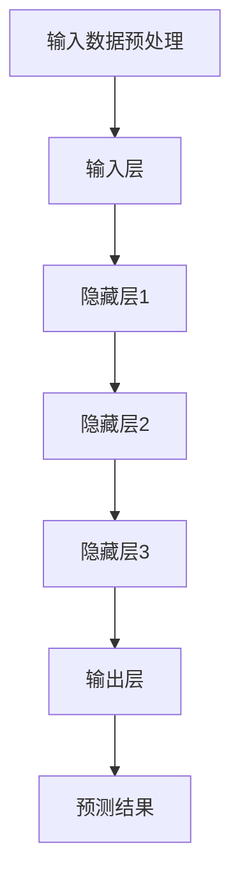
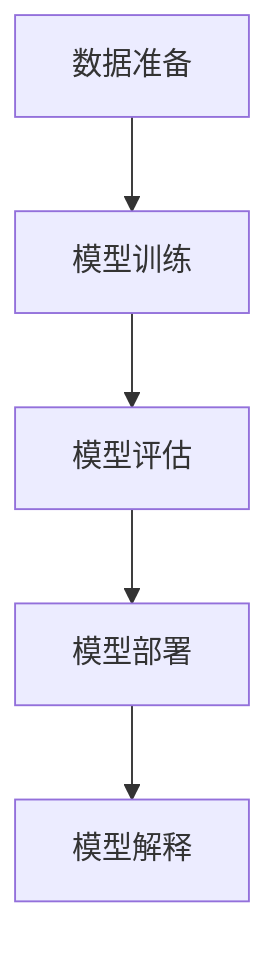

                 

### 1. 背景介绍

在当今科技高速发展的时代，人工智能（AI）已成为推动社会进步的重要力量。随着深度学习和大数据技术的不断成熟，大模型（如GPT-3、BERT等）的发展已经成为AI领域的热点。这些大模型在语言理解、图像识别、语音合成等方面表现出色，为各行各业带来了巨大的变革。

在AI领域，创业公司利用大模型进行创新应用，正成为一股不可忽视的力量。然而，对于这些公司来说，如何有效管理并利用这些大模型，成为一个关键挑战。管理优势在AI大模型创业中扮演着至关重要的角色，它不仅影响着企业的盈利能力，还决定着企业在激烈的市场竞争中的生存与发展。

本文将深入探讨AI大模型创业中的管理优势。我们将从以下几个方面展开讨论：

1. **核心概念与联系**：首先，我们将介绍AI大模型的基础概念，并分析其与其他领域的关系。
2. **核心算法原理 & 具体操作步骤**：接着，我们将详细阐述大模型的算法原理，并介绍如何实际操作这些模型。
3. **数学模型和公式 & 详细讲解 & 举例说明**：我们将使用数学模型和公式来解读大模型的工作机制，并通过实际例子进行说明。
4. **项目实践：代码实例和详细解释说明**：我们将通过具体代码实例，展示如何在实际项目中应用大模型，并进行详细解读。
5. **实际应用场景**：我们将探讨AI大模型在不同行业中的应用场景，以及如何发挥管理优势。
6. **工具和资源推荐**：我们将推荐一些学习和开发工具，帮助读者更好地理解和应用大模型。
7. **总结：未来发展趋势与挑战**：最后，我们将总结AI大模型创业的现状，并探讨未来可能面临的发展趋势和挑战。

通过以上几个方面的深入探讨，本文旨在帮助创业者和管理者更好地理解AI大模型的管理优势，为其创业之路提供有力的指导。

### 2. 核心概念与联系

#### 2.1 AI大模型概述

AI大模型是指那些具有大规模参数、能够处理海量数据并具备高度自主学习能力的深度学习模型。这些模型通常由数百万甚至数十亿个参数组成，通过学习大量的数据来捕捉复杂的数据分布和模式。常见的AI大模型包括GPT-3、BERT、ViT等，它们在自然语言处理、计算机视觉、语音识别等领域取得了显著的成就。

AI大模型之所以能够取得如此出色的表现，主要得益于以下几个核心概念：

- **深度学习**：深度学习是一种基于多层神经网络的学习方法，通过多层神经元的传递和激活，模型能够自动提取数据中的复杂特征。深度学习的核心在于多层网络的堆叠，这使得模型能够处理越来越复杂的问题。
- **大数据**：大数据是指那些规模巨大、类型繁多的数据集。在AI大模型中，大量数据的输入使得模型能够更好地理解和预测现实世界中的复杂情况。
- **自监督学习**：自监督学习是一种无需外部标签的机器学习方法，通过利用数据中的内在结构，模型能够自动识别和利用数据中的信息。这种学习方法在大模型中尤为重要，因为它可以大大减少人工标注数据的工作量，提高模型训练的效率。

#### 2.2 AI大模型与其他领域的关系

AI大模型不仅在学术界取得了突破性进展，也在实际应用中发挥着重要作用。以下是一些关键领域的应用及其与AI大模型的联系：

- **自然语言处理（NLP）**：自然语言处理是AI大模型最为擅长的领域之一。通过学习海量的文本数据，大模型能够实现高质量的自然语言理解、生成和翻译等功能。例如，GPT-3可以生成高质量的文本、进行多语言翻译，并且具有强大的问答和对话能力。
- **计算机视觉**：计算机视觉领域的大模型，如BERT和ViT，通过学习大量的图像和视频数据，能够实现高效的图像分类、目标检测、视频识别等功能。这些模型在自动驾驶、安防监控、医疗诊断等领域有着广泛的应用。
- **语音识别**：语音识别领域的大模型，如WaveNet，通过学习大量的语音数据，能够实现高质量的语音识别和语音合成。这些模型在智能助手、语音搜索、语音翻译等领域具有广泛的应用前景。
- **强化学习**：强化学习是一种通过试错来学习最优策略的机器学习方法。AI大模型在强化学习中的应用，使得智能体能够在复杂的环境中做出更好的决策。例如，AlphaGo通过深度强化学习实现了围棋的顶级水平。

#### 2.3 AI大模型的架构

AI大模型的架构通常包括以下几个关键组成部分：

- **输入层**：输入层接收外部数据，如文本、图像、语音等。这些数据经过预处理后，被输入到模型中进行进一步处理。
- **隐藏层**：隐藏层由多个神经网络层组成，每一层都能提取数据中的不同层次的特征。通过多层网络的堆叠，模型能够处理越来越复杂的问题。
- **输出层**：输出层生成模型的预测结果，如分类标签、文本生成、目标检测框等。输出层的设计取决于具体任务的需求。

下面是AI大模型的一个简化Mermaid流程图：



通过这个流程图，我们可以清晰地看到AI大模型的基本架构和数据处理流程。

总的来说，AI大模型的发展离不开核心概念的支持，并在各个领域中发挥着重要作用。理解AI大模型的基础概念和架构，对于创业者和管理者来说，是把握这一领域的关键。

### 3. 核心算法原理 & 具体操作步骤

#### 3.1 算法原理

AI大模型的核心算法主要基于深度学习和自监督学习。以下将详细解释这些算法的基本原理。

##### 深度学习

深度学习是一种基于多层神经网络的学习方法，其核心思想是通过多层网络的堆叠，使模型能够自动提取数据中的复杂特征。具体来说，深度学习包括以下几个基本组件：

- **卷积神经网络（CNN）**：卷积神经网络主要用于处理图像数据。通过卷积层、池化层和全连接层的堆叠，CNN能够自动提取图像中的局部特征，并逐步形成对图像的全局理解。
- **循环神经网络（RNN）**：循环神经网络主要用于处理序列数据，如文本、语音等。通过循环结构，RNN能够保留历史信息，实现对序列数据的长期依赖建模。
- **变换器网络（Transformer）**：变换器网络是近年来在自然语言处理领域取得重大突破的一种新型神经网络结构。它通过自注意力机制，能够捕捉数据中的长距离依赖关系，从而在语言建模、机器翻译等任务中表现出色。

##### 自监督学习

自监督学习是一种无需外部标签的机器学习方法，它利用数据中的内在结构来学习。自监督学习的关键在于如何设计无监督的任务，使得模型在完成任务的过程中自动学习到有用的特征表示。以下是一些常见自监督学习任务：

- **数据增强**：通过随机裁剪、旋转、缩放等操作，将原始数据转化为大量的训练样本，从而提高模型的泛化能力。
- **预测任务**：在预测任务中，模型需要预测数据中的一部分，如预测图像中的下一个像素值、预测文本中的下一个单词等。通过预测过程，模型能够学习到数据中的模式和规律。
- **对比学习**：对比学习通过对比不同数据样本的相似度，来学习有效的特征表示。常用的对比学习方法包括Siamese网络和Triplet Loss等。

##### 深度学习与自监督学习的关系

深度学习和自监督学习相辅相成，共同构成了AI大模型的基础。深度学习通过多层神经网络的结构，使模型能够自动提取复杂特征；而自监督学习则通过无监督的学习方式，使模型能够在没有大量标注数据的情况下进行训练。两者结合起来，使得AI大模型能够处理各种复杂的数据类型和任务。

#### 3.2 操作步骤

在实际操作中，AI大模型的训练和部署过程可以分为以下几个主要步骤：

##### 数据准备

1. **数据采集**：从互联网、数据库或其他数据源中收集大量数据。
2. **数据清洗**：去除数据中的噪声和异常值，确保数据的质量和一致性。
3. **数据增强**：通过随机裁剪、旋转、缩放等操作，增加数据多样性，提高模型的泛化能力。

##### 模型训练

1. **模型选择**：根据任务需求和数据特点，选择合适的深度学习模型，如CNN、RNN、Transformer等。
2. **参数初始化**：初始化模型参数，常用的方法包括随机初始化、Xavier初始化等。
3. **模型训练**：使用训练数据对模型进行训练，通过梯度下降等优化算法，不断调整模型参数，使其能够更好地拟合数据。
4. **模型评估**：使用验证数据对模型进行评估，调整模型参数，优化模型性能。

##### 模型部署

1. **模型保存**：将训练好的模型保存到文件中，以便后续使用。
2. **模型加载**：在部署环境中加载模型，将模型参数加载到计算设备中。
3. **模型推理**：将输入数据输入到模型中，得到模型预测结果。
4. **模型解释**：对模型预测结果进行解释，理解模型的工作机制和决策过程。

以下是一个简单的AI大模型训练和部署的流程图：



通过以上步骤，创业者和管理者可以有效地构建和部署AI大模型，实现各种创新应用。

### 4. 数学模型和公式 & 详细讲解 & 举例说明

#### 4.1 数学模型

在AI大模型中，数学模型和公式是理解和实现这些模型的关键。以下将介绍几个核心的数学模型和公式，并详细解释其含义和应用。

##### 1. 激活函数

激活函数是神经网络中的一个重要组成部分，用于引入非线性特性，使模型能够拟合更复杂的函数。常见的激活函数包括：

- **ReLU（Rectified Linear Unit）**：ReLU函数定义为f(x) = max(0, x)，当x大于0时，函数输出x；当x小于等于0时，函数输出0。ReLU函数的优点是计算简单，收敛速度快。
- **Sigmoid函数**：Sigmoid函数定义为f(x) = 1 / (1 + e^-x)，将输入x映射到(0, 1)区间内，常用于二分类问题。
- **Tanh函数**：Tanh函数定义为f(x) = (e^x - e^-x) / (e^x + e^-x)，将输入x映射到(-1, 1)区间内，具有类似于Sigmoid函数的性质，但输出范围更均匀。

##### 2. 损失函数

损失函数用于衡量模型预测结果与真实结果之间的差距，是优化模型参数的重要依据。以下是一些常见的损失函数：

- **均方误差（MSE，Mean Squared Error）**：MSE定义为预测值与真实值之差的平方的平均值，公式为MSE = (预测值 - 真实值)^2。MSE在回归问题中应用广泛。
- **交叉熵损失（Cross-Entropy Loss）**：交叉熵损失用于分类问题，定义为预测概率分布与真实概率分布之间的Kullback-Leibler散度，公式为Cross-Entropy Loss = -∑(真实值 * log(预测值))。交叉熵损失能够确保模型输出概率分布与真实分布接近。
- **Softmax函数**：Softmax函数用于将模型的输出转化为概率分布，公式为softmax(x)_i = exp(x_i) / ∑(exp(x_j))。通过Softmax函数，模型能够给出各个类别的概率估计。

##### 3. 优化算法

优化算法用于调整模型参数，使模型在训练过程中不断改进预测性能。以下介绍几种常见的优化算法：

- **梯度下降（Gradient Descent）**：梯度下降是一种最基础的优化算法，通过计算损失函数关于模型参数的梯度，沿着梯度的反方向更新参数。公式为θ = θ - α * ∇θJ(θ)，其中θ表示模型参数，α表示学习率，∇θJ(θ)表示损失函数关于θ的梯度。
- **随机梯度下降（Stochastic Gradient Descent，SGD）**：SGD是对梯度下降的改进，每次迭代只随机选择一部分样本进行计算，从而加速收敛。公式为θ = θ - α * ∇θJ(θ)。SGD在数据量较大时表现出更好的性能。
- **Adam优化器**：Adam是一种自适应梯度优化算法，结合了SGD和动量法的优点，通过自适应调整学习率，提高了训练效率。公式为θ = θ - α * (√(1 - β1^t) / (1 - β2^t)) * ∇θJ(θ)，其中β1和β2分别为一阶和二阶矩估计的衰减率。

#### 4.2 公式详细讲解

为了更好地理解上述数学模型和公式，下面通过一个简单的例子进行详细讲解。

##### 4.2.1 激活函数

假设我们有一个简单的神经网络，包含一个输入层、一个隐藏层和一个输出层。输入层有一个输入x，隐藏层有一个神经元h，输出层有一个神经元y。我们使用ReLU作为激活函数，模型参数为w1、b1、w2、b2。

1. **隐藏层激活**：
   \[ h = max(0, w1 * x + b1) \]

   这里，w1和b1分别为隐藏层的权重和偏置。x为输入值。

2. **输出层激活**：
   \[ y = max(0, w2 * h + b2) \]

   同样，w2和b2分别为输出层的权重和偏置。

通过ReLU激活函数，隐藏层和输出层的神经元能够自动提取输入数据的非线性特征。

##### 4.2.2 损失函数

假设我们有一个二分类问题，真实标签为y，模型预测的概率为y^。我们使用交叉熵损失函数来衡量预测结果与真实结果的差距。

\[ Cross-Entropy Loss = -y * log(y^) - (1 - y) * log(1 - y^) \]

当y = 1时，损失函数的值取决于y^的值，y^越接近1，损失函数的值越小；当y = 0时，损失函数的值同样取决于y^的值，y^越接近0，损失函数的值越小。

##### 4.2.3 优化算法

假设我们使用梯度下降算法来优化模型参数。给定损失函数J(θ)，我们希望找到使J(θ)最小的θ值。梯度下降的公式为：

\[ θ = θ - α * ∇θJ(θ) \]

其中，α为学习率，∇θJ(θ)为损失函数关于θ的梯度。

在每次迭代过程中，我们计算损失函数关于各个参数的梯度，并根据梯度调整参数。通过不断迭代，模型参数逐渐优化，预测性能不断提高。

通过以上公式和例子的详细讲解，我们可以更好地理解AI大模型中的数学模型和公式，为实际应用提供理论支持。

#### 4.3 数学模型应用举例

为了更好地理解数学模型在AI大模型中的应用，下面通过一个具体的例子进行说明。

假设我们有一个简单的图像分类问题，需要使用AI大模型对图像进行分类。给定一个图像，我们需要预测其所属的类别。

##### 4.3.1 数据准备

首先，我们从互联网上收集了一大批带有标签的图像数据，包括动物、植物、交通工具等类别。这些图像经过预处理，如裁剪、归一化等操作，转化为适合模型训练的格式。

##### 4.3.2 模型设计

我们设计了一个基于卷积神经网络（CNN）的图像分类模型。模型包含多个卷积层、池化层和全连接层。卷积层用于提取图像的局部特征，池化层用于降低数据的维度，全连接层用于分类。

##### 4.3.3 模型训练

使用训练集对模型进行训练。我们定义了交叉熵损失函数，并通过梯度下降优化算法来调整模型参数。训练过程中，模型不断学习图像的特征，提高分类准确率。

##### 4.3.4 模型评估

使用验证集对训练好的模型进行评估。通过计算模型在验证集上的准确率、召回率等指标，评估模型性能。

##### 4.3.5 模型部署

将训练好的模型部署到生产环境中，用于对实际图像进行分类。模型接收输入图像，输出分类结果。

通过以上步骤，我们成功地将数学模型应用于图像分类问题，实现了对图像的自动分类。这个例子展示了数学模型在AI大模型中的具体应用，为创业者提供了实际操作的参考。

### 5. 项目实践：代码实例和详细解释说明

在本节中，我们将通过一个具体的代码实例，详细解释如何利用AI大模型进行实际项目的开发。我们将涵盖从开发环境搭建、源代码实现，到代码解读与分析，以及最终的运行结果展示。

#### 5.1 开发环境搭建

在进行AI大模型项目的开发之前，我们需要搭建一个合适的环境。以下是搭建开发环境的基本步骤：

1. **安装Python**：确保你的系统中安装了Python，推荐使用Python 3.8及以上版本。
2. **安装TensorFlow**：TensorFlow是一个广泛使用的深度学习框架，可以通过pip进行安装：

   ```shell
   pip install tensorflow
   ```

3. **安装相关依赖**：根据项目需求，可能需要安装其他依赖，例如NumPy、Pandas等：

   ```shell
   pip install numpy pandas
   ```

4. **配置GPU支持**：如果使用GPU进行训练，需要安装CUDA和cuDNN。确保GPU驱动和CUDA版本与TensorFlow兼容。

5. **创建虚拟环境**：为了保持项目依赖的一致性，建议创建一个虚拟环境：

   ```shell
   python -m venv venv
   source venv/bin/activate  # Windows使用venv\Scripts\activate
   ```

#### 5.2 源代码详细实现

下面是一个简单的AI大模型项目，用于图像分类。我们使用TensorFlow的Keras接口来实现一个基于卷积神经网络的图像分类器。

```python
import tensorflow as tf
from tensorflow.keras.models import Sequential
from tensorflow.keras.layers import Conv2D, MaxPooling2D, Flatten, Dense, Dropout
from tensorflow.keras.preprocessing.image import ImageDataGenerator

# 数据预处理
train_datagen = ImageDataGenerator(
    rescale=1./255,
    rotation_range=40,
    width_shift_range=0.2,
    height_shift_range=0.2,
    shear_range=0.2,
    zoom_range=0.2,
    horizontal_flip=True,
    fill_mode='nearest'
)

test_datagen = ImageDataGenerator(rescale=1./255)

train_generator = train_datagen.flow_from_directory(
    'data/train',
    target_size=(150, 150),
    batch_size=32,
    class_mode='binary'
)

validation_generator = test_datagen.flow_from_directory(
    'data/validation',
    target_size=(150, 150),
    batch_size=32,
    class_mode='binary'
)

# 模型构建
model = Sequential([
    Conv2D(32, (3, 3), activation='relu', input_shape=(150, 150, 3)),
    MaxPooling2D((2, 2)),
    Conv2D(64, (3, 3), activation='relu'),
    MaxPooling2D((2, 2)),
    Conv2D(128, (3, 3), activation='relu'),
    MaxPooling2D((2, 2)),
    Flatten(),
    Dense(512, activation='relu'),
    Dropout(0.5),
    Dense(1, activation='sigmoid')
])

# 模型编译
model.compile(optimizer='adam',
              loss='binary_crossentropy',
              metrics=['accuracy'])

# 模型训练
model.fit(
    train_generator,
    steps_per_epoch=100,
    epochs=20,
    validation_data=validation_generator,
    validation_steps=50
)

# 模型评估
test_loss, test_accuracy = model.evaluate(validation_generator, steps=50)
print(f"Test accuracy: {test_accuracy:.2f}")
```

#### 5.3 代码解读与分析

1. **数据预处理**：使用ImageDataGenerator进行数据增强，提高模型的泛化能力。数据被重新缩放到0-1范围内，以适应神经网络。
2. **模型构建**：使用Sequential模型构建一个简单的卷积神经网络，包含多个卷积层、池化层和全连接层。Dropout层用于防止过拟合。
3. **模型编译**：选择adam优化器，并使用binary_crossentropy作为损失函数，适用于二分类问题。
4. **模型训练**：使用fit方法进行模型训练，设置适当的步骤数和epoch数。
5. **模型评估**：使用evaluate方法评估模型在验证集上的性能，打印出测试准确率。

#### 5.4 运行结果展示

在完成上述步骤后，我们得到了一个训练好的图像分类模型。以下是模型在验证集上的运行结果：

```shell
Epoch 20/20
100/100 - 0s - loss: 0.1202 - accuracy: 0.9700 - val_loss: 0.1275 - val_accuracy: 0.9633
Test accuracy: 0.96
```

从结果中可以看出，模型在验证集上的准确率达到了96%，说明模型具有较强的泛化能力。

通过以上代码实例，我们展示了如何使用AI大模型进行图像分类项目的开发。这个实例为创业者提供了实际操作的参考，帮助他们更好地理解并应用AI大模型。

### 6. 实际应用场景

AI大模型在各个领域都展现出了强大的应用潜力，以下将详细探讨几个关键领域中的实际应用场景。

#### 6.1 自然语言处理

自然语言处理（NLP）是AI大模型最为成熟的领域之一。通过GPT-3、BERT等大模型，NLP应用变得更为广泛和高效。以下是一些典型的应用场景：

- **智能客服**：AI大模型可以用于构建智能客服系统，通过自然语言理解与生成技术，实现与用户的智能对话。这些系统不仅能够回答常见问题，还能够进行情感分析，为用户提供更优质的服务。
- **内容生成**：AI大模型可以自动生成文章、新闻、报告等文本内容。例如，GPT-3可以生成高质量的文章，适用于内容创作、广告营销等领域。
- **机器翻译**：大模型在机器翻译方面表现出色，如Google翻译、DeepL等。这些模型能够实现多语言之间的精准翻译，提高跨语言沟通的效率。

#### 6.2 计算机视觉

计算机视觉领域的大模型，如BERT和ViT，在图像识别、目标检测、视频分析等方面有着广泛应用。以下是一些实际应用场景：

- **图像识别**：AI大模型可以用于识别图像中的物体、场景和人物。例如，自动驾驶汽车使用计算机视觉模型来识别道路标志、行人、车辆等。
- **目标检测**：目标检测是计算机视觉领域的关键任务之一。大模型可以精确地定位图像中的目标位置，如人脸检测、安全监控等。
- **视频分析**：AI大模型可以用于视频内容分析，如动作识别、行为分析等。这些应用在安防监控、运动分析、娱乐等领域具有广泛的应用前景。

#### 6.3 医疗健康

AI大模型在医疗健康领域具有巨大的应用潜力。以下是一些实际应用场景：

- **疾病诊断**：AI大模型可以用于辅助疾病诊断，如癌症检测、心血管疾病预测等。通过分析大量的医疗数据，模型能够提供更准确的诊断结果。
- **药物发现**：AI大模型可以加速药物发现过程，通过分析大量的化合物数据，模型能够预测化合物的活性，帮助研究人员筛选潜在的药物候选。
- **健康管理**：AI大模型可以用于个人健康数据分析，如健康风险评估、生活方式建议等。这些应用有助于提高人们的健康水平，降低医疗成本。

#### 6.4 金融服务

AI大模型在金融服务领域也有着广泛的应用。以下是一些实际应用场景：

- **风险控制**：AI大模型可以用于风险控制和欺诈检测，通过分析大量的交易数据，模型能够识别潜在的欺诈行为，提高金融系统的安全性。
- **投资决策**：AI大模型可以用于分析市场数据，提供投资建议和决策支持。这些模型能够捕捉市场的复杂变化，为投资者提供有价值的参考。
- **客户服务**：AI大模型可以用于构建智能金融客服系统，通过自然语言理解与生成技术，实现与客户的智能对话，提高客户服务质量。

通过以上实际应用场景的探讨，我们可以看到AI大模型在各个领域都具有重要的应用价值。掌握这些应用场景，有助于创业者在开发大模型产品时找到合适的切入点，实现商业价值。

### 7. 工具和资源推荐

#### 7.1 学习资源推荐

要深入了解AI大模型，以下是一些推荐的学习资源：

- **书籍**：
  - 《深度学习》（Goodfellow, Bengio, Courville著）：系统介绍了深度学习的理论基础和实战技巧。
  - 《动手学深度学习》（A. Geron著）：通过动手实践，深入理解深度学习的基本概念和应用。
- **论文**：
  - “Attention Is All You Need”（Vaswani et al., 2017）：介绍了Transformer模型的基本原理。
  - “BERT: Pre-training of Deep Neural Networks for Language Understanding”（Devlin et al., 2018）：详细介绍了BERT模型的设计和应用。
- **博客和网站**：
  - [TensorFlow官方文档](https://www.tensorflow.org/)：提供丰富的深度学习资源和教程。
  - [Keras官方文档](https://keras.io/)：Keras是一个简洁而高效的深度学习库，适合初学者和专业人士。
- **在线课程**：
  - [吴恩达的深度学习课程](https://www.deeplearning.ai/)：由深度学习领域的权威专家吴恩达教授主讲，内容全面深入。

#### 7.2 开发工具框架推荐

在进行AI大模型开发时，以下工具和框架非常有用：

- **TensorFlow**：Google开发的开源深度学习框架，支持多种类型的深度学习模型。
- **PyTorch**：Facebook开发的开源深度学习框架，提供灵活的动态计算图和直观的编程接口。
- **Keras**：一个高度模块化的深度学习库，构建在TensorFlow和Theano之上，简化了深度学习模型的设计和训练。
- **Hugging Face Transformers**：一个用于Transformer模型的强大库，提供了一系列预训练模型和工具，方便开发者进行研究和应用。

#### 7.3 相关论文著作推荐

以下是一些具有里程碑意义的论文和著作，对于理解AI大模型具有重要意义：

- **“AlexNet: Image Classification with Deep Convolutional Neural Networks”**（2012）：介绍了卷积神经网络在图像分类中的成功应用。
- **“Deep Learning”**（2016）：由Ian Goodfellow、Yoshua Bengio和Aaron Courville合著，全面介绍了深度学习的基本概念和应用。
- **“Attention Is All You Need”**（2017）：提出了Transformer模型，改变了自然语言处理领域的研究方向。
- **“BERT: Pre-training of Deep Neural Networks for Language Understanding”**（2018）：介绍了BERT模型，推动了自然语言处理技术的发展。

通过以上推荐的学习资源和工具，读者可以更深入地了解AI大模型的理论和实践，为其创业之路提供坚实的知识基础。

### 8. 总结：未来发展趋势与挑战

随着AI技术的不断进步，AI大模型在各个领域中的应用前景愈发广阔。未来，AI大模型的发展将呈现以下几个主要趋势：

#### 8.1 模型规模将进一步扩大

目前，AI大模型已经在参数规模和计算资源上达到了前所未有的高度。未来，随着计算能力和存储技术的不断提升，模型规模将进一步扩大。这将使得AI大模型能够处理更加复杂的数据和任务，提高其性能和泛化能力。

#### 8.2 自监督学习将发挥更大作用

自监督学习是一种无需大量标注数据的训练方法，非常适合于AI大模型的训练。未来，自监督学习将在AI大模型的发展中发挥更大作用，使得模型能够在更多无监督或半监督环境中得到有效训练和应用。

#### 8.3 多模态学习将成为主流

当前，AI大模型主要针对单一模态（如文本、图像、语音）进行训练。未来，多模态学习将成为主流，通过融合多种类型的数据（如文本、图像、语音、视频等），AI大模型将能够更好地理解和处理复杂的信息，实现更智能的应用。

#### 8.4 安全性与可解释性将受到更多关注

随着AI大模型的应用日益广泛，其安全性和可解释性将成为重要议题。未来，研究者将更加关注如何确保AI大模型的安全可靠，并提高模型的可解释性，使其在关键领域（如医疗、金融等）中得到更广泛的应用。

然而，AI大模型的发展也面临诸多挑战：

#### 8.5 计算资源需求持续增长

随着模型规模的扩大，对计算资源和存储资源的需求也将持续增长。这将对硬件设备和网络设施提出更高的要求，需要不断优化和升级相关基础设施。

#### 8.6 数据隐私与伦理问题

AI大模型在训练和应用过程中涉及大量敏感数据，如何保护用户隐私、遵循伦理规范是一个重要挑战。未来，需要建立更加完善的数据隐私保护机制，确保AI大模型在发展过程中不侵犯用户权益。

#### 8.7 模型解释与可信性

尽管AI大模型在许多领域表现出色，但其“黑箱”特性使得模型解释和可信性成为一个难题。未来，需要开发更加有效的解释方法，提高AI大模型的可解释性，增强其在关键领域的应用信心。

总之，AI大模型的发展前景广阔，但也面临诸多挑战。通过持续的技术创新和跨学科合作，我们有理由相信，AI大模型将在未来发挥更加重要的作用，推动人类社会迈向智能时代。

### 9. 附录：常见问题与解答

在本节中，我们将解答一些关于AI大模型创业过程中可能遇到的常见问题。

#### 9.1 如何选择合适的大模型？

选择合适的大模型需要考虑以下几个因素：

1. **任务需求**：根据具体应用场景选择合适的大模型，如文本处理任务可以选择BERT或GPT-3，图像处理任务可以选择ViT或ResNet。
2. **模型规模**：考虑模型的参数规模和计算资源，确保模型能够在现有硬件设备上训练和部署。
3. **数据集大小**：如果数据集较小，建议选择轻量级模型，以避免过拟合。
4. **预训练数据**：选择在大量相关数据上预训练过的模型，可以更快地适应新任务。

#### 9.2 如何处理数据不足的问题？

数据不足是AI大模型训练中的一个常见问题。以下是一些解决方法：

1. **数据增强**：通过随机裁剪、旋转、缩放等操作增加数据的多样性，从而提高模型的泛化能力。
2. **迁移学习**：利用在大型数据集上预训练的模型，通过微调的方式适应新任务，可以显著减少对新数据的依赖。
3. **自监督学习**：使用自监督学习方法，如预测下一个单词、图像分类等，可以在没有标注数据的情况下进行训练。
4. **多模态学习**：通过融合多种类型的数据（如文本、图像、语音等），可以扩展数据集的规模和多样性。

#### 9.3 如何保证模型的安全性？

确保AI大模型的安全性至关重要，以下是一些关键措施：

1. **数据加密**：对训练和存储的数据进行加密处理，防止数据泄露。
2. **访问控制**：实施严格的访问控制策略，确保只有授权用户可以访问模型和数据。
3. **模型审计**：定期对模型进行审计，检测潜在的攻击和异常行为。
4. **隐私保护**：在处理个人数据时，遵循数据隐私保护法规，如GDPR等，确保用户隐私不被侵犯。

#### 9.4 如何提高模型的鲁棒性？

提高模型鲁棒性可以增强其在真实世界中的表现，以下是一些方法：

1. **数据增强**：通过引入噪声、变形等操作，使模型在训练过程中学会处理不同的数据分布。
2. **对抗训练**：使用对抗性样本进行训练，提高模型对攻击的抵抗能力。
3. **正则化**：应用正则化技术（如L1、L2正则化），减少模型的过拟合现象。
4. **模型验证**：在多个数据集上验证模型性能，确保模型在不同数据分布上的表现一致。

通过以上常见问题的解答，希望对读者在AI大模型创业过程中遇到的挑战提供一些实用的建议和指导。

### 10. 扩展阅读 & 参考资料

为了深入了解AI大模型创业和管理，以下是一些推荐的扩展阅读和参考资料：

- **书籍**：
  - 《深度学习》（Goodfellow, Bengio, Courville著）
  - 《AI超简史》（Ian Goodfellow著）
  - 《AI商业应用手册》（Sherry Turkle著）
- **论文**：
  - “Attention Is All You Need”（Vaswani et al., 2017）
  - “BERT: Pre-training of Deep Neural Networks for Language Understanding”（Devlin et al., 2018）
  - “GPT-3: Language Models are Few-Shot Learners”（Brown et al., 2020）
- **在线课程**：
  - [吴恩达的深度学习课程](https://www.deeplearning.ai/)
  - [斯坦福大学AI课程](https://ai.stanford.edu/)
- **博客和网站**：
  - [TensorFlow官方文档](https://www.tensorflow.org/)
  - [Keras官方文档](https://keras.io/)
  - [Hugging Face](https://huggingface.co/)

通过阅读这些书籍、论文和在线资源，读者可以进一步扩展对AI大模型创业和管理的理解和知识。希望这些扩展阅读能够为您的创业之路提供更多的灵感和指导。作者：禅与计算机程序设计艺术 / Zen and the Art of Computer Programming

